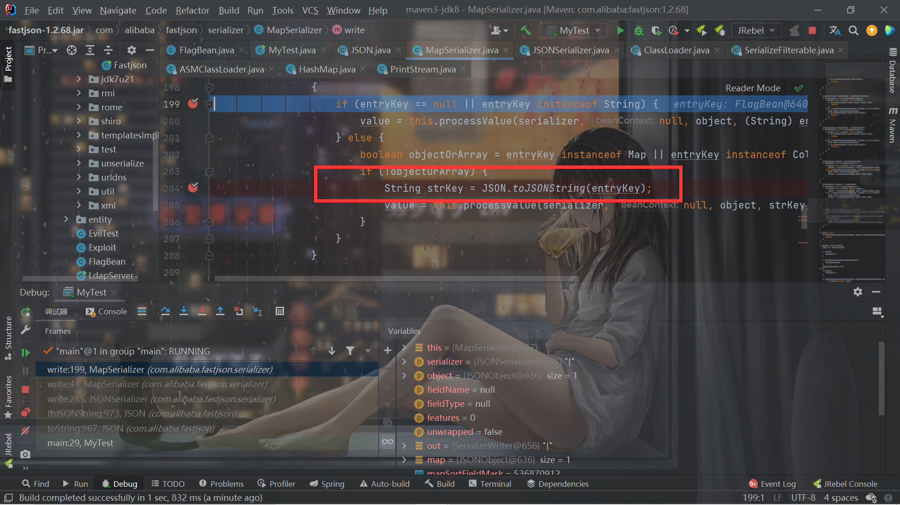

# 2022-卷王杯-happyFastjson

## 前言

昨天看了fastjson，因为最近比赛的fastjson出现的有点多。卷王杯Y4出了道fastjson的题目，考点是比较基础的东西，学习一波。

## 分析

```java
import java.io.ByteArrayOutputStream;
import java.io.InputStream;
import java.util.HashMap;
import java.util.Map;

public class FlagBean {
    private int count = 0;
    private boolean status = false;
    public String free;
    public String flab;

    public FlagBean() {
    }

    public String getFree() {
        return this.free;
    }

    public void setFree(String free) {
        this.free = free;
    }

    public Map getMap() {
        --this.count;
        return null;
    }
    public Map getFlag() {
        System.out.println("getFlag");
        ++this.count;
        if (this.count >= 2) {
            HashMap hashMap = new HashMap();
            hashMap.put("flag", "flag{123}");
            return hashMap;
        } else {
            HashMap hashMap = new HashMap();
            hashMap.put("flag", "Hacker? hhd");
            return hashMap;
        }
    }
}
```

```java
return StringUtils.check(poc) ? JSON.parse(poc).toString() : "Hacker? ";
```

主要就是fastjson反序列化触发2次`getFlag()`方法。

触发getter会想到`$ref`，但是被ban掉了，那么就想想办法，怎么在调用`JSON.parse`的时候触发getter。

首先是这个：

> **get开头的方法要求如下：**
>
> - 方法名长度大于等于4
> - 非静态方法
> - 以get开头且第4个字母为大写
> - 无传入参数
> - 返回值类型继承自Collection Map AtomicBoolean AtomicInteger AtomicLong

只有满足这个要求的getter才会在JSON.parse的时候触发。

但是这才触发1次。

注意到后面`return StringUtils.check(poc) ? JSON.parse(poc).toString() : "Hacker? ";`还调用了一次，toString()，跟进去就发现是：

```java
    public String toString() {
        return toJSONString();
    }
```

估计大概率还能触发getter了，实际上也确实是这样，最后跟进下去，有2处可能触发getter：

第一处：



第二处：


我的payload：

```json
poc={{"@type":"com.ctfshow.happyfjs.Beans.FlagBean","flag":{"@type":"java.until.Map"}}:"a"}
```

可以触发3次getFlag，第一次是parse的时候，第二次就是`JSON.toJSONString(entryKey)`，因为这时候的`objectOrArray`为false，第三次就是`serializer.write(entryKey);`。


官方的payload只能触发2次，因为`entryKey instanceof Map`为true所以`objectOrArray`为true，这样第二次无法触发。


