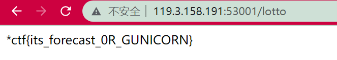

# 2022-*CTF-Web-Writeup

## oh-my-lotto

```python

from flask import Flask,render_template, request
import os

app = Flask(__name__, static_url_path='')

def safe_check(s):
    if 'LD' in s or 'HTTP' in s or 'BASH' in s or 'ENV' in s or 'PROXY' in s or 'PS' in s: 
        return False
    return True

@app.route("/", methods=['GET', 'POST'])
def index():
    return render_template('index.html')

@app.route("/lotto", methods=['GET', 'POST'])
def lotto():
    message = ''

    if request.method == 'GET':
        return render_template('lotto.html')

    elif request.method == 'POST':
        flag = os.getenv('flag')
        lotto_key = request.form.get('lotto_key') or ''
        lotto_value = request.form.get('lotto_value') or ''
        try:
            lotto_key = lotto_key.upper()
        except Exception as e:
            print(e)
            message = 'Lotto Error!'
            return render_template('lotto.html', message=message)
        
        if safe_check(lotto_key):
            os.environ[lotto_key] = lotto_value
            try:
                os.system('wget --content-disposition -N lotto')

                if os.path.exists("/app/lotto_result.txt"):
                    lotto_result = open("/app/lotto_result.txt", 'rb').read()
                else:
                    lotto_result = 'result'
                if os.path.exists("/app/guess/forecast.txt"):
                    forecast = open("/app/guess/forecast.txt", 'rb').read()
                else:
                    forecast = 'forecast'

                if forecast == lotto_result:
                    return flag
                else:
                    message = 'Sorry forecast failed, maybe lucky next time!'
                    return render_template('lotto.html', message=message)
            except Exception as e:
                message = 'Lotto Error!'
                return render_template('lotto.html', message=message)
                
        else:
            message = 'NO NO NO, JUST LOTTO!'
            return render_template('lotto.html', message=message)
            
@app.route("/forecast", methods=['GET', 'POST'])
def forecast():

    message = ''
    if request.method == 'GET':
        return render_template('forecast.html')
    elif request.method == 'POST':
        if 'file' not in request.files:
            message = 'Where is your forecast?'
            
        file = request.files['file']
        file.save('/app/guess/forecast.txt')
        message = "OK, I get your forecast. Let's Lotto!"
        return render_template('forecast.html', message=message)

@app.route("/result", methods=['GET'])
def result():

    if os.path.exists("/app/lotto_result.txt"):
        lotto_result = open("/app/lotto_result.txt", 'rb').read().decode()
    else:
        lotto_result = ''
    
    return render_template('result.html', message=lotto_result)
        

if __name__ == "__main__":
    app.run(debug=True,host='0.0.0.0', port=8080)

```

需要预测随机数，利用wget下载下来之后与上传的进行对比，而且可以知道上一次下载得到的随机数。可以设置环境变量但是有waf。


直接改PATH使得找不到wget命令就无法下载到新的，只能利用旧从而实现攻击。

先随便`/lotto`一次来获取，然后设置成`PATH`：`/tmp`，然后访问`/result`获取上一次的值转成文件传上去：

```python
with open("1.txt","wb") as f:
    a = "30 35 6 8 20 31 22 22 25 12 18 22 12 33 11 13 16 9 39"
    a = a.replace(" ","\n")
    f.write(a.encode())
```

然后再`/lotto`就可以获得flag。

