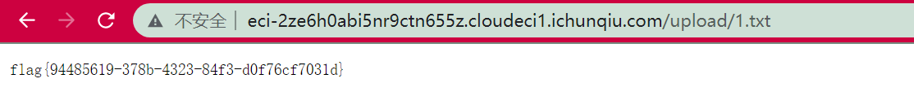

# 前言

太难了。。。


# ez piwigo

利用插件应该是非预期了，所以后来又出了个`ez piwigo again`。

admin,admin登录后进`admin.php`后台。piwigo的版本是11.5.0，很新的版本，估计预期解是个0day了。。真就0dayctf呜呜呜。

`LocalFiles Editor`这是一个文件操作的插件，尝试直接编辑配置文件但是提示local目录不可写，所以没法直接利用插件来写马。后来又挖了这个插件的任意文件读取漏洞，但是发现读`/flag`读不到，拿了shell才知道还是权限问题，得`/readflag`才行，所以这个插件得任意文件读取就不说了，直接说shell。

也是在Jiang师傅的提示下才看到的，最容易忽略的地方：

```php
function eval_syntax($code)
{
  $code = str_replace(array('<?php', '?>'), '', $code);
  if (function_exists('token_get_all'))
  {
    $b = 0;
    foreach (token_get_all($code) as $token)
    {
      if ('{' == $token) ++$b;
      else if ('}' == $token) --$b;
    }
    if ($b) return false;
    else
    {
      ob_start();
      $eval = eval('if(0){' . $code . '}');
      ob_end_clean();
      if ($eval === false) return false;
    }
  }
  return '<?php' . $code . '?>';
}
```

在编辑php文件的时候会检查语法是否错误，把`<?php`和`?>`给置空后，把剩下的代码扔到这里然后执行执行：

```php
eval('if(0){' . $code . '}');
```

所以直接执行就可以了：




