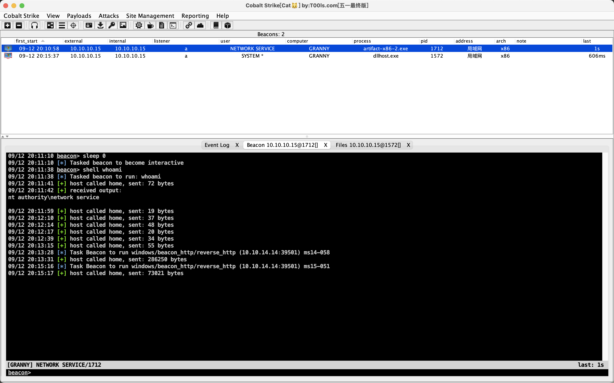

# README

## nmap

```shell
17:27:23 › sudo nmap -T4 -A -v 10.10.10.15
Password:
Starting Nmap 7.93 ( https://nmap.org ) at 2023-09-12 19:48 CST
NSE: Loaded 155 scripts for scanning.
NSE: Script Pre-scanning.
Initiating NSE at 19:48
Completed NSE at 19:48, 0.00s elapsed
Initiating NSE at 19:48
Completed NSE at 19:48, 0.00s elapsed
Initiating NSE at 19:48
Completed NSE at 19:48, 0.00s elapsed
Initiating Ping Scan at 19:48
Scanning 10.10.10.15 [4 ports]
Completed Ping Scan at 19:48, 0.28s elapsed (1 total hosts)
Initiating Parallel DNS resolution of 1 host. at 19:48
Completed Parallel DNS resolution of 1 host. at 19:48, 0.04s elapsed
Initiating SYN Stealth Scan at 19:48
Scanning 10.10.10.15 [1000 ports]
Discovered open port 80/tcp on 10.10.10.15
Completed SYN Stealth Scan at 19:48, 21.71s elapsed (1000 total ports)
Initiating Service scan at 19:48
Scanning 1 service on 10.10.10.15
Completed Service scan at 19:48, 6.50s elapsed (1 service on 1 host)
Initiating OS detection (try #1) against 10.10.10.15
Retrying OS detection (try #2) against 10.10.10.15
Initiating Traceroute at 19:48
Completed Traceroute at 19:48, 0.26s elapsed
Initiating Parallel DNS resolution of 2 hosts. at 19:48
Completed Parallel DNS resolution of 2 hosts. at 19:49, 5.53s elapsed
NSE: Script scanning 10.10.10.15.
Initiating NSE at 19:49
Completed NSE at 19:49, 5.46s elapsed
Initiating NSE at 19:49
Completed NSE at 19:49, 1.02s elapsed
Initiating NSE at 19:49
Completed NSE at 19:49, 0.00s elapsed
Nmap scan report for 10.10.10.15
Host is up (0.24s latency).
Not shown: 999 filtered tcp ports (no-response)
PORT   STATE SERVICE VERSION
80/tcp open  http    Microsoft IIS httpd 6.0
| http-webdav-scan:
|   Public Options: OPTIONS, TRACE, GET, HEAD, DELETE, PUT, POST, COPY, MOVE, MKCOL, PROPFIND, PROPPATCH, LOCK, UNLOCK, SEARCH
|   WebDAV type: Unknown
|   Allowed Methods: OPTIONS, TRACE, GET, HEAD, DELETE, COPY, MOVE, PROPFIND, PROPPATCH, SEARCH, MKCOL, LOCK, UNLOCK
|   Server Date: Tue, 12 Sep 2023 11:49:06 GMT
|_  Server Type: Microsoft-IIS/6.0
| http-methods:
|   Supported Methods: OPTIONS TRACE GET HEAD DELETE COPY MOVE PROPFIND PROPPATCH SEARCH MKCOL LOCK UNLOCK PUT POST
|_  Potentially risky methods: TRACE DELETE COPY MOVE PROPFIND PROPPATCH SEARCH MKCOL LOCK UNLOCK PUT
|_http-title: Under Construction
|_http-server-header: Microsoft-IIS/6.0
Warning: OSScan results may be unreliable because we could not find at least 1 open and 1 closed port
Device type: general purpose
Running (JUST GUESSING): Microsoft Windows 2003|2008|XP|2000 (92%)
OS CPE: cpe:/o:microsoft:windows_server_2003::sp1 cpe:/o:microsoft:windows_server_2003::sp2 cpe:/o:microsoft:windows_server_2008::sp2 cpe:/o:microsoft:windows_xp::sp3 cpe:/o:microsoft:windows_2000::sp4
Aggressive OS guesses: Microsoft Windows Server 2003 SP1 or SP2 (92%), Microsoft Windows Server 2008 Enterprise SP2 (92%), Microsoft Windows Server 2003 SP2 (91%), Microsoft Windows XP SP3 (90%), Microsoft Windows 2000 SP4 or Windows XP Professional SP1 (90%), Microsoft Windows 2003 SP2 (89%), Microsoft Windows XP (87%), Microsoft Windows Server 2003 SP1 - SP2 (86%), Microsoft Windows XP SP2 or Windows Server 2003 (86%), Microsoft Windows 2000 SP4 (85%)
No exact OS matches for host (test conditions non-ideal).
Network Distance: 2 hops
TCP Sequence Prediction: Difficulty=263 (Good luck!)
IP ID Sequence Generation: Incremental
Service Info: OS: Windows; CPE: cpe:/o:microsoft:windows

TRACEROUTE (using port 80/tcp)
HOP RTT       ADDRESS
1   233.69 ms 10.10.14.1
2   235.84 ms 10.10.10.15

NSE: Script Post-scanning.
Initiating NSE at 19:49
Completed NSE at 19:49, 0.00s elapsed
Initiating NSE at 19:49
Completed NSE at 19:49, 0.00s elapsed
Initiating NSE at 19:49
Completed NSE at 19:49, 0.00s elapsed
Read data files from: /opt/homebrew/bin/../share/nmap
OS and Service detection performed. Please report any incorrect results at https://nmap.org/submit/ .
Nmap done: 1 IP address (1 host up) scanned in 46.93 seconds
           Raw packets sent: 2090 (95.548KB) | Rcvd: 55 (4.676KB)
```

## 80端口 IIS

IIS6.0，漏洞似乎很多，试了msf上的windows/iis/iis_webdav_upload_asp，成功rce：

```shell
c:\windows\system32\inetsrv>systeminfo
systeminfo

Host Name:                 GRANNY
OS Name:                   Microsoft(R) Windows(R) Server 2003, Standard Edition
OS Version:                5.2.3790 Service Pack 2 Build 3790
OS Manufacturer:           Microsoft Corporation
OS Configuration:          Standalone Server
OS Build Type:             Uniprocessor Free
Registered Owner:          HTB
Registered Organization:   HTB
Product ID:                69712-296-0024942-44782
Original Install Date:     4/12/2017, 5:07:40 PM
System Up Time:            0 Days, 0 Hours, 51 Minutes, 16 Seconds
System Manufacturer:       VMware, Inc.
System Model:              VMware Virtual Platform
System Type:               X86-based PC
Processor(s):              1 Processor(s) Installed.
                           [01]: x86 Family 23 Model 49 Stepping 0 AuthenticAMD ~2994 Mhz
BIOS Version:              INTEL  - 6040000
Windows Directory:         C:\WINDOWS
System Directory:          C:\WINDOWS\system32
Boot Device:               \Device\HarddiskVolume1
System Locale:             en-us;English (United States)
Input Locale:              en-us;English (United States)
Time Zone:                 (GMT+02:00) Athens, Beirut, Istanbul, Minsk
Total Physical Memory:     1,023 MB
Available Physical Memory: 712 MB
Page File: Max Size:       2,470 MB
Page File: Available:      2,257 MB
Page File: In Use:         213 MB
Page File Location(s):     C:\pagefile.sys
Domain:                    HTB
Logon Server:              N/A
Hotfix(s):                 1 Hotfix(s) Installed.
                           [01]: Q147222
Network Card(s):           N/A

```


## 提权

```shell

 #   Name                                                           Potentially Vulnerable?  Check Result
 -   ----                                                           -----------------------  ------------
 1   exploit/windows/local/ms10_015_kitrap0d                        Yes                      The service is running, but could not be validated.
 2   exploit/windows/local/ms14_058_track_popup_menu                Yes                      The target appears to be vulnerable.
 3   exploit/windows/local/ms14_070_tcpip_ioctl                     Yes                      The target appears to be vulnerable.
 4   exploit/windows/local/ms15_051_client_copy_image               Yes                      The target appears to be vulnerable.
 5   exploit/windows/local/ms16_016_webdav                          Yes                      The service is running, but could not be validated.
 6   exploit/windows/local/ppr_flatten_rec                          Yes                      The target appears to be vulnerable.
```

```shell
python2 windows-exploit-suggester.py --database 2023-09-12-mssb.xls --systeminfo systeminfo.txt
[*] initiating winsploit version 3.3...
[*] database file detected as xls or xlsx based on extension
[*] attempting to read from the systeminfo input file
[+] systeminfo input file read successfully (ascii)
[*] querying database file for potential vulnerabilities
[*] comparing the 1 hotfix(es) against the 356 potential bulletins(s) with a database of 137 known exploits
[*] there are now 356 remaining vulns
[+] [E] exploitdb PoC, [M] Metasploit module, [*] missing bulletin
[+] windows version identified as 'Windows 2003 SP2 32-bit'
[*]
[M] MS15-051: Vulnerabilities in Windows Kernel-Mode Drivers Could Allow Elevation of Privilege (3057191) - Important
[*]   https://github.com/hfiref0x/CVE-2015-1701, Win32k Elevation of Privilege Vulnerability, PoC
[*]   https://www.exploit-db.com/exploits/37367/ -- Windows ClientCopyImage Win32k Exploit, MSF
[*]
[E] MS15-010: Vulnerabilities in Windows Kernel-Mode Driver Could Allow Remote Code Execution (3036220) - Critical
[*]   https://www.exploit-db.com/exploits/39035/ -- Microsoft Windows 8.1 - win32k Local Privilege Escalation (MS15-010), PoC
[*]   https://www.exploit-db.com/exploits/37098/ -- Microsoft Windows - Local Privilege Escalation (MS15-010), PoC
[*]   https://www.exploit-db.com/exploits/39035/ -- Microsoft Windows win32k Local Privilege Escalation (MS15-010), PoC
[*]
[E] MS14-070: Vulnerability in TCP/IP Could Allow Elevation of Privilege (2989935) - Important
[*]   http://www.exploit-db.com/exploits/35936/ -- Microsoft Windows Server 2003 SP2 - Privilege Escalation, PoC
[*]
[E] MS14-068: Vulnerability in Kerberos Could Allow Elevation of Privilege (3011780) - Critical
[*]   http://www.exploit-db.com/exploits/35474/ -- Windows Kerberos - Elevation of Privilege (MS14-068), PoC
[*]
[M] MS14-064: Vulnerabilities in Windows OLE Could Allow Remote Code Execution (3011443) - Critical
[*]   https://www.exploit-db.com/exploits/37800// -- Microsoft Windows HTA (HTML Application) - Remote Code Execution (MS14-064), PoC
[*]   http://www.exploit-db.com/exploits/35308/ -- Internet Explorer OLE Pre-IE11 - Automation Array Remote Code Execution / Powershell VirtualAlloc (MS14-064), PoC
[*]   http://www.exploit-db.com/exploits/35229/ -- Internet Explorer <= 11 - OLE Automation Array Remote Code Execution (#1), PoC
[*]   http://www.exploit-db.com/exploits/35230/ -- Internet Explorer < 11 - OLE Automation Array Remote Code Execution (MSF), MSF
[*]   http://www.exploit-db.com/exploits/35235/ -- MS14-064 Microsoft Windows OLE Package Manager Code Execution Through Python, MSF
[*]   http://www.exploit-db.com/exploits/35236/ -- MS14-064 Microsoft Windows OLE Package Manager Code Execution, MSF
[*]
[M] MS14-062: Vulnerability in Message Queuing Service Could Allow Elevation of Privilege (2993254) - Important
[*]   http://www.exploit-db.com/exploits/34112/ -- Microsoft Windows XP SP3 MQAC.sys - Arbitrary Write Privilege Escalation, PoC
[*]   http://www.exploit-db.com/exploits/34982/ -- Microsoft Bluetooth Personal Area Networking (BthPan.sys) Privilege Escalation
[*]
[M] MS14-058: Vulnerabilities in Kernel-Mode Driver Could Allow Remote Code Execution (3000061) - Critical
[*]   http://www.exploit-db.com/exploits/35101/ -- Windows TrackPopupMenu Win32k NULL Pointer Dereference, MSF
[*]
[E] MS14-040: Vulnerability in Ancillary Function Driver (AFD) Could Allow Elevation of Privilege (2975684) - Important
[*]   https://www.exploit-db.com/exploits/39525/ -- Microsoft Windows 7 x64 - afd.sys Privilege Escalation (MS14-040), PoC
[*]   https://www.exploit-db.com/exploits/39446/ -- Microsoft Windows - afd.sys Dangling Pointer Privilege Escalation (MS14-040), PoC
[*]
[E] MS14-035: Cumulative Security Update for Internet Explorer (2969262) - Critical
[E] MS14-029: Security Update for Internet Explorer (2962482) - Critical
[*]   http://www.exploit-db.com/exploits/34458/
[*]
[E] MS14-026: Vulnerability in .NET Framework Could Allow Elevation of Privilege (2958732) - Important
[*]   http://www.exploit-db.com/exploits/35280/, -- .NET Remoting Services Remote Command Execution, PoC
[*]
[M] MS14-012: Cumulative Security Update for Internet Explorer (2925418) - Critical
[M] MS14-009: Vulnerabilities in .NET Framework Could Allow Elevation of Privilege (2916607) - Important
[E] MS14-002: Vulnerability in Windows Kernel Could Allow Elevation of Privilege (2914368) - Important
[E] MS13-101: Vulnerabilities in Windows Kernel-Mode Drivers Could Allow Elevation of Privilege (2880430) - Important
[M] MS13-097: Cumulative Security Update for Internet Explorer (2898785) - Critical
[M] MS13-090: Cumulative Security Update of ActiveX Kill Bits (2900986) - Critical
[M] MS13-080: Cumulative Security Update for Internet Explorer (2879017) - Critical
[M] MS13-071: Vulnerability in Windows Theme File Could Allow Remote Code Execution (2864063) - Important
[M] MS13-069: Cumulative Security Update for Internet Explorer (2870699) - Critical
[M] MS13-059: Cumulative Security Update for Internet Explorer (2862772) - Critical
[M] MS13-055: Cumulative Security Update for Internet Explorer (2846071) - Critical
[M] MS13-053: Vulnerabilities in Windows Kernel-Mode Drivers Could Allow Remote Code Execution (2850851) - Critical
[M] MS13-009: Cumulative Security Update for Internet Explorer (2792100) - Critical
[E] MS12-037: Cumulative Security Update for Internet Explorer (2699988) - Critical
[*]   http://www.exploit-db.com/exploits/35273/ -- Internet Explorer 8 - Fixed Col Span ID Full ASLR, DEP & EMET 5., PoC
[*]   http://www.exploit-db.com/exploits/34815/ -- Internet Explorer 8 - Fixed Col Span ID Full ASLR, DEP & EMET 5.0 Bypass (MS12-037), PoC
[*]
[M] MS11-080: Vulnerability in Ancillary Function Driver Could Allow Elevation of Privilege (2592799) - Important
[E] MS11-011: Vulnerabilities in Windows Kernel Could Allow Elevation of Privilege (2393802) - Important
[M] MS10-073: Vulnerabilities in Windows Kernel-Mode Drivers Could Allow Elevation of Privilege (981957) - Important
[M] MS10-061: Vulnerability in Print Spooler Service Could Allow Remote Code Execution (2347290) - Critical
[M] MS10-015: Vulnerabilities in Windows Kernel Could Allow Elevation of Privilege (977165) - Important
[M] MS10-002: Cumulative Security Update for Internet Explorer (978207) - Critical
[M] MS09-072: Cumulative Security Update for Internet Explorer (976325) - Critical
[M] MS09-065: Vulnerabilities in Windows Kernel-Mode Drivers Could Allow Remote Code Execution (969947) - Critical
[M] MS09-053: Vulnerabilities in FTP Service for Internet Information Services Could Allow Remote Code Execution (975254) - Important
[M] MS09-020: Vulnerabilities in Internet Information Services (IIS) Could Allow Elevation of Privilege (970483) - Important
[M] MS09-004: Vulnerability in Microsoft SQL Server Could Allow Remote Code Execution (959420) - Important
[M] MS09-002: Cumulative Security Update for Internet Explorer (961260) (961260) - Critical
[M] MS09-001: Vulnerabilities in SMB Could Allow Remote Code Execution (958687) - Critical
[M] MS08-078: Security Update for Internet Explorer (960714) - Critical
[*] done

```

都有ms15_051，但是msf不知道为什么奇奇怪怪打不了有权限问题，上cs打ms15_051即可。



这台机子非常卡，文件系统打不开，Users目录不知道为什么找不到，不管了，反正都是纯工具梭的环境。